# 故事板状态管理

<cite>
**本文档引用的文件**
- [apps/web/src/stores/storyboardStore.ts](file://apps/web/src/stores/storyboardStore.ts)
- [apps/web/src/types/index.ts](file://apps/web/src/types/index.ts)
- [packages/shared/src/schemas/storyboard.ts](file://packages/shared/src/schemas/storyboard.ts)
- [apps/web/src/lib/storage.ts](file://apps/web/src/lib/storage.ts)
- [apps/web/src/lib/api/scenes.ts](file://apps/web/src/lib/api/scenes.ts)
- [apps/web/src/lib/api/scenePatchQueue.ts](file://apps/web/src/lib/api/scenePatchQueue.ts)
- [apps/web/src/stores/versionStore.ts](file://apps/web/src/stores/versionStore.ts)
- [apps/web/src/lib/workflowV2/state.ts](file://apps/web/src/lib/workflowV2/state.ts)
- [apps/web/src/components/editor/WorkflowWorkbench.tsx](file://apps/web/src/components/editor/WorkflowWorkbench.tsx)
- [apps/web/src/components/editor/SceneDetailModal.tsx](file://apps/web/src/components/editor/SceneDetailModal.tsx)
- [apps/web/src/stores/storyboardStore.test.ts](file://apps/web/src/stores/storyboardStore.test.ts)
</cite>

## 目录

1. [简介](#简介)
2. [项目结构](#项目结构)
3. [核心组件](#核心组件)
4. [架构概览](#架构概览)
5. [详细组件分析](#详细组件分析)
6. [依赖关系分析](#依赖关系分析)
7. [性能考虑](#性能考虑)
8. [故障排除指南](#故障排除指南)
9. [结论](#结论)
10. [附录](#附录)

## 简介

AIXSSS项目的故事板状态管理模块是一个关键的前端状态管理解决方案，负责管理电影分镜（Storyboard）的完整生命周期。该模块实现了复杂的故事板数据结构、镜头序列管理、状态跟踪和导出功能，支持本地存储和API同步机制。

故事板状态管理模块的核心价值在于：

- **统一的数据模型**：提供标准化的故事板数据结构，支持多种镜头类型和状态
- **智能的存储策略**：结合本地存储和云端API，确保数据持久性和同步性
- **高效的批量处理**：通过队列和批处理机制优化性能
- **完善的版本控制**：支持故事板的版本管理和历史追踪
- **实时协作支持**：为多用户协作编辑提供基础架构

## 项目结构

故事板状态管理模块位于应用的前端代码结构中，采用模块化设计：

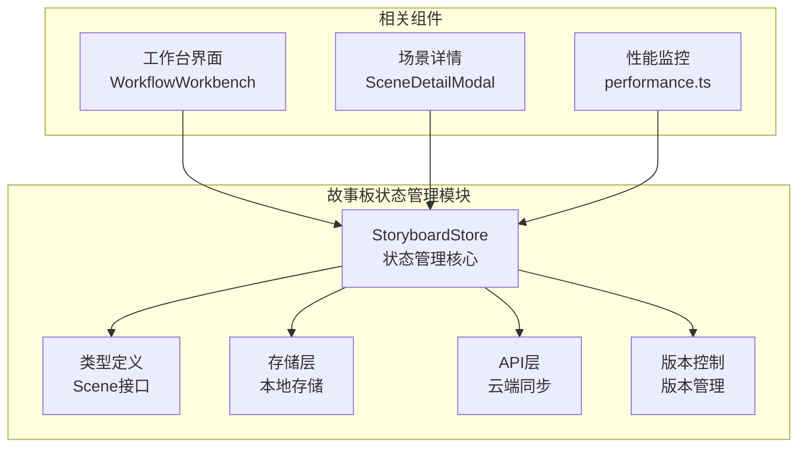
```mermaid
graph TB
subgraph "故事板状态管理模块"
A[StoryboardStore<br/>状态管理核心]
B[类型定义<br/>Scene接口]
C[存储层<br/>本地存储]
D[API层<br/>云端同步]
E[版本控制<br/>版本管理]
end
subgraph "相关组件"
F[工作台界面<br/>WorkflowWorkbench]
G[场景详情<br/>SceneDetailModal]
H[性能监控<br/>performance.ts]
end
A --> B
A --> C
A --> D
A --> E
F --> A
G --> A
H --> A
```

**图表来源**

- [apps/web/src/stores/storyboardStore.ts](file://apps/web/src/stores/storyboardStore.ts#L1-L321)
- [apps/web/src/types/index.ts](file://apps/web/src/types/index.ts#L586-L618)

**章节来源**

- [apps/web/src/stores/storyboardStore.ts](file://apps/web/src/stores/storyboardStore.ts#L1-L50)
- [apps/web/src/types/index.ts](file://apps/web/src/types/index.ts#L1-L100)

## 核心组件

### StoryboardStore 状态管理器

StoryboardStore是整个模块的核心，基于Zustand状态管理库构建，提供了完整的故事板生命周期管理功能：

#### 主要职责

- **场景管理**：创建、更新、删除和重新排序场景
- **状态跟踪**：管理场景的生成状态和处理进度
- **配置管理**：处理场景细化的跳过步骤和手动覆盖
- **数据同步**：协调本地存储和云端API的数据同步

#### 核心数据结构

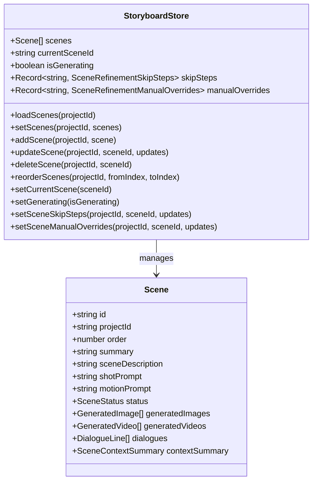
```mermaid
classDiagram
class StoryboardStore {
+Scene[] scenes
+string currentSceneId
+boolean isGenerating
+Record~string, SceneRefinementSkipSteps~ skipSteps
+Record~string, SceneRefinementManualOverrides~ manualOverrides
+loadScenes(projectId)
+setScenes(projectId, scenes)
+addScene(projectId, scene)
+updateScene(projectId, sceneId, updates)
+deleteScene(projectId, sceneId)
+reorderScenes(projectId, fromIndex, toIndex)
+setCurrentScene(sceneId)
+setGenerating(isGenerating)
+setSceneSkipSteps(projectId, sceneId, updates)
+setSceneManualOverrides(projectId, sceneId, updates)
}
class Scene {
+string id
+string projectId
+number order
+string summary
+string sceneDescription
+string shotPrompt
+string motionPrompt
+SceneStatus status
+GeneratedImage[] generatedImages
+GeneratedVideo[] generatedVideos
+DialogueLine[] dialogues
+SceneContextSummary contextSummary
}
StoryboardStore --> Scene : manages
```

**图表来源**

- [apps/web/src/stores/storyboardStore.ts](file://apps/web/src/stores/storyboardStore.ts#L17-L43)
- [apps/web/src/types/index.ts](file://apps/web/src/types/index.ts#L586-L618)

#### 关键操作方法

| 方法名          | 功能描述               | 参数                                                        | 返回值 |
| --------------- | ---------------------- | ----------------------------------------------------------- | ------ |
| loadScenes      | 加载项目中的所有场景   | projectId: string                                           | void   |
| setScenes       | 设置场景列表并重新编号 | projectId: string, scenes: Scene[]                          | void   |
| addScene        | 添加新场景             | projectId: string, sceneData: Omit<Scene, 'id'>             | Scene  |
| updateScene     | 更新场景属性           | projectId: string, sceneId: string, updates: Partial<Scene> | void   |
| deleteScene     | 删除场景               | projectId: string, sceneId: string                          | void   |
| reorderScenes   | 重新排序场景           | projectId: string, fromIndex: number, toIndex: number       | void   |
| setCurrentScene | 设置当前选中场景       | sceneId: string \| null                                     | void   |
| setGenerating   | 设置生成状态           | isGenerating: boolean                                       | void   |

**章节来源**

- [apps/web/src/stores/storyboardStore.ts](file://apps/web/src/stores/storyboardStore.ts#L25-L321)

### 类型系统和数据模型

#### Scene 接口定义

Scene接口定义了故事板场景的完整数据结构：

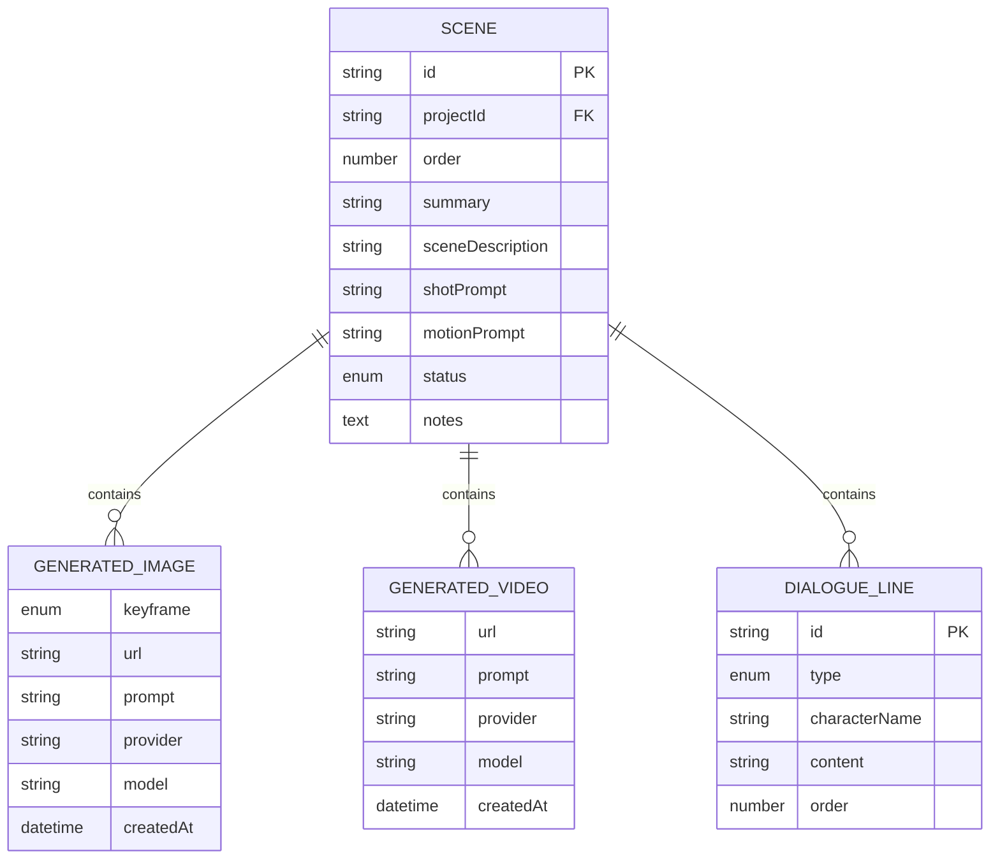
```mermaid
erDiagram
SCENE {
string id PK
string projectId FK
number order
string summary
string sceneDescription
string shotPrompt
string motionPrompt
enum status
text notes
}
GENERATED_IMAGE {
enum keyframe
string url
string prompt
string provider
string model
datetime createdAt
}
GENERATED_VIDEO {
string url
string prompt
string provider
string model
datetime createdAt
}
DIALOGUE_LINE {
string id PK
enum type
string characterName
string content
number order
}
SCENE ||--o{ GENERATED_IMAGE : contains
SCENE ||--o{ GENERATED_VIDEO : contains
SCENE ||--o{ DIALOGUE_LINE : contains
```

**图表来源**

- [apps/web/src/types/index.ts](file://apps/web/src/types/index.ts#L586-L618)

#### 场景状态枚举

场景状态定义了故事板的处理阶段：

| 状态值              | 描述         | 用途                 |
| ------------------- | ------------ | -------------------- |
| pending             | 待处理       | 新创建的场景初始状态 |
| scene_generating    | 场景生成中   | 正在生成场景描述     |
| scene_confirmed     | 场景已确认   | 场景描述已确认       |
| keyframe_generating | 关键帧生成中 | 正在生成关键帧提示词 |
| keyframe_confirmed  | 关键帧已确认 | 关键帧提示词已确认   |
| motion_generating   | 运动生成中   | 正在生成运动提示词   |
| completed           | 已完成       | 所有处理步骤完成     |
| needs_update        | 需要更新     | 需要重新处理的场景   |

**章节来源**

- [apps/web/src/types/index.ts](file://apps/web/src/types/index.ts#L328-L337)

### 存储层架构

#### 本地存储策略

存储层采用了混合存储策略，结合了localStorage和批量处理机制：

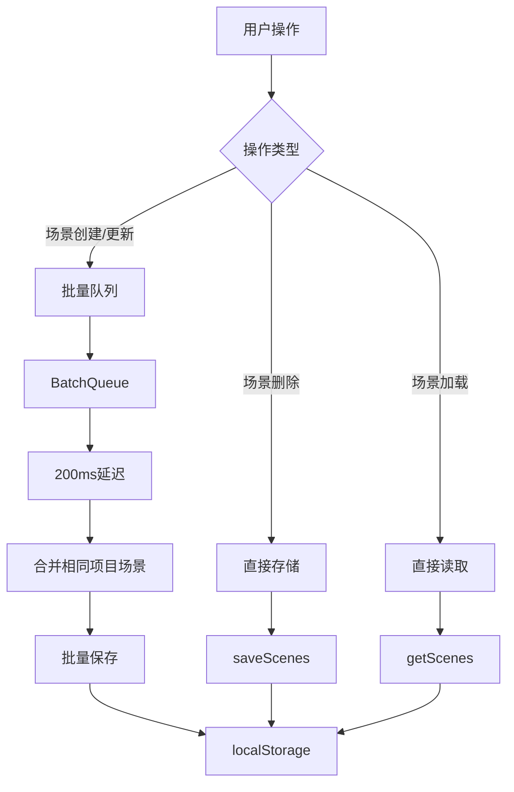
```mermaid
flowchart TD
A[用户操作] --> B{操作类型}
B --> |场景创建/更新| C[批量队列]
B --> |场景删除| D[直接存储]
B --> |场景加载| E[直接读取]
C --> F[BatchQueue]
F --> G[200ms延迟]
G --> H[合并相同项目场景]
H --> I[批量保存]
D --> J[saveScenes]
E --> K[getScenes]
I --> L[localStorage]
J --> L
K --> L
```

**图表来源**

- [apps/web/src/lib/storage.ts](file://apps/web/src/lib/storage.ts#L39-L113)

#### API 同步机制

API层提供了云端同步功能，支持多用户协作：

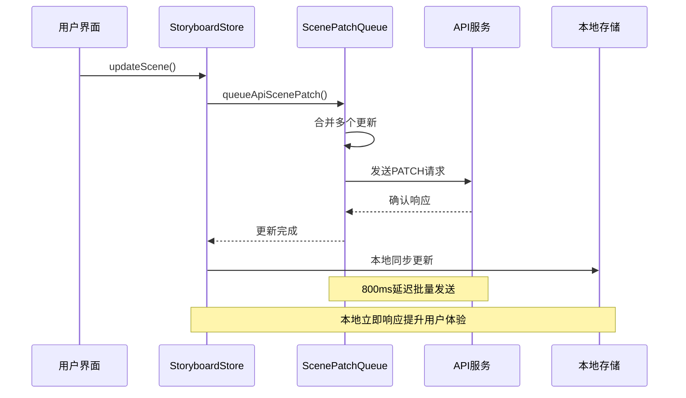
```mermaid
sequenceDiagram
participant UI as 用户界面
participant Store as StoryboardStore
participant Queue as ScenePatchQueue
participant API as API服务
participant Storage as 本地存储
UI->>Store : updateScene()
Store->>Queue : queueApiScenePatch()
Queue->>Queue : 合并多个更新
Queue->>API : 发送PATCH请求
API-->>Queue : 确认响应
Queue-->>Store : 更新完成
Store->>Storage : 本地同步更新
Note over Queue,API : 800ms延迟批量发送
Note over Store,Storage : 本地立即响应提升用户体验
```

**图表来源**

- [apps/web/src/lib/api/scenePatchQueue.ts](file://apps/web/src/lib/api/scenePatchQueue.ts#L45-L88)
- [apps/web/src/lib/api/scenes.ts](file://apps/web/src/lib/api/scenes.ts#L35-L60)

**章节来源**

- [apps/web/src/lib/storage.ts](file://apps/web/src/lib/storage.ts#L1-L1015)
- [apps/web/src/lib/api/scenes.ts](file://apps/web/src/lib/api/scenes.ts#L1-L75)
- [apps/web/src/lib/api/scenePatchQueue.ts](file://apps/web/src/lib/api/scenePatchQueue.ts#L1-L89)

## 架构概览

### 整体架构设计

故事板状态管理模块采用分层架构设计，确保了模块间的松耦合和高内聚：

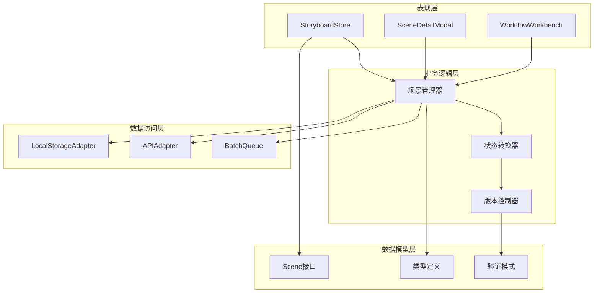
```mermaid
graph TB
subgraph "表现层"
A[StoryboardStore]
B[SceneDetailModal]
C[WorkflowWorkbench]
end
subgraph "业务逻辑层"
D[场景管理器]
E[状态转换器]
F[版本控制器]
end
subgraph "数据访问层"
G[LocalStorageAdapter]
H[APIAdapter]
I[BatchQueue]
end
subgraph "数据模型层"
J[Scene接口]
K[类型定义]
L[验证模式]
end
A --> D
B --> D
C --> D
D --> E
E --> F
D --> G
D --> H
D --> I
A --> J
D --> K
F --> L
```

**图表来源**

- [apps/web/src/stores/storyboardStore.ts](file://apps/web/src/stores/storyboardStore.ts#L45-L321)
- [apps/web/src/components/editor/SceneDetailModal.tsx](file://apps/web/src/components/editor/SceneDetailModal.tsx#L490-L561)

### 数据流管理

模块实现了完整的数据流管理，包括数据的创建、更新、删除和同步：

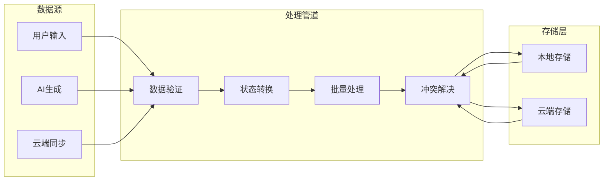
```mermaid
flowchart LR
subgraph "数据源"
A[用户输入]
B[AI生成]
C[云端同步]
end
subgraph "处理管道"
D[数据验证]
E[状态转换]
F[批量处理]
G[冲突解决]
end
subgraph "存储层"
H[本地存储]
I[云端存储]
end
A --> D
B --> D
C --> D
D --> E
E --> F
F --> G
G --> H
G --> I
H --> G
I --> G
```

**图表来源**

- [apps/web/src/lib/storage.ts](file://apps/web/src/lib/storage.ts#L77-L113)
- [apps/web/src/lib/api/scenePatchQueue.ts](file://apps/web/src/lib/api/scenePatchQueue.ts#L32-L40)

**章节来源**

- [apps/web/src/stores/storyboardStore.ts](file://apps/web/src/stores/storyboardStore.ts#L1-L321)

## 详细组件分析

### 场景生命周期管理

#### 场景创建流程

场景创建过程涉及多个步骤，确保数据的完整性和一致性：

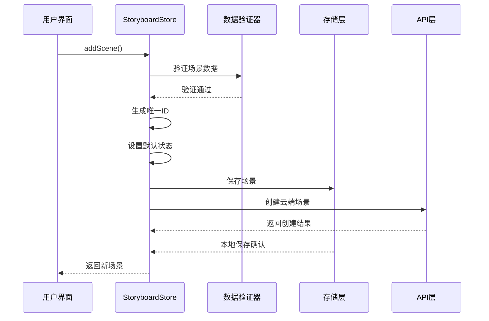
```mermaid
sequenceDiagram
participant UI as 用户界面
participant Store as StoryboardStore
participant Validator as 数据验证器
participant Storage as 存储层
participant API as API层
UI->>Store : addScene()
Store->>Validator : 验证场景数据
Validator-->>Store : 验证通过
Store->>Store : 生成唯一ID
Store->>Store : 设置默认状态
Store->>Storage : 保存场景
Store->>API : 创建云端场景
API-->>Store : 返回创建结果
Storage-->>Store : 本地保存确认
Store-->>UI : 返回新场景
```

**图表来源**

- [apps/web/src/stores/storyboardStore.ts](file://apps/web/src/stores/storyboardStore.ts#L188-L208)

#### 场景更新机制

场景更新采用了智能的批量处理和冲突检测机制：

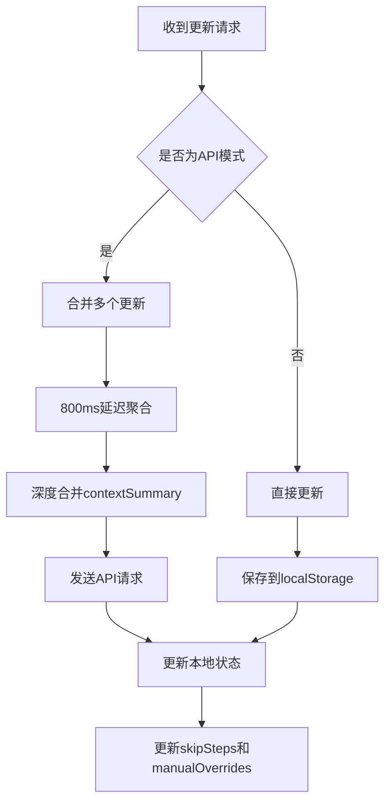
```mermaid
flowchart TD
A[收到更新请求] --> B{是否为API模式}
B --> |是| C[合并多个更新]
B --> |否| D[直接更新]
C --> E[800ms延迟聚合]
E --> F[深度合并contextSummary]
F --> G[发送API请求]
D --> H[保存到localStorage]
G --> I[更新本地状态]
H --> I
I --> J[更新skipSteps和manualOverrides]
```

**图表来源**

- [apps/web/src/lib/api/scenePatchQueue.ts](file://apps/web/src/lib/api/scenePatchQueue.ts#L32-L63)
- [apps/web/src/stores/storyboardStore.ts](file://apps/web/src/stores/storyboardStore.ts#L210-L238)

**章节来源**

- [apps/web/src/stores/storyboardStore.ts](file://apps/web/src/stores/storyboardStore.ts#L188-L238)
- [apps/web/src/lib/api/scenePatchQueue.ts](file://apps/web/src/lib/api/scenePatchQueue.ts#L1-L89)

### 版本控制系统

#### 版本管理架构

版本控制系统为故事板提供了完整的版本追踪和恢复能力：

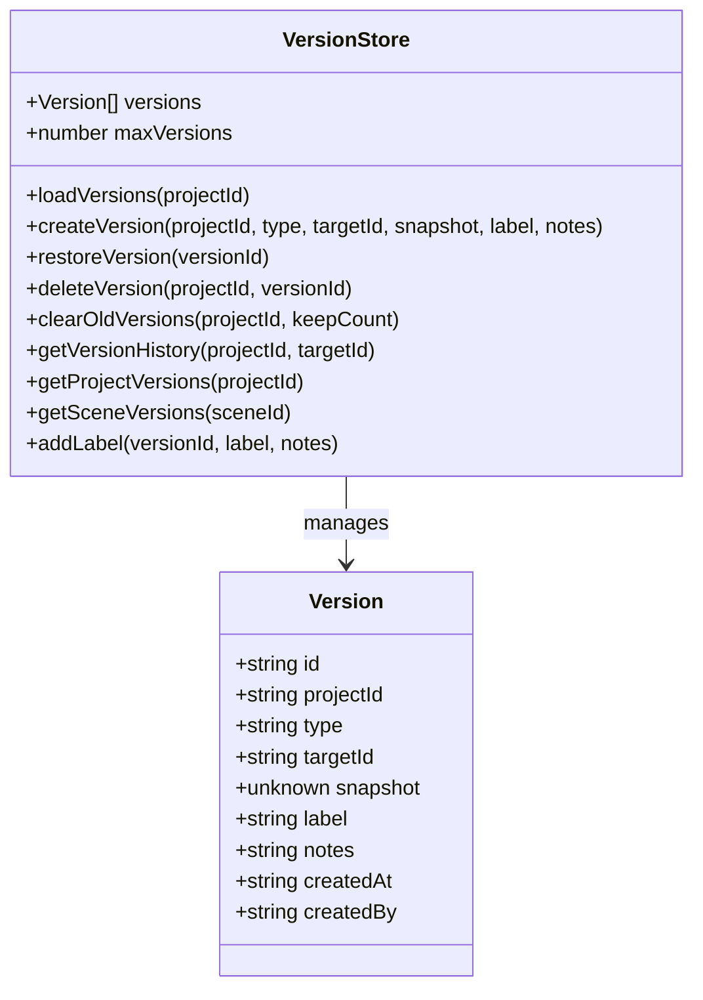
```mermaid
classDiagram
class Version {
+string id
+string projectId
+string type
+string targetId
+unknown snapshot
+string label
+string notes
+string createdAt
+string createdBy
}
class VersionStore {
+Version[] versions
+number maxVersions
+loadVersions(projectId)
+createVersion(projectId, type, targetId, snapshot, label, notes)
+restoreVersion(versionId)
+deleteVersion(projectId, versionId)
+clearOldVersions(projectId, keepCount)
+getVersionHistory(projectId, targetId)
+getProjectVersions(projectId)
+getSceneVersions(sceneId)
+addLabel(versionId, label, notes)
}
VersionStore --> Version : manages
```

**图表来源**

- [apps/web/src/stores/versionStore.ts](file://apps/web/src/stores/versionStore.ts#L5-L26)

#### 版本创建和恢复流程

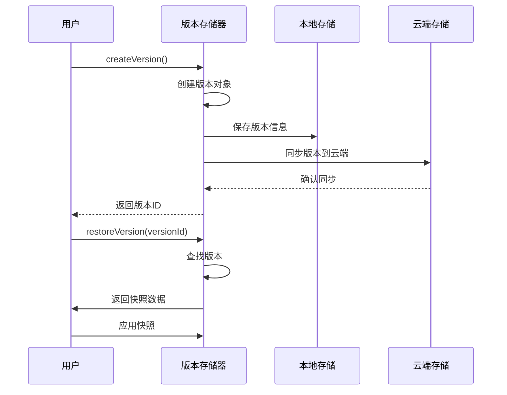
```mermaid
sequenceDiagram
participant User as 用户
participant VersionStore as 版本存储器
participant LocalStorage as 本地存储
participant Cloud as 云端存储
User->>VersionStore : createVersion()
VersionStore->>VersionStore : 创建版本对象
VersionStore->>LocalStorage : 保存版本信息
VersionStore->>Cloud : 同步版本到云端
Cloud-->>VersionStore : 确认同步
VersionStore-->>User : 返回版本ID
User->>VersionStore : restoreVersion(versionId)
VersionStore->>VersionStore : 查找版本
VersionStore->>User : 返回快照数据
User->>VersionStore : 应用快照
```

**图表来源**

- [apps/web/src/stores/versionStore.ts](file://apps/web/src/stores/versionStore.ts#L42-L81)

**章节来源**

- [apps/web/src/stores/versionStore.ts](file://apps/web/src/stores/versionStore.ts#L1-L139)

### 工作流集成

#### 与工作台的集成

故事板状态管理模块与工作台界面紧密集成，提供完整的创作体验：

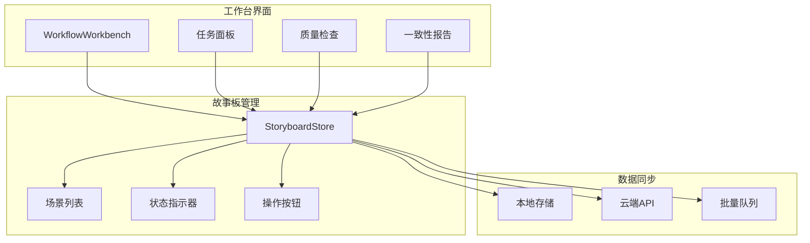
```mermaid
graph TB
subgraph "工作台界面"
A[WorkflowWorkbench]
B[任务面板]
C[质量检查]
D[一致性报告]
end
subgraph "故事板管理"
E[StoryboardStore]
F[场景列表]
G[状态指示器]
H[操作按钮]
end
subgraph "数据同步"
I[本地存储]
J[云端API]
K[批量队列]
end
A --> E
B --> E
C --> E
D --> E
E --> F
E --> G
E --> H
E --> I
E --> J
E --> K
```

**图表来源**

- [apps/web/src/components/editor/WorkflowWorkbench.tsx](file://apps/web/src/components/editor/WorkflowWorkbench.tsx#L217-L304)

#### 实时预览功能

模块支持实时预览功能，允许用户即时查看故事板的变化：

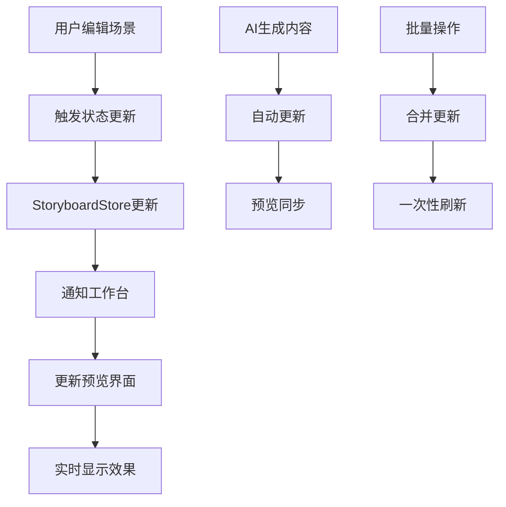
```mermaid
flowchart TD
A[用户编辑场景] --> B[触发状态更新]
B --> C[StoryboardStore更新]
C --> D[通知工作台]
D --> E[更新预览界面]
E --> F[实时显示效果]
G[AI生成内容] --> H[自动更新]
H --> I[预览同步]
J[批量操作] --> K[合并更新]
K --> L[一次性刷新]
```

**图表来源**

- [apps/web/src/stores/storyboardStore.ts](file://apps/web/src/stores/storyboardStore.ts#L210-L238)

**章节来源**

- [apps/web/src/components/editor/WorkflowWorkbench.tsx](file://apps/web/src/components/editor/WorkflowWorkbench.tsx#L1-L664)

## 依赖关系分析

### 核心依赖关系

故事板状态管理模块的依赖关系体现了清晰的分层架构：

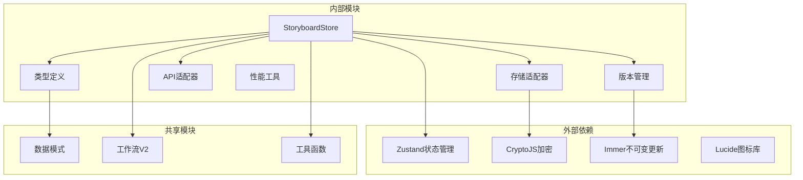
```mermaid
graph TB
subgraph "外部依赖"
A[Zustand状态管理]
B[CryptoJS加密]
C[Immer不可变更新]
D[Lucide图标库]
end
subgraph "内部模块"
E[StoryboardStore]
F[类型定义]
G[存储适配器]
H[API适配器]
I[性能工具]
J[版本管理]
end
subgraph "共享模块"
K[数据模式]
L[工作流V2]
M[工具函数]
end
E --> A
E --> F
E --> G
E --> H
E --> J
G --> B
J --> C
F --> K
E --> L
E --> M
```

**图表来源**

- [apps/web/src/stores/storyboardStore.ts](file://apps/web/src/stores/storyboardStore.ts#L1-L11)
- [apps/web/src/lib/storage.ts](file://apps/web/src/lib/storage.ts#L1-L4)

### 数据验证和类型安全

模块采用了严格的类型系统确保数据完整性：

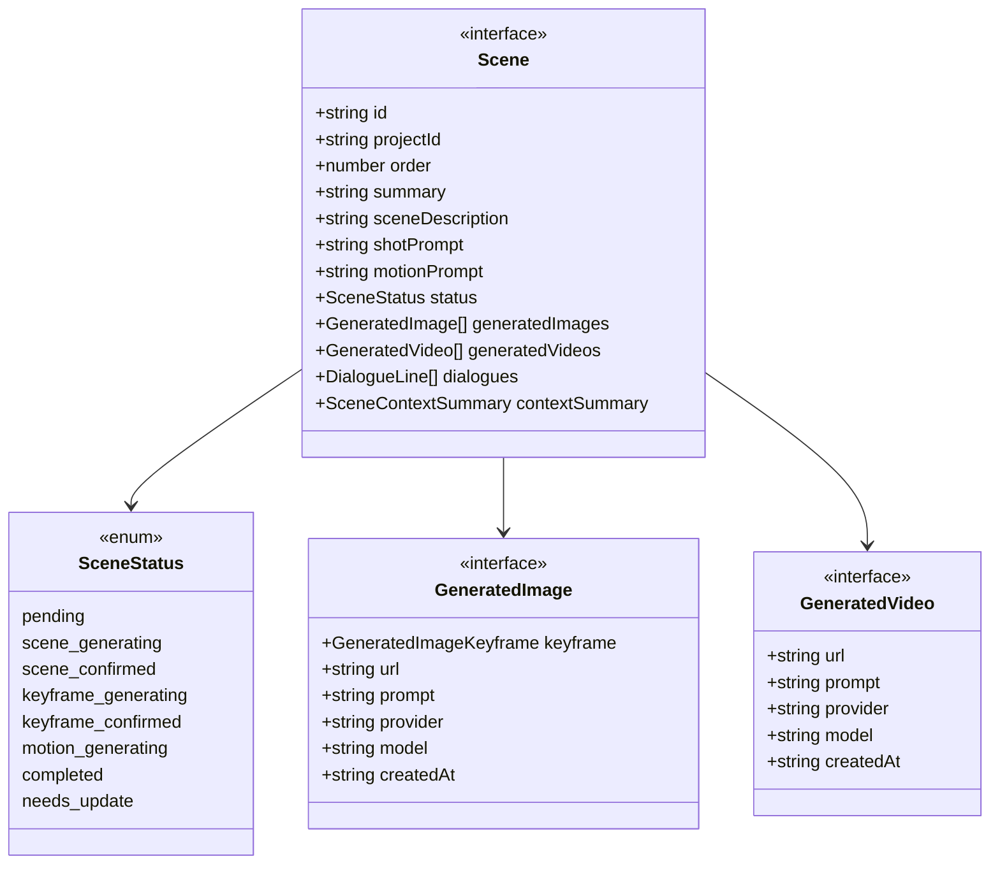
```mermaid
classDiagram
class Scene {
<<interface>>
+string id
+string projectId
+number order
+string summary
+string sceneDescription
+string shotPrompt
+string motionPrompt
+SceneStatus status
+GeneratedImage[] generatedImages
+GeneratedVideo[] generatedVideos
+DialogueLine[] dialogues
+SceneContextSummary contextSummary
}
class SceneStatus {
<<enum>>
pending
scene_generating
scene_confirmed
keyframe_generating
keyframe_confirmed
motion_generating
completed
needs_update
}
class GeneratedImage {
<<interface>>
+GeneratedImageKeyframe keyframe
+string url
+string prompt
+string provider
+string model
+string createdAt
}
class GeneratedVideo {
<<interface>>
+string url
+string prompt
+string provider
+string model
+string createdAt
}
Scene --> SceneStatus
Scene --> GeneratedImage
Scene --> GeneratedVideo
```

**图表来源**

- [apps/web/src/types/index.ts](file://apps/web/src/types/index.ts#L328-L337)
- [apps/web/src/types/index.ts](file://apps/web/src/types/index.ts#L586-L618)

**章节来源**

- [apps/web/src/types/index.ts](file://apps/web/src/types/index.ts#L586-L618)

## 性能考虑

### 批量处理优化

模块采用了多种性能优化策略：

#### 1. 批量队列处理

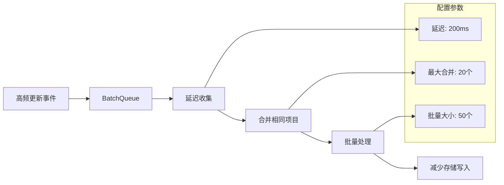
```mermaid
flowchart LR
A[高频更新事件] --> B[BatchQueue]
B --> C[延迟收集]
C --> D[合并相同项目]
D --> E[批量处理]
E --> F[减少存储写入]
subgraph "配置参数"
G[延迟: 200ms]
H[最大合并: 20个]
I[批量大小: 50个]
end
C --> G
D --> H
E --> I
```

**图表来源**

- [apps/web/src/lib/storage.ts](file://apps/web/src/lib/storage.ts#L39-L64)

#### 2. 防抖机制

对于项目级别的频繁更新，采用了防抖机制：

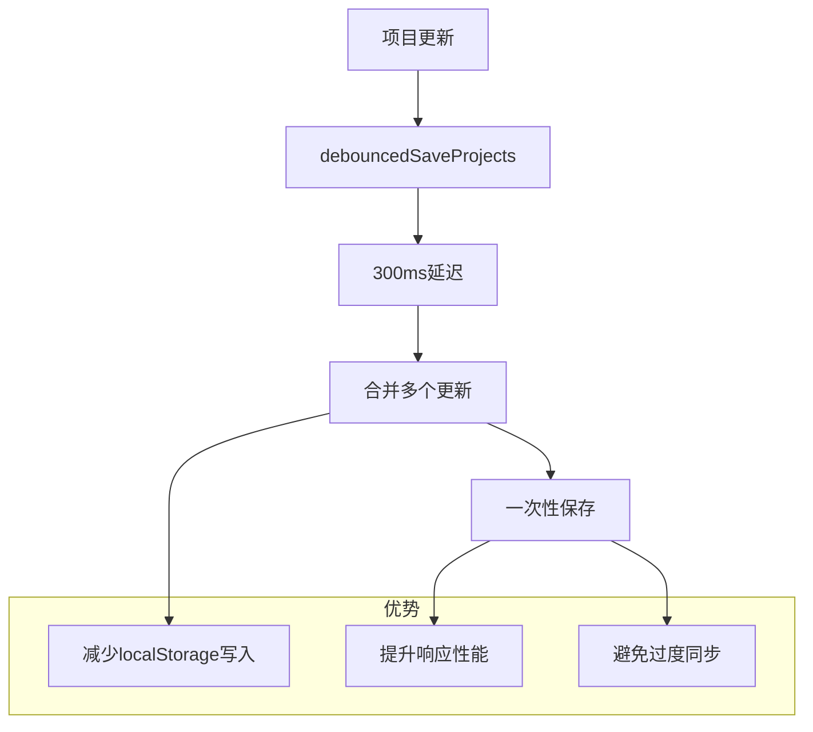
```mermaid
flowchart TD
A[项目更新] --> B[debouncedSaveProjects]
B --> C[300ms延迟]
C --> D[合并多个更新]
D --> E[一次性保存]
subgraph "优势"
F[减少localStorage写入]
G[提升响应性能]
H[避免过度同步]
end
D --> F
E --> G
E --> H
```

**图表来源**

- [apps/web/src/lib/storage.ts](file://apps/web/src/lib/storage.ts#L16-L37)

#### 3. 内存管理

模块实现了智能的内存管理策略：

| 策略     | 实现方式                | 优势             |
| -------- | ----------------------- | ---------------- |
| 懒加载   | 仅在需要时加载场景数据  | 减少初始内存占用 |
| 缓存机制 | 使用Map结构缓存场景引用 | 提升查找性能     |
| 垃圾回收 | 及时清理不再使用的数据  | 防止内存泄漏     |
| 分页加载 | 大量场景时分批加载      | 改善滚动性能     |

**章节来源**

- [apps/web/src/lib/storage.ts](file://apps/web/src/lib/storage.ts#L1-L1015)

## 故障排除指南

### 常见问题和解决方案

#### 1. 数据同步问题

**问题症状**：本地和云端数据不一致

**诊断步骤**：

1. 检查网络连接状态
2. 验证API响应状态
3. 查看批量队列中的待处理项

**解决方案**：

- 重启应用以重置状态
- 手动触发数据同步
- 清除本地缓存后重新加载

#### 2. 性能问题

**问题症状**：界面响应缓慢或卡顿

**诊断步骤**：

1. 检查场景数量是否过多
2. 监控批量队列长度
3. 分析内存使用情况

**优化方案**：

- 实施分页加载
- 减少不必要的重渲染
- 使用虚拟化技术

#### 3. 数据丢失风险

**预防措施**：

- 定期创建版本快照
- 启用自动备份功能
- 监控存储空间使用

**恢复流程**：

1. 检查版本历史
2. 选择合适的版本
3. 执行版本恢复操作

**章节来源**

- [apps/web/src/stores/storyboardStore.test.ts](file://apps/web/src/stores/storyboardStore.test.ts#L686-L763)

### 调试工具和技巧

#### 1. 开发者工具

模块提供了丰富的调试功能：

- **状态监控**：实时查看store状态变化
- **性能分析**：监控渲染性能和内存使用
- **网络调试**：跟踪API请求和响应
- **存储检查**：验证本地数据完整性

#### 2. 错误处理策略

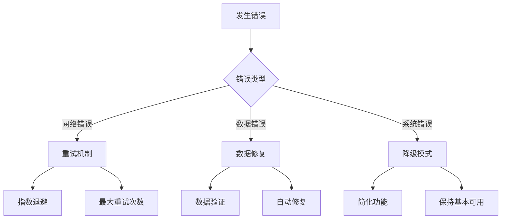
```mermaid
flowchart TD
A[发生错误] --> B{错误类型}
B --> |网络错误| C[重试机制]
B --> |数据错误| D[数据修复]
B --> |系统错误| E[降级模式]
C --> F[指数退避]
C --> G[最大重试次数]
D --> H[数据验证]
D --> I[自动修复]
E --> J[简化功能]
E --> K[保持基本可用]
```

**图表来源**

- [apps/web/src/lib/api/scenePatchQueue.ts](file://apps/web/src/lib/api/scenePatchQueue.ts#L75-L88)

## 结论

AIXSSS项目的故事板状态管理模块展现了现代前端应用的最佳实践：

### 核心优势

1. **架构清晰**：采用分层设计，职责分离明确
2. **性能优秀**：多重优化策略确保流畅体验
3. **扩展性强**：模块化设计支持功能扩展
4. **可靠性高**：完善的错误处理和数据保护机制
5. **用户体验佳**：实时反馈和智能预览功能

### 技术亮点

- **智能存储策略**：结合本地和云端存储的优势
- **高效批量处理**：通过队列机制优化性能
- **严格类型系统**：确保数据完整性和类型安全
- **实时协作支持**：为多用户协作奠定基础
- **版本控制集成**：完整的数据追踪和恢复能力

### 应用场景

该模块适用于以下场景：

- **独立创作者**：个人故事板创作和管理
- **小型团队**：协作编辑和版本控制
- **工作室环境**：大规模项目管理和协作
- **教育机构**：教学演示和学习案例

通过持续的优化和改进，这个模块为AIXSSS项目提供了坚实的技术基础，支持复杂的创意工作流程和高质量的用户体验。

## 附录

### API 接口规范

#### 场景管理 API

| 端点                                   | 方法   | 描述             | 请求体               | 响应体     |
| -------------------------------------- | ------ | ---------------- | -------------------- | ---------- |
| `/projects/:projectId/scenes`          | GET    | 获取项目场景列表 | 无                   | Scene[]    |
| `/projects/:projectId/scenes`          | POST   | 创建新场景       | Scene                | Scene      |
| `/projects/:projectId/scenes/:sceneId` | PATCH  | 更新场景         | Partial<Scene>       | Scene      |
| `/projects/:projectId/scenes/:sceneId` | DELETE | 删除场景         | 无                   | {ok: true} |
| `/projects/:projectId/scenes/reorder`  | POST   | 重新排序场景     | {sceneIds: string[]} | Scene[]    |

### 配置选项

#### 性能配置

| 配置项     | 默认值 | 描述                     |
| ---------- | ------ | ------------------------ |
| 批量延迟   | 200ms  | 场景批量处理延迟         |
| 最大合并数 | 20个   | 单次批量处理的最大场景数 |
| 队列容量   | 50个   | 场景补丁队列的最大容量   |
| 版本保留数 | 50个   | 每个项目保留的版本数量   |

#### 存储配置

| 配置项     | 默认值   | 描述               |
| ---------- | -------- | ------------------ |
| 存储版本   | 1.2.0    | 数据存储的版本号   |
| 备份保留数 | 3个      | 自动备份的最大数量 |
| 加密密钥   | 自动生成 | 数据加密的密钥管理 |

### 最佳实践

1. **数据验证**：始终验证输入数据的完整性和正确性
2. **错误处理**：实现全面的错误处理和用户反馈机制
3. **性能监控**：定期监控性能指标并进行优化
4. **版本管理**：在关键节点创建版本快照
5. **测试覆盖**：保持高覆盖率的单元测试和集成测试
