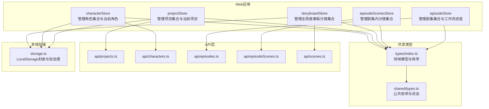
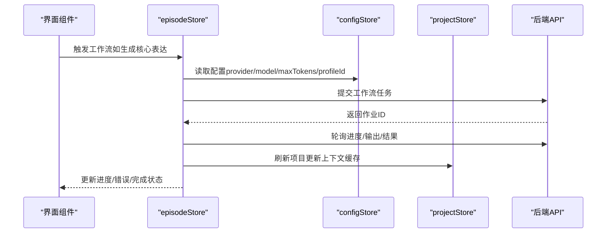
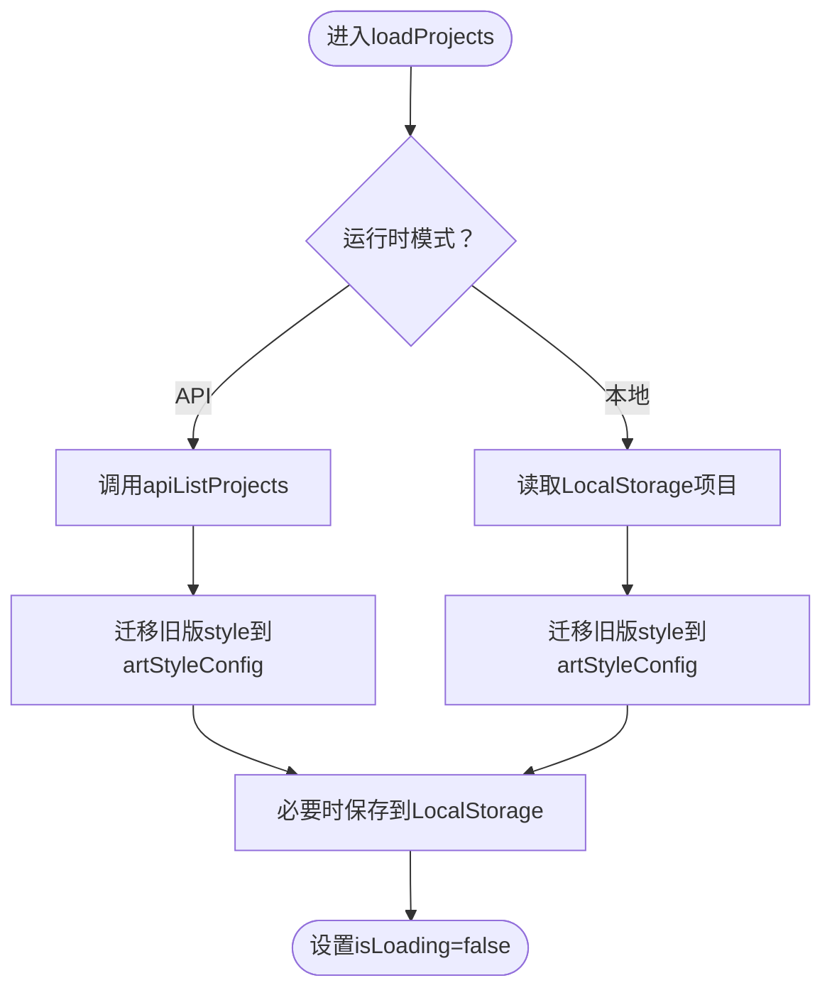
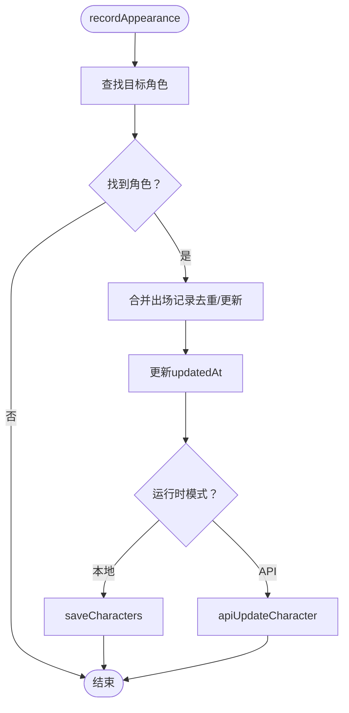
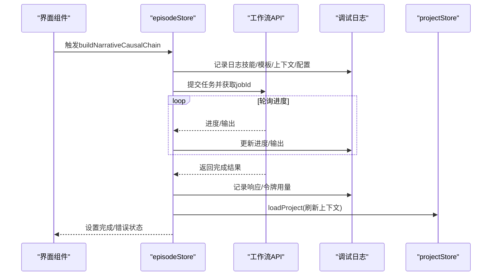
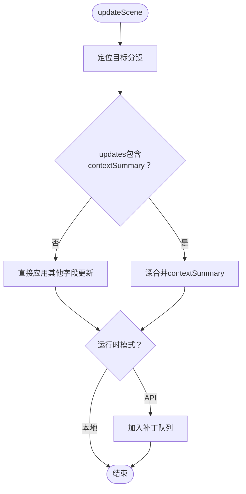
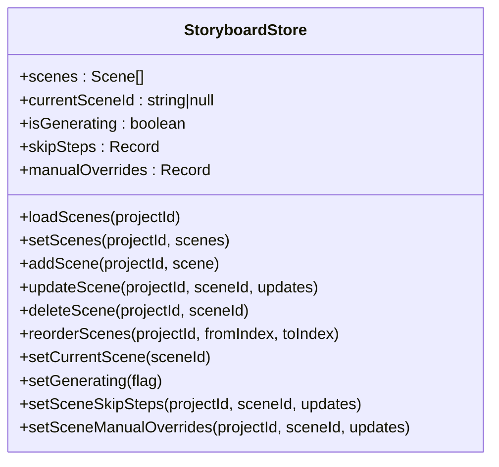
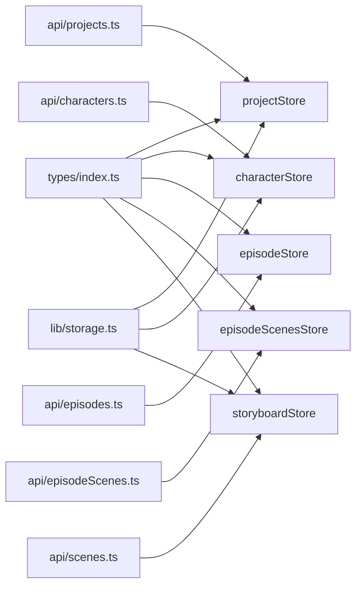

# 核心Store模块

<cite>
**本文档引用的文件**
- [apps/web/src/stores/projectStore.ts](file://apps/web/src/stores/projectStore.ts)
- [apps/web/src/stores/characterStore.ts](file://apps/web/src/stores/characterStore.ts)
- [apps/web/src/stores/episodeStore.ts](file://apps/web/src/stores/episodeStore.ts)
- [apps/web/src/stores/episodeScenesStore.ts](file://apps/web/src/stores/episodeScenesStore.ts)
- [apps/web/src/stores/storyboardStore.ts](file://apps/web/src/stores/storyboardStore.ts)
- [apps/web/src/types/index.ts](file://apps/web/src/types/index.ts)
- [packages/shared/src/types.ts](file://packages/shared/src/types.ts)
- [apps/web/src/lib/api/projects.ts](file://apps/web/src/lib/api/projects.ts)
- [apps/web/src/lib/api/characters.ts](file://apps/web/src/lib/api/characters.ts)
- [apps/web/src/lib/api/episodes.ts](file://apps/web/src/lib/api/episodes.ts)
- [apps/web/src/lib/api/episodeScenes.ts](file://apps/web/src/lib/api/episodeScenes.ts)
- [apps/web/src/lib/api/scenes.ts](file://apps/web/src/lib/api/scenes.ts)
- [apps/web/src/lib/storage.ts](file://apps/web/src/lib/storage.ts)
</cite>

## 目录

1. [简介](#简介)
2. [项目结构](#项目结构)
3. [核心组件](#核心组件)
4. [架构总览](#架构总览)
5. [详细组件分析](#详细组件分析)
6. [依赖关系分析](#依赖关系分析)
7. [性能考量](#性能考量)
8. [故障排查指南](#故障排查指南)
9. [结论](#结论)
10. [附录](#附录)

## 简介

本文件面向AIXSSS项目的核心状态管理模块，系统性梳理并解读以下五个关键store：

- 项目状态管理（projectStore）
- 角色状态管理（characterStore）
- 剧集状态管理（episodeStore）
- 剧集分镜状态管理（episodeScenesStore）
- 故事板状态管理（storyboardStore）

我们将从设计原理、状态结构、action定义、selector优化思路、异步操作处理、store间依赖关系、数据同步机制与状态一致性保障等方面进行深入解析，并提供状态流转图、数据模型示例与最佳实践。

## 项目结构

核心store位于Web端应用的stores目录，围绕Zustand构建，采用create函数创建状态容器。各store分别管理Project、Character、Episode、Scene等实体及其关联关系，并通过统一的运行时模式（isApiMode）在本地LocalStorage与后端API之间切换。

图表来源

- [apps/web/src/stores/projectStore.ts](file://apps/web/src/stores/projectStore.ts#L1-L181)
- [apps/web/src/stores/characterStore.ts](file://apps/web/src/stores/characterStore.ts#L1-L346)
- [apps/web/src/stores/episodeStore.ts](file://apps/web/src/stores/episodeStore.ts#L1-L504)
- [apps/web/src/stores/episodeScenesStore.ts](file://apps/web/src/stores/episodeScenesStore.ts#L1-L157)
- [apps/web/src/stores/storyboardStore.ts](file://apps/web/src/stores/storyboardStore.ts#L1-L321)
- [apps/web/src/types/index.ts](file://apps/web/src/types/index.ts#L453-L618)
- [packages/shared/src/types.ts](file://packages/shared/src/types.ts#L6-L77)
- [apps/web/src/lib/api/projects.ts](file://apps/web/src/lib/api/projects.ts#L1-L53)
- [apps/web/src/lib/api/characters.ts](file://apps/web/src/lib/api/characters.ts#L1-L76)
- [apps/web/src/lib/api/episodes.ts](file://apps/web/src/lib/api/episodes.ts#L1-L63)
- [apps/web/src/lib/api/episodeScenes.ts](file://apps/web/src/lib/api/episodeScenes.ts#L1-L95)
- [apps/web/src/lib/api/scenes.ts](file://apps/web/src/lib/api/scenes.ts#L1-L75)
- [apps/web/src/lib/storage.ts](file://apps/web/src/lib/storage.ts#L1-L1015)

章节来源

- [apps/web/src/stores/projectStore.ts](file://apps/web/src/stores/projectStore.ts#L1-L181)
- [apps/web/src/stores/characterStore.ts](file://apps/web/src/stores/characterStore.ts#L1-L346)
- [apps/web/src/stores/episodeStore.ts](file://apps/web/src/stores/episodeStore.ts#L1-L504)
- [apps/web/src/stores/episodeScenesStore.ts](file://apps/web/src/stores/episodeScenesStore.ts#L1-L157)
- [apps/web/src/stores/storyboardStore.ts](file://apps/web/src/stores/storyboardStore.ts#L1-L321)

## 核心组件

本节概述五个store的职责边界与关键能力：

- projectStore：负责项目集合加载、当前项目切换、项目CRUD、样式配置迁移与API/本地模式切换。
- characterStore：负责角色集合加载、角色CRUD、角色出场记录与定妆照提示词维护、项目维度查询。
- episodeStore：负责剧集集合加载、剧集CRUD、工作流任务（规划/生成/因果链）调度与进度追踪、错误与运行状态管理。
- episodeScenesStore：负责剧集内分镜集合加载、新增/更新/删除/重排、上下文摘要深合并与后端补丁队列。
- storyboardStore：负责全局故事板分镜集合管理、跳过步骤与手动覆盖配置、场景重排与批量更新、API/本地模式切换。

章节来源

- [apps/web/src/stores/projectStore.ts](file://apps/web/src/stores/projectStore.ts#L32-L44)
- [apps/web/src/stores/characterStore.ts](file://apps/web/src/stores/characterStore.ts#L122-L145)
- [apps/web/src/stores/episodeStore.ts](file://apps/web/src/stores/episodeStore.ts#L69-L122)
- [apps/web/src/stores/episodeScenesStore.ts](file://apps/web/src/stores/episodeScenesStore.ts#L32-L48)
- [apps/web/src/stores/storyboardStore.ts](file://apps/web/src/stores/storyboardStore.ts#L17-L43)

## 架构总览

store间存在明确的依赖与协作关系：

- episodeStore依赖configStore与projectStore，用于工作流日志、令牌用量与刷新项目上下文。
- episodeScenesStore与storyboardStore均依赖API或LocalStorage，实现分镜的增删改与重排。
- projectStore与characterStore分别管理Project与Character集合，支撑上层工作流与展示。

图表来源

- [apps/web/src/stores/episodeStore.ts](file://apps/web/src/stores/episodeStore.ts#L210-L267)
- [apps/web/src/stores/episodeStore.ts](file://apps/web/src/stores/episodeStore.ts#L432-L502)

章节来源

- [apps/web/src/stores/episodeStore.ts](file://apps/web/src/stores/episodeStore.ts#L25-L27)

## 详细组件分析

### 项目状态管理（projectStore）

- 状态结构
  - projects：项目数组
  - currentProject：当前项目或null
  - isLoading：加载状态
- 关键Action
  - loadProjects：按运行时模式加载项目，API模式调用apiListProjects，否则读取LocalStorage并迁移旧版style到artStyleConfig
  - loadProject：按ID加载单个项目，支持迁移与持久化
  - create/update/delete：创建/更新/删除项目，自动维护updatedAt与本地/远程同步
  - setCurrentProject：设置当前项目
- 异步与一致性
  - API模式下采用最佳努力持久化，错误捕获并回滚UI状态
  - 旧版style字段迁移至artStyleConfig，确保后续一致性
- selector优化建议
  - 使用当前项目ID派生计算属性（如当前项目状态机、工作流阶段）
  - 将项目列表与当前项目拆分为独立selector，避免无关渲染

图表来源

- [apps/web/src/stores/projectStore.ts](file://apps/web/src/stores/projectStore.ts#L51-L81)
- [apps/web/src/stores/projectStore.ts](file://apps/web/src/stores/projectStore.ts#L83-L106)
- [apps/web/src/stores/projectStore.ts](file://apps/web/src/stores/projectStore.ts#L108-L134)

章节来源

- [apps/web/src/stores/projectStore.ts](file://apps/web/src/stores/projectStore.ts#L32-L44)
- [apps/web/src/stores/projectStore.ts](file://apps/web/src/stores/projectStore.ts#L51-L180)
- [apps/web/src/lib/api/projects.ts](file://apps/web/src/lib/api/projects.ts#L1-L53)
- [apps/web/src/lib/storage.ts](file://apps/web/src/lib/storage.ts#L484-L542)

### 角色状态管理（characterStore）

- 状态结构
  - characters：角色数组
  - currentCharacterId：当前角色ID或null
  - isLoading：加载状态
- 关键Action
  - loadCharacters：按项目ID加载角色，API模式调用apiListCharacters，本地模式读取localStorage并标准化
  - add/update/delete：角色CRUD，支持本地持久化与API同步
  - recordAppearance：记录角色在某场景中的出场（主/配角/背景）
  - updatePortraitPrompts：更新角色定妆照提示词
  - getCharactersByProject：按项目筛选角色
- 数据规范化
  - normalizeCharacter：将任意输入标准化为Character结构，处理portraitPrompts、relationships、appearances等字段
- 异步与一致性
  - API模式下优先调用后端，失败时回退到本地加载
  - 出场记录与定妆照更新均支持本地持久化与API同步

图表来源

- [apps/web/src/stores/characterStore.ts](file://apps/web/src/stores/characterStore.ts#L261-L303)
- [apps/web/src/stores/characterStore.ts](file://apps/web/src/stores/characterStore.ts#L339-L346)

章节来源

- [apps/web/src/stores/characterStore.ts](file://apps/web/src/stores/characterStore.ts#L122-L145)
- [apps/web/src/stores/characterStore.ts](file://apps/web/src/stores/characterStore.ts#L152-L337)
- [apps/web/src/lib/api/characters.ts](file://apps/web/src/lib/api/characters.ts#L1-L76)
- [apps/web/src/lib/storage.ts](file://apps/web/src/lib/storage.ts#L339-L346)

### 剧集状态管理（episodeStore）

- 状态结构
  - episodes：剧集数组
  - currentEpisodeId：当前剧集ID或null
  - isLoading/isRunningWorkflow/error/lastJobId/lastJobProgress：工作流与作业状态
- 关键Action
  - loadEpisodes：按项目ID加载剧集，切换项目时清空旧ID避免404
  - create/update/delete：剧集CRUD
  - 工作流：planEpisodes、generateCoreExpression、generateCoreExpressionBatch、generateSceneList、buildNarrativeCausalChain
- 异步与进度
  - 所有工作流通过apiWorkflow\*接口提交，使用apiWaitForAIJob轮询进度
  - 日志系统记录技能名、模板、填充提示、上下文与令牌用量
  - 完成后刷新项目上下文（刷新项目以获取最新因果链）
- 错误处理
  - 统一捕获错误并更新error字段，finally关闭isRunningWorkflow

图表来源

- [apps/web/src/stores/episodeStore.ts](file://apps/web/src/stores/episodeStore.ts#L432-L502)

章节来源

- [apps/web/src/stores/episodeStore.ts](file://apps/web/src/stores/episodeStore.ts#L69-L122)
- [apps/web/src/stores/episodeStore.ts](file://apps/web/src/stores/episodeStore.ts#L133-L208)
- [apps/web/src/stores/episodeStore.ts](file://apps/web/src/stores/episodeStore.ts#L210-L502)
- [apps/web/src/lib/api/episodes.ts](file://apps/web/src/lib/api/episodes.ts#L1-L63)
- [apps/web/src/lib/api/workflow.ts](file://apps/web/src/lib/api/workflow.ts#L1-L200)

### 剧集分镜状态管理（episodeScenesStore）

- 状态结构
  - scenes：分镜数组
  - isLoading/error：加载状态与错误
- 关键Action
  - loadScenes：按项目+剧集加载分镜
  - addScene：创建新分镜并插入队列
  - updateScene：更新分镜，支持contextSummary深合并
  - deleteScene：删除分镜并重排，异步重排API
  - reorderScenes：拖拽重排，异步重排API
  - setScenes：直接设置分镜集合
- 深合并策略
  - 对contextSummary进行对象深合并，避免覆盖子字段
- 异步与一致性
  - API模式下通过queueApiEpisodeScenePatch异步补丁，减少频繁请求

图表来源

- [apps/web/src/stores/episodeScenesStore.ts](file://apps/web/src/stores/episodeScenesStore.ts#L96-L121)

章节来源

- [apps/web/src/stores/episodeScenesStore.ts](file://apps/web/src/stores/episodeScenesStore.ts#L32-L48)
- [apps/web/src/stores/episodeScenesStore.ts](file://apps/web/src/stores/episodeScenesStore.ts#L55-L155)
- [apps/web/src/lib/api/episodeScenes.ts](file://apps/web/src/lib/api/episodeScenes.ts#L1-L95)

### 故事板状态管理（storyboardStore）

- 状态结构
  - scenes：分镜数组
  - currentSceneId：当前分镜ID或null
  - isGenerating：生成中标志
  - skipSteps/manualOverrides：按场景的细化配置映射
- 关键Action
  - loadScenes：按项目ID加载分镜，同时提取skipSteps与manualOverrides
  - setScenes/addScene/updateScene/deleteScene/reorderScenes：分镜集合管理
  - setCurrentScene/setGenerating：当前分镜与生成状态
  - setSceneSkipSteps/setSceneManualOverrides：基于contextSummary的细化配置更新
- 异步与一致性
  - updateScene支持本地批处理与API补丁队列，自动同步skipSteps/manualOverrides
  - 重排时同步调用reorder API并刷新映射

图表来源

- [apps/web/src/stores/storyboardStore.ts](file://apps/web/src/stores/storyboardStore.ts#L17-L43)

章节来源

- [apps/web/src/stores/storyboardStore.ts](file://apps/web/src/stores/storyboardStore.ts#L17-L43)
- [apps/web/src/stores/storyboardStore.ts](file://apps/web/src/stores/storyboardStore.ts#L114-L320)
- [apps/web/src/lib/api/scenes.ts](file://apps/web/src/lib/api/scenes.ts#L1-L75)

## 依赖关系分析

- 类型依赖
  - 所有store共享apps/web/src/types/index.ts中的领域模型（Project/Character/Episode/Scene等）与packages/shared/src/types.ts中的公共枚举（工作流状态、场景状态等）
- API依赖
  - projectStore依赖api/projects.ts
  - characterStore依赖api/characters.ts
  - episodeStore依赖api/episodes.ts与api/workflow.ts
  - episodeScenesStore依赖api/episodeScenes.ts
  - storyboardStore依赖api/scenes.ts
- 本地存储依赖
  - projectStore/characterStore/storyboardStore依赖lib/storage.ts进行LocalStorage读写与批处理
- 运行时模式
  - isApiMode决定走API还是LocalStorage，贯穿所有store的CRUD与加载逻辑

图表来源

- [apps/web/src/types/index.ts](file://apps/web/src/types/index.ts#L453-L618)
- [packages/shared/src/types.ts](file://packages/shared/src/types.ts#L6-L77)
- [apps/web/src/lib/api/projects.ts](file://apps/web/src/lib/api/projects.ts#L1-L53)
- [apps/web/src/lib/api/characters.ts](file://apps/web/src/lib/api/characters.ts#L1-L76)
- [apps/web/src/lib/api/episodes.ts](file://apps/web/src/lib/api/episodes.ts#L1-L63)
- [apps/web/src/lib/api/episodeScenes.ts](file://apps/web/src/lib/api/episodeScenes.ts#L1-L95)
- [apps/web/src/lib/api/scenes.ts](file://apps/web/src/lib/api/scenes.ts#L1-L75)
- [apps/web/src/lib/storage.ts](file://apps/web/src/lib/storage.ts#L1-L1015)

章节来源

- [apps/web/src/types/index.ts](file://apps/web/src/types/index.ts#L453-L618)
- [packages/shared/src/types.ts](file://packages/shared/src/types.ts#L6-L77)
- [apps/web/src/lib/api/projects.ts](file://apps/web/src/lib/api/projects.ts#L1-L53)
- [apps/web/src/lib/api/characters.ts](file://apps/web/src/lib/api/characters.ts#L1-L76)
- [apps/web/src/lib/api/episodes.ts](file://apps/web/src/lib/api/episodes.ts#L1-L63)
- [apps/web/src/lib/api/episodeScenes.ts](file://apps/web/src/lib/api/episodeScenes.ts#L1-L95)
- [apps/web/src/lib/api/scenes.ts](file://apps/web/src/lib/api/scenes.ts#L1-L75)
- [apps/web/src/lib/storage.ts](file://apps/web/src/lib/storage.ts#L1-L1015)

## 性能考量

- 批处理与防抖
  - storyboardStore.updateScene支持本地批处理队列，减少频繁写入
  - storage.ts提供sceneSaveQueue与scenePatchQueue，合并多次更新
  - projectStore.saveProjectBatched使用debounce合并项目更新
- 异步幂等与最佳努力
  - API模式下store先更新本地状态，再异步持久化，失败时捕获错误并回退
- 深合并与选择器
  - episodeScenesStore.updateScene对contextSummary进行深合并，避免局部更新丢失
  - 建议在UI层使用selector按需读取，避免不必要的重渲染

章节来源

- [apps/web/src/lib/storage.ts](file://apps/web/src/lib/storage.ts#L39-L113)
- [apps/web/src/lib/storage.ts](file://apps/web/src/lib/storage.ts#L16-L37)
- [apps/web/src/stores/episodeScenesStore.ts](file://apps/web/src/stores/episodeScenesStore.ts#L96-L121)
- [apps/web/src/stores/storyboardStore.ts](file://apps/web/src/stores/storyboardStore.ts#L210-L238)

## 故障排查指南

- API模式不可用
  - episodeStore部分工作流在非API模式会抛错，确认isApiMode状态
- 加载失败
  - projectStore/characterStore/episodeStore在加载失败时会设置error或控制isLoading，检查网络与后端连通性
- 数据不一致
  - API模式下若后端失败，store会回退到本地加载；建议在UI层监听error并提示用户
- 重排异常
  - episodeScenesStore与storyboardStore在删除/重排后会异步调用reorder API，若失败可在控制台查看错误日志

章节来源

- [apps/web/src/stores/episodeStore.ts](file://apps/web/src/stores/episodeStore.ts#L210-L213)
- [apps/web/src/stores/episodeStore.ts](file://apps/web/src/stores/episodeStore.ts#L133-L163)
- [apps/web/src/stores/episodeScenesStore.ts](file://apps/web/src/stores/episodeScenesStore.ts#L123-L155)
- [apps/web/src/stores/storyboardStore.ts](file://apps/web/src/stores/storyboardStore.ts#L240-L275)

## 结论

本核心store模块以Zustand为基础，围绕Project/Character/Episode/Scene构建了清晰的领域状态管理，具备：

- 明确的职责边界与强类型约束
- API/本地双模式切换与一致性保障
- 丰富的异步工作流与进度追踪
- 批处理与深合并优化
- 可扩展的selector与性能优化空间

建议在实际使用中结合UI层selector进行细粒度订阅，配合错误处理与重试策略，确保复杂工作流下的稳定性与用户体验。

## 附录

- 数据模型示例（字段与含义）
  - Project：项目基本信息、工作流状态、当前场景序号与步骤、上下文缓存
  - Character：角色基本信息、外观与个性、关系与出场记录、定妆照提示词
  - Episode：剧集基本信息、工作流状态、大纲与核心表达、上下文缓存
  - Scene：分镜基本信息、角色出场、关键帧与运动提示词、生成产物、上下文摘要与状态
- 实际使用场景最佳实践
  - 在工作流开始前，先loadProjects/loadEpisodes确保上下文完整
  - 使用setGenerating与isRunningWorkflow控制UI交互状态
  - 对高频编辑场景（如分镜文本）优先使用本地批处理队列
  - 在API模式下，遇到错误时回退到本地状态并提示用户

章节来源

- [apps/web/src/types/index.ts](file://apps/web/src/types/index.ts#L453-L618)
- [apps/web/src/types/index.ts](file://apps/web/src/types/index.ts#L852-L891)
- [apps/web/src/types/index.ts](file://apps/web/src/types/index.ts#L620-L637)
- [apps/web/src/types/index.ts](file://apps/web/src/types/index.ts#L585-L618)
