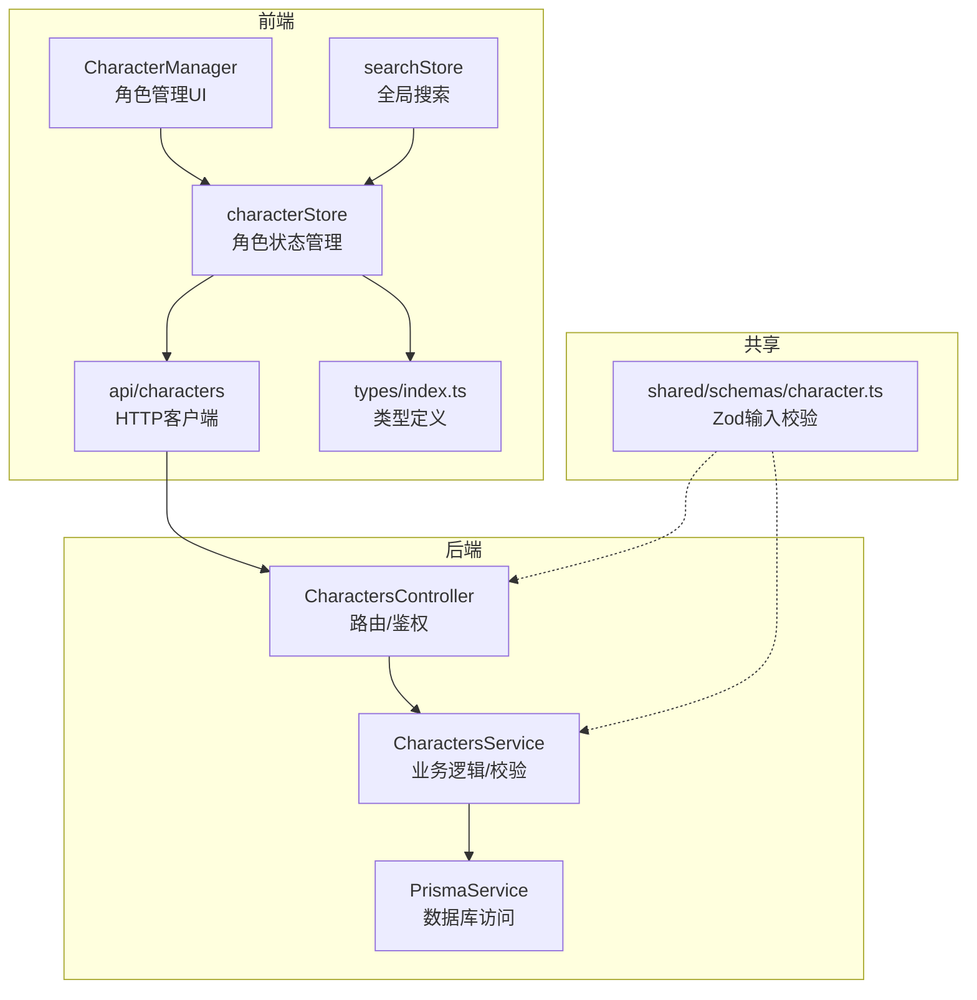
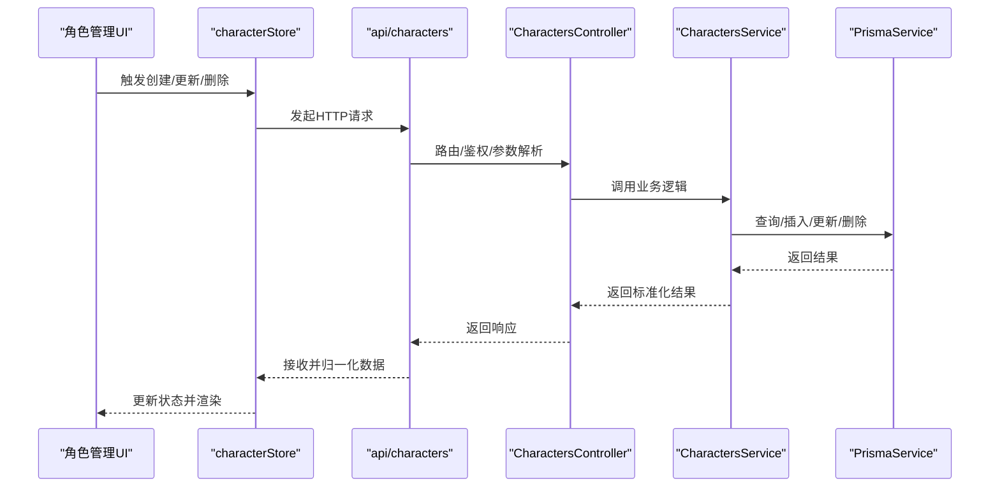
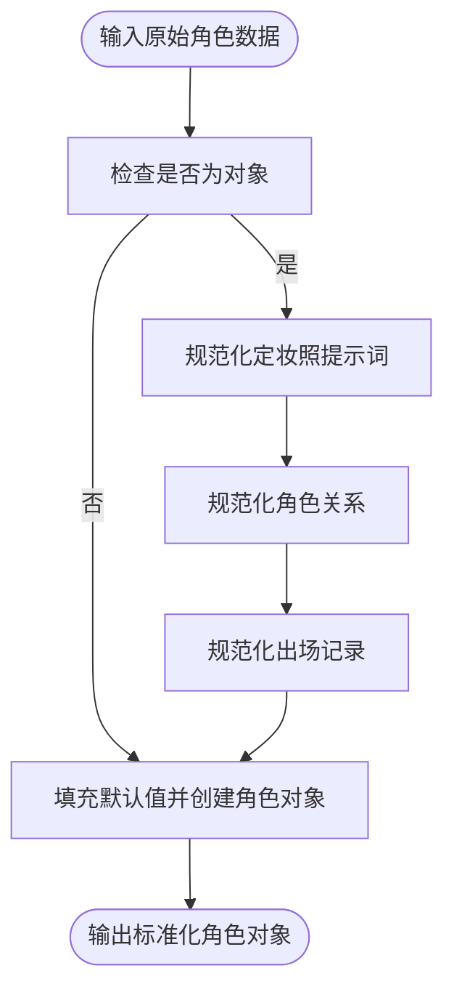
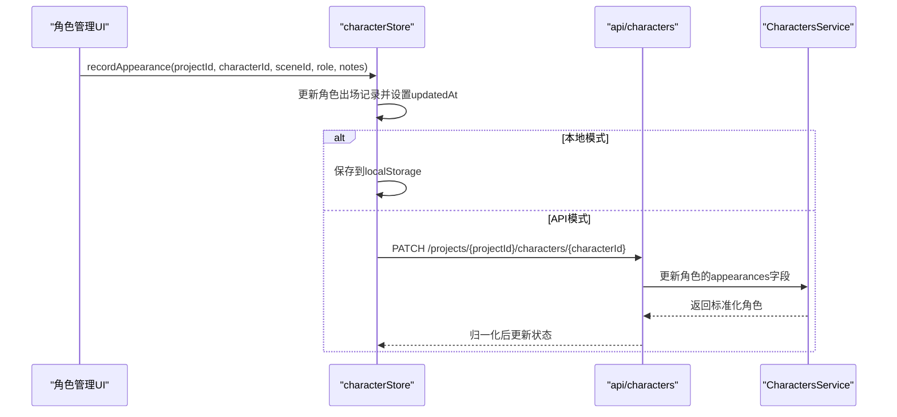
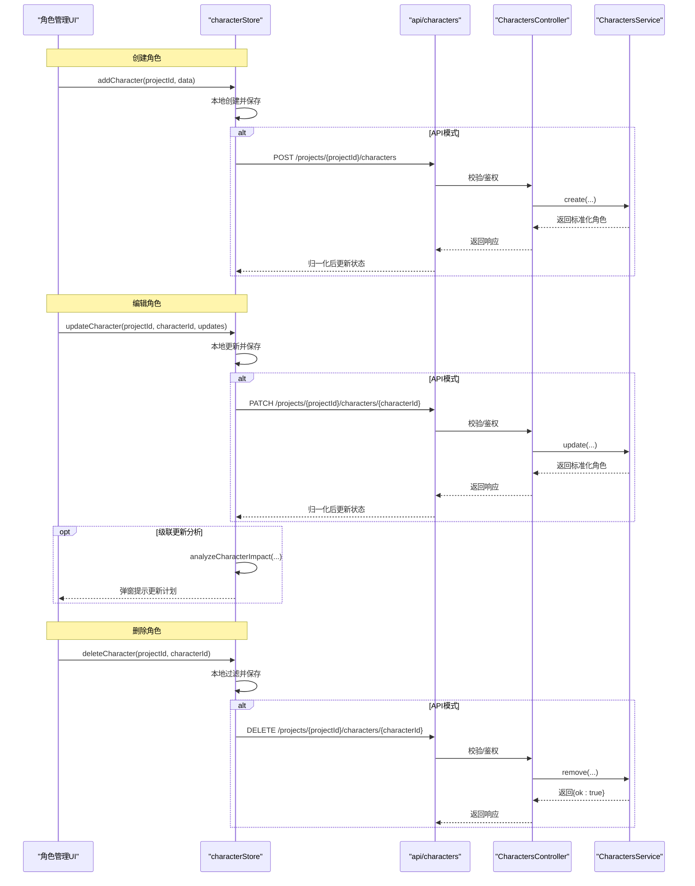
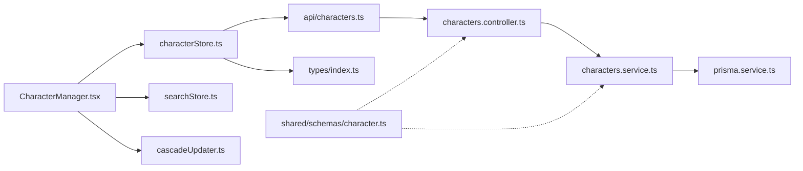

# 角色状态管理

<cite>
**本文档引用的文件**
- [apps/web/src/stores/characterStore.ts](file://apps/web/src/stores/characterStore.ts)
- [apps/api/src/characters/characters.controller.ts](file://apps/api/src/characters/characters.controller.ts)
- [apps/api/src/characters/characters.service.ts](file://apps/api/src/characters/characters.service.ts)
- [apps/web/src/lib/api/characters.ts](file://apps/web/src/lib/api/characters.ts)
- [packages/shared/src/schemas/character.ts](file://packages/shared/src/schemas/character.ts)
- [apps/web/src/types/index.ts](file://apps/web/src/types/index.ts)
- [apps/web/src/components/editor/CharacterManager.tsx](file://apps/web/src/components/editor/CharacterManager.tsx)
- [apps/web/src/lib/storage.ts](file://apps/web/src/lib/storage.ts)
- [apps/web/src/lib/ai/cascadeUpdater.ts](file://apps/web/src/lib/ai/cascadeUpdater.ts)
- [apps/web/src/lib/characterCreateDraft.ts](file://apps/web/src/lib/characterCreateDraft.ts)
- [apps/web/src/stores/searchStore.ts](file://apps/web/src/stores/searchStore.ts)
</cite>

## 目录

1. [简介](#简介)
2. [项目结构](#项目结构)
3. [核心组件](#核心组件)
4. [架构总览](#架构总览)
5. [详细组件分析](#详细组件分析)
6. [依赖分析](#依赖分析)
7. [性能考虑](#性能考虑)
8. [故障排查指南](#故障排查指南)
9. [结论](#结论)
10. [附录](#附录)

## 简介

本文件面向AIXSSS项目中的角色状态管理模块，系统性阐述characterStore的设计原理与实现细节，覆盖角色数据结构、角色关系管理、出场记录跟踪、角色搜索功能、角色创建/编辑/删除流程、角色与项目/场景的关联关系、本地存储与API同步机制、实时更新与缓存策略、性能优化、最佳实践、数据一致性保障与常见问题解决方案。文档同时提供代码级架构图与流程图，帮助开发者与产品人员快速理解与高效维护。

## 项目结构

角色状态管理涉及前端Zustand状态管理、共享类型定义、API层控制器与服务、以及与画布节点、AI级联更新等模块的协作关系。整体采用“前端状态 + 后端API + 共享Schema”的分层设计，确保数据一致性与扩展性。

图表来源

- [apps/web/src/stores/characterStore.ts](file://apps/web/src/stores/characterStore.ts#L147-L337)
- [apps/web/src/lib/api/characters.ts](file://apps/web/src/lib/api/characters.ts#L1-L76)
- [apps/api/src/characters/characters.controller.ts](file://apps/api/src/characters/characters.controller.ts#L1-L47)
- [apps/api/src/characters/characters.service.ts](file://apps/api/src/characters/characters.service.ts#L23-L115)
- [packages/shared/src/schemas/character.ts](file://packages/shared/src/schemas/character.ts#L1-L32)

章节来源

- [apps/web/src/stores/characterStore.ts](file://apps/web/src/stores/characterStore.ts#L1-L346)
- [apps/api/src/characters/characters.controller.ts](file://apps/api/src/characters/characters.controller.ts#L1-L47)
- [apps/api/src/characters/characters.service.ts](file://apps/api/src/characters/characters.service.ts#L1-L118)
- [apps/web/src/lib/api/characters.ts](file://apps/web/src/lib/api/characters.ts#L1-L76)
- [packages/shared/src/schemas/character.ts](file://packages/shared/src/schemas/character.ts#L1-L32)

## 核心组件

- 角色状态存储（characterStore）：负责角色数据的本地/云端持久化、增删改查、出场记录与定妆照提示词更新、当前角色切换、按项目筛选等。
- 角色管理UI（CharacterManager）：提供角色创建/编辑/删除、AI生成角色卡、级联更新影响分析与确认、草稿保存与恢复等。
- API客户端（api/characters）：封装HTTP请求，统一序列化/反序列化角色数据。
- 控制器与服务（CharactersController/CharactersService）：后端路由、鉴权、输入校验、业务逻辑与数据库访问。
- 类型与校验（types/index.ts、shared/schemas/character.ts）：定义角色数据结构、Zod输入校验规则。
- 级联更新（cascadeUpdater）：分析角色变更对分镜的影响，生成更新计划并标记需要更新的分镜。
- 搜索（searchStore）：全局搜索项目与分镜，支持按状态过滤，为角色管理提供上下文。

章节来源

- [apps/web/src/stores/characterStore.ts](file://apps/web/src/stores/characterStore.ts#L122-L145)
- [apps/web/src/components/editor/CharacterManager.tsx](file://apps/web/src/components/editor/CharacterManager.tsx#L230-L239)
- [apps/web/src/lib/api/characters.ts](file://apps/web/src/lib/api/characters.ts#L1-L76)
- [apps/api/src/characters/characters.controller.ts](file://apps/api/src/characters/characters.controller.ts#L1-L47)
- [apps/api/src/characters/characters.service.ts](file://apps/api/src/characters/characters.service.ts#L23-L115)
- [apps/web/src/lib/ai/cascadeUpdater.ts](file://apps/web/src/lib/ai/cascadeUpdater.ts#L331-L401)
- [apps/web/src/stores/searchStore.ts](file://apps/web/src/stores/searchStore.ts#L10-L28)

## 架构总览

角色状态管理遵循“前端Zustand状态 + 后端REST API + 共享Schema”的架构。前端通过characterStore协调UI与API，API层通过控制器与服务完成鉴权、输入校验与数据库操作，共享Schema确保前后端一致的输入约束。

图表来源

- [apps/web/src/stores/characterStore.ts](file://apps/web/src/stores/characterStore.ts#L181-L213)
- [apps/web/src/lib/api/characters.ts](file://apps/web/src/lib/api/characters.ts#L12-L38)
- [apps/api/src/characters/characters.controller.ts](file://apps/api/src/characters/characters.controller.ts#L19-L34)
- [apps/api/src/characters/characters.service.ts](file://apps/api/src/characters/characters.service.ts#L44-L102)

## 详细组件分析

### 角色数据结构与规范化

- 角色数据结构：包含基础信息（名称、简述、头像）、外观/性格/背景描述、主题色与画风相关字段、定妆照提示词（PortraitPrompts）、角色关系数组（CharacterRelationship）、出场记录数组（SceneAppearance）等。
- 规范化函数：
  - normalizePortraitPrompts：将多种输入形式（字符串、对象、数组）统一为PortraitPrompts结构，并清洗空值与非法字段。
  - normalizeRelationships：清洗关系数组，确保每条关系包含目标角色ID与关系类型。
  - normalizeAppearances：清洗出场记录，限定角色在场景中的角色定位（主/配角/背景）。
  - normalizeCharacter：统一角色对象，填充默认值与时间戳，确保字段完整性。

图表来源

- [apps/web/src/stores/characterStore.ts](file://apps/web/src/stores/characterStore.ts#L45-L120)

章节来源

- [apps/web/src/stores/characterStore.ts](file://apps/web/src/stores/characterStore.ts#L94-L120)
- [apps/web/src/types/index.ts](file://apps/web/src/types/index.ts#L474-L517)

### 角色关系管理

- 角色关系（CharacterRelationship）：包含目标角色ID、关系类型、描述等字段，用于表达角色间的相互关系。
- 规范化策略：仅保留有效的关系记录，缺失必要字段的关系将被过滤。
- 使用场景：在角色管理UI中展示关系标签，辅助构建角色上下文与级联更新分析。

章节来源

- [apps/web/src/stores/characterStore.ts](file://apps/web/src/stores/characterStore.ts#L61-L72)
- [apps/web/src/components/editor/CharacterManager.tsx](file://apps/web/src/components/editor/CharacterManager.tsx#L2966-L2975)

### 出场记录跟踪

- 出场记录（SceneAppearance）：记录角色在特定场景中的出场情况，包含场景ID、角色定位（主/配角/背景）、备注等。
- 更新策略：recordAppearance会去重更新，若场景已存在则覆盖，否则新增；同时更新角色的updatedAt时间戳。
- 与级联更新联动：当角色外观/主题色/性格/名称等字段发生变化时，基于出场记录分析受影响的分镜并标记needs_update。

图表来源

- [apps/web/src/stores/characterStore.ts](file://apps/web/src/stores/characterStore.ts#L261-L303)
- [apps/web/src/lib/api/characters.ts](file://apps/web/src/lib/api/characters.ts#L40-L68)
- [apps/api/src/characters/characters.service.ts](file://apps/api/src/characters/characters.service.ts#L78-L101)

章节来源

- [apps/web/src/stores/characterStore.ts](file://apps/web/src/stores/characterStore.ts#L261-L303)
- [apps/web/src/lib/ai/cascadeUpdater.ts](file://apps/web/src/lib/ai/cascadeUpdater.ts#L331-L401)

### 角色搜索功能

- 项目内角色搜索：CharacterManager组件内部根据当前项目筛选角色列表，便于在画布节点中展示与操作。
- 全局搜索：searchStore提供项目与分镜的全局搜索能力，支持按状态过滤，为角色管理提供上下文。
- 展示限制：画布节点中角色列表仅展示前20个，并提示后续版本将增加筛选/搜索功能。

章节来源

- [apps/web/src/components/editor/CharacterManager.tsx](file://apps/web/src/components/editor/CharacterManager.tsx#L396-L400)
- [apps/web/src/stores/searchStore.ts](file://apps/web/src/stores/searchStore.ts#L52-L98)
- [apps/web/src/components/canvas/nodes/CharactersNode.tsx](file://apps/web/src/components/canvas/nodes/CharactersNode.tsx#L135-L139)

### 角色创建、编辑、删除流程

- 创建流程：
  - 前端：addCharacter生成唯一ID、设置时间戳、初始化空关系与出场数组，先本地更新状态；若为API模式，异步调用后端创建并归一化后回填。
  - 后端：控制器解析输入并通过Zod校验，服务层创建角色并返回标准化结果。
- 编辑流程：
  - 前端：updateCharacter合并更新字段并设置updatedAt；若为API模式，异步调用后端更新并归一化。
  - 级联更新：编辑外观/主题色/性格/名称等字段时，若存在分镜，分析影响并弹窗提示是否执行级联更新。
- 删除流程：
  - 前端：deleteCharacter过滤掉目标角色；若为API模式，异步调用后端删除。
  - 后端：控制器与服务层进行团队/项目权限校验与存在性检查。

图表来源

- [apps/web/src/stores/characterStore.ts](file://apps/web/src/stores/characterStore.ts#L181-L255)
- [apps/web/src/lib/api/characters.ts](file://apps/web/src/lib/api/characters.ts#L12-L75)
- [apps/api/src/characters/characters.controller.ts](file://apps/api/src/characters/characters.controller.ts#L19-L43)
- [apps/api/src/characters/characters.service.ts](file://apps/api/src/characters/characters.service.ts#L44-L114)
- [apps/web/src/lib/ai/cascadeUpdater.ts](file://apps/web/src/lib/ai/cascadeUpdater.ts#L331-L401)

章节来源

- [apps/web/src/stores/characterStore.ts](file://apps/web/src/stores/characterStore.ts#L181-L255)
- [apps/api/src/characters/characters.controller.ts](file://apps/api/src/characters/characters.controller.ts#L19-L43)
- [apps/api/src/characters/characters.service.ts](file://apps/api/src/characters/characters.service.ts#L44-L114)

### 角色与项目/场景的关联关系

- 项目关联：角色对象包含projectId字段，用于区分不同项目内的角色集合。
- 场景关联：通过appearances数组记录角色在各场景中的出场情况，结合级联更新分析，当角色设定变化时自动标记受影响的分镜为needs_update。
- 画布集成：画布节点展示项目内角色列表，便于在场景编辑中快速引用角色。

章节来源

- [apps/web/src/stores/characterStore.ts](file://apps/web/src/stores/characterStore.ts#L94-L120)
- [apps/web/src/lib/ai/cascadeUpdater.ts](file://apps/web/src/lib/ai/cascadeUpdater.ts#L331-L401)
- [apps/web/src/components/canvas/nodes/CharactersNode.tsx](file://apps/web/src/components/canvas/nodes/CharactersNode.tsx#L125-L145)

### 本地存储与API同步机制

- 本地模式：characterStore在非API模式下直接使用localStorage持久化角色数据，提供即时响应与离线能力。
- API模式：通过api/characters封装HTTP请求，调用后端REST接口，返回标准化数据后在前端进行归一化处理。
- 同步策略：
  - 写入：本地更新后立即保存；API模式下异步提交，成功后归一化回填。
  - 读取：首次加载时优先从localStorage读取，若失败或为空则尝试API拉取。
  - 错误回滚：API调用失败时回滚到最近一次成功状态或重新拉取。

章节来源

- [apps/web/src/stores/characterStore.ts](file://apps/web/src/stores/characterStore.ts#L152-L179)
- [apps/web/src/lib/storage.ts](file://apps/web/src/lib/storage.ts#L484-L542)
- [apps/web/src/lib/api/characters.ts](file://apps/web/src/lib/api/characters.ts#L6-L10)

### 实时更新、缓存策略与性能优化

- 实时更新：
  - 状态变更时即时更新UI，避免不必要的重渲染。
  - 对出场记录与定妆照提示词的更新均设置updatedAt，确保排序与新鲜度。
- 缓存策略：
  - localStorage缓存项目级角色数据，键名包含项目ID，避免跨项目污染。
  - API模式下依赖后端返回的标准化时间戳，前端仅做本地展示优化。
- 性能优化：
  - 防抖与批量：storage.ts中对项目与分镜的保存采用防抖与批量队列，减少localStorage写入频率。
  - 级联更新分析：提供规则引擎与AI智能分析两种策略，AI失败时自动回退规则引擎，兼顾准确性与稳定性。
  - UI层面：角色列表使用memo化与条件渲染，避免大列表渲染压力。

章节来源

- [apps/web/src/stores/characterStore.ts](file://apps/web/src/stores/characterStore.ts#L261-L332)
- [apps/web/src/lib/storage.ts](file://apps/web/src/lib/storage.ts#L16-L64)
- [apps/web/src/lib/ai/cascadeUpdater.ts](file://apps/web/src/lib/ai/cascadeUpdater.ts#L573-L635)

### 角色管理最佳实践

- 输入校验：严格使用shared/schemas/character.ts中的Zod规则，确保前后端一致的输入约束。
- 数据一致性：在API模式下，始终以后端返回的标准化数据为准，前端仅做本地展示优化。
- 级联更新：编辑角色关键设定（外观/主题色/性格/名称）时，务必进行影响分析并按需执行级联更新。
- 草稿保存：利用characterCreateDraft在创建过程中保存临时草稿，避免意外关闭导致数据丢失。
- 错误处理：API调用失败时进行回滚与重试，必要时提示用户刷新页面或稍后重试。

章节来源

- [packages/shared/src/schemas/character.ts](file://packages/shared/src/schemas/character.ts#L3-L29)
- [apps/web/src/lib/characterCreateDraft.ts](file://apps/web/src/lib/characterCreateDraft.ts#L83-L99)
- [apps/web/src/stores/characterStore.ts](file://apps/web/src/stores/characterStore.ts#L181-L213)

## 依赖分析

- 前端依赖：
  - characterStore依赖api/characters进行HTTP通信，依赖types/index.ts中的类型定义。
  - CharacterManager依赖characterStore、searchStore、cascadeUpdater等模块。
- 后端依赖：
  - CharactersController依赖JWT鉴权守卫与Zod输入校验，委托CharactersService处理业务逻辑。
  - CharactersService依赖PrismaService进行数据库操作，并进行项目/角色存在性校验。

图表来源

- [apps/web/src/stores/characterStore.ts](file://apps/web/src/stores/characterStore.ts#L1-L16)
- [apps/web/src/components/editor/CharacterManager.tsx](file://apps/web/src/components/editor/CharacterManager.tsx#L12-L50)
- [apps/api/src/characters/characters.controller.ts](file://apps/api/src/characters/characters.controller.ts#L1-L9)
- [apps/api/src/characters/characters.service.ts](file://apps/api/src/characters/characters.service.ts#L1-L5)

章节来源

- [apps/web/src/stores/characterStore.ts](file://apps/web/src/stores/characterStore.ts#L1-L16)
- [apps/api/src/characters/characters.controller.ts](file://apps/api/src/characters/characters.controller.ts#L1-L9)
- [apps/api/src/characters/characters.service.ts](file://apps/api/src/characters/characters.service.ts#L1-L5)

## 性能考虑

- 写入优化：storage.ts中的防抖与批量队列显著降低localStorage写入次数，适合高频更新场景。
- 读取优化：characterStore在API模式下采用懒加载策略，仅在需要时发起网络请求。
- UI渲染：对角色列表与搜索结果使用memo化与条件渲染，避免大列表渲染压力。
- 级联更新：提供规则引擎与AI智能分析两种策略，AI失败时自动回退，兼顾性能与准确性。

[本节为通用性能讨论，不直接分析具体文件]

## 故障排查指南

- API调用失败：
  - 现象：更新/创建/删除角色时控制台报错，状态未更新。
  - 处理：characterStore在API调用失败时会回滚到最近一次成功状态或重新拉取数据；检查网络连接与后端服务状态。
- 数据不一致：
  - 现象：前端显示与后端不一致。
  - 处理：在API模式下以后端返回数据为准；前端仅做本地展示优化；必要时手动刷新页面。
- 级联更新未触发：
  - 现象：编辑角色设定后分镜未标记needs_update。
  - 处理：确认角色确实出现在相关分镜中；检查appearances数组是否正确；必要时手动标记或重新分析。
- 草稿丢失：
  - 现象：关闭创建对话框后草稿消失。
  - 处理：characterCreateDraft会在有意义时自动保存；若异常丢失，可在下次打开时恢复或重新填写。

章节来源

- [apps/web/src/stores/characterStore.ts](file://apps/web/src/stores/characterStore.ts#L162-L166)
- [apps/web/src/lib/characterCreateDraft.ts](file://apps/web/src/lib/characterCreateDraft.ts#L35-L81)

## 结论

角色状态管理模块通过前端Zustand状态、后端REST API与共享Schema形成稳定的数据流，结合级联更新与草稿机制，既保证了用户体验的流畅性，也确保了数据的一致性与可追溯性。在实际使用中，建议严格遵循输入校验、API模式下的数据归一化、以及级联更新的分析与确认流程，以获得最佳效果。

[本节为总结性内容，不直接分析具体文件]

## 附录

- 角色数据结构字段说明：
  - 基础信息：id、projectId、name、briefDescription、avatar、createdAt、updatedAt。
  - 描述信息：appearance、personality、background、customStyle、themeColor、primaryColor、secondaryColor。
  - 关系与出场：relationships（CharacterRelationship[]）、appearances（SceneAppearance[]）。
- 角色关系类型（relationshipType）：由业务约定，前端在normalizeRelationships中确保必填字段有效。
- 出场角色定位（role）：支持main、supporting、background三类，前端在normalizeAppearances中进行合法性校验。

章节来源

- [apps/web/src/types/index.ts](file://apps/web/src/types/index.ts#L474-L517)
- [apps/web/src/stores/characterStore.ts](file://apps/web/src/stores/characterStore.ts#L61-L92)
