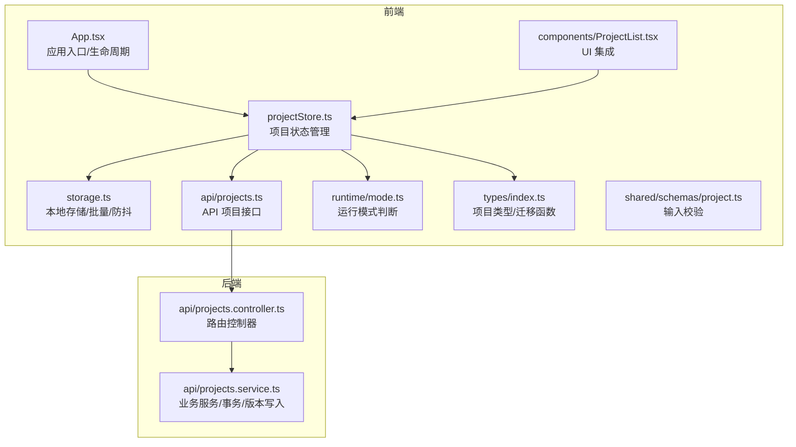
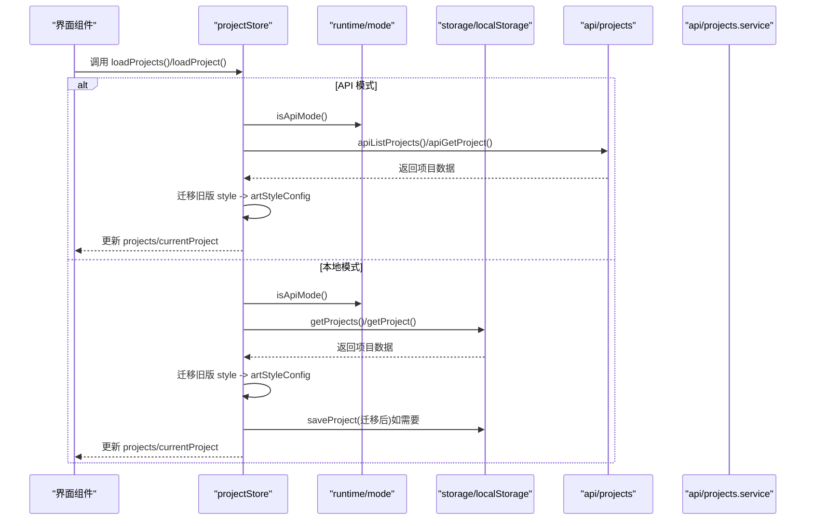
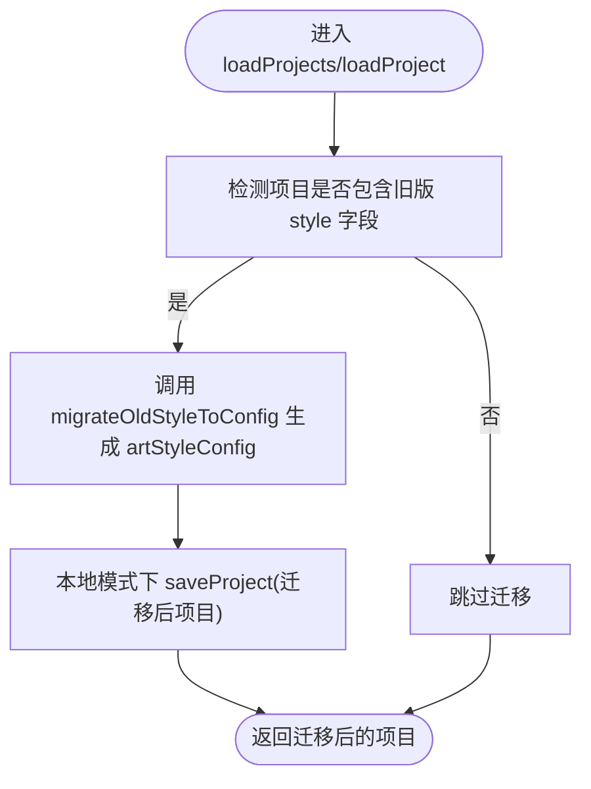
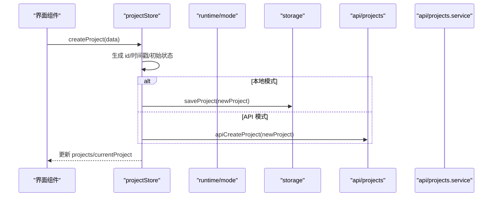
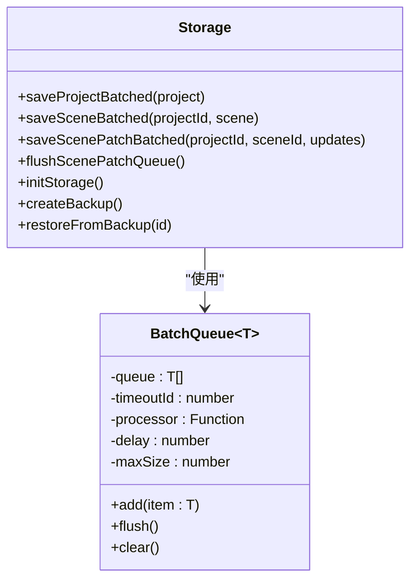
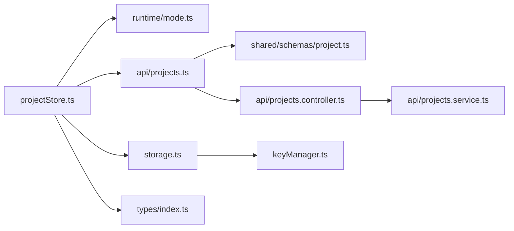

# 项目状态管理

<cite>
**本文档引用的文件**
- [apps/web/src/stores/projectStore.ts](file://apps/web/src/stores/projectStore.ts)
- [apps/web/src/stores/projectStore.test.ts](file://apps/web/src/stores/projectStore.test.ts)
- [apps/web/src/lib/storage.ts](file://apps/web/src/lib/storage.ts)
- [apps/web/src/lib/api/projects.ts](file://apps/web/src/lib/api/projects.ts)
- [apps/web/src/lib/runtime/mode.ts](file://apps/web/src/lib/runtime/mode.ts)
- [apps/web/src/types/index.ts](file://apps/web/src/types/index.ts)
- [packages/shared/src/schemas/project.ts](file://packages/shared/src/schemas/project.ts)
- [apps/api/src/projects/projects.service.ts](file://apps/api/src/projects/projects.service.ts)
- [apps/api/src/projects/projects.controller.ts](file://apps/api/src/projects/projects.controller.ts)
- [apps/web/src/App.tsx](file://apps/web/src/App.tsx)
- [apps/web/src/components/ProjectList.tsx](file://apps/web/src/components/ProjectList.tsx)
- [apps/web/src/lib/performance.ts](file://apps/web/src/lib/performance.ts)
- [apps/web/src/lib/keyManager.ts](file://apps/web/src/lib/keyManager.ts)
</cite>

## 目录

1. [简介](#简介)
2. [项目结构](#项目结构)
3. [核心组件](#核心组件)
4. [架构总览](#架构总览)
5. [详细组件分析](#详细组件分析)
6. [依赖关系分析](#依赖关系分析)
7. [性能考量](#性能考量)
8. [故障排查指南](#故障排查指南)
9. [结论](#结论)
10. [附录](#附录)

## 简介

本文件聚焦 AIXSSS 项目的“项目状态管理模块”，系统性阐述 projectStore 的设计原理与实现细节，覆盖以下主题：

- 项目数据结构与字段演进（从旧版 style 到 artStyleConfig）
- CRUD 操作与 API 模式切换
- 本地存储与批量/防抖优化
- 项目迁移逻辑（旧版到新版画风配置）
- 异步加载、错误处理与状态同步
- 项目生命周期与工作流状态管理
- 并发操作处理与最佳实践
- 本地 vs API 存储模式对比与性能优化建议

## 项目结构

项目状态管理主要由前端 Zustand store、本地存储层、API 层以及共享类型定义构成。整体结构如下：

图表来源

- [apps/web/src/stores/projectStore.ts](file://apps/web/src/stores/projectStore.ts#L1-L181)
- [apps/web/src/lib/storage.ts](file://apps/web/src/lib/storage.ts#L484-L542)
- [apps/web/src/lib/api/projects.ts](file://apps/web/src/lib/api/projects.ts#L1-L53)
- [apps/web/src/lib/runtime/mode.ts](file://apps/web/src/lib/runtime/mode.ts#L1-L30)
- [apps/web/src/types/index.ts](file://apps/web/src/types/index.ts#L204-L223)
- [packages/shared/src/schemas/project.ts](file://packages/shared/src/schemas/project.ts#L1-L33)
- [apps/api/src/projects/projects.controller.ts](file://apps/api/src/projects/projects.controller.ts#L1-L43)
- [apps/api/src/projects/projects.service.ts](file://apps/api/src/projects/projects.service.ts#L1-L215)
- [apps/web/src/App.tsx](file://apps/web/src/App.tsx#L98-L126)
- [apps/web/src/components/ProjectList.tsx](file://apps/web/src/components/ProjectList.tsx#L41-L67)

章节来源

- [apps/web/src/stores/projectStore.ts](file://apps/web/src/stores/projectStore.ts#L1-L181)
- [apps/web/src/lib/storage.ts](file://apps/web/src/lib/storage.ts#L484-L542)
- [apps/web/src/lib/api/projects.ts](file://apps/web/src/lib/api/projects.ts#L1-L53)
- [apps/web/src/lib/runtime/mode.ts](file://apps/web/src/lib/runtime/mode.ts#L1-L30)
- [apps/web/src/types/index.ts](file://apps/web/src/types/index.ts#L204-L223)
- [packages/shared/src/schemas/project.ts](file://packages/shared/src/schemas/project.ts#L1-L33)
- [apps/api/src/projects/projects.controller.ts](file://apps/api/src/projects/projects.controller.ts#L1-L43)
- [apps/api/src/projects/projects.service.ts](file://apps/api/src/projects/projects.service.ts#L1-L215)
- [apps/web/src/App.tsx](file://apps/web/src/App.tsx#L98-L126)
- [apps/web/src/components/ProjectList.tsx](file://apps/web/src/components/ProjectList.tsx#L41-L67)

## 核心组件

- projectStore：基于 Zustand 的项目状态容器，提供项目列表、当前项目、加载状态及 CRUD 操作；自动根据运行模式（本地/API）切换数据源。
- storage：封装 localStorage 访问，提供批量/防抖写入、场景数据队列、版本迁移、备份与恢复等能力。
- api/projects：封装项目相关的 HTTP 接口，配合 shared schema 校验请求体。
- runtime/mode：根据环境变量决定数据模式（local 或 api），并提供 API 基础路径。
- types/index：定义 Project、ArtStyleConfig、工作流状态等类型，并提供从旧版 style 到 artStyleConfig 的迁移函数。

章节来源

- [apps/web/src/stores/projectStore.ts](file://apps/web/src/stores/projectStore.ts#L32-L180)
- [apps/web/src/lib/storage.ts](file://apps/web/src/lib/storage.ts#L484-L542)
- [apps/web/src/lib/api/projects.ts](file://apps/web/src/lib/api/projects.ts#L1-L53)
- [apps/web/src/lib/runtime/mode.ts](file://apps/web/src/lib/runtime/mode.ts#L1-L30)
- [apps/web/src/types/index.ts](file://apps/web/src/types/index.ts#L453-L468)

## 架构总览

项目状态管理遵循“前端 store + 本地存储/后端 API”的双栈设计。store 在每次变更时优先写入当前模式对应的持久化层，并同步更新内存状态；同时在加载时进行必要的数据迁移与补全。

图表来源

- [apps/web/src/stores/projectStore.ts](file://apps/web/src/stores/projectStore.ts#L51-L106)
- [apps/web/src/lib/runtime/mode.ts](file://apps/web/src/lib/runtime/mode.ts#L19-L21)
- [apps/web/src/lib/storage.ts](file://apps/web/src/lib/storage.ts#L484-L542)
- [apps/web/src/lib/api/projects.ts](file://apps/web/src/lib/api/projects.ts#L6-L12)
- [apps/api/src/projects/projects.service.ts](file://apps/api/src/projects/projects.service.ts#L55-L110)

## 详细组件分析

### 项目数据结构与迁移

- 项目实体 Project 包含 id、标题、摘要、主角、工作流状态、当前场景序号、时间戳等字段；其中 style 字段已标记为弃用，新增 artStyleConfig 字段承载更完整的画风配置。
- 旧版 style 到 artStyleConfig 的迁移通过 migrateOldStyleToConfig 实现，映射常用预设（如 anime、realistic 等），若无法映射则回退到默认预设。
- 迁移在 loadProjects/loadProject 时执行，并在本地模式下将迁移后的项目写回存储，确保后续访问不再重复迁移。

图表来源

- [apps/web/src/stores/projectStore.ts](file://apps/web/src/stores/projectStore.ts#L22-L30)
- [apps/web/src/types/index.ts](file://apps/web/src/types/index.ts#L204-L223)
- [apps/web/src/lib/storage.ts](file://apps/web/src/lib/storage.ts#L500-L528)

章节来源

- [apps/web/src/types/index.ts](file://apps/web/src/types/index.ts#L453-L468)
- [apps/web/src/types/index.ts](file://apps/web/src/types/index.ts#L204-L223)
- [apps/web/src/stores/projectStore.ts](file://apps/web/src/stores/projectStore.ts#L22-L30)
- [apps/web/src/lib/storage.ts](file://apps/web/src/lib/storage.ts#L500-L528)

### CRUD 操作与 API 模式切换

- loadProjects：根据 isApiMode 判断，分别调用 apiListProjects 或 getProjects；API 模式下直接使用后端返回数据，本地模式下执行迁移并写回。
- loadProject：同上，支持按 id 加载并迁移。
- createProject：生成唯一 id、设置初始工作流状态与时间戳；本地模式直接保存，API 模式发起创建请求（最佳努力，失败不阻塞 UI）。
- updateProject：计算更新后的项目，本地模式保存，API 模式发起 PATCH 请求；同时更新内存中的 projects/currentProject。
- deleteProject：本地模式删除本地记录，API 模式调用 DELETE；同时更新内存状态。

图表来源

- [apps/web/src/stores/projectStore.ts](file://apps/web/src/stores/projectStore.ts#L108-L134)
- [apps/web/src/lib/api/projects.ts](file://apps/web/src/lib/api/projects.ts#L14-L24)
- [apps/api/src/projects/projects.service.ts](file://apps/api/src/projects/projects.service.ts#L112-L139)

章节来源

- [apps/web/src/stores/projectStore.ts](file://apps/web/src/stores/projectStore.ts#L38-L175)
- [apps/web/src/lib/api/projects.ts](file://apps/web/src/lib/api/projects.ts#L1-L53)
- [apps/api/src/projects/projects.service.ts](file://apps/api/src/projects/projects.service.ts#L112-L139)

### 异步加载与错误处理

- 异步加载：store 中使用 void 异步调用（如 loadProjects、loadProject）以避免阻塞 UI；API 模式下捕获异常并记录错误，本地模式下同样捕获异常并恢复 isLoading。
- 错误处理：统一通过 console.error 记录错误，不抛出至 UI；在本地模式下，存储层对解析/序列化失败进行保护并返回空数组/空对象。
- 状态同步：store 通过 set 更新 projects/currentProject/isLoading，保证 UI 与状态一致。

章节来源

- [apps/web/src/stores/projectStore.ts](file://apps/web/src/stores/projectStore.ts#L51-L106)
- [apps/web/src/lib/storage.ts](file://apps/web/src/lib/storage.ts#L484-L493)

### 本地存储机制与性能优化

- 批量/防抖：项目保存使用 pendingProjectSaves + debounce，300ms 合并多次保存，降低 localStorage 写入频率。
- 场景数据批量队列：sceneSaveQueue 与 scenePatchQueue 将频繁的场景写入合并，提升输入/编辑体验。
- 版本迁移：initStorage 在启动时检测版本差异并执行迁移，迁移失败自动回滚备份，确保数据安全。
- 备份与恢复：提供 createBackup/restoreFromBackup/deleteBackup/getBackups 等工具，限制最多保留 3 个备份。

图表来源

- [apps/web/src/lib/performance.ts](file://apps/web/src/lib/performance.ts#L128-L178)
- [apps/web/src/lib/storage.ts](file://apps/web/src/lib/storage.ts#L16-L64)
- [apps/web/src/lib/storage.ts](file://apps/web/src/lib/storage.ts#L287-L414)

章节来源

- [apps/web/src/lib/performance.ts](file://apps/web/src/lib/performance.ts#L128-L178)
- [apps/web/src/lib/storage.ts](file://apps/web/src/lib/storage.ts#L16-L64)
- [apps/web/src/lib/storage.ts](file://apps/web/src/lib/storage.ts#L287-L414)

### API 模式下的数据同步与并发

- API 控制器与服务：ProjectsController 负责鉴权与参数校验，ProjectsService 提供 list/get/create/update/softDelete 等操作，并在更新时对叙事因果链版本进行“best-effort”写入。
- 并发处理：store 中的 updateProject 采用浅拷贝合并更新并统一设置 updatedAt；API 模式下使用最佳努力策略，避免单次网络错误阻断整体流程。
- 事务与一致性：服务层在 create 中使用事务创建项目与首集，确保原子性。

章节来源

- [apps/api/src/projects/projects.controller.ts](file://apps/api/src/projects/projects.controller.ts#L1-L43)
- [apps/api/src/projects/projects.service.ts](file://apps/api/src/projects/projects.service.ts#L34-L215)
- [packages/shared/src/schemas/project.ts](file://packages/shared/src/schemas/project.ts#L1-L33)

### 项目生命周期与工作流状态

- 工作流状态：Project 包含 workflowState 字段，支持从 DATA_COLLECTING 到 EXPORTING 的完整流程；新项目默认状态为 DATA_COLLECTING。
- Episode/Scene 状态：包含场景生成、确认、关键帧生成、完成等子状态；store 中 updateProject 支持更新 workflowState 与 currentSceneOrder/currentSceneStep。
- UI 集成：App.tsx 在应用启动时初始化存储并加载项目；ProjectList.tsx 订阅 store 并展示项目列表。

章节来源

- [apps/web/src/types/index.ts](file://apps/web/src/types/index.ts#L240-L260)
- [apps/web/src/stores/projectStore.ts](file://apps/web/src/stores/projectStore.ts#L108-L161)
- [apps/web/src/App.tsx](file://apps/web/src/App.tsx#L112-L126)
- [apps/web/src/components/ProjectList.tsx](file://apps/web/src/components/ProjectList.tsx#L41-L67)

### 本地 vs API 存储模式对比

- 本地模式（local）：数据完全保存在浏览器 localStorage，适合开发/离线/演示场景；支持批量/防抖优化与版本迁移。
- API 模式（api）：数据保存在后端数据库，具备权限隔离、团队协作与持久化能力；前端 store 仍维护本地内存状态，API 失败不影响 UI 流程。
- 模式切换：getDataMode 根据环境变量与测试环境自动选择，默认 API 模式；getApiBasePath 提供 API 基础路径。

章节来源

- [apps/web/src/lib/runtime/mode.ts](file://apps/web/src/lib/runtime/mode.ts#L1-L30)
- [apps/web/src/lib/api/projects.ts](file://apps/web/src/lib/api/projects.ts#L23-L52)

## 依赖关系分析

- projectStore 依赖 runtime/mode 判断模式，依赖 storage/api 读写数据，依赖 types 提供类型与迁移函数。
- storage 提供本地持久化与性能优化工具，内部使用 keyManager 进行加密/解密与密钥管理。
- API 层通过 shared schema 校验输入，服务层负责事务与版本写入。

图表来源

- [apps/web/src/stores/projectStore.ts](file://apps/web/src/stores/projectStore.ts#L1-L16)
- [apps/web/src/lib/runtime/mode.ts](file://apps/web/src/lib/runtime/mode.ts#L1-L30)
- [apps/web/src/lib/storage.ts](file://apps/web/src/lib/storage.ts#L1-L10)
- [apps/web/src/lib/api/projects.ts](file://apps/web/src/lib/api/projects.ts#L1-L3)
- [apps/web/src/types/index.ts](file://apps/web/src/types/index.ts#L1-L10)
- [packages/shared/src/schemas/project.ts](file://packages/shared/src/schemas/project.ts#L1-L33)
- [apps/api/src/projects/projects.controller.ts](file://apps/api/src/projects/projects.controller.ts#L1-L10)
- [apps/api/src/projects/projects.service.ts](file://apps/api/src/projects/projects.service.ts#L1-L10)
- [apps/web/src/lib/keyManager.ts](file://apps/web/src/lib/keyManager.ts#L1-L10)

章节来源

- [apps/web/src/stores/projectStore.ts](file://apps/web/src/stores/projectStore.ts#L1-L16)
- [apps/web/src/lib/storage.ts](file://apps/web/src/lib/storage.ts#L1-L10)
- [apps/web/src/lib/api/projects.ts](file://apps/web/src/lib/api/projects.ts#L1-L3)
- [apps/web/src/lib/runtime/mode.ts](file://apps/web/src/lib/runtime/mode.ts#L1-L30)
- [apps/web/src/types/index.ts](file://apps/web/src/types/index.ts#L1-L10)
- [packages/shared/src/schemas/project.ts](file://packages/shared/src/schemas/project.ts#L1-L33)
- [apps/api/src/projects/projects.controller.ts](file://apps/api/src/projects/projects.controller.ts#L1-L10)
- [apps/api/src/projects/projects.service.ts](file://apps/api/src/projects/projects.service.ts#L1-L10)
- [apps/web/src/lib/keyManager.ts](file://apps/web/src/lib/keyManager.ts#L1-L10)

## 性能考量

- 防抖与批量写入：项目保存与场景保存均采用防抖与批量队列，显著降低 localStorage 写入次数与页面抖动。
- 本地模式下的迁移写回：在 loadProjects/loadProject 时对旧项目进行迁移并写回，避免后续重复迁移。
- API 模式下的最佳努力：创建/更新/删除项目时使用 void 异步调用，失败不阻断 UI，提升用户体验。
- 版本迁移与备份：initStorage 在启动时执行迁移，失败自动回滚备份，保障数据安全与稳定性。

章节来源

- [apps/web/src/lib/performance.ts](file://apps/web/src/lib/performance.ts#L11-L26)
- [apps/web/src/lib/performance.ts](file://apps/web/src/lib/performance.ts#L128-L178)
- [apps/web/src/lib/storage.ts](file://apps/web/src/lib/storage.ts#L16-L64)
- [apps/web/src/lib/storage.ts](file://apps/web/src/lib/storage.ts#L287-L414)
- [apps/web/src/stores/projectStore.ts](file://apps/web/src/stores/projectStore.ts#L119-L126)

## 故障排查指南

- 本地存储异常
  - 现象：项目加载为空或报错。
  - 排查：检查 localStorage 是否可用；查看存储层对解析/序列化的错误处理与返回空数组/空对象的保护逻辑。
- 迁移失败
  - 现象：版本升级后数据异常。
  - 排查：确认 initStorage 是否执行；检查备份是否存在并尝试恢复；核对迁移路径与版本号。
- API 模式异常
  - 现象：创建/更新/删除项目失败。
  - 排查：检查网络请求与鉴权；查看服务层事务与错误日志；确认前端是否使用最佳努力策略。
- 工作流状态异常
  - 现象：工作流状态不正确或无法推进。
  - 排查：确认更新字段是否包含 workflowState/currentSceneOrder/currentSceneStep；核对共享 schema 校验。

章节来源

- [apps/web/src/lib/storage.ts](file://apps/web/src/lib/storage.ts#L484-L493)
- [apps/web/src/lib/storage.ts](file://apps/web/src/lib/storage.ts#L377-L414)
- [apps/api/src/projects/projects.service.ts](file://apps/api/src/projects/projects.service.ts#L141-L198)
- [packages/shared/src/schemas/project.ts](file://packages/shared/src/schemas/project.ts#L23-L28)

## 结论

projectStore 通过“store + 本地/后端双栈”的设计，实现了项目状态的统一管理与无缝切换。其核心优势包括：

- 清晰的模式切换与错误兜底；
- 完善的数据迁移与版本控制；
- 高效的批量/防抖写入与性能优化；
- 严谨的类型约束与 API 校验。

在实际使用中，建议优先采用 API 模式以获得更好的协作与持久化能力；在本地模式下充分利用迁移与备份机制，确保数据安全与体验流畅。

## 附录

- 最佳实践
  - 在本地模式下，定期检查备份并进行版本迁移，避免数据丢失。
  - 在 API 模式下，利用最佳努力策略与错误日志定位问题，避免单点故障影响整体流程。
  - 使用批量/防抖写入优化高频编辑场景，减少 localStorage 抖动。
  - 严格遵循共享 schema 校验，确保前后端数据一致性。
