# 状态管理

<cite>
**本文引用的文件**
- [apps/web/src/stores/canvasStore.ts](file://apps/web/src/stores/canvasStore.ts)
- [apps/web/src/stores/projectStore.ts](file://apps/web/src/stores/projectStore.ts)
- [apps/web/src/stores/characterStore.ts](file://apps/web/src/stores/characterStore.ts)
- [apps/web/src/stores/episodeScenesStore.ts](file://apps/web/src/stores/episodeScenesStore.ts)
- [apps/web/src/stores/authStore.ts](file://apps/web/src/stores/authStore.ts)
- [apps/web/src/stores/episodeStore.ts](file://apps/web/src/stores/episodeStore.ts)
- [apps/web/src/stores/configStore.ts](file://apps/web/src/stores/configStore.ts)
- [apps/web/src/stores/worldViewStore.ts](file://apps/web/src/stores/worldViewStore.ts)
- [apps/web/src/stores/storyboardStore.ts](file://apps/web/src/stores/storyboardStore.ts)
- [apps/web/src/types/canvas.ts](file://apps/web/src/types/canvas.ts)
- [apps/web/src/components/canvas/AgentCanvasEditorV2.tsx](file://apps/web/src/components/canvas/AgentCanvasEditorV2.tsx)
- [apps/web/src/components/canvas/nodes/BaseNode.tsx](file://apps/web/src/components/canvas/nodes/BaseNode.tsx)
- [apps/web/src/lib/agent/builderAgent.ts](file://apps/web/src/lib/agent/builderAgent.ts)
- [apps/web/src/lib/runtime/mode.ts](file://apps/web/src/lib/runtime/mode.ts)
- [apps/web/src/lib/api/projects.ts](file://apps/web/src/lib/api/projects.ts)
- [apps/web/src/lib/api/characters.ts](file://apps/web/src/lib/api/characters.ts)
- [apps/web/src/lib/api/episodeScenes.ts](file://apps/web/src/lib/api/episodeScenes.ts)
- [apps/web/src/lib/api/auth.ts](file://apps/web/src/lib/api/auth.ts)
- [apps/web/src/lib/storage.ts](file://apps/web/src/lib/storage.ts)
- [apps/web/src/types/index.ts](file://apps/web/src/types/index.ts)
</cite>

## 更新摘要

**变更内容**

- 新增完整的V2画布状态管理系统，包含631行的canvasStore实现
- 新增画布类型定义、节点库系统和AI代理构建器
- 新增完整的节点组件系统和画布编辑器V2
- 扩展状态管理架构以支持复杂的画布工作流

## 目录

1. [简介](#简介)
2. [项目结构](#项目结构)
3. [核心组件](#核心组件)
4. [架构总览](#架构总览)
5. [详细组件分析](#详细组件分析)
6. [依赖关系分析](#依赖关系分析)
7. [性能考量](#性能考量)
8. [故障排查指南](#故障排查指南)
9. [结论](#结论)
10. [附录](#附录)

## 简介

本文件面向AIXSSS前端应用的状态管理系统，系统采用Zustand进行状态建模，围绕项目、角色、场景、认证、配置、世界观与分镜等业务域构建store模块，并结合运行模式（本地/API）实现数据持久化与同步。**重大升级**：新增完整的V2画布状态管理系统，支持复杂的画布工作流、节点状态管理、历史跟踪和AI智能构建。

文档重点阐述：

- Zustand使用模式与store设计原则
- 状态持久化策略（localStorage、服务端API）
- 各store模块职责与边界
- 状态同步机制、异步更新与错误处理
- 自定义hooks设计模式、性能优化与内存管理
- **新增**：画布状态管理、节点系统、历史跟踪和AI代理集成
- 状态流转图、数据流示例与最佳实践

## 项目结构

前端状态管理位于apps/web/src/stores目录，围绕业务域拆分多个独立store，每个store负责自身领域内的状态、加载、变更与持久化。**V2升级**：新增canvasStore管理复杂的画布状态，支持节点、边、分组和历史记录。运行模式通过runtime/mode统一判定，决定是走本地localStorage还是API后端。

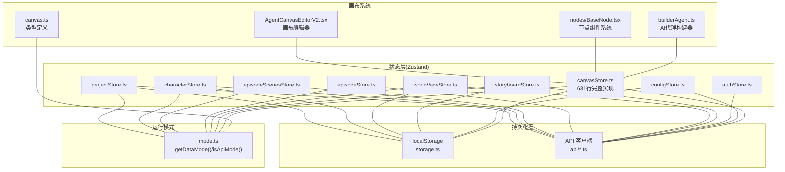

**图表来源**

- [apps/web/src/stores/canvasStore.ts](file://apps/web/src/stores/canvasStore.ts#L1-L631)
- [apps/web/src/types/canvas.ts](file://apps/web/src/types/canvas.ts#L1-L582)
- [apps/web/src/components/canvas/AgentCanvasEditorV2.tsx](file://apps/web/src/components/canvas/AgentCanvasEditorV2.tsx#L1-L557)
- [apps/web/src/components/canvas/nodes/BaseNode.tsx](file://apps/web/src/components/canvas/nodes/BaseNode.tsx#L1-L372)
- [apps/web/src/lib/agent/builderAgent.ts](file://apps/web/src/lib/agent/builderAgent.ts#L1-L214)

**章节来源**

- [apps/web/src/stores/canvasStore.ts](file://apps/web/src/stores/canvasStore.ts#L1-L631)
- [apps/web/src/types/canvas.ts](file://apps/web/src/types/canvas.ts#L1-L582)
- [apps/web/src/components/canvas/AgentCanvasEditorV2.tsx](file://apps/web/src/components/canvas/AgentCanvasEditorV2.tsx#L1-L557)

## 核心组件

- 项目状态：projectStore，负责项目列表、当前项目、加载与CRUD，支持本地与API双模式持久化与迁移。
- 角色状态：characterStore，负责角色列表、当前角色、关系与外观记录，支持本地与API双模式。
- 场景状态：episodeScenesStore，负责剧集内分镜列表、新增/更新/删除/重排，支持API模式下的增量补丁与重排。
- 认证状态：authStore，负责登录/注册/登出、令牌存储与校验、用户信息拉取。
- 剧集工作流：episodeStore，负责剧集列表、当前剧集、工作流任务（规划/生成/因果链）与进度。
- 配置状态：configStore，负责AI配置档案、活动档案、连接测试、前后端模式差异处理。
- 世界观：worldViewStore，负责元素列表、按类型分组与上下文拼装。
- 分镜故事板：storyboardStore，负责全局分镜列表、当前分镜、生成状态、细化跳过步骤与人工覆盖。
- **新增**：画布状态：canvasStore，负责完整的画布状态管理，包括节点、边、分组、选择状态、历史记录和执行状态。

**章节来源**

- [apps/web/src/stores/canvasStore.ts](file://apps/web/src/stores/canvasStore.ts#L30-L115)
- [apps/web/src/stores/projectStore.ts](file://apps/web/src/stores/projectStore.ts#L32-L181)
- [apps/web/src/stores/characterStore.ts](file://apps/web/src/stores/characterStore.ts#L122-L346)
- [apps/web/src/stores/episodeScenesStore.ts](file://apps/web/src/stores/episodeScenesStore.ts#L32-L157)
- [apps/web/src/stores/authStore.ts](file://apps/web/src/stores/authStore.ts#L7-L82)
- [apps/web/src/stores/episodeStore.ts](file://apps/web/src/stores/episodeStore.ts#L69-L504)
- [apps/web/src/stores/configStore.ts](file://apps/web/src/stores/configStore.ts#L20-L822)
- [apps/web/src/stores/worldViewStore.ts](file://apps/web/src/stores/worldViewStore.ts#L25-L211)
- [apps/web/src/stores/storyboardStore.ts](file://apps/web/src/stores/storyboardStore.ts#L17-L321)

## 架构总览

Zustand store通过create工厂创建，内部持有状态与派生方法，依据运行模式选择本地localStorage或API后端进行数据持久化与同步。**V2升级**：新增canvasStore支持复杂的画布状态管理，包括节点状态机、历史跟踪、撤销重做和AI智能构建。API模式下，store在UI层即时更新内存状态，同时通过队列或最佳努力方式异步持久化至服务端；本地模式下，store直接写入localStorage并触发UI更新。

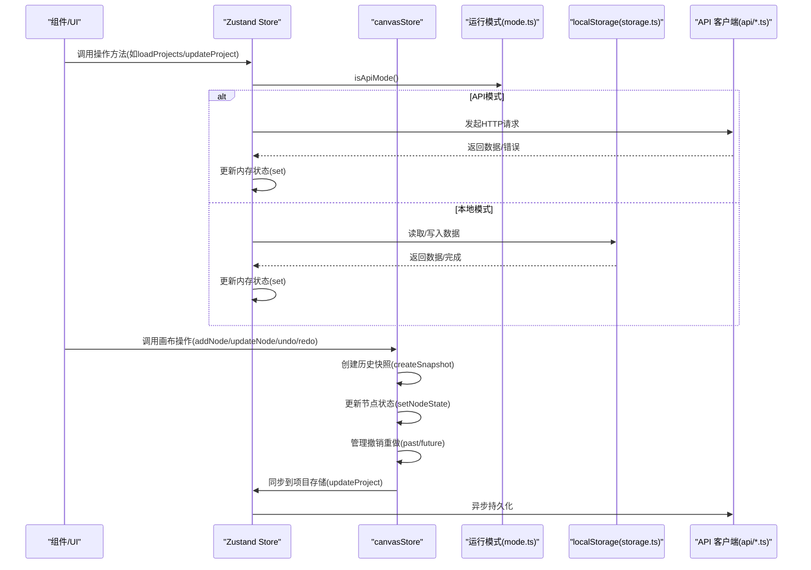

**图表来源**

- [apps/web/src/stores/canvasStore.ts](file://apps/web/src/stores/canvasStore.ts#L124-L132)
- [apps/web/src/stores/canvasStore.ts](file://apps/web/src/stores/canvasStore.ts#L503-L537)
- [apps/web/src/lib/runtime/mode.ts](file://apps/web/src/lib/runtime/mode.ts#L19-L21)
- [apps/web/src/lib/storage.ts](file://apps/web/src/lib/storage.ts#L484-L542)
- [apps/web/src/lib/api/projects.ts](file://apps/web/src/lib/api/projects.ts#L6-L53)

## 详细组件分析

### 画布状态模块（canvasStore）- **重大新增**

- **职责**：管理完整的画布状态，包括节点、边、分组、选择状态、历史记录和执行状态。
- **核心特性**：
  - 节点状态机：支持6种执行状态（idle/ready/running/success/error/warning）
  - 历史跟踪：支持撤销/重做，最大历史记录50条
  - 节点选择：支持单选、多选、全选和批量操作
  - 项目系统同步：自动持久化到项目存储
  - AI智能构建：支持从自然语言生成画布补丁
- **持久化策略**：通过项目存储的contextCache同步，支持本地与API双模式。
- **错误处理**：节点执行错误状态管理，支持错误信息记录和显示。

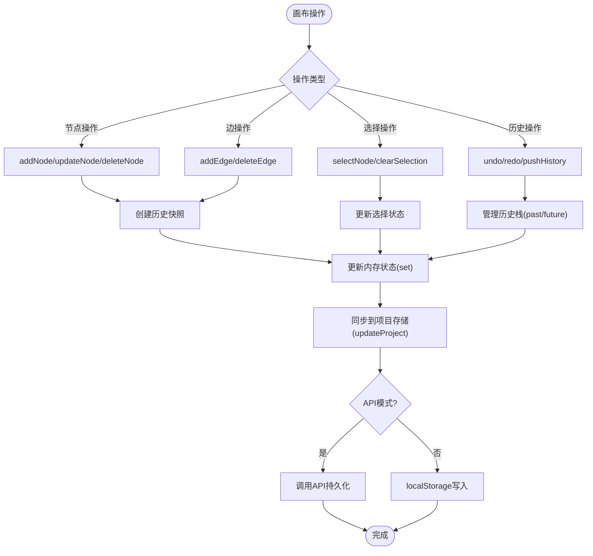

**图表来源**

- [apps/web/src/stores/canvasStore.ts](file://apps/web/src/stores/canvasStore.ts#L217-L236)
- [apps/web/src/stores/canvasStore.ts](file://apps/web/src/stores/canvasStore.ts#L362-L388)
- [apps/web/src/stores/canvasStore.ts](file://apps/web/src/stores/canvasStore.ts#L503-L537)
- [apps/web/src/stores/canvasStore.ts](file://apps/web/src/stores/canvasStore.ts#L124-L132)

**章节来源**

- [apps/web/src/stores/canvasStore.ts](file://apps/web/src/stores/canvasStore.ts#L30-L115)
- [apps/web/src/stores/canvasStore.ts](file://apps/web/src/stores/canvasStore.ts#L167-L590)

### 画布类型系统 - **重大新增**

- **职责**：定义完整的画布类型系统，包括节点类型、边类型、视口状态和历史快照。
- **节点类型**：支持37种节点类型，涵盖全局设定、叙事因果、剧集规划、单集创作和导出功能。
- **节点状态机**：6种执行状态，支持状态颜色映射和标签显示。
- **节点库**：完整的节点库定义，支持分类、图标、默认数据和API要求。
- **工具函数**：节点ID生成、边ID生成、默认节点创建等辅助函数。

```mermaid
classDiagram
class AgentCanvasNodeV2 {
+string id
+AgentCanvasNodeTypeV2 type
+{x : number, y : number} position
+Record~unknown~ data
+number width
+number height
+NodeExecutionState state
+string lastRunAt
+number lastRunDuration
+string lastError
+number progress
+NodeMetadataV2 metadata
+boolean locked
+string groupId
}
class AgentCanvasEdgeV2 {
+string id
+string source
+string target
+string sourceHandle
+string targetHandle
+EdgeTypeV2 type
+string label
+boolean animated
}
class AgentCanvasGraphV2 {
+number version
+AgentCanvasNodeV2[] nodes
+AgentCanvasEdgeV2[] edges
+AgentCanvasViewportV2 viewport
+AgentCanvasGroupV2[] groups
}
class NodeLibraryItem {
+AgentCanvasNodeTypeV2 type
+string label
+string description
+NodeCategory category
+string icon
+Record~unknown~ defaultData
+boolean allowMultiple
+boolean requiresApi
}
AgentCanvasNodeV2 --> AgentCanvasEdgeV2 : uses
AgentCanvasGraphV2 --> AgentCanvasNodeV2 : contains
AgentCanvasGraphV2 --> AgentCanvasEdgeV2 : contains
NodeLibraryItem --> AgentCanvasNodeTypeV2 : defines
```

**图表来源**

- [apps/web/src/types/canvas.ts](file://apps/web/src/types/canvas.ts#L79-L108)
- [apps/web/src/types/canvas.ts](file://apps/web/src/types/canvas.ts#L122-L139)
- [apps/web/src/types/canvas.ts](file://apps/web/src/types/canvas.ts#L202-L213)
- [apps/web/src/types/canvas.ts](file://apps/web/src/types/canvas.ts#L233-L250)

**章节来源**

- [apps/web/src/types/canvas.ts](file://apps/web/src/types/canvas.ts#L14-L37)
- [apps/web/src/types/canvas.ts](file://apps/web/src/types/canvas.ts#L46-L52)
- [apps/web/src/types/canvas.ts](file://apps/web/src/types/canvas.ts#L255-L399)

### 画布编辑器V2 - **重大新增**

- **职责**：提供完整的画布编辑界面，集成ReactFlow、节点库、聊天面板和AI构建功能。
- **核心功能**：
  - ReactFlow集成：支持拖拽、连接、缩放和平移
  - 节点库：37种节点类型，支持拖放创建
  - 聊天面板：支持AI聊天和画布构建
  - AI代理：从自然语言生成画布补丁
  - 快捷键：支持撤销、重做、删除等快捷键
- **项目同步**：自动将画布状态同步到项目存储，支持防抖持久化。

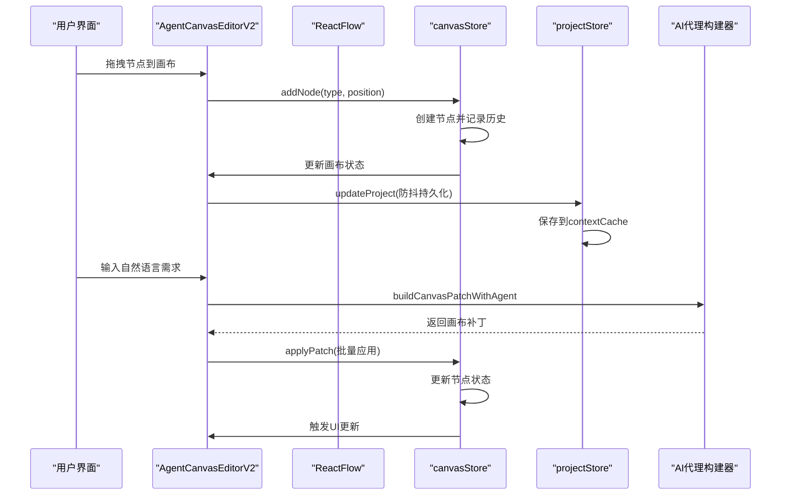

**图表来源**

- [apps/web/src/components/canvas/AgentCanvasEditorV2.tsx](file://apps/web/src/components/canvas/AgentCanvasEditorV2.tsx#L388-L417)
- [apps/web/src/lib/agent/builderAgent.ts](file://apps/web/src/lib/agent/builderAgent.ts#L183-L213)

**章节来源**

- [apps/web/src/components/canvas/AgentCanvasEditorV2.tsx](file://apps/web/src/components/canvas/AgentCanvasEditorV2.tsx#L129-L557)
- [apps/web/src/lib/agent/builderAgent.ts](file://apps/web/src/lib/agent/builderAgent.ts#L1-L214)

### 项目状态模块（projectStore）

- 职责：管理项目列表、当前项目、加载与CRUD，支持本地与API双模式持久化与迁移。
- 持久化策略：
  - API模式：通过apiListProjects/apiCreateProject/apiUpdateProject/apiDeleteProject与后端同步。
  - 本地模式：通过storage.ts的getProjects/saveProject/deleteProject读写localStorage。
- 迁移策略：对旧版style字段迁移至artStyleConfig，必要时回写本地。
- 错误处理：捕获API/本地读写异常，设置isLoading与错误状态，避免UI卡死。

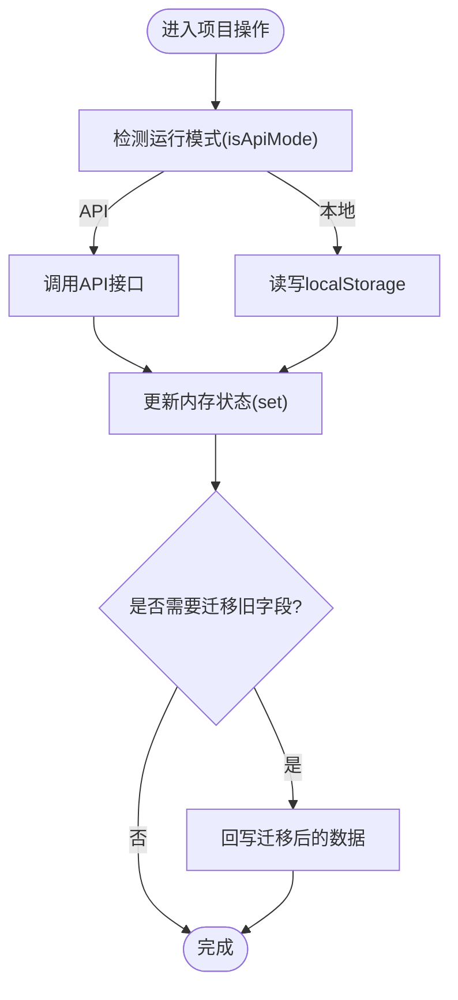

**图表来源**

- [apps/web/src/stores/projectStore.ts](file://apps/web/src/stores/projectStore.ts#L51-L180)
- [apps/web/src/lib/runtime/mode.ts](file://apps/web/src/lib/runtime/mode.ts#L19-L21)
- [apps/web/src/lib/storage.ts](file://apps/web/src/lib/storage.ts#L484-L542)
- [apps/web/src/lib/api/projects.ts](file://apps/web/src/lib/api/projects.ts#L6-L53)

**章节来源**

- [apps/web/src/stores/projectStore.ts](file://apps/web/src/stores/projectStore.ts#L32-L181)
- [apps/web/src/lib/api/projects.ts](file://apps/web/src/lib/api/projects.ts#L1-L53)
- [apps/web/src/lib/storage.ts](file://apps/web/src/lib/storage.ts#L484-L542)

### 角色状态模块（characterStore）

- 职责：管理角色集合、当前角色、角色关系与外观记录，提供增删改查与外观记录。
- 数据归一化：对来自API或本地的原始数据进行标准化处理，确保字段完整性与类型安全。
- 持久化策略：API模式通过characters API，本地模式通过localStorage键值存储。
- 错误处理：API失败时回滚或重载，保证状态一致性。

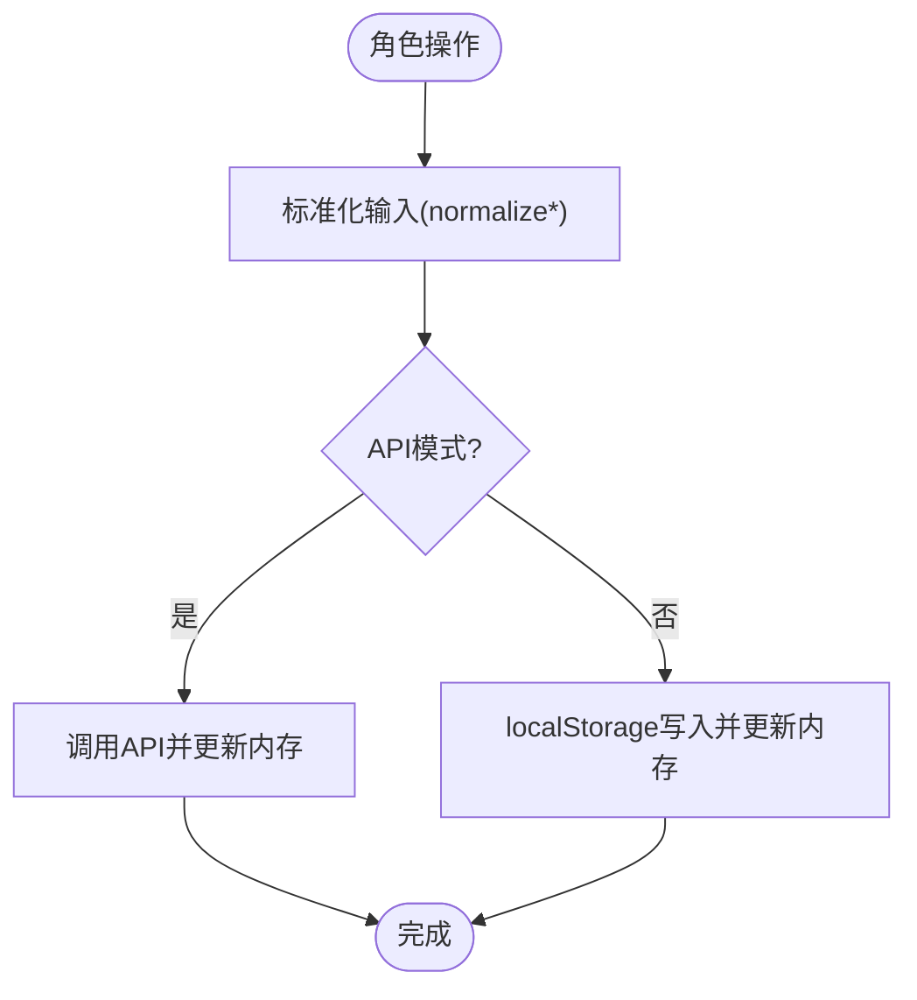

**图表来源**

- [apps/web/src/stores/characterStore.ts](file://apps/web/src/stores/characterStore.ts#L94-L346)
- [apps/web/src/lib/runtime/mode.ts](file://apps/web/src/lib/runtime/mode.ts#L19-L21)
- [apps/web/src/lib/api/characters.ts](file://apps/web/src/lib/api/characters.ts#L6-L76)

**章节来源**

- [apps/web/src/stores/characterStore.ts](file://apps/web/src/stores/characterStore.ts#L122-L346)
- [apps/web/src/lib/api/characters.ts](file://apps/web/src/lib/api/characters.ts#L1-L76)

### 剧集内场景模块（episodeScenesStore）

- 职责：管理剧集内分镜列表，支持新增、更新、删除、重排与上下文摘要合并。
- API模式：通过episodeScenes API与后端同步；更新时使用队列进行补丁合并，减少频繁请求。
- 深度合并：对contextSummary中的refinement等嵌套对象进行深合并，避免覆盖。

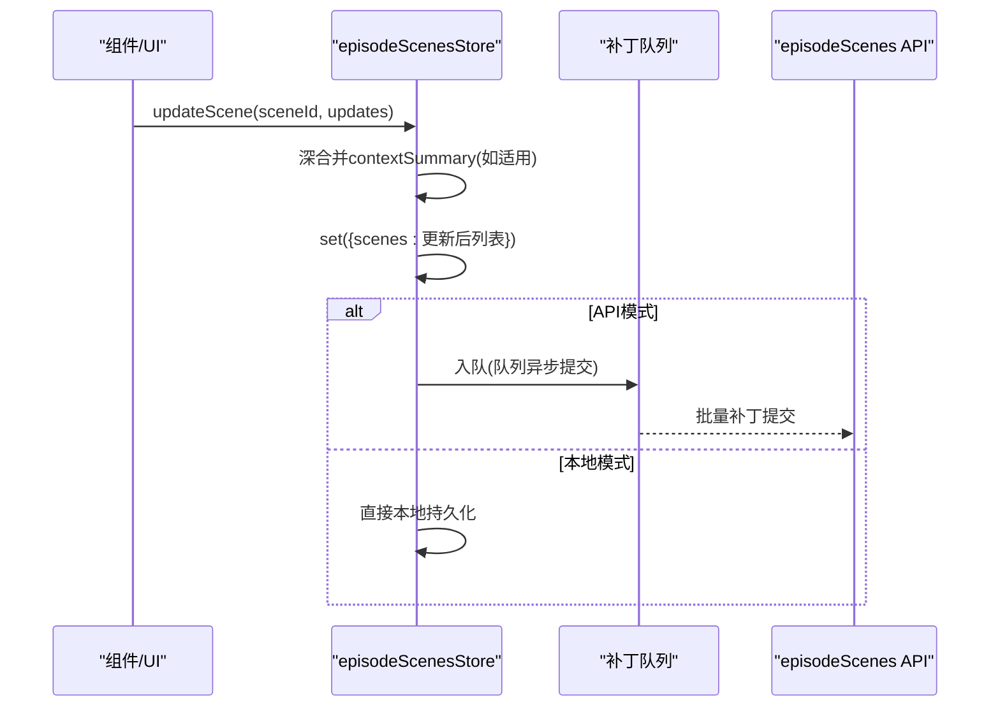

**图表来源**

- [apps/web/src/stores/episodeScenesStore.ts](file://apps/web/src/stores/episodeScenesStore.ts#L96-L121)
- [apps/web/src/lib/api/episodeScenes.ts](file://apps/web/src/lib/api/episodeScenes.ts#L46-L74)

**章节来源**

- [apps/web/src/stores/episodeScenesStore.ts](file://apps/web/src/stores/episodeScenesStore.ts#L32-L157)
- [apps/web/src/lib/api/episodeScenes.ts](file://apps/web/src/lib/api/episodeScenes.ts#L1-L95)

### 认证状态模块（authStore）

- 职责：登录/注册/登出、从localStorage恢复token、调用/api/auth/\*获取用户信息。
- 安全策略：token存储于localStorage，登录后设置HTTP访问令牌；登出清除token并重置状态。
- 错误处理：登录/注册失败时设置错误状态并抛出，供上层UI展示。

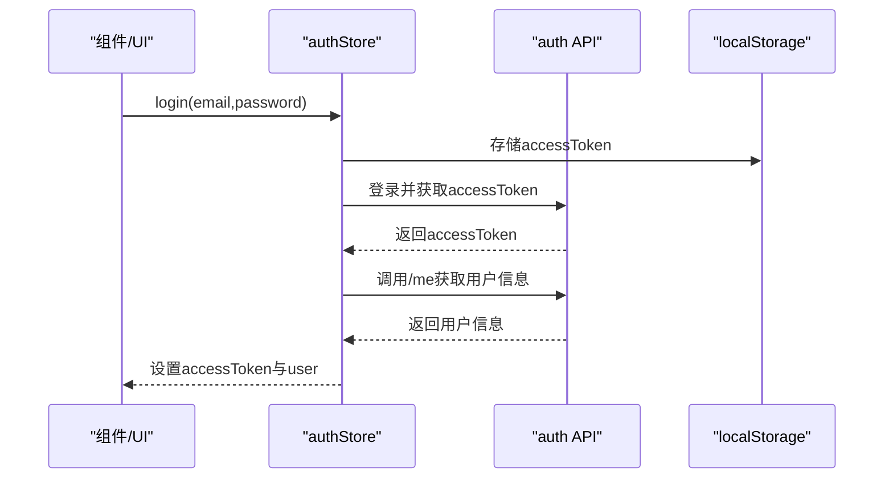

**图表来源**

- [apps/web/src/stores/authStore.ts](file://apps/web/src/stores/authStore.ts#L46-L80)
- [apps/web/src/lib/api/auth.ts](file://apps/web/src/lib/api/auth.ts#L6-L21)

**章节来源**

- [apps/web/src/stores/authStore.ts](file://apps/web/src/stores/authStore.ts#L7-L82)
- [apps/web/src/lib/api/auth.ts](file://apps/web/src/lib/api/auth.ts#L1-L21)

### 剧集工作流模块（episodeStore）

- 职责：管理剧集列表、当前剧集、工作流任务（规划/核心表达/分镜列表/因果链）与进度。
- 运行模式：API模式下通过工作流API与AI作业系统交互，支持进度回调与日志记录。
- 状态同步：工作流完成后刷新剧集列表，确保UI与后端一致。

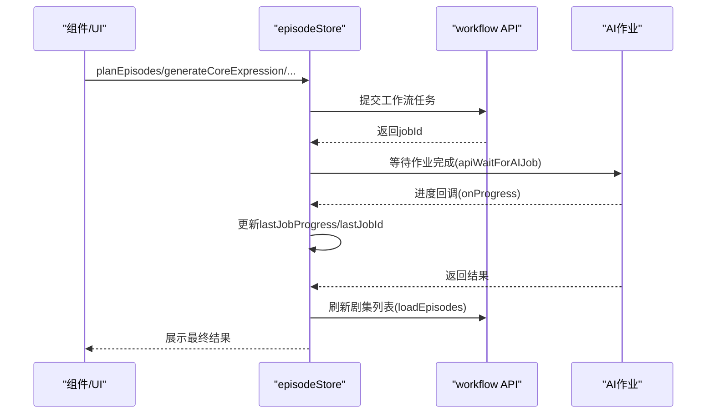

**图表来源**

- [apps/web/src/stores/episodeStore.ts](file://apps/web/src/stores/episodeStore.ts#L210-L267)
- [apps/web/src/stores/episodeStore.ts](file://apps/web/src/stores/episodeStore.ts#L269-L323)
- [apps/web/src/stores/episodeStore.ts](file://apps/web/src/stores/episodeStore.ts#L325-L380)
- [apps/web/src/stores/episodeStore.ts](file://apps/web/src/stores/episodeStore.ts#L382-L430)
- [apps/web/src/stores/episodeStore.ts](file://apps/web/src/stores/episodeStore.ts#L432-L502)

**章节来源**

- [apps/web/src/stores/episodeStore.ts](file://apps/web/src/stores/episodeStore.ts#L69-L504)

### 配置状态模块（configStore）

- 职责：管理AI配置档案、活动档案、连接测试、前后端模式差异处理。
- 前端模式：本地保存加密配置，支持多档案与连接测试。
- 后端模式：从服务端拉取AI档案，前端不保存apiKey，仅保存aiProfileId。
- 多档案：支持创建/更新/删除档案，切换活动档案并持久化。

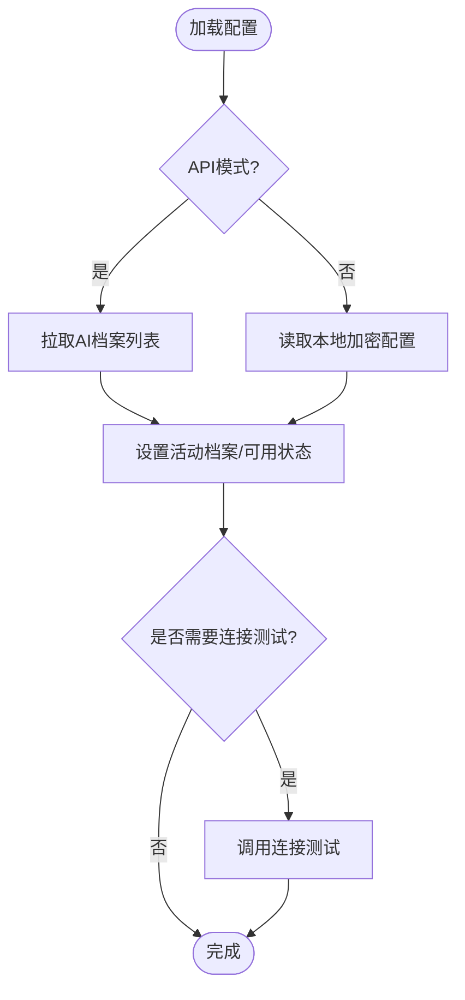

**图表来源**

- [apps/web/src/stores/configStore.ts](file://apps/web/src/stores/configStore.ts#L189-L287)
- [apps/web/src/stores/configStore.ts](file://apps/web/src/stores/configStore.ts#L343-L488)
- [apps/web/src/stores/configStore.ts](file://apps/web/src/stores/configStore.ts#L525-L751)

**章节来源**

- [apps/web/src/stores/configStore.ts](file://apps/web/src/stores/configStore.ts#L20-L822)

### 世界观模块（worldViewStore）

- 职责：管理世界观元素列表、按类型分组、排序与上下文拼装。
- 持久化策略：API模式通过worldView API，本地模式通过localStorage键值存储。
- 功能增强：支持按类型筛选、分组与生成上下文字符串，便于注入AI。

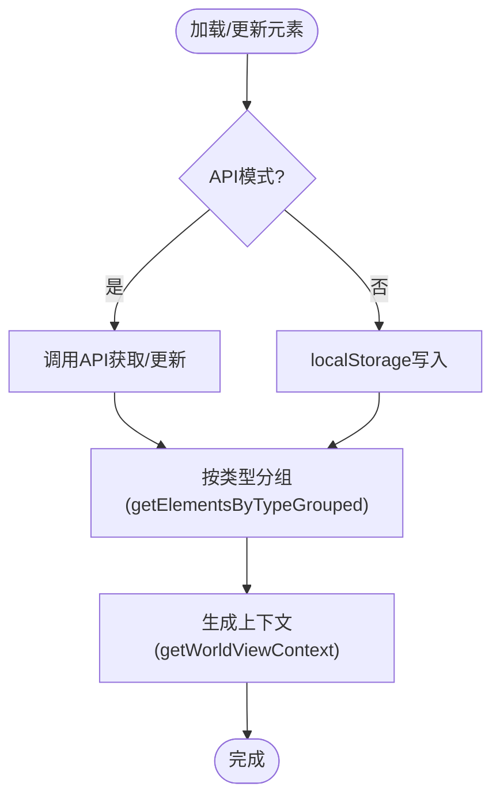

**图表来源**

- [apps/web/src/stores/worldViewStore.ts](file://apps/web/src/stores/worldViewStore.ts#L55-L202)
- [apps/web/src/lib/api/worldView.ts](file://apps/web/src/lib/api/worldView.ts#L1-L10)

**章节来源**

- [apps/web/src/stores/worldViewStore.ts](file://apps/web/src/stores/worldViewStore.ts#L25-L211)

### 分镜故事板模块（storyboardStore）

- 职责：管理全局分镜列表、当前分镜、生成状态、细化跳过步骤与人工覆盖。
- 本地模式：通过storage.ts的saveScene/saveScenes与补丁队列优化写入。
- API模式：通过scenes API与后端同步，支持重排与补丁队列。

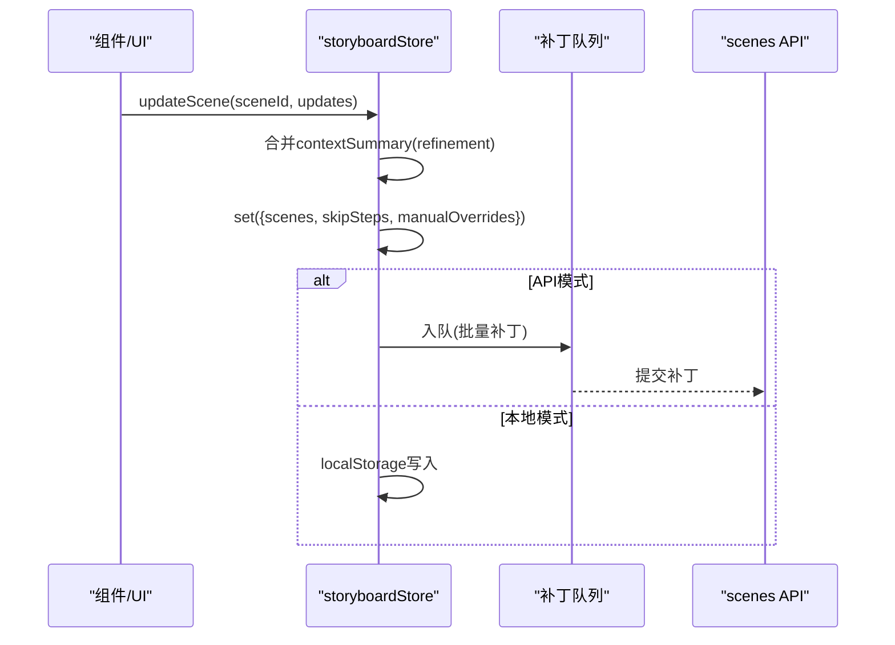

**图表来源**

- [apps/web/src/stores/storyboardStore.ts](file://apps/web/src/stores/storyboardStore.ts#L210-L238)
- [apps/web/src/lib/storage.ts](file://apps/web/src/lib/storage.ts#L609-L619)

**章节来源**

- [apps/web/src/stores/storyboardStore.ts](file://apps/web/src/stores/storyboardStore.ts#L17-L321)
- [apps/web/src/lib/storage.ts](file://apps/web/src/lib/storage.ts#L609-L619)

## 依赖关系分析

- store与运行模式：isApiMode()决定数据流向，避免在store内硬编码分支。
- store与API：各store通过对应的api/\*.ts封装HTTP请求，集中处理序列化/反序列化与错误。
- store与localStorage：通过storage.ts统一封装读写、批量队列与加密，降低store复杂度。
- store与类型：types/index.ts提供强类型定义，确保store与API契约一致。
- **新增**：canvasStore与项目系统深度集成，通过contextCache同步画布状态。
- **新增**：节点组件系统与canvasStore双向绑定，实时响应状态变化。

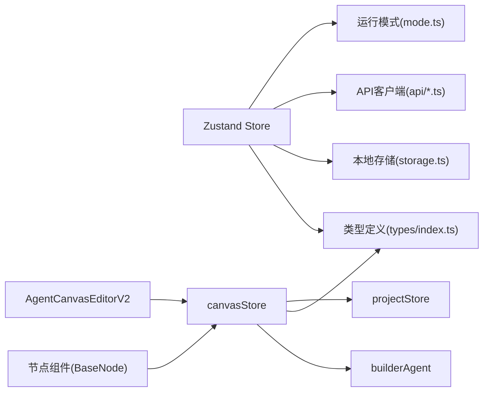

**图表来源**

- [apps/web/src/lib/runtime/mode.ts](file://apps/web/src/lib/runtime/mode.ts#L1-L30)
- [apps/web/src/lib/storage.ts](file://apps/web/src/lib/storage.ts#L1-L1015)
- [apps/web/src/lib/api/projects.ts](file://apps/web/src/lib/api/projects.ts#L1-L53)
- [apps/web/src/lib/api/characters.ts](file://apps/web/src/lib/api/characters.ts#L1-L76)
- [apps/web/src/lib/api/episodeScenes.ts](file://apps/web/src/lib/api/episodeScenes.ts#L1-L95)
- [apps/web/src/lib/api/auth.ts](file://apps/web/src/lib/api/auth.ts#L1-L21)
- [apps/web/src/types/index.ts](file://apps/web/src/types/index.ts#L1-L1019)
- [apps/web/src/stores/canvasStore.ts](file://apps/web/src/stores/canvasStore.ts#L1-L631)
- [apps/web/src/components/canvas/AgentCanvasEditorV2.tsx](file://apps/web/src/components/canvas/AgentCanvasEditorV2.tsx#L1-L557)
- [apps/web/src/components/canvas/nodes/BaseNode.tsx](file://apps/web/src/components/canvas/nodes/BaseNode.tsx#L1-L372)
- [apps/web/src/lib/agent/builderAgent.ts](file://apps/web/src/lib/agent/builderAgent.ts#L1-L214)

**章节来源**

- [apps/web/src/lib/runtime/mode.ts](file://apps/web/src/lib/runtime/mode.ts#L1-L30)
- [apps/web/src/lib/storage.ts](file://apps/web/src/lib/storage.ts#L1-L1015)
- [apps/web/src/lib/api/projects.ts](file://apps/web/src/lib/api/projects.ts#L1-L53)
- [apps/web/src/lib/api/characters.ts](file://apps/web/src/lib/api/characters.ts#L1-L76)
- [apps/web/src/lib/api/episodeScenes.ts](file://apps/web/src/lib/api/episodeScenes.ts#L1-L95)
- [apps/web/src/lib/api/auth.ts](file://apps/web/src/lib/api/auth.ts#L1-L21)
- [apps/web/src/types/index.ts](file://apps/web/src/types/index.ts#L1-L1019)

## 性能考量

- 批量与防抖：
  - 项目批量保存：debounce合并300ms内多次更新，减少localStorage写入次数。
  - 场景批量保存：BatchQueue按项目聚合，200ms延迟、最多20个合并，显著降低写入压力。
  - 场景补丁批量：对局部更新进行合并，避免频繁序列化与写入。
  - **新增**：画布持久化防抖：600ms防抖延迟，避免频繁项目存储更新。
- 内存管理：
  - store仅持有当前视图所需数据，避免一次性加载全量数据。
  - API模式下，store在UI层即时更新，避免等待后端完成再渲染。
  - **新增**：canvasStore限制历史记录数量（MAX_HISTORY=50），防止内存泄漏。
  - **新增**：节点状态机使用Set数据结构，支持高效的节点选择管理。
- 加密与版本迁移：
  - storage.ts提供加密与版本迁移，确保数据安全与向前兼容。
- UI渲染优化：
  - 使用Zustand浅比较，默认只在状态引用变化时触发重渲染。
  - 将大型对象拆分为多个store，降低无关状态变更引发的重渲染。
  - **新增**：节点组件使用memo优化，避免不必要的重新渲染。

**章节来源**

- [apps/web/src/lib/storage.ts](file://apps/web/src/lib/storage.ts#L16-L113)
- [apps/web/src/lib/storage.ts](file://apps/web/src/lib/storage.ts#L456-L468)
- [apps/web/src/stores/canvasStore.ts](file://apps/web/src/stores/canvasStore.ts#L24-L24)
- [apps/web/src/components/canvas/nodes/BaseNode.tsx](file://apps/web/src/components/canvas/nodes/BaseNode.tsx#L125-L223)

## 故障排查指南

- API模式不可用：
  - 确认isApiMode()返回值与环境变量VITE_DATA_MODE一致。
  - 检查API基础路径getApiBasePath()与实际部署路径。
- 登录/鉴权失败：
  - 查看authStore错误状态与API返回的HTTP状态，按提示修正密钥/模型/Base URL。
- 本地数据异常：
  - 使用storage.ts的备份/恢复功能，定位数据损坏或版本不兼容问题。
- 工作流任务卡住：
  - 检查episodeStore的lastJobId/lastJobProgress，确认AI作业是否完成或报错。
- 分镜更新丢失：
  - 确认是否处于API模式，API模式下依赖队列异步提交，需等待队列flush。
- **新增**：画布操作异常：
  - 检查canvasStore的历史记录栈，确认撤销/重做操作是否正确。
  - 验证节点状态机状态，确认节点执行是否正常。
  - 检查AI代理构建器的响应格式，确保JSON解析成功。
- **新增**：项目存储同步失败：
  - 确认项目存储的contextCache格式，检查画布数据版本兼容性。
  - 验证防抖定时器是否正确清理，避免重复持久化。

**章节来源**

- [apps/web/src/lib/runtime/mode.ts](file://apps/web/src/lib/runtime/mode.ts#L8-L30)
- [apps/web/src/stores/authStore.ts](file://apps/web/src/stores/authStore.ts#L46-L80)
- [apps/web/src/lib/storage.ts](file://apps/web/src/lib/storage.ts#L288-L374)
- [apps/web/src/stores/episodeStore.ts](file://apps/web/src/stores/episodeStore.ts#L240-L247)
- [apps/web/src/stores/canvasStore.ts](file://apps/web/src/stores/canvasStore.ts#L503-L537)

## 结论

AIXSSS前端状态管理以Zustand为核心，结合运行模式抽象与API/本地双持久化策略，实现了高内聚、低耦合的状态模块。**V2重大升级**：新增完整的画布状态管理系统，支持复杂的节点状态机、历史跟踪、撤销重做和AI智能构建。通过批量/防抖、补丁合并与版本迁移等手段，兼顾性能与可靠性。新的画布系统为用户提供了强大的可视化工作流构建能力，支持从自然语言到具体画布结构的智能转换。建议在后续迭代中进一步完善错误边界与可观测性，持续优化用户体验与系统稳定性。

## 附录

- 最佳实践
  - 在store中避免直接处理UI细节，保持纯状态与纯副作用分离。
  - 对高频更新使用批量/防抖策略，减少localStorage写入与重渲染。
  - API模式下，store应优先更新内存状态，后台异步持久化，保证交互流畅。
  - 对外部依赖（API、localStorage）进行统一封装，降低store复杂度。
  - **新增**：合理使用历史记录栈，避免无限增长导致内存问题。
  - **新增**：节点状态机应保持幂等性，支持状态的正确转换。
  - **新增**：AI代理构建器应提供清晰的错误反馈，帮助用户理解构建过程。
- 数据类型参考
  - 项目/角色/场景/剧集/配置/世界观等核心类型定义见types/index.ts。
  - **新增**：画布类型系统见types/canvas.ts，包含完整的节点、边、状态定义。
- **新增**：画布节点库参考
  - 全局设定：project_settings、world_view、characters
  - 叙事因果：narrative_causal_chain
  - 剧集规划：episode_plan
  - 单集创作：episode、core_expression、scene_list、scene_anchor、action_plan、keyframe_groups、batch_refine、dialogue
  - 导出：export
  - 通用工具：llm、condition、group

**章节来源**

- [apps/web/src/types/index.ts](file://apps/web/src/types/index.ts#L453-L633)
- [apps/web/src/types/index.ts](file://apps/web/src/types/index.ts#L647-L704)
- [apps/web/src/types/index.ts](file://apps/web/src/types/index.ts#L1019-L1019)
- [apps/web/src/types/canvas.ts](file://apps/web/src/types/canvas.ts#L255-L399)
