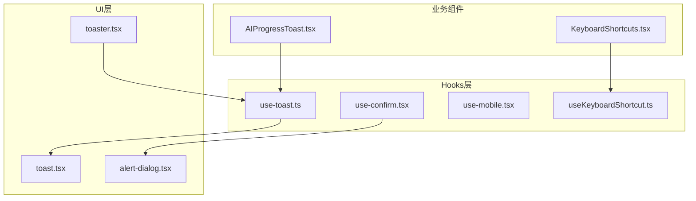
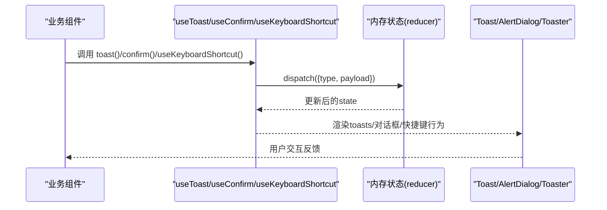
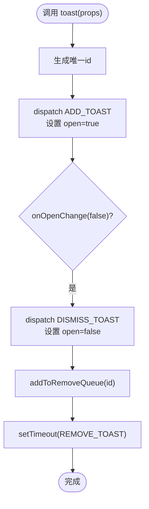
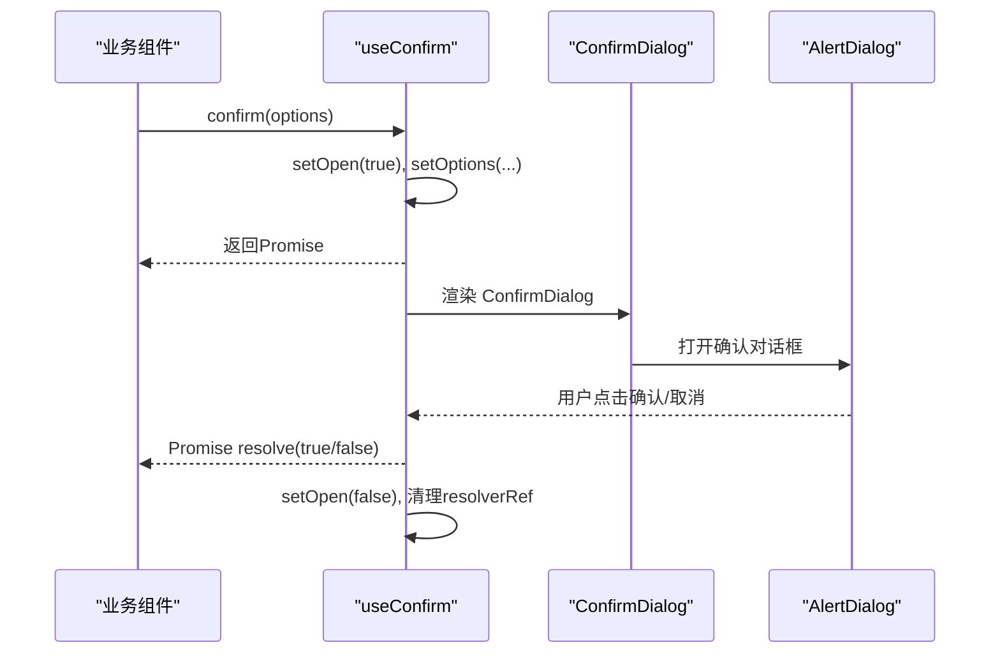
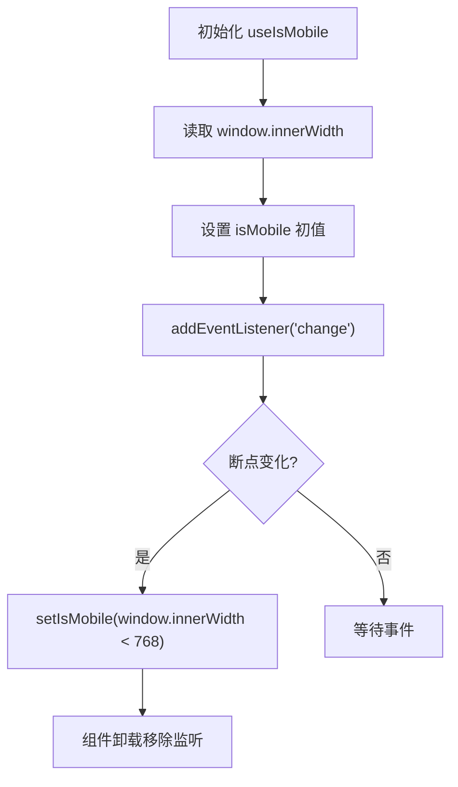
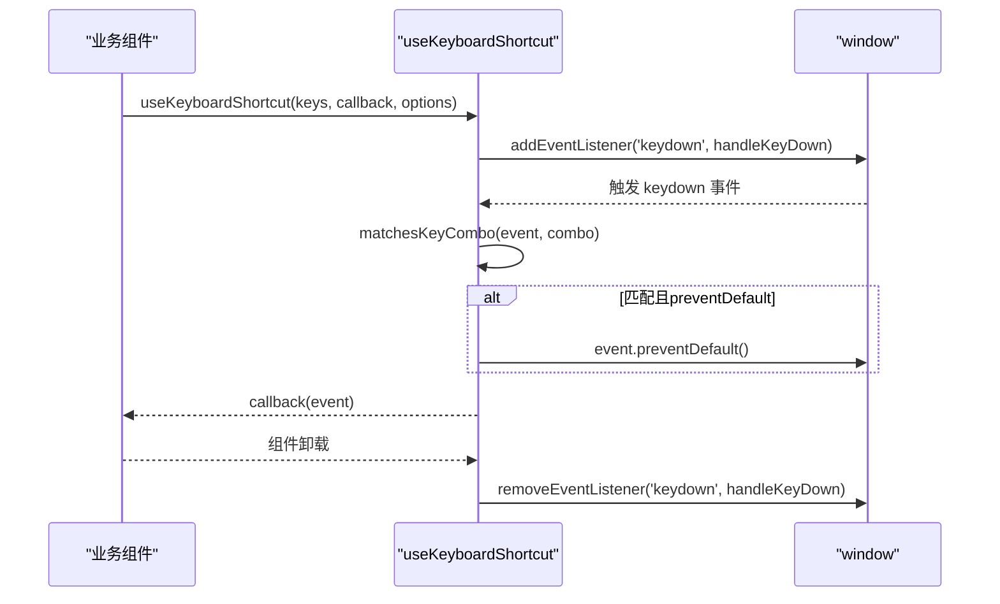
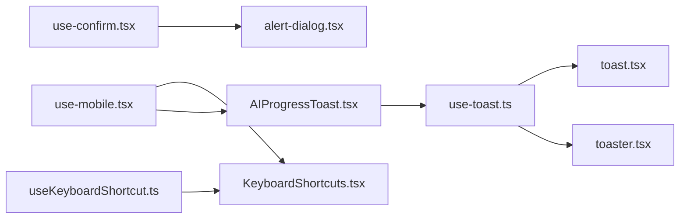

# 自定义Hooks设计

<cite>
**本文引用的文件**
- [apps/web/src/hooks/use-toast.ts](file://apps/web/src/hooks/use-toast.ts)
- [apps/web/src/hooks/use-confirm.tsx](file://apps/web/src/hooks/use-confirm.tsx)
- [apps/web/src/hooks/use-mobile.tsx](file://apps/web/src/hooks/use-mobile.tsx)
- [apps/web/src/hooks/useKeyboardShortcut.ts](file://apps/web/src/hooks/useKeyboardShortcut.ts)
- [apps/web/src/components/ui/toast.tsx](file://apps/web/src/components/ui/toast.tsx)
- [apps/web/src/components/ui/alert-dialog.tsx](file://apps/web/src/components/ui/alert-dialog.tsx)
- [apps/web/src/components/ui/toaster.tsx](file://apps/web/src/components/ui/toaster.tsx)
- [apps/web/src/components/KeyboardShortcuts.tsx](file://apps/web/src/components/KeyboardShortcuts.tsx)
- [apps/web/src/components/AIProgressToast.tsx](file://apps/web/src/components/AIProgressToast.tsx)
- [apps/web/src/hooks/use-toast.test.ts](file://apps/web/src/hooks/use-toast.test.ts)
- [apps/web/src/hooks/useKeyboardShortcut.test.ts](file://apps/web/src/hooks/useKeyboardShortcut.test.ts)
</cite>

## 目录

1. [引言](#引言)
2. [项目结构](#项目结构)
3. [核心组件](#核心组件)
4. [架构总览](#架构总览)
5. [详细组件分析](#详细组件分析)
6. [依赖关系分析](#依赖关系分析)
7. [性能考量](#性能考量)
8. [故障排查指南](#故障排查指南)
9. [结论](#结论)
10. [附录](#附录)

## 引言

本文件面向AIXSSS项目的前端工程，系统化梳理并深度解析四类自定义hooks：toast通知、确认对话框、移动端适配与键盘快捷键。文档从设计模式、实现原理、参数配置、返回值结构、副作用处理、性能优化策略、组合使用、状态传递与错误边界处理等方面进行阐述，并提供可复用的最佳实践与测试调试建议。

## 项目结构

本次分析聚焦于web应用层的hooks与相关UI组件，以及其在具体业务组件中的使用方式。关键文件分布如下：

- hooks层：use-toast、use-confirm、use-mobile、useKeyboardShortcut
- UI层：toast、alert-dialog、toaster等
- 业务组件：KeyboardShortcuts、AIProgressToast等
- 测试层：use-toast.test、useKeyboardShortcut.test

图表来源

- [apps/web/src/hooks/use-toast.ts](file://apps/web/src/hooks/use-toast.ts#L1-L190)
- [apps/web/src/hooks/use-confirm.tsx](file://apps/web/src/hooks/use-confirm.tsx#L1-L98)
- [apps/web/src/hooks/use-mobile.tsx](file://apps/web/src/hooks/use-mobile.tsx#L1-L20)
- [apps/web/src/hooks/useKeyboardShortcut.ts](file://apps/web/src/hooks/useKeyboardShortcut.ts#L1-L159)
- [apps/web/src/components/ui/toast.tsx](file://apps/web/src/components/ui/toast.tsx#L1-L126)
- [apps/web/src/components/ui/alert-dialog.tsx](file://apps/web/src/components/ui/alert-dialog.tsx#L1-L116)
- [apps/web/src/components/ui/toaster.tsx](file://apps/web/src/components/ui/toaster.tsx#L1-L31)
- [apps/web/src/components/KeyboardShortcuts.tsx](file://apps/web/src/components/KeyboardShortcuts.tsx#L1-L200)
- [apps/web/src/components/AIProgressToast.tsx](file://apps/web/src/components/AIProgressToast.tsx#L1-L296)

章节来源

- [apps/web/src/hooks/use-toast.ts](file://apps/web/src/hooks/use-toast.ts#L1-L190)
- [apps/web/src/hooks/use-confirm.tsx](file://apps/web/src/hooks/use-confirm.tsx#L1-L98)
- [apps/web/src/hooks/use-mobile.tsx](file://apps/web/src/hooks/use-mobile.tsx#L1-L20)
- [apps/web/src/hooks/useKeyboardShortcut.ts](file://apps/web/src/hooks/useKeyboardShortcut.ts#L1-L159)
- [apps/web/src/components/ui/toast.tsx](file://apps/web/src/components/ui/toast.tsx#L1-L126)
- [apps/web/src/components/ui/alert-dialog.tsx](file://apps/web/src/components/ui/alert-dialog.tsx#L1-L116)
- [apps/web/src/components/ui/toaster.tsx](file://apps/web/src/components/ui/toaster.tsx#L1-L31)
- [apps/web/src/components/KeyboardShortcuts.tsx](file://apps/web/src/components/KeyboardShortcuts.tsx#L1-L200)
- [apps/web/src/components/AIProgressToast.tsx](file://apps/web/src/components/AIProgressToast.tsx#L1-L296)

## 核心组件

本节对四个hooks进行概览式说明，包括职责、输入输出与典型应用场景。

- toast通知hooks（useToast + toast）
  - 职责：集中管理全局toast队列，支持添加、更新、批量关闭与逐个移除；提供轻量API用于触发toast。
  - 输入：toast(props) 接收标题、描述、动作、变体等；useToast() 返回toasts数组与控制函数。
  - 输出：返回对象包含 toasts、toast(id)、dismiss(id?)。
  - 场景：AI任务进度、成功/失败提示、批量操作反馈等。

- 确认对话框hooks（useConfirm）
  - 职责：以Promise风格封装确认对话框，统一行为与样式。
  - 输入：confirm(options) 接收标题、描述、文案与破坏性样式开关。
  - 输出：返回 ConfirmDialog 组件与 confirm 方法。
  - 场景：删除、覆盖、危险操作前的二次确认。

- 移动端适配hooks（useIsMobile）
  - 职责：基于媒体查询检测移动端状态，支持响应式布局与交互调整。
  - 输入：无
  - 输出：布尔值表示是否移动端
  - 场景：移动端折叠菜单、简化布局、触屏手势优化。

- 键盘快捷键hooks（useKeyboardShortcut）
  - 职责：监听全局键盘事件，支持修饰键组合与平台适配。
  - 输入：keys（字符串或数组）、回调、选项（启用/阻止默认行为）。
  - 输出：无直接返回，注册/清理事件监听
  - 场景：全局帮助面板、保存、撤销、生成、主题切换等快捷键。

章节来源

- [apps/web/src/hooks/use-toast.ts](file://apps/web/src/hooks/use-toast.ts#L140-L189)
- [apps/web/src/hooks/use-confirm.tsx](file://apps/web/src/hooks/use-confirm.tsx#L24-L97)
- [apps/web/src/hooks/use-mobile.tsx](file://apps/web/src/hooks/use-mobile.tsx#L5-L19)
- [apps/web/src/hooks/useKeyboardShortcut.ts](file://apps/web/src/hooks/useKeyboardShortcut.ts#L16-L50)

## 架构总览

下图展示了toast与toaster、confirm与alert-dialog、快捷键与业务组件之间的协作关系。

图表来源

- [apps/web/src/hooks/use-toast.ts](file://apps/web/src/hooks/use-toast.ts#L74-L136)
- [apps/web/src/components/ui/toaster.tsx](file://apps/web/src/components/ui/toaster.tsx#L11-L31)
- [apps/web/src/hooks/use-confirm.tsx](file://apps/web/src/hooks/use-confirm.tsx#L24-L97)
- [apps/web/src/components/ui/alert-dialog.tsx](file://apps/web/src/components/ui/alert-dialog.tsx#L7-L115)
- [apps/web/src/hooks/useKeyboardShortcut.ts](file://apps/web/src/hooks/useKeyboardShortcut.ts#L16-L50)

## 详细组件分析

### toast通知hooks（useToast + toast）

- 设计模式
  - 单向数据流与集中式状态：通过reducer维护内存状态，listeners订阅变更，统一渲染入口Toaster消费状态。
  - 副作用最小化：仅在toast触发时添加定时器，关闭时入队延时移除，避免重复定时器。
  - 不可变更新：每次更新均返回新对象，确保React可感知变化。
- 参数与返回
  - toast(props)：接收标题、描述、动作、变体等；返回 { id, dismiss, update }。
  - useToast()：返回 { toasts, toast, dismiss }。
- 关键流程
  - 添加：生成唯一id，设置open=true，onOpenChange监听关闭并触发dismiss。
  - 更新：按id合并部分属性。
  - 关闭：DISMISS_TOAST将open=false；若无id则批量关闭；同时入队REMOVE_TOAST延迟清理。
  - 移除：REMOVE_TOAST过滤掉对应id。
- 性能优化
  - TOAST_LIMIT限制最多保留1条toast，避免DOM堆积。
  - 使用Map缓存定时器，按id去重，防止泄漏。
  - listeners数组仅在useEffect挂载/卸载时增删，避免重复订阅。
- 组合使用
  - 与AIProgressToast结合：后者订阅store事件，将任务状态映射为toast通知，利用toast的可选动作与变体增强信息密度。
- 错误边界
  - 对异常状态（如错误、取消）延长显示时间，必要时提供“查看详情”动作，引导用户进入开发者面板。

图表来源

- [apps/web/src/hooks/use-toast.ts](file://apps/web/src/hooks/use-toast.ts#L140-L167)
- [apps/web/src/hooks/use-toast.ts](file://apps/web/src/hooks/use-toast.ts#L58-L72)
- [apps/web/src/hooks/use-toast.ts](file://apps/web/src/hooks/use-toast.ts#L74-L125)

章节来源

- [apps/web/src/hooks/use-toast.ts](file://apps/web/src/hooks/use-toast.ts#L1-L190)
- [apps/web/src/components/ui/toast.tsx](file://apps/web/src/components/ui/toast.tsx#L1-L126)
- [apps/web/src/components/ui/toaster.tsx](file://apps/web/src/components/ui/toaster.tsx#L1-L31)
- [apps/web/src/components/AIProgressToast.tsx](file://apps/web/src/components/AIProgressToast.tsx#L1-L296)
- [apps/web/src/hooks/use-toast.test.ts](file://apps/web/src/hooks/use-toast.test.ts#L1-L274)

### 确认对话框hooks（useConfirm）

- 设计模式
  - 将传统window.confirm替换为基于Radix AlertDialog的受控组件，通过resolverRef实现Promise式结果传递。
  - 通过ConfirmDialog子组件在需要时渲染，避免全局状态污染。
- 参数与返回
  - confirm(options)：接收标题、描述、确认/取消文案、破坏性样式。
  - 返回 { confirm, ConfirmDialog }。
- 关键流程
  - 打开：设置open=true，返回Promise；点击任一按钮后resolve并关闭。
  - 关闭：onOpenChange监听外部关闭，若由外部触发则视为拒绝。
- 组合使用
  - 与业务操作结合：在删除、覆盖、清空等危险操作前调用confirm，根据返回结果执行后续逻辑。
- 错误边界
  - 若resolverRef为空或组件卸载，closeWithResult会安全地忽略结果，避免内存泄漏。

图表来源

- [apps/web/src/hooks/use-confirm.tsx](file://apps/web/src/hooks/use-confirm.tsx#L24-L97)
- [apps/web/src/components/ui/alert-dialog.tsx](file://apps/web/src/components/ui/alert-dialog.tsx#L7-L115)

章节来源

- [apps/web/src/hooks/use-confirm.tsx](file://apps/web/src/hooks/use-confirm.tsx#L1-L98)
- [apps/web/src/components/ui/alert-dialog.tsx](file://apps/web/src/components/ui/alert-dialog.tsx#L1-L116)

### 移动端适配hooks（useIsMobile）

- 设计模式
  - 基于window.matchMedia监听断点变化，首次初始化时同步当前窗口宽度。
- 参数与返回
  - 无输入；返回布尔值表示是否小于断点阈值。
- 关键流程
  - 初始化：读取当前窗口宽度并设置状态。
  - 监听：mediaQuery.addListener监听变化，动态更新状态。
  - 清理：组件卸载时移除监听器。
- 组合使用
  - 与侧边栏、抽屉、按钮组等UI元素配合，实现移动端折叠/展开与交互优化。
- 错误边界
  - 初始值允许undefined，避免首屏闪烁；最终返回布尔值确保下游逻辑稳定。

图表来源

- [apps/web/src/hooks/use-mobile.tsx](file://apps/web/src/hooks/use-mobile.tsx#L5-L19)

章节来源

- [apps/web/src/hooks/use-mobile.tsx](file://apps/web/src/hooks/use-mobile.tsx#L1-L20)

### 键盘快捷键hooks（useKeyboardShortcut）

- 设计模式
  - 全局keydown监听，支持单个或多个快捷键组合；通过修饰键匹配算法判断是否触发；可选择阻止默认行为。
  - 提供平台适配常量与格式化工具，便于跨平台一致体验。
- 参数与返回
  - keys: 字符串或字符串数组；callback: 触发回调；options: { enabled?, preventDefault? }。
  - 返回：无；内部注册/清理事件监听。
- 关键流程
  - 解析：将'ctrl+shift+z'拆分为修饰键与主键，大小写不敏感。
  - 匹配：逐一比对event上的修饰键状态与目标组合。
  - 触发：满足条件时可选择preventDefault并调用callback。
- 平台适配
  - isMac检测平台；getPlatformShortcut在Mac与非Mac间切换快捷键；formatShortcut美化显示。
- 组合使用
  - 与业务组件结合：例如在KeyboardShortcuts中监听帮助面板的打开；在Editor中绑定保存、撤销、生成等快捷键。
- 错误边界
  - enabled=false时跳过监听；cleanup确保卸载时移除监听器，避免内存泄漏。

图表来源

- [apps/web/src/hooks/useKeyboardShortcut.ts](file://apps/web/src/hooks/useKeyboardShortcut.ts#L16-L50)
- [apps/web/src/hooks/useKeyboardShortcut.ts](file://apps/web/src/hooks/useKeyboardShortcut.ts#L55-L81)

章节来源

- [apps/web/src/hooks/useKeyboardShortcut.ts](file://apps/web/src/hooks/useKeyboardShortcut.ts#L1-L159)
- [apps/web/src/components/KeyboardShortcuts.tsx](file://apps/web/src/components/KeyboardShortcuts.tsx#L134-L144)
- [apps/web/src/hooks/useKeyboardShortcut.test.ts](file://apps/web/src/hooks/useKeyboardShortcut.test.ts#L1-L281)

## 依赖关系分析

- useToast依赖
  - UI层：toast.tsx定义Toast组件与变体，toaster.tsx作为渲染容器消费useToast状态。
  - 业务层：AIProgressToast订阅任务事件并将状态映射为toast通知。
- useConfirm依赖
  - UI层：alert-dialog.tsx提供AlertDialog及其子组件，ConfirmDialog基于其构建。
- useKeyboardShortcut依赖
  - 业务层：KeyboardShortcuts.tsx使用该hook监听帮助面板快捷键；也可在其他组件中绑定保存、撤销、生成等快捷键。
- useIsMobile依赖
  - 业务层：用于控制移动端布局与交互，如侧边栏折叠、按钮组简化等。

图表来源

- [apps/web/src/hooks/use-toast.ts](file://apps/web/src/hooks/use-toast.ts#L1-L190)
- [apps/web/src/components/ui/toast.tsx](file://apps/web/src/components/ui/toast.tsx#L1-L126)
- [apps/web/src/components/ui/toaster.tsx](file://apps/web/src/components/ui/toaster.tsx#L1-L31)
- [apps/web/src/components/AIProgressToast.tsx](file://apps/web/src/components/AIProgressToast.tsx#L1-L296)
- [apps/web/src/hooks/use-confirm.tsx](file://apps/web/src/hooks/use-confirm.tsx#L1-L98)
- [apps/web/src/components/ui/alert-dialog.tsx](file://apps/web/src/components/ui/alert-dialog.tsx#L1-L116)
- [apps/web/src/hooks/useKeyboardShortcut.ts](file://apps/web/src/hooks/useKeyboardShortcut.ts#L1-L159)
- [apps/web/src/components/KeyboardShortcuts.tsx](file://apps/web/src/components/KeyboardShortcuts.tsx#L1-L200)
- [apps/web/src/hooks/use-mobile.tsx](file://apps/web/src/hooks/use-mobile.tsx#L1-L20)

章节来源

- [apps/web/src/hooks/use-toast.ts](file://apps/web/src/hooks/use-toast.ts#L1-L190)
- [apps/web/src/hooks/use-confirm.tsx](file://apps/web/src/hooks/use-confirm.tsx#L1-L98)
- [apps/web/src/hooks/use-mobile.tsx](file://apps/web/src/hooks/use-mobile.tsx#L1-L20)
- [apps/web/src/hooks/useKeyboardShortcut.ts](file://apps/web/src/hooks/useKeyboardShortcut.ts#L1-L159)
- [apps/web/src/components/ui/toast.tsx](file://apps/web/src/components/ui/toast.tsx#L1-L126)
- [apps/web/src/components/ui/alert-dialog.tsx](file://apps/web/src/components/ui/alert-dialog.tsx#L1-L116)
- [apps/web/src/components/ui/toaster.tsx](file://apps/web/src/components/ui/toaster.tsx#L1-L31)
- [apps/web/src/components/KeyboardShortcuts.tsx](file://apps/web/src/components/KeyboardShortcuts.tsx#L1-L200)
- [apps/web/src/components/AIProgressToast.tsx](file://apps/web/src/components/AIProgressToast.tsx#L1-L296)

## 性能考量

- toast通知
  - 限制数量：TOAST_LIMIT=1，避免DOM堆积与重排压力。
  - 延时移除：按id缓存定时器，去重与及时清理，防止内存泄漏。
  - 不可变更新：reducer返回新对象，确保React高效diff。
- 确认对话框
  - 仅在需要时渲染ConfirmDialog，减少不必要的组件树开销。
  - Promise式结果传递避免回调地狱，提升可维护性。
- 移动端适配
  - 使用matchMedia监听断点变化，避免频繁计算与重绘。
  - 初值允许undefined，减少首屏闪烁。
- 键盘快捷键
  - enabled=false时跳过监听，避免无效事件处理。
  - cleanup在卸载时移除监听器，防止内存泄漏。
  - preventDefault可选，避免干扰浏览器默认行为（如页面滚动）。

## 故障排查指南

- toast相关
  - 症状：toast不消失或重复出现
  - 排查：检查DISMISS_TOAST与REMOVE_TOAST分支；确认定时器是否被正确缓存与清理；验证TOAST_LIMIT是否符合预期。
  - 测试参考：use-toast.test覆盖ADD/UPDATE/DISMISS/REMOVE边界与不可变性。
- 确认对话框
  - 症状：点击取消无响应或Promise未resolve
  - 排查：确认onOpenChange逻辑与closeWithResult调用顺序；resolverRef是否在关闭时置空。
- 移动端适配
  - 症状：断点切换不生效
  - 排查：检查matchMedia监听是否注册/移除；初始宽度读取是否正确。
- 键盘快捷键
  - 症状：快捷键不触发或误触发
  - 排查：核对修饰键匹配逻辑；确认preventDefault选项；检查keys数组与平台适配。
  - 测试参考：useKeyboardShortcut.test覆盖修饰键、特殊键、数组与清理。

章节来源

- [apps/web/src/hooks/use-toast.test.ts](file://apps/web/src/hooks/use-toast.test.ts#L1-L274)
- [apps/web/src/hooks/useKeyboardShortcut.test.ts](file://apps/web/src/hooks/useKeyboardShortcut.test.ts#L1-L281)

## 结论

上述四个hooks围绕“集中式状态/受控组件/全局监听/平台适配”的设计思想，提供了高内聚、低耦合的用户体验能力。通过合理的参数配置、返回值结构与副作用管理，既保证了功能完整性，也兼顾了性能与可维护性。建议在业务组件中遵循“按需引入、组合使用、统一管理”的原则，结合测试与调试手段，持续优化交互体验。

## 附录

- 最佳实践
  - toast：优先使用带动作与变体的提示；对错误与取消延长显示时间；避免在同一帧内连续触发大量toast。
  - confirm：为破坏性操作提供明确文案与视觉强调；在复杂流程中考虑分步确认。
  - 移动端：以断点为基准进行布局与交互降级；避免在移动端使用易误触的快捷键。
  - 快捷键：提供帮助面板与冲突检测；为不同平台提供一致的快捷键语义。
- 常见场景
  - AI任务：使用AIProgressToast与toast联动，实时反馈进度与结果。
  - 编辑器：使用useKeyboardShortcut绑定保存、撤销、生成等常用操作。
  - 导航：在移动端使用useIsMobile控制侧边栏与菜单行为。
  - 安全操作：对删除、覆盖等操作使用useConfirm统一确认。
