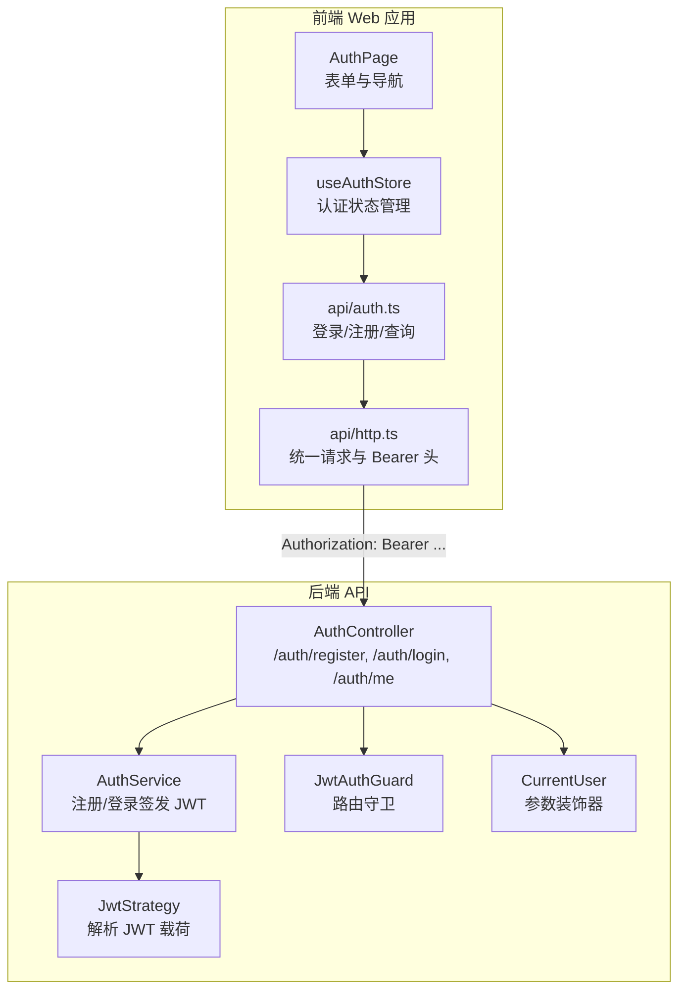
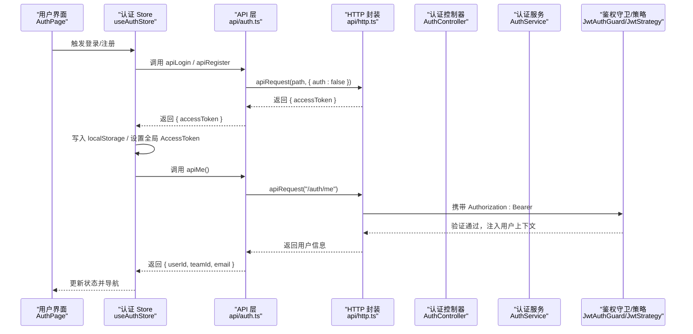
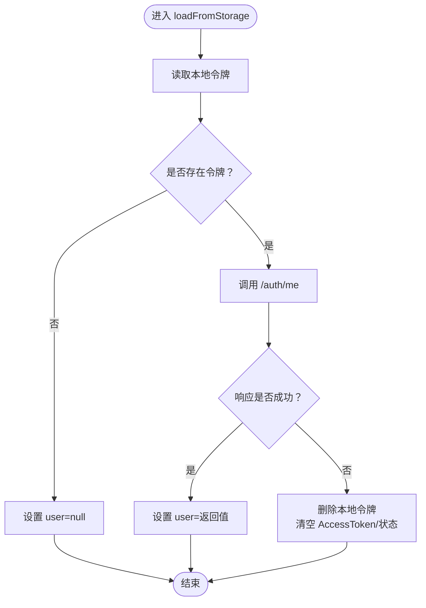
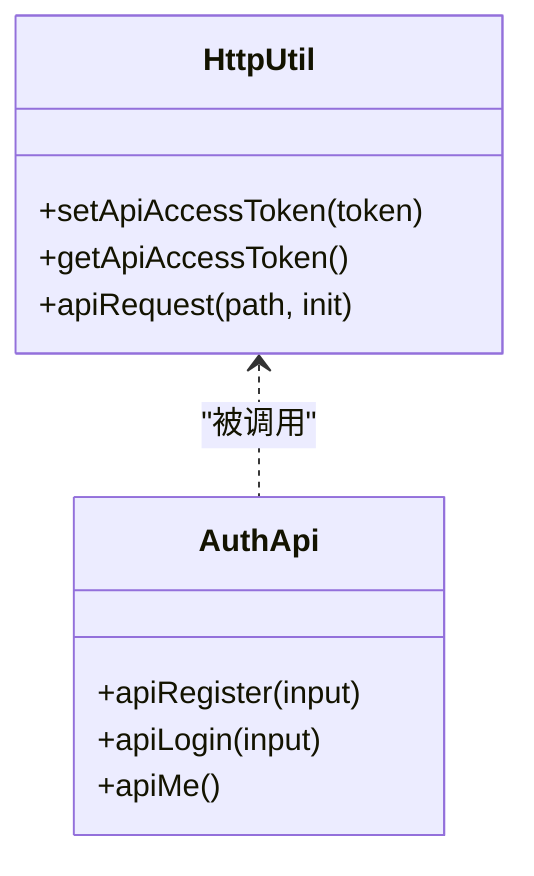
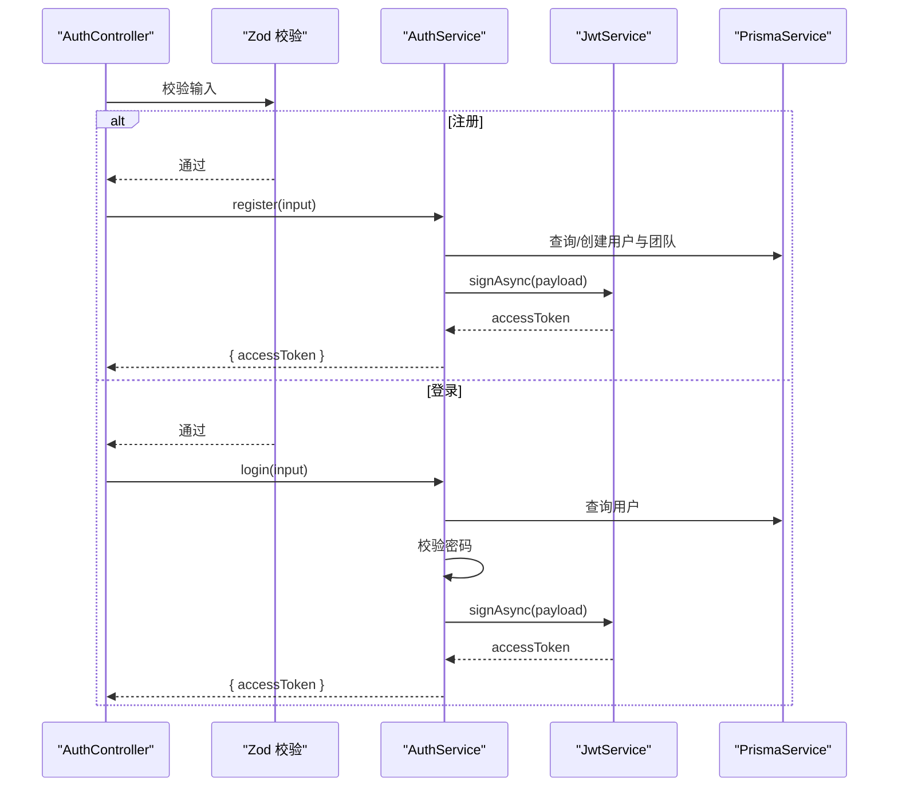
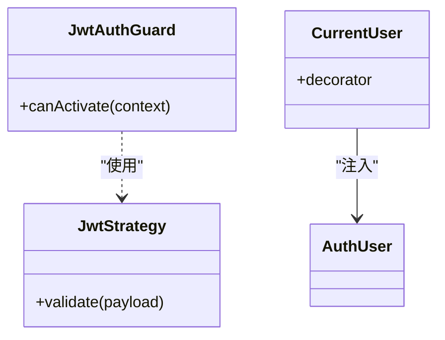
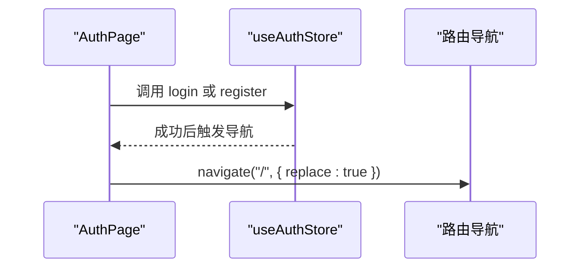
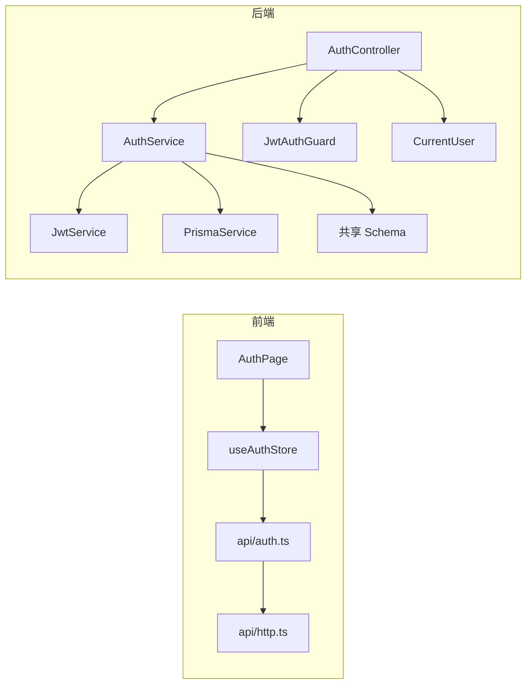
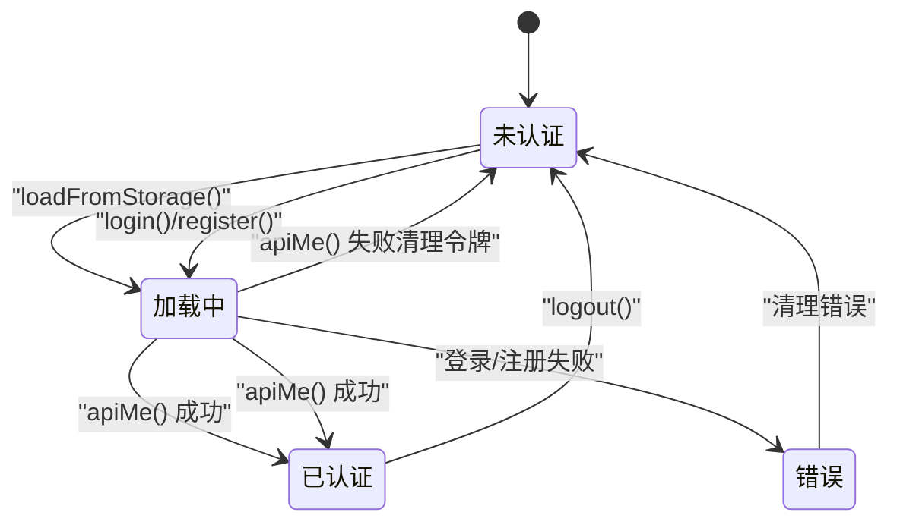

# 认证状态管理

<cite>
**本文档引用的文件**
- [apps/web/src/stores/authStore.ts](file://apps/web/src/stores/authStore.ts)
- [apps/web/src/lib/api/auth.ts](file://apps/web/src/lib/api/auth.ts)
- [apps/web/src/lib/api/http.ts](file://apps/web/src/lib/api/http.ts)
- [apps/web/src/components/AuthPage.tsx](file://apps/web/src/components/AuthPage.tsx)
- [apps/api/src/auth/auth.controller.ts](file://apps/api/src/auth/auth.controller.ts)
- [apps/api/src/auth/auth.service.ts](file://apps/api/src/auth/auth.service.ts)
- [apps/api/src/auth/jwt-auth.guard.ts](file://apps/api/src/auth/jwt-auth.guard.ts)
- [apps/api/src/auth/jwt.strategy.ts](file://apps/api/src/auth/jwt.strategy.ts)
- [apps/api/src/auth/current-user.decorator.ts](file://apps/api/src/auth/current-user.decorator.ts)
- [apps/api/src/auth/auth.types.ts](file://apps/api/src/auth/auth.types.ts)
- [packages/shared/src/schemas/auth.ts](file://packages/shared/src/schemas/auth.ts)
</cite>

## 目录

1. [简介](#简介)
2. [项目结构](#项目结构)
3. [核心组件](#核心组件)
4. [架构总览](#架构总览)
5. [详细组件分析](#详细组件分析)
6. [依赖关系分析](#依赖关系分析)
7. [性能考量](#性能考量)
8. [故障排查指南](#故障排查指南)
9. [结论](#结论)
10. [附录](#附录)

## 简介

本文件聚焦于 AIXSSS 项目的认证状态管理模块，系统性阐述前端认证 store 的状态结构与行为、JWT 令牌的获取与传递、登录/注册/登出流程、以及后端基于 JWT 的鉴权机制。文档还包含认证状态流转图、安全注意事项、调试技巧与常见问题解决方案，并提供可直接定位到源码的路径指引，便于快速查阅与二次开发。

## 项目结构

认证相关代码主要分布在前端 Web 应用与后端 API 两部分：

- 前端：使用 Zustand 管理认证状态，通过统一的 HTTP 请求封装发送认证请求并携带 Bearer Token。
- 后端：基于 NestJS Passport/JWT 实现登录注册接口与受保护的“当前用户”接口，使用策略解析 JWT 并注入用户上下文。

图表来源

- [apps/web/src/components/AuthPage.tsx](file://apps/web/src/components/AuthPage.tsx#L1-L35)
- [apps/web/src/stores/authStore.ts](file://apps/web/src/stores/authStore.ts#L1-L82)
- [apps/web/src/lib/api/auth.ts](file://apps/web/src/lib/api/auth.ts#L1-L21)
- [apps/web/src/lib/api/http.ts](file://apps/web/src/lib/api/http.ts#L1-L93)
- [apps/api/src/auth/auth.controller.ts](file://apps/api/src/auth/auth.controller.ts#L1-L33)
- [apps/api/src/auth/auth.service.ts](file://apps/api/src/auth/auth.service.ts#L1-L77)
- [apps/api/src/auth/jwt-auth.guard.ts](file://apps/api/src/auth/jwt-auth.guard.ts#L1-L8)
- [apps/api/src/auth/jwt.strategy.ts](file://apps/api/src/auth/jwt.strategy.ts#L1-L34)
- [apps/api/src/auth/current-user.decorator.ts](file://apps/api/src/auth/current-user.decorator.ts#L1-L10)

章节来源

- [apps/web/src/stores/authStore.ts](file://apps/web/src/stores/authStore.ts#L1-L82)
- [apps/web/src/lib/api/auth.ts](file://apps/web/src/lib/api/auth.ts#L1-L21)
- [apps/web/src/lib/api/http.ts](file://apps/web/src/lib/api/http.ts#L1-L93)
- [apps/api/src/auth/auth.controller.ts](file://apps/api/src/auth/auth.controller.ts#L1-L33)
- [apps/api/src/auth/auth.service.ts](file://apps/api/src/auth/auth.service.ts#L1-L77)
- [apps/api/src/auth/jwt-auth.guard.ts](file://apps/api/src/auth/jwt-auth.guard.ts#L1-L8)
- [apps/api/src/auth/jwt.strategy.ts](file://apps/api/src/auth/jwt.strategy.ts#L1-L34)
- [apps/api/src/auth/current-user.decorator.ts](file://apps/api/src/auth/current-user.decorator.ts#L1-L10)

## 核心组件

- 前端认证 store（Zustand）
  - 状态字段：访问令牌、当前用户信息、加载状态、错误信息
  - 关键方法：从本地存储恢复、登录、注册、登出
- 前端 API 封装
  - 登录/注册/查询当前用户三个接口
  - 统一请求函数负责拼接 URL、序列化体、附加 Authorization 头
- 后端认证控制器与服务
  - 提供注册/登录/查询当前用户接口
  - 使用 JWT 签发访问令牌；校验密码并绑定首个团队
- 鉴权守卫与策略
  - JwtAuthGuard 用于路由级鉴权
  - JwtStrategy 解析请求头中的 Bearer Token，验证并返回用户对象
- 参数校验
  - 使用共享 Schema 对注册/登录输入进行 Zod 校验

章节来源

- [apps/web/src/stores/authStore.ts](file://apps/web/src/stores/authStore.ts#L7-L17)
- [apps/web/src/lib/api/auth.ts](file://apps/web/src/lib/api/auth.ts#L3-L20)
- [apps/web/src/lib/api/http.ts](file://apps/web/src/lib/api/http.ts#L15-L23)
- [apps/api/src/auth/auth.controller.ts](file://apps/api/src/auth/auth.controller.ts#L9-L30)
- [apps/api/src/auth/auth.service.ts](file://apps/api/src/auth/auth.service.ts#L14-L20)
- [apps/api/src/auth/jwt-auth.guard.ts](file://apps/api/src/auth/jwt-auth.guard.ts#L4-L5)
- [apps/api/src/auth/jwt.strategy.ts](file://apps/api/src/auth/jwt.strategy.ts#L14-L31)
- [packages/shared/src/schemas/auth.ts](file://packages/shared/src/schemas/auth.ts#L3-L14)

## 架构总览

认证交互遵循“前端 store -> 前端 API -> 后端控制器 -> 服务签发 JWT -> 前端持久化与透传”的闭环。

图表来源

- [apps/web/src/components/AuthPage.tsx](file://apps/web/src/components/AuthPage.tsx#L22-L35)
- [apps/web/src/stores/authStore.ts](file://apps/web/src/stores/authStore.ts#L46-L59)
- [apps/web/src/lib/api/auth.ts](file://apps/web/src/lib/api/auth.ts#L6-L20)
- [apps/web/src/lib/api/http.ts](file://apps/web/src/lib/api/http.ts#L58-L92)
- [apps/api/src/auth/auth.controller.ts](file://apps/api/src/auth/auth.controller.ts#L19-L29)
- [apps/api/src/auth/jwt-auth.guard.ts](file://apps/api/src/auth/jwt-auth.guard.ts#L4-L5)
- [apps/api/src/auth/jwt.strategy.ts](file://apps/api/src/auth/jwt.strategy.ts#L14-L31)

## 详细组件分析

### 前端认证 Store（Zustand）

- 状态结构
  - accessToken: 字符串或空，作为后续请求的 Bearer Token
  - user: 当前用户信息（包含用户 ID、团队 ID、邮箱）
  - isLoading: 是否正在发起网络请求
  - error: 最近一次错误消息
- 行为与流程
  - loadFromStorage：从 localStorage 读取令牌，设置到全局 HTTP 封装；若存在则调用 /auth/me 获取用户信息；若失败则清理本地令牌与状态
  - login：发起登录请求，成功后写入本地存储、设置全局 AccessToken、调用 /auth/me 并更新状态
  - register：发起注册请求，成功后同上
  - logout：移除本地令牌、清除全局 AccessToken 与认证状态
- 错误处理
  - 所有异常均捕获并设置 error 字段，同时抛出以便上层 UI 显示

图表来源

- [apps/web/src/stores/authStore.ts](file://apps/web/src/stores/authStore.ts#L25-L44)

章节来源

- [apps/web/src/stores/authStore.ts](file://apps/web/src/stores/authStore.ts#L7-L17)
- [apps/web/src/stores/authStore.ts](file://apps/web/src/stores/authStore.ts#L25-L44)
- [apps/web/src/stores/authStore.ts](file://apps/web/src/stores/authStore.ts#L46-L59)
- [apps/web/src/stores/authStore.ts](file://apps/web/src/stores/authStore.ts#L61-L74)
- [apps/web/src/stores/authStore.ts](file://apps/web/src/stores/authStore.ts#L76-L81)

### 前端 API 与 HTTP 封装

- 接口定义
  - 注册：POST /auth/register
  - 登录：POST /auth/login
  - 查询当前用户：GET /auth/me
- HTTP 封装要点
  - 统一基地址拼接与 JSON 序列化
  - 自动附加 Authorization: Bearer 头（当存在令牌且接口需要鉴权时）
  - 非 2xx 响应抛出 ApiError，包含状态码与详情
  - 204 无内容时返回 undefined

图表来源

- [apps/web/src/lib/api/http.ts](file://apps/web/src/lib/api/http.ts#L15-L23)
- [apps/web/src/lib/api/http.ts](file://apps/web/src/lib/api/http.ts#L58-L92)
- [apps/web/src/lib/api/auth.ts](file://apps/web/src/lib/api/auth.ts#L6-L20)

章节来源

- [apps/web/src/lib/api/auth.ts](file://apps/web/src/lib/api/auth.ts#L3-L20)
- [apps/web/src/lib/api/http.ts](file://apps/web/src/lib/api/http.ts#L15-L23)
- [apps/web/src/lib/api/http.ts](file://apps/web/src/lib/api/http.ts#L58-L92)

### 后端认证控制器与服务

- 控制器
  - /auth/register：接收注册输入，Zod 校验后交由服务处理
  - /auth/login：接收登录输入，Zod 校验后交由服务处理
  - /auth/me：使用 JwtAuthGuard 保护，通过 CurrentUser 装饰器注入 AuthUser
- 服务
  - register：检查邮箱唯一性，哈希密码，创建用户与团队，签发 JWT
  - login：查找用户、校验密码、获取首个团队 ID，签发 JWT
  - issueAccessToken：使用 JwtService 生成 JWT

图表来源

- [apps/api/src/auth/auth.controller.ts](file://apps/api/src/auth/auth.controller.ts#L13-L29)
- [apps/api/src/auth/auth.service.ts](file://apps/api/src/auth/auth.service.ts#L22-L73)
- [packages/shared/src/schemas/auth.ts](file://packages/shared/src/schemas/auth.ts#L3-L14)

章节来源

- [apps/api/src/auth/auth.controller.ts](file://apps/api/src/auth/auth.controller.ts#L9-L30)
- [apps/api/src/auth/auth.service.ts](file://apps/api/src/auth/auth.service.ts#L14-L20)
- [apps/api/src/auth/auth.service.ts](file://apps/api/src/auth/auth.service.ts#L22-L73)
- [packages/shared/src/schemas/auth.ts](file://packages/shared/src/schemas/auth.ts#L3-L14)

### 鉴权守卫与策略

- JwtAuthGuard：继承自 AuthGuard('jwt')，用于路由级鉴权
- JwtStrategy：配置从 Authorization 头提取 Bearer Token，使用配置的密钥验证签名，返回 AuthUser
- CurrentUser：从请求对象中取出已验证的用户上下文

图表来源

- [apps/api/src/auth/jwt-auth.guard.ts](file://apps/api/src/auth/jwt-auth.guard.ts#L4-L5)
- [apps/api/src/auth/jwt.strategy.ts](file://apps/api/src/auth/jwt.strategy.ts#L14-L31)
- [apps/api/src/auth/current-user.decorator.ts](file://apps/api/src/auth/current-user.decorator.ts#L4-L6)
- [apps/api/src/auth/auth.types.ts](file://apps/api/src/auth/auth.types.ts#L1-L5)

章节来源

- [apps/api/src/auth/jwt-auth.guard.ts](file://apps/api/src/auth/jwt-auth.guard.ts#L1-L8)
- [apps/api/src/auth/jwt.strategy.ts](file://apps/api/src/auth/jwt.strategy.ts#L8-L31)
- [apps/api/src/auth/current-user.decorator.ts](file://apps/api/src/auth/current-user.decorator.ts#L1-L10)
- [apps/api/src/auth/auth.types.ts](file://apps/api/src/auth/auth.types.ts#L1-L5)

### 登录页面与自动重定向

- AuthPage 负责切换登录/注册模式、收集输入、调用 store 的 login/register 方法
- 成功后通过路由导航跳转至首页，并替换历史记录

图表来源

- [apps/web/src/components/AuthPage.tsx](file://apps/web/src/components/AuthPage.tsx#L22-L35)
- [apps/web/src/stores/authStore.ts](file://apps/web/src/stores/authStore.ts#L46-L59)

章节来源

- [apps/web/src/components/AuthPage.tsx](file://apps/web/src/components/AuthPage.tsx#L1-L35)
- [apps/web/src/stores/authStore.ts](file://apps/web/src/stores/authStore.ts#L46-L59)

## 依赖关系分析

- 前端
  - useAuthStore 依赖 api/auth.ts 与 api/http.ts
  - api/auth.ts 依赖 api/http.ts 进行请求
  - AuthPage 依赖 useAuthStore
- 后端
  - AuthController 依赖 AuthService、JwtAuthGuard、CurrentUser
  - AuthService 依赖 JwtService、PrismaService、共享 Schema
  - JwtStrategy 依赖 ConfigService 与 JwtService

图表来源

- [apps/web/src/components/AuthPage.tsx](file://apps/web/src/components/AuthPage.tsx#L7-L20)
- [apps/web/src/stores/authStore.ts](file://apps/web/src/stores/authStore.ts#L1-L3)
- [apps/web/src/lib/api/auth.ts](file://apps/web/src/lib/api/auth.ts#L1-L2)
- [apps/web/src/lib/api/http.ts](file://apps/web/src/lib/api/http.ts#L1-L1)
- [apps/api/src/auth/auth.controller.ts](file://apps/api/src/auth/auth.controller.ts#L1-L7)
- [apps/api/src/auth/auth.service.ts](file://apps/api/src/auth/auth.service.ts#L1-L6)
- [packages/shared/src/schemas/auth.ts](file://packages/shared/src/schemas/auth.ts#L1-L1)

章节来源

- [apps/web/src/stores/authStore.ts](file://apps/web/src/stores/authStore.ts#L1-L3)
- [apps/web/src/lib/api/auth.ts](file://apps/web/src/lib/api/auth.ts#L1-L2)
- [apps/api/src/auth/auth.controller.ts](file://apps/api/src/auth/auth.controller.ts#L1-L7)
- [apps/api/src/auth/auth.service.ts](file://apps/api/src/auth/auth.service.ts#L1-L6)
- [packages/shared/src/schemas/auth.ts](file://packages/shared/src/schemas/auth.ts#L1-L1)

## 性能考量

- 令牌持久化：前端使用 localStorage 存储访问令牌，减少每次刷新的重复登录开销
- 请求复用：统一 HTTP 封装避免重复序列化与头部拼接逻辑
- 令牌校验：首次加载时调用 /auth/me 校验令牌有效性，无效即清理，避免后续请求反复失败
- 密码加密：后端使用 bcrypt 哈希存储密码，降低泄露风险

[本节为通用建议，不直接分析具体文件]

## 故障排查指南

- 常见错误与定位
  - 登录/注册失败：检查 api/auth.ts 的请求与 api/http.ts 的响应处理，关注 ApiError 的状态码与详情
  - 令牌无效：前端 store 在 loadFromStorage 时会清理本地令牌并重置状态；确认后端 JWT 密钥配置正确
  - 未授权访问：确认路由是否应用 JwtAuthGuard，请求头是否包含正确的 Authorization: Bearer
- 调试技巧
  - 在浏览器控制台查看 ApiError 的 detail 字段，结合后端日志中的请求 ID 定位问题
  - 在 api/http.ts 中打印请求 URL 与头信息，核对 Authorization 是否正确
  - 在 useAuthStore 中断点观察状态变化，确认本地存储与全局 AccessToken 的同步
- 常见问题
  - 输入格式错误：确保注册/登录输入符合共享 Schema 的约束
  - 团队缺失：登录时若用户无团队，后端会返回未授权错误，需先完成团队初始化

章节来源

- [apps/web/src/lib/api/http.ts](file://apps/web/src/lib/api/http.ts#L3-L13)
- [apps/web/src/lib/api/http.ts](file://apps/web/src/lib/api/http.ts#L80-L86)
- [apps/web/src/stores/authStore.ts](file://apps/web/src/stores/authStore.ts#L35-L43)
- [apps/api/src/auth/auth.service.ts](file://apps/api/src/auth/auth.service.ts#L58-L73)
- [packages/shared/src/schemas/auth.ts](file://packages/shared/src/schemas/auth.ts#L3-L14)

## 结论

该认证体系以前端 Zustand store 为核心，结合统一的 HTTP 封装与后端 JWT 鉴权，实现了从登录注册到令牌持久化与自动校验的完整闭环。前端负责状态管理与 UI 导航，后端负责令牌签发与路由保护，二者通过标准的 Bearer Token 协议协作。整体设计清晰、职责分离明确，具备良好的扩展性与安全性基础。

[本节为总结，不直接分析具体文件]

## 附录

### 认证状态流转图

图表来源

- [apps/web/src/stores/authStore.ts](file://apps/web/src/stores/authStore.ts#L25-L44)
- [apps/web/src/stores/authStore.ts](file://apps/web/src/stores/authStore.ts#L46-L59)
- [apps/web/src/stores/authStore.ts](file://apps/web/src/stores/authStore.ts#L76-L81)

### 安全考虑事项

- 令牌存储：localStorage 易受 XSS 攻击，建议在生产环境启用 HttpOnly/SameSite Cookie 并配合 CSRF 保护
- 密钥管理：JWT 密钥必须安全存储，定期轮换；避免硬编码在客户端
- 输入校验：前后端均需严格校验，防止越权与注入
- 传输安全：生产环境必须启用 HTTPS，防止中间人攻击
- 权限边界：后端 JwtAuthGuard 与 CurrentUser 必须正确应用到所有敏感接口

[本节为通用建议，不直接分析具体文件]

### 实际使用示例（路径指引）

- 登录流程入口：[apps/web/src/components/AuthPage.tsx](file://apps/web/src/components/AuthPage.tsx#L22-L35)
- 登录/注册/查询当前用户 API：[apps/web/src/lib/api/auth.ts](file://apps/web/src/lib/api/auth.ts#L6-L20)
- 全局 HTTP 封装与 Bearer 头：[apps/web/src/lib/api/http.ts](file://apps/web/src/lib/api/http.ts#L58-L72)
- 前端认证 store 状态与方法：[apps/web/src/stores/authStore.ts](file://apps/web/src/stores/authStore.ts#L7-L17)
- 后端控制器与鉴权：[apps/api/src/auth/auth.controller.ts](file://apps/api/src/auth/auth.controller.ts#L9-L30)
- JWT 策略与守卫：[apps/api/src/auth/jwt.strategy.ts](file://apps/api/src/auth/jwt.strategy.ts#L14-L31), [apps/api/src/auth/jwt-auth.guard.ts](file://apps/api/src/auth/jwt-auth.guard.ts#L4-L5)
- 用户上下文注入：[apps/api/src/auth/current-user.decorator.ts](file://apps/api/src/auth/current-user.decorator.ts#L4-L6)
- 输入校验 Schema：[packages/shared/src/schemas/auth.ts](file://packages/shared/src/schemas/auth.ts#L3-L14)
