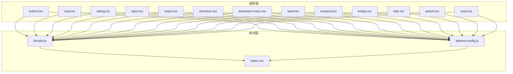
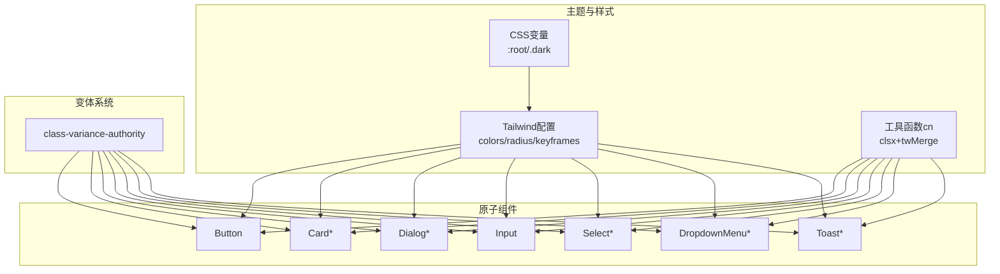
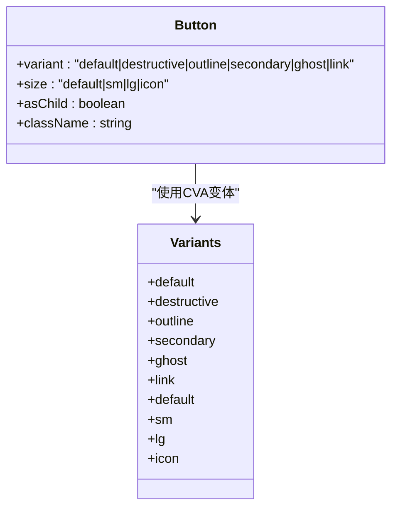
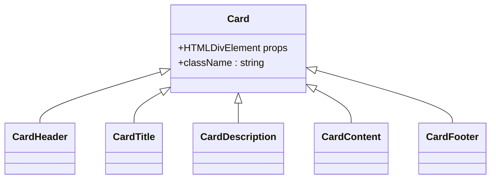
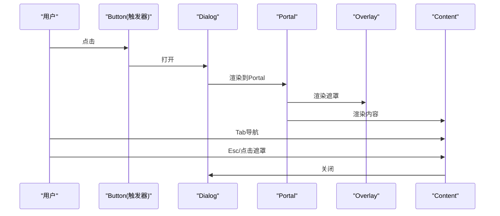
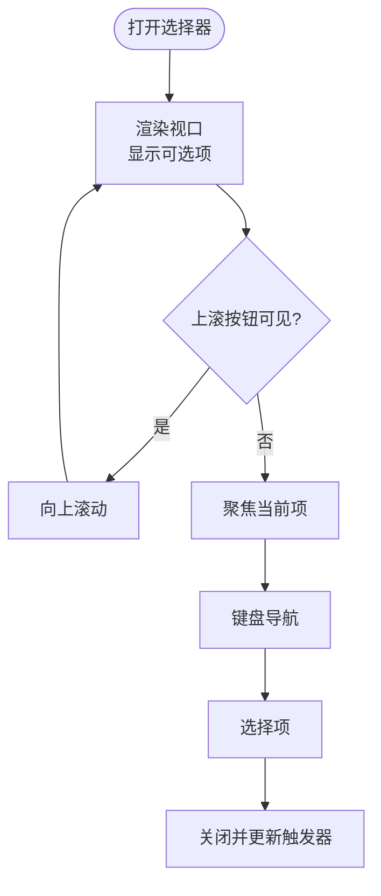
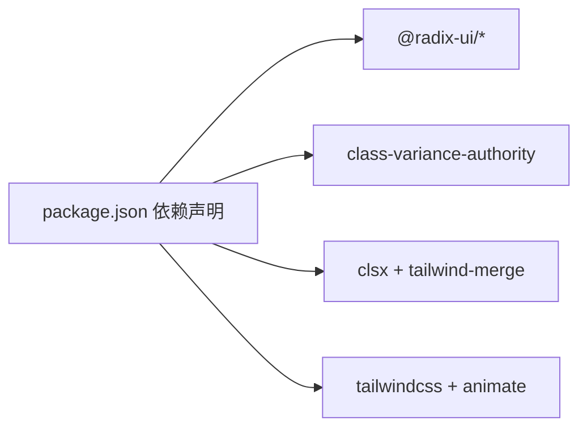

# UI组件库

<cite>
**本文引用的文件**
- [apps/web/src/components/ui/button.tsx](file://apps/web/src/components/ui/button.tsx)
- [apps/web/src/components/ui/card.tsx](file://apps/web/src/components/ui/card.tsx)
- [apps/web/src/components/ui/dialog.tsx](file://apps/web/src/components/ui/dialog.tsx)
- [apps/web/src/components/ui/input.tsx](file://apps/web/src/components/ui/input.tsx)
- [apps/web/src/components/ui/select.tsx](file://apps/web/src/components/ui/select.tsx)
- [apps/web/src/components/ui/checkbox.tsx](file://apps/web/src/components/ui/checkbox.tsx)
- [apps/web/src/components/ui/dropdown-menu.tsx](file://apps/web/src/components/ui/dropdown-menu.tsx)
- [apps/web/src/components/ui/label.tsx](file://apps/web/src/components/ui/label.tsx)
- [apps/web/src/components/ui/textarea.tsx](file://apps/web/src/components/ui/textarea.tsx)
- [apps/web/src/components/ui/badge.tsx](file://apps/web/src/components/ui/badge.tsx)
- [apps/web/src/components/ui/tabs.tsx](file://apps/web/src/components/ui/tabs.tsx)
- [apps/web/src/components/ui/switch.tsx](file://apps/web/src/components/ui/switch.tsx)
- [apps/web/src/components/ui/toast.tsx](file://apps/web/src/components/ui/toast.tsx)
- [apps/web/src/lib/utils.ts](file://apps/web/src/lib/utils.ts)
- [apps/web/tailwind.config.js](file://apps/web/tailwind.config.js)
- [apps/web/src/index.css](file://apps/web/src/index.css)
- [apps/web/package.json](file://apps/web/package.json)
</cite>

## 目录

1. [简介](#简介)
2. [项目结构](#项目结构)
3. [核心组件](#核心组件)
4. [架构总览](#架构总览)
5. [组件详解](#组件详解)
6. [依赖关系分析](#依赖关系分析)
7. [性能与可访问性](#性能与可访问性)
8. [故障排查指南](#故障排查指南)
9. [结论](#结论)
10. [附录](#附录)

## 简介

本文件面向AIXSSS前端应用的UI组件库，系统化阐述基于Radix UI与TailwindCSS构建的原子组件设计理念与实现细节。重点覆盖button、card、dialog、input、select等基础组件的props接口、样式定制选项、主题支持与无障碍访问特性；提供使用示例、最佳实践与组合模式；解释组件间的依赖关系与样式继承机制，并说明响应式设计与跨浏览器兼容性策略。

## 项目结构

UI组件集中位于应用前端的组件目录，采用“按功能域拆分”的组织方式：基础原子组件（button、input、select等）位于统一的ui目录下；布局与容器组件（如card、dialog）独立成组；工具与辅助组件（badge、tabs、toast等）按职责划分。样式通过TailwindCSS与自定义CSS变量实现主题化与一致性；工具函数cn负责类名合并与冲突修复。

图表来源

- [apps/web/src/components/ui/button.tsx](file://apps/web/src/components/ui/button.tsx#L1-L51)
- [apps/web/src/components/ui/card.tsx](file://apps/web/src/components/ui/card.tsx#L1-L56)
- [apps/web/src/components/ui/dialog.tsx](file://apps/web/src/components/ui/dialog.tsx#L1-L104)
- [apps/web/src/components/ui/input.tsx](file://apps/web/src/components/ui/input.tsx#L1-L23)
- [apps/web/src/components/ui/select.tsx](file://apps/web/src/components/ui/select.tsx#L1-L152)
- [apps/web/src/components/ui/checkbox.tsx](file://apps/web/src/components/ui/checkbox.tsx#L1-L27)
- [apps/web/src/components/ui/dropdown-menu.tsx](file://apps/web/src/components/ui/dropdown-menu.tsx#L1-L186)
- [apps/web/src/components/ui/label.tsx](file://apps/web/src/components/ui/label.tsx#L1-L20)
- [apps/web/src/components/ui/textarea.tsx](file://apps/web/src/components/ui/textarea.tsx#L1-L22)
- [apps/web/src/components/ui/badge.tsx](file://apps/web/src/components/ui/badge.tsx#L1-L33)
- [apps/web/src/components/ui/tabs.tsx](file://apps/web/src/components/ui/tabs.tsx#L1-L54)
- [apps/web/src/components/ui/switch.tsx](file://apps/web/src/components/ui/switch.tsx#L1-L28)
- [apps/web/src/components/ui/toast.tsx](file://apps/web/src/components/ui/toast.tsx#L1-L126)
- [apps/web/src/lib/utils.ts](file://apps/web/src/lib/utils.ts#L1-L7)
- [apps/web/tailwind.config.js](file://apps/web/tailwind.config.js#L1-L216)
- [apps/web/src/index.css](file://apps/web/src/index.css#L1-L427)

章节来源

- [apps/web/src/components/ui/button.tsx](file://apps/web/src/components/ui/button.tsx#L1-L51)
- [apps/web/src/components/ui/card.tsx](file://apps/web/src/components/ui/card.tsx#L1-L56)
- [apps/web/src/components/ui/dialog.tsx](file://apps/web/src/components/ui/dialog.tsx#L1-L104)
- [apps/web/src/components/ui/input.tsx](file://apps/web/src/components/ui/input.tsx#L1-L23)
- [apps/web/src/components/ui/select.tsx](file://apps/web/src/components/ui/select.tsx#L1-L152)
- [apps/web/src/components/ui/checkbox.tsx](file://apps/web/src/components/ui/checkbox.tsx#L1-L27)
- [apps/web/src/components/ui/dropdown-menu.tsx](file://apps/web/src/components/ui/dropdown-menu.tsx#L1-L186)
- [apps/web/src/components/ui/label.tsx](file://apps/web/src/components/ui/label.tsx#L1-L20)
- [apps/web/src/components/ui/textarea.tsx](file://apps/web/src/components/ui/textarea.tsx#L1-L22)
- [apps/web/src/components/ui/badge.tsx](file://apps/web/src/components/ui/badge.tsx#L1-L33)
- [apps/web/src/components/ui/tabs.tsx](file://apps/web/src/components/ui/tabs.tsx#L1-L54)
- [apps/web/src/components/ui/switch.tsx](file://apps/web/src/components/ui/switch.tsx#L1-L28)
- [apps/web/src/components/ui/toast.tsx](file://apps/web/src/components/ui/toast.tsx#L1-L126)
- [apps/web/src/lib/utils.ts](file://apps/web/src/lib/utils.ts#L1-L7)
- [apps/web/tailwind.config.js](file://apps/web/tailwind.config.js#L1-L216)
- [apps/web/src/index.css](file://apps/web/src/index.css#L1-L427)

## 核心组件

本节概述关键原子组件的设计理念与能力边界：

- button：通过变体与尺寸的组合实现多形态按钮，支持asChild以嵌入任意元素，具备无障碍与焦点环支持。
- card：卡片容器及其子块（头、标题、描述、内容、尾），用于信息分组与层级表达。
- dialog：基于Radix UI的对话框，提供触发器、门户、遮罩、内容、标题、描述与关闭控制，内置动画与无障碍语义。
- input：输入框基础样式，支持禁用、占位符与焦点环。
- select：选择器组件族，包含触发器、内容、项、滚动按钮与标签，支持弹出定位与键盘导航。
- checkbox、switch：原生交互语义与视觉反馈，配合Radix UI状态属性。
- dropdown-menu：下拉菜单体系，支持子菜单、复选/单选项、快捷键提示与动画。
- label、textarea、badge、tabs、toast：分别承担标签、多行文本、标记徽章、选项卡与通知等常见UI需求。

章节来源

- [apps/web/src/components/ui/button.tsx](file://apps/web/src/components/ui/button.tsx#L35-L50)
- [apps/web/src/components/ui/card.tsx](file://apps/web/src/components/ui/card.tsx#L5-L56)
- [apps/web/src/components/ui/dialog.tsx](file://apps/web/src/components/ui/dialog.tsx#L8-L104)
- [apps/web/src/components/ui/input.tsx](file://apps/web/src/components/ui/input.tsx#L5-L23)
- [apps/web/src/components/ui/select.tsx](file://apps/web/src/components/ui/select.tsx#L8-L152)
- [apps/web/src/components/ui/checkbox.tsx](file://apps/web/src/components/ui/checkbox.tsx#L7-L27)
- [apps/web/src/components/ui/dropdown-menu.tsx](file://apps/web/src/components/ui/dropdown-menu.tsx#L6-L186)
- [apps/web/src/components/ui/label.tsx](file://apps/web/src/components/ui/label.tsx#L11-L20)
- [apps/web/src/components/ui/textarea.tsx](file://apps/web/src/components/ui/textarea.tsx#L5-L22)
- [apps/web/src/components/ui/badge.tsx](file://apps/web/src/components/ui/badge.tsx#L25-L33)
- [apps/web/src/components/ui/tabs.tsx](file://apps/web/src/components/ui/tabs.tsx#L6-L54)
- [apps/web/src/components/ui/toast.tsx](file://apps/web/src/components/ui/toast.tsx#L7-L126)

## 架构总览

组件库采用“原子组件 + 变体系统 + 主题变量”的三层架构：

- 原子组件：以最小可复用单元为核心，封装交互与视觉。
- 变体系统：通过class-variance-authority在运行时生成类名，统一管理变体与尺寸。
- 主题系统：基于TailwindCSS变量与CSS自定义属性，实现明暗主题与品牌色系切换。

图表来源

- [apps/web/src/index.css](file://apps/web/src/index.css#L5-L115)
- [apps/web/tailwind.config.js](file://apps/web/tailwind.config.js#L21-L83)
- [apps/web/src/lib/utils.ts](file://apps/web/src/lib/utils.ts#L4-L6)
- [apps/web/src/components/ui/button.tsx](file://apps/web/src/components/ui/button.tsx#L8-L33)
- [apps/web/src/components/ui/card.tsx](file://apps/web/src/components/ui/card.tsx#L5-L14)
- [apps/web/src/components/ui/dialog.tsx](file://apps/web/src/components/ui/dialog.tsx#L16-L53)
- [apps/web/src/components/ui/input.tsx](file://apps/web/src/components/ui/input.tsx#L5-L11)
- [apps/web/src/components/ui/select.tsx](file://apps/web/src/components/ui/select.tsx#L14-L91)
- [apps/web/src/components/ui/dropdown-menu.tsx](file://apps/web/src/components/ui/dropdown-menu.tsx#L54-L71)
- [apps/web/src/components/ui/toast.tsx](file://apps/web/src/components/ui/toast.tsx#L24-L52)

## 组件详解

### Button（按钮）

- 设计要点
  - 使用变体与尺寸组合，支持默认、破坏性、描边、次级、幽灵、链接等变体与默认、小、大、图标四种尺寸。
  - 支持asChild以渲染为任意元素（如Link），提升语义与可访问性。
  - 内置焦点环、悬停阴影与禁用态处理。
- Props接口
  - 继承原生button属性，新增variant、size、asChild。
- 样式定制
  - 通过Tailwind变量与CVA变体映射，可在业务层扩展新变体或尺寸。
- 无障碍
  - 自动获得焦点环与键盘可用性；禁用态阻止交互事件。
- 最佳实践
  - 优先使用变体表达语义，避免直接写内联样式。
  - 图标按钮使用icon尺寸，确保可点击区域符合WCAG建议。
- 组合模式
  - 与Badge、Tooltip等组合，实现“操作+状态”型按钮。

图表来源

- [apps/web/src/components/ui/button.tsx](file://apps/web/src/components/ui/button.tsx#L8-L33)
- [apps/web/src/components/ui/button.tsx](file://apps/web/src/components/ui/button.tsx#L35-L50)

章节来源

- [apps/web/src/components/ui/button.tsx](file://apps/web/src/components/ui/button.tsx#L8-L50)

### Card（卡片）

- 设计要点
  - 提供Card容器与其子块：CardHeader、CardTitle、CardDescription、CardContent、CardFooter，便于结构化内容展示。
  - 默认使用圆角、边框与阴影，适配卡片式布局。
- Props接口
  - 所有子组件均继承HTML属性，支持className扩展。
- 样式定制
  - 通过Tailwind变量控制背景、前景色与阴影；可叠加hover-lift等工具类实现悬浮效果。
- 无障碍
  - 建议在标题处使用语义化标签，必要时添加aria-labelledby。
- 最佳实践
  - 将Card作为独立模块的根容器，避免在卡片内部再套复杂布局。
- 组合模式
  - 与Button、Badge组合，实现“卡片列表”或“卡片详情页”。

图表来源

- [apps/web/src/components/ui/card.tsx](file://apps/web/src/components/ui/card.tsx#L5-L56)

章节来源

- [apps/web/src/components/ui/card.tsx](file://apps/web/src/components/ui/card.tsx#L5-L56)

### Dialog（对话框）

- 设计要点
  - 基于Radix UI，提供Root、Trigger、Portal、Overlay、Content、Title、Description、Close等子组件。
  - 内置入场/出场动画与居中定位，支持Esc关闭与点击遮罩关闭。
- Props接口
  - Overlay、Content、Title、Description等均支持className与原生属性透传。
- 样式定制
  - 通过Tailwind变量控制背景、边框与阴影；可结合动画类实现不同进入方向。
- 无障碍
  - 自动管理焦点陷阱与aria-modal；关闭按钮包含sr-only文本。
- 最佳实践
  - 在Content中优先放置可聚焦元素，确保首次焦点正确。
- 组合模式
  - 与Button组合作为触发器；与Form组合实现表单对话框。

图表来源

- [apps/web/src/components/ui/dialog.tsx](file://apps/web/src/components/ui/dialog.tsx#L8-L53)

章节来源

- [apps/web/src/components/ui/dialog.tsx](file://apps/web/src/components/ui/dialog.tsx#L8-L104)

### Input（输入框）

- 设计要点
  - 统一边框、圆角、阴影与占位符颜色；支持禁用态与焦点环。
  - 适配移动端输入优化（字体大小、触摸目标）。
- Props接口
  - 继承原生input属性，支持type与className。
- 样式定制
  - 可通过Tailwind变量调整边框与背景；与Label组合时保持一致性。
- 无障碍
  - 建议与Label配对使用，设置htmlFor与forId。
- 最佳实践
  - 对必填字段添加aria-required；对错误状态使用aria-invalid。
- 组合模式
  - 与Label、Button组合实现表单控件组。

章节来源

- [apps/web/src/components/ui/input.tsx](file://apps/web/src/components/ui/input.tsx#L5-L23)

### Select（选择器）

- 设计要点
  - 触发器显示当前值，内容区支持滚动按钮与视口；项支持选中指示器。
  - 支持分组、标签与分隔线，满足复杂选项场景。
- Props接口
  - Root、Trigger、Content、Item、Label、Separator等均支持className与原生属性。
- 样式定制
  - 通过Tailwind变量控制背景、边框与选中态；支持popper定位偏移。
- 无障碍
  - 自动管理键盘导航与ARIA属性；支持placeholder语义化。
- 最佳实践
  - 大量选项时启用滚动按钮；对不可编辑值使用禁用态。
- 组合模式
  - 与Form、Label组合实现可控下拉表单。

图表来源

- [apps/web/src/components/ui/select.tsx](file://apps/web/src/components/ui/select.tsx#L62-L91)
- [apps/web/src/components/ui/select.tsx](file://apps/web/src/components/ui/select.tsx#L106-L126)

章节来源

- [apps/web/src/components/ui/select.tsx](file://apps/web/src/components/ui/select.tsx#L8-L152)

### Checkbox（复选框）

- 设计要点
  - 基于Radix UI，使用指示器渲染选中图标；支持禁用态与焦点环。
- Props接口
  - 继承原生属性，支持checked、disabled等。
- 样式定制
  - 通过Tailwind变量控制边框、背景与图标颜色。
- 无障碍
  - 自动同步data-state属性，便于样式与状态一致。
- 最佳实践
  - 与Label组合，确保点击区域与文本关联。

章节来源

- [apps/web/src/components/ui/checkbox.tsx](file://apps/web/src/components/ui/checkbox.tsx#L7-L27)

### DropdownMenu（下拉菜单）

- 设计要点
  - 支持主菜单与子菜单、复选/单选项、快捷键提示与分隔线；内置动画与定位。
- Props接口
  - Content、Item、CheckboxItem、RadioItem、Label、Separator等均支持className与原生属性。
- 样式定制
  - 通过Tailwind变量控制背景、边框与选中态；支持侧向滑入动画。
- 无障碍
  - 自动管理焦点与键盘导航；支持子菜单展开/收起。
- 最佳实践
  - 子菜单使用inset缩进，增强层级感；快捷键使用右对齐工具类。
- 组合模式
  - 与Button组合作为菜单触发器。

章节来源

- [apps/web/src/components/ui/dropdown-menu.tsx](file://apps/web/src/components/ui/dropdown-menu.tsx#L54-L186)

### Label（标签）

- 设计要点
  - 通过变体系统提供默认样式，支持禁用态与禁用指针事件。
- Props接口
  - 继承原生属性，支持VariantProps以扩展变体。
- 样式定制
  - 通过Tailwind变量控制文字颜色与行高。
- 无障碍
  - 与表单控件配对使用，提升可访问性。

章节来源

- [apps/web/src/components/ui/label.tsx](file://apps/web/src/components/ui/label.tsx#L11-L20)

### Textarea（多行文本）

- 设计要点
  - 统一边框、圆角与占位符颜色；支持禁用态与焦点环。
- Props接口
  - 继承原生textarea属性，支持className。
- 样式定制
  - 可通过Tailwind变量调整边框与背景。
- 无障碍
  - 建议与Label配对使用；对长度限制提供aria-describedby。

章节来源

- [apps/web/src/components/ui/textarea.tsx](file://apps/web/src/components/ui/textarea.tsx#L5-L22)

### Badge（徽章）

- 设计要点
  - 提供默认、次级、破坏性与描边四种变体，适合状态标识与标签。
- Props接口
  - 继承HTML属性，支持VariantProps以扩展变体。
- 样式定制
  - 通过Tailwind变量控制边框、背景与文字颜色。
- 无障碍
  - 作为装饰性元素时，注意不干扰主要交互。

章节来源

- [apps/web/src/components/ui/badge.tsx](file://apps/web/src/components/ui/badge.tsx#L25-L33)

### Tabs（选项卡）

- 设计要点
  - 提供列表、触发器与内容区，支持激活态样式与阴影。
- Props接口
  - List、Trigger、Content均支持className与原生属性。
- 样式定制
  - 通过Tailwind变量控制背景、文字与激活态对比度。
- 无障碍
  - 自动管理键盘导航与aria-selected。

章节来源

- [apps/web/src/components/ui/tabs.tsx](file://apps/web/src/components/ui/tabs.tsx#L6-L54)

### Switch（开关）

- 设计要点
  - 基于Radix UI，支持激活/非激活两种状态与平滑过渡。
- Props接口
  - 继承原生属性，支持className。
- 样式定制
  - 通过Tailwind变量控制滑块与轨道颜色。
- 无障碍
  - 自动同步data-state属性，便于样式与状态一致。

章节来源

- [apps/web/src/components/ui/switch.tsx](file://apps/web/src/components/ui/switch.tsx#L6-L28)

### Toast（通知）

- 设计要点
  - 提供Provider、Viewport、Toast、Title、Description、Close、Action等子组件；支持滑动关闭与破坏性样式。
- Props接口
  - Root、Viewport、Action、Close、Title、Description均支持className与原生属性。
- 样式定制
  - 通过Tailwind变量控制背景、边框与破坏性样式；支持多种动画进入/退出。
- 无障碍
  - 自动管理可访问性属性与滑动交互。
- 最佳实践
  - 错误通知使用破坏性样式；重要操作提供Action按钮。

章节来源

- [apps/web/src/components/ui/toast.tsx](file://apps/web/src/components/ui/toast.tsx#L7-L126)

## 依赖关系分析

- 组件间依赖
  - 大多数组件依赖utils中的cn进行类名合并，避免冲突。
  - 多数组件依赖Radix UI原语以实现可访问性与状态管理。
  - 主题系统由Tailwind变量与CSS自定义属性共同驱动。
- 外部依赖
  - Radix UI系列包提供可访问性与状态控制。
  - class-variance-authority与clsx/tailwind-merge提供变体与类名合并能力。
  - TailwindCSS与tailwindcss-animate提供样式与动画能力。

图表来源

- [apps/web/package.json](file://apps/web/package.json#L22-L62)

章节来源

- [apps/web/package.json](file://apps/web/package.json#L22-L62)

## 性能与可访问性

- 性能
  - 使用变体系统按需生成类名，减少重复样式；工具函数cn仅在运行时合并类名，避免运行时计算开销。
  - 动画通过Tailwind动画类与CSS变量实现，避免JavaScript动画抖动。
- 可访问性
  - 大部分组件已内置焦点环、键盘导航与ARIA属性；建议在业务层补充必要的aria-\*属性与语义化标签。
  - 对图标按钮提供sr-only文本；对表单控件与标签建立明确关联。

[本节为通用指导，无需特定文件引用]

## 故障排查指南

- 类名冲突
  - 症状：样式错乱或覆盖异常。
  - 排查：确认是否正确使用cn合并类名；检查Tailwind变量是否被覆盖。
  - 参考：工具函数cn的实现与Tailwind变量定义。
- 动画异常
  - 症状：动画不生效或闪烁。
  - 排查：检查Tailwind动画类是否存在；确认CSS变量未被重置。
  - 参考：Tailwind配置与index.css中的动画定义。
- 可访问性问题
  - 症状：键盘无法操作或屏幕阅读器无法识别。
  - 排查：确认Radix UI原语使用正确；为图标按钮提供替代文本；为表单控件绑定标签。
  - 参考：各组件的无障碍实现与Props接口。

章节来源

- [apps/web/src/lib/utils.ts](file://apps/web/src/lib/utils.ts#L4-L6)
- [apps/web/tailwind.config.js](file://apps/web/tailwind.config.js#L188-L200)
- [apps/web/src/index.css](file://apps/web/src/index.css#L163-L333)

## 结论

本UI组件库以Radix UI为交互基石、以TailwindCSS为主题引擎，通过变体系统与工具函数实现高内聚、低耦合的原子组件设计。组件在样式、主题与可访问性方面具备良好一致性，适合在复杂业务场景中快速搭建一致、可维护的界面。建议在实际使用中遵循最佳实践，结合业务扩展变体与组合模式，持续优化用户体验。

[本节为总结性内容，无需特定文件引用]

## 附录

- 主题变量与颜色体系
  - 通过CSS变量定义明/暗两套主题，覆盖背景、前景、卡片、弹出层、主色、次色、破坏性、强调色等。
  - Tailwind配置扩展了圆角半径、阴影、动画与字体族，确保组件风格统一。
- 响应式与跨浏览器
  - 使用Tailwind响应式前缀与现代浏览器特性；对旧版浏览器提供渐进增强与回退方案。
- 组件组合清单
  - 常见组合：Button + Badge、Card + Button、Dialog + Form、Select + Label、DropdownMenu + Button、Toast + Action。

章节来源

- [apps/web/src/index.css](file://apps/web/src/index.css#L5-L115)
- [apps/web/tailwind.config.js](file://apps/web/tailwind.config.js#L6-L212)
