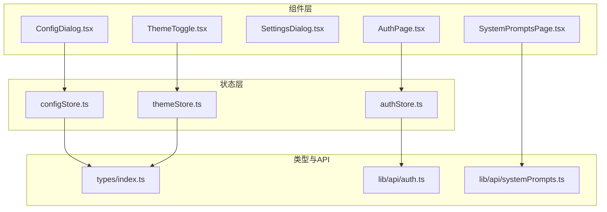
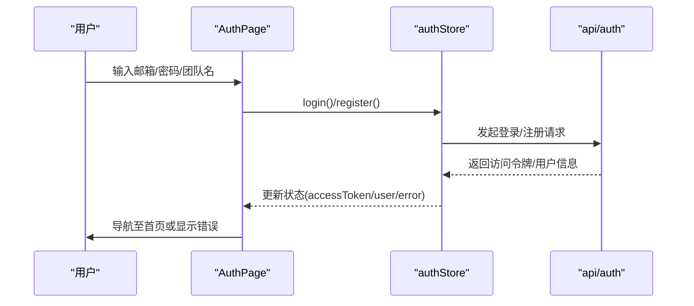
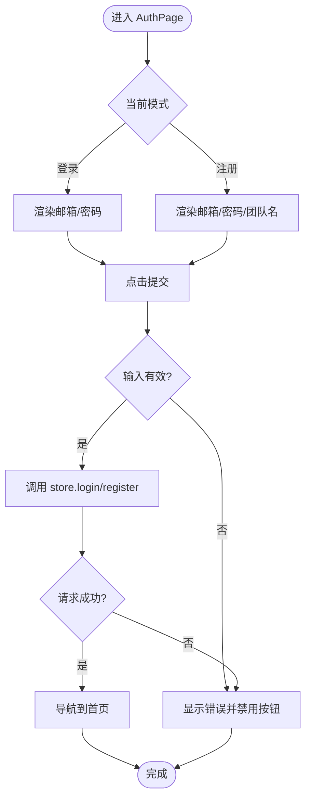
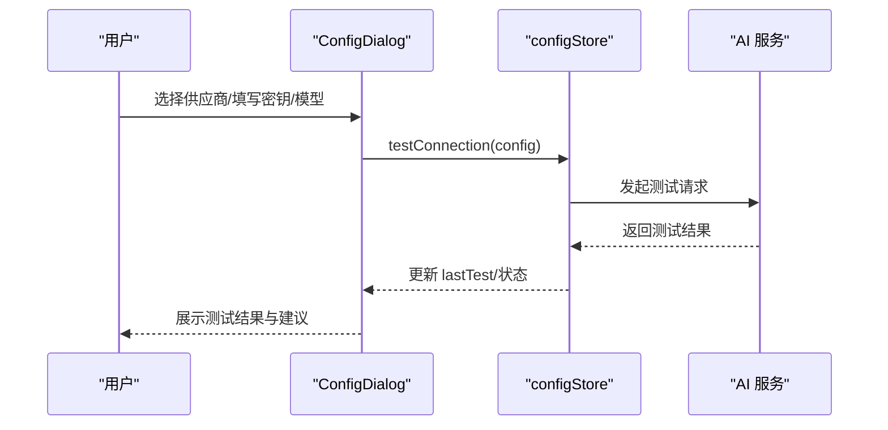
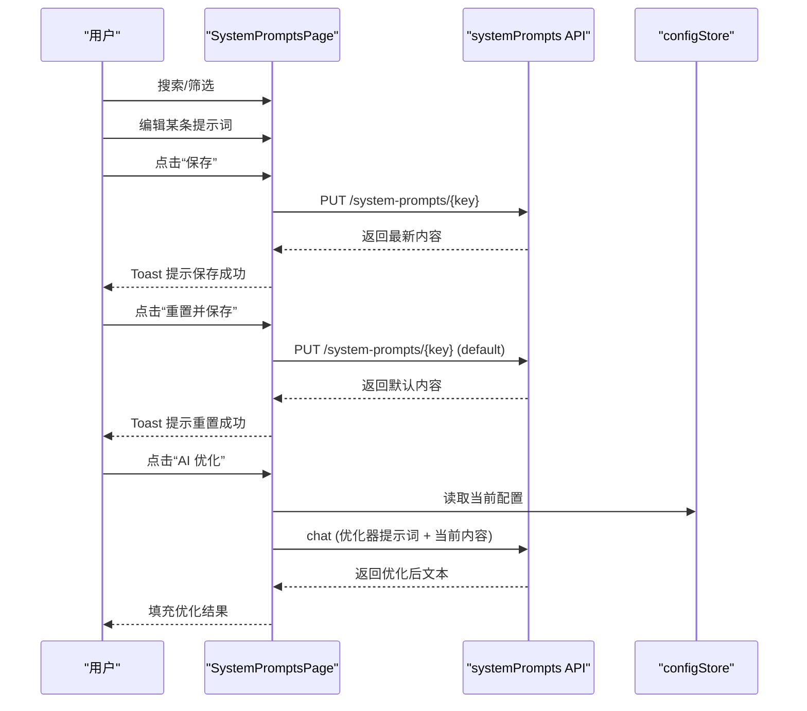
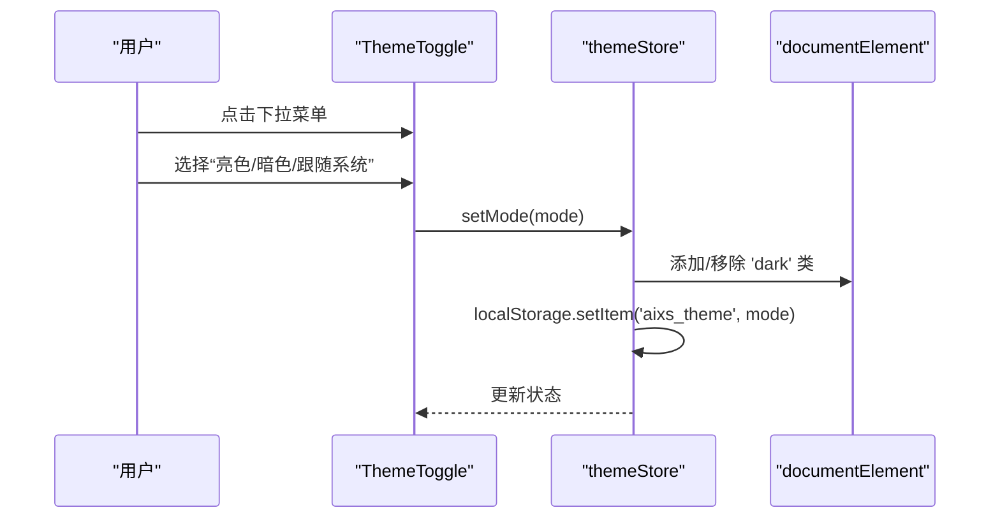
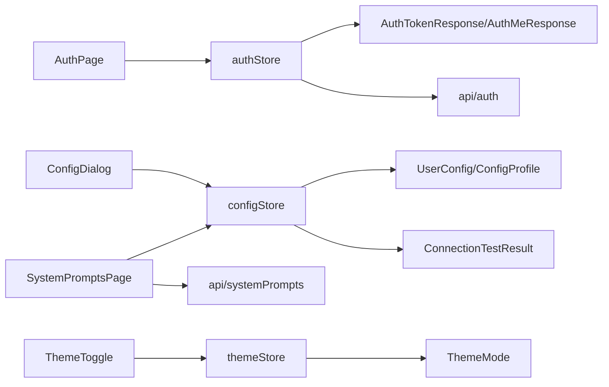

# 专用组件

<cite>
**本文引用的文件**
- [apps/web/src/components/AuthPage.tsx](file://apps/web/src/components/AuthPage.tsx)
- [apps/web/src/stores/authStore.ts](file://apps/web/src/stores/authStore.ts)
- [apps/web/src/lib/api/auth.ts](file://apps/web/src/lib/api/auth.ts)
- [apps/web/src/components/ConfigDialog.tsx](file://apps/web/src/components/ConfigDialog.tsx)
- [apps/web/src/stores/configStore.ts](file://apps/web/src/stores/configStore.ts)
- [apps/web/src/types/index.ts](file://apps/web/src/types/index.ts)
- [apps/web/src/components/SettingsDialog.tsx](file://apps/web/src/components/SettingsDialog.tsx)
- [apps/web/src/components/SystemPromptsPage.tsx](file://apps/web/src/components/SystemPromptsPage.tsx)
- [apps/web/src/lib/api/systemPrompts.ts](file://apps/web/src/lib/api/systemPrompts.ts)
- [apps/web/src/components/ThemeToggle.tsx](file://apps/web/src/components/ThemeToggle.tsx)
- [apps/web/src/stores/themeStore.ts](file://apps/web/src/stores/themeStore.ts)
</cite>

## 目录

1. [简介](#简介)
2. [项目结构](#项目结构)
3. [核心组件](#核心组件)
4. [架构总览](#架构总览)
5. [详细组件分析](#详细组件分析)
6. [依赖关系分析](#依赖关系分析)
7. [性能考量](#性能考量)
8. [故障排查指南](#故障排查指南)
9. [结论](#结论)
10. [附录](#附录)

## 简介

本文件聚焦 AIXSSS 前端应用中的专用组件，围绕以下目标展开：

- 深入解释 AuthPage 认证页面的登录/注册流程、表单验证与错误处理机制
- 详解 ConfigDialog 配置对话框、SettingsDialog 设置对话框与 SystemPromptsPage 系统提示页面的功能实现
- 阐述 ThemeToggle 主题切换组件的状态管理、样式应用与持久化机制
- 提供上述组件的 API 接口、事件处理与用户交互设计说明
- 给出组件定制与扩展的实践指导

## 项目结构

这些专用组件位于 Web 应用层，采用“组件 + Store + 类型 + API”的分层组织方式：

- 组件层：负责 UI 与交互（AuthPage、ConfigDialog、SettingsDialog、SystemPromptsPage、ThemeToggle）
- Store 层：集中管理状态（authStore、configStore、themeStore）
- 类型层：统一数据结构与约束（types/index.ts）
- API 层：封装后端接口（lib/api/\*）

图表来源

- [apps/web/src/components/AuthPage.tsx](file://apps/web/src/components/AuthPage.tsx#L1-L231)
- [apps/web/src/stores/authStore.ts](file://apps/web/src/stores/authStore.ts#L1-L82)
- [apps/web/src/lib/api/auth.ts](file://apps/web/src/lib/api/auth.ts#L1-L21)
- [apps/web/src/components/ConfigDialog.tsx](file://apps/web/src/components/ConfigDialog.tsx#L1-L800)
- [apps/web/src/stores/configStore.ts](file://apps/web/src/stores/configStore.ts#L1-L822)
- [apps/web/src/types/index.ts](file://apps/web/src/types/index.ts#L644-L710)
- [apps/web/src/components/SystemPromptsPage.tsx](file://apps/web/src/components/SystemPromptsPage.tsx#L1-L474)
- [apps/web/src/lib/api/systemPrompts.ts](file://apps/web/src/lib/api/systemPrompts.ts#L1-L30)
- [apps/web/src/components/ThemeToggle.tsx](file://apps/web/src/components/ThemeToggle.tsx#L1-L71)
- [apps/web/src/stores/themeStore.ts](file://apps/web/src/stores/themeStore.ts#L1-L57)

章节来源

- [apps/web/src/components/AuthPage.tsx](file://apps/web/src/components/AuthPage.tsx#L1-L231)
- [apps/web/src/stores/authStore.ts](file://apps/web/src/stores/authStore.ts#L1-L82)
- [apps/web/src/lib/api/auth.ts](file://apps/web/src/lib/api/auth.ts#L1-L21)
- [apps/web/src/components/ConfigDialog.tsx](file://apps/web/src/components/ConfigDialog.tsx#L1-L800)
- [apps/web/src/stores/configStore.ts](file://apps/web/src/stores/configStore.ts#L1-L822)
- [apps/web/src/types/index.ts](file://apps/web/src/types/index.ts#L644-L710)
- [apps/web/src/components/SystemPromptsPage.tsx](file://apps/web/src/components/SystemPromptsPage.tsx#L1-L474)
- [apps/web/src/lib/api/systemPrompts.ts](file://apps/web/src/lib/api/systemPrompts.ts#L1-L30)
- [apps/web/src/components/ThemeToggle.tsx](file://apps/web/src/components/ThemeToggle.tsx#L1-L71)
- [apps/web/src/stores/themeStore.ts](file://apps/web/src/stores/themeStore.ts#L1-L57)

## 核心组件

- AuthPage：登录/注册表单、模式切换、提交校验、错误展示、路由跳转
- ConfigDialog：AI 服务配置（多档案）、连接测试、用量统计、安全设置、参数调节
- SettingsDialog：设置入口（当前为占位）
- SystemPromptsPage：系统提示词管理（查看/编辑/保存/重置/优化）
- ThemeToggle：主题切换（亮/暗/跟随系统）、持久化、系统主题监听

章节来源

- [apps/web/src/components/AuthPage.tsx](file://apps/web/src/components/AuthPage.tsx#L10-L231)
- [apps/web/src/components/ConfigDialog.tsx](file://apps/web/src/components/ConfigDialog.tsx#L241-L800)
- [apps/web/src/components/SettingsDialog.tsx](file://apps/web/src/components/SettingsDialog.tsx#L19-L77)
- [apps/web/src/components/SystemPromptsPage.tsx](file://apps/web/src/components/SystemPromptsPage.tsx#L104-L474)
- [apps/web/src/components/ThemeToggle.tsx](file://apps/web/src/components/ThemeToggle.tsx#L26-L71)

## 架构总览

组件与状态、类型、API 的交互关系如下：

图表来源

- [apps/web/src/components/AuthPage.tsx](file://apps/web/src/components/AuthPage.tsx#L22-L35)
- [apps/web/src/stores/authStore.ts](file://apps/web/src/stores/authStore.ts#L46-L73)
- [apps/web/src/lib/api/auth.ts](file://apps/web/src/lib/api/auth.ts#L6-L20)

章节来源

- [apps/web/src/components/AuthPage.tsx](file://apps/web/src/components/AuthPage.tsx#L10-L35)
- [apps/web/src/stores/authStore.ts](file://apps/web/src/stores/authStore.ts#L19-L74)
- [apps/web/src/lib/api/auth.ts](file://apps/web/src/lib/api/auth.ts#L1-L21)

## 详细组件分析

### AuthPage 认证页面

- 功能要点
  - 模式切换：登录/注册
  - 表单字段：邮箱、密码、团队名（注册时）
  - 提交流程：输入校验 → 调用 store 方法 → 成功导航 → 错误通过 store 状态展示
  - 错误处理：展示错误信息，禁用按钮
  - 交互细节：回车触发提交、加载态、品牌展示与特性介绍
- 数据与状态
  - 使用 authStore 的状态与方法：isLoading、error、login、register
  - 本地存储：令牌持久化（localStorage）
- API 接口
  - 登录/注册/查询当前用户
- 事件与交互
  - 点击登录/注册按钮
  - 切换登录/注册模式
  - 回车提交

图表来源

- [apps/web/src/components/AuthPage.tsx](file://apps/web/src/components/AuthPage.tsx#L22-L35)
- [apps/web/src/stores/authStore.ts](file://apps/web/src/stores/authStore.ts#L46-L73)

章节来源

- [apps/web/src/components/AuthPage.tsx](file://apps/web/src/components/AuthPage.tsx#L10-L231)
- [apps/web/src/stores/authStore.ts](file://apps/web/src/stores/authStore.ts#L1-L82)
- [apps/web/src/lib/api/auth.ts](file://apps/web/src/lib/api/auth.ts#L1-L21)

### ConfigDialog 配置对话框

- 功能要点
  - 多档案管理：激活、创建、复制、删除
  - 连接配置：供应商、API Key、Base URL、模型、生成参数
  - 连接测试：发起测试并记录结果
  - 用量统计：24 小时内用量与费用估算
  - 安全设置：加密密码（解锁/更改/忘记）
  - 参数调节：AI Parameter Tuner
- 状态与持久化
  - 使用 configStore 管理 profiles、activeProfileId、isConfigured
  - 本地持久化：UserConfigState（加密/非加密两种模式）
  - 价格单位：per_1K/per_1M 切换并同步 localStorage
- 表单校验
  - 档案名称、API Key、模型、Base URL、价格格式
- 事件与交互
  - 切换标签页、应用预设、保存/测试、开关加密

图表来源

- [apps/web/src/components/ConfigDialog.tsx](file://apps/web/src/components/ConfigDialog.tsx#L735-L800)
- [apps/web/src/stores/configStore.ts](file://apps/web/src/stores/configStore.ts#L343-L488)

章节来源

- [apps/web/src/components/ConfigDialog.tsx](file://apps/web/src/components/ConfigDialog.tsx#L241-L800)
- [apps/web/src/stores/configStore.ts](file://apps/web/src/stores/configStore.ts#L183-L822)
- [apps/web/src/types/index.ts](file://apps/web/src/types/index.ts#L644-L710)

### SettingsDialog 设置对话框

- 功能要点
  - 当前为占位界面，展示“功能开发中”
  - 左侧导航（通用/外观/通知/隐私/快捷键）
- 交互
  - 切换左侧导航项
  - 关闭对话框

章节来源

- [apps/web/src/components/SettingsDialog.tsx](file://apps/web/src/components/SettingsDialog.tsx#L19-L77)

### SystemPromptsPage 系统提示页面

- 功能要点
  - 列表加载：支持搜索与分类分组
  - 编辑与保存：当前内容可编辑，保存后更新视图
  - 重置：恢复默认内容并保存
  - 优化：基于内置优化器提示词，调用 AI 生成优化版本
- 数据与状态
  - 使用 configStore 获取当前配置（用于 AI 优化）
  - 使用 useToast 提示加载/保存/重置/优化结果
- API 接口
  - 列表、更新系统提示词

图表来源

- [apps/web/src/components/SystemPromptsPage.tsx](file://apps/web/src/components/SystemPromptsPage.tsx#L118-L273)
- [apps/web/src/lib/api/systemPrompts.ts](file://apps/web/src/lib/api/systemPrompts.ts#L20-L29)
- [apps/web/src/stores/configStore.ts](file://apps/web/src/stores/configStore.ts#L183-L287)

章节来源

- [apps/web/src/components/SystemPromptsPage.tsx](file://apps/web/src/components/SystemPromptsPage.tsx#L104-L474)
- [apps/web/src/lib/api/systemPrompts.ts](file://apps/web/src/lib/api/systemPrompts.ts#L1-L30)

### ThemeToggle 主题切换组件

- 功能要点
  - 三种模式：亮色、暗色、跟随系统
  - 通过 DropdownMenu 提供交互入口
  - 状态持久化到 localStorage
  - 监听系统主题变化，系统模式下自动同步
- 状态与持久化
  - 使用 themeStore 管理 mode、setMode、toggleMode、initTheme
  - 应用主题：通过为 documentElement 添加/移除 'dark' 类
- 事件与交互
  - 点击菜单项切换模式
  - 初始化时从 localStorage 读取并应用

图表来源

- [apps/web/src/components/ThemeToggle.tsx](file://apps/web/src/components/ThemeToggle.tsx#L26-L67)
- [apps/web/src/stores/themeStore.ts](file://apps/web/src/stores/themeStore.ts#L13-L34)

章节来源

- [apps/web/src/components/ThemeToggle.tsx](file://apps/web/src/components/ThemeToggle.tsx#L1-L71)
- [apps/web/src/stores/themeStore.ts](file://apps/web/src/stores/themeStore.ts#L1-L57)

## 依赖关系分析

- 组件与 Store 的依赖
  - AuthPage 依赖 authStore
  - ConfigDialog 依赖 configStore
  - SystemPromptsPage 依赖 configStore 与 systemPrompts API
  - ThemeToggle 依赖 themeStore
- Store 与类型/API 的依赖
  - configStore 使用 UserConfig、ConfigProfile、ConnectionTestResult 等类型
  - authStore 使用 AuthTokenResponse、AuthMeResponse 类型
  - themeStore 使用 ThemeMode 类型
- 外部依赖
  - UI 组件库（Button、Input、Dialog、Select、Switch 等）
  - 图标库（lucide-react）
  - 本地存储（localStorage）

图表来源

- [apps/web/src/components/AuthPage.tsx](file://apps/web/src/components/AuthPage.tsx#L1-L231)
- [apps/web/src/stores/authStore.ts](file://apps/web/src/stores/authStore.ts#L1-L82)
- [apps/web/src/lib/api/auth.ts](file://apps/web/src/lib/api/auth.ts#L1-L21)
- [apps/web/src/components/ConfigDialog.tsx](file://apps/web/src/components/ConfigDialog.tsx#L1-L800)
- [apps/web/src/stores/configStore.ts](file://apps/web/src/stores/configStore.ts#L1-L822)
- [apps/web/src/types/index.ts](file://apps/web/src/types/index.ts#L644-L710)
- [apps/web/src/components/SystemPromptsPage.tsx](file://apps/web/src/components/SystemPromptsPage.tsx#L1-L474)
- [apps/web/src/lib/api/systemPrompts.ts](file://apps/web/src/lib/api/systemPrompts.ts#L1-L30)
- [apps/web/src/components/ThemeToggle.tsx](file://apps/web/src/components/ThemeToggle.tsx#L1-L71)
- [apps/web/src/stores/themeStore.ts](file://apps/web/src/stores/themeStore.ts#L1-L57)

章节来源

- [apps/web/src/types/index.ts](file://apps/web/src/types/index.ts#L644-L710)

## 性能考量

- AuthPage
  - 表单输入防抖与即时校验，避免无效请求
  - 加载态按钮防止重复提交
- ConfigDialog
  - 24 小时用量统计按活跃档案与模型聚合，避免全量扫描
  - 价格单位切换时批量转换数值，减少多次渲染
  - 连接测试异步执行，避免阻塞 UI
- SystemPromptsPage
  - 搜索与分组使用 useMemo 缓存计算结果
  - 保存/重置/优化过程禁用相关按钮，避免并发操作
- ThemeToggle
  - 使用 memo 与 useCallback 降低重渲染
  - 系统主题监听仅在初始化时添加，避免重复监听

## 故障排查指南

- AuthPage
  - 现象：登录/注册失败
  - 排查：检查 store.error 是否存在；确认网络与后端接口可用
  - 参考：[apps/web/src/components/AuthPage.tsx](file://apps/web/src/components/AuthPage.tsx#L178-L182)
- ConfigDialog
  - 现象：连接测试失败
  - 排查：检查 API Key、Base URL、模型是否正确；查看 suggestions；确认网络与跨域
  - 参考：[apps/web/src/stores/configStore.ts](file://apps/web/src/stores/configStore.ts#L72-L181)
- SystemPromptsPage
  - 现象：保存/重置/优化失败
  - 排查：检查配置是否可用；查看 Toast 错误提示；确认后端接口状态
  - 参考：[apps/web/src/components/SystemPromptsPage.tsx](file://apps/web/src/components/SystemPromptsPage.tsx#L165-L216)
- ThemeToggle
  - 现象：主题未生效或切换无效
  - 排查：检查 localStorage 是否可写；确认系统主题监听是否正常；查看 applyTheme 执行
  - 参考：[apps/web/src/stores/themeStore.ts](file://apps/web/src/stores/themeStore.ts#L36-L56)

章节来源

- [apps/web/src/components/AuthPage.tsx](file://apps/web/src/components/AuthPage.tsx#L178-L182)
- [apps/web/src/stores/configStore.ts](file://apps/web/src/stores/configStore.ts#L72-L181)
- [apps/web/src/components/SystemPromptsPage.tsx](file://apps/web/src/components/SystemPromptsPage.tsx#L165-L216)
- [apps/web/src/stores/themeStore.ts](file://apps/web/src/stores/themeStore.ts#L36-L56)

## 结论

以上专用组件围绕“认证、配置、系统提示、主题”四大核心场景构建，采用清晰的分层与状态管理模式，配合完善的表单校验与错误提示，保障用户体验与系统稳定性。通过 Store 与 API 的解耦，组件具备良好的可维护性与扩展性。

## 附录

- API 接口一览
  - 认证：注册、登录、查询当前用户
    - [apps/web/src/lib/api/auth.ts](file://apps/web/src/lib/api/auth.ts#L6-L20)
  - 系统提示词：列出、更新
    - [apps/web/src/lib/api/systemPrompts.ts](file://apps/web/src/lib/api/systemPrompts.ts#L20-L29)
- 类型定义参考
  - 用户配置、配置档案、连接测试结果、主题模式等
    - [apps/web/src/types/index.ts](file://apps/web/src/types/index.ts#L644-L710)
    - [apps/web/src/types/index.ts](file://apps/web/src/types/index.ts#L663-L694)
    - [apps/web/src/types/index.ts](file://apps/web/src/types/index.ts#L1-L57)
