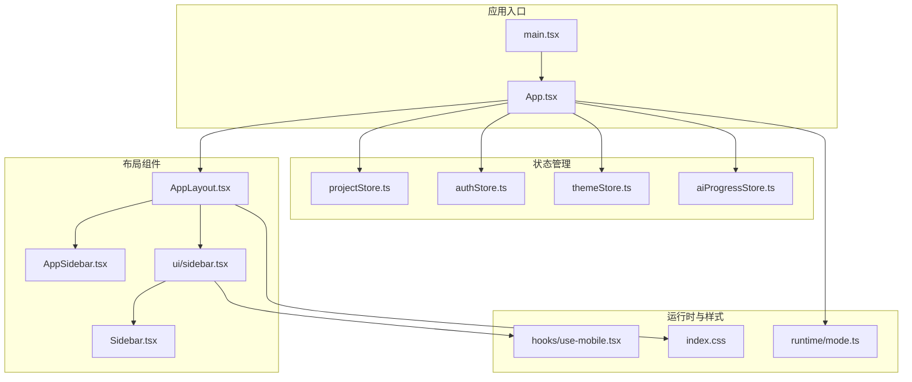
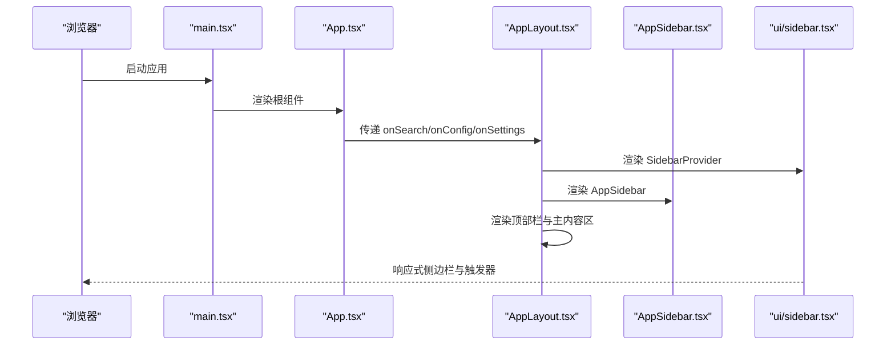
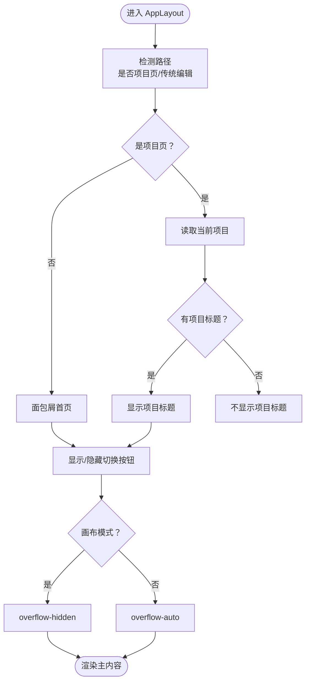
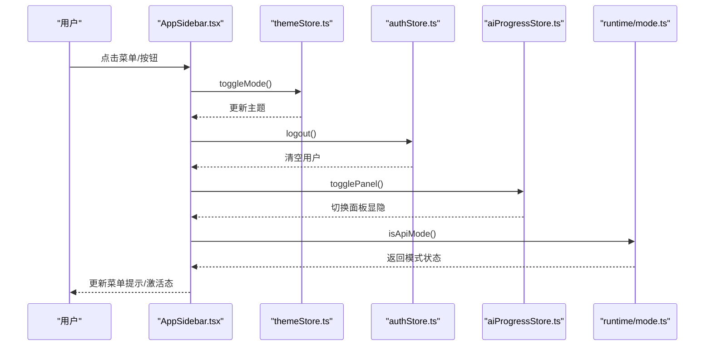
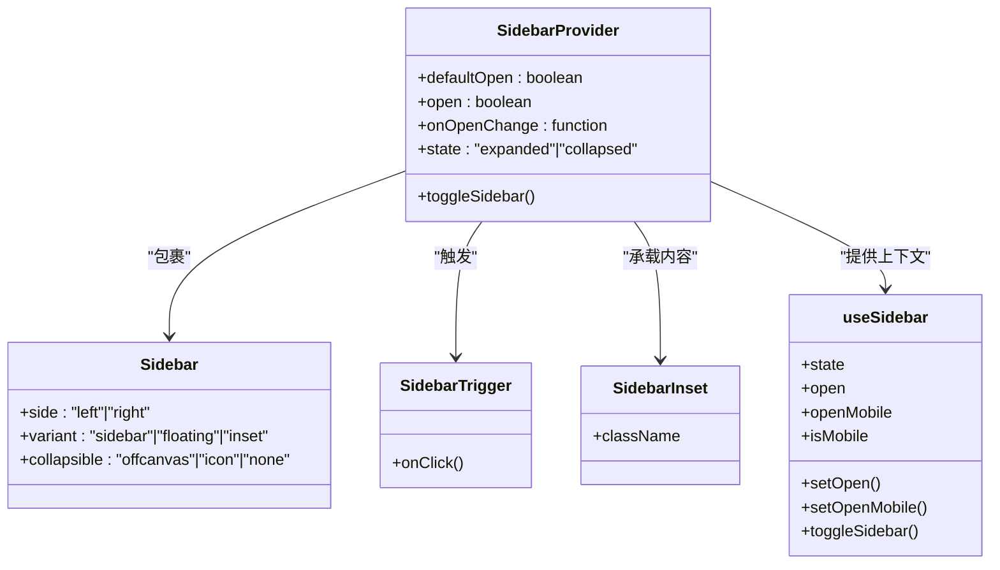
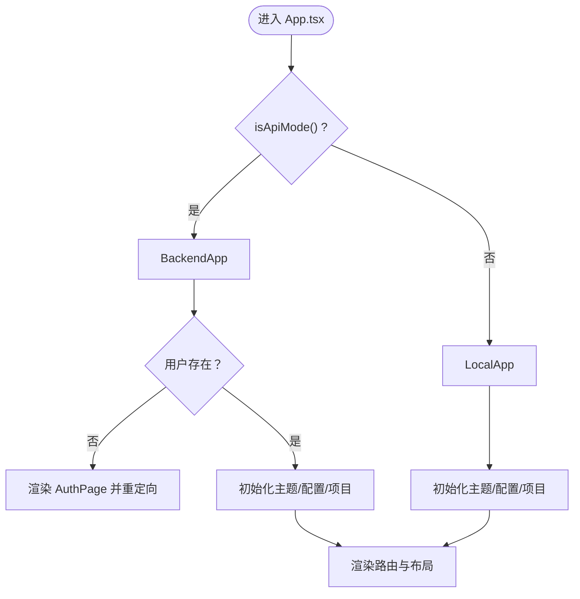
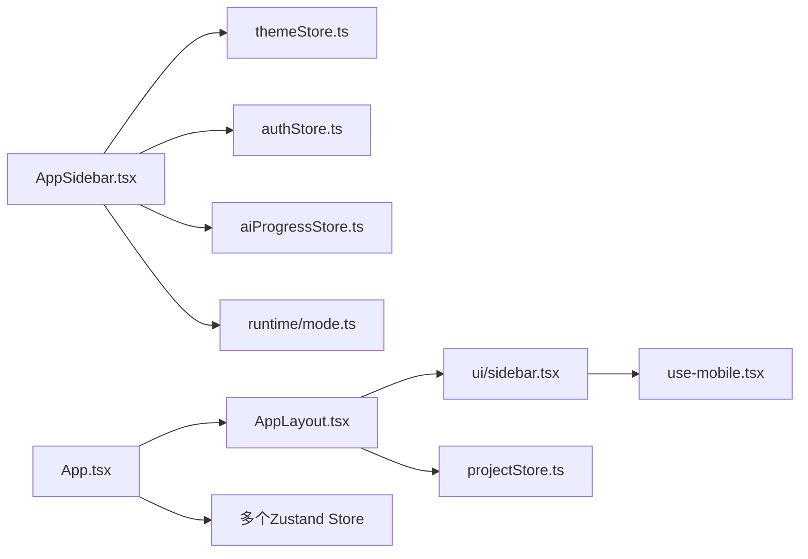

# 布局组件

<cite>
**本文引用的文件**
- [apps/web/src/components/layout/AppLayout.tsx](file://apps/web/src/components/layout/AppLayout.tsx)
- [apps/web/src/components/layout/AppSidebar.tsx](file://apps/web/src/components/layout/AppSidebar.tsx)
- [apps/web/src/components/layout/Sidebar.tsx](file://apps/web/src/components/layout/Sidebar.tsx)
- [apps/web/src/components/ui/sidebar.tsx](file://apps/web/src/components/ui/sidebar.tsx)
- [apps/web/src/App.tsx](file://apps/web/src/App.tsx)
- [apps/web/src/hooks/use-mobile.tsx](file://apps/web/src/hooks/use-mobile.tsx)
- [apps/web/src/lib/runtime/mode.ts](file://apps/web/src/lib/runtime/mode.ts)
- [apps/web/src/stores/projectStore.ts](file://apps/web/src/stores/projectStore.ts)
- [apps/web/src/stores/authStore.ts](file://apps/web/src/stores/authStore.ts)
- [apps/web/src/stores/themeStore.ts](file://apps/web/src/stores/themeStore.ts)
- [apps/web/src/stores/aiProgressStore.ts](file://apps/web/src/stores/aiProgressStore.ts)
- [apps/web/src/index.css](file://apps/web/src/index.css)
- [apps/web/src/main.tsx](file://apps/web/src/main.tsx)
</cite>

## 目录

1. [简介](#简介)
2. [项目结构](#项目结构)
3. [核心组件](#核心组件)
4. [架构总览](#架构总览)
5. [组件详解](#组件详解)
6. [依赖关系分析](#依赖关系分析)
7. [性能考量](#性能考量)
8. [故障排查指南](#故障排查指南)
9. [结论](#结论)
10. [附录](#附录)

## 简介

本文件面向AIXSSS前端应用的布局组件，系统性梳理AppLayout的整体布局架构、路由集成与响应式设计；深入解析Sidebar与AppSidebar的导航模式、菜单管理与状态同步机制；阐述布局组件与状态管理系统（Zustand）的集成方式、路由守卫与权限控制；给出布局断点配置、移动端适配与用户体验优化策略，并提供可扩展的定制指南。

## 项目结构

- 布局层位于 apps/web/src/components/layout，包含 AppLayout、AppSidebar、Sidebar 三个核心组件。
- UI基础能力来自 apps/web/src/components/ui/sidebar.tsx，提供 SidebarProvider、Sidebar、SidebarInset、SidebarTrigger 等基础容器与交互。
- 应用入口 apps/web/src/App.tsx 负责路由与权限控制，并将布局组件包裹在路由之上。
- 响应式断点由 apps/web/src/hooks/use-mobile.tsx 提供，配合UI库的移动端行为实现。
- 样式方面，apps/web/src/index.css 定义了墨纸风格的主题变量与背景纹理，支撑布局视觉一致性。

**图表来源**

- [apps/web/src/App.tsx](file://apps/web/src/App.tsx#L1-L392)
- [apps/web/src/components/layout/AppLayout.tsx](file://apps/web/src/components/layout/AppLayout.tsx#L1-L112)
- [apps/web/src/components/layout/AppSidebar.tsx](file://apps/web/src/components/layout/AppSidebar.tsx#L1-L179)
- [apps/web/src/components/layout/Sidebar.tsx](file://apps/web/src/components/layout/Sidebar.tsx#L1-L175)
- [apps/web/src/components/ui/sidebar.tsx](file://apps/web/src/components/ui/sidebar.tsx#L1-L746)
- [apps/web/src/hooks/use-mobile.tsx](file://apps/web/src/hooks/use-mobile.tsx#L1-L20)
- [apps/web/src/lib/runtime/mode.ts](file://apps/web/src/lib/runtime/mode.ts#L1-L30)
- [apps/web/src/stores/projectStore.ts](file://apps/web/src/stores/projectStore.ts#L1-L181)
- [apps/web/src/stores/authStore.ts](file://apps/web/src/stores/authStore.ts#L1-L82)
- [apps/web/src/stores/themeStore.ts](file://apps/web/src/stores/themeStore.ts#L1-L57)
- [apps/web/src/stores/aiProgressStore.ts](file://apps/web/src/stores/aiProgressStore.ts#L1-L758)
- [apps/web/src/index.css](file://apps/web/src/index.css#L1-L427)
- [apps/web/src/main.tsx](file://apps/web/src/main.tsx#L1-L37)

**章节来源**

- [apps/web/src/components/layout/AppLayout.tsx](file://apps/web/src/components/layout/AppLayout.tsx#L1-L112)
- [apps/web/src/components/layout/AppSidebar.tsx](file://apps/web/src/components/layout/AppSidebar.tsx#L1-L179)
- [apps/web/src/components/layout/Sidebar.tsx](file://apps/web/src/components/layout/Sidebar.tsx#L1-L175)
- [apps/web/src/components/ui/sidebar.tsx](file://apps/web/src/components/ui/sidebar.tsx#L1-L746)
- [apps/web/src/App.tsx](file://apps/web/src/App.tsx#L1-L392)
- [apps/web/src/hooks/use-mobile.tsx](file://apps/web/src/hooks/use-mobile.tsx#L1-L20)
- [apps/web/src/lib/runtime/mode.ts](file://apps/web/src/lib/runtime/mode.ts#L1-L30)
- [apps/web/src/stores/projectStore.ts](file://apps/web/src/stores/projectStore.ts#L1-L181)
- [apps/web/src/stores/authStore.ts](file://apps/web/src/stores/authStore.ts#L1-L82)
- [apps/web/src/stores/themeStore.ts](file://apps/web/src/stores/themeStore.ts#L1-L57)
- [apps/web/src/stores/aiProgressStore.ts](file://apps/web/src/stores/aiProgressStore.ts#L1-L758)
- [apps/web/src/index.css](file://apps/web/src/index.css#L1-L427)
- [apps/web/src/main.tsx](file://apps/web/src/main.tsx#L1-L37)

## 核心组件

- AppLayout：顶层布局容器，负责顶部面包屑、项目标题展示、画布/传统编辑切换按钮、内容区尺寸与溢出控制。
- AppSidebar：基于UI库的侧边栏，整合导航、工具、用户与主题切换、开发者面板开关等。
- Sidebar：通用侧边栏组件（历史实现），提供折叠/展开、导航按钮与用户操作。
- UI侧边栏库：提供 SidebarProvider、Sidebar、SidebarInset、SidebarTrigger、useSidebar 等，统一处理桌面/移动端、折叠状态、键盘快捷键与Cookie持久化。

**章节来源**

- [apps/web/src/components/layout/AppLayout.tsx](file://apps/web/src/components/layout/AppLayout.tsx#L1-L112)
- [apps/web/src/components/layout/AppSidebar.tsx](file://apps/web/src/components/layout/AppSidebar.tsx#L1-L179)
- [apps/web/src/components/layout/Sidebar.tsx](file://apps/web/src/components/layout/Sidebar.tsx#L1-L175)
- [apps/web/src/components/ui/sidebar.tsx](file://apps/web/src/components/ui/sidebar.tsx#L1-L746)

## 架构总览

AppLayout 通过 SidebarProvider 包裹 AppSidebar 与 SidebarInset，后者承载主内容区域。应用入口 App.tsx 在不同运行模式（本地/后端）下渲染不同的布局分支，并注入状态管理与路由。

**图表来源**

- [apps/web/src/main.tsx](file://apps/web/src/main.tsx#L1-L37)
- [apps/web/src/App.tsx](file://apps/web/src/App.tsx#L1-L392)
- [apps/web/src/components/layout/AppLayout.tsx](file://apps/web/src/components/layout/AppLayout.tsx#L1-L112)
- [apps/web/src/components/layout/AppSidebar.tsx](file://apps/web/src/components/layout/AppSidebar.tsx#L1-L179)
- [apps/web/src/components/ui/sidebar.tsx](file://apps/web/src/components/ui/sidebar.tsx#L1-L746)

## 组件详解

### AppLayout：整体布局与路由集成

- 作用
  - 顶部栏：面包屑、返回首页、项目标题、画布/传统编辑切换按钮。
  - 主内容区：根据是否为项目页与编辑模式决定最大宽度、内边距与溢出策略。
  - 与状态联动：读取当前项目，动态展示项目标题与切换按钮。
- 路由集成
  - 通过路径判断是否为项目页与是否为传统编辑模式，从而决定面包屑与切换按钮的显示与跳转目标。
- 响应式与溢出
  - 画布模式下禁用滚动，保证节点画布可全屏拖拽；非画布模式启用滚动并限制最大宽度。

**图表来源**

- [apps/web/src/components/layout/AppLayout.tsx](file://apps/web/src/components/layout/AppLayout.tsx#L25-L112)
- [apps/web/src/stores/projectStore.ts](file://apps/web/src/stores/projectStore.ts#L1-L181)

**章节来源**

- [apps/web/src/components/layout/AppLayout.tsx](file://apps/web/src/components/layout/AppLayout.tsx#L1-L112)
- [apps/web/src/stores/projectStore.ts](file://apps/web/src/stores/projectStore.ts#L1-L181)

### AppSidebar：导航模式、菜单管理与状态同步

- 导航与工具
  - 导航：我的项目、搜索（支持快捷键）、AI设置、系统提示词、开发者面板。
  - 工具：切换主题、设置、退出登录。
- 状态同步
  - 主题：通过 themeStore 切换深/浅色模式。
  - 权限：通过 authStore 获取用户信息，存在用户时显示退出登录。
  - 开发者面板：通过 aiProgressStore 控制面板显隐与最小化。
- 菜单项激活
  - 通过 useLocation 与 isActive 判断当前路径，高亮对应菜单项。
- API模式提示
  - 系统提示词菜单根据 isApiMode() 显示不同提示文案。

**图表来源**

- [apps/web/src/components/layout/AppSidebar.tsx](file://apps/web/src/components/layout/AppSidebar.tsx#L1-L179)
- [apps/web/src/stores/themeStore.ts](file://apps/web/src/stores/themeStore.ts#L1-L57)
- [apps/web/src/stores/authStore.ts](file://apps/web/src/stores/authStore.ts#L1-L82)
- [apps/web/src/stores/aiProgressStore.ts](file://apps/web/src/stores/aiProgressStore.ts#L1-L758)
- [apps/web/src/lib/runtime/mode.ts](file://apps/web/src/lib/runtime/mode.ts#L1-L30)

**章节来源**

- [apps/web/src/components/layout/AppSidebar.tsx](file://apps/web/src/components/layout/AppSidebar.tsx#L1-L179)
- [apps/web/src/stores/themeStore.ts](file://apps/web/src/stores/themeStore.ts#L1-L57)
- [apps/web/src/stores/authStore.ts](file://apps/web/src/stores/authStore.ts#L1-L82)
- [apps/web/src/stores/aiProgressStore.ts](file://apps/web/src/stores/aiProgressStore.ts#L1-L758)
- [apps/web/src/lib/runtime/mode.ts](file://apps/web/src/lib/runtime/mode.ts#L1-L30)

### Sidebar（历史实现）：通用侧边栏

- 折叠/展开：根据 isCollapsed 控制宽度与图标显示。
- 导航与工具：项目列表、搜索、设置、开发者面板。
- 用户操作：主题切换、退出登录。
- 与 AppSidebar 的差异：该组件未直接使用UI库的SidebarProvider，而是自行维护折叠状态与交互。

**章节来源**

- [apps/web/src/components/layout/Sidebar.tsx](file://apps/web/src/components/layout/Sidebar.tsx#L1-L175)

### UI侧边栏库：桌面/移动端、Cookie持久化与键盘快捷键

- 提供 SidebarProvider、Sidebar、SidebarInset、SidebarTrigger、useSidebar 等。
- 移动端行为：当 isMobile 为真时，使用抽屉式侧边栏（Sheet）。
- Cookie持久化：记录侧边栏展开/折叠状态，刷新后恢复。
- 键盘快捷键：支持 Ctrl/Cmd+B 切换侧边栏。
- 样式变量：通过CSS变量控制宽度、边框与阴影，适配浮动/嵌入变体。

**图表来源**

- [apps/web/src/components/ui/sidebar.tsx](file://apps/web/src/components/ui/sidebar.tsx#L1-L746)

**章节来源**

- [apps/web/src/components/ui/sidebar.tsx](file://apps/web/src/components/ui/sidebar.tsx#L1-L746)
- [apps/web/src/hooks/use-mobile.tsx](file://apps/web/src/hooks/use-mobile.tsx#L1-L20)

### 布局断点与移动端适配

- 断点：768px（useIsMobile 使用小于768视为移动端）。
- 行为差异：
  - 桌面端：固定宽度侧边栏，支持折叠与悬停提示。
  - 移动端：抽屉式侧边栏，支持手势滑动与遮罩层。
- 触发方式：SidebarTrigger 或键盘快捷键（Ctrl/Cmd+B）。

**章节来源**

- [apps/web/src/hooks/use-mobile.tsx](file://apps/web/src/hooks/use-mobile.tsx#L1-L20)
- [apps/web/src/components/ui/sidebar.tsx](file://apps/web/src/components/ui/sidebar.tsx#L1-L746)

### 布局与状态管理系统的集成

- 项目状态：AppLayout 读取当前项目标题，用于面包屑与页面标题展示。
- 主题状态：AppSidebar 切换主题，themeStore 负责持久化与系统偏好监听。
- 权限状态：AppSidebar 依据 authStore 中的用户信息决定是否显示退出登录。
- 开发者面板：aiProgressStore 控制面板显隐与最小化，同时自动在新增任务时显示面板。

**章节来源**

- [apps/web/src/components/layout/AppLayout.tsx](file://apps/web/src/components/layout/AppLayout.tsx#L1-L112)
- [apps/web/src/components/layout/AppSidebar.tsx](file://apps/web/src/components/layout/AppSidebar.tsx#L1-L179)
- [apps/web/src/stores/projectStore.ts](file://apps/web/src/stores/projectStore.ts#L1-L181)
- [apps/web/src/stores/themeStore.ts](file://apps/web/src/stores/themeStore.ts#L1-L57)
- [apps/web/src/stores/authStore.ts](file://apps/web/src/stores/authStore.ts#L1-L82)
- [apps/web/src/stores/aiProgressStore.ts](file://apps/web/src/stores/aiProgressStore.ts#L1-L758)

### 路由守卫与权限控制

- 运行模式：通过 isApiMode() 切换本地/后端模式，影响数据来源与部分功能可用性。
- 登录态：后端模式下，若无用户则渲染 AuthPage 并重定向至登录页。
- 项目加载：编辑器路由加载器在 params 变化时拉取项目数据，确保渲染前数据就绪。

**图表来源**

- [apps/web/src/App.tsx](file://apps/web/src/App.tsx#L1-L392)
- [apps/web/src/lib/runtime/mode.ts](file://apps/web/src/lib/runtime/mode.ts#L1-L30)

**章节来源**

- [apps/web/src/App.tsx](file://apps/web/src/App.tsx#L1-L392)
- [apps/web/src/lib/runtime/mode.ts](file://apps/web/src/lib/runtime/mode.ts#L1-L30)

### 响应式设计与视觉优化

- 主题变量：index.css 定义了墨纸风格的明暗两套变量，支持 .dark 切换。
- 背景纹理：纸张纹理与径向渐变增强阅读体验。
- 侧边栏样式：通过CSS变量与Tailwind类组合，实现宽度、边框与阴影的一致性。
- 顶部栏：模糊背景与垂直分隔线提升层级感。

**章节来源**

- [apps/web/src/index.css](file://apps/web/src/index.css#L1-L427)
- [apps/web/src/components/layout/AppLayout.tsx](file://apps/web/src/components/layout/AppLayout.tsx#L1-L112)
- [apps/web/src/components/ui/sidebar.tsx](file://apps/web/src/components/ui/sidebar.tsx#L1-L746)

## 依赖关系分析

- 组件耦合
  - AppLayout 依赖 UI侧边栏库与项目状态；与 AppSidebar 通过 props 通信（onSearch/onConfig/onSettings）。
  - AppSidebar 依赖 themeStore、authStore、aiProgressStore、runtime/mode。
  - UI侧边栏库依赖 use-mobile 与 useSidebar 上下文。
- 外部依赖
  - React Router：路由与导航。
  - Zustand：状态管理。
  - Radix UI/Tailwind：UI基础与样式。

**图表来源**

- [apps/web/src/components/layout/AppLayout.tsx](file://apps/web/src/components/layout/AppLayout.tsx#L1-L112)
- [apps/web/src/components/layout/AppSidebar.tsx](file://apps/web/src/components/layout/AppSidebar.tsx#L1-L179)
- [apps/web/src/components/ui/sidebar.tsx](file://apps/web/src/components/ui/sidebar.tsx#L1-L746)
- [apps/web/src/App.tsx](file://apps/web/src/App.tsx#L1-L392)
- [apps/web/src/hooks/use-mobile.tsx](file://apps/web/src/hooks/use-mobile.tsx#L1-L20)
- [apps/web/src/lib/runtime/mode.ts](file://apps/web/src/lib/runtime/mode.ts#L1-L30)
- [apps/web/src/stores/projectStore.ts](file://apps/web/src/stores/projectStore.ts#L1-L181)
- [apps/web/src/stores/themeStore.ts](file://apps/web/src/stores/themeStore.ts#L1-L57)
- [apps/web/src/stores/authStore.ts](file://apps/web/src/stores/authStore.ts#L1-L82)
- [apps/web/src/stores/aiProgressStore.ts](file://apps/web/src/stores/aiProgressStore.ts#L1-L758)

**章节来源**

- [apps/web/src/components/layout/AppLayout.tsx](file://apps/web/src/components/layout/AppLayout.tsx#L1-L112)
- [apps/web/src/components/layout/AppSidebar.tsx](file://apps/web/src/components/layout/AppSidebar.tsx#L1-L179)
- [apps/web/src/components/ui/sidebar.tsx](file://apps/web/src/components/ui/sidebar.tsx#L1-L746)
- [apps/web/src/App.tsx](file://apps/web/src/App.tsx#L1-L392)

## 性能考量

- 路由懒加载：编辑器与对话框组件采用懒加载，减少首屏体积。
- 状态选择器：App.tsx 使用选择器优化，避免不必要的重渲染。
- 侧边栏Cookie：自动持久化展开/折叠状态，减少重复计算。
- 滚动策略：画布模式禁用滚动，避免不必要的滚动计算与重排。

[本节为通用指导，无需特定文件引用]

## 故障排查指南

- 侧边栏不显示或无法折叠
  - 检查 SidebarProvider 是否包裹 AppSidebar 与 SidebarInset。
  - 确认 useSidebar 上下文是否正确使用。
- 移动端抽屉不出现
  - 确认 useIsMobile 返回值与断点一致（<768px）。
- 主题切换无效
  - 检查 themeStore 的 setMode/toggleMode 是否被调用，以及 .dark 类是否正确添加。
- 权限相关问题
  - 后端模式下无用户时会重定向至登录页；检查 authStore 的 loadFromStorage 与 apiMe 调用。
- 项目标题不显示
  - 确认 projectStore 的 currentProject 是否已加载，且路径匹配项目页。

**章节来源**

- [apps/web/src/components/ui/sidebar.tsx](file://apps/web/src/components/ui/sidebar.tsx#L1-L746)
- [apps/web/src/hooks/use-mobile.tsx](file://apps/web/src/hooks/use-mobile.tsx#L1-L20)
- [apps/web/src/stores/themeStore.ts](file://apps/web/src/stores/themeStore.ts#L1-L57)
- [apps/web/src/stores/authStore.ts](file://apps/web/src/stores/authStore.ts#L1-L82)
- [apps/web/src/stores/projectStore.ts](file://apps/web/src/stores/projectStore.ts#L1-L181)

## 结论

AIXSSS前端布局组件以 AppLayout 为核心，结合 UI侧边栏库与多状态源（项目、主题、权限、开发者面板），实现了清晰的导航与响应式体验。通过运行模式与路由守卫，系统在本地与后端两种环境下保持一致的布局与功能边界。建议在扩展新功能时遵循现有状态管理模式与UI库约定，确保一致的交互与性能表现。

[本节为总结性内容，无需特定文件引用]

## 附录

### 布局定制指南

- 新增菜单项
  - 在 AppSidebar 中添加新的 SidebarMenuButton，并绑定相应操作（如打开对话框、切换面板）。
  - 若需激活态高亮，使用 isActive 与 useLocation 判断当前路径。
- 自定义面包屑
  - 在 AppLayout 中扩展面包屑逻辑，按需增加中间层级或条件渲染。
- 响应式行为调整
  - 修改 use-mobile 断点或 UI侧边栏库的宽度变量，以适配不同设备。
- 主题扩展
  - 在 index.css 中新增颜色变量，或在 themeStore 中增加模式枚举与切换逻辑。

**章节来源**

- [apps/web/src/components/layout/AppSidebar.tsx](file://apps/web/src/components/layout/AppSidebar.tsx#L1-L179)
- [apps/web/src/components/layout/AppLayout.tsx](file://apps/web/src/components/layout/AppLayout.tsx#L1-L112)
- [apps/web/src/components/ui/sidebar.tsx](file://apps/web/src/components/ui/sidebar.tsx#L1-L746)
- [apps/web/src/index.css](file://apps/web/src/index.css#L1-L427)
- [apps/web/src/stores/themeStore.ts](file://apps/web/src/stores/themeStore.ts#L1-L57)
