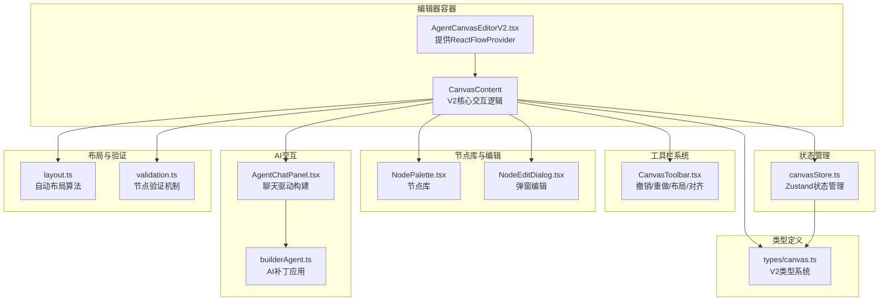
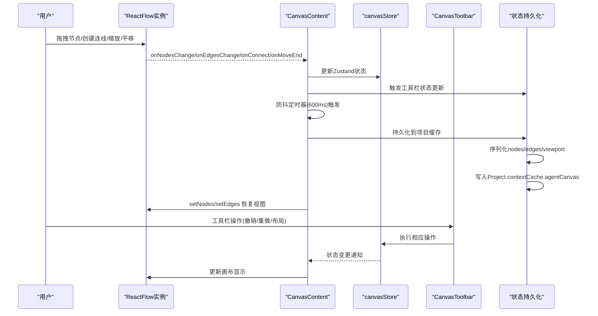
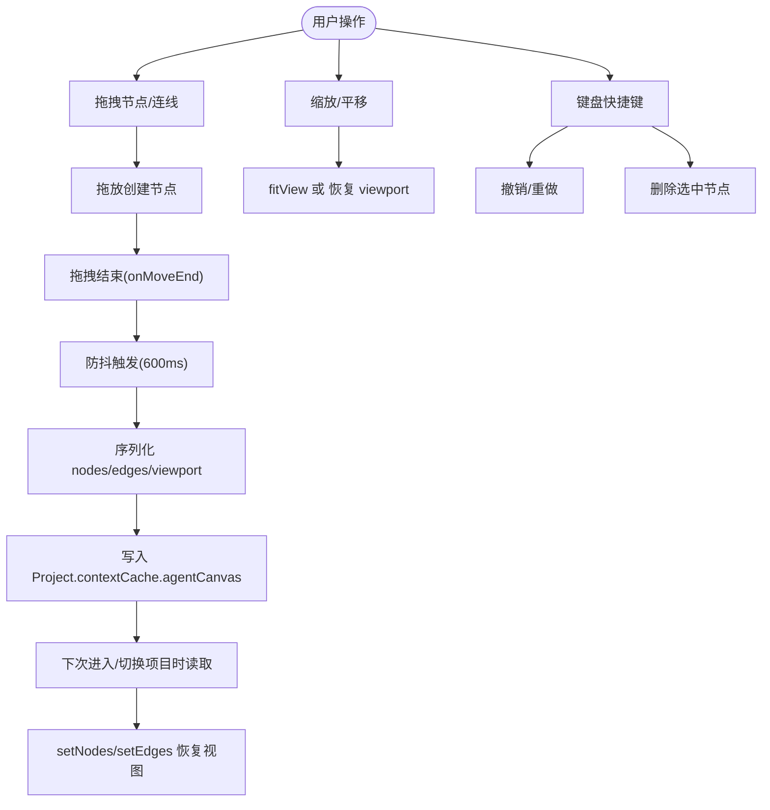
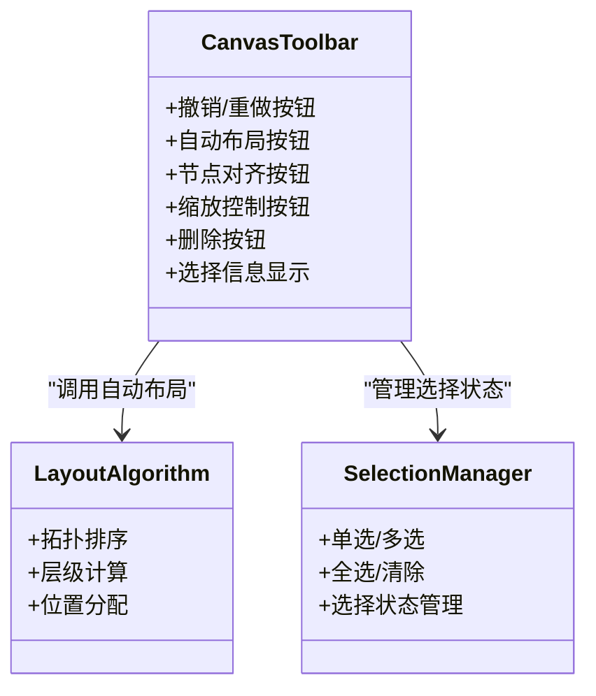
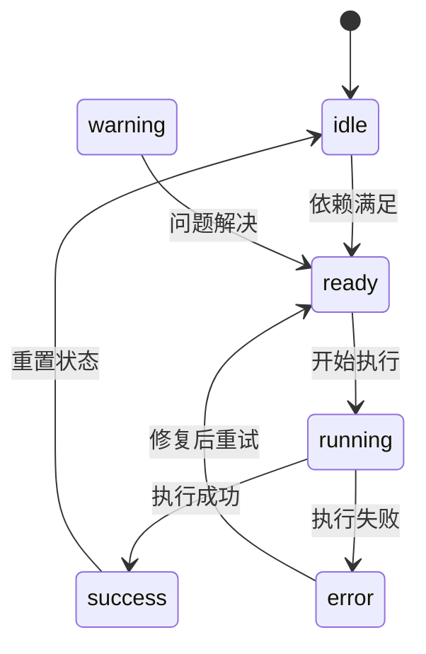
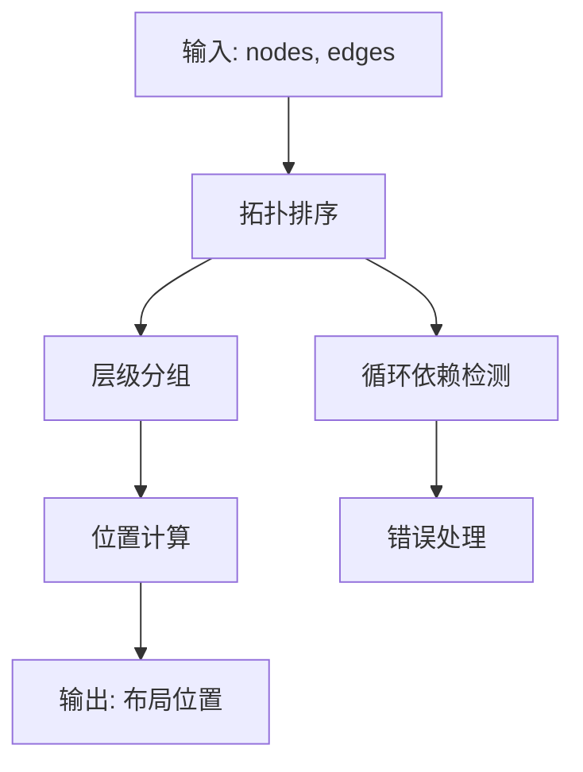
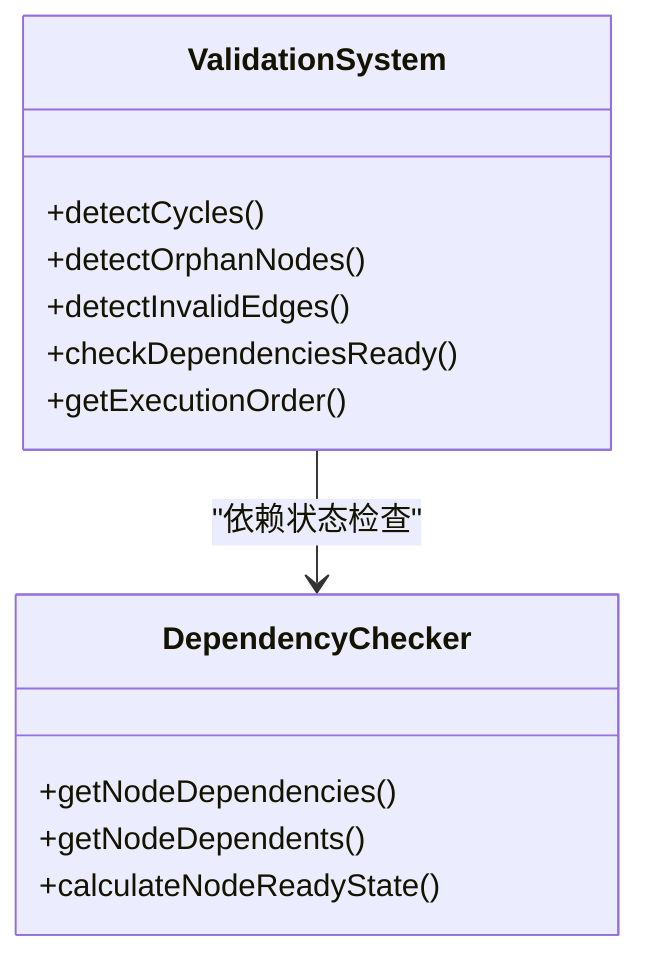
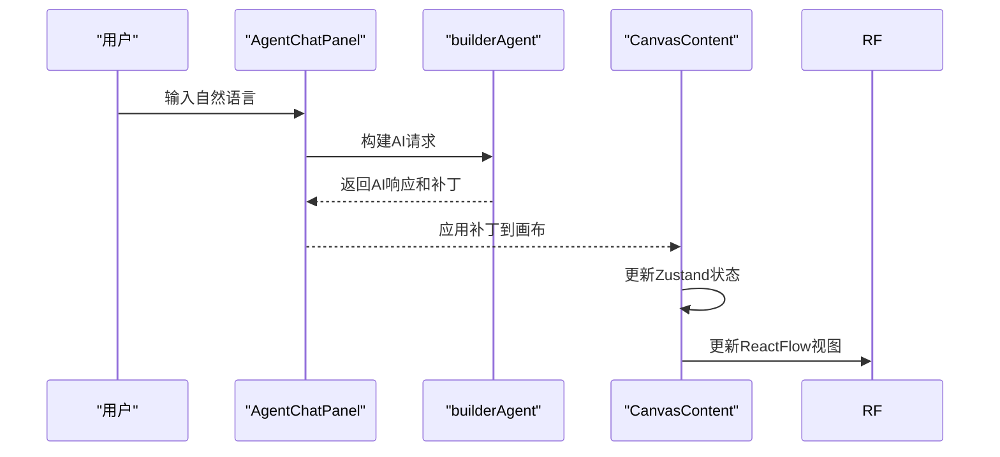
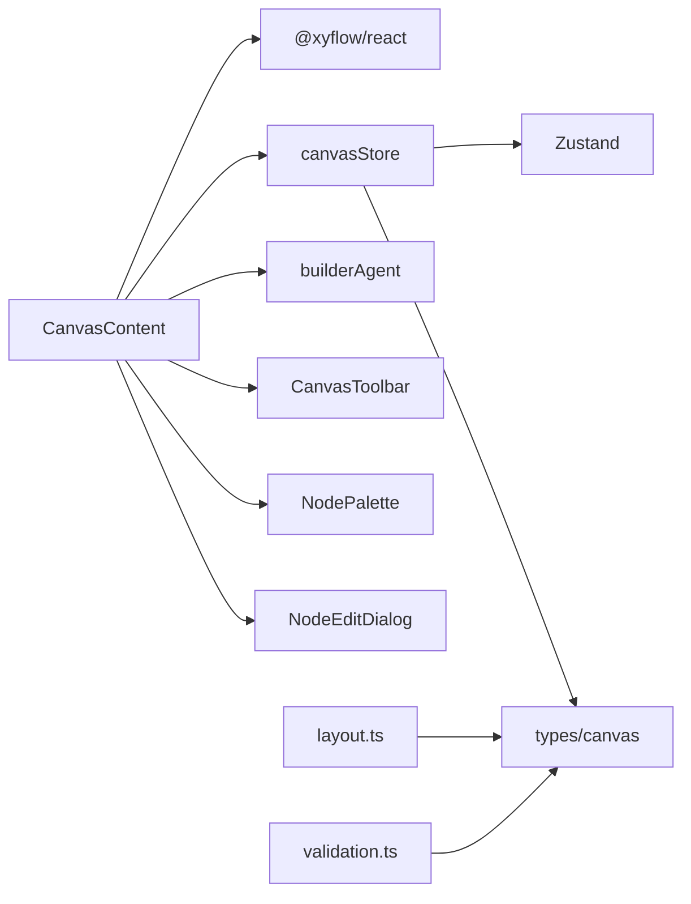

# 交互机制

<cite>
**本文引用的文件**
- [AgentCanvasEditorV2.tsx](file://apps/web/src/components/canvas/AgentCanvasEditorV2.tsx)
- [CanvasToolbar.tsx](file://apps/web/src/components/canvas/CanvasToolbar.tsx)
- [layout.ts](file://apps/web/src/lib/canvas/layout.ts)
- [validation.ts](file://apps/web/src/lib/canvas/validation.ts)
- [canvasStore.ts](file://apps/web/src/stores/canvasStore.ts)
- [canvas.ts](file://apps/web/src/types/canvas.ts)
- [builderAgent.ts](file://apps/web/src/lib/agent/builderAgent.ts)
- [AgentChatPanel.tsx](file://apps/web/src/components/canvas/AgentChatPanel.tsx)
- [NodeEditDialog.tsx](file://apps/web/src/components/canvas/NodeEditDialog.tsx)
- [NodePalette.tsx](file://apps/web/src/components/canvas/NodePalette.tsx)
- [AgentCanvasEditor.tsx](file://apps/web/src/components/canvas/AgentCanvasEditor.tsx)
- [graph.ts](file://apps/web/src/lib/agent/graph.ts)
- [index.ts](file://apps/web/src/types/index.ts)
- [projectStore.ts](file://apps/web/src/stores/projectStore.ts)
- [storage.ts](file://apps/web/src/lib/storage.ts)
- [storageManager.ts](file://apps/web/src/lib/storageManager.ts)
- [NodeFrame.tsx](file://apps/web/src/components/canvas/nodes/NodeFrame.tsx)
- [ProjectNode.tsx](file://apps/web/src/components/canvas/nodes/ProjectNode.tsx)
- [WorldViewNode.tsx](file://apps/web/src/components/canvas/nodes/WorldViewNode.tsx)
- [CharactersNode.tsx](file://apps/web/src/components/canvas/nodes/CharactersNode.tsx)
</cite>

## 更新摘要

**变更内容**

- 新增V2交互机制的全面重构，从简单的拖拽连接扩展为完整的Canvas系统交互
- 新增完整的工具栏系统，支持撤销/重做、自动布局、节点对齐、缩放控制等操作
- 新增键盘快捷键支持，包括撤销重做、删除选中节点等
- 新增实时协作和AI辅助功能，支持聊天驱动的画布构建
- 新增节点状态管理机制，包括执行状态机、进度跟踪和错误处理
- 新增自动布局算法和节点对齐工具
- 新增节点验证和依赖检查机制
- 新增完整的节点库和弹窗编辑功能

## 目录

1. [简介](#简介)
2. [项目结构](#项目结构)
3. [核心组件](#核心组件)
4. [架构总览](#架构总览)
5. [详细组件分析](#详细组件分析)
6. [依赖分析](#依赖分析)
7. [性能考量](#性能考量)
8. [故障排查指南](#故障排查指南)
9. [结论](#结论)

## 简介

本文件聚焦 AIXSSS 画布编辑器V2的交互机制，围绕全面重构的Canvas系统展开，系统性解释以下主题：

- V2交互机制的增强：从简单的拖拽连接扩展为完整的Canvas系统交互
- 工具栏系统：撤销/重做、自动布局、节点对齐、缩放控制等完整操作
- 键盘快捷键支持：Cmd/Ctrl + Z/Shift + Z、Delete/Backspace等
- 实时协作与AI辅助：聊天驱动的画布构建和自然语言交互
- 节点状态管理：执行状态机、进度跟踪、错误处理和依赖检查
- 自动布局算法：基于拓扑排序的层级布局和节点对齐工具
- 节点验证机制：循环依赖检测、孤立节点识别和无效边检查
- 节点库与弹窗编辑：完整的节点管理体系和交互式编辑功能

## 项目结构

画布编辑器V2位于Web应用的组件层，采用"编辑器容器 + 工具栏 + 节点库 + 聊天面板 + 画布区域"的组合式布局。编辑器内部通过React Flow提供节点/边状态钩子与回调，结合Zustand状态管理器实现画布数据的双向同步和完整的交互控制。

**图表来源**

- [AgentCanvasEditorV2.tsx](file://apps/web/src/components/canvas/AgentCanvasEditorV2.tsx#L1-L557)
- [CanvasToolbar.tsx](file://apps/web/src/components/canvas/CanvasToolbar.tsx#L1-L255)
- [NodePalette.tsx](file://apps/web/src/components/canvas/NodePalette.tsx)
- [NodeEditDialog.tsx](file://apps/web/src/components/canvas/NodeEditDialog.tsx)
- [AgentChatPanel.tsx](file://apps/web/src/components/canvas/AgentChatPanel.tsx)
- [builderAgent.ts](file://apps/web/src/lib/agent/builderAgent.ts)
- [canvasStore.ts](file://apps/web/src/stores/canvasStore.ts#L1-L631)
- [layout.ts](file://apps/web/src/lib/canvas/layout.ts#L1-L258)
- [validation.ts](file://apps/web/src/lib/canvas/validation.ts#L1-L352)
- [canvas.ts](file://apps/web/src/types/canvas.ts#L1-L582)

**章节来源**

- [AgentCanvasEditorV2.tsx](file://apps/web/src/components/canvas/AgentCanvasEditorV2.tsx#L1-L557)
- [canvasStore.ts](file://apps/web/src/stores/canvasStore.ts#L1-L631)
- [canvas.ts](file://apps/web/src/types/canvas.ts#L1-L200)

## 核心组件

- **AgentCanvasEditorV2**：顶层编辑器容器，负责提供ReactFlowProvider，并渲染CanvasContent组件
- **CanvasContent**：V2核心交互逻辑所在，维护nodes/edges状态，处理拖放、连接、键盘快捷键等完整交互
- **CanvasToolbar**：完整的工具栏系统，提供撤销/重做、自动布局、节点对齐、缩放控制等操作
- **NodePalette**：节点库组件，支持拖放创建新节点
- **NodeEditDialog**：弹窗编辑组件，支持节点属性的交互式编辑
- **AgentChatPanel**：聊天面板，支持"构建"和"Chat"两种模式，驱动自然语言到画布变更
- **canvasStore**：基于Zustand的状态管理器，支持撤销/重做、节点选择、弹窗编辑等功能
- **layout**：自动布局算法，基于拓扑排序实现DAG自动排列
- **validation**：节点验证机制，检测循环依赖、孤立节点和无效边
- **builderAgent**：将自然语言转换为结构化画布补丁（patch）

**章节来源**

- [AgentCanvasEditorV2.tsx](file://apps/web/src/components/canvas/AgentCanvasEditorV2.tsx#L550-L557)
- [CanvasToolbar.tsx](file://apps/web/src/components/canvas/CanvasToolbar.tsx#L72-L255)
- [canvasStore.ts](file://apps/web/src/stores/canvasStore.ts#L167-L590)
- [layout.ts](file://apps/web/src/lib/canvas/layout.ts#L114-L185)
- [validation.ts](file://apps/web/src/lib/canvas/validation.ts#L122-L164)

## 架构总览

React Flow在V2编辑器中承担"视图与交互"的核心职责，CanvasContent通过useNodesState/useEdgesState与onConnect/onNodesChange/onEdgesChange等回调，结合Zustand状态管理器实现完整的画布状态控制；同时，这些状态通过防抖持久化写回项目缓存，实现"所见即所得"的实时同步。

**图表来源**

- [AgentCanvasEditorV2.tsx](file://apps/web/src/components/canvas/AgentCanvasEditorV2.tsx#L285-L374)
- [canvasStore.ts](file://apps/web/src/stores/canvasStore.ts#L567-L576)
- [CanvasToolbar.tsx](file://apps/web/src/components/canvas/CanvasToolbar.tsx#L88-L107)

## 详细组件分析

### V2交互机制与核心功能

- **拖放节点创建**：通过onDragOver和onDrop处理节点拖放，支持从节点库拖拽创建新节点
- **节点拖拽与移动**：通过handleNodesChange监听节点位置变化，支持拖拽结束后的状态同步
- **连线创建**：onConnect接收Connection参数，使用addEdge合并到当前edges状态
- **画布缩放与平移**：onMoveEnd监听视口变化，使用setViewport更新状态
- **键盘快捷键**：支持Cmd/Ctrl + Z(撤销)、Cmd/Ctrl + Shift + Z(重做)、Delete/Backspace(删除选中)
- **节点选择**：支持单选、多选和全选操作，通过selectNode/selectAll等方法实现

**图表来源**

- [AgentCanvasEditorV2.tsx](file://apps/web/src/components/canvas/AgentCanvasEditorV2.tsx#L346-L374)
- [AgentCanvasEditorV2.tsx](file://apps/web/src/components/canvas/AgentCanvasEditorV2.tsx#L254-L283)

**章节来源**

- [AgentCanvasEditorV2.tsx](file://apps/web/src/components/canvas/AgentCanvasEditorV2.tsx#L285-L374)
- [AgentCanvasEditorV2.tsx](file://apps/web/src/components/canvas/AgentCanvasEditorV2.tsx#L346-L374)

### 工具栏系统与操作控制

- **撤销/重做**：支持无限历史记录的撤销和重做操作，通过pushHistory记录操作快照
- **自动布局**：基于拓扑排序的层级布局算法，支持从左到右和从上到下的布局方向
- **节点对齐**：支持水平对齐和垂直对齐，基于选中节点的平均坐标计算
- **缩放控制**：提供放大、缩小和适应视图功能，支持键盘快捷键
- **删除操作**：一键删除选中节点，自动清理相关边连接
- **选择信息**：实时显示选中节点数量和状态

**图表来源**

- [CanvasToolbar.tsx](file://apps/web/src/components/canvas/CanvasToolbar.tsx#L72-L255)
- [layout.ts](file://apps/web/src/lib/canvas/layout.ts#L42-L105)

**章节来源**

- [CanvasToolbar.tsx](file://apps/web/src/components/canvas/CanvasToolbar.tsx#L72-L255)
- [layout.ts](file://apps/web/src/lib/canvas/layout.ts#L114-L185)

### 状态管理机制与Zustand集成

- **Zustand状态管理**：基于create函数创建的canvasStore，支持节点、边、视口、选择状态等完整管理
- **撤销/重做系统**：通过past/future数组实现无限历史记录，支持createSnapshot创建操作快照
- **节点状态机**：支持idle、ready、running、success、error、warning六种执行状态
- **节点选择管理**：支持单选、多选、全选和选择切换操作
- **弹窗编辑**：支持节点属性的弹窗式编辑和实时预览
- **脏状态标记**：通过isDirty标记数据变更，触发防抖持久化

**图表来源**

- [canvasStore.ts](file://apps/web/src/stores/canvasStore.ts#L46-L53)
- [canvas.ts](file://apps/web/src/types/canvas.ts#L46-L53)

**章节来源**

- [canvasStore.ts](file://apps/web/src/stores/canvasStore.ts#L167-L590)
- [canvas.ts](file://apps/web/src/types/canvas.ts#L46-L108)

### 自动布局算法与节点对齐

- **拓扑排序**：使用BFS算法实现DAG的拓扑排序，自动识别层级关系
- **层级布局**：基于拓扑排序结果，按层级分配节点位置，支持水平和垂直布局
- **节点对齐**：提供水平对齐和垂直对齐功能，基于选中节点的平均坐标计算
- **均匀分布**：支持节点的均匀分布功能，自动计算节点间的间距
- **布局配置**：可配置节点间距、布局方向、节点尺寸等参数

**图表来源**

- [layout.ts](file://apps/web/src/lib/canvas/layout.ts#L42-L105)
- [layout.ts](file://apps/web/src/lib/canvas/layout.ts#L114-L185)

**章节来源**

- [layout.ts](file://apps/web/src/lib/canvas/layout.ts#L42-L185)

### 节点验证与依赖检查

- **循环依赖检测**：使用DFS算法检测节点间的循环依赖关系
- **孤立节点识别**：检测没有任何连接的孤立节点
- **无效边检查**：检查指向不存在节点的边连接
- **依赖状态计算**：基于依赖关系计算节点的执行状态
- **执行顺序确定**：使用拓扑排序确定节点的执行顺序

**图表来源**

- [validation.ts](file://apps/web/src/lib/canvas/validation.ts#L37-L89)
- [validation.ts](file://apps/web/src/lib/canvas/validation.ts#L173-L217)

**章节来源**

- [validation.ts](file://apps/web/src/lib/canvas/validation.ts#L122-L277)

### 聊天驱动的AI辅助功能

- **聊天模式切换**：支持"构建"和"Chat"两种模式，分别用于画布构建和对话交流
- **AI补丁应用**：将builderAgent返回的结构化补丁应用到画布，支持节点添加、更新、删除等操作
- **画布摘要生成**：自动生成当前画布的文本摘要，用于AI理解和构建
- **消息历史管理**：维护聊天消息历史，支持上下文对话和历史回顾
- **配置检查**：在AI操作前检查配置状态，确保AI服务可用

**图表来源**

- [AgentCanvasEditorV2.tsx](file://apps/web/src/components/canvas/AgentCanvasEditorV2.tsx#L420-L481)
- [builderAgent.ts](file://apps/web/src/lib/agent/builderAgent.ts)

**章节来源**

- [AgentCanvasEditorV2.tsx](file://apps/web/src/components/canvas/AgentCanvasEditorV2.tsx#L420-L481)
- [AgentChatPanel.tsx](file://apps/web/src/components/canvas/AgentChatPanel.tsx)

### 节点库与弹窗编辑系统

- **节点库管理**：支持从节点库拖拽创建新节点，提供完整的节点类型集合
- **弹窗编辑**：支持节点属性的弹窗式编辑，提供实时预览和验证
- **节点类型映射**：完整的V2节点类型映射，支持项目设置、世界视图、角色管理等
- **拖放支持**：完整的拖放支持，包括拖放事件处理和屏幕坐标转换
- **节点创建**：支持随机ID生成和默认位置计算的节点创建

**章节来源**

- [AgentCanvasEditorV2.tsx](file://apps/web/src/components/canvas/AgentCanvasEditorV2.tsx#L76-L94)
- [NodePalette.tsx](file://apps/web/src/components/canvas/NodePalette.tsx)
- [NodeEditDialog.tsx](file://apps/web/src/components/canvas/NodeEditDialog.tsx)

## 依赖分析

- **组件耦合**
  - CanvasContent依赖React Flow的状态钩子与实例回调，同时深度集成Zustand状态管理器
  - CanvasToolbar独立于画布内容，通过状态选择器获取必要的状态信息
  - 节点组件通过NodeFrame和各自的业务逻辑实现，形成"低耦合、高内聚"的节点生态
- **外部依赖**
  - React Flow：提供节点/边状态与交互事件
  - Zustand：提供轻量级状态管理，支持订阅和中间件
  - Lucide React：提供图标组件支持
  - @xyflow/react：提供React Flow的React封装
- **循环依赖风险**
  - 通过将"画布类型定义"、"状态管理"、"布局算法"、"验证机制"分离到独立模块，避免了循环导入问题

**图表来源**

- [AgentCanvasEditorV2.tsx](file://apps/web/src/components/canvas/AgentCanvasEditorV2.tsx#L6-L70)
- [canvasStore.ts](file://apps/web/src/stores/canvasStore.ts#L6-L17)
- [canvas.ts](file://apps/web/src/types/canvas.ts#L1-L582)

**章节来源**

- [AgentCanvasEditorV2.tsx](file://apps/web/src/components/canvas/AgentCanvasEditorV2.tsx#L6-L70)
- [canvasStore.ts](file://apps/web/src/stores/canvasStore.ts#L6-L17)
- [canvas.ts](file://apps/web/src/types/canvas.ts#L1-L582)

## 性能考量

- **防抖与批处理**
  - 画布持久化采用600ms防抖，避免拖拽/连线过程中的频繁写入
  - Zustand状态管理器使用subscribeWithSelector中间件，优化状态订阅性能
- **状态管理优化**
  - 通过选择器模式（selector pattern）实现细粒度的状态订阅，减少不必要的组件重渲染
  - 历史记录采用快照模式，支持无限历史记录的同时控制内存使用
- **布局算法优化**
  - 拓扑排序使用BFS算法，时间复杂度O(V+E)，适合大型画布的布局计算
  - 布局配置可调参数，支持不同场景下的性能优化
- **渲染优化**
  - React Flow的虚拟化渲染，支持大量节点的高效显示
  - 工具栏使用条件渲染，只在需要时显示相关按钮

**章节来源**

- [AgentCanvasEditorV2.tsx](file://apps/web/src/components/canvas/AgentCanvasEditorV2.tsx#L218-L251)
- [canvasStore.ts](file://apps/web/src/stores/canvasStore.ts#L167-L170)
- [layout.ts](file://apps/web/src/lib/canvas/layout.ts#L42-L105)

## 故障排查指南

- **画布无法恢复viewport**
  - 检查Project.contextCache.agentCanvas是否包含viewport字段；若缺失，将回退到fitView
  - 确认canvasStore的initialize方法正确处理V2格式的数据
- **工具栏操作无响应**
  - 检查canvasStore的状态选择器是否正确返回状态
  - 确认工具栏按钮的disabled状态逻辑
- **AI构建无响应**
  - 确认配置已就绪（isConfigured）；检查AgentChatPanel的发送按钮状态
  - 查看onSend中的错误分支和builderAgent的返回值
- **节点拖放失败**
  - 检查onDragOver和onDrop事件处理函数
  - 确认节点类型在NODE_LIBRARY_V2中定义
- **撤销重做失效**
  - 检查past/future数组的状态更新
  - 确认createSnapshot函数正确创建操作快照
- **布局算法异常**
  - 检查拓扑排序算法的输入数据有效性
  - 确认节点和边的ID引用关系正确

**章节来源**

- [AgentCanvasEditorV2.tsx](file://apps/web/src/components/canvas/AgentCanvasEditorV2.tsx#L180-L197)
- [CanvasToolbar.tsx](file://apps/web/src/components/canvas/CanvasToolbar.tsx#L88-L107)
- [canvasStore.ts](file://apps/web/src/stores/canvasStore.ts#L503-L537)
- [layout.ts](file://apps/web/src/lib/canvas/layout.ts#L42-L105)

## 结论

AIXSSS画布编辑器V2通过全面重构实现了从简单拖拽连接到完整Canvas系统交互的升级。新的架构采用React Flow + Zustand + TypeScript的组合，提供了完整的工具栏系统、键盘快捷键支持、AI辅助功能和节点验证机制。CanvasContent作为核心控制器，结合Zustand状态管理器实现了稳定、高性能的画布状态管理和用户交互体验。CanvasToolbar提供了丰富的操作功能，包括撤销/重做、自动布局、节点对齐和缩放控制等。自动布局算法和节点验证机制确保了画布结构的合理性和完整性。配合聊天驱动的自然语言构建能力和弹窗编辑功能，V2版本在易用性、扩展性和功能性上都取得了显著提升。
