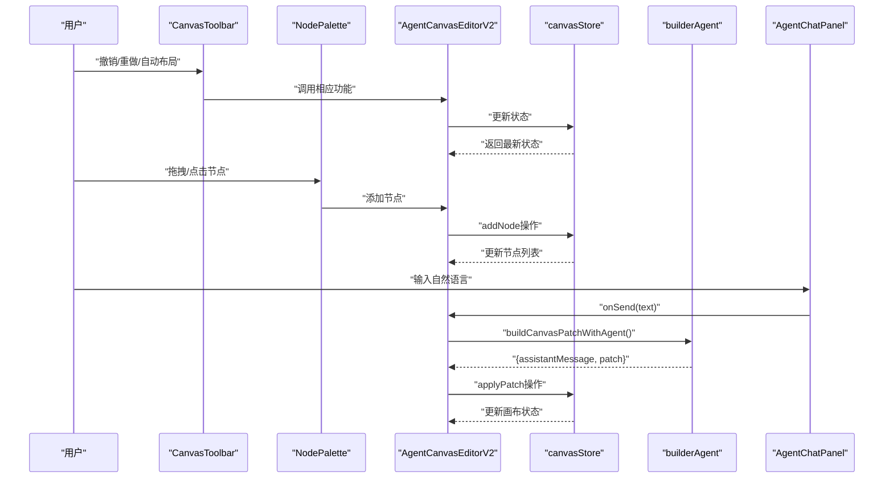
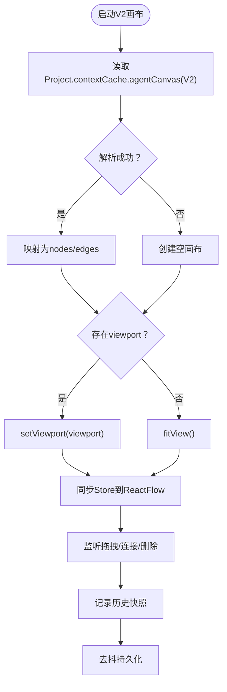
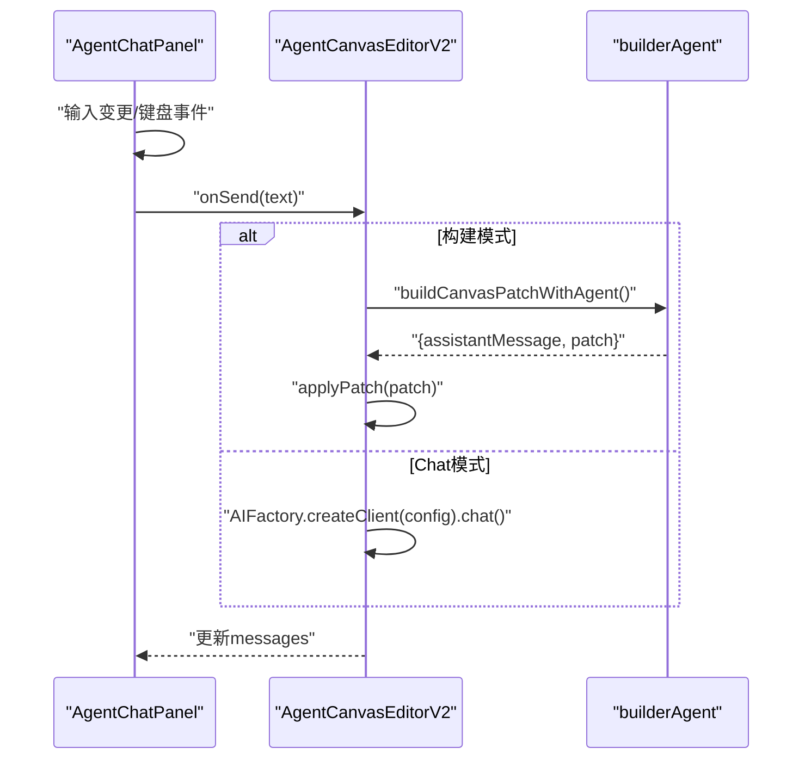
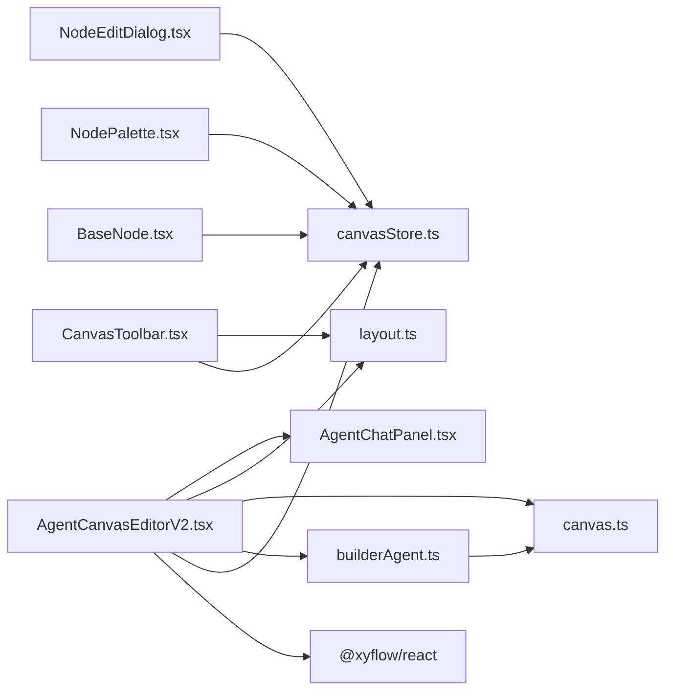

# 画布编辑器

<cite>
**本文档引用的文件**
- [AgentCanvasEditorV2.tsx](file://apps/web/src/components/canvas/AgentCanvasEditorV2.tsx)
- [CanvasToolbar.tsx](file://apps/web/src/components/canvas/CanvasToolbar.tsx)
- [NodePalette.tsx](file://apps/web/src/components/canvas/NodePalette.tsx)
- [NodeEditDialog.tsx](file://apps/web/src/components/canvas/NodeEditDialog.tsx)
- [BaseNode.tsx](file://apps/web/src/components/canvas/nodes/BaseNode.tsx)
- [AgentChatPanel.tsx](file://apps/web/src/components/canvas/AgentChatPanel.tsx)
- [canvas.ts](file://apps/web/src/types/canvas.ts)
- [canvasStore.ts](file://apps/web/src/stores/canvasStore.ts)
- [layout.ts](file://apps/web/src/lib/canvas/layout.ts)
- [AgentCanvasEditor.tsx](file://apps/web/src/components/canvas/AgentCanvasEditor.tsx)
- [AgentCanvasEditor.tsx](file://apps/web/src/components/canvas/AgentCanvasEditor.tsx)
- [AgentChatPanel.tsx](file://apps/web/src/components/canvas/AgentChatPanel.tsx)
- [NodeFrame.tsx](file://apps/web/src/components/canvas/nodes/NodeFrame.tsx)
- [ProjectNode.tsx](file://apps/web/src/components/canvas/nodes/ProjectNode.tsx)
- [WorldViewNode.tsx](file://apps/web/src/components/canvas/nodes/WorldViewNode.tsx)
- [CharactersNode.tsx](file://apps/web/src/components/canvas/nodes/CharactersNode.tsx)
- [EpisodePlanNode.tsx](file://apps/web/src/components/canvas/nodes/EpisodePlanNode.tsx)
- [EpisodeNode.tsx](file://apps/web/src/components/canvas/nodes/EpisodeNode.tsx)
- [EpisodeSceneListNode.tsx](file://apps/web/src/components/canvas/nodes/EpisodeSceneListNode.tsx)
- [SceneBeatsNode.tsx](file://apps/web/src/components/canvas/nodes/SceneBeatsNode.tsx)
- [graph.ts](file://apps/web/src/lib/agent/graph.ts)
- [builderAgent.ts](file://apps/web/src/lib/agent/builderAgent.ts)
- [projectStore.ts](file://apps/web/src/stores/projectStore.ts)
- [index.ts](file://apps/web/src/types/index.ts)
</cite>

## 更新摘要

**变更内容**

- 新增AgentCanvasEditorV2组件的完整架构分析
- 新增CanvasToolbar工具栏组件详解
- 新增NodePalette节点调色板组件详解
- 新增NodeEditDialog节点编辑弹窗组件详解
- 新增BaseNode基础节点组件架构
- 新增完整的V2类型系统和状态管理
- 新增自动布局和对齐功能
- 新增撤销/重做历史系统
- 新增节点执行状态管理和进度跟踪
- 新增分组容器和条件节点等新节点类型

## 目录

1. [简介](#简介)
2. [项目结构](#项目结构)
3. [核心组件](#核心组件)
4. [架构总览](#架构总览)
5. [详细组件分析](#详细组件分析)
6. [依赖关系分析](#依赖关系分析)
7. [性能考量](#性能考量)
8. [故障排查指南](#故障排查指南)
9. [结论](#结论)
10. [附录](#附录)

## 简介

本文件面向AIXSSS前端应用的画布编辑器，重点介绍AgentCanvasEditor V2的全新架构设计。V2版本从V1的React Flow基础架构全面升级为完整的Canvas系统，引入了556行的AgentCanvasEditorV2组件、254行的CanvasToolbar工具栏、完整的节点调色板系统、增强的AI集成和全新的状态管理系统。文档详细解释了V2架构的核心特性：统一的节点基础组件、撤销/重做历史系统、自动布局引擎、节点状态管理、弹窗编辑功能以及完整的节点库体系。

## 项目结构

V2架构采用"组件+节点库+状态管理+类型定义+布局引擎"的分层组织：

- 画布容器与交互：AgentCanvasEditorV2.tsx（V2主组件）
- 工具栏：CanvasToolbar.tsx（撤销/重做、自动布局、对齐、缩放等）
- 节点调色板：NodePalette.tsx（节点库分类展示、拖拽添加）
- 节点编辑弹窗：NodeEditDialog.tsx（动态表单编辑）
- 基础节点组件：BaseNode.tsx（统一节点外壳、状态指示、交互处理）
- 实时聊天面板：AgentChatPanel.tsx
- V2类型系统：canvas.ts（完整的类型定义和节点库）
- 状态管理：canvasStore.ts（Zustand状态管理，支持撤销/重做）
- 布局引擎：layout.ts（自动布局、对齐、分布算法）
- V1兼容组件：AgentCanvasEditor.tsx（保留原有功能）
- 画布图谱与默认拓扑：graph.ts
- 画布补丁构建与对话代理：builderAgent.ts
- 项目状态与持久化：projectStore.ts
- 类型定义：index.ts（含AgentCanvasGraphV1、AgentCanvasNodeType等）

```mermaid
graph TB
subgraph "V2架构核心"
A["AgentCanvasEditorV2.tsx"]
B["CanvasToolbar.tsx"]
C["NodePalette.tsx"]
D["NodeEditDialog.tsx"]
E["BaseNode.tsx"]
F["layout.ts"]
G["canvasStore.ts"]
H["canvas.ts"]
end
subgraph "节点库"
P["ProjectSettingsNodeV2.tsx"]
W["WorldViewNodeV2.tsx"]
C2["CharactersNodeV2.tsx"]
N["NarrativeCausalChainNodeV2.tsx"]
EP["EpisodePlanNodeV2.tsx"]
E2["EpisodeNodeV2.tsx"]
CE["CoreExpressionNodeV2.tsx"]
SL["SceneListNodeV2.tsx"]
SA["SceneAnchorNodeV2.tsx"]
AP["ActionPlanNodeV2.tsx"]
KFG["KeyframeGroupsNodeV2.tsx"]
BR["BatchRefineNodeV2.tsx"]
DL["DialogueNodeV2.tsx"]
EX["ExportNodeV2.tsx"]
LLM["LlmNodeV2.tsx"]
CN["ConditionNodeV2.tsx"]
GR["GroupNodeV2.tsx"]
end
subgraph "底层支撑"
I["AgentChatPanel.tsx"]
J["graph.ts"]
K["builderAgent.ts"]
L["projectStore.ts"]
M["index.ts"]
end
A --> B
A --> C
A --> D
A --> E
A --> F
A --> G
A --> H
A --> I
A --> J
A --> K
A --> L
A --> M
E --> P
E --> W
E --> C2
E --> N
E --> EP
E --> E2
E --> CE
E --> SL
E --> SA
E --> AP
E --> KFG
E --> BR
E --> DL
E --> EX
E --> LLM
E --> CN
E --> GR
```

**图表来源**

- [AgentCanvasEditorV2.tsx](file://apps/web/src/components/canvas/AgentCanvasEditorV2.tsx#L1-L557)
- [CanvasToolbar.tsx](file://apps/web/src/components/canvas/CanvasToolbar.tsx#L1-L255)
- [NodePalette.tsx](file://apps/web/src/components/canvas/NodePalette.tsx#L1-L220)
- [NodeEditDialog.tsx](file://apps/web/src/components/canvas/NodeEditDialog.tsx#L1-L513)
- [BaseNode.tsx](file://apps/web/src/components/canvas/nodes/BaseNode.tsx#L1-L372)
- [canvas.ts](file://apps/web/src/types/canvas.ts#L1-L582)
- [canvasStore.ts](file://apps/web/src/stores/canvasStore.ts#L1-L631)
- [layout.ts](file://apps/web/src/lib/canvas/layout.ts#L1-L258)

**章节来源**

- [AgentCanvasEditorV2.tsx](file://apps/web/src/components/canvas/AgentCanvasEditorV2.tsx#L1-L557)
- [canvas.ts](file://apps/web/src/types/canvas.ts#L1-L582)
- [canvasStore.ts](file://apps/web/src/stores/canvasStore.ts#L1-L631)
- [layout.ts](file://apps/web/src/lib/canvas/layout.ts#L1-L258)

## 核心组件

- **AgentCanvasEditorV2**：V2主组件，基于React Flow的完整Canvas系统，支持新节点体系、撤销/重做、弹窗编辑等功能
- **CanvasToolbar**：工具栏组件，提供撤销/重做、自动布局、框选、删除、缩放等操作
- **NodePalette**：节点调色板，展示可添加的节点类型，支持拖拽添加到画布
- **NodeEditDialog**：节点编辑弹窗，根据节点类型动态渲染不同的编辑表单
- **BaseNode**：基础节点组件，提供统一的节点外壳、状态指示、进度条和交互处理
- **AgentChatPanel**：聊天面板，支持"构建"和"Chat"两种模式，发送消息并滚动到底部
- **V2类型系统**：完整的类型定义，包括AgentCanvasNodeTypeV2、AgentCanvasNodeV2、AgentCanvasEdgeV2等
- **canvasStore**：Zustand状态管理，支持撤销/重做、节点选择、弹窗编辑等功能
- **布局引擎**：自动布局算法，支持拓扑排序、层级布局、对齐和分布功能

**章节来源**

- [AgentCanvasEditorV2.tsx](file://apps/web/src/components/canvas/AgentCanvasEditorV2.tsx#L1-L557)
- [CanvasToolbar.tsx](file://apps/web/src/components/canvas/CanvasToolbar.tsx#L1-L255)
- [NodePalette.tsx](file://apps/web/src/components/canvas/NodePalette.tsx#L1-L220)
- [NodeEditDialog.tsx](file://apps/web/src/components/canvas/NodeEditDialog.tsx#L1-L513)
- [BaseNode.tsx](file://apps/web/src/components/canvas/nodes/BaseNode.tsx#L1-L372)
- [canvas.ts](file://apps/web/src/types/canvas.ts#L1-L582)
- [canvasStore.ts](file://apps/web/src/stores/canvasStore.ts#L1-L631)
- [layout.ts](file://apps/web/src/lib/canvas/layout.ts#L1-L258)

## 架构总览

AgentCanvasEditorV2以React Flow为核心，结合Zustand状态管理（canvasStore）与AI代理（builderAgent）实现"自然语言到画布节点/连线"的自动化构建。V2架构引入了完整的节点库系统、撤销/重做历史系统、自动布局引擎和节点状态管理，提供更丰富的交互体验和更强的扩展能力。

**图表来源**

- [CanvasToolbar.tsx](file://apps/web/src/components/canvas/CanvasToolbar.tsx#L72-L254)
- [NodePalette.tsx](file://apps/web/src/components/canvas/NodePalette.tsx#L169-L219)
- [AgentCanvasEditorV2.tsx](file://apps/web/src/components/canvas/AgentCanvasEditorV2.tsx#L129-L544)
- [canvasStore.ts](file://apps/web/src/stores/canvasStore.ts#L167-L590)
- [builderAgent.ts](file://apps/web/src/lib/agent/builderAgent.ts#L1-L214)
- [AgentChatPanel.tsx](file://apps/web/src/components/canvas/AgentChatPanel.tsx#L1-L122)

**章节来源**

- [AgentCanvasEditorV2.tsx](file://apps/web/src/components/canvas/AgentCanvasEditorV2.tsx#L104-L323)
- [canvasStore.ts](file://apps/web/src/stores/canvasStore.ts#L167-L590)
- [builderAgent.ts](file://apps/web/src/lib/agent/builderAgent.ts#L183-L214)

## 详细组件分析

### AgentCanvasEditorV2：V2架构核心

- **React Flow集成**
  - 使用ReactFlowProvider包裹，确保useNodesState/useEdgesState/useReactFlow等hooks可用
  - 注册15种V2节点类型：project_settings、world_view、characters、narrative_causal_chain、episode_plan、episode、core_expression、scene_list、scene_anchor、action_plan、keyframe_groups、batch_refine、dialogue、export、llm、condition、group
  - 背景网格、迷你地图、控制控件启用，fitView默认开启
- **状态管理**
  - 基于Zustand的canvasStore，支持撤销/重做、节点选择、弹窗编辑
  - 自动历史快照，最大历史记录数50
  - 脏状态标记，避免不必要的持久化
- **画布初始化与恢复**
  - 从Project.contextCache.agentCanvas解析V2格式并映射为nodes/edges
  - 若存在viewport则恢复，否则fitView
- **交互与事件**
  - onConnect：使用addEdge追加边
  - onNodesChange：监听节点位置、选择、删除变更
  - onEdgesChange：监听边删除变更
  - onMoveEnd：触发viewport更新
- **拖拽系统**
  - 支持从NodePalette拖拽节点到画布
  - onDragOver/onDrop事件处理拖拽逻辑
- **AI集成**
  - 构建模式下，将用户输入交由builderAgent生成AgentCanvasPatch
  - applyPatch原子性地增删改节点与连线
  - 聊天摘要graphSummary用于AI理解画布状态

**图表来源**

- [AgentCanvasEditorV2.tsx](file://apps/web/src/components/canvas/AgentCanvasEditorV2.tsx#L179-L251)
- [canvasStore.ts](file://apps/web/src/stores/canvasStore.ts#L176-L207)
- [canvasStore.ts](file://apps/web/src/stores/canvasStore.ts#L539-L546)

**章节来源**

- [AgentCanvasEditorV2.tsx](file://apps/web/src/components/canvas/AgentCanvasEditorV2.tsx#L104-L323)
- [canvasStore.ts](file://apps/web/src/stores/canvasStore.ts#L167-L590)

### CanvasToolbar：工具栏组件

- **撤销/重做系统**
  - 基于canvasStore的past/future历史栈
  - 支持键盘快捷键：Cmd/Ctrl+Z（撤销）、Cmd/Ctrl+Shift+Z（重做）
  - 选择器selectCanUndo/selectCanRedo控制按钮状态
- **自动布局引擎**
  - applyLayout(nodes, edges, { direction: 'LR' })实现层级布局
  - 自适应视图fitView，提供流畅的动画过渡
- **对齐功能**
  - alignNodesHorizontally：水平对齐选中节点
  - alignNodesVertically：垂直对齐选中节点
  - 仅在多选状态下启用
- **删除功能**
  - deleteSelectedNodes：删除选中节点及其关联边
  - 支持Delete/Backspace快捷键
- **缩放控制**
  - zoomIn/zoomOut：支持动画缩放
  - fitView：适应视图显示
- **选择信息**
  - 实时显示选中节点数量
  - 鼠标指针图标标识选择状态

**章节来源**

- [CanvasToolbar.tsx](file://apps/web/src/components/canvas/CanvasToolbar.tsx#L72-L254)
- [canvasStore.ts](file://apps/web/src/stores/canvasStore.ts#L596-L630)

### NodePalette：节点调色板

- **节点库分类**
  - global：项目设定、世界观、角色库
  - causal：叙事因果链
  - plan：剧集规划
  - episode：单集创作（核心表达、分镜列表、场景锚点、动作拆解、关键帧组、批量细化、对白生成）
  - export：导出
  - utility：通用工具（LLM、条件节点、分组容器）
- **拖拽系统**
  - 支持拖拽添加节点到画布
  - onDragStart设置dataTransfer数据
  - onDrop事件处理节点添加
- **节点预览**
  - 每个节点显示图标和标签
  - API模式节点显示特殊标识
  - 支持展开/折叠分类
- **默认位置**
  - 添加节点时随机偏移100px，避免重叠

**章节来源**

- [NodePalette.tsx](file://apps/web/src/components/canvas/NodePalette.tsx#L169-L219)
- [canvas.ts](file://apps/web/src/types/canvas.ts#L255-L399)

### NodeEditDialog：节点编辑弹窗

- **动态表单系统**
  - 根据节点类型动态渲染对应表单组件
  - 支持项目设定、世界观、角色库、剧集规划、单集、核心表达、分镜列表、LLM、导出等节点类型
  - 通用表单用于其他节点类型
- **编辑功能**
  - 实时数据绑定，支持标签、参数等编辑
  - 保存时记录历史快照
  - 支持取消和删除操作
- **执行信息**
  - 显示节点最后运行时间、耗时、Token消耗等信息
  - 基于NODE_STATE_LABELS显示状态文本
- **交互设计**
  - 滚动区域支持长内容
  - 保存按钮根据是否有更改启用/禁用
  - 运行按钮预留执行逻辑

**章节来源**

- [NodeEditDialog.tsx](file://apps/web/src/components/canvas/NodeEditDialog.tsx#L397-L513)
- [canvas.ts](file://apps/web/src/types/canvas.ts#L574-L581)

### BaseNode：基础节点组件

- **统一外观**
  - 输入句柄（左侧）和输出句柄（右侧）
  - 节点头部显示图标、标签和状态指示器
  - 支持预览内容区域
- **状态管理**
  - NODE_STATE_COLORS：不同状态的颜色映射
  - NODE_STATE_LABELS：状态文本映射
  - 支持运行中脉冲效果
- **交互处理**
  - 双击打开编辑弹窗
  - 点击选择节点，支持Shift/Meta多选
  - 选中状态显示高亮边框
- **进度显示**
  - 运行状态显示进度条
  - 错误状态显示错误信息
  - 状态文字显示在底部

**章节来源**

- [BaseNode.tsx](file://apps/web/src/components/canvas/nodes/BaseNode.tsx#L125-L223)
- [canvas.ts](file://apps/web/src/types/canvas.ts#L562-L581)

### V2类型系统：完整类型定义

- **节点类型枚举**
  - AgentCanvasNodeTypeV2：17种节点类型，涵盖项目设定、叙事因果、剧集规划、单集创作、导出、通用工具等
  - 支持分组容器（group）和条件分支（condition）等新类型
- **节点状态机**
  - NodeExecutionState：idle、ready、running、success、error、warning六种状态
  - 支持进度跟踪（0-100%）
  - 元数据包含Token消耗、数据版本、Job ID等
- **节点定义**
  - AgentCanvasNodeV2：包含位置、尺寸、状态、执行元数据等完整信息
  - AgentCanvasEdgeV2：支持数据流和控制流边类型
  - AgentCanvasGraphV2：完整的画布图定义，支持分组和视口状态
- **节点库系统**
  - NodeLibraryItem：节点库项定义，包含分类、图标、默认数据、API需求等
  - NODE_LIBRARY_V2：完整的节点库，支持分类展示和API模式标识

**章节来源**

- [canvas.ts](file://apps/web/src/types/canvas.ts#L14-L37)
- [canvas.ts](file://apps/web/src/types/canvas.ts#L46-L108)
- [canvas.ts](file://apps/web/src/types/canvas.ts#L255-L399)

### canvasStore：状态管理

- **历史系统**
  - MAX_HISTORY：最大历史记录数50
  - createSnapshot：创建历史快照，包含节点和边状态
  - undo/redo：基于past/future栈的撤销/重做
- **节点操作**
  - addNode：添加节点，支持位置参数和默认数据
  - updateNode/updateNodeData：更新节点属性和数据
  - deleteNode/deleteSelectedNodes：删除节点及其关联边
  - setNodeState/setNodeProgress：节点状态和进度管理
- **边操作**
  - addEdge：添加边，避免重复连接
  - deleteEdge：删除边
  - setEdgeAnimated：设置边动画状态
- **选择系统**
  - selectNode/selectEdge：节点和边选择
  - selectAll：全选
  - toggleNodeSelection：切换选择状态
- **弹窗编辑**
  - openNodeDialog/closeNodeDialog：打开/关闭节点编辑弹窗
- **导出功能**
  - toGraph：导出AgentCanvasGraphV2格式

**章节来源**

- [canvasStore.ts](file://apps/web/src/stores/canvasStore.ts#L167-L590)

### 布局引擎：自动布局算法

- **拓扑排序**
  - topologicalSort：基于入度的BFS拓扑排序
  - 处理孤立节点，确保所有节点都被分配层级
  - 返回节点到层级的映射
- **层级布局**
  - calculateLayout：计算节点位置，支持LR（从左到右）和TB（从上到下）方向
  - 默认节点尺寸200x80px，间距250x100px
  - 按层级分组，居中对齐同层级节点
- **对齐工具**
  - alignNodesHorizontally：计算平均Y坐标，实现水平对齐
  - alignNodesVertically：计算平均X坐标，实现垂直对齐
- **分布算法**
  - distributeNodesHorizontally：均匀分布节点（水平）
  - distributeNodesVertically：均匀分布节点（垂直）

**章节来源**

- [layout.ts](file://apps/web/src/lib/canvas/layout.ts#L42-L105)
- [layout.ts](file://apps/web/src/lib/canvas/layout.ts#L114-L185)
- [layout.ts](file://apps/web/src/lib/canvas/layout.ts#L194-L257)

### AgentChatPanel：实时对话与消息传递

- **模式切换**
  - "构建"模式：将自然语言转换为画布补丁，不直接改变项目数据，仅在画布内生效
  - "Chat"模式：与AI进行普通对话，返回assistantMessage
- **发送控制**
  - isRunning禁用输入，空消息禁用发送
  - 支持Ctrl/Cmd+Enter快速发送
- **消息渲染**
  - 自动滚动到底部，区分用户/助手/System样式
  - 提供示例提示，引导用户描述节点与连接

**图表来源**

- [AgentChatPanel.tsx](file://apps/web/src/components/canvas/AgentChatPanel.tsx#L12-L121)
- [AgentCanvasEditorV2.tsx](file://apps/web/src/components/canvas/AgentCanvasEditorV2.tsx#L419-L481)
- [builderAgent.ts](file://apps/web/src/lib/agent/builderAgent.ts#L183-L214)

**章节来源**

- [AgentChatPanel.tsx](file://apps/web/src/components/canvas/AgentChatPanel.tsx#L1-L122)
- [AgentCanvasEditorV2.tsx](file://apps/web/src/components/canvas/AgentCanvasEditorV2.tsx#L419-L481)
- [builderAgent.ts](file://apps/web/src/lib/agent/builderAgent.ts#L183-L214)

### V1兼容组件对比

- **AgentCanvasEditor**：保留原有的节点类型（project、world_view、characters、episode_plan、episode、episode_scene_list、scene_beats、refine_all_scenes、export、llm）
- **节点库**：NODE_LIBRARY包含10种节点类型，支持下拉菜单添加
- **交互方式**：使用DropdownMenu添加节点，支持右上角悬浮按钮
- **持久化**：写入AgentCanvasGraphV1格式，支持viewport恢复

**章节来源**

- [AgentCanvasEditor.tsx](file://apps/web/src/components/canvas/AgentCanvasEditor.tsx#L1-L442)

## 依赖关系分析

- **组件耦合**
  - AgentCanvasEditorV2依赖React Flow、Zustand stores、builderAgent与graph
  - 节点组件依赖BaseNode与canvasStore
  - CanvasToolbar依赖canvasStore和layout模块
  - NodeEditDialog依赖canvasStore和节点库
- **外部依赖**
  - React Flow：节点/边/Handle/MiniMap/Controls/Background
  - AIFactory：AI客户端创建与聊天接口
  - Zod：画布图谱schema校验
  - Zustand：状态管理
- **循环依赖**
  - 未见直接循环依赖；节点组件通过store访问数据，editor通过store持久化

**图表来源**

- [AgentCanvasEditorV2.tsx](file://apps/web/src/components/canvas/AgentCanvasEditorV2.tsx#L1-L557)
- [canvasStore.ts](file://apps/web/src/stores/canvasStore.ts#L1-L631)
- [canvas.ts](file://apps/web/src/types/canvas.ts#L1-L582)
- [layout.ts](file://apps/web/src/lib/canvas/layout.ts#L1-L258)

**章节来源**

- [AgentCanvasEditorV2.tsx](file://apps/web/src/components/canvas/AgentCanvasEditorV2.tsx#L1-L557)
- [canvasStore.ts](file://apps/web/src/stores/canvasStore.ts#L1-L631)
- [canvas.ts](file://apps/web/src/types/canvas.ts#L1-L582)
- [layout.ts](file://apps/web/src/lib/canvas/layout.ts#L1-L258)

## 性能考量

- **去抖持久化**
  - 画布变更去抖600ms，避免频繁写入Project.contextCache.agentCanvas
  - 脏状态标记避免不必要的持久化
- **视口恢复**
  - 优先恢复viewport，减少fitView动画开销
  - 自动布局后使用动画过渡
- **列表截断**
  - 角色/世界观/分镜等列表仅展示前N项，降低渲染压力
  - 节点预览内容使用line-clamp限制显示
- **条件渲染**
  - API模式才加载/运行后端任务，避免前端无效计算
  - 运行状态显示进度条，避免大对象全量渲染
- **状态管理优化**
  - Zustand中间件subscribeWithSelector，精确订阅状态变化
  - 历史快照使用structuredClone深拷贝，避免引用问题
- **布局算法优化**
  - 拓扑排序使用Map数据结构，提高查找效率
  - 层级布局计算按需进行，避免重复计算

**章节来源**

- [AgentCanvasEditorV2.tsx](file://apps/web/src/components/canvas/AgentCanvasEditorV2.tsx#L217-L251)
- [canvasStore.ts](file://apps/web/src/stores/canvasStore.ts#L124-L132)
- [layout.ts](file://apps/web/src/lib/canvas/layout.ts#L42-L105)

## 故障排查指南

- **画布无法恢复**
  - 检查Project.contextCache.agentCanvas是否为合法AgentCanvasGraphV2结构；若解析失败，将回退到空画布
  - 确认版本号为2，否则使用默认初始化
- **工具栏功能异常**
  - 检查canvasStore的past/future历史栈状态
  - 确认selectCanUndo/selectCanRedo选择器正确返回状态
- **节点添加失败**
  - 确认NodePalette的拖拽事件处理正常
  - 检查addNode操作是否正确记录历史快照
- **AI构建无响应**
  - 确认AI配置已就绪；检查AgentChatPanel的isRunning状态与输入长度
  - 检查graphSummary是否正确生成
- **撤销/重做失效**
  - 检查历史快照创建和存储逻辑
  - 确认MAX_HISTORY限制和快照清理机制
- **布局计算错误**
  - 检查拓扑排序算法，确认孤立节点处理
  - 验证层级分组和位置计算逻辑

**章节来源**

- [AgentCanvasEditorV2.tsx](file://apps/web/src/components/canvas/AgentCanvasEditorV2.tsx#L179-L197)
- [CanvasToolbar.tsx](file://apps/web/src/components/canvas/CanvasToolbar.tsx#L87-L107)
- [canvasStore.ts](file://apps/web/src/stores/canvasStore.ts#L503-L537)
- [layout.ts](file://apps/web/src/lib/canvas/layout.ts#L97-L105)

## 结论

AgentCanvasEditor V2通过全新的架构设计，实现了从V1到V2的重大升级。V2版本引入了完整的节点库系统、撤销/重做历史系统、自动布局引擎、节点状态管理和弹窗编辑功能，提供了更丰富和强大的画布编辑体验。基于Zustand的状态管理确保了系统的高性能和可扩展性，而统一的BaseNode架构保证了节点组件的一致性和可维护性。V2架构在保持向后兼容的同时，为未来的功能扩展奠定了坚实的基础。

## 附录

### V2类型系统与节点库

- **节点类型枚举**：17种AgentCanvasNodeTypeV2类型，涵盖完整的创作流程
- **节点状态机**：六种执行状态，支持进度跟踪和元数据管理
- **节点库定义**：NODE_LIBRARY_V2包含详细的节点描述、分类、图标和API需求
- **默认数据**：每种节点类型都有合理的默认数据结构

**章节来源**

- [canvas.ts](file://apps/web/src/types/canvas.ts#L14-L37)
- [canvas.ts](file://apps/web/src/types/canvas.ts#L255-L399)
- [canvas.ts](file://apps/web/src/types/canvas.ts#L519-L557)

### 状态管理与历史系统

- **历史快照**：MAX_HISTORY=50，支持精确的历史记录管理
- **选择器模式**：使用select函数优化状态订阅性能
- **节点操作**：完整的CRUD操作和批量更新支持
- **执行状态**：运行中节点集合，支持并发执行管理

**章节来源**

- [canvasStore.ts](file://apps/web/src/stores/canvasStore.ts#L23-L24)
- [canvasStore.ts](file://apps/web/src/stores/canvasStore.ts#L596-L630)

### 布局引擎与对齐算法

- **拓扑排序**：基于入度的BFS算法，处理复杂依赖关系
- **层级布局**：支持LR和TB两种布局方向，自动计算节点位置
- **对齐工具**：水平/垂直对齐，支持多选节点的批量操作
- **分布算法**：均匀分布，确保节点间的合理间距

**章节来源**

- [layout.ts](file://apps/web/src/lib/canvas/layout.ts#L42-L105)
- [layout.ts](file://apps/web/src/lib/canvas/layout.ts#L194-L257)

### 节点扩展指南与自定义组件开发

- **新节点类型**
  - 在AgentCanvasNodeTypeV2枚举中添加新类型
  - 在NODE_LIBRARY_V2中注册节点库项
  - 在nodeTypes映射中添加新组件
- **节点数据结构**
  - 定义对应的NodeData接口，确保类型安全
  - 使用createNodeComponent创建节点组件
- **状态管理**
  - 在canvasStore中添加相应的状态操作方法
  - 支持节点状态机和进度跟踪
- **UI一致性**
  - 统一使用BaseNode组件，保持视觉和交互一致性
  - 实现适当的预览功能和状态指示器
- **编辑表单**
  - 在NodeEditDialog中添加对应的表单组件
  - 支持动态表单渲染和数据验证

**章节来源**

- [canvas.ts](file://apps/web/src/types/canvas.ts#L405-L511)
- [BaseNode.tsx](file://apps/web/src/components/canvas/nodes/BaseNode.tsx#L234-L267)
- [NodeEditDialog.tsx](file://apps/web/src/components/canvas/NodeEditDialog.tsx#L380-L391)
- [canvasStore.ts](file://apps/web/src/stores/canvasStore.ts#L62-L113)
