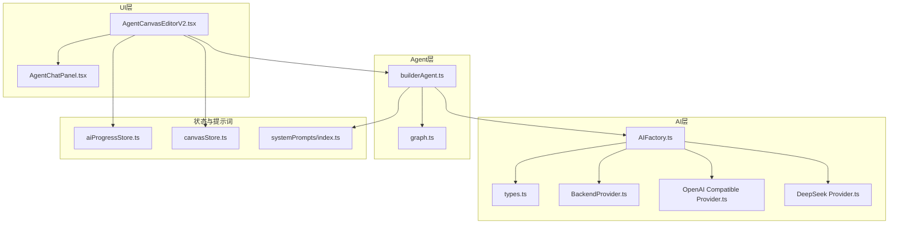
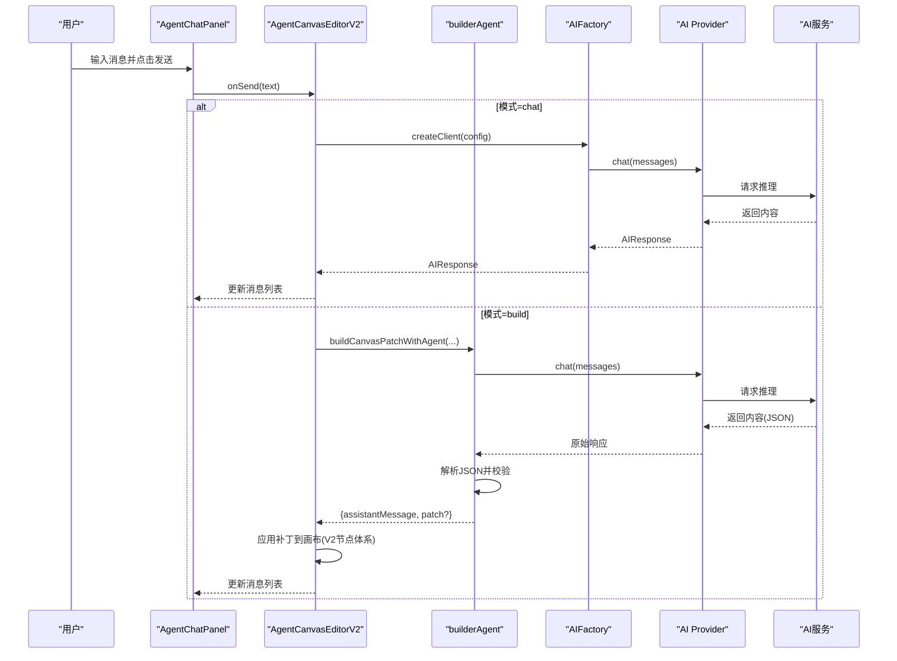
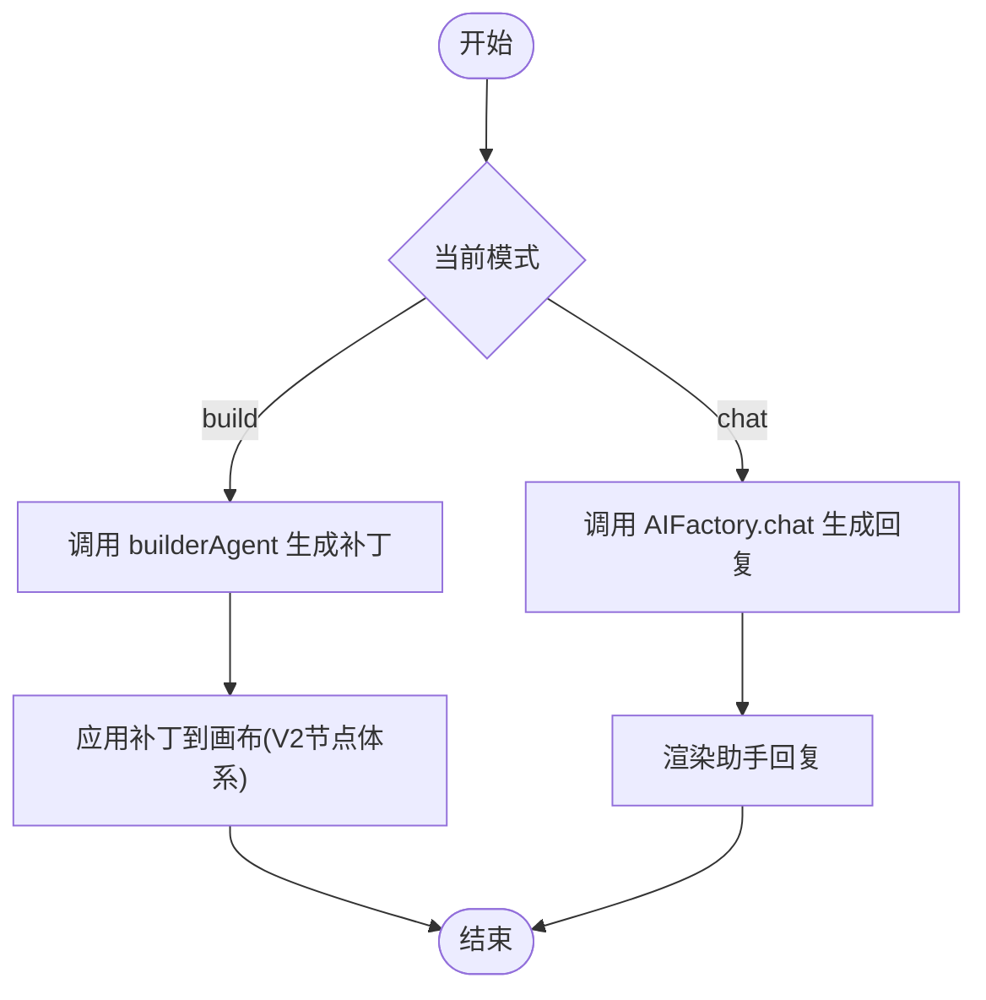
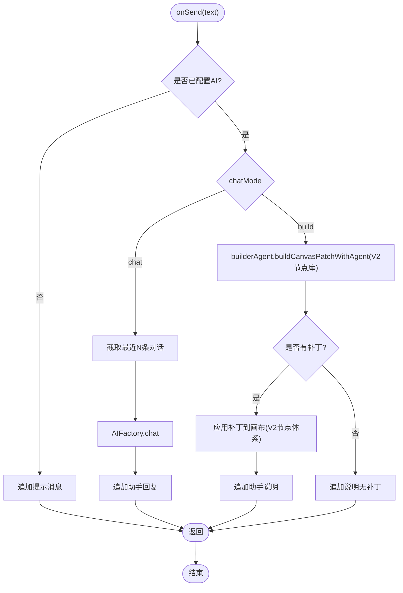
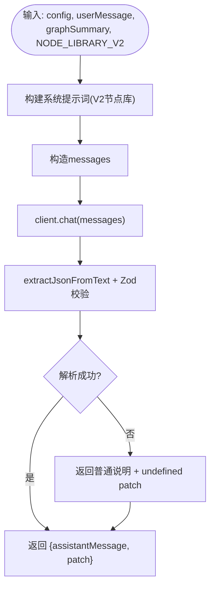
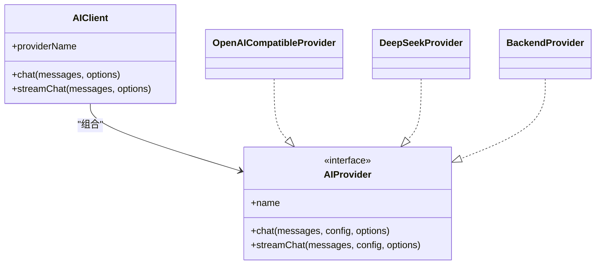
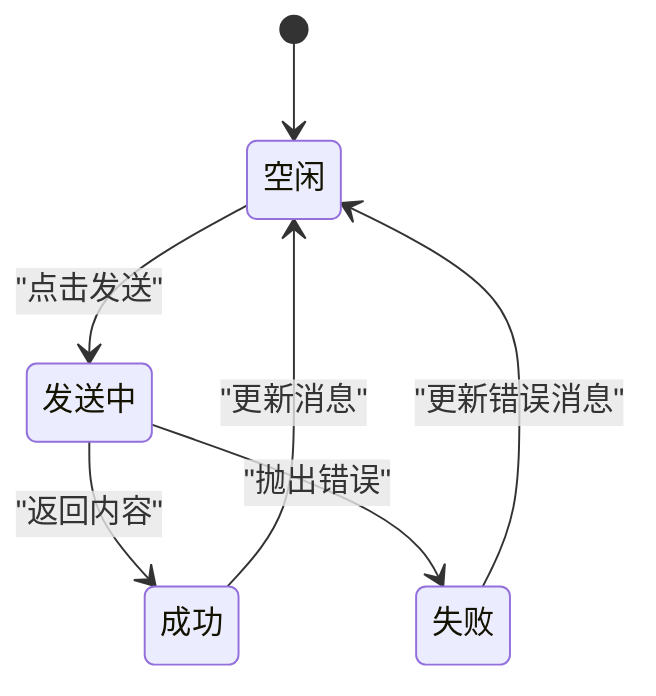
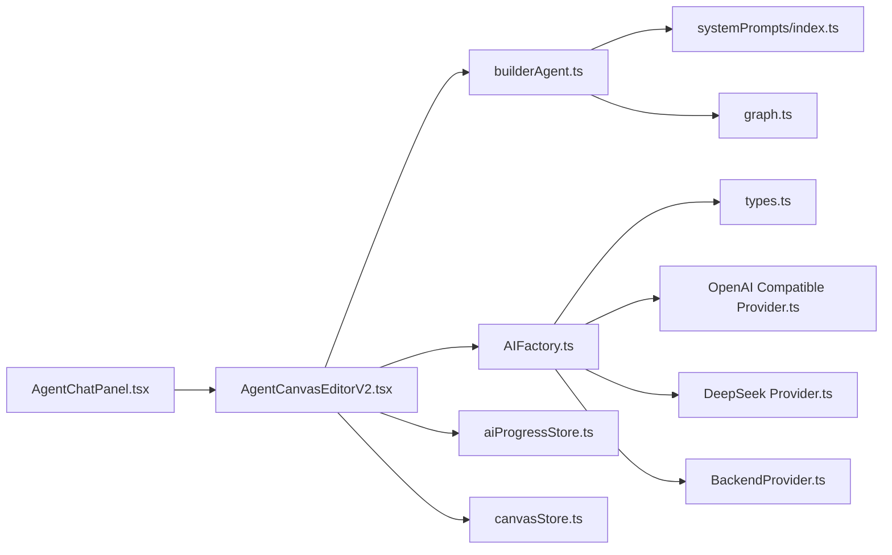

# 聊天集成

<cite>
**本文档引用的文件**
- [AgentChatPanel.tsx](file://apps/web/src/components/canvas/AgentChatPanel.tsx)
- [AgentCanvasEditorV2.tsx](file://apps/web/src/components/canvas/AgentCanvasEditorV2.tsx)
- [builderAgent.ts](file://apps/web/src/lib/agent/builderAgent.ts)
- [graph.ts](file://apps/web/src/lib/agent/graph.ts)
- [factory.ts](file://apps/web/src/lib/ai/factory.ts)
- [types.ts](file://apps/web/src/lib/ai/types.ts)
- [backend.ts](file://apps/web/src/lib/ai/providers/backend.ts)
- [openai.ts](file://apps/web/src/lib/ai/providers/openai.ts)
- [deepseek.ts](file://apps/web/src/lib/ai/providers/deepseek.ts)
- [index.ts](file://apps/web/src/lib/systemPrompts/index.ts)
- [aiProgressStore.ts](file://apps/web/src/stores/aiProgressStore.ts)
- [canvasStore.ts](file://apps/web/src/stores/canvasStore.ts)
- [canvas.ts](file://apps/web/src/types/canvas.ts)
</cite>

## 更新摘要

**变更内容**

- 从简单的AgentChatPanel集成扩展为与AgentCanvasEditorV2深度集成的AI辅助系统
- 支持通过自然语言命令生成画布元素，增强自动滚动行为和样式调整
- 引入V2节点体系，支持更复杂的画布操作
- 实现撤销/重做功能，提供更完整的画布编辑体验

## 目录

1. [简介](#简介)
2. [项目结构](#项目结构)
3. [核心组件](#核心组件)
4. [架构总览](#架构总览)
5. [组件详解](#组件详解)
6. [依赖关系分析](#依赖关系分析)
7. [性能考量](#性能考量)
8. [故障排查指南](#故障排查指南)
9. [结论](#结论)

## 简介

本文件面向AIXSSS画布编辑器的V2聊天集成功能，围绕AgentCanvasEditorV2组件与AgentChatPanel的深度集成展开，系统性阐述以下主题：

- V2节点体系与自然语言到画布元素的转换
- 聊天模式切换（chat/build）与消息历史管理
- 实时对话处理与UI输入机制，包括增强的自动滚动行为
- builderAgent如何将自然语言转换为画布补丁（节点/连线操作）
- AI配置集成、系统提示词注入与消息生成流程
- 聊天状态管理（运行状态、错误处理、用户反馈）
- AI服务集成、消息历史限制与性能优化策略
- 撤销/重做功能与画布状态持久化

## 项目结构

与V2聊天集成相关的核心模块分布如下：

- UI层：AgentChatPanel负责聊天面板的渲染与输入；AgentCanvasEditorV2承载整体画布与聊天面板的编排
- AI层：AIFactory统一创建AI客户端；各Provider封装具体供应商API；BackendProvider在后端模式下桥接到服务端
- Agent层：builderAgent负责构建系统提示词、构造消息、解析AI响应并生成画布补丁
- 数据与状态：aiProgressStore提供AI任务状态、进度与错误追踪；canvasStore管理V2节点体系的状态；graph.ts定义画布数据结构与默认图

**图表来源**

- [AgentChatPanel.tsx](file://apps/web/src/components/canvas/AgentChatPanel.tsx#L1-L123)
- [AgentCanvasEditorV2.tsx](file://apps/web/src/components/canvas/AgentCanvasEditorV2.tsx#L1-L557)
- [builderAgent.ts](file://apps/web/src/lib/agent/builderAgent.ts#L1-L214)
- [factory.ts](file://apps/web/src/lib/ai/factory.ts#L1-L98)
- [types.ts](file://apps/web/src/lib/ai/types.ts#L1-L30)
- [backend.ts](file://apps/web/src/lib/ai/providers/backend.ts#L1-L25)
- [openai.ts](file://apps/web/src/lib/ai/providers/openai.ts#L171-L384)
- [deepseek.ts](file://apps/web/src/lib/ai/providers/deepseek.ts#L1-L140)
- [index.ts](file://apps/web/src/lib/systemPrompts/index.ts#L109-L197)
- [aiProgressStore.ts](file://apps/web/src/stores/aiProgressStore.ts#L1-L758)
- [canvasStore.ts](file://apps/web/src/stores/canvasStore.ts#L1-L631)
- [graph.ts](file://apps/web/src/lib/agent/graph.ts#L1-L136)

**章节来源**

- [AgentChatPanel.tsx](file://apps/web/src/components/canvas/AgentChatPanel.tsx#L1-L123)
- [AgentCanvasEditorV2.tsx](file://apps/web/src/components/canvas/AgentCanvasEditorV2.tsx#L1-L557)
- [builderAgent.ts](file://apps/web/src/lib/agent/builderAgent.ts#L1-L214)
- [factory.ts](file://apps/web/src/lib/ai/factory.ts#L1-L98)
- [types.ts](file://apps/web/src/lib/ai/types.ts#L1-L30)
- [backend.ts](file://apps/web/src/lib/ai/providers/backend.ts#L1-L25)
- [openai.ts](file://apps/web/src/lib/ai/providers/openai.ts#L171-L384)
- [deepseek.ts](file://apps/web/src/lib/ai/providers/deepseek.ts#L1-L140)
- [index.ts](file://apps/web/src/lib/systemPrompts/index.ts#L109-L197)
- [aiProgressStore.ts](file://apps/web/src/stores/aiProgressStore.ts#L1-L758)
- [canvasStore.ts](file://apps/web/src/stores/canvasStore.ts#L1-L631)
- [graph.ts](file://apps/web/src/lib/agent/graph.ts#L1-L136)

## 核心组件

- AgentChatPanel：聊天面板UI，支持模式切换、消息渲染、输入与发送，具备增强的自动滚动行为
- AgentCanvasEditorV2：承载V2节点体系的画布与聊天面板，协调消息发送、历史截断、画布补丁应用
- builderAgent：将自然语言转为画布补丁（节点/连线操作），并生成用户可读说明
- AIFactory：根据配置创建AI客户端，统一流式与非流式输出，并接入AI进度追踪
- aiProgressStore：集中管理AI任务状态、进度、错误与统计数据
- canvasStore：管理V2节点体系的状态，支持撤销/重做、节点选择、弹窗编辑等功能
- systemPrompts：系统提示词加载与覆盖，支持本地覆盖与API模式缓存

**章节来源**

- [AgentChatPanel.tsx](file://apps/web/src/components/canvas/AgentChatPanel.tsx#L10-L123)
- [AgentCanvasEditorV2.tsx](file://apps/web/src/components/canvas/AgentCanvasEditorV2.tsx#L171-L557)
- [builderAgent.ts](file://apps/web/src/lib/agent/builderAgent.ts#L183-L214)
- [factory.ts](file://apps/web/src/lib/ai/factory.ts#L77-L98)
- [aiProgressStore.ts](file://apps/web/src/stores/aiProgressStore.ts#L120-L211)
- [canvasStore.ts](file://apps/web/src/stores/canvasStore.ts#L62-L115)
- [index.ts](file://apps/web/src/lib/systemPrompts/index.ts#L109-L197)

## 架构总览

V2聊天集成采用"UI -> 编辑器协调 -> Agent/Provider -> AI服务"的分层架构。编辑器V2负责：

- 维护消息历史（限制长度）
- 在build模式下调用builderAgent生成画布补丁并应用到ReactFlow
- 在chat模式下调用AIFactory进行对话
- 使用aiProgressStore记录任务状态与输出
- 支持V2节点体系的复杂操作
- 提供撤销/重做功能

**图表来源**

- [AgentChatPanel.tsx](file://apps/web/src/components/canvas/AgentChatPanel.tsx#L32-L39)
- [AgentCanvasEditorV2.tsx](file://apps/web/src/components/canvas/AgentCanvasEditorV2.tsx#L419-L481)
- [builderAgent.ts](file://apps/web/src/lib/agent/builderAgent.ts#L183-L214)
- [factory.ts](file://apps/web/src/lib/ai/factory.ts#L30-L75)
- [openai.ts](file://apps/web/src/lib/ai/providers/openai.ts#L197-L308)
- [deepseek.ts](file://apps/web/src/lib/ai/providers/deepseek.ts#L29-L72)

## 组件详解

### AgentChatPanel：增强的聊天面板UI与输入处理

- 模式切换：顶部Tabs在"构建"和"Chat"之间切换，分别驱动builderAgent与通用对话
- 消息渲染：根据角色渲染不同样式，空消息历史时显示示例
- 输入处理：支持Ctrl/Cmd+Enter快速发送；禁用条件为运行中或输入为空
- 自动滚动：新消息到达时平滑滚动到底部，提供更好的用户体验

**图表来源**

- [AgentChatPanel.tsx](file://apps/web/src/components/canvas/AgentChatPanel.tsx#L41-L120)
- [AgentCanvasEditorV2.tsx](file://apps/web/src/components/canvas/AgentCanvasEditorV2.tsx#L419-L481)

**章节来源**

- [AgentChatPanel.tsx](file://apps/web/src/components/canvas/AgentChatPanel.tsx#L10-L123)
- [AgentCanvasEditorV2.tsx](file://apps/web/src/components/canvas/AgentCanvasEditorV2.tsx#L419-L481)

### AgentCanvasEditorV2：V2节点体系的画布编辑器

- V2节点体系：支持37种节点类型，涵盖全局设定、叙事因果、剧集规划、单集创作、导出和通用工具
- 消息历史管理：最多保留最近N条（编辑器内对历史进行截断，避免过长）
- 模式分支：
  - chat：直接调用AI服务，追加助手回复
  - build：调用builderAgent，追加助手说明并应用补丁到V2节点体系
- 画布补丁应用：根据op类型增删节点、连线；删除节点同时清理相关边
- 画布持久化：防抖写入Project.contextCache.agentCanvas，避免频繁写入
- 撤销/重做：支持历史记录管理，最大50个快照
- 自动滚动：增强的消息自动滚动行为，提供更好的用户体验

**图表来源**

- [AgentCanvasEditorV2.tsx](file://apps/web/src/components/canvas/AgentCanvasEditorV2.tsx#L419-L481)
- [builderAgent.ts](file://apps/web/src/lib/agent/builderAgent.ts#L183-L214)

**章节来源**

- [AgentCanvasEditorV2.tsx](file://apps/web/src/components/canvas/AgentCanvasEditorV2.tsx#L171-L557)
- [canvasStore.ts](file://apps/web/src/stores/canvasStore.ts#L176-L207)
- [canvas.ts](file://apps/web/src/types/canvas.ts#L255-L399)

### builderAgent：V2节点体系的自然语言到画布补丁

- 系统提示词构建：
  - 优先从系统提示词服务加载模板，注入V2节点库信息
  - 若失败则回退到内置模板
- 消息构造：system + 当前画布摘要 + 用户请求
- 响应解析：提取JSON（支持代码块与首段大括号块），Zod校验，失败时返回普通说明
- 输出：assistantMessage（用户可见说明）+ 可选patch（结构化操作）

**图表来源**

- [builderAgent.ts](file://apps/web/src/lib/agent/builderAgent.ts#L168-L214)
- [index.ts](file://apps/web/src/lib/systemPrompts/index.ts#L109-L197)

**章节来源**

- [builderAgent.ts](file://apps/web/src/lib/agent/builderAgent.ts#L107-L214)
- [index.ts](file://apps/web/src/lib/systemPrompts/index.ts#L109-L197)

### V2节点体系与画布状态管理

- 节点类型：37种节点类型，分为全局设定、叙事因果、剧集规划、单集创作、导出和通用工具
- 节点数据：支持执行状态、进度、错误信息、元数据等丰富属性
- 历史管理：支持撤销/重做，最大50个快照
- 状态持久化：防抖写入Project.contextCache.agentCanvas
- 分组功能：支持节点分组聚合

**章节来源**

- [canvas.ts](file://apps/web/src/types/canvas.ts#L14-L37)
- [canvas.ts](file://apps/web/src/types/canvas.ts#L255-L399)
- [canvasStore.ts](file://apps/web/src/stores/canvasStore.ts#L62-L115)
- [canvasStore.ts](file://apps/web/src/stores/canvasStore.ts#L176-L207)

### AI配置与服务集成

- AIFactory.createClient：
  - 后端模式：通过BackendProvider走服务端调用，要求aiProfileId
  - 本地模式：根据provider类型选择具体Provider（OpenAI Compatible、DeepSeek等）
- AIClient.streamChat包装：拦截流式输出，写入aiProgressStore，便于实时监控
- Provider实现：
  - OpenAI Compatible：兼容Responses与Chat Completions，自动降级
  - DeepSeek：标准Chat Completions
  - Backend：封装服务端LLM调用

**图表来源**

- [factory.ts](file://apps/web/src/lib/ai/factory.ts#L30-L98)
- [types.ts](file://apps/web/src/lib/ai/types.ts#L17-L29)
- [openai.ts](file://apps/web/src/lib/ai/providers/openai.ts#L171-L384)
- [deepseek.ts](file://apps/web/src/lib/ai/providers/deepseek.ts#L4-L140)
- [backend.ts](file://apps/web/src/lib/ai/providers/backend.ts#L5-L24)

**章节来源**

- [factory.ts](file://apps/web/src/lib/ai/factory.ts#L77-L98)
- [openai.ts](file://apps/web/src/lib/ai/providers/openai.ts#L197-L308)
- [deepseek.ts](file://apps/web/src/lib/ai/providers/deepseek.ts#L29-L72)
- [backend.ts](file://apps/web/src/lib/ai/providers/backend.ts#L8-L23)

### 聊天状态管理与用户反馈

- 运行状态：chatRunning布尔值控制发送按钮禁用与面板状态
- 消息历史限制：编辑器对历史进行截断，减少上下文长度
- 错误处理：捕获异常并追加错误消息
- 用户反馈：aiProgressStore提供任务状态、进度、错误与统计数据，支持事件订阅
- 自动滚动：增强的消息自动滚动行为，提供更好的用户体验

**图表来源**

- [AgentCanvasEditorV2.tsx](file://apps/web/src/components/canvas/AgentCanvasEditorV2.tsx#L419-L481)
- [aiProgressStore.ts](file://apps/web/src/stores/aiProgressStore.ts#L151-L211)

**章节来源**

- [AgentCanvasEditorV2.tsx](file://apps/web/src/components/canvas/AgentCanvasEditorV2.tsx#L419-L481)
- [aiProgressStore.ts](file://apps/web/src/stores/aiProgressStore.ts#L249-L677)

## 依赖关系分析

- AgentChatPanel依赖AgentCanvasEditorV2提供的onSend回调与运行状态
- AgentCanvasEditorV2依赖builderAgent与AIFactory；在build模式下依赖V2节点库进行补丁应用
- AIFactory依赖各Provider与types.ts定义的接口；在流式场景下依赖aiProgressStore
- systemPrompts为builderAgent提供系统提示词，支持本地覆盖与API缓存
- canvasStore管理V2节点体系的状态，支持撤销/重做功能

**图表来源**

- [AgentChatPanel.tsx](file://apps/web/src/components/canvas/AgentChatPanel.tsx#L1-L123)
- [AgentCanvasEditorV2.tsx](file://apps/web/src/components/canvas/AgentCanvasEditorV2.tsx#L1-L557)
- [builderAgent.ts](file://apps/web/src/lib/agent/builderAgent.ts#L1-L214)
- [factory.ts](file://apps/web/src/lib/ai/factory.ts#L1-L98)
- [types.ts](file://apps/web/src/lib/ai/types.ts#L1-L30)
- [openai.ts](file://apps/web/src/lib/ai/providers/openai.ts#L171-L384)
- [deepseek.ts](file://apps/web/src/lib/ai/providers/deepseek.ts#L1-L140)
- [backend.ts](file://apps/web/src/lib/ai/providers/backend.ts#L1-L25)
- [index.ts](file://apps/web/src/lib/systemPrompts/index.ts#L109-L197)
- [aiProgressStore.ts](file://apps/web/src/stores/aiProgressStore.ts#L1-L758)
- [canvasStore.ts](file://apps/web/src/stores/canvasStore.ts#L1-L631)
- [graph.ts](file://apps/web/src/lib/agent/graph.ts#L1-L136)

**章节来源**

- [AgentChatPanel.tsx](file://apps/web/src/components/canvas/AgentChatPanel.tsx#L1-L123)
- [AgentCanvasEditorV2.tsx](file://apps/web/src/components/canvas/AgentCanvasEditorV2.tsx#L1-L557)
- [builderAgent.ts](file://apps/web/src/lib/agent/builderAgent.ts#L1-L214)
- [factory.ts](file://apps/web/src/lib/ai/factory.ts#L1-L98)
- [types.ts](file://apps/web/src/lib/ai/types.ts#L1-L30)
- [openai.ts](file://apps/web/src/lib/ai/providers/openai.ts#L171-L384)
- [deepseek.ts](file://apps/web/src/lib/ai/providers/deepseek.ts#L1-L140)
- [backend.ts](file://apps/web/src/lib/ai/providers/backend.ts#L1-L25)
- [index.ts](file://apps/web/src/lib/systemPrompts/index.ts#L109-L197)
- [aiProgressStore.ts](file://apps/web/src/stores/aiProgressStore.ts#L1-L758)
- [canvasStore.ts](file://apps/web/src/stores/canvasStore.ts#L1-L631)
- [graph.ts](file://apps/web/src/lib/agent/graph.ts#L1-L136)

## 性能考量

- 消息历史限制：编辑器对历史进行截断，降低上下文长度，提高响应速度与稳定性
- 防抖持久化：画布变更写入Project.contextCache.agentCanvas采用防抖，避免频繁写入
- 流式输出监控：AIClient.streamChat拦截chunk并写入aiProgressStore，便于实时反馈
- Provider兼容性：OpenAI Compatible自动在Responses与Chat Completions间切换，提升可用性
- V2节点库：NODE_LIBRARY_V2提供37种节点类型，减少首次构建成本
- 撤销/重做：限制最大历史记录数为50，平衡内存使用与功能完整性
- 自动滚动优化：增强的消息自动滚动行为，提供更好的用户体验

## 故障排查指南

- 未配置AI：编辑器检测到未配置时，会追加提示消息，引导用户在设置中完成配置
- AI配置不完整：本地模式下若缺少供应商、API Key或模型，工厂方法会抛错
- 后端模式缺失aiProfileId：BackendProvider会报错，提示绑定AI Profile
- 响应解析失败：builderAgent在解析JSON失败时返回普通说明，避免中断流程
- 错误消息呈现：编辑器捕获异常并追加错误消息，便于定位问题
- V2节点兼容性：确保使用的节点类型在NODE_LIBRARY_V2中定义
- 撤销/重做失效：检查canvasStore的历史记录状态，确认未超出最大限制

**章节来源**

- [AgentCanvasEditorV2.tsx](file://apps/web/src/components/canvas/AgentCanvasEditorV2.tsx#L419-L481)
- [factory.ts](file://apps/web/src/lib/ai/factory.ts#L77-L98)
- [backend.ts](file://apps/web/src/lib/ai/providers/backend.ts#L8-L13)
- [builderAgent.ts](file://apps/web/src/lib/agent/builderAgent.ts#L205-L212)
- [canvasStore.ts](file://apps/web/src/stores/canvasStore.ts#L24-L25)

## 结论

AIXSSS V2聊天集成功能通过AgentChatPanel与AgentCanvasEditorV2实现"构建/对话"双模式，借助V2节点体系将自然语言转化为可执行的画布补丁，并通过AIFactory与多供应商Provider实现灵活的AI服务集成。配合aiProgressStore的状态追踪、canvasStore的V2节点状态管理与系统提示词注入，系统在易用性、可扩展性、可观测性和用户体验方面达到良好平衡。增强的自动滚动行为和样式调整进一步提升了交互体验，而撤销/重做功能确保了编辑的安全性。
