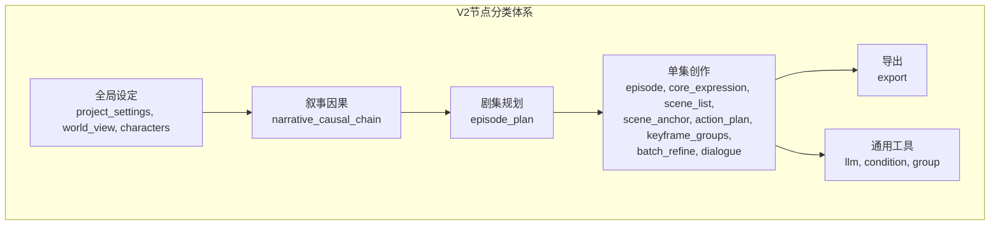
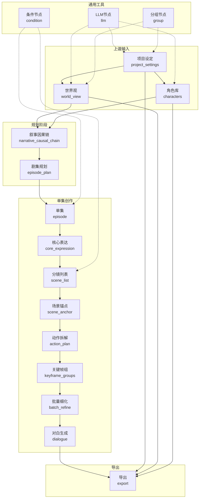

# 节点系统

<cite>
**本文引用的文件**
- [apps/web/src/components/canvas/nodes/BaseNode.tsx](file://apps/web/src/components/canvas/nodes/BaseNode.tsx)
- [apps/web/src/components/canvas/NodePalette.tsx](file://apps/web/src/components/canvas/NodePalette.tsx)
- [apps/web/src/components/canvas/AgentCanvasEditorV2.tsx](file://apps/web/src/components/canvas/AgentCanvasEditorV2.tsx)
- [apps/web/src/types/canvas.ts](file://apps/web/src/types/canvas.ts)
- [apps/web/src/components/canvas/nodes/NodeFrame.tsx](file://apps/web/src/components/canvas/nodes/NodeFrame.tsx)
- [apps/web/src/components/canvas/nodes/ProjectNode.tsx](file://apps/web/src/components/canvas/nodes/ProjectNode.tsx)
- [apps/web/src/components/canvas/nodes/WorldViewNode.tsx](file://apps/web/src/components/canvas/nodes/WorldViewNode.tsx)
- [apps/web/src/components/canvas/nodes/CharactersNode.tsx](file://apps/web/src/components/canvas/nodes/CharactersNode.tsx)
- [apps/web/src/stores/projectStore.ts](file://apps/web/src/stores/projectStore.ts)
- [apps/web/src/stores/episodeStore.ts](file://apps/web/src/stores/episodeStore.ts)
- [apps/web/src/types/index.ts](file://apps/web/src/types/index.ts)
- [packages/shared/src/schemas/episode.ts](file://packages/shared/src/schemas/episode.ts)
- [packages/shared/src/schemas/scene.ts](file://packages/shared/src/schemas/scene.ts)
- [packages/shared/src/schemas/character.ts](file://packages/shared/src/schemas/character.ts)
- [packages/shared/src/schemas/worldView.ts](file://packages/shared/src/schemas/worldView.ts)
- [apps/api/prisma/schema.prisma](file://apps/api/prisma/schema.prisma)
</cite>

## 更新摘要

**所做更改**

- 全面重构节点系统架构，从原有的10个节点类型扩展为17个节点类型的完整分类体系
- 引入V2节点系统，采用全新的BaseNode组件和完整的节点调色板系统
- 新增完整的节点分类体系：全局设定、叙事因果、剧集规划、单集创作、导出、通用工具
- 实现节点状态机管理、预览功能、进度条显示和错误处理
- 更新节点库定义，支持拖拽添加和分类浏览

## 目录

1. [简介](#简介)
2. [V2节点系统概述](#v2节点系统概述)
3. [节点分类体系](#节点分类体系)
4. [BaseNode基础组件](#basenode基础组件)
5. [节点调色板系统](#节点调色板系统)
6. [节点类型详解](#节点类型详解)
7. [状态管理系统](#状态管理系统)
8. [节点间依赖关系](#节点间依赖关系)
9. [数据结构与类型定义](#数据结构与类型定义)
10. [迁移指南](#迁移指南)
11. [最佳实践](#最佳实践)

## 简介

本文档详细介绍AIXSSS画布编辑器V2节点系统的全面重构。新系统从原有的10个节点类型扩展为17个节点类型的完整分类体系，包括全局设定、因果叙述元素、剧集规划组件、单集创作工具、导出实用程序和通用节点。系统引入了BaseNode基础组件、完整的节点调色板系统和节点状态机管理，为用户提供更加直观和高效的创作体验。

## V2节点系统概述

V2节点系统是AIXSSS画布编辑器的重大升级，采用模块化设计和状态驱动架构。系统基于ReactFlow构建，通过BaseNode组件提供统一的节点外观和交互模式，通过NodePalette实现节点库的分类管理和拖拽添加功能。

### 核心特性

- **模块化架构**：BaseNode组件提供统一的节点外壳和交互逻辑
- **分类管理**：6个主要分类，每个分类包含特定功能的节点类型
- **状态管理**：完整的节点执行状态机，支持运行中、成功、错误等多种状态
- **预览功能**：智能预览内容生成，帮助用户快速理解节点作用
- **拖拽集成**：支持拖拽添加节点，提升用户体验

## 节点分类体系

V2节点系统按照功能相似性和使用场景分为6个主要分类：



**图表来源**

- [apps/web/src/types/canvas.ts](file://apps/web/src/types/canvas.ts#L219-L399)
- [apps/web/src/components/canvas/NodePalette.tsx](file://apps/web/src/components/canvas/NodePalette.tsx#L67-L76)

### 分类详情

#### 全局设定 (Global)

- **项目设定** (`project_settings`)：管理项目基本信息、画风和主角
- **世界观** (`world_view`)：管理世界观要素和规则
- **角色库** (`characters`)：管理角色信息和关系

#### 叙事因果 (Causal)

- **叙事因果链** (`narrative_causal_chain`)：构建故事冲突和信息层

#### 剧集规划 (Plan)

- **剧集规划** (`episode_plan`)：生成多集概要和规划

#### 单集创作 (Episode)

- **单集** (`episode`)：选择和管理单个剧集
- **核心表达** (`core_expression`)：主题和情感曲线
- **分镜列表** (`scene_list`)：生成分镜列表
- **场景锚点** (`scene_anchor`)：场景描述生成
- **动作拆解** (`action_plan`)：ActionPlan和beats
- **关键帧组** (`keyframe_groups`)：关键帧组生成
- **批量细化** (`batch_refine`)：批量细化分镜
- **对白生成** (`dialogue`)：角色对白生成

#### 导出 (Export)

- **导出** (`export`)：Markdown/JSON格式导出

#### 通用工具 (Utility)

- **LLM节点** (`llm`)：通用对话和处理
- **条件节点** (`condition`)：条件分支逻辑
- **分组容器** (`group`)：节点分组管理

**章节来源**

- [apps/web/src/types/canvas.ts](file://apps/web/src/types/canvas.ts#L255-L399)

## BaseNode基础组件

BaseNode是V2节点系统的核心基础组件，提供统一的节点外观、状态管理和交互逻辑。

### 核心功能

- **统一外观**：提供一致的节点样式和布局
- **状态指示**：显示节点执行状态（运行中、成功、错误等）
- **进度条**：显示长时间任务的执行进度
- **预览内容**：智能生成节点功能预览
- **交互处理**：支持双击打开编辑对话框、点击选择等

### 状态管理

BaseNode实现了完整的节点状态机，支持以下状态：

- `idle`：初始状态，未执行
- `ready`：依赖满足，可执行
- `running`：执行中，带脉冲效果
- `success`：执行成功
- `error`：执行失败
- `warning`：需要注意的状态

### 预览功能

BaseNode支持智能预览内容生成，根据不同节点类型显示相关信息：

- 项目设定：显示预览文本
- 世界观：显示要素数量
- 角色库：显示角色数量
- 剧集规划：显示目标集数
- 分镜列表：显示分镜数量
- 导出：显示格式信息
- LLM：显示系统提示词

**章节来源**

- [apps/web/src/components/canvas/nodes/BaseNode.tsx](file://apps/web/src/components/canvas/nodes/BaseNode.tsx#L1-L372)

## 节点调色板系统

NodePalette是V2节点系统的重要组成部分，提供节点库的分类管理和拖拽添加功能。

### 分类管理

节点调色板按照6个主要分类组织节点：

- **全局设定**：项目设定、世界观、角色库
- **叙事因果**：叙事因果链
- **剧集规划**：剧集规划
- **单集创作**：所有单集相关的创作节点
- **导出**：导出功能
- **通用工具**：LLM、条件、分组等通用节点

### 交互功能

- **拖拽添加**：支持拖拽节点到画布
- **点击添加**：支持点击直接添加节点
- **分类展开**：支持分类的折叠和展开
- **API模式标识**：标记需要API模式的节点

### 用户体验

- **智能预览**：鼠标悬停显示节点详细信息
- **分类导航**：清晰的分类层次结构
- **响应式设计**：适配不同屏幕尺寸
- **无障碍支持**：支持键盘导航和屏幕阅读器

**章节来源**

- [apps/web/src/components/canvas/NodePalette.tsx](file://apps/web/src/components/canvas/NodePalette.tsx#L1-L220)

## 节点类型详解

### 项目设定节点 (ProjectSettingsNodeV2)

项目设定节点管理项目的基本信息，包括标题、故事梗概、主角和画风配置。

#### 数据结构

```typescript
interface ProjectSettingsNodeData {
  label?: string;
}
```

#### 功能特性

- **基本信息管理**：标题、故事梗概、主角输入
- **画风管理**：显示和复制画风fullPrompt
- **实时保存**：支持实时保存项目信息
- **画风注入**：提供复制画风功能供其他节点使用

#### 交互行为

- 保存按钮仅在项目ID存在时可用
- 复制画风按钮支持一键复制到剪贴板
- 实时同步项目store状态

**章节来源**

- [apps/web/src/components/canvas/nodes/ProjectNode.tsx](file://apps/web/src/components/canvas/nodes/ProjectNode.tsx#L1-L126)
- [apps/web/src/types/canvas.ts](file://apps/web/src/types/canvas.ts#L405-L408)

### 世界观节点 (WorldViewNodeV2)

世界观节点管理项目的世界观要素，支持多种类型的世界观规则和设定。

#### 数据结构

```typescript
interface WorldViewNodeData {
  label?: string;
}
```

#### 支持的世界观类型

- **时代背景**：历史时期、文化特征
- **地理设定**：地形地貌、气候条件
- **社会制度**：政治体制、社会结构
- **科技水平**：技术水平、发展程度
- **魔法体系**：魔法规则、力量体系
- **其他**：自定义世界观要素

#### 功能特性

- **要素管理**：增删改查世界观要素
- **分类统计**：按类型统计要素数量
- **对话框添加**：提供友好的添加界面
- **分组显示**：按类型分组显示要素

#### 交互行为

- 支持API模式下的数据加载
- 提供要素删除确认
- 支持分页和筛选功能

**章节来源**

- [apps/web/src/components/canvas/nodes/WorldViewNode.tsx](file://apps/web/src/components/canvas/nodes/WorldViewNode.tsx#L1-L237)
- [apps/web/src/types/canvas.ts](file://apps/web/src/types/canvas.ts#L410-L413)

### 角色库节点 (CharactersNodeV2)

角色库节点管理项目中的角色信息，支持角色的创建、编辑和关系管理。

#### 数据结构

```typescript
interface CharactersNodeData {
  label?: string;
}
```

#### 功能特性

- **角色管理**：角色列表展示和管理
- **基本信息**：姓名、简述、头像等
- **关系网络**：角色间关系和互动
- **批量操作**：支持批量删除和编辑

#### 交互行为

- 支持角色添加对话框
- 提供角色删除确认
- 支持角色信息编辑

**章节来源**

- [apps/web/src/components/canvas/nodes/CharactersNode.tsx](file://apps/web/src/components/canvas/nodes/CharactersNode.tsx#L1-L186)
- [apps/web/src/types/canvas.ts](file://apps/web/src/types/canvas.ts#L415-L418)

### 叙事因果链节点 (NarrativeCausalChainNodeV2)

叙事因果链节点用于构建故事的冲突引擎、信息层和节拍流。

#### 数据结构

```typescript
interface NarrativeCausalChainNodeData {
  label?: string;
  actMode?: 'three_act' | 'five_act';
}
```

#### 功能特性

- **结构模式**：支持三幕式和五幕式结构
- **因果关系**：构建故事的因果链条
- **信息层管理**：管理故事的信息层次
- **节拍流控制**：控制故事节奏和张力

**章节来源**

- [apps/web/src/types/canvas.ts](file://apps/web/src/types/canvas.ts#L420-L424)

### 剧集规划节点 (EpisodePlanNodeV2)

剧集规划节点用于生成多集剧集的概要和规划。

#### 数据结构

```typescript
interface EpisodePlanNodeData {
  label?: string;
  targetEpisodeCount?: number;
}
```

#### 功能特性

- **集数规划**：设置目标剧集数量
- **批量生成**：自动生成多个剧集节点
- **智能连线**：自动建立节点间的连接关系
- **进度跟踪**：跟踪规划执行进度

**章节来源**

- [apps/web/src/types/canvas.ts](file://apps/web/src/types/canvas.ts#L426-L430)

### 核心表达节点 (CoreExpressionNodeV2)

核心表达节点用于定义剧集的主题、情感曲线和视觉母题。

#### 数据结构

```typescript
interface CoreExpressionNodeData {
  label?: string;
  episodeId?: string;
}
```

#### 功能特性

- **主题定义**：确定剧集的核心主题
- **情感曲线**：设计情感起伏和变化
- **视觉母题**：建立视觉元素和符号系统
- **风格指导**：为后续创作提供风格指导

**章节来源**

- [apps/web/src/types/canvas.ts](file://apps/web/src/types/canvas.ts#L439-L443)

### 分镜列表节点 (SceneListNodeV2)

分镜列表节点用于生成和管理剧集的分镜列表。

#### 数据结构

```typescript
interface SceneListNodeData {
  label?: string;
  episodeId?: string;
  sceneCountHint?: number;
}
```

#### 功能特性

- **分镜生成**：自动生成分镜列表
- **数量控制**：控制分镜数量和质量
- **列表管理**：提供分镜的增删改查
- **进度跟踪**：显示分镜生成进度

**章节来源**

- [apps/web/src/types/canvas.ts](file://apps/web/src/types/canvas.ts#L445-L450)

### 场景锚点节点 (SceneAnchorNodeV2)

场景锚点节点用于生成和管理场景描述。

#### 数据结构

```typescript
interface SceneAnchorNodeData {
  label?: string;
  episodeId?: string;
  sceneId?: string;
}
```

#### 功能特性

- **场景描述**：生成详细的场景描述
- **上下文注入**：为后续创作提供上下文
- **细节丰富**：包含场景的详细信息
- **风格统一**：保持场景描述的一致性

**章节来源**

- [apps/web/src/types/canvas.ts](file://apps/web/src/types/canvas.ts#L452-L457)

### 动作拆解节点 (ActionPlanNodeV2)

动作拆解节点用于生成ActionPlan和beats结构。

#### 数据结构

```typescript
interface ActionPlanNodeData {
  label?: string;
  episodeId?: string;
  sceneId?: string;
}
```

#### 功能特性

- **动作分解**：将场景分解为具体动作
- **节奏控制**：控制动作的节奏和强度
- **细节描述**：提供动作的详细描述
- **执行指导**：为分镜制作提供指导

**章节来源**

- [apps/web/src/types/canvas.ts](file://apps/web/src/types/canvas.ts#L459-L464)

### 关键帧组节点 (KeyframeGroupsNodeV2)

关键帧组节点用于生成关键帧组。

#### 数据结构

```typescript
interface KeyframeGroupsNodeData {
  label?: string;
  episodeId?: string;
  sceneId?: string;
}
```

#### 功能特性

- **关键帧生成**：生成9组关键帧
- **动作过渡**：控制动作的平滑过渡
- **视觉效果**：为动画制作提供关键帧
- **节奏配合**：与动作拆解配合

**章节来源**

- [apps/web/src/types/canvas.ts](file://apps/web/src/types/canvas.ts#L466-L471)

### 批量细化节点 (BatchRefineNodeV2)

批量细化节点用于批量细化所有分镜。

#### 数据结构

```typescript
interface BatchRefineNodeData {
  label?: string;
  episodeId?: string;
}
```

#### 功能特性

- **批量处理**：一次性处理所有分镜
- **质量提升**：提升分镜的质量和细节
- **效率优化**：节省人工细化时间
- **一致性保证**：确保分镜风格一致

**章节来源**

- [apps/web/src/types/canvas.ts](file://apps/web/src/types/canvas.ts#L473-L477)

### 对白生成节点 (DialogueNodeV2)

对白生成节点用于生成角色对白。

#### 数据结构

```typescript
interface DialogueNodeData {
  label?: string;
  episodeId?: string;
  sceneId?: string;
}
```

#### 功能特性

- **对白生成**：自动生成角色对白
- **角色匹配**：确保对白符合角色性格
- **情境适应**：对白与情境相匹配
- **自然流畅**：保持对白的自然流畅

**章节来源**

- [apps/web/src/types/canvas.ts](file://apps/web/src/types/canvas.ts#L479-L484)

### 导出节点 (ExportNodeV2)

导出节点用于将创作内容导出为Markdown或JSON格式。

#### 数据结构

```typescript
interface ExportNodeData {
  label?: string;
  format?: 'markdown' | 'json';
}
```

#### 功能特性

- **格式选择**：支持Markdown和JSON两种格式
- **内容生成**：生成完整的导出内容
- **一键导出**：提供便捷的导出功能
- **格式验证**：确保导出内容的完整性

**章节来源**

- [apps/web/src/types/canvas.ts](file://apps/web/src/types/canvas.ts#L486-L490)

### LLM节点 (LlmNodeV2)

LLM节点提供通用的AI对话和处理功能。

#### 数据结构

```typescript
interface LlmNodeData {
  label?: string;
  systemPrompt?: string;
  userPrompt?: string;
  result?: string;
}
```

#### 功能特性

- **通用对话**：支持各种对话场景
- **系统提示**：可配置系统提示词
- **结果处理**：处理和展示AI生成结果
- **灵活配置**：支持多种参数配置

**章节来源**

- [apps/web/src/types/canvas.ts](file://apps/web/src/types/canvas.ts#L492-L498)

### 条件节点 (ConditionNodeV2)

条件节点用于实现条件分支逻辑。

#### 数据结构

```typescript
interface ConditionNodeData {
  label?: string;
  condition?: string;
}
```

#### 功能特性

- **条件判断**：支持复杂的条件判断
- **分支控制**：控制工作流的分支走向
- **逻辑组合**：支持多个条件的组合
- **动态路由**：根据条件动态路由

**章节来源**

- [apps/web/src/types/canvas.ts](file://apps/web/src/types/canvas.ts#L500-L504)

### 分组节点 (GroupNodeV2)

分组节点用于将多个节点组织在一起。

#### 数据结构

```typescript
interface GroupNodeData {
  label?: string;
  childNodeIds?: string[];
}
```

#### 功能特性

- **节点分组**：将相关节点组织在一起
- **批量操作**：支持对分组内节点的批量操作
- **视图管理**：提供分组的折叠和展开
- **层级管理**：支持嵌套分组

**章节来源**

- [apps/web/src/types/canvas.ts](file://apps/web/src/types/canvas.ts#L506-L510)

## 状态管理系统

V2节点系统实现了完整的状态管理机制，支持节点执行状态的跟踪和显示。

### 状态机设计

节点状态机包含6种基本状态：

- **idle**：初始状态，节点刚创建但未执行
- **ready**：准备状态，依赖满足但未执行
- **running**：运行状态，节点正在执行任务
- **success**：成功状态，任务执行完成
- **error**：错误状态，任务执行失败
- **warning**：警告状态，需要注意的问题

### 状态显示

BaseNode组件提供多种状态显示方式：

- **颜色编码**：不同状态对应不同颜色
- **图标指示**：使用不同的图标表示状态
- **进度条**：运行状态显示进度条
- **错误信息**：错误状态显示详细错误信息

### 状态转换

状态转换遵循严格的规则：

- idle → ready：依赖满足时自动转换
- ready → running：开始执行任务
- running → success/error：任务完成后转换
- error/warning → ready：修复问题后重新准备

**章节来源**

- [apps/web/src/types/canvas.ts](file://apps/web/src/types/canvas.ts#L46-L52)
- [apps/web/src/components/canvas/nodes/BaseNode.tsx](file://apps/web/src/components/canvas/nodes/BaseNode.tsx#L64-L79)

## 节点间依赖关系

V2节点系统建立了清晰的节点间依赖关系，形成完整的创作工作流。

### 传统工作流



**图表来源**

- [apps/web/src/types/canvas.ts](file://apps/web/src/types/canvas.ts#L14-L37)
- [apps/web/src/components/canvas/AgentCanvasEditorV2.tsx](file://apps/web/src/components/canvas/AgentCanvasEditorV2.tsx#L76-L94)

### 依赖关系规则

- **上游依赖**：项目设定、世界观、角色库为上游输入
- **规划依赖**：叙事因果链和剧集规划依赖上游数据
- **创作依赖**：单集创作节点依赖规划结果
- **导出依赖**：导出节点依赖所有创作结果
- **工具依赖**：通用工具节点可作为辅助工具使用

### 数据传递机制

- **上下文注入**：上游节点通过画风和设定注入到下游
- **显式传递**：通过节点连接实现数据的显式传递
- **状态同步**：通过状态机实现节点间的状态同步
- **错误传播**：错误状态会在依赖链中传播

**章节来源**

- [apps/web/src/components/canvas/AgentCanvasEditorV2.tsx](file://apps/web/src/components/canvas/AgentCanvasEditorV2.tsx#L285-L417)

## 数据结构与类型定义

V2节点系统采用了完整的类型定义体系，确保类型安全和开发效率。

### 节点类型定义

```typescript
export type AgentCanvasNodeTypeV2 =
  // 全局设定 (global)
  | 'project_settings'
  | 'world_view'
  | 'characters'
  // 叙事因果 (causal)
  | 'narrative_causal_chain'
  // 剧集规划 (plan)
  | 'episode_plan'
  // 单集创作 (episode)
  | 'episode'
  | 'core_expression'
  | 'scene_list'
  | 'scene_anchor'
  | 'action_plan'
  | 'keyframe_groups'
  | 'batch_refine'
  | 'dialogue'
  // 导出 (export)
  | 'export'
  // 通用节点
  | 'llm'
  | 'condition'
  | 'group';
```

### 节点数据接口

每个节点类型都有对应的接口定义，确保数据结构的规范性：

#### 基础节点接口

```typescript
export interface AgentCanvasNodeV2<TData = Record<string, unknown>> {
  id: string;
  type: AgentCanvasNodeTypeV2;
  position: { x: number; y: number };
  data: TData;
  width?: number;
  height?: number;
  state: NodeExecutionState;
  lastRunAt?: string;
  lastRunDuration?: number;
  lastError?: string;
  progress?: number;
  metadata?: NodeMetadataV2;
  locked?: boolean;
  groupId?: string;
}
```

#### 节点元数据

```typescript
export interface NodeMetadataV2 {
  checksum?: string;
  tokenUsage?: number;
  version?: number;
  jobId?: string;
}
```

### 节点库定义

节点库提供了完整的节点信息定义：

```typescript
export interface NodeLibraryItem {
  type: AgentCanvasNodeTypeV2;
  label: string;
  description: string;
  category: NodeCategory;
  icon: string;
  defaultData?: Record<string, unknown>;
  allowMultiple?: boolean;
  requiresApi?: boolean;
}

export const NODE_LIBRARY_V2: NodeLibraryItem[] = [
  // 项目设定节点定义...
  // 世界观节点定义...
  // 其他节点定义...
];
```

### 工具函数

系统提供了多种工具函数支持节点操作：

#### ID生成

```typescript
export function generateNodeId(type: AgentCanvasNodeTypeV2): string {
  const rand = Math.random().toString(36).slice(2, 8);
  return `${type}_${Date.now()}_${rand}`;
}
```

#### 默认节点创建

```typescript
export function createDefaultNode(
  type: AgentCanvasNodeTypeV2,
  position: { x: number; y: number } = { x: 0, y: 0 },
): AgentCanvasNodeV2 {
  const libraryItem = getNodeLibraryItem(type);
  return {
    id: generateNodeId(type),
    type,
    position,
    data: {
      label: libraryItem?.label ?? type,
      ...(libraryItem?.defaultData ?? {}),
    },
    state: 'idle',
  };
}
```

**章节来源**

- [apps/web/src/types/canvas.ts](file://apps/web/src/types/canvas.ts#L14-L557)

## 迁移指南

从V1节点系统迁移到V2节点系统需要进行以下调整：

### 组件迁移

- **NodeFrame**：保持原有功能，继续作为通用容器使用
- **具体节点**：需要迁移到新的BaseNode组件体系
- **节点类型**：更新节点类型枚举和数据结构

### 状态管理

- **状态机**：从简单的布尔状态升级为完整的状态机
- **进度跟踪**：新增进度条显示功能
- **错误处理**：增强错误信息的显示和处理

### API调整

- **节点注册**：从手动注册改为自动注册
- **数据结构**：更新节点数据结构以支持新功能
- **事件处理**：调整节点事件处理机制

### 开发建议

- **渐进式迁移**：可以逐步迁移节点，不需要一次性完成
- **向后兼容**：保持部分V1功能的兼容性
- **测试验证**：充分测试新系统的功能和性能

## 最佳实践

基于V2节点系统的特性和架构，推荐以下最佳实践：

### 节点设计

- **单一职责**：每个节点专注于一个特定功能
- **数据驱动**：通过数据结构定义节点行为
- **状态管理**：合理使用状态机管理节点状态
- **错误处理**：提供完善的错误处理和恢复机制

### 用户体验

- **直观预览**：为每个节点提供清晰的功能预览
- **拖拽添加**：充分利用拖拽功能提升用户体验
- **分类组织**：合理使用节点分类帮助用户找到所需节点
- **响应式设计**：确保在不同设备上的良好体验

### 性能优化

- **懒加载**：对大型节点实现懒加载
- **状态缓存**：合理缓存节点状态减少重复计算
- **批量操作**：支持批量节点操作提升效率
- **内存管理**：及时清理不再使用的节点资源

### 扩展开发

- **插件机制**：支持第三方节点插件开发
- **配置化**：提供丰富的配置选项
- **API接口**：提供清晰的API接口供外部调用
- **文档完善**：为新节点提供完整的开发文档

通过遵循这些最佳实践，可以充分发挥V2节点系统的强大功能，为用户提供更好的创作体验。
