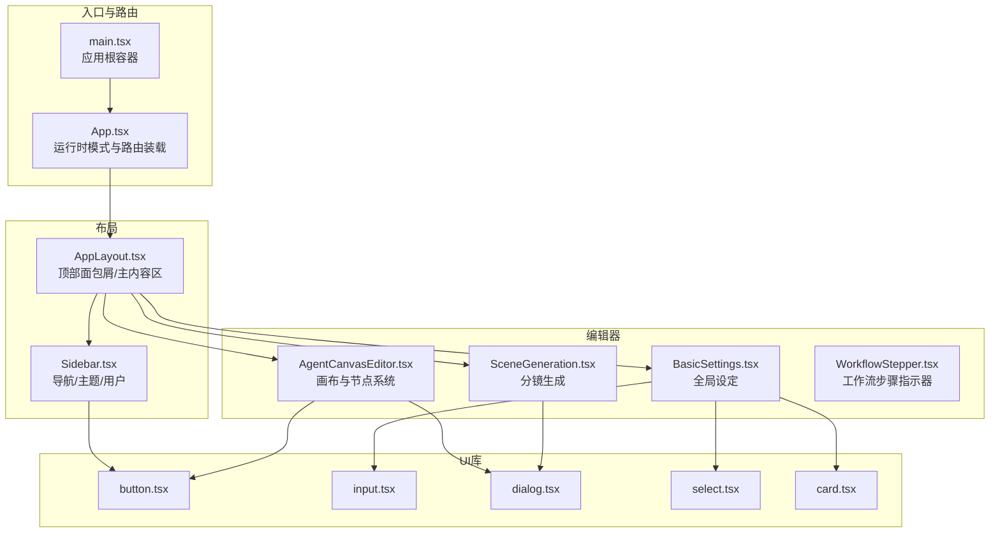
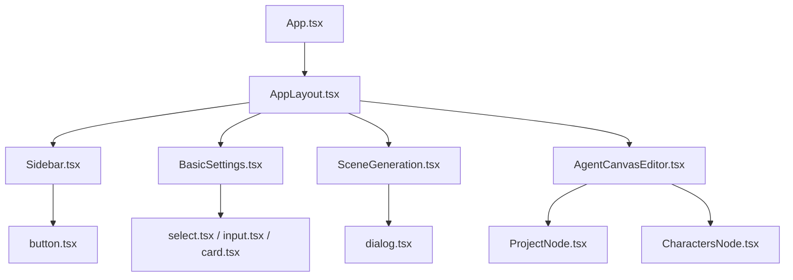
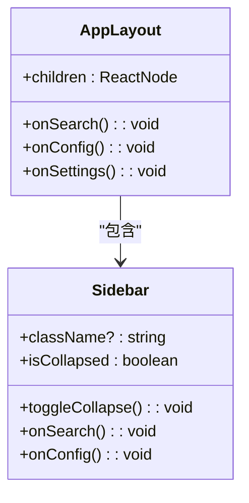
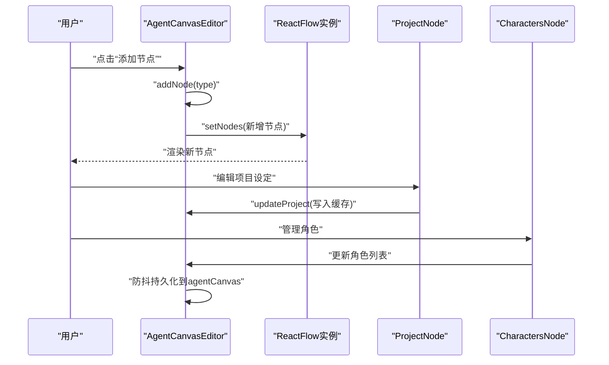
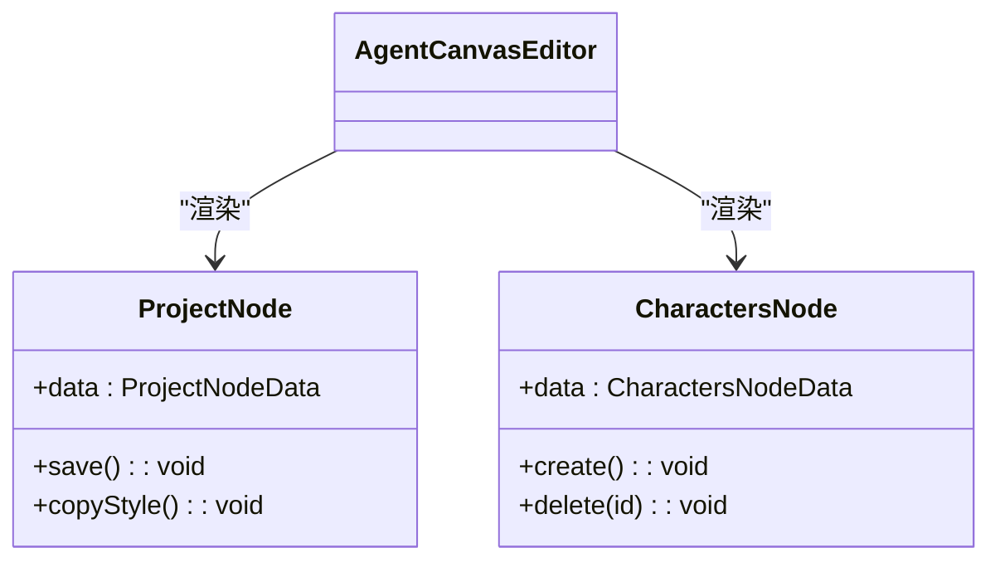
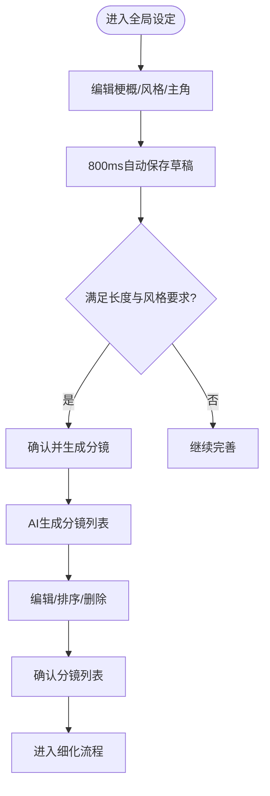
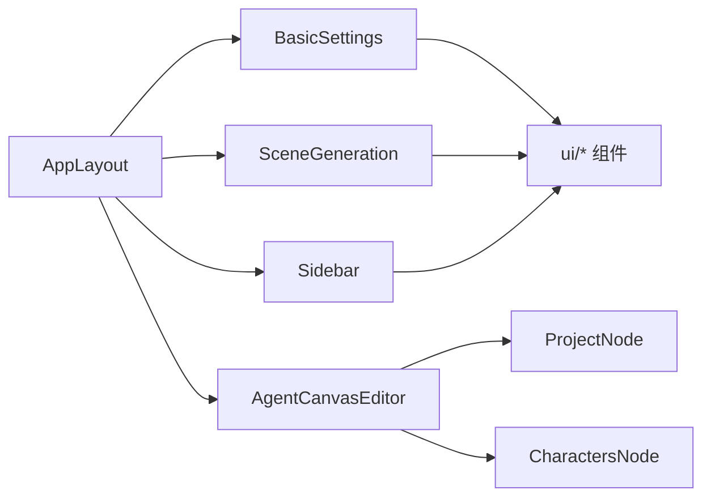

# 组件系统

<cite>
**本文引用的文件**
- [apps/web/src/App.tsx](file://apps/web/src/App.tsx)
- [apps/web/src/main.tsx](file://apps/web/src/main.tsx)
- [apps/web/src/components/layout/AppLayout.tsx](file://apps/web/src/components/layout/AppLayout.tsx)
- [apps/web/src/components/layout/Sidebar.tsx](file://apps/web/src/components/layout/Sidebar.tsx)
- [apps/web/src/components/canvas/AgentCanvasEditor.tsx](file://apps/web/src/components/canvas/AgentCanvasEditor.tsx)
- [apps/web/src/components/canvas/nodes/ProjectNode.tsx](file://apps/web/src/components/canvas/nodes/ProjectNode.tsx)
- [apps/web/src/components/canvas/nodes/CharactersNode.tsx](file://apps/web/src/components/canvas/nodes/CharactersNode.tsx)
- [apps/web/src/components/ui/button.tsx](file://apps/web/src/components/ui/button.tsx)
- [apps/web/src/components/ui/card.tsx](file://apps/web/src/components/ui/card.tsx)
- [apps/web/src/components/ui/dialog.tsx](file://apps/web/src/components/ui/dialog.tsx)
- [apps/web/src/components/ui/input.tsx](file://apps/web/src/components/ui/input.tsx)
- [apps/web/src/components/ui/select.tsx](file://apps/web/src/components/ui/select.tsx)
- [apps/web/src/components/editor/BasicSettings.tsx](file://apps/web/src/components/editor/BasicSettings.tsx)
- [apps/web/src/components/editor/SceneGeneration.tsx](file://apps/web/src/components/editor/SceneGeneration.tsx)
- [apps/web/src/components/editor/WorkflowStepper.tsx](file://apps/web/src/components/editor/WorkflowStepper.tsx)
</cite>

## 目录

1. [简介](#简介)
2. [项目结构](#项目结构)
3. [核心组件](#核心组件)
4. [架构总览](#架构总览)
5. [组件详解](#组件详解)
6. [依赖关系分析](#依赖关系分析)
7. [性能考量](#性能考量)
8. [故障排查指南](#故障排查指南)
9. [结论](#结论)
10. [附录](#附录)

## 简介

本文件面向AIXSSS前端应用的组件系统，系统性梳理UI组件库的设计理念、从原子组件到复合组件的层级结构，并深入解析以下主题：

- 布局组件（AppLayout、Sidebar）的实现模式与响应式策略
- 画布编辑器（AgentCanvasEditor）的节点系统、拖拽交互与状态管理
- 编辑器功能模块划分、工作流集成与用户交互设计
- 组件API文档、props定义、事件处理与样式定制方案
- 组件使用示例与集成指导

## 项目结构

前端位于 apps/web/src，采用按功能域分层的组织方式：

- components/layout：布局与导航
- components/ui：原子组件库（Button、Input、Dialog等）
- components/canvas：画布编辑器与节点
- components/editor：传统编辑器工作流模块
- stores：状态管理（Zustand）
- lib：工具与AI能力封装
- hooks：自定义Hook
- types：类型定义

图表来源

- [apps/web/src/main.tsx](file://apps/web/src/main.tsx#L1-L37)
- [apps/web/src/App.tsx](file://apps/web/src/App.tsx#L1-L392)
- [apps/web/src/components/layout/AppLayout.tsx](file://apps/web/src/components/layout/AppLayout.tsx#L1-L112)
- [apps/web/src/components/layout/Sidebar.tsx](file://apps/web/src/components/layout/Sidebar.tsx#L1-L175)
- [apps/web/src/components/canvas/AgentCanvasEditor.tsx](file://apps/web/src/components/canvas/AgentCanvasEditor.tsx#L1-L442)
- [apps/web/src/components/editor/BasicSettings.tsx](file://apps/web/src/components/editor/BasicSettings.tsx#L1-L963)
- [apps/web/src/components/editor/SceneGeneration.tsx](file://apps/web/src/components/editor/SceneGeneration.tsx#L1-L587)
- [apps/web/src/components/editor/WorkflowStepper.tsx](file://apps/web/src/components/editor/WorkflowStepper.tsx#L1-L108)
- [apps/web/src/components/ui/button.tsx](file://apps/web/src/components/ui/button.tsx#L1-L51)
- [apps/web/src/components/ui/input.tsx](file://apps/web/src/components/ui/input.tsx#L1-L23)
- [apps/web/src/components/ui/dialog.tsx](file://apps/web/src/components/ui/dialog.tsx#L1-L104)
- [apps/web/src/components/ui/select.tsx](file://apps/web/src/components/ui/select.tsx#L1-L152)
- [apps/web/src/components/ui/card.tsx](file://apps/web/src/components/ui/card.tsx#L1-L56)

章节来源

- [apps/web/src/main.tsx](file://apps/web/src/main.tsx#L1-L37)
- [apps/web/src/App.tsx](file://apps/web/src/App.tsx#L1-L392)

## 核心组件

- 原子组件（Atomic）：Button、Input、Dialog、Select、Card等，提供最小可复用的视觉与交互单元，统一使用Tailwind类名与cva变体系统，支持size/variant扩展。
- 复合组件（Composite）：如AppLayout、Sidebar、AgentCanvasEditor、BasicSettings、SceneGeneration等，组合多个原子组件，承载业务逻辑与状态。
- 节点组件（Node）：画布中的可拖拽节点，如ProjectNode、CharactersNode等，作为AgentCanvasEditor的子组件渲染。

章节来源

- [apps/web/src/components/ui/button.tsx](file://apps/web/src/components/ui/button.tsx#L1-L51)
- [apps/web/src/components/ui/input.tsx](file://apps/web/src/components/ui/input.tsx#L1-L23)
- [apps/web/src/components/ui/dialog.tsx](file://apps/web/src/components/ui/dialog.tsx#L1-L104)
- [apps/web/src/components/ui/select.tsx](file://apps/web/src/components/ui/select.tsx#L1-L152)
- [apps/web/src/components/ui/card.tsx](file://apps/web/src/components/ui/card.tsx#L1-L56)
- [apps/web/src/components/layout/AppLayout.tsx](file://apps/web/src/components/layout/AppLayout.tsx#L1-L112)
- [apps/web/src/components/layout/Sidebar.tsx](file://apps/web/src/components/layout/Sidebar.tsx#L1-L175)
- [apps/web/src/components/canvas/AgentCanvasEditor.tsx](file://apps/web/src/components/canvas/AgentCanvasEditor.tsx#L1-L442)
- [apps/web/src/components/canvas/nodes/ProjectNode.tsx](file://apps/web/src/components/canvas/nodes/ProjectNode.tsx#L1-L126)
- [apps/web/src/components/canvas/nodes/CharactersNode.tsx](file://apps/web/src/components/canvas/nodes/CharactersNode.tsx#L1-L186)

## 架构总览

应用采用“布局容器 + 功能模块”的分层架构：

- 布局层：AppLayout负责顶部导航、面包屑、主内容区；Sidebar提供导航与用户态操作。
- 编辑器层：AgentCanvasEditor承载画布与节点系统；BasicSettings与SceneGeneration承载传统编辑器工作流。
- 组件层：UI库提供一致的原子组件；各模块通过props与事件进行交互。
- 状态层：Zustand stores管理项目、配置、主题、AI进度等跨模块共享状态。

图表来源

- [apps/web/src/App.tsx](file://apps/web/src/App.tsx#L1-L392)
- [apps/web/src/components/layout/AppLayout.tsx](file://apps/web/src/components/layout/AppLayout.tsx#L1-L112)
- [apps/web/src/components/layout/Sidebar.tsx](file://apps/web/src/components/layout/Sidebar.tsx#L1-L175)
- [apps/web/src/components/editor/BasicSettings.tsx](file://apps/web/src/components/editor/BasicSettings.tsx#L1-L963)
- [apps/web/src/components/editor/SceneGeneration.tsx](file://apps/web/src/components/editor/SceneGeneration.tsx#L1-L587)
- [apps/web/src/components/canvas/AgentCanvasEditor.tsx](file://apps/web/src/components/canvas/AgentCanvasEditor.tsx#L1-L442)
- [apps/web/src/components/canvas/nodes/ProjectNode.tsx](file://apps/web/src/components/canvas/nodes/ProjectNode.tsx#L1-L126)
- [apps/web/src/components/canvas/nodes/CharactersNode.tsx](file://apps/web/src/components/canvas/nodes/CharactersNode.tsx#L1-L186)
- [apps/web/src/components/ui/select.tsx](file://apps/web/src/components/ui/select.tsx#L1-L152)
- [apps/web/src/components/ui/input.tsx](file://apps/web/src/components/ui/input.tsx#L1-L23)
- [apps/web/src/components/ui/card.tsx](file://apps/web/src/components/ui/card.tsx#L1-L56)
- [apps/web/src/components/ui/dialog.tsx](file://apps/web/src/components/ui/dialog.tsx#L1-L104)
- [apps/web/src/components/ui/button.tsx](file://apps/web/src/components/ui/button.tsx#L1-L51)

## 组件详解

### 布局组件：AppLayout 与 Sidebar

- 设计理念
  - 以SidebarProvider/SidebarInset为容器，提供可折叠侧边栏与主内容区。
  - 顶部区域包含面包屑导航与“传统/画布”切换按钮，适配多编辑器模式。
  - 主内容区根据路径动态决定溢出策略（画布全屏、项目页最大宽度、首页自适应）。
- 关键API
  - AppLayoutProps：children、onSearch、onConfig、onSettings
  - SidebarProps：className、isCollapsed、toggleCollapse、onSearch、onConfig
- 响应式策略
  - 侧边栏宽度随折叠状态切换；图标/文字在折叠时隐藏；滚动区域支持纵向滚动。
- 交互与事件
  - 顶部按钮触发父级回调（打开搜索、设置、开发者面板），实现跨组件联动。

图表来源

- [apps/web/src/components/layout/AppLayout.tsx](file://apps/web/src/components/layout/AppLayout.tsx#L18-L23)
- [apps/web/src/components/layout/Sidebar.tsx](file://apps/web/src/components/layout/Sidebar.tsx#L21-L27)

章节来源

- [apps/web/src/components/layout/AppLayout.tsx](file://apps/web/src/components/layout/AppLayout.tsx#L1-L112)
- [apps/web/src/components/layout/Sidebar.tsx](file://apps/web/src/components/layout/Sidebar.tsx#L1-L175)

### 画布编辑器：AgentCanvasEditor

- 设计理念
  - 基于@xyflow/react构建可视化节点图，支持节点拖拽、连线、缩放、小地图与背景网格。
  - 节点类型注册表集中管理，支持动态添加/更新/删除节点与连线。
  - 画布状态持久化至项目上下文缓存，防抖写入避免高频变更导致的性能问题。
- 节点系统
  - 节点类型：project、world_view、characters、episode_plan、episode、episode_scene_list、scene_beats、refine_all_scenes、export、llm。
  - 节点库：NODE_LIBRARY提供类型、标签与描述，用于“添加节点”下拉菜单。
- 拖拽与交互
  - onConnect建立连线；onNodesChange/onEdgesChange监听变更；fitView/viewport持久化。
  - 右上角“添加节点”下拉菜单，点击后在画布中心创建新节点。
- 状态管理
  - 项目切换时从Project.contextCache.agentCanvas恢复画布；变更后定时器防抖写回。
  - 支持聊天模式（chat/build），与AI代理协作生成/应用画布补丁。
- API要点
  - ReactFlowProvider包裹，确保内部hooks可用。
  - applyPatch支持批量应用节点/连线变更，删除节点同时清理相关连线。

图表来源

- [apps/web/src/components/canvas/AgentCanvasEditor.tsx](file://apps/web/src/components/canvas/AgentCanvasEditor.tsx#L250-L267)
- [apps/web/src/components/canvas/AgentCanvasEditor.tsx](file://apps/web/src/components/canvas/AgentCanvasEditor.tsx#L270-L323)
- [apps/web/src/components/canvas/nodes/ProjectNode.tsx](file://apps/web/src/components/canvas/nodes/ProjectNode.tsx#L40-L47)
- [apps/web/src/components/canvas/nodes/CharactersNode.tsx](file://apps/web/src/components/canvas/nodes/CharactersNode.tsx#L48-L69)

章节来源

- [apps/web/src/components/canvas/AgentCanvasEditor.tsx](file://apps/web/src/components/canvas/AgentCanvasEditor.tsx#L1-L442)

### 节点组件：ProjectNode 与 CharactersNode

- ProjectNode
  - 展示并编辑项目标题、故事梗概、主角；展示只读画风Full Prompt并支持复制。
  - 保存按钮受canSave约束，仅当存在项目ID时可用。
- CharactersNode
  - 加载并展示角色库，支持新增/删除角色；对话框表单校验名称非空。
  - 顶部显示总数与加载状态；滚动区域限制高度，仅展示前若干条目。

图表来源

- [apps/web/src/components/canvas/nodes/ProjectNode.tsx](file://apps/web/src/components/canvas/nodes/ProjectNode.tsx#L10-L18)
- [apps/web/src/components/canvas/nodes/ProjectNode.tsx](file://apps/web/src/components/canvas/nodes/ProjectNode.tsx#L40-L57)
- [apps/web/src/components/canvas/nodes/CharactersNode.tsx](file://apps/web/src/components/canvas/nodes/CharactersNode.tsx#L19-L21)
- [apps/web/src/components/canvas/nodes/CharactersNode.tsx](file://apps/web/src/components/canvas/nodes/CharactersNode.tsx#L48-L69)

章节来源

- [apps/web/src/components/canvas/nodes/ProjectNode.tsx](file://apps/web/src/components/canvas/nodes/ProjectNode.tsx#L1-L126)
- [apps/web/src/components/canvas/nodes/CharactersNode.tsx](file://apps/web/src/components/canvas/nodes/CharactersNode.tsx#L1-L186)

### 传统编辑器：BasicSettings 与 SceneGeneration

- BasicSettings
  - 全局设定页：故事梗概、美术风格（预设/自定义）、主角描述。
  - 自动草稿保存（800ms防抖）、快捷键保存、画风复制、自定义画风增删改。
  - “确认并生成分镜”按钮受长度与画风完整性约束。
- SceneGeneration
  - 分镜生成：支持AI生成与手动添加；提供重新生成、拖拽排序、删除、确认分镜列表。
  - 生成流程记录AI调用日志与token用量；支持API模式与本地模式分支。
  - 与工作流状态联动，推进到下一阶段。

图表来源

- [apps/web/src/components/editor/BasicSettings.tsx](file://apps/web/src/components/editor/BasicSettings.tsx#L157-L231)
- [apps/web/src/components/editor/SceneGeneration.tsx](file://apps/web/src/components/editor/SceneGeneration.tsx#L112-L318)
- [apps/web/src/components/editor/SceneGeneration.tsx](file://apps/web/src/components/editor/SceneGeneration.tsx#L374-L389)

章节来源

- [apps/web/src/components/editor/BasicSettings.tsx](file://apps/web/src/components/editor/BasicSettings.tsx#L1-L963)
- [apps/web/src/components/editor/SceneGeneration.tsx](file://apps/web/src/components/editor/SceneGeneration.tsx#L1-L587)

### 工作流组件：WorkflowStepper

- 设计理念
  - 以步骤指示器串联“工作台-全局设定-因果链-剧集规划-单集创作-导出”六个阶段。
  - 支持点击跳转任意步骤；当前步骤带高亮与完成态过渡。
- 适用范围
  - 传统编辑器工作流导航；也可用于画布模式下的流程提示。

章节来源

- [apps/web/src/components/editor/WorkflowStepper.tsx](file://apps/web/src/components/editor/WorkflowStepper.tsx#L1-L108)

## 依赖关系分析

- 组件耦合
  - AppLayout与Sidebar强耦合于路由与状态（面包屑、切换按钮），通过回调与store联动。
  - AgentCanvasEditor与节点组件松耦合，通过类型注册表与数据驱动渲染。
  - BasicSettings与SceneGeneration通过工作流状态与事件进行解耦协作。
- 外部依赖
  - @xyflow/react：画布渲染与交互
  - Radix UI：Dialog、Select、Slot等无障碍组件
  - Tailwind CSS：样式系统与cva变体
- 循环依赖
  - 未见直接循环导入；模块间通过props与事件通信。

图表来源

- [apps/web/src/components/layout/AppLayout.tsx](file://apps/web/src/components/layout/AppLayout.tsx#L1-L112)
- [apps/web/src/components/layout/Sidebar.tsx](file://apps/web/src/components/layout/Sidebar.tsx#L1-L175)
- [apps/web/src/components/canvas/AgentCanvasEditor.tsx](file://apps/web/src/components/canvas/AgentCanvasEditor.tsx#L1-L442)
- [apps/web/src/components/canvas/nodes/ProjectNode.tsx](file://apps/web/src/components/canvas/nodes/ProjectNode.tsx#L1-L126)
- [apps/web/src/components/canvas/nodes/CharactersNode.tsx](file://apps/web/src/components/canvas/nodes/CharactersNode.tsx#L1-L186)
- [apps/web/src/components/editor/BasicSettings.tsx](file://apps/web/src/components/editor/BasicSettings.tsx#L1-L963)
- [apps/web/src/components/editor/SceneGeneration.tsx](file://apps/web/src/components/editor/SceneGeneration.tsx#L1-L587)

章节来源

- [apps/web/src/App.tsx](file://apps/web/src/App.tsx#L1-L392)

## 性能考量

- 画布持久化防抖：节点/连线变更与视口移动均采用定时器去抖，减少写入频率。
- 懒加载与分块：编辑器路由与重型对话框采用React.lazy与Suspense，降低首屏压力。
- 本地/远端双模式：根据运行模式选择本地存储或API队列，避免阻塞主线程。
- 交互反馈：生成过程显示进度条与错误提示，提升感知与可恢复性。

## 故障排查指南

- 画布不保存/丢失
  - 检查项目ID是否存在；确认agentCanvas写入时机（防抖定时器）。
  - 页面隐藏/卸载时的强制落盘逻辑是否触发。
- 节点无法连线/删除
  - 确认节点类型在允许集合内；检查source/target与handle配置。
- 生成分镜失败
  - 核对AI配置与AI Profile绑定；查看日志与token用量；确认工作流状态满足生成前置条件。
- 侧边栏折叠异常
  - 检查isCollapsed状态与toggleCollapse回调；确认CSS过渡类名未被覆盖。

章节来源

- [apps/web/src/components/canvas/AgentCanvasEditor.tsx](file://apps/web/src/components/canvas/AgentCanvasEditor.tsx#L270-L323)
- [apps/web/src/components/editor/SceneGeneration.tsx](file://apps/web/src/components/editor/SceneGeneration.tsx#L112-L206)

## 结论

AIXSSS前端组件系统以清晰的分层与模块化为基础，结合原子组件库与复合组件，实现了从布局到编辑器的完整体验。画布编辑器通过节点系统与AI代理协作，提供了强大的可视化工作流；传统编辑器模块则以工作流步骤与状态机串联关键环节。整体具备良好的可扩展性与可维护性，适合持续演进。

## 附录

### 组件API速查（节选）

- AppLayout
  - Props: children, onSearch(), onConfig(), onSettings()
  - 行为：渲染面包屑、顶部按钮、主内容区与溢出策略
- Sidebar
  - Props: className?, isCollapsed, toggleCollapse(), onSearch(), onConfig()
  - 行为：导航项、开发者面板开关、主题切换、登出
- AgentCanvasEditor
  - Props: 无
  - 行为：画布初始化、节点/连线变更、聊天模式、持久化
- ProjectNode
  - Props: data: { label?: string }
  - 行为：保存项目设定、复制画风Full Prompt
- CharactersNode
  - Props: data: { label?: string }
  - 行为：加载/新增/删除角色
- BasicSettings
  - Props: proceedText?, onProceed?(), minSummaryLength?, minProtagonistLength?
  - 行为：自动保存、快捷键、画风管理、推进工作流
- SceneGeneration
  - Props: 无
  - 行为：生成/编辑/排序/删除分镜、推进工作流
- WorkflowStepper
  - Props: currentStep, onStepClick(step)
  - 行为：步骤指示与跳转

章节来源

- [apps/web/src/components/layout/AppLayout.tsx](file://apps/web/src/components/layout/AppLayout.tsx#L18-L23)
- [apps/web/src/components/layout/Sidebar.tsx](file://apps/web/src/components/layout/Sidebar.tsx#L21-L27)
- [apps/web/src/components/canvas/AgentCanvasEditor.tsx](file://apps/web/src/components/canvas/AgentCanvasEditor.tsx#L1-L442)
- [apps/web/src/components/canvas/nodes/ProjectNode.tsx](file://apps/web/src/components/canvas/nodes/ProjectNode.tsx#L10-L18)
- [apps/web/src/components/canvas/nodes/CharactersNode.tsx](file://apps/web/src/components/canvas/nodes/CharactersNode.tsx#L19-L21)
- [apps/web/src/components/editor/BasicSettings.tsx](file://apps/web/src/components/editor/BasicSettings.tsx#L81-L86)
- [apps/web/src/components/editor/SceneGeneration.tsx](file://apps/web/src/components/editor/SceneGeneration.tsx#L1-L587)
- [apps/web/src/components/editor/WorkflowStepper.tsx](file://apps/web/src/components/editor/WorkflowStepper.tsx#L6-L10)

### 使用示例与集成指导

- 在AppLayout中集成编辑器
  - 将BasicSettings与SceneGeneration作为AppLayout的子元素渲染，利用面包屑与顶部按钮触发全局行为。
- 在AgentCanvasEditor中添加节点
  - 通过“添加节点”下拉菜单选择类型，节点会在画布中心创建；节点数据通过data属性传递。
- 传统编辑器工作流
  - 在BasicSettings完成后，点击“确认并生成分镜”，随后在SceneGeneration中进行编辑与排序，最后确认进入细化流程。
- 样式定制
  - 原子组件通过variant/size变体与className组合；复合组件通过容器类名与Tailwind工具类进行布局与间距控制。

章节来源

- [apps/web/src/App.tsx](file://apps/web/src/App.tsx#L180-L236)
- [apps/web/src/components/canvas/AgentCanvasEditor.tsx](file://apps/web/src/components/canvas/AgentCanvasEditor.tsx#L394-L412)
- [apps/web/src/components/editor/BasicSettings.tsx](file://apps/web/src/components/editor/BasicSettings.tsx#L412-L422)
- [apps/web/src/components/editor/SceneGeneration.tsx](file://apps/web/src/components/editor/SceneGeneration.tsx#L529-L533)
