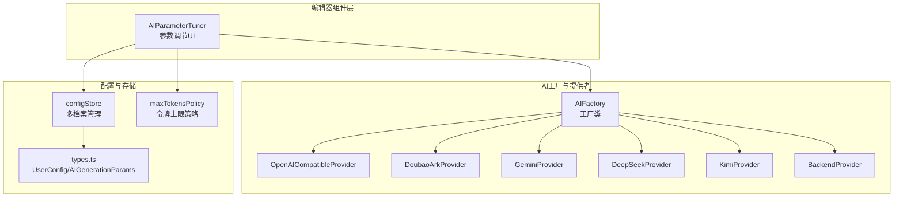
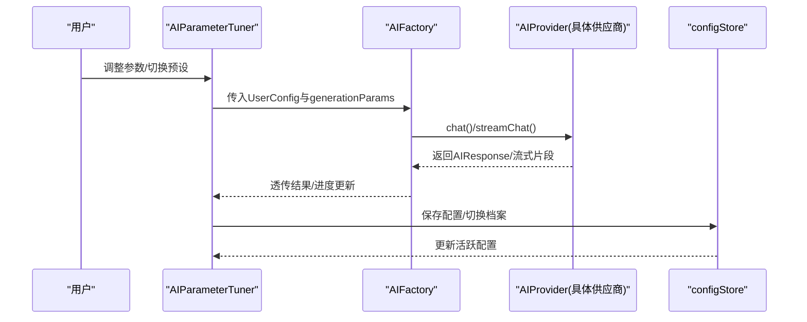
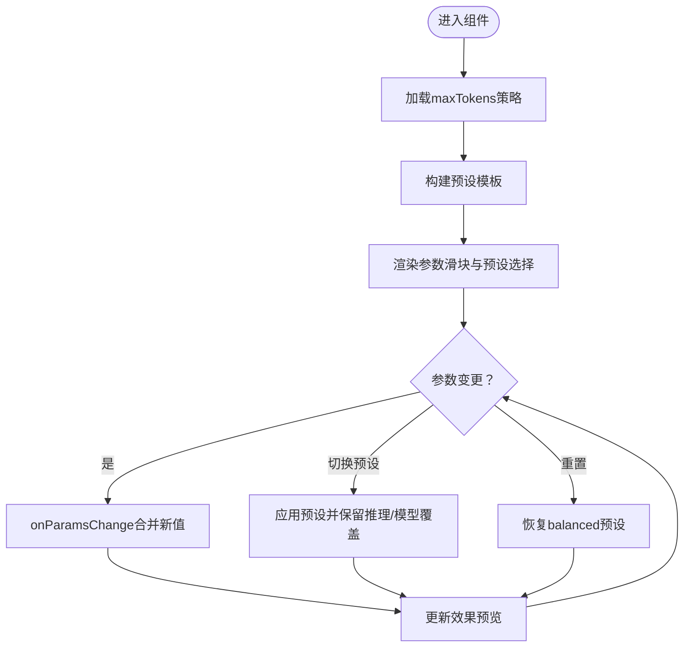
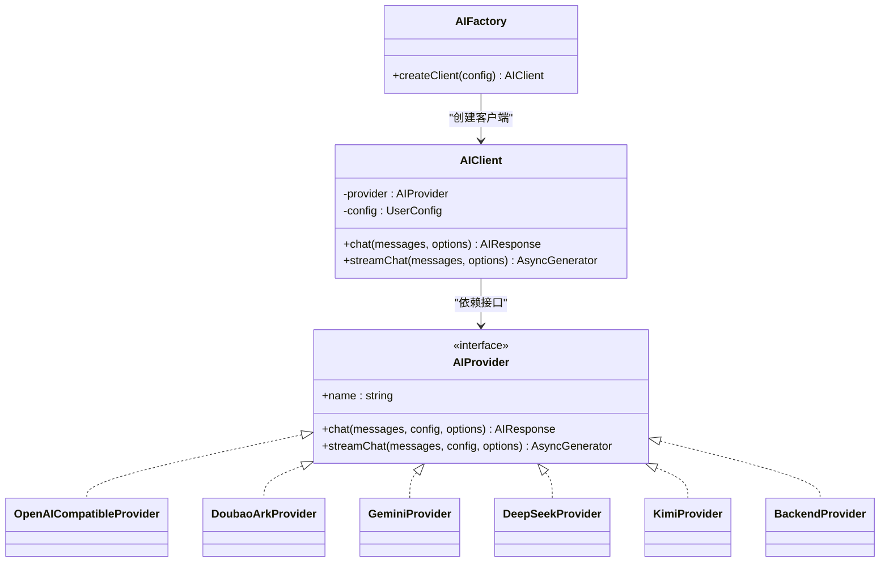
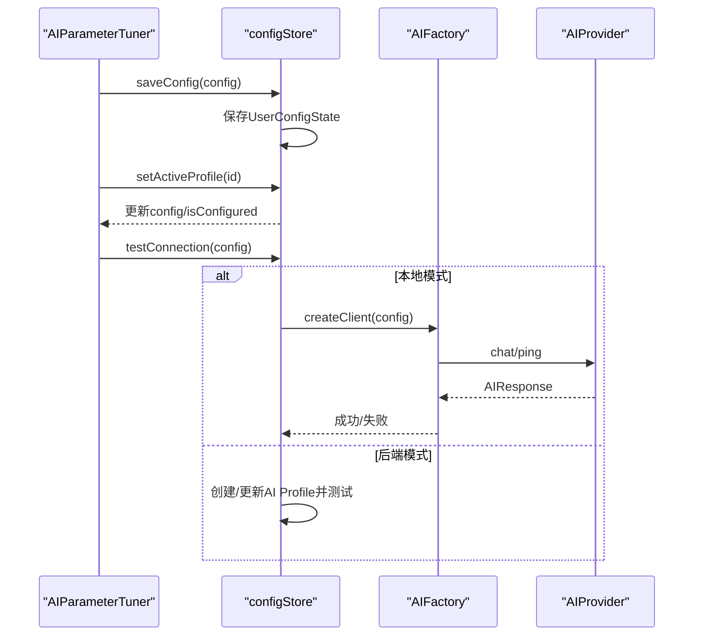
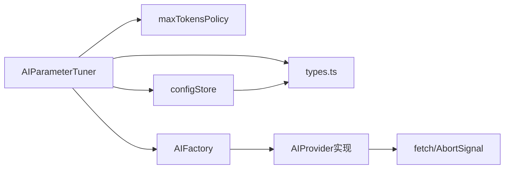

# AI参数调节器

<cite>
**本文档引用的文件**
- [AIParameterTuner.tsx](file://apps/web/src/components/editor/AIParameterTuner.tsx)
- [factory.ts](file://apps/web/src/lib/ai/factory.ts)
- [types.ts](file://apps/web/src/lib/ai/types.ts)
- [configStore.ts](file://apps/web/src/stores/configStore.ts)
- [maxTokensPolicy.ts](file://apps/web/src/lib/ai/maxTokensPolicy.ts)
- [index.ts](file://apps/web/src/types/index.ts)
- [openai.ts](file://apps/web/src/lib/ai/providers/openai.ts)
- [doubaoArk.ts](file://apps/web/src/lib/ai/providers/doubaoArk.ts)
- [gemini.ts](file://apps/web/src/lib/ai/providers/gemini.ts)
- [deepseek.ts](file://apps/web/src/lib/ai/providers/deepseek.ts)
- [kimi.ts](file://apps/web/src/lib/ai/providers/kimi.ts)
- [backend.ts](file://apps/web/src/lib/ai/providers/backend.ts)
</cite>

## 目录

1. [简介](#简介)
2. [项目结构](#项目结构)
3. [核心组件](#核心组件)
4. [架构总览](#架构总览)
5. [详细组件分析](#详细组件分析)
6. [依赖关系分析](#依赖关系分析)
7. [性能考量](#性能考量)
8. [故障排除指南](#故障排除指南)
9. [结论](#结论)

## 简介

本文件为AI参数调节器组件的深度技术文档，围绕AIParameterTuner组件展开，系统阐述其架构设计、实现原理与最佳实践。重点涵盖以下方面：

- 参数配置界面与交互流程
- AI服务提供商选择与工厂模式集成
- 模型参数调整与实时预览
- 参数验证机制与多供应商适配策略
- 预设模板与个性化参数的协同
- 配置持久化与多档案管理
- 性能优化与常见问题排查

## 项目结构

AI参数调节器位于Web前端应用中，采用组件化与工厂模式结合的设计，配合全局配置存储与多供应商提供者实现灵活的参数调节与调用。

**图表来源**

- [AIParameterTuner.tsx](file://apps/web/src/components/editor/AIParameterTuner.tsx#L42-L358)
- [factory.ts](file://apps/web/src/lib/ai/factory.ts#L13-L96)
- [configStore.ts](file://apps/web/src/stores/configStore.ts#L183-L523)
- [maxTokensPolicy.ts](file://apps/web/src/lib/ai/maxTokensPolicy.ts#L26-L57)
- [types.ts](file://apps/web/src/lib/ai/types.ts#L1-L30)

**章节来源**

- [AIParameterTuner.tsx](file://apps/web/src/components/editor/AIParameterTuner.tsx#L1-L457)
- [factory.ts](file://apps/web/src/lib/ai/factory.ts#L1-L98)
- [configStore.ts](file://apps/web/src/stores/configStore.ts#L1-L822)
- [maxTokensPolicy.ts](file://apps/web/src/lib/ai/maxTokensPolicy.ts#L1-L63)
- [types.ts](file://apps/web/src/lib/ai/types.ts#L1-L30)

## 核心组件

- AIParameterTuner：参数调节UI组件，提供预设选择、数值参数滑块、推理强度开关、效果预览与使用建议。
- AIFactory：AI工厂类，根据ProviderType创建具体提供者实例，并封装流式输出进度桥接。
- Provider系列：针对不同供应商的实现（OpenAI兼容、Doubao/ARK、Gemini、DeepSeek、Kimi、Backend）。
- configStore：多档案配置管理，支持加载、保存、切换、连接测试与持久化。
- maxTokensPolicy：令牌上限策略，基于供应商与模型动态计算UI范围与默认值。
- 类型系统：UserConfig、AIGenerationParams等，统一参数结构与约束。

**章节来源**

- [AIParameterTuner.tsx](file://apps/web/src/components/editor/AIParameterTuner.tsx#L30-L358)
- [factory.ts](file://apps/web/src/lib/ai/factory.ts#L13-L96)
- [configStore.ts](file://apps/web/src/stores/configStore.ts#L183-L523)
- [maxTokensPolicy.ts](file://apps/web/src/lib/ai/maxTokensPolicy.ts#L26-L57)
- [types.ts](file://apps/web/src/lib/ai/types.ts#L1-L30)

## 架构总览

AI参数调节器通过工厂模式与多供应商提供者实现“参数可调、供应商可切”的能力。UI层负责参数收集与预设应用，存储层负责配置持久化与多档案管理，提供者层负责实际调用与流式输出桥接。

**图表来源**

- [AIParameterTuner.tsx](file://apps/web/src/components/editor/AIParameterTuner.tsx#L90-L120)
- [factory.ts](file://apps/web/src/lib/ai/factory.ts#L43-L75)
- [configStore.ts](file://apps/web/src/stores/configStore.ts#L289-L331)

## 详细组件分析

### AIParameterTuner组件

- 功能要点
  - 预设模板：creative/balanced/conservative三档，自动计算maxTokens并保留非数值参数（如推理强度、图像/视频模型）。
  - 参数滑块：temperature、topP、maxTokens、presencePenalty、frequencyPenalty（除doubao-ark外均支持）。
  - 推理强度：仅对GPT-5/O系列模型开放，支持none/minimal/low/medium/high/xhigh，自动归一化与降级。
  - 实时效果预览：创意度、稳定性、多样性、长度倾向的百分比指示器。
  - 使用建议：针对场景锚点、动作描述、提示词生成给出推荐模式。
- 数据流
  - 输入：provider、model、params、onParamsChange回调。
  - 输出：通过回调更新上层状态，驱动后续AI调用。
- 供应商适配
  - 依据provider与model动态启用/隐藏推理强度与惩罚项。
  - maxTokens策略来自maxTokensPolicy，确保UI范围与供应商上限一致。

**图表来源**

- [AIParameterTuner.tsx](file://apps/web/src/components/editor/AIParameterTuner.tsx#L48-L120)
- [maxTokensPolicy.ts](file://apps/web/src/lib/ai/maxTokensPolicy.ts#L26-L57)

**章节来源**

- [AIParameterTuner.tsx](file://apps/web/src/components/editor/AIParameterTuner.tsx#L30-L358)
- [maxTokensPolicy.ts](file://apps/web/src/lib/ai/maxTokensPolicy.ts#L26-L57)

### AI工厂与提供者集成

- AIFactory.createClient
  - 后端模式：通过aiProfileId创建BackendProvider客户端，避免浏览器保存敏感密钥。
  - 本地模式：根据provider创建对应提供者实例，进行参数校验与调用。
- 流式输出桥接
  - AIClient.streamChat包装底层生成器，将chunk写入进度存储，便于开发者面板实时监控。
- 提供者差异
  - OpenAI兼容：优先Responses API（推理模型），自动回退chat/completions；支持推理强度归一化。
  - Doubao/ARK：Responses API专用，严格解析接入点ID或模型ID，不支持presence/frequency惩罚。
  - Gemini：使用generateContent/streamGenerateContent，消息格式转换。
  - DeepSeek/Kimi：标准chat/completions，Kimi对推理模型有特殊温度与maxTokens处理。

**图表来源**

- [factory.ts](file://apps/web/src/lib/ai/factory.ts#L13-L96)
- [openai.ts](file://apps/web/src/lib/ai/providers/openai.ts#L171-L384)
- [doubaoArk.ts](file://apps/web/src/lib/ai/providers/doubaoArk.ts#L103-L186)
- [gemini.ts](file://apps/web/src/lib/ai/providers/gemini.ts#L4-L172)
- [deepseek.ts](file://apps/web/src/lib/ai/providers/deepseek.ts#L4-L140)
- [kimi.ts](file://apps/web/src/lib/ai/providers/kimi.ts#L6-L164)
- [backend.ts](file://apps/web/src/lib/ai/providers/backend.ts#L5-L25)

**章节来源**

- [factory.ts](file://apps/web/src/lib/ai/factory.ts#L13-L96)
- [openai.ts](file://apps/web/src/lib/ai/providers/openai.ts#L171-L384)
- [doubaoArk.ts](file://apps/web/src/lib/ai/providers/doubaoArk.ts#L103-L186)
- [gemini.ts](file://apps/web/src/lib/ai/providers/gemini.ts#L4-L172)
- [deepseek.ts](file://apps/web/src/lib/ai/providers/deepseek.ts#L4-L140)
- [kimi.ts](file://apps/web/src/lib/ai/providers/kimi.ts#L6-L164)
- [backend.ts](file://apps/web/src/lib/ai/providers/backend.ts#L5-L25)

### 参数验证与策略

- 令牌上限策略
  - 基于供应商与模型动态计算min/max/step/recommendedDefault/hint，确保UI范围合理且与后端schema对齐。
  - 对DeepSeek Reasoner提供更大上限与步进，其它供应商提供更宽泛范围但以供应商返回为准。
- 推理强度归一化
  - OpenAI兼容提供者对不同模型族（GPT-5、O系列）的推理强度档位进行归一化与降级，避免不支持的档位导致调用失败。
- 惩罚参数屏蔽
  - Doubao/ARK Responses API不支持presence_penalty/frequency_penalty，系统自动忽略并提示。

**章节来源**

- [maxTokensPolicy.ts](file://apps/web/src/lib/ai/maxTokensPolicy.ts#L26-L63)
- [openai.ts](file://apps/web/src/lib/ai/providers/openai.ts#L59-L85)
- [AIParameterTuner.tsx](file://apps/web/src/components/editor/AIParameterTuner.tsx#L310-L315)

### 实时预览与效果指标

- 创意度：综合temperature、topP、presencePenalty。
- 稳定性：随temperature下降、frequencyPenalty上升而提升。
- 多样性：随topP与两类惩罚项提升而提高。
- 长度倾向：按maxTokens占上限比例计算百分比。

**章节来源**

- [AIParameterTuner.tsx](file://apps/web/src/components/editor/AIParameterTuner.tsx#L437-L456)

### 配置持久化与多档案管理

- 多档案
  - 支持创建、切换、更新、删除多个配置档案，每份档案包含provider、model、apiKey、generationParams等。
  - 后端模式下，浏览器不保存apiKey，仅保存aiProfileId并从服务端拉取配置。
- 连接测试
  - 本地模式：直接调用AIProvider进行ping测试，记录成功/失败与耗时。
  - 后端模式：通过服务端AI Profile接口创建/更新并测试，回写lastTest结果。
- 存储策略
  - 本地模式：localStorage加密存储UserConfigState。
  - 后端模式：服务端集中管理，前端仅维护活跃档案ID与内存状态。

**图表来源**

- [configStore.ts](file://apps/web/src/stores/configStore.ts#L289-L488)
- [factory.ts](file://apps/web/src/lib/ai/factory.ts#L77-L96)

**章节来源**

- [configStore.ts](file://apps/web/src/stores/configStore.ts#L183-L822)
- [factory.ts](file://apps/web/src/lib/ai/factory.ts#L77-L96)

## 依赖关系分析

- 组件耦合
  - AIParameterTuner依赖maxTokensPolicy与类型系统，通过回调与上层共享状态。
  - AIFactory与Provider实现解耦，新增供应商只需实现AIProvider接口并注册到工厂。
- 外部依赖
  - fetch API用于HTTP请求，AbortSignal用于取消请求。
  - 浏览器存储用于本地持久化，服务端API用于后端模式配置同步。

**图表来源**

- [AIParameterTuner.tsx](file://apps/web/src/components/editor/AIParameterTuner.tsx#L28-L49)
- [factory.ts](file://apps/web/src/lib/ai/factory.ts#L9-L11)
- [configStore.ts](file://apps/web/src/stores/configStore.ts#L8-L18)

**章节来源**

- [AIParameterTuner.tsx](file://apps/web/src/components/editor/AIParameterTuner.tsx#L11-L49)
- [factory.ts](file://apps/web/src/lib/ai/factory.ts#L1-L11)
- [configStore.ts](file://apps/web/src/stores/configStore.ts#L1-L18)

## 性能考量

- 流式输出与进度桥接
  - AIClient.streamChat在每次chunk到达时更新进度存储，避免阻塞UI渲染。
- 令牌上限与调用成本
  - 使用maxTokensPolicy限制UI范围，防止超大maxTokens导致高成本与超时。
- 推理强度降级
  - OpenAI兼容提供者对不支持的推理强度档位自动降级，提升成功率与稳定性。
- 供应商适配
  - Doubao/ARK Responses API不支持惩罚参数，避免无效参数导致的额外开销。

[本节为通用性能建议，无需特定文件引用]

## 故障排除指南

- API Key与模型为空
  - 检查配置是否完整，后端模式下aiProfileId必填；本地模式apiKey与model必填。
- Base URL不正确
  - OpenAI兼容不要包含/v1或/v1beta；Gemini默认Base URL为Google API；Doubao/ARK默认Base URL为火山API。
- 鉴权失败（401/403）
  - 确认使用供应商提供的API Key，不要添加Bearer前缀；Doubao/ARK需使用方舟控制台生成的Key。
- 限流/配额（429）
  - 降低并发、更换模型或提升配额。
- 服务端异常（5xx）
  - 稍后重试或切换节点/Base URL。
- 推理强度不支持
  - OpenAI兼容提供者会自动降级；若仍失败，改为默认或关闭推理强度。

**章节来源**

- [configStore.ts](file://apps/web/src/stores/configStore.ts#L72-L181)
- [openai.ts](file://apps/web/src/lib/ai/providers/openai.ts#L139-L169)
- [doubaoArk.ts](file://apps/web/src/lib/ai/providers/doubaoArk.ts#L119-L130)

## 结论

AI参数调节器通过清晰的UI设计、工厂模式与多供应商适配，实现了参数可调、供应商可切、效果可预览与配置可持久化的完整闭环。配合严格的参数验证与策略化令牌上限，既保障了易用性，又兼顾了成本与稳定性。建议在生产环境中结合连接测试与多档案管理，持续优化参数组合并监控调用成本与质量。
