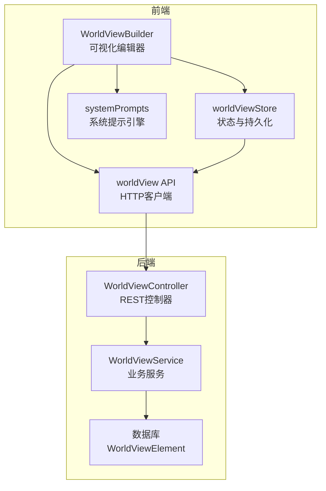
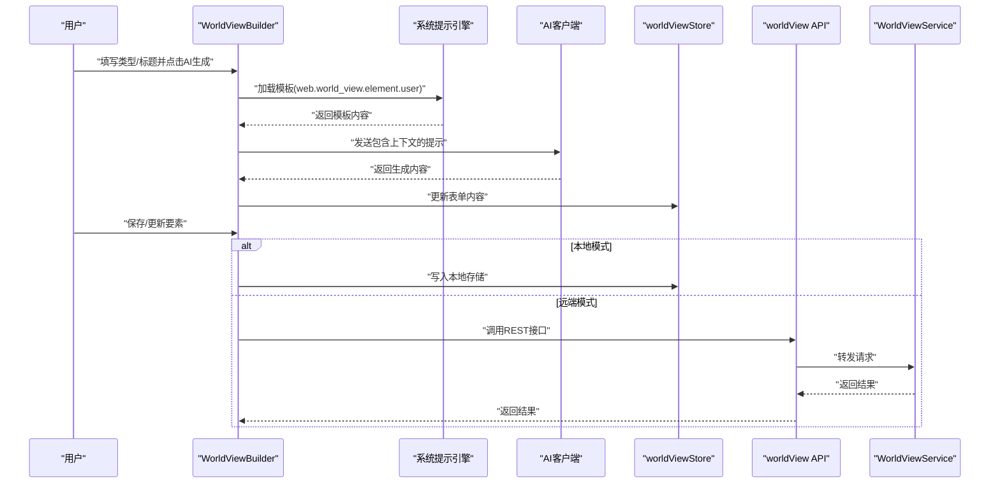
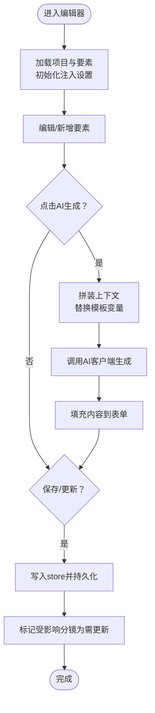
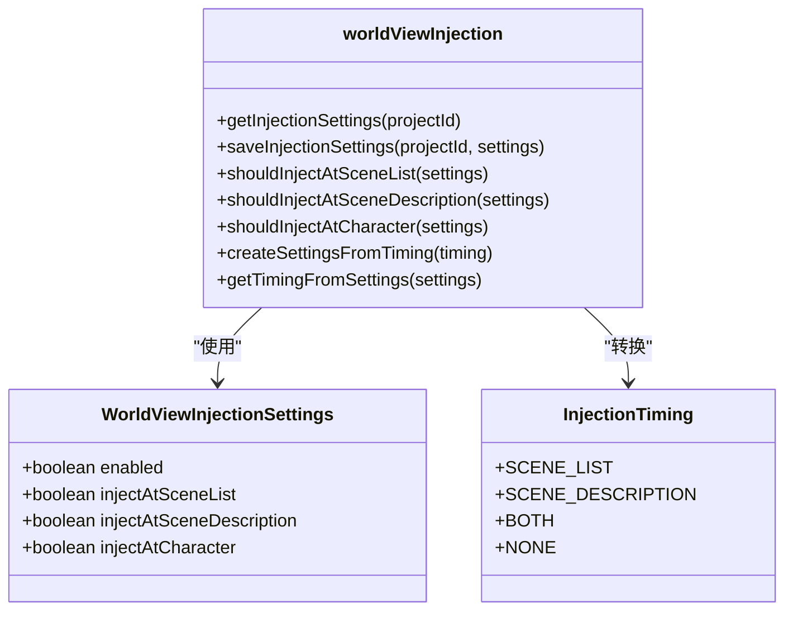
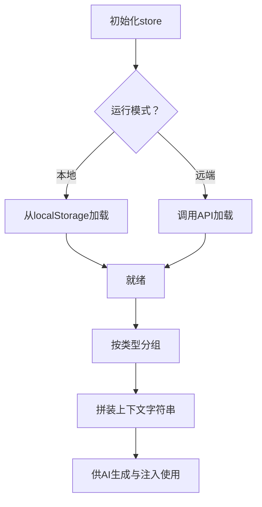
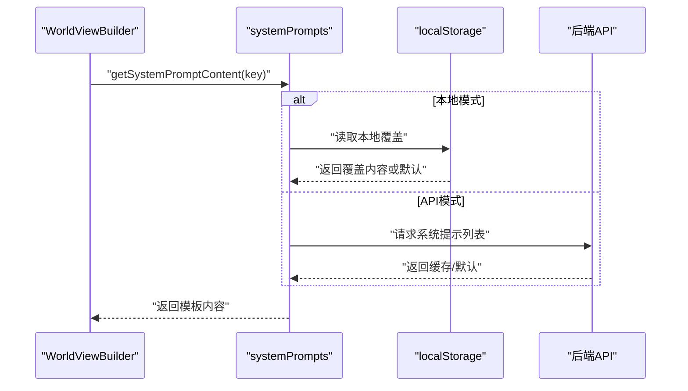
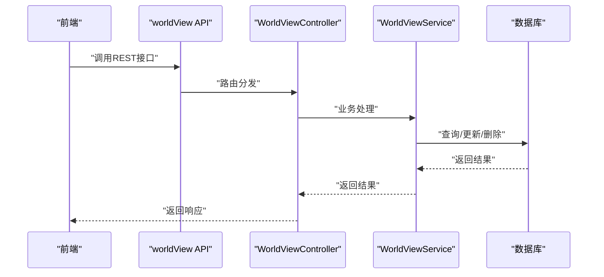
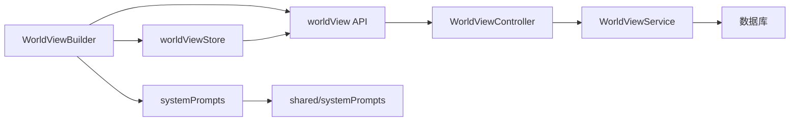

# 世界观构建器

<cite>
**本文档引用的文件**
- [WorldViewBuilder.tsx](file://apps/web/src/components/editor/WorldViewBuilder.tsx)
- [worldViewInjection.ts](file://apps/web/src/lib/ai/worldViewInjection.ts)
- [worldViewStore.ts](file://apps/web/src/stores/worldViewStore.ts)
- [world-view.service.ts](file://apps/api/src/world-view/world-view.service.ts)
- [world-view.controller.ts](file://apps/api/src/world-view/world-view.controller.ts)
- [world-view.module.ts](file://apps/api/src/world-view/world-view.module.ts)
- [index.ts](file://apps/web/src/lib/systemPrompts/index.ts)
- [systemPrompts.ts](file://packages/shared/src/systemPrompts.ts)
- [worldView.ts](file://packages/shared/src/schemas/worldView.ts)
- [types/index.ts](file://apps/web/src/types/index.ts)
- [worldView.ts](file://apps/web/src/lib/api/worldView.ts)
</cite>

## 目录

1. [简介](#简介)
2. [项目结构](#项目结构)
3. [核心组件](#核心组件)
4. [架构总览](#架构总览)
5. [详细组件分析](#详细组件分析)
6. [依赖关系分析](#依赖关系分析)
7. [性能考量](#性能考量)
8. [故障排查指南](#故障排查指南)
9. [结论](#结论)
10. [附录](#附录)

## 简介

本文件面向“世界观构建器”组件，系统性阐述其构建机制、与系统提示引擎的集成方式、上下文注入策略、动态内容生成流程、以及可视化编辑与实时预览能力。文档同时提供最佳实践与内容质量保障方案，帮助创作者高效构建一致、可扩展且可复用的世界观。

## 项目结构

- 前端编辑器：WorldViewBuilder 负责要素的可视化编辑、AI生成、注入设置与实时预览。
- 状态管理：Zustand store 提供本地/远端双模式下的要素持久化与上下文拼装。
- 系统提示：通过系统提示引擎加载模板，结合项目上下文与现有要素动态生成内容。
- 后端服务：提供 REST API，支撑要素的增删改查与排序，确保团队协作与数据一致性。

图表来源

- [WorldViewBuilder.tsx](file://apps/web/src/components/editor/WorldViewBuilder.tsx#L1-L584)
- [worldViewStore.ts](file://apps/web/src/stores/worldViewStore.ts#L1-L211)
- [index.ts](file://apps/web/src/lib/systemPrompts/index.ts#L1-L197)
- [worldView.ts](file://apps/web/src/lib/api/worldView.ts#L1-L60)
- [world-view.controller.ts](file://apps/api/src/world-view/world-view.controller.ts#L1-L58)
- [world-view.service.ts](file://apps/api/src/world-view/world-view.service.ts#L1-L129)

章节来源

- [WorldViewBuilder.tsx](file://apps/web/src/components/editor/WorldViewBuilder.tsx#L1-L584)
- [worldViewStore.ts](file://apps/web/src/stores/worldViewStore.ts#L1-L211)
- [worldView.ts](file://apps/web/src/lib/api/worldView.ts#L1-L60)
- [world-view.controller.ts](file://apps/api/src/world-view/world-view.controller.ts#L1-L58)
- [world-view.service.ts](file://apps/api/src/world-view/world-view.service.ts#L1-L129)

## 核心组件

- 可视化编辑器（WorldViewBuilder）
  - 要素列表展示与卡片式预览
  - 新增/编辑/删除/拖拽排序
  - AI生成内容（基于系统提示模板）
  - 注入设置面板（分镜列表/场景锚点/角色设定）
- 状态与持久化（worldViewStore）
  - 本地/远端双模式切换
  - 按类型分组与上下文拼装
  - 世界注入上下文生成
- 系统提示引擎（systemPrompts）
  - 模板加载与本地覆盖
  - API/本地模式切换
- 后端服务（WorldViewService/WorldViewController）
  - REST API：列表、创建、更新、删除、重排
  - 数据校验与事务性重排

章节来源

- [WorldViewBuilder.tsx](file://apps/web/src/components/editor/WorldViewBuilder.tsx#L40-L584)
- [worldViewStore.ts](file://apps/web/src/stores/worldViewStore.ts#L25-L211)
- [index.ts](file://apps/web/src/lib/systemPrompts/index.ts#L109-L197)
- [world-view.controller.ts](file://apps/api/src/world-view/world-view.controller.ts#L14-L58)
- [world-view.service.ts](file://apps/api/src/world-view/world-view.service.ts#L24-L129)

## 架构总览

WorldViewBuilder 通过系统提示模板与项目上下文（如画风、主角、概要）驱动 AI 生成内容；生成结果经编辑器确认后，写入 store 并持久化至本地或后端。注入设置决定何时将这些要素注入到后续工作流（分镜列表、场景锚点、角色设定）的提示词中，实现“自上而下”的一致性控制。

图表来源

- [WorldViewBuilder.tsx](file://apps/web/src/components/editor/WorldViewBuilder.tsx#L127-L177)
- [index.ts](file://apps/web/src/lib/systemPrompts/index.ts#L109-L124)
- [worldView.ts](file://apps/web/src/lib/api/worldView.ts#L13-L45)
- [world-view.service.ts](file://apps/api/src/world-view/world-view.service.ts#L44-L78)

## 详细组件分析

### 组件A：WorldViewBuilder（可视化编辑与AI生成）

- 功能职责
  - 要素管理：列表展示、卡片预览、新增/编辑/删除
  - AI生成：基于系统提示模板与项目上下文生成内容
  - 注入设置：控制在哪些阶段注入世界观要素
  - 实时预览：当前选中要素的详情展示
- 关键流程
  - 加载：根据项目ID加载要素与分镜，初始化注入设置
  - 生成：拼装现有要素上下文，替换模板变量，调用AI客户端
  - 保存：区分新增与更新，写入store并持久化
  - 注入：根据设置在相应阶段注入上下文
- 交互与状态
  - 使用项目store、世界视图store、分镜store、配置store
  - 注入设置本地持久化，支持开关与阶段选择

图表来源

- [WorldViewBuilder.tsx](file://apps/web/src/components/editor/WorldViewBuilder.tsx#L73-L232)

章节来源

- [WorldViewBuilder.tsx](file://apps/web/src/components/editor/WorldViewBuilder.tsx#L40-L584)

### 组件B：世界视图注入设置（worldViewInjection）

- 设计目标
  - 定义注入时机与开关
  - 提供默认设置与持久化
  - 支持从注入时机枚举推断设置
- 关键点
  - 四个注入开关：总开关、分镜列表、场景锚点、角色设定
  - 默认启用三项注入，确保生成一致性
  - 本地存储键名前缀隔离项目

图表来源

- [worldViewInjection.ts](file://apps/web/src/lib/ai/worldViewInjection.ts#L14-L191)

章节来源

- [worldViewInjection.ts](file://apps/web/src/lib/ai/worldViewInjection.ts#L1-L192)

### 组件C：世界视图状态与上下文（worldViewStore）

- 职责
  - 管理要素列表、当前选中项、加载状态
  - 提供按类型分组与上下文拼装方法
  - 支持本地/远端双模式持久化
- 上下文拼装
  - 按类型分组：时代、地理、社会、科技、魔法、自定义
  - 格式化为“## 类型\n内容列表”的结构化上下文
  - 供系统提示模板与注入逻辑使用

图表来源

- [worldViewStore.ts](file://apps/web/src/stores/worldViewStore.ts#L50-L202)

章节来源

- [worldViewStore.ts](file://apps/web/src/stores/worldViewStore.ts#L1-L211)

### 组件D：系统提示引擎（systemPrompts）

- 职责
  - 模板加载：本地/远端模式切换
  - 本地覆盖：支持用户覆盖默认模板
  - 缓存：API模式下缓存提示词
- 与WorldViewBuilder的集成
  - 加载模板键：web.world_view.element.user
  - 替换变量：类型标签、标题、项目概要、主角、画风、已有上下文

图表来源

- [index.ts](file://apps/web/src/lib/systemPrompts/index.ts#L109-L197)
- [systemPrompts.ts](file://packages/shared/src/systemPrompts.ts#L1-L800)

章节来源

- [index.ts](file://apps/web/src/lib/systemPrompts/index.ts#L1-L197)
- [systemPrompts.ts](file://packages/shared/src/systemPrompts.ts#L1-L800)

### 组件E：后端服务（WorldViewService/WorldViewController）

- 职责
  - 列表、创建、更新、删除、重排
  - 数据校验与事务性重排（避免唯一约束冲突）
- API契约
  - GET /projects/:projectId/world-view
  - POST /projects/:projectId/world-view
  - PATCH /projects/:projectId/world-view/:elementId
  - DELETE /projects/:projectId/world-view/:elementId
  - POST /projects/:projectId/world-view/reorder

图表来源

- [world-view.controller.ts](file://apps/api/src/world-view/world-view.controller.ts#L14-L58)
- [world-view.service.ts](file://apps/api/src/world-view/world-view.service.ts#L24-L129)

章节来源

- [world-view.controller.ts](file://apps/api/src/world-view/world-view.controller.ts#L1-L58)
- [world-view.service.ts](file://apps/api/src/world-view/world-view.service.ts#L1-L129)

## 依赖关系分析

- 组件耦合
  - WorldViewBuilder 依赖 store、系统提示引擎、AI工厂、确认对话框
  - worldViewStore 依赖 API 客户端与运行模式判定
  - 注入设置模块独立，被编辑器与后续工作流共享
- 外部依赖
  - 系统提示模板来自共享包与后端API
  - 数据持久化支持本地存储与后端数据库

图表来源

- [WorldViewBuilder.tsx](file://apps/web/src/components/editor/WorldViewBuilder.tsx#L1-L584)
- [worldViewStore.ts](file://apps/web/src/stores/worldViewStore.ts#L1-L211)
- [index.ts](file://apps/web/src/lib/systemPrompts/index.ts#L1-L197)
- [worldView.ts](file://apps/web/src/lib/api/worldView.ts#L1-L60)
- [world-view.controller.ts](file://apps/api/src/world-view/world-view.controller.ts#L1-L58)
- [world-view.service.ts](file://apps/api/src/world-view/world-view.service.ts#L1-L129)

章节来源

- [WorldViewBuilder.tsx](file://apps/web/src/components/editor/WorldViewBuilder.tsx#L1-L584)
- [worldViewStore.ts](file://apps/web/src/stores/worldViewStore.ts#L1-L211)
- [index.ts](file://apps/web/src/lib/systemPrompts/index.ts#L1-L197)
- [worldView.ts](file://apps/web/src/lib/api/worldView.ts#L1-L60)
- [world-view.controller.ts](file://apps/api/src/world-view/world-view.controller.ts#L1-L58)
- [world-view.service.ts](file://apps/api/src/world-view/world-view.service.ts#L1-L129)

## 性能考量

- 本地模式
  - 优先使用本地存储，减少网络往返
  - store 内部批量更新，避免频繁渲染
- 远端模式
  - API 请求合并与缓存（系统提示引擎已内置缓存）
  - 重排采用两阶段更新，避免唯一约束冲突
- 注入上下文
  - 仅在必要阶段注入，避免过度拼装造成内存压力
  - 上下文字符串按类型分组，便于裁剪与增量更新

## 故障排查指南

- 生成失败
  - 检查配置store中的AI提供商与密钥
  - 确认系统提示模板加载成功
- 注入无效
  - 校验注入设置开关与阶段选择
  - 确认项目上下文已正确拼装
- 数据不一致
  - 修改要素后，确认受影响分镜已标记为“需更新”
  - 检查后端重排是否成功（事务性更新）

章节来源

- [WorldViewBuilder.tsx](file://apps/web/src/components/editor/WorldViewBuilder.tsx#L127-L177)
- [worldViewStore.ts](file://apps/web/src/stores/worldViewStore.ts#L174-L201)
- [worldView.ts](file://apps/web/src/lib/api/worldView.ts#L54-L59)
- [world-view.service.ts](file://apps/api/src/world-view/world-view.service.ts#L105-L125)

## 结论

WorldViewBuilder 通过“可视化编辑 + AI生成 + 注入控制”的闭环，实现了从概念到落地的一致性与效率。配合系统提示引擎与后端服务，既能满足个人创作，也能支撑团队协作。建议在实际使用中遵循最佳实践，持续优化上下文质量，确保生成内容的连贯性与可维护性。

## 附录

### 最佳实践与内容质量保障

- 完整性
  - 覆盖时代、地理、社会、科技、魔法、自定义六大维度
  - 避免相互矛盾的设定，保持内在逻辑自洽
- 一致性
  - 以“上下文拼装”为基准，统一术语与风格
  - 在分镜生成、场景锚点、角色设定等关键阶段启用注入
- 可视化
  - 描述具体、可转化为画面的细节
  - 与画风配置协同，确保风格统一
- 可追溯
  - 保留修改历史，必要时回滚
  - 对已生成内容进行“需更新”标记，便于批量重生成

### 数据模型与类型

- 世界视图要素类型
  - 支持类型：era、geography、society、technology、magic、custom
  - 字段：id、type、title、content、order、createdAt、updatedAt
- 项目上下文
  - 包含画风、主角、概要等，用于系统提示模板替换

章节来源

- [worldView.ts](file://packages/shared/src/schemas/worldView.ts#L1-L26)
- [types/index.ts](file://apps/web/src/types/index.ts#L453-L468)
