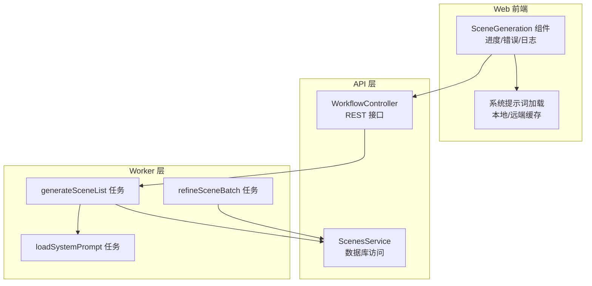
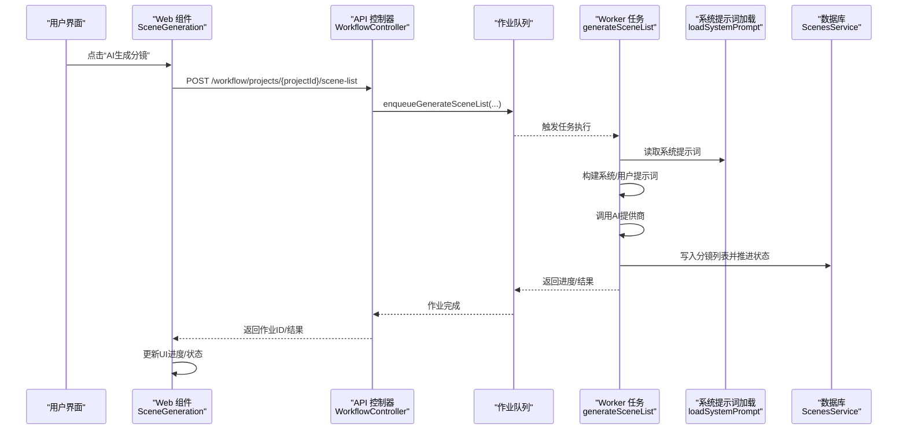
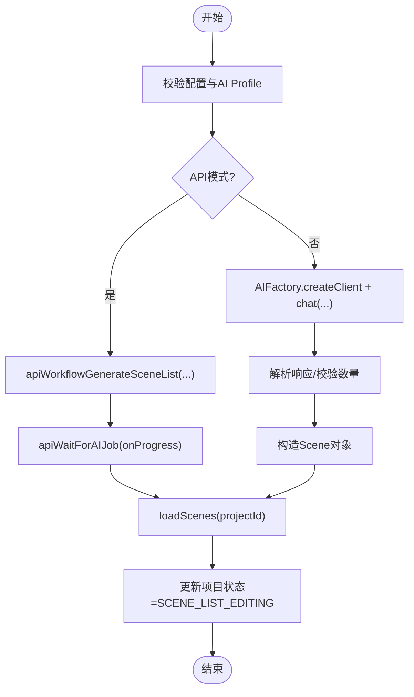
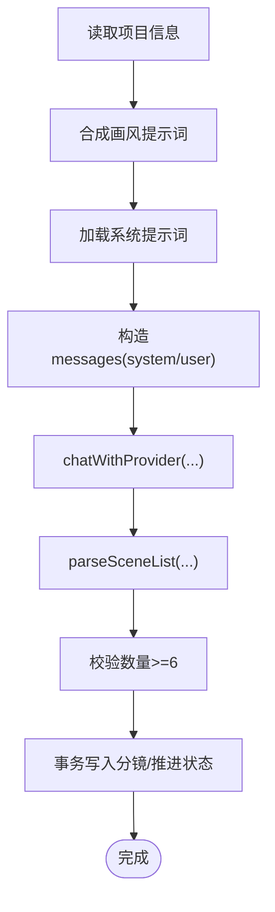
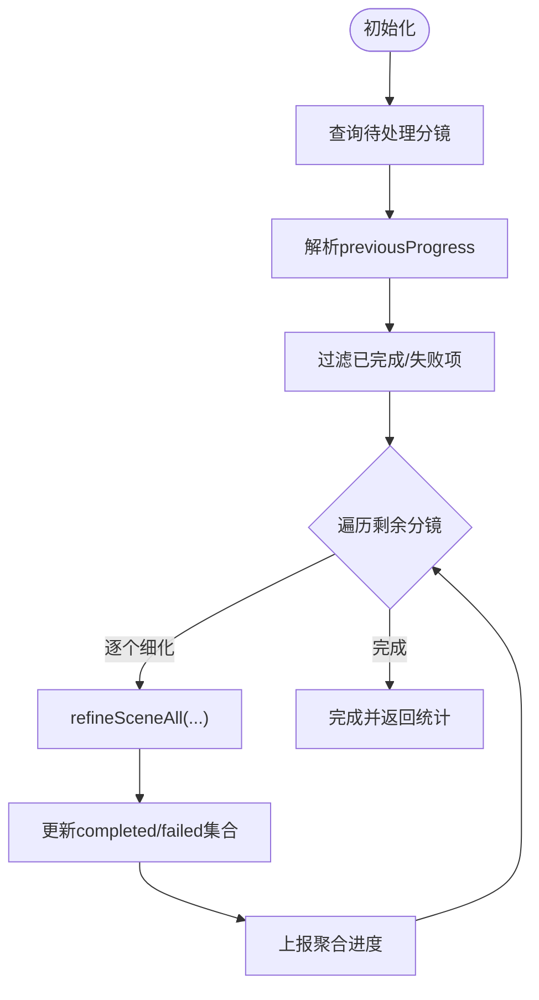
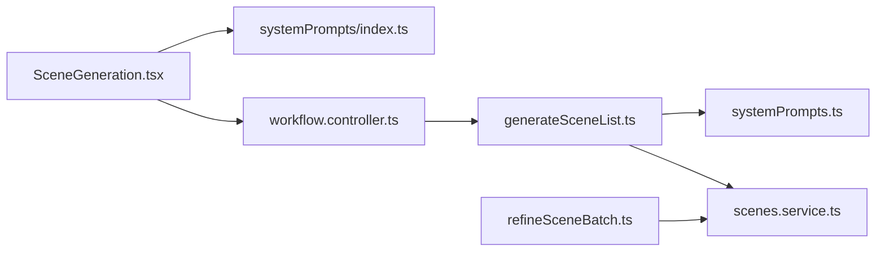

# 场景生成器

<cite>
**本文档引用的文件**
- [apps/web/src/components/editor/SceneGeneration.tsx](file://apps/web/src/components/editor/SceneGeneration.tsx)
- [apps/worker/src/tasks/generateSceneList.ts](file://apps/worker/src/tasks/generateSceneList.ts)
- [apps/worker/src/tasks/refineSceneBatch.ts](file://apps/worker/src/tasks/refineSceneBatch.ts)
- [apps/api/src/jobs/workflow.controller.ts](file://apps/api/src/jobs/workflow.controller.ts)
- [apps/api/src/scenes/scenes.service.ts](file://apps/api/src/scenes/scenes.service.ts)
- [apps/web/src/lib/systemPrompts/index.ts](file://apps/web/src/lib/systemPrompts/index.ts)
- [apps/worker/src/tasks/systemPrompts.ts](file://apps/worker/src/tasks/systemPrompts.ts)
- [packages/shared/src/schemas/scene.ts](file://packages/shared/src/schemas/scene.ts)
- [apps/web/src/types/index.ts](file://apps/web/src/types/index.ts)
</cite>

## 目录

1. [简介](#简介)
2. [项目结构](#项目结构)
3. [核心组件](#核心组件)
4. [架构总览](#架构总览)
5. [详细组件分析](#详细组件分析)
6. [依赖关系分析](#依赖关系分析)
7. [性能考量](#性能考量)
8. [故障排查指南](#故障排查指南)
9. [结论](#结论)
10. [附录](#附录)

## 简介

本文件面向“场景生成器”组件，系统性阐述其工作原理、与工作流引擎的集成方式、批量场景生成与智能优化策略、质量控制与参数调节、结果预览与用户体验设计，并提供性能优化与最佳实践建议。场景生成器负责将项目级的剧情概要转化为结构化的分镜列表，并支持后续的细化与批量处理。

## 项目结构

场景生成器涉及三层协作：

- Web 前端：负责用户交互、进度展示、系统提示词加载与日志记录。
- API 层：暴露工作流接口，接收前端请求并入队到作业系统。
- Worker 层：执行实际的 AI 提示词构建与内容生成，持久化结果并推进工作流状态。

图表来源

- [apps/web/src/components/editor/SceneGeneration.tsx](file://apps/web/src/components/editor/SceneGeneration.tsx#L112-L318)
- [apps/api/src/jobs/workflow.controller.ts](file://apps/api/src/jobs/workflow.controller.ts#L107-L115)
- [apps/worker/src/tasks/generateSceneList.ts](file://apps/worker/src/tasks/generateSceneList.ts#L19-L127)
- [apps/worker/src/tasks/systemPrompts.ts](file://apps/worker/src/tasks/systemPrompts.ts#L4-L26)
- [apps/api/src/scenes/scenes.service.ts](file://apps/api/src/scenes/scenes.service.ts#L69-L76)

章节来源

- [apps/web/src/components/editor/SceneGeneration.tsx](file://apps/web/src/components/editor/SceneGeneration.tsx#L1-L587)
- [apps/api/src/jobs/workflow.controller.ts](file://apps/api/src/jobs/workflow.controller.ts#L1-L266)
- [apps/worker/src/tasks/generateSceneList.ts](file://apps/worker/src/tasks/generateSceneList.ts#L1-L129)
- [apps/worker/src/tasks/refineSceneBatch.ts](file://apps/worker/src/tasks/refineSceneBatch.ts#L1-L182)
- [apps/api/src/scenes/scenes.service.ts](file://apps/api/src/scenes/scenes.service.ts#L1-L365)
- [apps/web/src/lib/systemPrompts/index.ts](file://apps/web/src/lib/systemPrompts/index.ts#L1-L197)
- [apps/worker/src/tasks/systemPrompts.ts](file://apps/worker/src/tasks/systemPrompts.ts#L1-L27)
- [packages/shared/src/schemas/scene.ts](file://packages/shared/src/schemas/scene.ts#L1-L56)
- [apps/web/src/types/index.ts](file://apps/web/src/types/index.ts#L586-L618)

## 核心组件

- 场景生成 UI 组件：负责触发生成、显示进度、错误提示、日志记录与项目状态推进。
- 工作流控制器：提供 REST 接口，将前端请求转换为后台作业并入队。
- 场景服务：封装数据库访问与事务，确保分镜写入与工作流状态一致性。
- 生成任务：构建系统提示词与用户提示词，调用 AI 提供商，解析输出并写入数据库。
- 批量细化任务：按序处理多个分镜，支持断点续跑、失败记录与整体进度聚合。
- 系统提示词加载：在 API 模式与本地模式下分别从远端缓存或本地存储读取。

章节来源

- [apps/web/src/components/editor/SceneGeneration.tsx](file://apps/web/src/components/editor/SceneGeneration.tsx#L112-L318)
- [apps/api/src/jobs/workflow.controller.ts](file://apps/api/src/jobs/workflow.controller.ts#L107-L115)
- [apps/api/src/scenes/scenes.service.ts](file://apps/api/src/scenes/scenes.service.ts#L69-L76)
- [apps/worker/src/tasks/generateSceneList.ts](file://apps/worker/src/tasks/generateSceneList.ts#L19-L127)
- [apps/worker/src/tasks/refineSceneBatch.ts](file://apps/worker/src/tasks/refineSceneBatch.ts#L41-L182)
- [apps/web/src/lib/systemPrompts/index.ts](file://apps/web/src/lib/systemPrompts/index.ts#L109-L124)
- [apps/worker/src/tasks/systemPrompts.ts](file://apps/worker/src/tasks/systemPrompts.ts#L4-L26)

## 架构总览

场景生成器遵循“前端触发 → API 入队 → Worker 执行 → 数据库写入”的流水线式架构。系统提示词在运行时动态加载，确保可定制与可维护。

图表来源

- [apps/web/src/components/editor/SceneGeneration.tsx](file://apps/web/src/components/editor/SceneGeneration.tsx#L112-L205)
- [apps/api/src/jobs/workflow.controller.ts](file://apps/api/src/jobs/workflow.controller.ts#L107-L115)
- [apps/worker/src/tasks/generateSceneList.ts](file://apps/worker/src/tasks/generateSceneList.ts#L67-L120)
- [apps/worker/src/tasks/systemPrompts.ts](file://apps/worker/src/tasks/systemPrompts.ts#L4-L26)
- [apps/api/src/scenes/scenes.service.ts](file://apps/api/src/scenes/scenes.service.ts#L69-L76)

## 详细组件分析

### 场景生成 UI 流程

- 触发生成：校验配置与 AI Profile，记录 AI 调用日志，调用工作流接口或本地客户端。
- 进度与错误：监听作业进度，更新 UI 百分比与消息；异常时记录错误日志并提示。
- 结果回写：拉取最新分镜列表，推进项目工作流状态至“分镜列表编辑”。

图表来源

- [apps/web/src/components/editor/SceneGeneration.tsx](file://apps/web/src/components/editor/SceneGeneration.tsx#L112-L318)

章节来源

- [apps/web/src/components/editor/SceneGeneration.tsx](file://apps/web/src/components/editor/SceneGeneration.tsx#L112-L318)

### 工作流控制器与作业入队

- 提供统一 REST 接口，将“生成分镜列表”请求转换为后台作业并入队。
- 参数校验：确保 aiProfileId 存在，必要时携带 sceneCountHint 等提示参数。

章节来源

- [apps/api/src/jobs/workflow.controller.ts](file://apps/api/src/jobs/workflow.controller.ts#L107-L115)

### 生成任务：提示词构建与内容生成

- 项目与画风：读取项目信息，合成完整画风提示词（支持旧版迁移）。
- 系统提示词：在 API 模式下从数据库读取定制内容，否则使用默认模板。
- AI 调用：构造 system/user 提示词，调用提供商，解析输出为分镜列表。
- 写入与状态：事务内删除旧分镜、写入新分镜、推进项目与剧集工作流状态。

图表来源

- [apps/worker/src/tasks/generateSceneList.ts](file://apps/worker/src/tasks/generateSceneList.ts#L19-L127)
- [apps/web/src/lib/systemPrompts/index.ts](file://apps/web/src/lib/systemPrompts/index.ts#L109-L124)
- [apps/worker/src/tasks/systemPrompts.ts](file://apps/worker/src/tasks/systemPrompts.ts#L4-L26)
- [apps/web/src/types/index.ts](file://apps/web/src/types/index.ts#L204-L223)

章节来源

- [apps/worker/src/tasks/generateSceneList.ts](file://apps/worker/src/tasks/generateSceneList.ts#L19-L127)
- [apps/web/src/lib/systemPrompts/index.ts](file://apps/web/src/lib/systemPrompts/index.ts#L109-L124)
- [apps/worker/src/tasks/systemPrompts.ts](file://apps/worker/src/tasks/systemPrompts.ts#L4-L26)
- [apps/web/src/types/index.ts](file://apps/web/src/types/index.ts#L204-L223)

### 批量细化任务：断点续跑与智能优化

- 断点续跑：解析上次进度，跳过已完成/失败项，按序细化剩余分镜。
- 进度聚合：将每个分镜的细化进度映射为整体百分比，上报 completed/failed 细节。
- 容错与可观测：记录失败场景与错误详情，支持重试与人工干预。

图表来源

- [apps/worker/src/tasks/refineSceneBatch.ts](file://apps/worker/src/tasks/refineSceneBatch.ts#L41-L182)

章节来源

- [apps/worker/src/tasks/refineSceneBatch.ts](file://apps/worker/src/tasks/refineSceneBatch.ts#L41-L182)

### 数据模型与类型约束

- 分镜实体：包含摘要、场景锚点、关键帧提示词、运动提示词、生成产物、状态与备注等字段。
- 画风配置：支持预设与自定义，提供完整英文提示词，兼容旧版 style 字段迁移。
- 工作流状态：涵盖从数据收集到分镜处理的全生命周期状态。

章节来源

- [packages/shared/src/schemas/scene.ts](file://packages/shared/src/schemas/scene.ts#L26-L51)
- [apps/web/src/types/index.ts](file://apps/web/src/types/index.ts#L586-L618)
- [apps/web/src/types/index.ts](file://apps/web/src/types/index.ts#L13-L26)
- [apps/web/src/types/index.ts](file://apps/web/src/types/index.ts#L204-L223)

### 与工作流引擎的集成

- 前端通过工作流接口提交生成请求，API 层将其转换为后台作业。
- Worker 任务完成后推进项目/剧集工作流状态，驱动后续步骤（如细化、分镜处理）。
- 数据层通过事务保证分镜写入与状态变更的一致性。

章节来源

- [apps/api/src/jobs/workflow.controller.ts](file://apps/api/src/jobs/workflow.controller.ts#L107-L115)
- [apps/worker/src/tasks/generateSceneList.ts](file://apps/worker/src/tasks/generateSceneList.ts#L102-L118)
- [apps/api/src/scenes/scenes.service.ts](file://apps/api/src/scenes/scenes.service.ts#L69-L76)

## 依赖关系分析

- UI 依赖系统提示词加载模块，以决定使用默认模板还是定制内容。
- 生成任务依赖系统提示词加载与数据库访问，确保提示词与数据一致。
- 批量细化任务依赖数据库访问与细化子任务，实现有序与可控的批量处理。

图表来源

- [apps/web/src/components/editor/SceneGeneration.tsx](file://apps/web/src/components/editor/SceneGeneration.tsx#L20-L35)
- [apps/web/src/lib/systemPrompts/index.ts](file://apps/web/src/lib/systemPrompts/index.ts#L109-L124)
- [apps/api/src/jobs/workflow.controller.ts](file://apps/api/src/jobs/workflow.controller.ts#L107-L115)
- [apps/worker/src/tasks/generateSceneList.ts](file://apps/worker/src/tasks/generateSceneList.ts#L67-L93)
- [apps/worker/src/tasks/systemPrompts.ts](file://apps/worker/src/tasks/systemPrompts.ts#L4-L26)
- [apps/api/src/scenes/scenes.service.ts](file://apps/api/src/scenes/scenes.service.ts#L69-L76)
- [apps/worker/src/tasks/refineSceneBatch.ts](file://apps/worker/src/tasks/refineSceneBatch.ts#L41-L82)

章节来源

- [apps/web/src/components/editor/SceneGeneration.tsx](file://apps/web/src/components/editor/SceneGeneration.tsx#L20-L35)
- [apps/web/src/lib/systemPrompts/index.ts](file://apps/web/src/lib/systemPrompts/index.ts#L109-L124)
- [apps/api/src/jobs/workflow.controller.ts](file://apps/api/src/jobs/workflow.controller.ts#L107-L115)
- [apps/worker/src/tasks/generateSceneList.ts](file://apps/worker/src/tasks/generateSceneList.ts#L67-L93)
- [apps/worker/src/tasks/systemPrompts.ts](file://apps/worker/src/tasks/systemPrompts.ts#L4-L26)
- [apps/api/src/scenes/scenes.service.ts](file://apps/api/src/scenes/scenes.service.ts#L69-L76)
- [apps/worker/src/tasks/refineSceneBatch.ts](file://apps/worker/src/tasks/refineSceneBatch.ts#L41-L82)

## 性能考量

- 提示词缓存：系统提示词在 API 模式下采用内存缓存与懒加载，减少重复读取。
- 本地存储：前端可缓存系统提示词覆盖内容，降低网络依赖。
- 事务写入：生成任务使用数据库事务，避免中间态污染，提升一致性与回滚效率。
- 断点续跑：批量细化支持断点续跑，减少重复计算，提高长任务的可用性。
- 进度聚合：将子任务进度映射为整体进度，提升可观测性与用户体验。

章节来源

- [apps/web/src/lib/systemPrompts/index.ts](file://apps/web/src/lib/systemPrompts/index.ts#L61-L82)
- [apps/worker/src/tasks/generateSceneList.ts](file://apps/worker/src/tasks/generateSceneList.ts#L102-L118)
- [apps/worker/src/tasks/refineSceneBatch.ts](file://apps/worker/src/tasks/refineSceneBatch.ts#L86-L101)

## 故障排查指南

- 配置缺失：若未绑定 AI Profile 或未配置 AI 服务，UI 将提示错误并阻止生成。
- 数量不足：若 AI 返回分镜数量少于阈值，任务会抛出明确错误，建议优化输入或重试。
- 并行冲突：删除分镜前需确保无进行中的 AI 作业，否则会拒绝删除并提示作业ID与类型。
- 日志定位：前端与后端均记录 AI 调用日志，包含提示词模板、填充内容、token 使用与进度消息，便于问题复现与分析。

章节来源

- [apps/web/src/components/editor/SceneGeneration.tsx](file://apps/web/src/components/editor/SceneGeneration.tsx#L112-L205)
- [apps/worker/src/tasks/generateSceneList.ts](file://apps/worker/src/tasks/generateSceneList.ts#L98-L100)
- [apps/api/src/scenes/scenes.service.ts](file://apps/api/src/scenes/scenes.service.ts#L255-L280)
- [apps/web/src/lib/systemPrompts/index.ts](file://apps/web/src/lib/systemPrompts/index.ts#L109-L124)

## 结论

场景生成器通过清晰的三层架构实现了从 UI 触发到 AI 生成再到数据库落库的完整闭环。其核心优势在于：

- 可定制的系统提示词与画风配置；
- 严谨的事务写入与工作流状态推进；
- 支持断点续跑的批量细化能力；
- 完善的进度与日志可观测性。

建议在生产环境中结合参数调节、质量控制与用户反馈持续优化生成效果与用户体验。

## 附录

- 最佳实践
  - 在生成前完善项目信息（剧情概要、画风、主角），提升生成质量。
  - 使用系统提示词管理功能进行模板化与版本化，便于团队协作。
  - 合理设置分镜数量范围（建议 8-12 个），确保故事完整性。
  - 利用批量细化的断点续跑能力，处理大规模分镜列表。
- 调试技巧
  - 查看 AI 调用日志，核对提示词模板与填充内容。
  - 关注 token 使用统计，评估成本与优化空间。
  - 对失败分镜进行单独细化，定位具体问题并重试。
