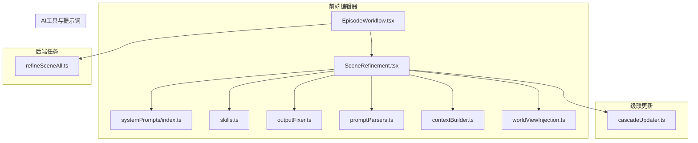
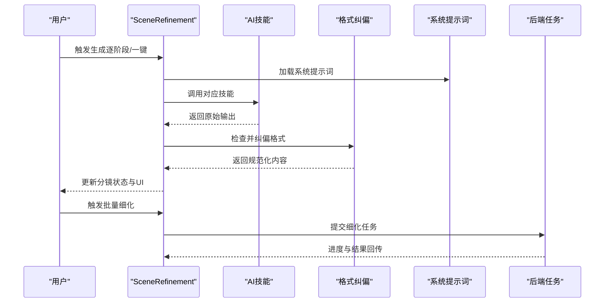
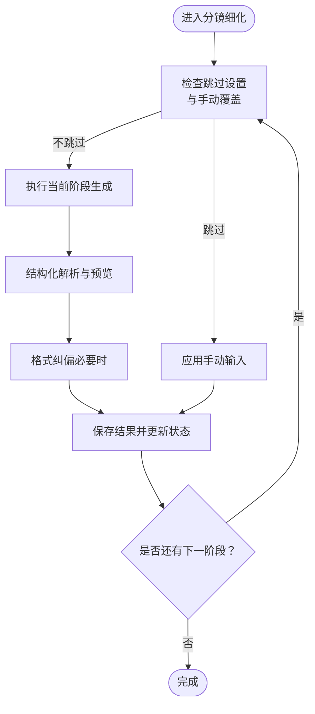
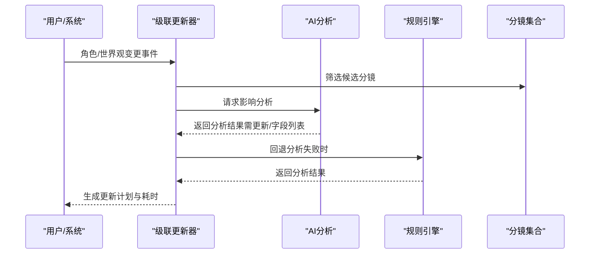
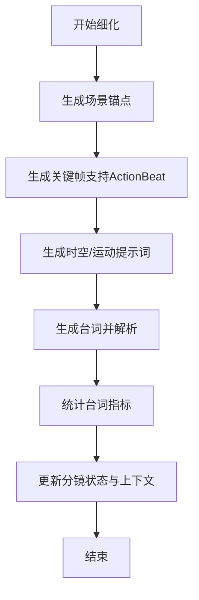
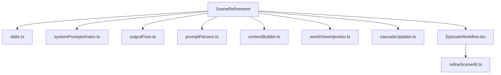

# 场景细化器

<cite>
**本文档引用的文件**
- [apps/web/src/components/editor/SceneRefinement.tsx](file://apps/web/src/components/editor/SceneRefinement.tsx)
- [apps/web/src/components/editor/SceneRefinement.test.tsx](file://apps/web/src/components/editor/SceneRefinement.test.tsx)
- [apps/web/src/lib/ai/cascadeUpdater.ts](file://apps/web/src/lib/ai/cascadeUpdater.ts)
- [apps/worker/src/tasks/refineSceneAll.ts](file://apps/worker/src/tasks/refineSceneAll.ts)
- [apps/web/src/lib/ai/skills.ts](file://apps/web/src/lib/ai/skills.ts)
- [apps/web/src/lib/ai/outputFixer.ts](file://apps/web/src/lib/ai/outputFixer.ts)
- [apps/web/src/lib/systemPrompts/index.ts](file://apps/web/src/lib/systemPrompts/index.ts)
- [apps/web/src/lib/ai/promptParsers.ts](file://apps/web/src/lib/ai/promptParsers.ts)
- [apps/web/src/lib/ai/contextBuilder.ts](file://apps/web/src/lib/ai/contextBuilder.ts)
- [apps/web/src/lib/ai/worldViewInjection.ts](file://apps/web/src/lib/ai/worldViewInjection.ts)
- [apps/web/src/components/editor/EpisodeWorkflow.tsx](file://apps/web/src/components/editor/EpisodeWorkflow.tsx)
</cite>

## 目录

1. [简介](#简介)
2. [项目结构](#项目结构)
3. [核心组件](#核心组件)
4. [架构总览](#架构总览)
5. [详细组件分析](#详细组件分析)
6. [依赖关系分析](#依赖关系分析)
7. [性能考虑](#性能考虑)
8. [故障排查指南](#故障排查指南)
9. [结论](#结论)
10. [附录](#附录)

## 简介

场景细化器（SceneRefinement）是面向分镜创作的AI驱动内容优化与质量提升组件，负责将项目设定逐步细化为高质量的场景锚点、关键帧提示词、时空/运动提示词与台词内容。其核心目标包括：

- 场景内容优化：通过结构化提示词确保环境一致性与画面稳定性
- 细节增强：基于角色与世界观注入，提升场景细节与逻辑连贯性
- 质量提升：内置格式纠偏、Token使用监控与多轮迭代能力
- 级联更新集成：与角色/世界观变更的级联更新机制联动，支持多轮细化迭代
- AI交互与反馈：提供可视化提示词预览、模板应用与结果对比能力
- 性能监控与评估：记录Token用量、生成耗时与成功率，支撑效果评估

## 项目结构

场景细化器位于Web前端工程的编辑器模块中，围绕分镜工作流提供精细化的生成与编辑能力。核心文件组织如下：

- 组件层：SceneRefinement.tsx 提供UI与交互逻辑
- AI工具层：skills.ts（技能定义）、outputFixer.ts（格式纠偏）、promptParsers.ts（结构化解析）、contextBuilder.ts（上下文构建）、worldViewInjection.ts（注入设置）
- 系统提示词：systemPrompts/index.ts 提供本地/远程提示词加载与覆盖
- 级联更新：cascadeUpdater.ts 提供角色/世界观影响分析与更新计划
- 批量执行：EpisodeWorkflow.tsx 提供批量细化流程与进度控制
- 后端任务：worker/tasks/refineSceneAll.ts 提供后端串行细化任务与指标统计

**图表来源**

- [apps/web/src/components/editor/SceneRefinement.tsx](file://apps/web/src/components/editor/SceneRefinement.tsx#L1-L2683)
- [apps/web/src/lib/ai/cascadeUpdater.ts](file://apps/web/src/lib/ai/cascadeUpdater.ts#L1-L694)
- [apps/worker/src/tasks/refineSceneAll.ts](file://apps/worker/src/tasks/refineSceneAll.ts#L1-L695)
- [apps/web/src/lib/ai/skills.ts](file://apps/web/src/lib/ai/skills.ts#L1-L517)
- [apps/web/src/lib/ai/outputFixer.ts](file://apps/web/src/lib/ai/outputFixer.ts#L1-L75)
- [apps/web/src/lib/systemPrompts/index.ts](file://apps/web/src/lib/systemPrompts/index.ts#L1-L197)
- [apps/web/src/lib/ai/promptParsers.ts](file://apps/web/src/lib/ai/promptParsers.ts#L1-L637)
- [apps/web/src/lib/ai/contextBuilder.ts](file://apps/web/src/lib/ai/contextBuilder.ts#L1-L435)
- [apps/web/src/lib/ai/worldViewInjection.ts](file://apps/web/src/lib/ai/worldViewInjection.ts#L1-L192)
- [apps/web/src/components/editor/EpisodeWorkflow.tsx](file://apps/web/src/components/editor/EpisodeWorkflow.tsx#L1489-L1563)

**章节来源**

- [apps/web/src/components/editor/SceneRefinement.tsx](file://apps/web/src/components/editor/SceneRefinement.tsx#L1-L2683)
- [apps/web/src/lib/ai/cascadeUpdater.ts](file://apps/web/src/lib/ai/cascadeUpdater.ts#L1-L694)
- [apps/worker/src/tasks/refineSceneAll.ts](file://apps/worker/src/tasks/refineSceneAll.ts#L1-L695)

## 核心组件

- 场景细化器组件（SceneRefinement）：提供分镜逐阶段细化的UI与交互，支持一键生成全部、手动跳过与覆盖、模板应用、角色复制、提示词编辑与预览、多模态提示词生成等能力。
- AI技能与提示词：通过skills.ts定义各阶段技能，systemPrompts/index.ts提供提示词加载与覆盖，outputFixer.ts提供格式纠偏与Token合并。
- 上下文构建与注入：contextBuilder.ts整合角色/画风/世界观信息，worldViewInjection.ts控制注入时机与开关。
- 级联更新：cascadeUpdater.ts分析角色/世界观变更对分镜的影响，生成更新计划并估算耗时。
- 批量执行：EpisodeWorkflow.tsx协调批量细化流程，提供串行执行、进度上报与中断控制。

**章节来源**

- [apps/web/src/components/editor/SceneRefinement.tsx](file://apps/web/src/components/editor/SceneRefinement.tsx#L131-L1150)
- [apps/web/src/lib/ai/skills.ts](file://apps/web/src/lib/ai/skills.ts#L26-L200)
- [apps/web/src/lib/systemPrompts/index.ts](file://apps/web/src/lib/systemPrompts/index.ts#L109-L124)
- [apps/web/src/lib/ai/outputFixer.ts](file://apps/web/src/lib/ai/outputFixer.ts#L21-L75)
- [apps/web/src/lib/ai/contextBuilder.ts](file://apps/web/src/lib/ai/contextBuilder.ts#L105-L197)
- [apps/web/src/lib/ai/worldViewInjection.ts](file://apps/web/src/lib/ai/worldViewInjection.ts#L66-L126)
- [apps/web/src/lib/ai/cascadeUpdater.ts](file://apps/web/src/lib/ai/cascadeUpdater.ts#L72-L156)
- [apps/web/src/components/editor/EpisodeWorkflow.tsx](file://apps/web/src/components/editor/EpisodeWorkflow.tsx#L1489-L1563)

## 架构总览

场景细化器采用“前端交互 + AI工具 + 级联更新 + 后端任务”的分层架构：

- 前端交互层：SceneRefinement负责用户操作、状态管理与UI渲染
- AI工具层：封装技能、格式纠偏、提示词解析与上下文构建
- 级联更新层：分析角色/世界观变更对分镜的影响，生成更新计划
- 后端任务层：refineSceneAll.ts实现串行细化，记录Token用量与生成指标

**图表来源**

- [apps/web/src/components/editor/SceneRefinement.tsx](file://apps/web/src/components/editor/SceneRefinement.tsx#L422-L1150)
- [apps/web/src/lib/ai/outputFixer.ts](file://apps/web/src/lib/ai/outputFixer.ts#L59-L75)
- [apps/web/src/lib/systemPrompts/index.ts](file://apps/web/src/lib/systemPrompts/index.ts#L109-L124)
- [apps/worker/src/tasks/refineSceneAll.ts](file://apps/worker/src/tasks/refineSceneAll.ts#L262-L694)

## 详细组件分析

### 场景细化器（SceneRefinement）组件

- 生成流程：支持场景锚点、关键帧提示词（KF0-KF8）、时空/运动提示词、台词四阶段生成；提供一键生成全部与逐阶段生成能力。
- 跳过与覆盖：支持跳过特定阶段并手动输入内容，便于专家干预与加速迭代。
- 结构化解析与预览：解析场景锚点、关键帧与运动提示词的结构化标签，提供分段/分拍/约束等子内容的快速复制与全屏编辑。
- 多模态提示词：基于当前分镜生成BGM/音效与转场指令，辅助视频合成。
- Token与格式保障：内置格式纠偏与Token用量合并，确保输出质量与成本可控。
- 级联更新提示：当分镜状态为needs_update时，提示用户重新生成以匹配角色/世界观变更。

**图表来源**

- [apps/web/src/components/editor/SceneRefinement.tsx](file://apps/web/src/components/editor/SceneRefinement.tsx#L422-L1150)
- [apps/web/src/lib/ai/outputFixer.ts](file://apps/web/src/lib/ai/outputFixer.ts#L21-L75)
- [apps/web/src/lib/ai/promptParsers.ts](file://apps/web/src/lib/ai/promptParsers.ts#L1-L200)

**章节来源**

- [apps/web/src/components/editor/SceneRefinement.tsx](file://apps/web/src/components/editor/SceneRefinement.tsx#L131-L1150)
- [apps/web/src/lib/ai/outputFixer.ts](file://apps/web/src/lib/ai/outputFixer.ts#L21-L75)
- [apps/web/src/lib/ai/promptParsers.ts](file://apps/web/src/lib/ai/promptParsers.ts#L1-L200)

### 级联更新机制（Cascade Updater）

- 影响分析：分析项目设定、分镜内容与角色/世界观变更对分镜的影响，生成更新计划与优先级。
- AI智能分析：基于系统提示词对每个候选分镜进行AI分析，支持回退到规则引擎。
- 时间估算：按每项更新约30秒估算总耗时，指导用户规划细化批次。

**图表来源**

- [apps/web/src/lib/ai/cascadeUpdater.ts](file://apps/web/src/lib/ai/cascadeUpdater.ts#L586-L666)
- [apps/web/src/lib/ai/cascadeUpdater.ts](file://apps/web/src/lib/ai/cascadeUpdater.ts#L640-L666)

**章节来源**

- [apps/web/src/lib/ai/cascadeUpdater.ts](file://apps/web/src/lib/ai/cascadeUpdater.ts#L72-L156)
- [apps/web/src/lib/ai/cascadeUpdater.ts](file://apps/web/src/lib/ai/cascadeUpdater.ts#L586-L666)

### 后端细化任务（refineSceneAll）

- 串行细化：按场景锚点 → 关键帧 → 时空/运动 → 台词顺序串行生成，支持ActionBeat回退与格式纠偏。
- 指标统计：计算台词字符数、行数与预估时长，用于配音/字幕规划。
- 状态推进：在每个阶段更新分镜状态，最终完成时尝试推进剧集/项目工作流状态。

**图表来源**

- [apps/worker/src/tasks/refineSceneAll.ts](file://apps/worker/src/tasks/refineSceneAll.ts#L262-L694)

**章节来源**

- [apps/worker/src/tasks/refineSceneAll.ts](file://apps/worker/src/tasks/refineSceneAll.ts#L262-L694)

### 批量细化流程（EpisodeWorkflow）

- 串行执行：按顺序细化每个分镜，支持中断与进度上报。
- 进度聚合：将单个分镜进度映射为整体进度，实时更新UI。
- 失败处理：记录失败原因并提示用户，支持继续或终止。

**章节来源**

- [apps/web/src/components/editor/EpisodeWorkflow.tsx](file://apps/web/src/components/editor/EpisodeWorkflow.tsx#L1489-L1563)

## 依赖关系分析

- 组件耦合：SceneRefinement依赖AI技能、系统提示词、格式纠偏与上下文构建模块；与级联更新器通过分镜状态与更新计划耦合。
- 外部依赖：系统提示词支持本地存储与远程API两种来源；格式纠偏依赖系统提示词键值；上下文构建依赖角色/画风/世界观数据。
- 循环依赖：未发现循环依赖，模块职责清晰，接口稳定。

**图表来源**

- [apps/web/src/components/editor/SceneRefinement.tsx](file://apps/web/src/components/editor/SceneRefinement.tsx#L1-L2683)
- [apps/web/src/lib/ai/skills.ts](file://apps/web/src/lib/ai/skills.ts#L1-L517)
- [apps/web/src/lib/systemPrompts/index.ts](file://apps/web/src/lib/systemPrompts/index.ts#L1-L197)
- [apps/web/src/lib/ai/outputFixer.ts](file://apps/web/src/lib/ai/outputFixer.ts#L1-L75)
- [apps/web/src/lib/ai/promptParsers.ts](file://apps/web/src/lib/ai/promptParsers.ts#L1-L637)
- [apps/web/src/lib/ai/contextBuilder.ts](file://apps/web/src/lib/ai/contextBuilder.ts#L1-L435)
- [apps/web/src/lib/ai/worldViewInjection.ts](file://apps/web/src/lib/ai/worldViewInjection.ts#L1-L192)
- [apps/web/src/lib/ai/cascadeUpdater.ts](file://apps/web/src/lib/ai/cascadeUpdater.ts#L1-L694)
- [apps/web/src/components/editor/EpisodeWorkflow.tsx](file://apps/web/src/components/editor/EpisodeWorkflow.tsx#L1489-L1563)
- [apps/worker/src/tasks/refineSceneAll.ts](file://apps/worker/src/tasks/refineSceneAll.ts#L1-L695)

**章节来源**

- [apps/web/src/components/editor/SceneRefinement.tsx](file://apps/web/src/components/editor/SceneRefinement.tsx#L1-L2683)
- [apps/web/src/lib/ai/cascadeUpdater.ts](file://apps/web/src/lib/ai/cascadeUpdater.ts#L1-L694)

## 性能考虑

- Token使用控制：通过上下文压缩与格式纠偏减少无效调用；合并纠偏前后Token用量，精确计量成本。
- 生成耗时估算：级联更新按每项约30秒估算总耗时；批量细化按分镜数量线性增长。
- UI响应性：使用AbortController中断生成，避免重复触发；批量操作期间禁用其他操作，防止竞态。
- 输出质量：格式纠偏与结构化解析降低失败率，提高后续阶段的成功概率。

**章节来源**

- [apps/web/src/lib/ai/outputFixer.ts](file://apps/web/src/lib/ai/outputFixer.ts#L12-L19)
- [apps/web/src/lib/ai/cascadeUpdater.ts](file://apps/web/src/lib/ai/cascadeUpdater.ts#L148-L150)
- [apps/web/src/components/editor/SceneRefinement.tsx](file://apps/web/src/components/editor/SceneRefinement.tsx#L1152-L1166)

## 故障排查指南

- 生成失败：检查AI配置、网络连接与提示词加载；查看错误提示与日志；必要时启用格式纠偏。
- 重复生成：确认生成状态与外部批量操作冲突；使用取消按钮中断当前生成。
- 输出格式异常：依赖outputFixer的格式纠偏；若纠偏失败，回退到原始输出并记录日志。
- 级联更新未触发：检查分镜状态是否为needs_update；确认角色/世界观变更事件是否正确传播。

**章节来源**

- [apps/web/src/components/editor/SceneRefinement.tsx](file://apps/web/src/components/editor/SceneRefinement.tsx#L577-L590)
- [apps/web/src/lib/ai/outputFixer.ts](file://apps/web/src/lib/ai/outputFixer.ts#L59-L75)
- [apps/web/src/lib/ai/cascadeUpdater.ts](file://apps/web/src/lib/ai/cascadeUpdater.ts#L72-L156)

## 结论

场景细化器通过“结构化提示词 + 格式纠偏 + 上下文注入 + 级联更新”的组合，实现了从项目设定到高质量分镜内容的自动化与可控化细化。其UI设计兼顾专业性与易用性，配合后端任务与批量流程，能够高效支撑多轮迭代与规模化生产。

## 附录

### 细化策略配置

- 世界观注入：通过worldViewInjection.ts配置注入时机（分镜列表/场景锚点/角色设定），支持开启/关闭与持久化。
- 技能与提示词：通过skills.ts定义各阶段技能参数，systemPrompts/index.ts提供本地/远程提示词覆盖。
- 跳过与覆盖：SceneRefinement支持跳过特定阶段并手动输入内容，便于专家干预。

**章节来源**

- [apps/web/src/lib/ai/worldViewInjection.ts](file://apps/web/src/lib/ai/worldViewInjection.ts#L66-L126)
- [apps/web/src/lib/ai/skills.ts](file://apps/web/src/lib/ai/skills.ts#L26-L200)
- [apps/web/src/lib/systemPrompts/index.ts](file://apps/web/src/lib/systemPrompts/index.ts#L109-L124)
- [apps/web/src/components/editor/SceneRefinement.tsx](file://apps/web/src/components/editor/SceneRefinement.tsx#L1540-L1577)

### 性能监控与结果评估

- Token用量：outputFixer合并纠偏前后用量，refineSceneAll统计各阶段Token使用。
- 生成指标：refineSceneAll计算台词字符数、行数与预估时长，辅助配音/字幕规划。
- 成功率与耗时：级联更新估算耗时，批量细化提供整体进度与失败统计。

**章节来源**

- [apps/web/src/lib/ai/outputFixer.ts](file://apps/web/src/lib/ai/outputFixer.ts#L12-L19)
- [apps/worker/src/tasks/refineSceneAll.ts](file://apps/worker/src/tasks/refineSceneAll.ts#L72-L93)
- [apps/web/src/lib/ai/cascadeUpdater.ts](file://apps/web/src/lib/ai/cascadeUpdater.ts#L148-L150)

### 最佳实践与效果优化

- 优先使用结构化提示词：确保输出可解析、可复制与可纠偏。
- 合理使用格式纠偏：在输出不稳定时启用纠偏，减少失败重试。
- 控制上下文长度：通过上下文压缩与注入时机控制，平衡质量与成本。
- 多轮细化迭代：结合级联更新与批量流程，逐步提升内容一致性与细节质量。
- 用户反馈与对比：利用提示词预览与模板应用，快速对比不同策略的效果。

**章节来源**

- [apps/web/src/components/editor/SceneRefinement.tsx](file://apps/web/src/components/editor/SceneRefinement.tsx#L1600-L2399)
- [apps/web/src/lib/ai/contextBuilder.ts](file://apps/web/src/lib/ai/contextBuilder.ts#L105-L197)
- [apps/web/src/lib/ai/worldViewInjection.ts](file://apps/web/src/lib/ai/worldViewInjection.ts#L108-L126)
