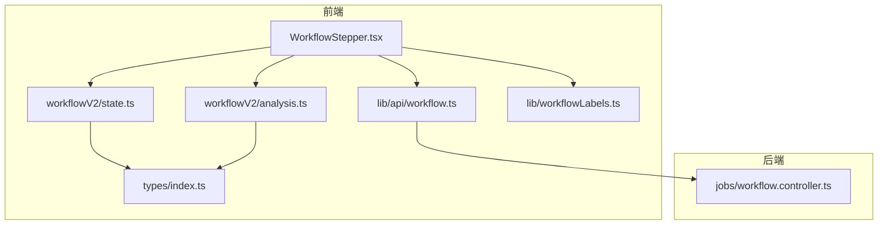
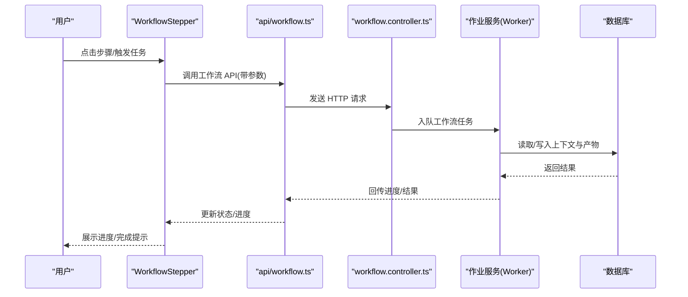
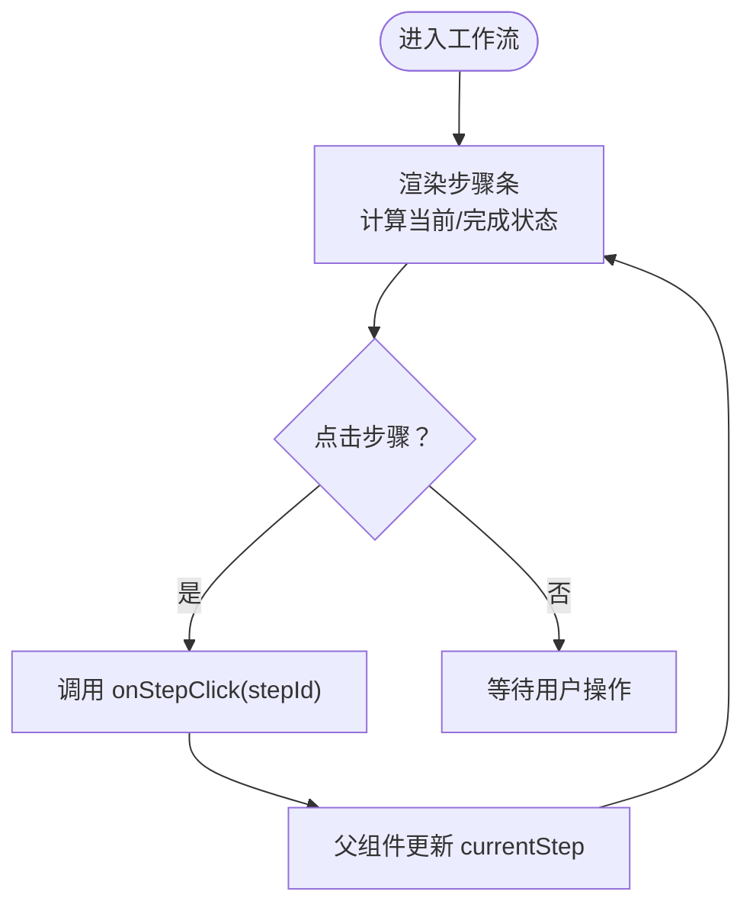
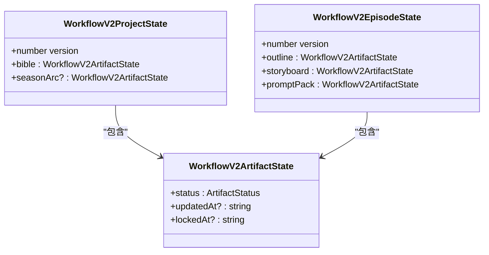
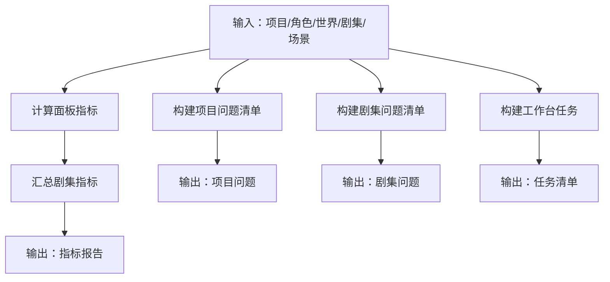
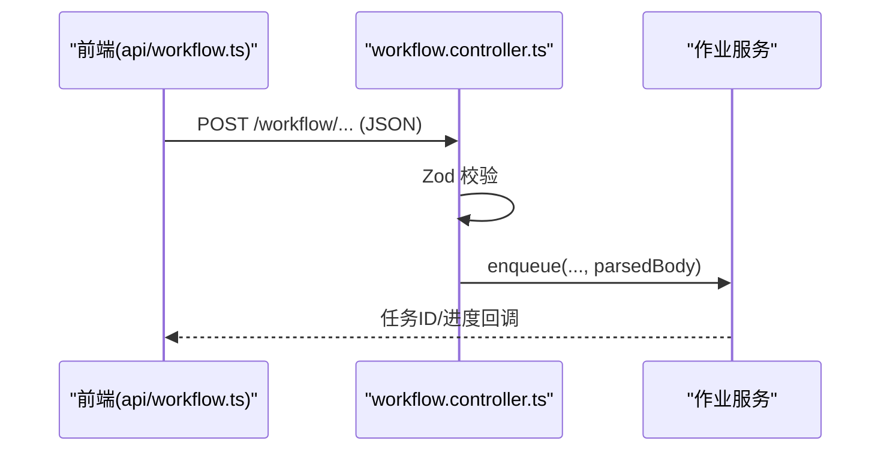
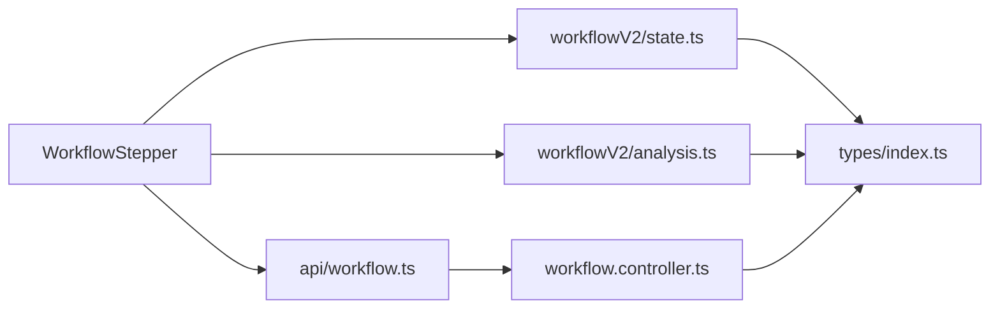

# 工作流推进器

<cite>
**本文引用的文件**
- [apps/web/src/components/editor/WorkflowStepper.tsx](file://apps/web/src/components/editor/WorkflowStepper.tsx)
- [apps/web/src/lib/workflowV2/state.ts](file://apps/web/src/lib/workflowV2/state.ts)
- [apps/web/src/lib/workflowV2/analysis.ts](file://apps/web/src/lib/workflowV2/analysis.ts)
- [apps/web/src/lib/api/workflow.ts](file://apps/web/src/lib/api/workflow.ts)
- [apps/api/src/jobs/workflow.controller.ts](file://apps/api/src/jobs/workflow.controller.ts)
- [apps/web/src/lib/workflowLabels.ts](file://apps/web/src/lib/workflowLabels.ts)
- [apps/web/src/types/index.ts](file://apps/web/src/types/index.ts)
</cite>

## 目录

1. [简介](#简介)
2. [项目结构](#项目结构)
3. [核心组件](#核心组件)
4. [架构总览](#架构总览)
5. [组件详解](#组件详解)
6. [依赖关系分析](#依赖关系分析)
7. [性能考量](#性能考量)
8. [故障排查指南](#故障排查指南)
9. [结论](#结论)
10. [附录](#附录)

## 简介

本文件围绕“工作流推进器”组件进行系统化说明，重点阐述 WorkflowStepper 组件的状态管理机制、与工作流状态机的集成方式、步骤跳转/回退/重新执行能力、工作流分析与性能指标展示、异常处理策略，以及工作流定制化配置、用户引导与操作日志记录。文档同时提供最佳实践与用户体验优化建议，帮助开发者与产品人员高效理解与扩展该组件。

## 项目结构

工作流推进器相关代码主要分布在以下模块：

- 前端组件层：WorkflowStepper 步骤导航组件
- 前端状态与分析层：工作流 V2 状态与分析工具
- 前端 API 层：工作流任务调用封装
- 后端控制层：工作流任务路由与鉴权
- 类型与标签：工作流状态标签与数据模型

图表来源

- [apps/web/src/components/editor/WorkflowStepper.tsx](file://apps/web/src/components/editor/WorkflowStepper.tsx#L1-L108)
- [apps/web/src/lib/workflowV2/state.ts](file://apps/web/src/lib/workflowV2/state.ts#L1-L139)
- [apps/web/src/lib/workflowV2/analysis.ts](file://apps/web/src/lib/workflowV2/analysis.ts#L1-L444)
- [apps/web/src/lib/api/workflow.ts](file://apps/web/src/lib/api/workflow.ts#L1-L302)
- [apps/api/src/jobs/workflow.controller.ts](file://apps/api/src/jobs/workflow.controller.ts#L1-L266)
- [apps/web/src/lib/workflowLabels.ts](file://apps/web/src/lib/workflowLabels.ts#L1-L22)
- [apps/web/src/types/index.ts](file://apps/web/src/types/index.ts#L260-L459)

章节来源

- [apps/web/src/components/editor/WorkflowStepper.tsx](file://apps/web/src/components/editor/WorkflowStepper.tsx#L1-L108)
- [apps/web/src/lib/workflowV2/state.ts](file://apps/web/src/lib/workflowV2/state.ts#L1-L139)
- [apps/web/src/lib/workflowV2/analysis.ts](file://apps/web/src/lib/workflowV2/analysis.ts#L1-L444)
- [apps/web/src/lib/api/workflow.ts](file://apps/web/src/lib/api/workflow.ts#L1-L302)
- [apps/api/src/jobs/workflow.controller.ts](file://apps/api/src/jobs/workflow.controller.ts#L1-L266)
- [apps/web/src/lib/workflowLabels.ts](file://apps/web/src/lib/workflowLabels.ts#L1-L22)
- [apps/web/src/types/index.ts](file://apps/web/src/types/index.ts#L260-L459)

## 核心组件

- WorkflowStepper：提供工作流步骤的可视化导航，支持点击跳转、当前步骤高亮、已完成步骤标记与进度条。
- 工作流 V2 状态工具：规范化并构建项目/剧集产物状态，支持 draft/review/locked 三态及更新时间戳。
- 工作流分析工具：计算面板/剧集指标、构建问题清单与工作台任务，辅助用户识别瓶颈与推进路径。
- 工作流 API 封装：统一调用后端工作流任务接口，支持批量/强制重跑等高级选项。
- 工作流标签：将内部状态码映射为中文标签，便于 UI 展示。
- 类型系统：定义工作流产物状态、剧集工作流状态、场景状态等，确保前后端契约一致。

章节来源

- [apps/web/src/components/editor/WorkflowStepper.tsx](file://apps/web/src/components/editor/WorkflowStepper.tsx#L1-L108)
- [apps/web/src/lib/workflowV2/state.ts](file://apps/web/src/lib/workflowV2/state.ts#L1-L139)
- [apps/web/src/lib/workflowV2/analysis.ts](file://apps/web/src/lib/workflowV2/analysis.ts#L1-L444)
- [apps/web/src/lib/api/workflow.ts](file://apps/web/src/lib/api/workflow.ts#L1-L302)
- [apps/web/src/lib/workflowLabels.ts](file://apps/web/src/lib/workflowLabels.ts#L1-L22)
- [apps/web/src/types/index.ts](file://apps/web/src/types/index.ts#L260-L459)

## 架构总览

工作流推进器采用“前端组件 + 状态/分析工具 + API 封装 + 后端控制器”的分层设计。前端通过 WorkflowStepper 展示步骤与进度，调用 API 封装触发后端任务，后端控制器解析参数并入队到作业服务，最终由 Worker 执行具体任务。分析与状态工具贯穿前端体验，提供指标与问题提示，驱动用户完成工作流各阶段。

图表来源

- [apps/web/src/components/editor/WorkflowStepper.tsx](file://apps/web/src/components/editor/WorkflowStepper.tsx#L21-L107)
- [apps/web/src/lib/api/workflow.ts](file://apps/web/src/lib/api/workflow.ts#L1-L302)
- [apps/api/src/jobs/workflow.controller.ts](file://apps/api/src/jobs/workflow.controller.ts#L44-L266)

## 组件详解

### WorkflowStepper 组件

- 功能定位：工作流步骤导航与进度展示，支持点击跳转至任意步骤。
- 步骤定义：包含“工作台/全局设定/因果链/剧集规划/单集创作/导出”六个阶段。
- 状态渲染：
  - 已完成：圆点填充与进度线高亮
  - 当前步骤：高亮边框与环形光晕
  - 未完成：浅色描边与数字序号
- 交互行为：点击任一步骤触发父组件回调，实现步骤跳转；当前版本允许自由跳转，后续可加入前置条件校验。

图表来源

- [apps/web/src/components/editor/WorkflowStepper.tsx](file://apps/web/src/components/editor/WorkflowStepper.tsx#L21-L107)

章节来源

- [apps/web/src/components/editor/WorkflowStepper.tsx](file://apps/web/src/components/editor/WorkflowStepper.tsx#L1-L108)

### 工作流状态机与产物状态

- 产物状态三态：draft（草稿）、review（待审）、locked（锁定）。用于替代线性状态，更贴合“产物成熟度”视角。
- 项目级产物：项目圣经（bible）、可选季/主线弧（seasonArc）
- 剧集级产物：Outline（策划/Beat Sheet/大纲）、Storyboard（静态漫画分镜）、PromptPack（提示词包）
- 状态构建与归一化：提供构建补丁与规范化函数，保证跨组件状态一致性与默认值安全。

图表来源

- [apps/web/src/types/index.ts](file://apps/web/src/types/index.ts#L265-L294)
- [apps/web/src/lib/workflowV2/state.ts](file://apps/web/src/lib/workflowV2/state.ts#L27-L74)

章节来源

- [apps/web/src/lib/workflowV2/state.ts](file://apps/web/src/lib/workflowV2/state.ts#L1-L139)
- [apps/web/src/types/index.ts](file://apps/web/src/types/index.ts#L260-L459)

### 工作流分析与性能指标

- 面板指标：统计对白行数、字符数，估算时长，辅助视频节奏控制。
- 剧集指标：汇总面板数、总字符数、总时长、平均每格时长。
- 问题清单：针对项目/剧集/场景给出错误/警告/提示级别问题，覆盖摘要长度、风格 Full Prompt、角色/世界/剧集规划、分镜列表、对白密度、镜头/站位提示缺失等。
- 工作台任务：根据 AI 配置、项目/剧集状态生成“待办/阻塞/完成”任务，指导下一步行动。

图表来源

- [apps/web/src/lib/workflowV2/analysis.ts](file://apps/web/src/lib/workflowV2/analysis.ts#L59-L91)
- [apps/web/src/lib/workflowV2/analysis.ts](file://apps/web/src/lib/workflowV2/analysis.ts#L93-L167)
- [apps/web/src/lib/workflowV2/analysis.ts](file://apps/web/src/lib/workflowV2/analysis.ts#L169-L335)
- [apps/web/src/lib/workflowV2/analysis.ts](file://apps/web/src/lib/workflowV2/analysis.ts#L337-L443)

章节来源

- [apps/web/src/lib/workflowV2/analysis.ts](file://apps/web/src/lib/workflowV2/analysis.ts#L1-L444)

### 与后端工作流控制器的集成

- 前端 API 封装：提供统一方法触发各类工作流任务（如生成核心表达、分镜列表、关键帧提示词、对白、细化等），支持批量与强制重跑。
- 控制器路由：后端控制器接收请求，解析参数（如 aiProfileId、targetEpisodeCount、sceneCountHint、cameraMode、force 等），入队到作业服务。
- 参数校验：使用 Zod 进行严格参数校验，保障入队任务的合法性与范围约束。

图表来源

- [apps/web/src/lib/api/workflow.ts](file://apps/web/src/lib/api/workflow.ts#L1-L302)
- [apps/api/src/jobs/workflow.controller.ts](file://apps/api/src/jobs/workflow.controller.ts#L9-L42)

章节来源

- [apps/web/src/lib/api/workflow.ts](file://apps/web/src/lib/api/workflow.ts#L1-L302)
- [apps/api/src/jobs/workflow.controller.ts](file://apps/api/src/jobs/workflow.controller.ts#L1-L266)

### 步骤跳转、回退与重新执行

- 步骤跳转：WorkflowStepper 支持点击任意步骤进行跳转；父组件负责维护 currentStep 并刷新内容。
- 回退：可通过将 currentStep 设为上一步并清理后续状态实现回退。
- 重新执行：API 封装支持 force 参数（如生成核心表达批量、因果链续接），用于覆盖已有产物并强制重跑。
- 状态同步：通过构建产物补丁（buildProjectArtifactPatch/buildEpisodeArtifactPatch）更新 contextCache 中 workflowV2 字段，保持 UI 与后端一致。

章节来源

- [apps/web/src/components/editor/WorkflowStepper.tsx](file://apps/web/src/components/editor/WorkflowStepper.tsx#L54-L58)
- [apps/web/src/lib/api/workflow.ts](file://apps/web/src/lib/api/workflow.ts#L23-L44)
- [apps/web/src/lib/workflowV2/state.ts](file://apps/web/src/lib/workflowV2/state.ts#L76-L139)

### 性能指标展示与异常处理

- 性能指标：面板/剧集指标用于评估节奏与时长，辅助用户调整分镜密度与对白长度。
- 异常处理：后端控制器对请求参数进行严格校验；前端在调用 API 时捕获错误并提示，区分取消与失败场景，更新日志与进度。

章节来源

- [apps/web/src/lib/workflowV2/analysis.ts](file://apps/web/src/lib/workflowV2/analysis.ts#L59-L91)
- [apps/api/src/jobs/workflow.controller.ts](file://apps/api/src/jobs/workflow.controller.ts#L9-L42)

### 工作流定制化配置、用户引导与操作日志

- 定制化配置：通过 AI Profile 与画风 Full Prompt 锁定风格，作为多集一致性的根；支持自定义画风与预设切换。
- 用户引导：工作台任务清单与问题清单帮助用户识别缺失项与瓶颈，按优先级推进。
- 操作日志：后端控制器记录任务入队与执行状态，前端通过进度桥与日志更新实现可视化反馈。

章节来源

- [apps/web/src/lib/workflowLabels.ts](file://apps/web/src/lib/workflowLabels.ts#L1-L22)
- [apps/web/src/lib/workflowV2/analysis.ts](file://apps/web/src/lib/workflowV2/analysis.ts#L337-L443)

## 依赖关系分析

- 组件耦合：WorkflowStepper 与状态/分析工具松耦合，通过 props 与回调交互；API 封装与后端控制器形成清晰边界。
- 数据流向：从 UI 事件到 API 调用，再到后端控制器与作业服务，最终回写状态与产物。
- 类型契约：通过 types/index.ts 中的类型定义确保前后端一致，降低集成风险。

图表来源

- [apps/web/src/components/editor/WorkflowStepper.tsx](file://apps/web/src/components/editor/WorkflowStepper.tsx#L1-L108)
- [apps/web/src/lib/api/workflow.ts](file://apps/web/src/lib/api/workflow.ts#L1-L302)
- [apps/web/src/lib/workflowV2/state.ts](file://apps/web/src/lib/workflowV2/state.ts#L1-L139)
- [apps/web/src/lib/workflowV2/analysis.ts](file://apps/web/src/lib/workflowV2/analysis.ts#L1-L444)
- [apps/api/src/jobs/workflow.controller.ts](file://apps/api/src/jobs/workflow.controller.ts#L1-L266)
- [apps/web/src/types/index.ts](file://apps/web/src/types/index.ts#L260-L459)

章节来源

- [apps/web/src/components/editor/WorkflowStepper.tsx](file://apps/web/src/components/editor/WorkflowStepper.tsx#L1-L108)
- [apps/web/src/lib/api/workflow.ts](file://apps/web/src/lib/api/workflow.ts#L1-L302)
- [apps/web/src/lib/workflowV2/state.ts](file://apps/web/src/lib/workflowV2/state.ts#L1-L139)
- [apps/web/src/lib/workflowV2/analysis.ts](file://apps/web/src/lib/workflowV2/analysis.ts#L1-L444)
- [apps/api/src/jobs/workflow.controller.ts](file://apps/api/src/jobs/workflow.controller.ts#L1-L266)
- [apps/web/src/types/index.ts](file://apps/web/src/types/index.ts#L260-L459)

## 性能考量

- 前端渲染：步骤条按需重渲染，避免频繁重算；状态更新通过补丁函数最小化变更。
- API 调用：批量任务与强制重跑减少重复工作；合理设置参数（如 sceneCountHint、targetEpisodeCount）提升效率。
- 后端队列：控制器集中校验与入队，避免无效任务占用资源。

## 故障排查指南

- 参数校验失败：检查请求体字段（aiProfileId、targetEpisodeCount、sceneCountHint、cameraMode、force 等）是否符合后端约束。
- 任务未执行：确认用户鉴权与团队权限；检查作业服务是否正常运行。
- 前端无响应：检查 API 调用返回与错误分支处理；核对日志更新逻辑。
- 状态不一致：确认 contextCache 中 workflowV2 是否正确更新；必要时重建补丁。

章节来源

- [apps/api/src/jobs/workflow.controller.ts](file://apps/api/src/jobs/workflow.controller.ts#L9-L42)
- [apps/web/src/lib/api/workflow.ts](file://apps/web/src/lib/api/workflow.ts#L1-L302)

## 结论

工作流推进器通过清晰的步骤导航、产物状态视角与分析工具，有效支撑用户在多阶段创作流程中的推进与回溯。配合后端严格的参数校验与队列执行，形成稳定可靠的工作流体系。建议在现有基础上进一步增强步骤前置条件校验、日志与审计能力，并持续优化指标算法与任务调度策略。

## 附录

- 最佳实践
  - 在步骤跳转前增加前置条件校验，避免无效跳转导致的失败。
  - 使用分析工具定期生成问题清单与任务清单，形成闭环推进。
  - 对批量任务与强制重跑进行可视化提示，避免误操作。
  - 通过标签系统统一状态展示，提升可读性与一致性。
- 用户体验优化
  - 增加步骤说明与引导气泡，降低学习成本。
  - 提供一键执行与快速修复建议，提升效率。
  - 在关键节点提供进度条与 ETA 估算，增强可控感。
