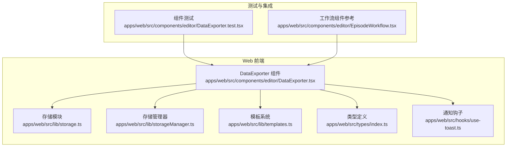
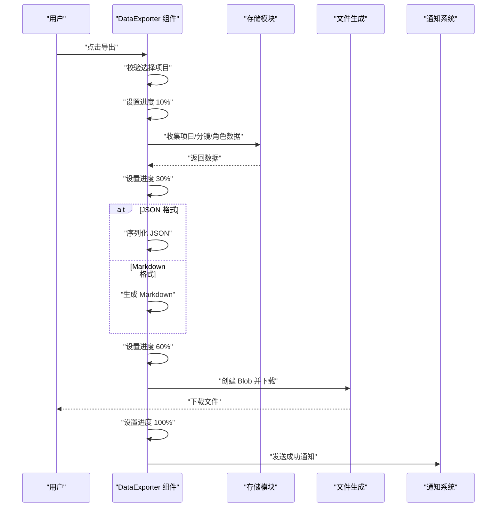
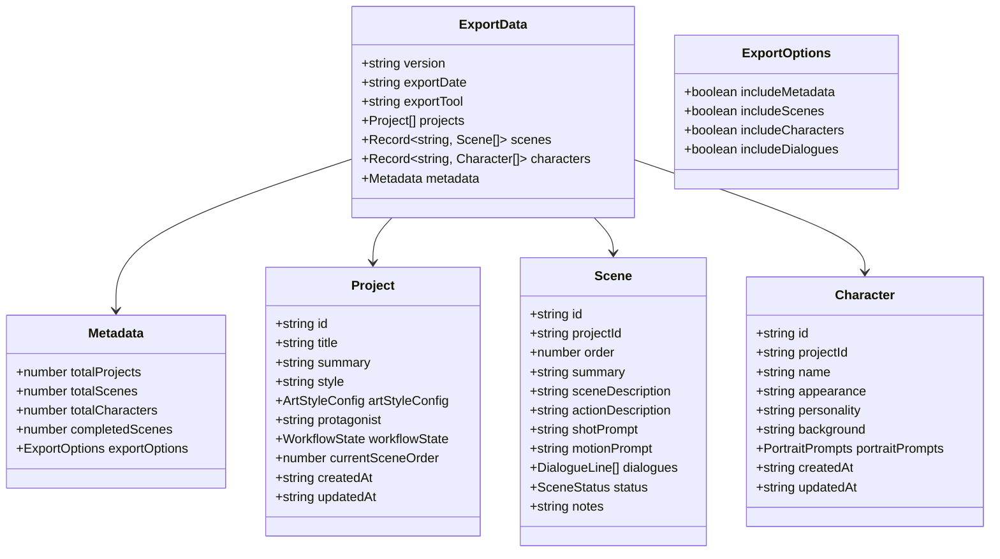
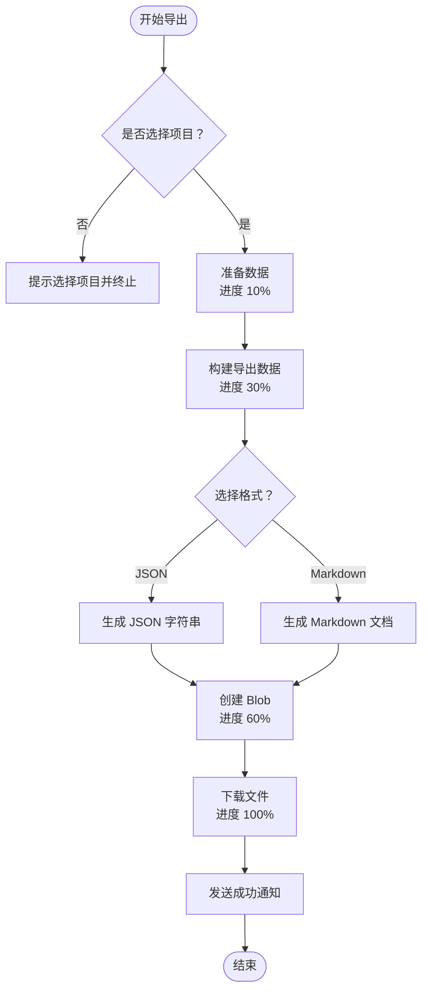
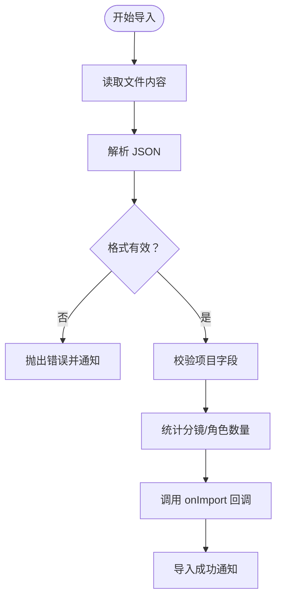
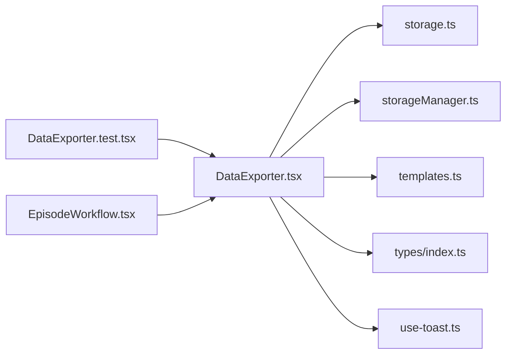

# 数据导出器

<cite>
**本文档引用的文件**
- [DataExporter.tsx](file://apps/web/src/components/editor/DataExporter.tsx)
- [DataExporter.test.tsx](file://apps/web/src/components/editor/DataExporter.test.tsx)
- [storage.ts](file://apps/web/src/lib/storage.ts)
- [storageManager.ts](file://apps/web/src/lib/storageManager.ts)
- [templates.ts](file://apps/web/src/lib/templates.ts)
- [index.ts](file://apps/web/src/types/index.ts)
- [use-toast.ts](file://apps/web/src/hooks/use-toast.ts)
- [EpisodeWorkflow.tsx](file://apps/web/src/components/editor/EpisodeWorkflow.tsx)
</cite>

## 目录

1. [简介](#简介)
2. [项目结构](#项目结构)
3. [核心组件](#核心组件)
4. [架构总览](#架构总览)
5. [详细组件分析](#详细组件分析)
6. [依赖关系分析](#依赖关系分析)
7. [性能考量](#性能考量)
8. [故障排除指南](#故障排除指南)
9. [结论](#结论)
10. [附录](#附录)

## 简介

本文件为数据导出器组件的全面技术文档，聚焦于 DataExporter 组件的导出机制与实现细节。该组件提供项目数据的打包、格式转换与文件生成能力，支持 JSON 与 Markdown 两种导出格式，并内建导入校验与进度反馈机制。文档同时涵盖数据完整性检查、压缩优化与大文件处理策略、导出进度监控、错误恢复与用户反馈机制，并给出最佳实践与兼容性保障方案。

## 项目结构

DataExporter 组件位于 Web 前端工程中，采用 React + TypeScript 实现，配合本地存储与工具模块共同完成数据导出流程。

**图表来源**

- [DataExporter.tsx](file://apps/web/src/components/editor/DataExporter.tsx#L1-L826)
- [storage.ts](file://apps/web/src/lib/storage.ts#L1-L1015)
- [storageManager.ts](file://apps/web/src/lib/storageManager.ts#L1-L369)
- [templates.ts](file://apps/web/src/lib/templates.ts#L1-L313)
- [index.ts](file://apps/web/src/types/index.ts#L1-L1019)
- [use-toast.ts](file://apps/web/src/hooks/use-toast.ts#L1-L190)
- [DataExporter.test.tsx](file://apps/web/src/components/editor/DataExporter.test.tsx#L1-L398)
- [EpisodeWorkflow.tsx](file://apps/web/src/components/editor/EpisodeWorkflow.tsx#L1811-L3693)

**章节来源**

- [DataExporter.tsx](file://apps/web/src/components/editor/DataExporter.tsx#L1-L826)
- [storage.ts](file://apps/web/src/lib/storage.ts#L1-L1015)
- [storageManager.ts](file://apps/web/src/lib/storageManager.ts#L1-L369)
- [templates.ts](file://apps/web/src/lib/templates.ts#L1-L313)
- [index.ts](file://apps/web/src/types/index.ts#L1-L1019)
- [use-toast.ts](file://apps/web/src/hooks/use-toast.ts#L1-L190)
- [DataExporter.test.tsx](file://apps/web/src/components/editor/DataExporter.test.tsx#L1-L398)
- [EpisodeWorkflow.tsx](file://apps/web/src/components/editor/EpisodeWorkflow.tsx#L1811-L3693)

## 核心组件

DataExporter 是一个功能完备的导出/导入组件，具备以下核心能力：

- 多格式导出：JSON 与 Markdown
- 选项化导出：元数据、分镜、角色、台词等可选
- 项目选择与统计：支持全选/取消全选、项目统计摘要
- 导出预览：支持预览导出内容（带截断提示）
- 导出进度：三段式进度展示（准备数据、生成内容、创建文件）
- 导入校验：JSON 文件导入与基础格式校验
- 用户反馈：Toast 通知与交互状态提示

**章节来源**

- [DataExporter.tsx](file://apps/web/src/components/editor/DataExporter.tsx#L90-L710)
- [DataExporter.test.tsx](file://apps/web/src/components/editor/DataExporter.test.tsx#L102-L398)

## 架构总览

DataExporter 的导出流程分为三个阶段：准备数据、生成内容、创建文件。组件通过本地存储模块读取项目、分镜与角色数据，构建导出数据结构，随后根据所选格式生成内容并下载文件。

**图表来源**

- [DataExporter.tsx](file://apps/web/src/components/editor/DataExporter.tsx#L228-L297)
- [storage.ts](file://apps/web/src/lib/storage.ts#L548-L572)

**章节来源**

- [DataExporter.tsx](file://apps/web/src/components/editor/DataExporter.tsx#L228-L297)

## 详细组件分析

### 数据模型与导出结构

DataExporter 使用统一的导出数据结构，包含版本、导出时间、工具名以及可选的元数据与数据集合。导出选项决定是否包含分镜、角色与元数据。

**图表来源**

- [DataExporter.tsx](file://apps/web/src/components/editor/DataExporter.tsx#L60-L83)
- [index.ts](file://apps/web/src/types/index.ts#L453-L618)

**章节来源**

- [DataExporter.tsx](file://apps/web/src/components/editor/DataExporter.tsx#L60-L83)
- [index.ts](file://apps/web/src/types/index.ts#L453-L618)

### 导出机制与格式转换

- JSON 导出：将导出数据结构序列化为 JSON 字符串，文件名为 `manga-creator-export-时间戳.json`。
- Markdown 导出：将项目、角色与分镜信息组织为 Markdown 文档，包含画风、角色列表、分镜列表等结构化内容。
- 预览内容：支持导出预览，按格式生成预览文本并限制最大长度（带截断提示）。

**图表来源**

- [DataExporter.tsx](file://apps/web/src/components/editor/DataExporter.tsx#L228-L297)
- [DataExporter.tsx](file://apps/web/src/components/editor/DataExporter.tsx#L712-L825)

**章节来源**

- [DataExporter.tsx](file://apps/web/src/components/editor/DataExporter.tsx#L228-L297)
- [DataExporter.tsx](file://apps/web/src/components/editor/DataExporter.tsx#L712-L825)

### 导入与校验机制

- 文件类型限制：仅接受 `.json` 文件。
- 格式校验：检查版本与项目数组存在性；逐项校验项目必要字段（如 id、title）。
- 统计导入数据：计算分镜与角色总数，用于反馈。
- 回调导入：通过 onImport 回调将数据交由上层处理。

**图表来源**

- [DataExporter.tsx](file://apps/web/src/components/editor/DataExporter.tsx#L299-L348)

**章节来源**

- [DataExporter.tsx](file://apps/web/src/components/editor/DataExporter.tsx#L299-L348)

### 项目选择与统计

- 支持全选/取消全选，点击项目行切换选中状态。
- 统计信息：项目数、分镜总数、角色总数、已完成分镜数。
- 画风标签：优先使用预设标签，若为自定义画风则从自定义样式存储中获取名称。

**章节来源**

- [DataExporter.tsx](file://apps/web/src/components/editor/DataExporter.tsx#L140-L171)
- [DataExporter.tsx](file://apps/web/src/components/editor/DataExporter.tsx#L118-L138)

### 模板系统与自定义导出选项

- 模板系统：提供内置提示词模板库，支持场景锚点、动作描述、镜头提示词与风格化模板。
- 变量替换：通过占位符替换模板中的变量，形成最终提示词。
- 导出选项：元数据、分镜、角色、台词等可选；分镜数据可选择是否包含台词。

**章节来源**

- [templates.ts](file://apps/web/src/lib/templates.ts#L1-L313)
- [DataExporter.tsx](file://apps/web/src/components/editor/DataExporter.tsx#L100-L105)
- [DataExporter.tsx](file://apps/web/src/components/editor/DataExporter.tsx#L485-L504)

### 数据完整性检查与大文件处理

- 数据完整性：存储管理器提供数据完整性校验与损坏修复能力，确保分片数据一致性。
- 大文件处理：存储管理器支持数据压缩与分片存储，自动判断是否需要分片与压缩，提升大体量数据的存储与读取稳定性。
- 过期清理：定期清理过期数据，维持存储空间健康。

**章节来源**

- [storageManager.ts](file://apps/web/src/lib/storageManager.ts#L288-L332)
- [storageManager.ts](file://apps/web/src/lib/storageManager.ts#L88-L134)
- [storageManager.ts](file://apps/web/src/lib/storageManager.ts#L207-L239)

### 进度监控与用户反馈

- 进度条：三段式进度（准备数据 10%、生成内容 30%、创建文件 60%、下载完成 100%）。
- 通知系统：使用 Toast 提示导出成功/失败与导入成功/失败信息。
- 交互状态：导出/导入期间禁用按钮，防止重复操作。

**章节来源**

- [DataExporter.tsx](file://apps/web/src/components/editor/DataExporter.tsx#L238-L296)
- [use-toast.ts](file://apps/web/src/hooks/use-toast.ts#L1-L190)

## 依赖关系分析

DataExporter 组件与多个模块存在耦合关系，主要依赖如下：

**图表来源**

- [DataExporter.tsx](file://apps/web/src/components/editor/DataExporter.tsx#L1-L826)
- [storage.ts](file://apps/web/src/lib/storage.ts#L1-L1015)
- [storageManager.ts](file://apps/web/src/lib/storageManager.ts#L1-L369)
- [templates.ts](file://apps/web/src/lib/templates.ts#L1-L313)
- [index.ts](file://apps/web/src/types/index.ts#L1-L1019)
- [use-toast.ts](file://apps/web/src/hooks/use-toast.ts#L1-L190)
- [DataExporter.test.tsx](file://apps/web/src/components/editor/DataExporter.test.tsx#L1-L398)
- [EpisodeWorkflow.tsx](file://apps/web/src/components/editor/EpisodeWorkflow.tsx#L1811-L3693)

**章节来源**

- [DataExporter.tsx](file://apps/web/src/components/editor/DataExporter.tsx#L1-L826)
- [storage.ts](file://apps/web/src/lib/storage.ts#L1-L1015)
- [storageManager.ts](file://apps/web/src/lib/storageManager.ts#L1-L369)
- [templates.ts](file://apps/web/src/lib/templates.ts#L1-L313)
- [index.ts](file://apps/web/src/types/index.ts#L1-L1019)
- [use-toast.ts](file://apps/web/src/hooks/use-toast.ts#L1-L190)
- [DataExporter.test.tsx](file://apps/web/src/components/editor/DataExporter.test.tsx#L1-L398)
- [EpisodeWorkflow.tsx](file://apps/web/src/components/editor/EpisodeWorkflow.tsx#L1811-L3693)

## 性能考量

- 导出流程分阶段推进，避免一次性处理大量数据导致 UI 卡顿。
- Markdown 导出内容支持预览截断，减少长文本渲染压力。
- 大数据场景：结合存储管理器的压缩与分片能力，提升大体量数据的导出稳定性与效率。
- 本地存储读取：通过存储模块统一读取项目、分镜与角色数据，减少重复 IO。

[本节为通用性能讨论，不直接分析具体文件，故无“章节来源”]

## 故障排除指南

- 导出失败：检查项目选择状态与网络状态；查看 Toast 错误提示；确认浏览器允许下载弹窗。
- 导入失败：确认文件为 JSON 格式且包含版本与项目数组；检查项目字段完整性；查看 Toast 错误提示。
- 数据损坏：使用存储管理器的完整性校验与修复功能，必要时清理过期数据释放空间。
- 大文件导出异常：启用压缩与分片策略，确保浏览器支持大文件下载；检查本地存储配额。

**章节来源**

- [DataExporter.tsx](file://apps/web/src/components/editor/DataExporter.tsx#L287-L296)
- [DataExporter.tsx](file://apps/web/src/components/editor/DataExporter.tsx#L338-L347)
- [storageManager.ts](file://apps/web/src/lib/storageManager.ts#L288-L332)

## 结论

DataExporter 组件提供了完善的项目数据导出与导入能力，具备灵活的格式选择、选项化导出、进度监控与用户反馈机制。通过与存储模块、存储管理器及模板系统的协同，组件在保证数据完整性的同时，兼顾了性能与用户体验。建议在生产环境中结合压缩与分片策略，确保大体量数据的稳定导出与导入。

[本节为总结性内容，不直接分析具体文件，故无“章节来源”]

## 附录

### 支持的导出格式

- JSON：适合备份与数据迁移，完整保留所有数据。
- Markdown：适合阅读与分享，人类可读性更好。

**章节来源**

- [DataExporter.tsx](file://apps/web/src/components/editor/DataExporter.tsx#L390-L416)

### 导出选项说明

- 包含元数据：导出统计信息（项目数、分镜数、角色数、已完成分镜数）。
- 包含分镜数据：导出分镜列表，可选择是否包含台词。
- 包含角色数据：导出角色列表。
- 包含台词对白：仅在包含分镜数据时生效。

**章节来源**

- [DataExporter.tsx](file://apps/web/src/components/editor/DataExporter.tsx#L421-L504)

### 模板系统使用

- 内置模板：场景锚点、动作描述、镜头提示词、风格化模板等。
- 变量替换：通过占位符替换模板中的变量，形成最终提示词。
- 分类检索：按类别筛选模板，便于快速定位所需模板。

**章节来源**

- [templates.ts](file://apps/web/src/lib/templates.ts#L1-L313)

### 类型定义要点

- 项目、分镜、角色、对话等核心类型均在类型定义文件中声明，确保导出数据结构的一致性与可维护性。

**章节来源**

- [index.ts](file://apps/web/src/types/index.ts#L453-L618)
