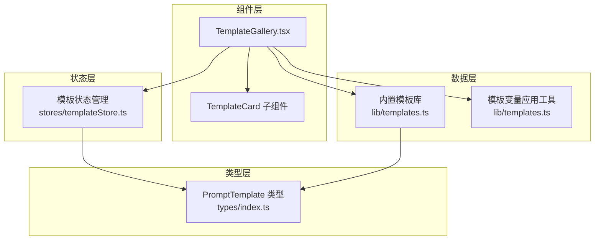
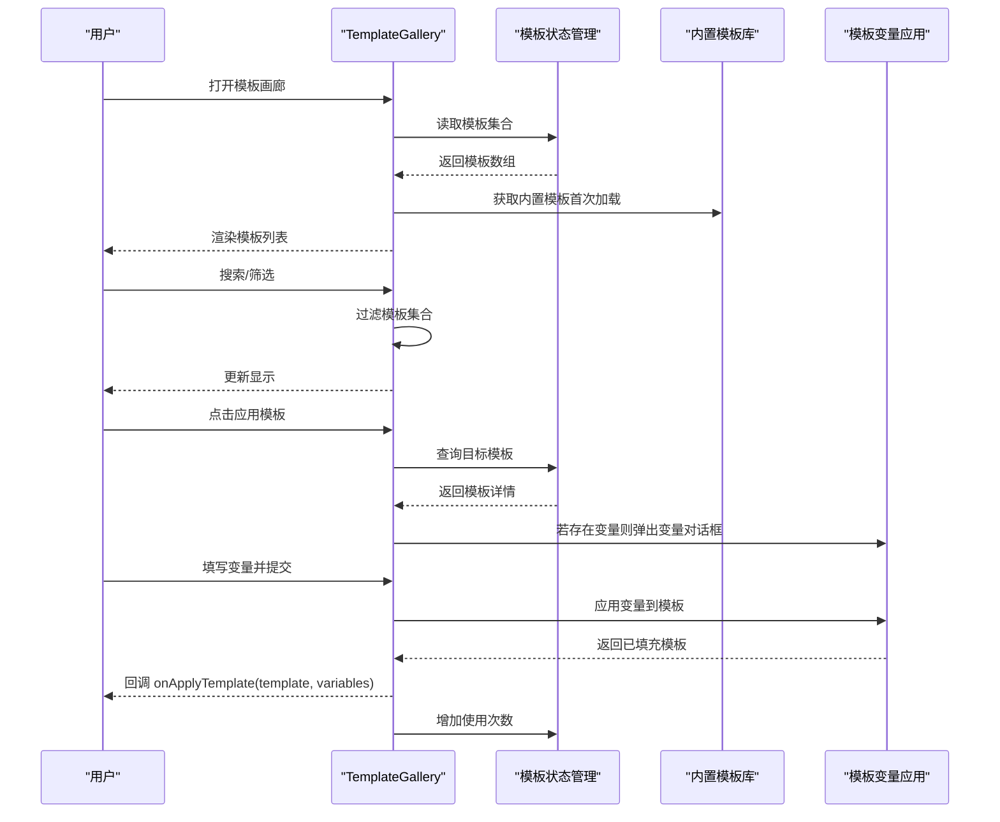
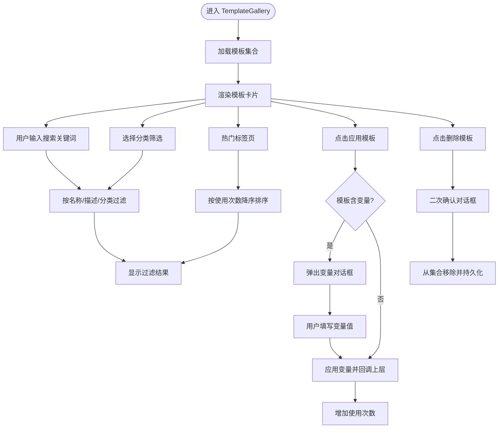
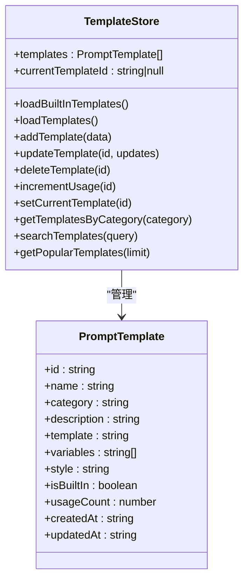
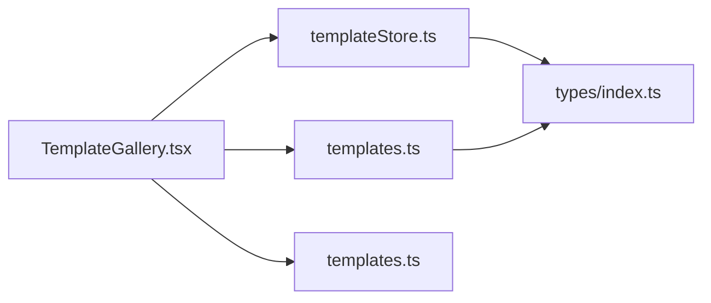

# 模板画廊

<cite>
**本文档引用的文件**
- [apps/web/src/components/editor/TemplateGallery.tsx](file://apps/web/src/components/editor/TemplateGallery.tsx)
- [apps/web/src/lib/templates.ts](file://apps/web/src/lib/templates.ts)
- [apps/web/src/stores/templateStore.ts](file://apps/web/src/stores/templateStore.ts)
- [apps/web/src/types/index.ts](file://apps/web/src/types/index.ts)
- [apps/web/src/stores/templateStore.test.ts](file://apps/web/src/stores/templateStore.test.ts)
- [apps/web/src/lib/templates.test.ts](file://apps/web/src/lib/templates.test.ts)
</cite>

## 目录

1. [简介](#简介)
2. [项目结构](#项目结构)
3. [核心组件](#核心组件)
4. [架构总览](#架构总览)
5. [详细组件分析](#详细组件分析)
6. [依赖关系分析](#依赖关系分析)
7. [性能考量](#性能考量)
8. [故障排查指南](#故障排查指南)
9. [结论](#结论)
10. [附录](#附录)

## 简介

本文件面向模板画廊组件（TemplateGallery）的使用者与维护者，系统性阐述其设计架构、功能实现与扩展方式。模板画廊提供模板浏览、搜索、分类筛选、变量填充与应用、自定义模板创建与管理等功能，并通过本地存储持久化用户自定义模板。同时，内置模板库覆盖场景锚点、动作描述、镜头提示词与风格化等多个类别，满足不同创作阶段的需求。

## 项目结构

模板画廊位于 Web 前端工程中，采用组件化与状态管理分离的组织方式：

- 组件层：TemplateGallery.tsx 实现 UI 展示与交互逻辑
- 数据层：lib/templates.ts 提供内置模板与模板变量应用工具
- 状态层：stores/templateStore.ts 管理模板集合、增删改查与持久化
- 类型层：types/index.ts 定义模板数据结构与相关类型

**图表来源**

- [apps/web/src/components/editor/TemplateGallery.tsx](file://apps/web/src/components/editor/TemplateGallery.tsx#L1-L449)
- [apps/web/src/lib/templates.ts](file://apps/web/src/lib/templates.ts#L1-L313)
- [apps/web/src/stores/templateStore.ts](file://apps/web/src/stores/templateStore.ts#L1-L143)
- [apps/web/src/types/index.ts](file://apps/web/src/types/index.ts#L1-L800)

**章节来源**

- [apps/web/src/components/editor/TemplateGallery.tsx](file://apps/web/src/components/editor/TemplateGallery.tsx#L1-L449)
- [apps/web/src/lib/templates.ts](file://apps/web/src/lib/templates.ts#L1-L313)
- [apps/web/src/stores/templateStore.ts](file://apps/web/src/stores/templateStore.ts#L1-L143)
- [apps/web/src/types/index.ts](file://apps/web/src/types/index.ts#L1-L800)

## 核心组件

- TemplateGallery：模板画廊主组件，负责模板列表渲染、搜索与筛选、分类切换、热门排序、变量填充对话框、自定义模板创建与删除。
- TemplateCard：模板卡片子组件，展示模板基本信息、标签、使用次数与变量数量，并提供应用与删除操作。
- 内置模板库：提供多种类别的模板，包含场景锚点、动作描述、镜头提示词与风格化模板。
- 模板状态管理：提供模板集合的增删改查、搜索、热门排序、使用次数统计与本地持久化。

**章节来源**

- [apps/web/src/components/editor/TemplateGallery.tsx](file://apps/web/src/components/editor/TemplateGallery.tsx#L38-L385)
- [apps/web/src/lib/templates.ts](file://apps/web/src/lib/templates.ts#L7-L281)
- [apps/web/src/stores/templateStore.ts](file://apps/web/src/stores/templateStore.ts#L5-L133)

## 架构总览

TemplateGallery 通过 useTemplateStore 访问模板状态，结合内置模板库与模板变量应用工具，实现模板的浏览、搜索、筛选与应用。组件内部使用受控表单与对话框进行自定义模板创建，使用确认对话框进行删除操作。

**图表来源**

- [apps/web/src/components/editor/TemplateGallery.tsx](file://apps/web/src/components/editor/TemplateGallery.tsx#L42-L144)
- [apps/web/src/lib/templates.ts](file://apps/web/src/lib/templates.ts#L286-L312)
- [apps/web/src/stores/templateStore.ts](file://apps/web/src/stores/templateStore.ts#L103-L110)

## 详细组件分析

### TemplateGallery 组件

- 职责
  - 模板浏览与搜索：支持关键词搜索与分类筛选
  - 模板分类与标签：按类别分组展示，内置模板带星标标签
  - 热门排序：按使用次数降序展示
  - 变量填充：对包含变量的模板弹出对话框，收集变量值并应用
  - 自定义模板：创建、更新、删除（内置模板不可修改/删除）
- 关键流程
  - 搜索与筛选：基于模板名称、描述与分类进行过滤
  - 应用模板：若模板含变量，先弹出变量对话框；否则直接回调上层应用
  - 删除模板：二次确认，防止误删
- UI 组成
  - 头部：标题、模板数量统计、创建模板按钮
  - 搜索与筛选区：搜索框与分类下拉
  - 标签页：热门、内置、自定义三个视图
  - 模板卡片：名称、描述、分类、风格标签、使用次数、变量数量、应用与删除按钮
  - 变量填充对话框：逐项输入变量值并应用

**图表来源**

- [apps/web/src/components/editor/TemplateGallery.tsx](file://apps/web/src/components/editor/TemplateGallery.tsx#L42-L144)

**章节来源**

- [apps/web/src/components/editor/TemplateGallery.tsx](file://apps/web/src/components/editor/TemplateGallery.tsx#L42-L385)

### TemplateCard 子组件

- 展示字段：名称、分类、描述、风格标签、使用次数、变量数量
- 操作按钮：复制应用、删除（非内置模板）
- 折叠区域：查看模板内容（预览）

**章节来源**

- [apps/web/src/components/editor/TemplateGallery.tsx](file://apps/web/src/components/editor/TemplateGallery.tsx#L387-L448)

### 内置模板库（BUILT_IN_TEMPLATES）

- 类别覆盖：场景锚点、动作描述、镜头提示词、风格化
- 模板结构：包含 id、name、category、description、template、variables、style、isBuiltIn、usageCount、createdAt、updatedAt
- 工具函数：
  - getTemplateById：按 id 获取模板
  - getTemplatesByCategory：按类别筛选模板
  - applyTemplateVariables：将变量对象替换到模板字符串中

**章节来源**

- [apps/web/src/lib/templates.ts](file://apps/web/src/lib/templates.ts#L7-L281)
- [apps/web/src/lib/templates.ts](file://apps/web/src/lib/templates.ts#L286-L312)

### 模板状态管理（useTemplateStore）

- 初始化：优先从 localStorage 加载自定义模板，再合并内置模板
- 操作方法：
  - addTemplate：新增自定义模板，自动生成 id、时间戳与默认值
  - updateTemplate：更新模板（内置模板禁止更新）
  - deleteTemplate：删除模板（内置模板禁止删除）
  - incrementUsage：增加使用次数
  - searchTemplates：按名称/描述/分类搜索
  - getPopularTemplates：按使用次数排序
  - getTemplatesByCategory：按类别筛选
- 持久化：仅保存非内置模板到 localStorage

**图表来源**

- [apps/web/src/stores/templateStore.ts](file://apps/web/src/stores/templateStore.ts#L5-L22)
- [apps/web/src/types/index.ts](file://apps/web/src/types/index.ts#L1-L800)

**章节来源**

- [apps/web/src/stores/templateStore.ts](file://apps/web/src/stores/templateStore.ts#L24-L143)
- [apps/web/src/types/index.ts](file://apps/web/src/types/index.ts#L1-L800)

### 模板渲染机制与变量应用

- 变量提取：创建模板时通过正则提取模板中的占位变量，去重后记录到 variables 数组
- 变量应用：应用模板时遍历变量对象，使用正则替换所有匹配的占位符
- 模板内容预览：通过 details/summary 与 pre 标签展示模板原文，便于核对

**章节来源**

- [apps/web/src/components/editor/TemplateGallery.tsx](file://apps/web/src/components/editor/TemplateGallery.tsx#L101-L132)
- [apps/web/src/lib/templates.ts](file://apps/web/src/lib/templates.ts#L299-L312)

### 搜索过滤与分类筛选

- 搜索范围：名称、描述（不区分大小写）
- 分类筛选：支持“全部分类”与各具体分类
- 热门排序：按使用次数降序排列

**章节来源**

- [apps/web/src/components/editor/TemplateGallery.tsx](file://apps/web/src/components/editor/TemplateGallery.tsx#L58-L67)
- [apps/web/src/stores/templateStore.ts](file://apps/web/src/stores/templateStore.ts#L120-L128)

### 自定义模板管理

- 创建：填写名称、分类、描述、模板内容与可选风格，自动提取变量
- 更新：仅允许更新自定义模板，内置模板禁止更新
- 删除：仅允许删除自定义模板，内置模板禁止删除
- 持久化：自定义模板保存至 localStorage，重启后仍可用

**章节来源**

- [apps/web/src/components/editor/TemplateGallery.tsx](file://apps/web/src/components/editor/TemplateGallery.tsx#L101-L132)
- [apps/web/src/stores/templateStore.ts](file://apps/web/src/stores/templateStore.ts#L73-L101)
- [apps/web/src/stores/templateStore.ts](file://apps/web/src/stores/templateStore.ts#L135-L142)

### 响应式布局设计

- 使用 ScrollArea 实现滚动区域，确保长列表可滚动
- 使用 Tabs 实现热门/内置/自定义三视图切换
- 使用 Badge、Button、Input、Textarea、Select 等 UI 组件构建一致的交互体验

**章节来源**

- [apps/web/src/components/editor/TemplateGallery.tsx](file://apps/web/src/components/editor/TemplateGallery.tsx#L298-L342)

## 依赖关系分析

- TemplateGallery 依赖 useTemplateStore 提供的模板集合与操作方法
- TemplateGallery 依赖内置模板库与模板变量应用工具
- useTemplateStore 依赖 PromptTemplate 类型定义
- 测试文件覆盖模板增删改查、搜索、热门排序与变量应用等核心行为

**图表来源**

- [apps/web/src/components/editor/TemplateGallery.tsx](file://apps/web/src/components/editor/TemplateGallery.tsx#L11-L13)
- [apps/web/src/stores/templateStore.ts](file://apps/web/src/stores/templateStore.ts#L1-L4)
- [apps/web/src/lib/templates.ts](file://apps/web/src/lib/templates.ts#L5)

**章节来源**

- [apps/web/src/stores/templateStore.test.ts](file://apps/web/src/stores/templateStore.test.ts#L1-L200)
- [apps/web/src/lib/templates.test.ts](file://apps/web/src/lib/templates.test.ts#L1-L227)

## 性能考量

- 渲染优化
  - 使用 useMemo 对过滤与排序结果进行缓存，减少不必要的重渲染
  - 使用虚拟滚动或分页策略可进一步优化长列表性能（当前使用 ScrollArea）
- 搜索与筛选
  - 搜索与筛选逻辑在内存中执行，模板数量较多时建议限制初始加载数量或引入分页
- 持久化
  - 仅保存自定义模板，避免 localStorage 过大导致性能问题
- 变量应用
  - 变量替换为字符串替换，复杂模板建议预编译或缓存替换结果

[本节为通用性能建议，不直接分析具体文件]

## 故障排查指南

- 无法删除模板
  - 确认模板是否为内置模板（内置模板禁止删除）
  - 检查控制台是否有警告信息
- 无法更新模板
  - 确认模板是否为内置模板（内置模板禁止更新）
- 搜索无效
  - 检查搜索关键词是否区分大小写（搜索不区分大小写）
  - 确认模板名称/描述是否包含关键词
- 变量未生效
  - 检查模板中的占位符格式是否为 {{变量名}}
  - 确认变量对话框中是否正确填写了变量值
- 模板未持久化
  - 检查浏览器是否禁用 localStorage
  - 确认模板是否为自定义模板（内置模板不会保存到 localStorage）

**章节来源**

- [apps/web/src/stores/templateStore.ts](file://apps/web/src/stores/templateStore.ts#L77-L96)
- [apps/web/src/stores/templateStore.ts](file://apps/web/src/stores/templateStore.ts#L135-L142)
- [apps/web/src/stores/templateStore.test.ts](file://apps/web/src/stores/templateStore.test.ts#L81-L127)
- [apps/web/src/lib/templates.test.ts](file://apps/web/src/lib/templates.test.ts#L110-L198)

## 结论

TemplateGallery 通过清晰的组件职责划分与状态管理，提供了完整的模板浏览、搜索、筛选、应用与自定义模板管理能力。内置模板库覆盖多个创作阶段，配合变量系统与本地持久化，满足从新手到进阶用户的多样化需求。后续可在长列表性能、搜索索引与模板分享等方面进一步增强。

## 附录

### 模板开发指南

- 模板命名与描述
  - 名称简洁明确，描述说明用途与效果
- 模板内容
  - 使用 {{变量名}} 定义可替换部分
  - 变量应与 variables 数组保持一致
  - 控制模板长度，保证可读性与生成效率
- 分类与风格
  - 选择合适的分类（场景、角色、动作、情绪、光影、镜头）
  - 可选填写风格标签，便于检索与筛选
- 变量设计
  - 变量名语义化，避免歧义
  - 尽量减少变量数量，提升易用性

### 质量标准

- 模板完整性：包含必要的字段（id、name、category、description、template、variables）
- 模板有效性：变量占位符与声明一致，模板内容有意义
- 搜索友好：名称与描述具有可检索性
- 性能友好：模板长度适中，避免过长导致渲染与生成压力

### 社区贡献规范

- 提交前运行测试，确保功能正常
- 遵循模板命名与分类规范
- 提供清晰的描述与示例
- 不提交敏感信息或不当内容

**章节来源**

- [apps/web/src/lib/templates.test.ts](file://apps/web/src/lib/templates.test.ts#L200-L225)
- [apps/web/src/stores/templateStore.test.ts](file://apps/web/src/stores/templateStore.test.ts#L1-L200)
