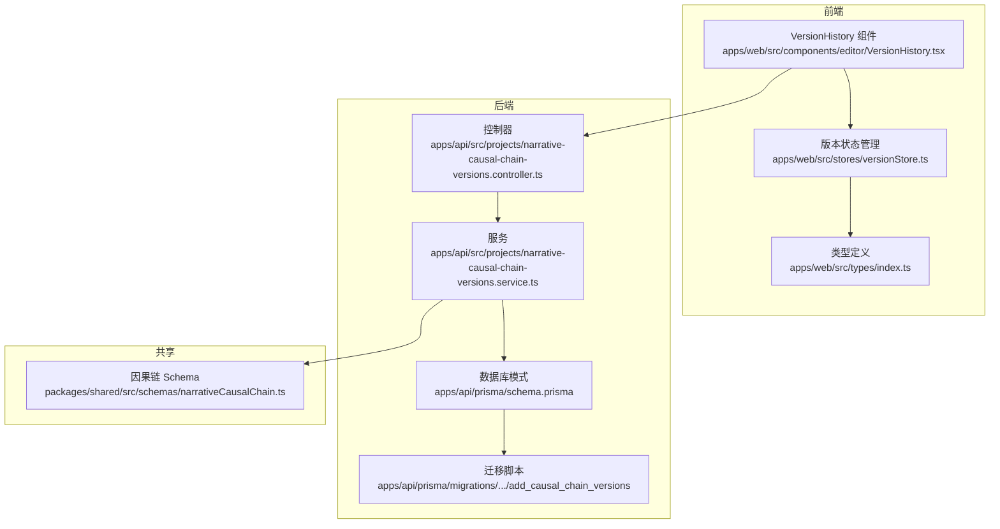
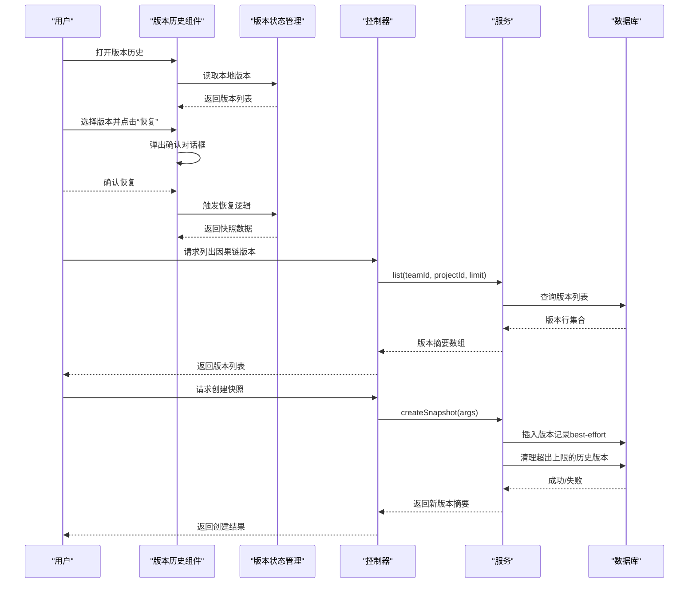
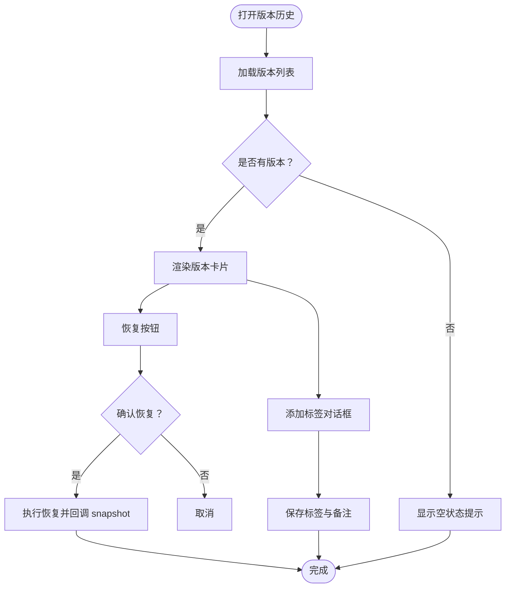
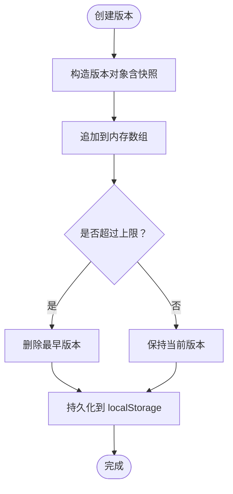
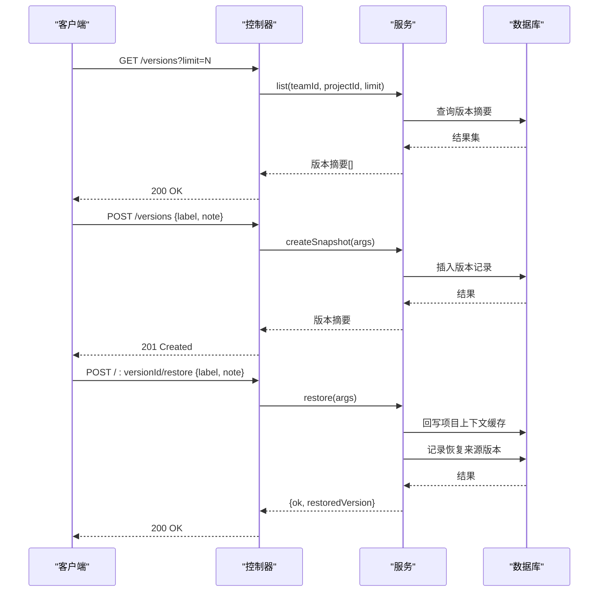
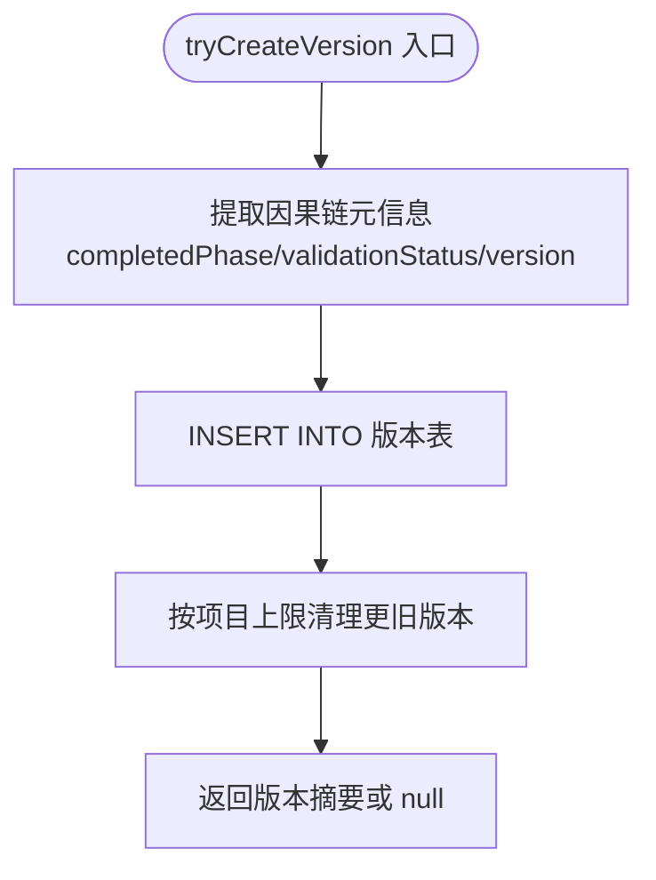
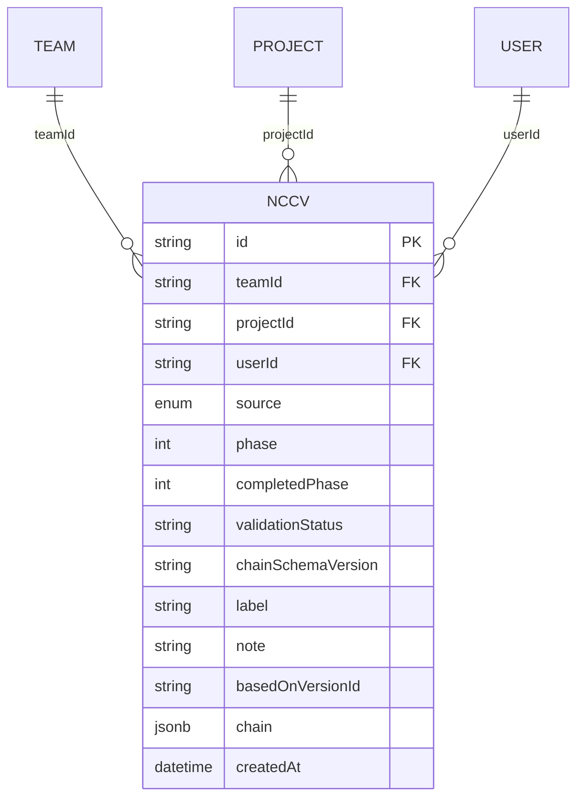
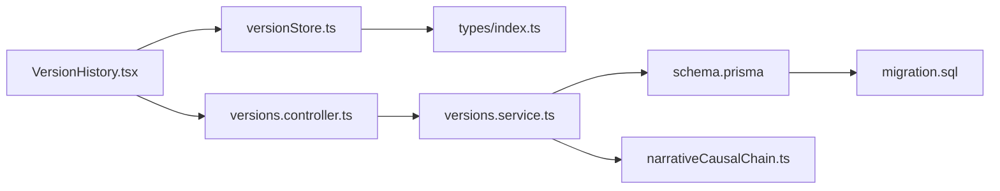

# 版本历史

<cite>
**本文档引用的文件**
- [apps/web/src/components/editor/VersionHistory.tsx](file://apps/web/src/components/editor/VersionHistory.tsx)
- [apps/web/src/stores/versionStore.ts](file://apps/web/src/stores/versionStore.ts)
- [apps/api/src/projects/narrative-causal-chain-versions.controller.ts](file://apps/api/src/projects/narrative-causal-chain-versions.controller.ts)
- [apps/api/src/projects/narrative-causal-chain-versions.service.ts](file://apps/api/src/projects/narrative-causal-chain-versions.service.ts)
- [apps/api/prisma/migrations/20251217105000_add_causal_chain_versions/migration.sql](file://apps/api/prisma/migrations/20251217105000_add_causal_chain_versions/migration.sql)
- [apps/api/prisma/schema.prisma](file://apps/api/prisma/schema.prisma)
- [packages/shared/src/schemas/narrativeCausalChain.ts](file://packages/shared/src/schemas/narrativeCausalChain.ts)
- [apps/web/src/types/index.ts](file://apps/web/src/types/index.ts)
</cite>

## 目录

1. [简介](#简介)
2. [项目结构](#项目结构)
3. [核心组件](#核心组件)
4. [架构总览](#架构总览)
5. [组件详解](#组件详解)
6. [依赖关系分析](#依赖关系分析)
7. [性能考量](#性能考量)
8. [故障排查指南](#故障排查指南)
9. [结论](#结论)
10. [附录](#附录)

## 简介

本文件围绕“版本历史”能力进行系统化文档化，重点覆盖以下方面：

- 版本管理机制：版本创建、比较、回滚与标签标注
- 叙事因果链版本控制：基于 schema 的元信息提取与版本记录
- 变更追踪与冲突解决：通过版本标签、来源类型与派生关系实现可追溯
- 版本对话框交互：版本列表展示、差异可视化与批量操作思路
- 版本标签系统：用户可读标签与备注，辅助检索与审计
- 自动保存策略与历史清理：本地与服务端的版本上限与清理策略
- 最佳实践与协作开发指南：团队协作中的版本命名、回滚规范与风险控制

## 项目结构

版本历史涉及前端组件、状态管理、API 控制器与服务端持久化四部分协同：

- 前端组件负责展示与交互（版本列表、标签对话框、恢复确认）
- 状态管理负责本地版本的增删改查与持久化到 localStorage
- API 控制器与服务负责项目级因果链版本的查询、创建与回滚
- 数据库层面提供因果链版本表与索引，保障查询与清理效率

**图表来源**

- [apps/web/src/components/editor/VersionHistory.tsx](file://apps/web/src/components/editor/VersionHistory.tsx#L1-L230)
- [apps/web/src/stores/versionStore.ts](file://apps/web/src/stores/versionStore.ts#L1-L139)
- [apps/api/src/projects/narrative-causal-chain-versions.controller.ts](file://apps/api/src/projects/narrative-causal-chain-versions.controller.ts#L1-L84)
- [apps/api/src/projects/narrative-causal-chain-versions.service.ts](file://apps/api/src/projects/narrative-causal-chain-versions.service.ts#L1-L339)
- [apps/api/prisma/schema.prisma](file://apps/api/prisma/schema.prisma#L143-L174)
- [apps/api/prisma/migrations/20251217105000_add_causal_chain_versions/migration.sql](file://apps/api/prisma/migrations/20251217105000_add_causal_chain_versions/migration.sql#L1-L37)
- [packages/shared/src/schemas/narrativeCausalChain.ts](file://packages/shared/src/schemas/narrativeCausalChain.ts#L1-L268)

**章节来源**

- [apps/web/src/components/editor/VersionHistory.tsx](file://apps/web/src/components/editor/VersionHistory.tsx#L1-L230)
- [apps/web/src/stores/versionStore.ts](file://apps/web/src/stores/versionStore.ts#L1-L139)
- [apps/api/src/projects/narrative-causal-chain-versions.controller.ts](file://apps/api/src/projects/narrative-causal-chain-versions.controller.ts#L1-L84)
- [apps/api/src/projects/narrative-causal-chain-versions.service.ts](file://apps/api/src/projects/narrative-causal-chain-versions.service.ts#L1-L339)
- [apps/api/prisma/schema.prisma](file://apps/api/prisma/schema.prisma#L143-L174)
- [apps/api/prisma/migrations/20251217105000_add_causal_chain_versions/migration.sql](file://apps/api/prisma/migrations/20251217105000_add_causal_chain_versions/migration.sql#L1-L37)
- [packages/shared/src/schemas/narrativeCausalChain.ts](file://packages/shared/src/schemas/narrativeCausalChain.ts#L1-L268)

## 核心组件

- 版本历史组件（前端）：提供版本列表、标签对话框、恢复确认与详情展开
- 版本状态管理（前端）：负责本地版本的创建、恢复、删除、清理与持久化
- 项目因果链版本控制器（后端）：提供列出、创建快照、获取与回滚接口
- 项目因果链版本服务（后端）：封装数据库访问、版本元信息提取与最佳努力插入
- 数据库模式与迁移：定义因果链版本表结构、索引与外键约束
- 共享因果链 Schema：定义版本号、校验状态、完成阶段等元信息

**章节来源**

- [apps/web/src/components/editor/VersionHistory.tsx](file://apps/web/src/components/editor/VersionHistory.tsx#L32-L88)
- [apps/web/src/stores/versionStore.ts](file://apps/web/src/stores/versionStore.ts#L5-L26)
- [apps/api/src/projects/narrative-causal-chain-versions.controller.ts](file://apps/api/src/projects/narrative-causal-chain-versions.controller.ts#L25-L81)
- [apps/api/src/projects/narrative-causal-chain-versions.service.ts](file://apps/api/src/projects/narrative-causal-chain-versions.service.ts#L65-L253)
- [apps/api/prisma/schema.prisma](file://apps/api/prisma/schema.prisma#L143-L174)
- [packages/shared/src/schemas/narrativeCausalChain.ts](file://packages/shared/src/schemas/narrativeCausalChain.ts#L175-L268)

## 架构总览

版本历史在前后端的职责边界清晰：

- 前端负责用户交互与本地版本生命周期管理（localStorage）
- 后端负责项目级因果链版本的持久化、查询与回滚，并维护版本上限与清理
- 共享 Schema 保证版本元信息的一致性与可追溯性

**图表来源**

- [apps/web/src/components/editor/VersionHistory.tsx](file://apps/web/src/components/editor/VersionHistory.tsx#L59-L74)
- [apps/web/src/stores/versionStore.ts](file://apps/web/src/stores/versionStore.ts#L75-L81)
- [apps/api/src/projects/narrative-causal-chain-versions.controller.ts](file://apps/api/src/projects/narrative-causal-chain-versions.controller.ts#L33-L53)
- [apps/api/src/projects/narrative-causal-chain-versions.service.ts](file://apps/api/src/projects/narrative-causal-chain-versions.service.ts#L65-L205)

## 组件详解

### 前端版本历史组件（VersionHistory）

- 功能要点
  - 展示项目或分镜的版本历史
  - 支持为版本添加标签与备注
  - 支持恢复到指定版本（带二次确认）
  - 展示版本快照详情（折叠展开）
- 交互设计
  - 使用确认对话框防止误操作
  - 标签对话框支持输入标签与备注
  - 版本项显示标签徽章、类型与创建时间
- 差异可视化
  - 组件当前以快照 JSON 预览形式展示，未直接实现结构化差异对比
  - 可扩展方向：引入 diff 库或对比面板，按字段粒度高亮差异
- 批量操作
  - 组件未内置批量删除/恢复功能
  - 可结合现有标签体系与筛选条件，配合后续增强实现批量操作

**图表来源**

- [apps/web/src/components/editor/VersionHistory.tsx](file://apps/web/src/components/editor/VersionHistory.tsx#L59-L87)

**章节来源**

- [apps/web/src/components/editor/VersionHistory.tsx](file://apps/web/src/components/editor/VersionHistory.tsx#L32-L229)

### 前端版本状态管理（versionStore）

- 职责
  - 本地版本的创建、恢复、删除、清理与持久化
  - 限制每个项目的版本数量（默认 50）
  - 提供按项目/目标的版本查询与排序
- 存储策略
  - 使用 localStorage 按项目隔离存储键
  - 采用内存状态 + 持久化的组合，确保刷新后仍可恢复
- 清理机制
  - 超限时删除最旧版本
  - 支持按需清理指定项目的历史版本数

**图表来源**

- [apps/web/src/stores/versionStore.ts](file://apps/web/src/stores/versionStore.ts#L42-L73)

**章节来源**

- [apps/web/src/stores/versionStore.ts](file://apps/web/src/stores/versionStore.ts#L28-L130)

### 后端因果链版本控制器（NarrativeCausalChainVersionsController）

- 路由与职责
  - GET /projects/:projectId/narrative-causal-chain/versions：列出版本（支持 limit）
  - POST /projects/:projectId/narrative-causal-chain/versions：创建快照（可带标签/备注）
  - GET /projects/:projectId/narrative-causal-chain/versions/:versionId：获取版本详情
  - POST /projects/:projectId/narrative-causal-chain/versions/:versionId/restore：回滚版本（可带标签/备注）
- 参数校验
  - 使用 Zod 对请求体进行严格校验，限制长度与可空性

**图表来源**

- [apps/api/src/projects/narrative-causal-chain-versions.controller.ts](file://apps/api/src/projects/narrative-causal-chain-versions.controller.ts#L33-L81)
- [apps/api/src/projects/narrative-causal-chain-versions.service.ts](file://apps/api/src/projects/narrative-causal-chain-versions.service.ts#L174-L253)

**章节来源**

- [apps/api/src/projects/narrative-causal-chain-versions.controller.ts](file://apps/api/src/projects/narrative-causal-chain-versions.controller.ts#L25-L81)

### 后端因果链版本服务（NarrativeCausalChainVersionsService）

- 版本创建与回滚
  - createSnapshot：从项目上下文缓存中提取因果链，写入版本记录
  - restore：将指定版本写回项目上下文缓存，并记录一次“恢复来源”的版本
- 元信息提取
  - 从因果链对象中提取完成阶段、校验状态与 schema 版本，写入版本记录
- 最佳努力插入与清理
  - tryCreateVersion：在数据库不可用或未迁移时降级返回 null，不影响主流程
  - 每次插入后按项目上限清理更旧版本，避免无限增长

**图表来源**

- [apps/api/src/projects/narrative-causal-chain-versions.service.ts](file://apps/api/src/projects/narrative-causal-chain-versions.service.ts#L258-L335)

**章节来源**

- [apps/api/src/projects/narrative-causal-chain-versions.service.ts](file://apps/api/src/projects/narrative-causal-chain-versions.service.ts#L54-L335)

### 数据库模式与迁移（NarrativeCausalChainVersion）

- 表结构
  - 主键：id
  - 外键：teamId → Team, projectId → Project, userId → User
  - JSONB 字段：chain 存放完整因果链
  - 元信息：phase、completedPhase、validationStatus、chainSchemaVersion、label、note、basedOnVersionId
- 索引
  - 按项目与时间倒序索引，优化查询与清理
- 迁移
  - 定义枚举类型与表结构，建立索引与外键约束

**图表来源**

- [apps/api/prisma/schema.prisma](file://apps/api/prisma/schema.prisma#L143-L174)
- [apps/api/prisma/migrations/20251217105000_add_causal_chain_versions/migration.sql](file://apps/api/prisma/migrations/20251217105000_add_causal_chain_versions/migration.sql#L4-L37)

**章节来源**

- [apps/api/prisma/schema.prisma](file://apps/api/prisma/schema.prisma#L143-L174)
- [apps/api/prisma/migrations/20251217105000_add_causal_chain_versions/migration.sql](file://apps/api/prisma/migrations/20251217105000_add_causal_chain_versions/migration.sql#L1-L37)

### 共享因果链 Schema（版本元信息）

- 版本号：用于数据迁移与演进
- 校验状态：pass / needs_revision / incomplete
- 完成阶段：0-4，与工作流阶段对应
- 结构化对象：包含大纲、冲突引擎、信息层、节拍流程、交织与校验等

**章节来源**

- [packages/shared/src/schemas/narrativeCausalChain.ts](file://packages/shared/src/schemas/narrativeCausalChain.ts#L175-L268)

## 依赖关系分析

- 前端组件依赖状态管理与 UI 组件库
- 状态管理依赖类型定义与本地存储
- 控制器依赖服务与认证守卫
- 服务依赖 Prisma 与共享 Schema
- 数据库依赖迁移脚本与索引

**图表来源**

- [apps/web/src/components/editor/VersionHistory.tsx](file://apps/web/src/components/editor/VersionHistory.tsx#L11-L28)
- [apps/web/src/stores/versionStore.ts](file://apps/web/src/stores/versionStore.ts#L1-L4)
- [apps/api/src/projects/narrative-causal-chain-versions.controller.ts](file://apps/api/src/projects/narrative-causal-chain-versions.controller.ts#L1-L7)
- [apps/api/src/projects/narrative-causal-chain-versions.service.ts](file://apps/api/src/projects/narrative-causal-chain-versions.service.ts#L1-L4)
- [apps/api/prisma/schema.prisma](file://apps/api/prisma/schema.prisma#L143-L174)
- [packages/shared/src/schemas/narrativeCausalChain.ts](file://packages/shared/src/schemas/narrativeCausalChain.ts#L1-L4)

**章节来源**

- [apps/web/src/components/editor/VersionHistory.tsx](file://apps/web/src/components/editor/VersionHistory.tsx#L11-L28)
- [apps/web/src/stores/versionStore.ts](file://apps/web/src/stores/versionStore.ts#L1-L4)
- [apps/api/src/projects/narrative-causal-chain-versions.controller.ts](file://apps/api/src/projects/narrative-causal-chain-versions.controller.ts#L1-L7)
- [apps/api/src/projects/narrative-causal-chain-versions.service.ts](file://apps/api/src/projects/narrative-causal-chain-versions.service.ts#L1-L4)
- [apps/api/prisma/schema.prisma](file://apps/api/prisma/schema.prisma#L143-L174)
- [packages/shared/src/schemas/narrativeCausalChain.ts](file://packages/shared/src/schemas/narrativeCausalChain.ts#L1-L4)

## 性能考量

- 查询性能
  - 数据库按项目与时间倒序索引，支持高效分页与排序
  - 控制器限制查询上限，避免大范围扫描
- 写入性能
  - tryCreateVersion 采用 best-effort 插入，失败不阻断主流程
  - 插入后立即按项目上限清理，避免无限增长
- 前端性能
  - localStorage 存储适合小规模版本，建议控制快照体积
  - 大型快照建议仅存储必要字段或采用增量快照策略

[本节为通用性能建议，不直接分析具体文件]

## 故障排查指南

- 版本列表为空
  - 前端：检查本地存储键是否存在与解析是否成功
  - 后端：确认项目存在且数据库迁移已完成
- 创建快照失败
  - 后端：检查项目上下文缓存中是否存在因果链对象
  - 数据库：确认迁移已执行，表与索引存在
- 回滚后未生效
  - 后端：确认回写项目上下文缓存成功，且恢复来源版本记录正确
- 版本过多导致性能下降
  - 后端：确认清理逻辑按项目上限执行
  - 前端：确认本地版本上限设置合理

**章节来源**

- [apps/web/src/stores/versionStore.ts](file://apps/web/src/stores/versionStore.ts#L32-L40)
- [apps/api/src/projects/narrative-causal-chain-versions.service.ts](file://apps/api/src/projects/narrative-causal-chain-versions.service.ts#L111-L116)
- [apps/api/src/projects/narrative-causal-chain-versions.service.ts](file://apps/api/src/projects/narrative-causal-chain-versions.service.ts#L187-L190)
- [apps/api/src/projects/narrative-causal-chain-versions.service.ts](file://apps/api/src/projects/narrative-causal-chain-versions.service.ts#L305-L317)

## 结论

版本历史能力通过“前端本地版本 + 后端项目因果链版本”的双轨设计，实现了从用户交互到数据持久化的完整闭环。其核心优势在于：

- 可追溯：版本来源类型、派生关系与元信息清晰
- 可恢复：一键回滚并记录恢复来源
- 可治理：版本上限与清理策略保障系统健康
- 可扩展：标签与备注体系为后续差异对比与批量操作奠定基础

## 附录

### 版本标签系统与最佳实践

- 标签命名建议
  - 语义化：如“初版”“修订版”“终审版”
  - 时间化：如“2026-01-20”
  - 阶段化：如“冲突引擎完成”“信息层完成”
- 备注说明建议
  - 记录关键变更点、影响范围与风险提示
- 团队协作建议
  - 统一标签命名规范与回滚审批流程
  - 在合并/发布前打上明确标签与备注
  - 对重大回滚进行审计与通知

[本节为通用实践建议，不直接分析具体文件]

### 自动保存策略与历史清理机制

- 自动保存
  - 前端：在关键操作（如编辑、生成）后自动创建版本
  - 后端：在因果链变更时尝试记录版本（best-effort）
- 历史清理
  - 前端：每项目最多保留 N 个版本（默认 50）
  - 后端：每次插入后按项目上限清理更旧版本

**章节来源**

- [apps/web/src/stores/versionStore.ts](file://apps/web/src/stores/versionStore.ts#L30-L31)
- [apps/web/src/stores/versionStore.ts](file://apps/web/src/stores/versionStore.ts#L58-L64)
- [apps/api/src/projects/narrative-causal-chain-versions.service.ts](file://apps/api/src/projects/narrative-causal-chain-versions.service.ts#L258-L317)

### 叙事因果链版本控制与冲突解决

- 元信息驱动
  - 通过 completedPhase、validationStatus、chainSchemaVersion 实现阶段化与一致性校验
- 冲突解决
  - 回滚到最近一次通过校验的版本
  - 通过标签与备注记录冲突原因与修复方案
  - 建议在团队内约定“校验状态”的含义与流转规则

**章节来源**

- [packages/shared/src/schemas/narrativeCausalChain.ts](file://packages/shared/src/schemas/narrativeCausalChain.ts#L177-L182)
- [apps/api/src/projects/narrative-causal-chain-versions.service.ts](file://apps/api/src/projects/narrative-causal-chain-versions.service.ts#L31-L44)

### 版本对话框交互设计与差异可视化

- 交互设计
  - 确认对话框降低误操作风险
  - 标签对话框支持快速标注与备注
- 差异可视化
  - 当前组件以快照 JSON 预览展示
  - 建议引入结构化对比面板，按字段粒度高亮差异
- 批量操作
  - 可结合标签筛选与排序，扩展批量删除/恢复能力

**章节来源**

- [apps/web/src/components/editor/VersionHistory.tsx](file://apps/web/src/components/editor/VersionHistory.tsx#L182-L226)
- [apps/web/src/components/editor/VersionHistory.tsx](file://apps/web/src/components/editor/VersionHistory.tsx#L167-L175)
