# 编辑器组件

<cite>
**本文档引用的文件**
- [apps/web/src/components/Editor.tsx](file://apps/web/src/components/Editor.tsx)
- [apps/web/src/components/editor/EpisodeWorkflow.tsx](file://apps/web/src/components/editor/EpisodeWorkflow.tsx)
- [apps/web/src/components/editor/WorkflowStepper.tsx](file://apps/web/src/components/editor/WorkflowStepper.tsx)
- [apps/web/src/components/editor/SceneGeneration.tsx](file://apps/web/src/components/editor/SceneGeneration.tsx)
- [apps/web/src/components/editor/SceneRefinement.tsx](file://apps/web/src/components/editor/SceneRefinement.tsx)
- [apps/web/src/components/editor/AIParameterTuner.tsx](file://apps/web/src/components/editor/AIParameterTuner.tsx)
- [apps/web/src/components/editor/CharacterManager.tsx](file://apps/web/src/components/editor/CharacterManager.tsx)
- [apps/web/src/components/editor/BasicSettings.tsx](file://apps/web/src/components/editor/BasicSettings.tsx)
- [apps/web/src/components/editor/WorkflowWorkbench.tsx](file://apps/web/src/components/editor/WorkflowWorkbench.tsx)
- [apps/web/src/stores/projectStore.ts](file://apps/web/src/stores/projectStore.ts)
- [apps/web/src/lib/workflowV2/state.ts](file://apps/web/src/lib/workflowV2/state.ts)
- [apps/web/src/lib/workflowV2/index.ts](file://apps/web/src/lib/workflowV2/index.ts)
- [apps/web/src/types/index.ts](file://apps/web/src/types/index.ts)
</cite>

## 目录

1. [简介](#简介)
2. [项目结构](#项目结构)
3. [核心组件](#核心组件)
4. [架构总览](#架构总览)
5. [详细组件分析](#详细组件分析)
6. [依赖分析](#依赖分析)
7. [性能考量](#性能考量)
8. [故障排查指南](#故障排查指南)
9. [结论](#结论)
10. [附录](#附录)

## 简介

本文件面向AIXSSS前端应用的编辑器组件，系统性阐述Editor主组件的架构设计、工作流集成与状态管理机制，并深入解析以下功能模块：

- AI参数调优（AIParameterTuner）
- 角色管理（CharacterManager）
- 场景生成（SceneGeneration）
- 场景细化（SceneRefinement）
- 工作流推进（WorkflowStepper、EpisodeWorkflow）

同时，文档将阐明编辑器组件间的通信机制、数据流转与状态同步方式，给出可扩展性设计、插件系统与自定义功能开发建议，并提供集成指南与最佳实践。

## 项目结构

编辑器相关代码集中于apps/web/src/components/editor目录，配合stores与lib/workflowV2实现状态管理与工作流编排。Editor作为入口组件，根据运行模式（本地/后端）选择不同的工作流视图：在后端模式下渲染EpisodeWorkflow，在本地模式下渲染旧版编辑器（LegacyEditor）。

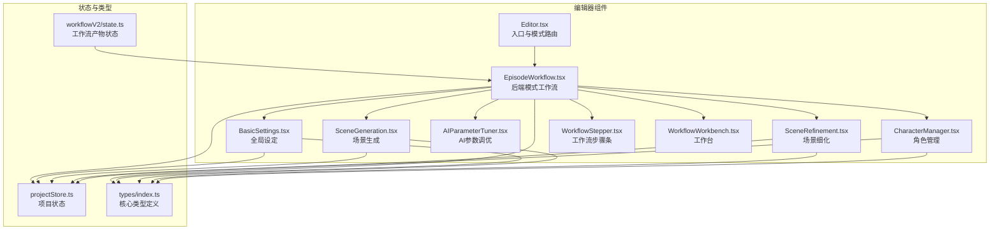

**图表来源**

- [apps/web/src/components/Editor.tsx](file://apps/web/src/components/Editor.tsx#L42-L45)
- [apps/web/src/components/editor/EpisodeWorkflow.tsx](file://apps/web/src/components/editor/EpisodeWorkflow.tsx#L311-L361)
- [apps/web/src/stores/projectStore.ts](file://apps/web/src/stores/projectStore.ts#L46-L180)
- [apps/web/src/lib/workflowV2/state.ts](file://apps/web/src/lib/workflowV2/state.ts#L27-L74)
- [apps/web/src/types/index.ts](file://apps/web/src/types/index.ts#L453-L468)

**章节来源**

- [apps/web/src/components/Editor.tsx](file://apps/web/src/components/Editor.tsx#L42-L45)
- [apps/web/src/stores/projectStore.ts](file://apps/web/src/stores/projectStore.ts#L46-L180)
- [apps/web/src/lib/workflowV2/state.ts](file://apps/web/src/lib/workflowV2/state.ts#L27-L74)
- [apps/web/src/types/index.ts](file://apps/web/src/types/index.ts#L453-L468)

## 核心组件

- Editor：统一入口，按运行模式切换至EpisodeWorkflow或Legacy编辑器。
- EpisodeWorkflow：后端模式下的全流程工作流容器，负责剧集规划、场景细化、产物状态管理与导出。
- SceneGeneration：分镜列表生成与编辑，支持AI生成、手动添加、排序与确认。
- SceneRefinement：分镜细化流水线（场景锚点→关键帧→运动/台词），支持批量细化与中断。
- AIParameterTuner：参数调优UI，提供预设与实时效果预览。
- CharacterManager：角色全生命周期管理，支持AI生成角色卡与定妆照提示词。
- BasicSettings：全局设定（故事梗概、美术风格、主角描述）与草稿保存。
- WorkflowStepper：工作流步骤导航条。
- WorkflowWorkbench：工作台视图，展示项目/剧集产物状态、待办任务与质量检查。

**章节来源**

- [apps/web/src/components/Editor.tsx](file://apps/web/src/components/Editor.tsx#L42-L45)
- [apps/web/src/components/editor/EpisodeWorkflow.tsx](file://apps/web/src/components/editor/EpisodeWorkflow.tsx#L311-L361)
- [apps/web/src/components/editor/SceneGeneration.tsx](file://apps/web/src/components/editor/SceneGeneration.tsx#L53-L110)
- [apps/web/src/components/editor/SceneRefinement.tsx](file://apps/web/src/components/editor/SceneRefinement.tsx#L131-L170)
- [apps/web/src/components/editor/AIParameterTuner.tsx](file://apps/web/src/components/editor/AIParameterTuner.tsx#L42-L100)
- [apps/web/src/components/editor/CharacterManager.tsx](file://apps/web/src/components/editor/CharacterManager.tsx#L230-L250)
- [apps/web/src/components/editor/BasicSettings.tsx](file://apps/web/src/components/editor/BasicSettings.tsx#L88-L120)
- [apps/web/src/components/editor/WorkflowStepper.tsx](file://apps/web/src/components/editor/WorkflowStepper.tsx#L21-L35)
- [apps/web/src/components/editor/WorkflowWorkbench.tsx](file://apps/web/src/components/editor/WorkflowWorkbench.tsx#L237-L247)

## 架构总览

编辑器采用“入口组件 + 工作流容器 + 功能模块 + 状态与类型”的分层架构：

- 入口组件（Editor）根据运行模式选择工作流视图。
- 工作流容器（EpisodeWorkflow）聚合多个功能模块，协调状态与API调用。
- 功能模块各自封装职责边界，通过store与lib进行数据与逻辑复用。
- 类型系统（types）与工作流产物状态（workflowV2/state）保障前后端一致的产物成熟度语义。

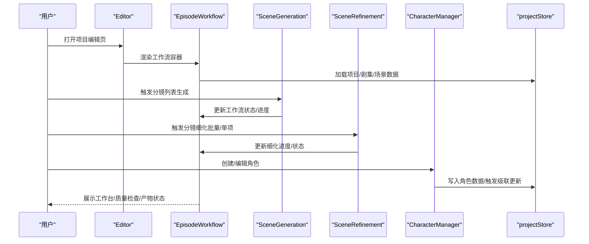

**图表来源**

- [apps/web/src/components/Editor.tsx](file://apps/web/src/components/Editor.tsx#L42-L45)
- [apps/web/src/components/editor/EpisodeWorkflow.tsx](file://apps/web/src/components/editor/EpisodeWorkflow.tsx#L311-L361)
- [apps/web/src/components/editor/SceneGeneration.tsx](file://apps/web/src/components/editor/SceneGeneration.tsx#L112-L206)
- [apps/web/src/components/editor/SceneRefinement.tsx](file://apps/web/src/components/editor/SceneRefinement.tsx#L422-L591)
- [apps/web/src/components/editor/CharacterManager.tsx](file://apps/web/src/components/editor/CharacterManager.tsx#L684-L750)
- [apps/web/src/stores/projectStore.ts](file://apps/web/src/stores/projectStore.ts#L46-L180)

## 详细组件分析

### Editor主组件与模式路由

- Editor根据运行模式（isApiMode）选择渲染EpisodeWorkflow或Legacy编辑器。
- Legacy编辑器内部维护工作流步骤与批量生成逻辑，封装AI调用、格式修复与调试日志。

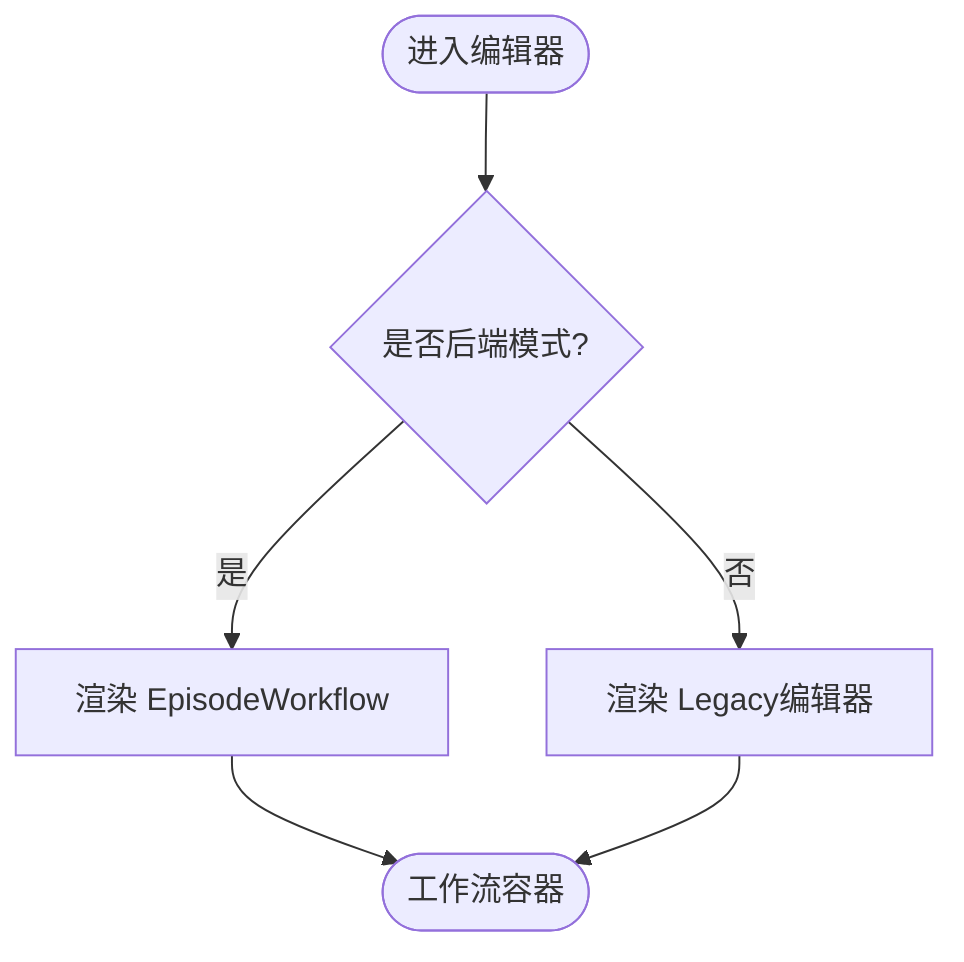

**图表来源**

- [apps/web/src/components/Editor.tsx](file://apps/web/src/components/Editor.tsx#L42-L45)

**章节来源**

- [apps/web/src/components/Editor.tsx](file://apps/web/src/components/Editor.tsx#L42-L45)

### EpisodeWorkflow工作流容器

- 职责：统一调度剧集规划、场景生成、细化、产物状态与导出；聚合工作台视图与质量检查。
- 状态：维护当前步骤（workbench/global/causal/plan/episode/export）、剧集/场景数据、批量细化进度、作业进度与错误。
- 通信：通过store与API模块协作，使用事件派发（window.CustomEvent）驱动步骤切换。

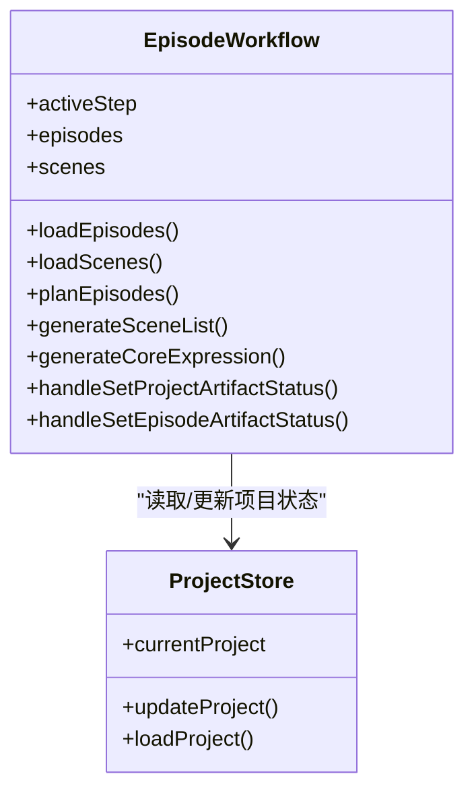

**图表来源**

- [apps/web/src/components/editor/EpisodeWorkflow.tsx](file://apps/web/src/components/editor/EpisodeWorkflow.tsx#L311-L361)
- [apps/web/src/stores/projectStore.ts](file://apps/web/src/stores/projectStore.ts#L46-L180)

**章节来源**

- [apps/web/src/components/editor/EpisodeWorkflow.tsx](file://apps/web/src/components/editor/EpisodeWorkflow.tsx#L311-L361)
- [apps/web/src/stores/projectStore.ts](file://apps/web/src/stores/projectStore.ts#L46-L180)

### SceneGeneration场景生成

- 功能：AI生成分镜列表、手动添加、排序、确认进入细化流程。
- 状态：生成中进度、错误提示、是否已确认。
- API：后端模式通过API队列与进度监听，本地模式通过AIFactory直连。

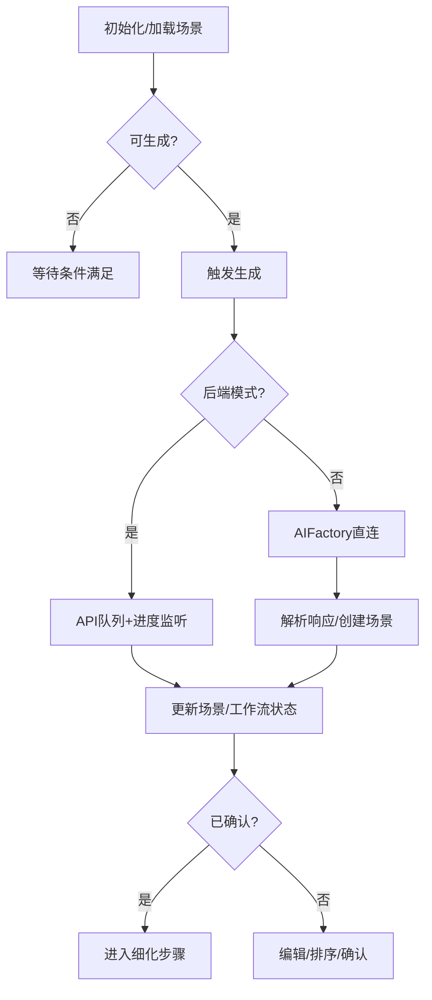

**图表来源**

- [apps/web/src/components/editor/SceneGeneration.tsx](file://apps/web/src/components/editor/SceneGeneration.tsx#L112-L206)
- [apps/web/src/components/editor/SceneGeneration.tsx](file://apps/web/src/components/editor/SceneGeneration.tsx#L374-L390)

**章节来源**

- [apps/web/src/components/editor/SceneGeneration.tsx](file://apps/web/src/components/editor/SceneGeneration.tsx#L53-L110)
- [apps/web/src/components/editor/SceneGeneration.tsx](file://apps/web/src/components/editor/SceneGeneration.tsx#L112-L206)
- [apps/web/src/components/editor/SceneGeneration.tsx](file://apps/web/src/components/editor/SceneGeneration.tsx#L374-L390)

### SceneRefinement场景细化

- 流水线：场景锚点 → 关键帧提示词 → 时空/运动提示词 → 台词。
- 支持：单场景细化、批量细化、跳过步骤、手动覆盖、中断与取消。
- 上下文：风格提示词、角色、世界观注入、Token压缩与格式修复。

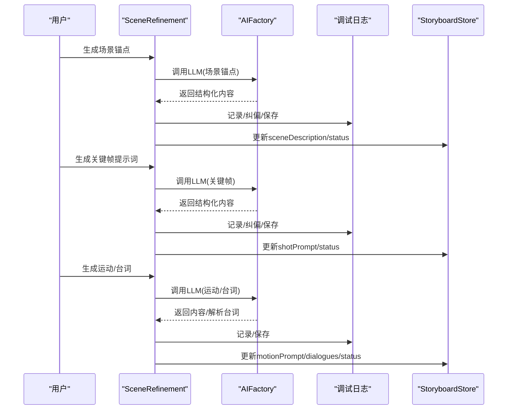

**图表来源**

- [apps/web/src/components/editor/SceneRefinement.tsx](file://apps/web/src/components/editor/SceneRefinement.tsx#L422-L591)
- [apps/web/src/components/editor/SceneRefinement.tsx](file://apps/web/src/components/editor/SceneRefinement.tsx#L594-L742)
- [apps/web/src/components/editor/SceneRefinement.tsx](file://apps/web/src/components/editor/SceneRefinement.tsx#L744-L800)

**章节来源**

- [apps/web/src/components/editor/SceneRefinement.tsx](file://apps/web/src/components/editor/SceneRefinement.tsx#L131-L170)
- [apps/web/src/components/editor/SceneRefinement.tsx](file://apps/web/src/components/editor/SceneRefinement.tsx#L422-L591)
- [apps/web/src/components/editor/SceneRefinement.tsx](file://apps/web/src/components/editor/SceneRefinement.tsx#L594-L742)
- [apps/web/src/components/editor/SceneRefinement.tsx](file://apps/web/src/components/editor/SceneRefinement.tsx#L744-L800)

### AIParameterTuner参数调优

- 功能：温度、核采样、最大Token、主题/重复惩罚等参数调节；预设（创意/平衡/保守）；推理强度（针对特定模型）。
- 效果预览：创意度、稳定性、多样性、长度倾向指标。

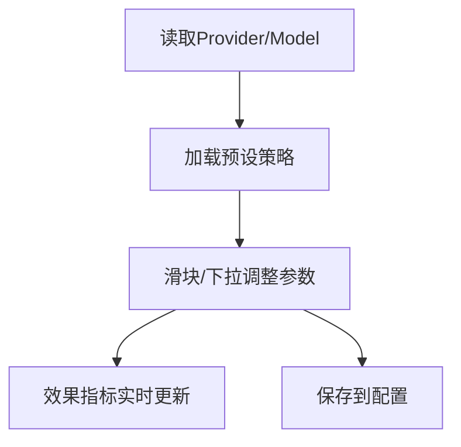

**图表来源**

- [apps/web/src/components/editor/AIParameterTuner.tsx](file://apps/web/src/components/editor/AIParameterTuner.tsx#L42-L100)
- [apps/web/src/components/editor/AIParameterTuner.tsx](file://apps/web/src/components/editor/AIParameterTuner.tsx#L360-L411)
- [apps/web/src/components/editor/AIParameterTuner.tsx](file://apps/web/src/components/editor/AIParameterTuner.tsx#L437-L457)

**章节来源**

- [apps/web/src/components/editor/AIParameterTuner.tsx](file://apps/web/src/components/editor/AIParameterTuner.tsx#L42-L100)
- [apps/web/src/components/editor/AIParameterTuner.tsx](file://apps/web/src/components/editor/AIParameterTuner.tsx#L360-L411)
- [apps/web/src/components/editor/AIParameterTuner.tsx](file://apps/web/src/components/editor/AIParameterTuner.tsx#L437-L457)

### CharacterManager角色管理

- 功能：角色创建/编辑/删除；AI生成角色卡与定妆照提示词；画风自动传递；级联更新影响分析与标记。
- 状态：草稿保存、生成任务跟踪、对话框步骤（基础/定妆）。

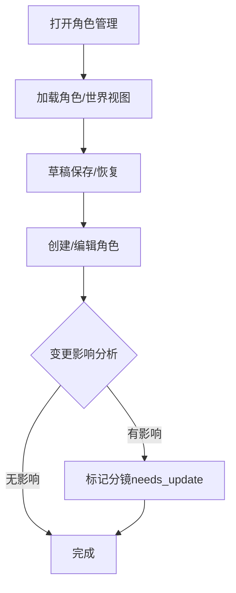

**图表来源**

- [apps/web/src/components/editor/CharacterManager.tsx](file://apps/web/src/components/editor/CharacterManager.tsx#L230-L250)
- [apps/web/src/components/editor/CharacterManager.tsx](file://apps/web/src/components/editor/CharacterManager.tsx#L684-L750)

**章节来源**

- [apps/web/src/components/editor/CharacterManager.tsx](file://apps/web/src/components/editor/CharacterManager.tsx#L230-L250)
- [apps/web/src/components/editor/CharacterManager.tsx](file://apps/web/src/components/editor/CharacterManager.tsx#L684-L750)

### BasicSettings全局设定

- 功能：故事梗概、美术风格（内置/自定义）、主角描述；草稿自动保存与手动保存；进入下一步。
- 画风：支持自定义画风创建/编辑/删除，合成完整提示词。

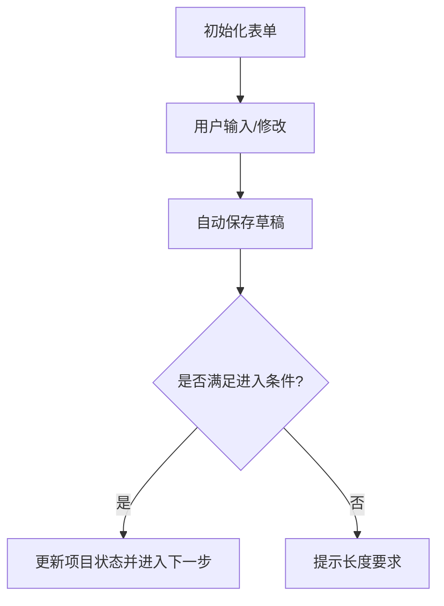

**图表来源**

- [apps/web/src/components/editor/BasicSettings.tsx](file://apps/web/src/components/editor/BasicSettings.tsx#L88-L120)
- [apps/web/src/components/editor/BasicSettings.tsx](file://apps/web/src/components/editor/BasicSettings.tsx#L192-L206)
- [apps/web/src/components/editor/BasicSettings.tsx](file://apps/web/src/components/editor/BasicSettings.tsx#L217-L232)

**章节来源**

- [apps/web/src/components/editor/BasicSettings.tsx](file://apps/web/src/components/editor/BasicSettings.tsx#L88-L120)
- [apps/web/src/components/editor/BasicSettings.tsx](file://apps/web/src/components/editor/BasicSettings.tsx#L192-L206)
- [apps/web/src/components/editor/BasicSettings.tsx](file://apps/web/src/components/editor/BasicSettings.tsx#L217-L232)

### WorkflowStepper与WorkflowWorkbench

- WorkflowStepper：步骤导航（工作台/全局设定/因果链/剧集规划/单集创作/导出）。
- WorkflowWorkbench：工作台视图，展示项目/剧集产物状态、待办任务、质量检查与一致性报告。

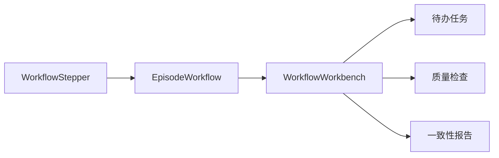

**图表来源**

- [apps/web/src/components/editor/WorkflowStepper.tsx](file://apps/web/src/components/editor/WorkflowStepper.tsx#L21-L35)
- [apps/web/src/components/editor/WorkflowWorkbench.tsx](file://apps/web/src/components/editor/WorkflowWorkbench.tsx#L237-L247)

**章节来源**

- [apps/web/src/components/editor/WorkflowStepper.tsx](file://apps/web/src/components/editor/WorkflowStepper.tsx#L21-L35)
- [apps/web/src/components/editor/WorkflowWorkbench.tsx](file://apps/web/src/components/editor/WorkflowWorkbench.tsx#L237-L247)

## 依赖分析

- 组件耦合：Editor与EpisodeWorkflow强耦合；EpisodeWorkflow聚合多个功能模块；各模块通过store与lib解耦。
- 外部依赖：API模块（后端模式）、AIFactory（本地/后端模式）、调试日志与格式修复工具。
- 类型系统：types/index.ts提供统一的数据结构与工作流状态枚举；workflowV2/state.ts提供产物状态规范化。

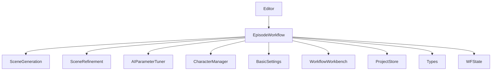

**图表来源**

- [apps/web/src/components/Editor.tsx](file://apps/web/src/components/Editor.tsx#L42-L45)
- [apps/web/src/components/editor/EpisodeWorkflow.tsx](file://apps/web/src/components/editor/EpisodeWorkflow.tsx#L311-L361)
- [apps/web/src/stores/projectStore.ts](file://apps/web/src/stores/projectStore.ts#L46-L180)
- [apps/web/src/lib/workflowV2/state.ts](file://apps/web/src/lib/workflowV2/state.ts#L27-L74)
- [apps/web/src/types/index.ts](file://apps/web/src/types/index.ts#L453-L468)

**章节来源**

- [apps/web/src/components/Editor.tsx](file://apps/web/src/components/Editor.tsx#L42-L45)
- [apps/web/src/components/editor/EpisodeWorkflow.tsx](file://apps/web/src/components/editor/EpisodeWorkflow.tsx#L311-L361)
- [apps/web/src/stores/projectStore.ts](file://apps/web/src/stores/projectStore.ts#L46-L180)
- [apps/web/src/lib/workflowV2/state.ts](file://apps/web/src/lib/workflowV2/state.ts#L27-L74)
- [apps/web/src/types/index.ts](file://apps/web/src/types/index.ts#L453-L468)

## 性能考量

- 本地模式批处理：Legacy编辑器的批量生成采用轮询与暂停/取消机制，避免长时间阻塞UI。
- 后端模式异步：EpisodeWorkflow通过API队列与进度监听，避免阻塞主线程。
- 上下文压缩：SceneRefinement在接近Token上限时进行项目上下文压缩，降低调用成本。
- 状态缓存：useMemo/useCallback优化渲染与计算，避免不必要的重渲染。
- 存储落盘：页面可见性变化与卸载事件触发patch队列落盘，减少数据丢失风险。

[本节为通用指导，不直接分析具体文件]

## 故障排查指南

- 生成失败：查看调试日志（logAICall/updateLogWithError），定位AI调用错误与格式修复失败。
- 批量生成中断：检查批量状态（isBatchGenerating/batchOperations）与取消标志，确认是否被其他任务抢占。
- Token超限：启用上下文压缩与格式修复，合理设置最大Token。
- 产物状态异常：检查workflowV2状态归一化逻辑（getProjectWorkflowV2/getEpisodeWorkflowV2）。
- 画风配置：确认ArtStyleConfig合成逻辑与自定义画风ID规则。

**章节来源**

- [apps/web/src/components/editor/SceneRefinement.tsx](file://apps/web/src/components/editor/SceneRefinement.tsx#L577-L591)
- [apps/web/src/components/editor/SceneRefinement.tsx](file://apps/web/src/components/editor/SceneRefinement.tsx#L594-L742)
- [apps/web/src/lib/workflowV2/state.ts](file://apps/web/src/lib/workflowV2/state.ts#L27-L74)
- [apps/web/src/types/index.ts](file://apps/web/src/types/index.ts#L228-L238)

## 结论

编辑器组件通过清晰的分层与模块化设计，实现了从全局设定到场景细化再到产物导出的完整工作流。EpisodeWorkflow作为核心容器，有效整合了AI参数调优、角色管理、场景生成与细化等功能模块，并通过store与类型系统保障状态一致性与可扩展性。后端模式下的异步作业与工作台视图进一步提升了生产效率与质量控制能力。

[本节为总结性内容，不直接分析具体文件]

## 附录

- 集成指南
  - 在后端模式下，确保配置中绑定AI Profile ID，并通过API队列提交作业。
  - 在本地模式下，配置AIFactory所需Provider/Model/API Key。
  - 使用AIParameterTuner统一管理生成参数，结合格式修复与调试日志提升稳定性。
- 最佳实践
  - 先完善全局设定（故事梗概、美术风格、角色），再进入场景生成与细化。
  - 使用工作台视图定期检查质量与一致性，及时标记与修复问题。
  - 合理设置批量细化策略，避免过度并发导致资源争用。
  - 利用草稿保存与版本管理，确保创作过程可追溯。

[本节为通用指导，不直接分析具体文件]
