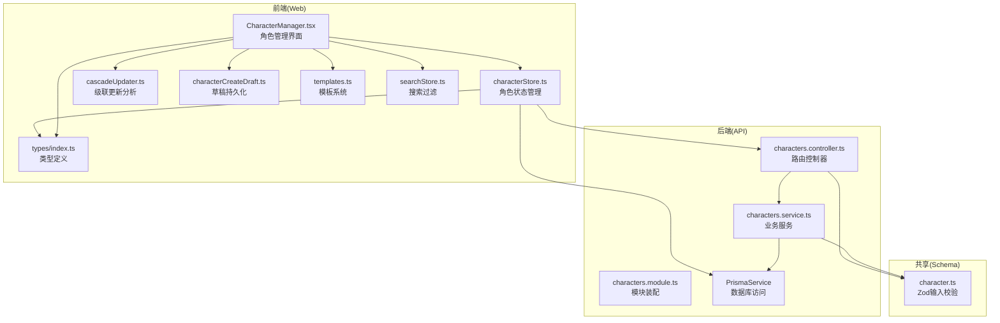
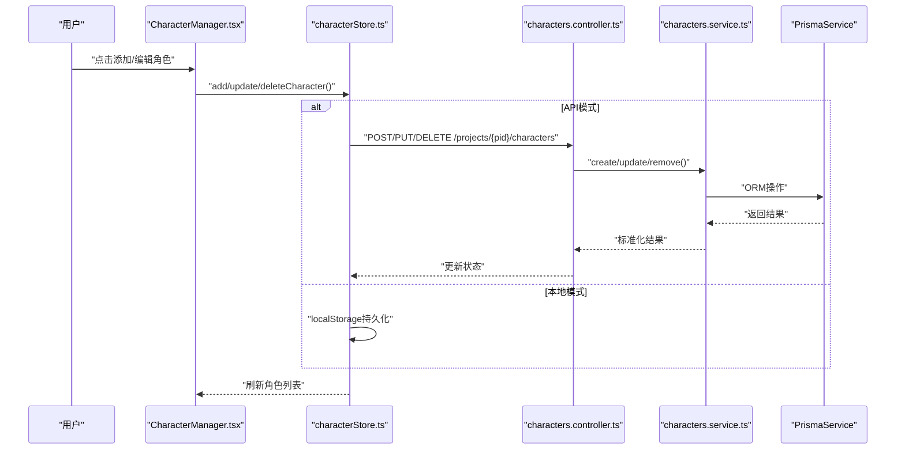
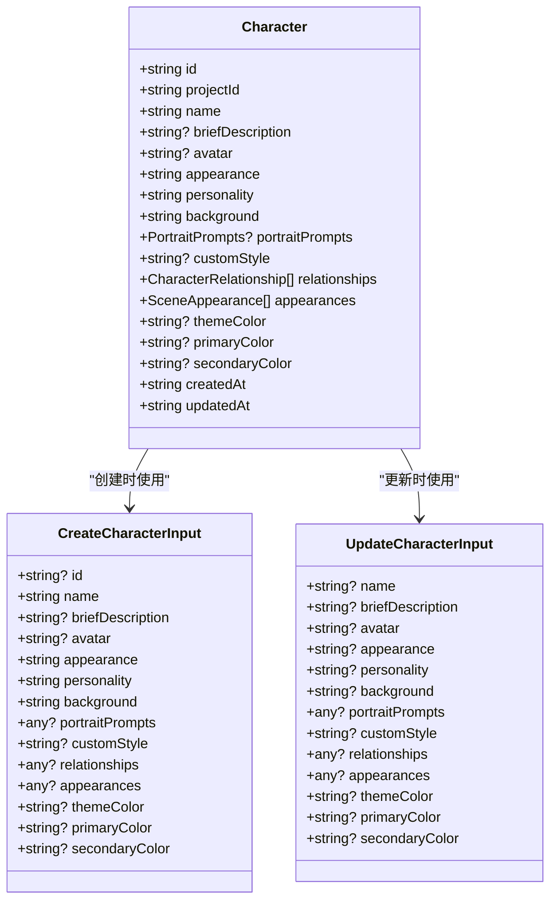
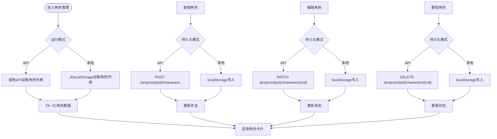
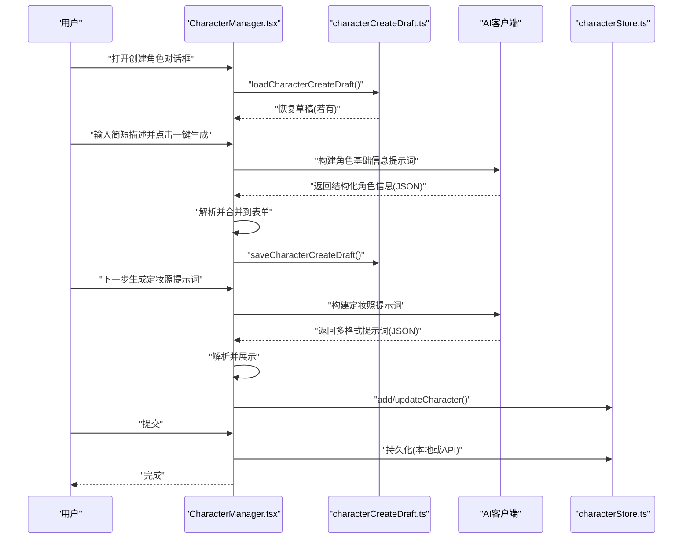
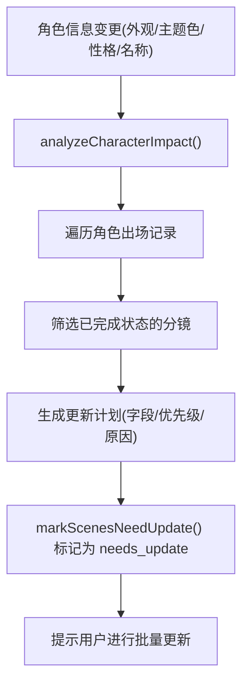
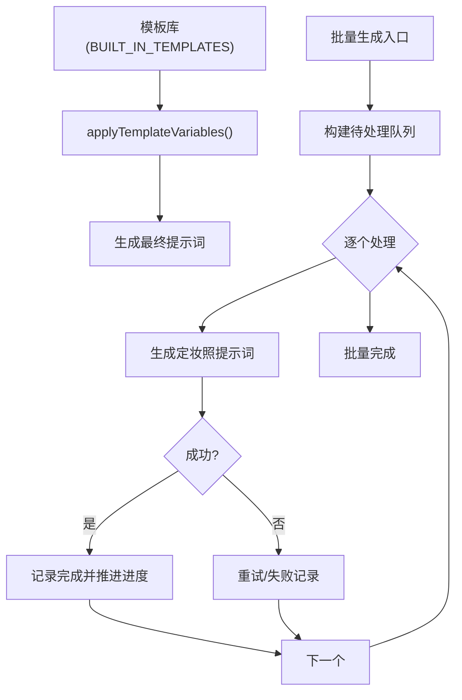
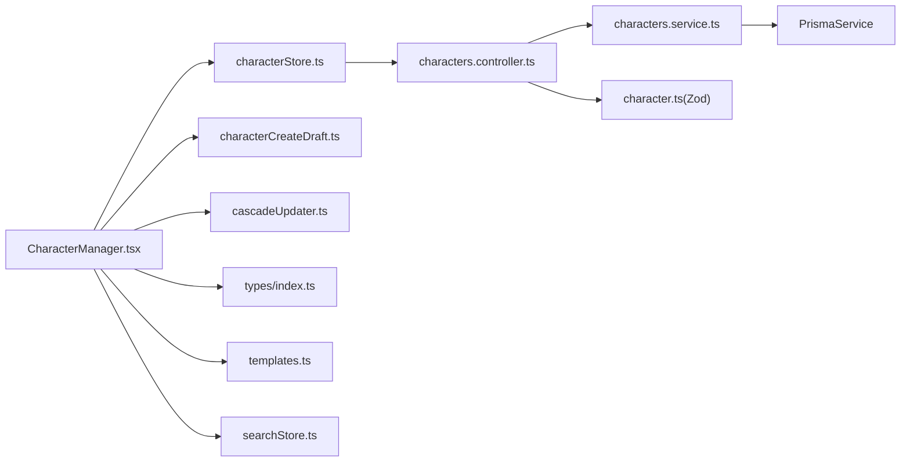

# 角色管理器

<cite>
**本文档引用的文件**
- [apps/api/src/characters/characters.controller.ts](file://apps/api/src/characters/characters.controller.ts)
- [apps/api/src/characters/characters.service.ts](file://apps/api/src/characters/characters.service.ts)
- [apps/api/src/characters/characters.module.ts](file://apps/api/src/characters/characters.module.ts)
- [apps/web/src/components/editor/CharacterManager.tsx](file://apps/web/src/components/editor/CharacterManager.tsx)
- [apps/web/src/stores/characterStore.ts](file://apps/web/src/stores/characterStore.ts)
- [apps/web/src/lib/ai/cascadeUpdater.ts](file://apps/web/src/lib/ai/cascadeUpdater.ts)
- [apps/web/src/lib/characterCreateDraft.ts](file://apps/web/src/lib/characterCreateDraft.ts)
- [packages/shared/src/schemas/character.ts](file://packages/shared/src/schemas/character.ts)
- [apps/web/src/types/index.ts](file://apps/web/src/types/index.ts)
- [apps/web/src/stores/searchStore.ts](file://apps/web/src/stores/searchStore.ts)
- [apps/web/src/lib/templates.ts](file://apps/web/src/lib/templates.ts)
</cite>

## 目录

1. [简介](#简介)
2. [项目结构](#项目结构)
3. [核心组件](#核心组件)
4. [架构总览](#架构总览)
5. [详细组件分析](#详细组件分析)
6. [依赖关系分析](#依赖关系分析)
7. [性能考虑](#性能考虑)
8. [故障排除指南](#故障排除指南)
9. [结论](#结论)
10. [附录](#附录)

## 简介

本文件为角色管理器组件的全面技术文档，涵盖角色创建、编辑、删除、关系管理、出场记录管理、模板系统、批量操作与搜索过滤机制。文档从架构设计、数据模型、状态管理、持久化策略、级联更新与一致性保障等方面进行深入剖析，并提供最佳实践与排障建议。

## 项目结构

角色管理器涉及前后端协同：前端负责用户界面、状态管理与AI生成流程；后端提供REST API与数据库访问；共享层定义输入校验与数据模型。

**图表来源**

- [apps/web/src/components/editor/CharacterManager.tsx](file://apps/web/src/components/editor/CharacterManager.tsx#L1-L3009)
- [apps/web/src/stores/characterStore.ts](file://apps/web/src/stores/characterStore.ts#L1-L346)
- [apps/api/src/characters/characters.controller.ts](file://apps/api/src/characters/characters.controller.ts#L1-L47)
- [apps/api/src/characters/characters.service.ts](file://apps/api/src/characters/characters.service.ts#L1-L118)
- [apps/api/src/characters/characters.module.ts](file://apps/api/src/characters/characters.module.ts#L1-L12)
- [packages/shared/src/schemas/character.ts](file://packages/shared/src/schemas/character.ts#L1-L32)
- [apps/web/src/types/index.ts](file://apps/web/src/types/index.ts#L1-L1019)

**章节来源**

- [apps/web/src/components/editor/CharacterManager.tsx](file://apps/web/src/components/editor/CharacterManager.tsx#L1-L3009)
- [apps/web/src/stores/characterStore.ts](file://apps/web/src/stores/characterStore.ts#L1-L346)
- [apps/api/src/characters/characters.controller.ts](file://apps/api/src/characters/characters.controller.ts#L1-L47)
- [apps/api/src/characters/characters.service.ts](file://apps/api/src/characters/characters.service.ts#L1-L118)
- [apps/api/src/characters/characters.module.ts](file://apps/api/src/characters/characters.module.ts#L1-L12)
- [packages/shared/src/schemas/character.ts](file://packages/shared/src/schemas/character.ts#L1-L32)
- [apps/web/src/types/index.ts](file://apps/web/src/types/index.ts#L1-L1019)

## 核心组件

- 角色管理界面：提供角色增删改、AI生成、批量操作、级联更新提示等功能。
- 角色状态管理：统一管理角色列表、当前角色、加载状态与持久化。
- 级联更新分析：分析角色变更对分镜的影响，提供批量标记更新能力。
- 草稿系统：在创建角色过程中自动保存草稿，支持恢复与丢弃。
- 模板系统：内置提示词模板，支持按类别应用与变量替换。
- 搜索过滤：支持项目与分镜的全文检索与筛选。

**章节来源**

- [apps/web/src/components/editor/CharacterManager.tsx](file://apps/web/src/components/editor/CharacterManager.tsx#L1-L3009)
- [apps/web/src/stores/characterStore.ts](file://apps/web/src/stores/characterStore.ts#L1-L346)
- [apps/web/src/lib/ai/cascadeUpdater.ts](file://apps/web/src/lib/ai/cascadeUpdater.ts#L1-L694)
- [apps/web/src/lib/characterCreateDraft.ts](file://apps/web/src/lib/characterCreateDraft.ts#L1-L116)
- [apps/web/src/lib/templates.ts](file://apps/web/src/lib/templates.ts#L1-L313)
- [apps/web/src/stores/searchStore.ts](file://apps/web/src/stores/searchStore.ts#L1-L131)

## 架构总览

前端采用React + Zustand状态管理，后端采用NestJS + Prisma。角色数据在本地localStorage与后端数据库之间双向同步，支持API模式与离线模式切换。

**图表来源**

- [apps/web/src/components/editor/CharacterManager.tsx](file://apps/web/src/components/editor/CharacterManager.tsx#L684-L749)
- [apps/web/src/stores/characterStore.ts](file://apps/web/src/stores/characterStore.ts#L181-L255)
- [apps/api/src/characters/characters.controller.ts](file://apps/api/src/characters/characters.controller.ts#L14-L43)
- [apps/api/src/characters/characters.service.ts](file://apps/api/src/characters/characters.service.ts#L44-L114)

**章节来源**

- [apps/web/src/components/editor/CharacterManager.tsx](file://apps/web/src/components/editor/CharacterManager.tsx#L684-L749)
- [apps/web/src/stores/characterStore.ts](file://apps/web/src/stores/characterStore.ts#L181-L255)
- [apps/api/src/characters/characters.controller.ts](file://apps/api/src/characters/characters.controller.ts#L14-L43)
- [apps/api/src/characters/characters.service.ts](file://apps/api/src/characters/characters.service.ts#L44-L114)

## 详细组件分析

### 数据模型与输入校验

- 角色数据模型包含基础信息、外观、性格、背景、主题色、定制风格、关系数组、出场记录、定妆照提示词与参考图等字段。
- 输入校验使用Zod Schema，确保前后端一致的字段约束与默认值处理。

**图表来源**

- [apps/web/src/types/index.ts](file://apps/web/src/types/index.ts#L1-L1019)
- [packages/shared/src/schemas/character.ts](file://packages/shared/src/schemas/character.ts#L1-L32)

**章节来源**

- [apps/web/src/types/index.ts](file://apps/web/src/types/index.ts#L1-L1019)
- [packages/shared/src/schemas/character.ts](file://packages/shared/src/schemas/character.ts#L1-L32)

### 状态管理与持久化

- 角色状态集中于characterStore，提供加载、新增、更新、删除、出场记录与定妆照提示词更新等操作。
- 支持API模式与本地模式：API模式通过HTTP调用后端；本地模式通过localStorage持久化，便于离线使用与快速迭代。
- 归一化处理：将后端返回或localStorage中的角色数据转换为统一的Character对象结构，确保字段完整性与默认值填充。

**图表来源**

- [apps/web/src/stores/characterStore.ts](file://apps/web/src/stores/characterStore.ts#L152-L332)

**章节来源**

- [apps/web/src/stores/characterStore.ts](file://apps/web/src/stores/characterStore.ts#L152-L332)

### 角色创建与编辑流程

- 支持两种创建路径：手动填写或通过AI生成完整角色卡（外观/性格/背景）。
- 定妆照提示词支持Midjourney、Stable Diffusion与通用格式，可批量生成与复制。
- 草稿系统在对话框打开时自动恢复，关闭或切换时自动保存，支持丢弃草稿。

**图表来源**

- [apps/web/src/components/editor/CharacterManager.tsx](file://apps/web/src/components/editor/CharacterManager.tsx#L842-L1185)
- [apps/web/src/lib/characterCreateDraft.ts](file://apps/web/src/lib/characterCreateDraft.ts#L35-L99)
- [apps/web/src/stores/characterStore.ts](file://apps/web/src/stores/characterStore.ts#L181-L213)

**章节来源**

- [apps/web/src/components/editor/CharacterManager.tsx](file://apps/web/src/components/editor/CharacterManager.tsx#L842-L1185)
- [apps/web/src/lib/characterCreateDraft.ts](file://apps/web/src/lib/characterCreateDraft.ts#L35-L99)
- [apps/web/src/stores/characterStore.ts](file://apps/web/src/stores/characterStore.ts#L181-L213)

### 关系管理与出场记录

- 角色关系：通过relationships字段维护与其他角色的关系类型与描述。
- 出场记录：通过appearances字段记录角色在哪些分镜中出现及角色定位（主演/配角/背景）。
- 级联更新：当角色外观、主题色或性格等关键信息变更时，分析受影响的分镜并标记为“需要更新”。

**图表来源**

- [apps/web/src/lib/ai/cascadeUpdater.ts](file://apps/web/src/lib/ai/cascadeUpdater.ts#L331-L401)
- [apps/web/src/lib/ai/cascadeUpdater.ts](file://apps/web/src/lib/ai/cascadeUpdater.ts#L228-L238)

**章节来源**

- [apps/web/src/lib/ai/cascadeUpdater.ts](file://apps/web/src/lib/ai/cascadeUpdater.ts#L331-L401)
- [apps/web/src/lib/ai/cascadeUpdater.ts](file://apps/web/src/lib/ai/cascadeUpdater.ts#L228-L238)

### 模板系统与批量操作

- 模板系统：内置多种提示词模板（场景锚点、动作描述、镜头提示词、风格化），支持按类别获取与变量替换。
- 批量操作：支持批量生成定妆照提示词，包含队列管理、暂停/继续、取消、进度跟踪与失败重试。

**图表来源**

- [apps/web/src/lib/templates.ts](file://apps/web/src/lib/templates.ts#L286-L312)
- [apps/web/src/components/editor/CharacterManager.tsx](file://apps/web/src/components/editor/CharacterManager.tsx#L1718-L1975)

**章节来源**

- [apps/web/src/lib/templates.ts](file://apps/web/src/lib/templates.ts#L286-L312)
- [apps/web/src/components/editor/CharacterManager.tsx](file://apps/web/src/components/editor/CharacterManager.tsx#L1718-L1975)

### 搜索过滤机制

- 支持项目标题、摘要、主角、画风关键词与分镜摘要、场景描述、动作描述、提示词等字段的模糊搜索。
- 支持按分镜状态筛选，结合查询历史与结果缓存提升交互效率。

**章节来源**

- [apps/web/src/stores/searchStore.ts](file://apps/web/src/stores/searchStore.ts#L52-L98)

## 依赖关系分析

**图表来源**

- [apps/web/src/components/editor/CharacterManager.tsx](file://apps/web/src/components/editor/CharacterManager.tsx#L1-L3009)
- [apps/web/src/stores/characterStore.ts](file://apps/web/src/stores/characterStore.ts#L1-L346)
- [apps/api/src/characters/characters.controller.ts](file://apps/api/src/characters/characters.controller.ts#L1-L47)
- [apps/api/src/characters/characters.service.ts](file://apps/api/src/characters/characters.service.ts#L1-L118)
- [packages/shared/src/schemas/character.ts](file://packages/shared/src/schemas/character.ts#L1-L32)
- [apps/web/src/lib/templates.ts](file://apps/web/src/lib/templates.ts#L1-L313)
- [apps/web/src/stores/searchStore.ts](file://apps/web/src/stores/searchStore.ts#L1-L131)

**章节来源**

- [apps/web/src/components/editor/CharacterManager.tsx](file://apps/web/src/components/editor/CharacterManager.tsx#L1-L3009)
- [apps/web/src/stores/characterStore.ts](file://apps/web/src/stores/characterStore.ts#L1-L346)
- [apps/api/src/characters/characters.controller.ts](file://apps/api/src/characters/characters.controller.ts#L1-L47)
- [apps/api/src/characters/characters.service.ts](file://apps/api/src/characters/characters.service.ts#L1-L118)
- [packages/shared/src/schemas/character.ts](file://packages/shared/src/schemas/character.ts#L1-L32)
- [apps/web/src/lib/templates.ts](file://apps/web/src/lib/templates.ts#L1-L313)
- [apps/web/src/stores/searchStore.ts](file://apps/web/src/stores/searchStore.ts#L1-L131)

## 性能考虑

- 状态最小化：仅在必要时更新角色列表，避免不必要的重渲染。
- 批量操作节流：批量生成定妆照时添加短暂延迟，降低请求峰值。
- 草稿持久化：减少用户输入丢失风险，提高交互效率。
- 搜索优化：使用小写化与索引策略，避免大列表全量扫描。
- 级联更新策略：规则引擎优先，AI分析作为降级，平衡准确性与性能。

## 故障排除指南

- AI生成失败
  - 检查网络连接与模型配置，查看进度面板中的错误详情。
  - 使用“复制AI原始返回/解析详情”辅助定位问题。
  - 对于格式异常，系统会自动尝试JSON修复，若仍失败可重试或手动修正。
- 角色删除后分镜异常
  - 删除角色后应检查受影响分镜状态，按提示进行批量更新。
  - 使用“标记更新”将相关分镜标记为“需要更新”，随后重新生成。
- 草稿丢失
  - 确认浏览器localStorage可用，对话框关闭/切换时会自动保存。
  - 可通过“丢弃草稿”按钮清理无效草稿，重新开始。

**章节来源**

- [apps/web/src/components/editor/CharacterManager.tsx](file://apps/web/src/components/editor/CharacterManager.tsx#L1156-L1185)
- [apps/web/src/lib/ai/cascadeUpdater.ts](file://apps/web/src/lib/ai/cascadeUpdater.ts#L331-L401)
- [apps/web/src/lib/characterCreateDraft.ts](file://apps/web/src/lib/characterCreateDraft.ts#L83-L99)

## 结论

角色管理器通过清晰的前后端分离架构、完善的输入校验与状态管理、灵活的模板与批量操作能力，以及严谨的级联更新与一致性保障，为创作团队提供了高效、可靠的多模态角色管理解决方案。建议在实际使用中结合项目规模与团队协作习惯，合理选择API模式与本地模式，并充分利用草稿与模板系统提升生产效率。

## 附录

- 最佳实践
  - 优先使用AI生成角色基础信息，再完善细节。
  - 为角色配置定妆照提示词，建立统一的视觉规范。
  - 定期使用级联更新功能同步角色变更，保持分镜一致性。
  - 利用模板系统标准化提示词生成流程。
- 数据一致性保障
  - 前端归一化处理与后端Zod校验双重保障。
  - 级联更新分析与标记机制确保变更可追踪。
  - 草稿系统与进度面板提供可观测性与可恢复性。
