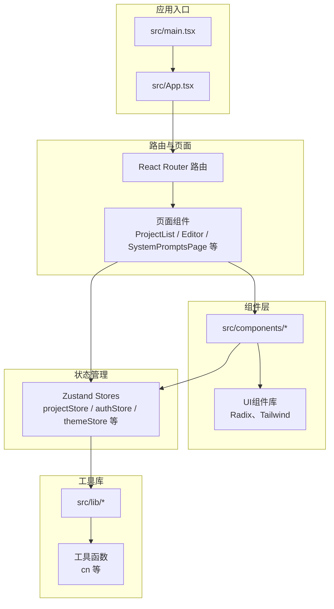
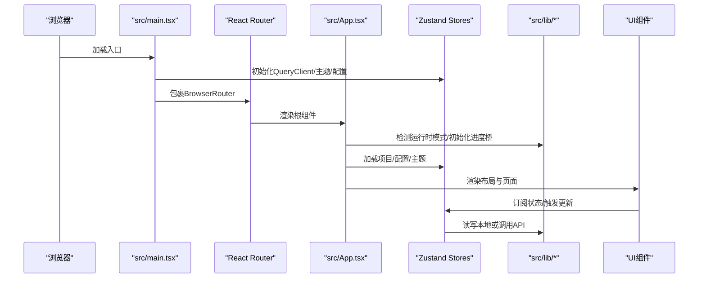
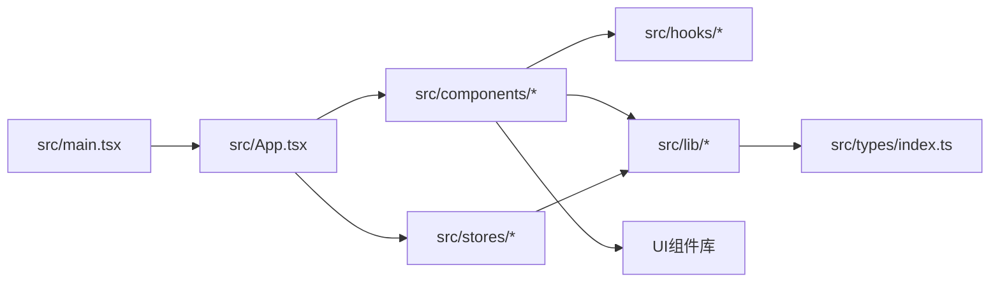

# 项目结构

<cite>
**本文档引用的文件**
- [apps/web/package.json](file://apps/web/package.json)
- [apps/web/vite.config.ts](file://apps/web/vite.config.ts)
- [apps/web/tsconfig.json](file://apps/web/tsconfig.json)
- [apps/web/tsconfig.app.json](file://apps/web/tsconfig.app.json)
- [apps/web/tsconfig.node.json](file://apps/web/tsconfig.node.json)
- [apps/web/eslint.config.js](file://apps/web/eslint.config.js)
- [apps/web/tailwind.config.js](file://apps/web/tailwind.config.js)
- [apps/web/postcss.config.js](file://apps/web/postcss.config.js)
- [apps/web/src/main.tsx](file://apps/web/src/main.tsx)
- [apps/web/src/App.tsx](file://apps/web/src/App.tsx)
- [apps/web/src/types/index.ts](file://apps/web/src/types/index.ts)
- [apps/web/src/lib/utils.ts](file://apps/web/src/lib/utils.ts)
- [apps/web/src/lib/storage.ts](file://apps/web/src/lib/storage.ts)
- [apps/web/src/stores/projectStore.ts](file://apps/web/src/stores/projectStore.ts)
- [apps/web/src/stores/store.test.ts](file://apps/web/src/stores/store.test.ts)
- [apps/web/src/hooks/use-toast.ts](file://apps/web/src/hooks/use-toast.ts)
</cite>

## 目录

1. [简介](#简介)
2. [项目结构](#项目结构)
3. [核心组件](#核心组件)
4. [架构总览](#架构总览)
5. [详细组件分析](#详细组件分析)
6. [依赖关系分析](#依赖关系分析)
7. [性能考量](#性能考量)
8. [故障排查指南](#故障排查指南)
9. [结论](#结论)
10. [附录](#附录)

## 简介

本文件面向AIXSSS前端应用，系统性梳理基于React + TypeScript + Vite的现代Web应用的项目结构与工程实践。重点覆盖src目录的组织原则与职责划分：components（组件层）、lib（工具库）、stores（状态管理）、hooks（自定义钩子）、types（类型定义）。同时详解路由配置与懒加载策略、构建配置与开发服务器设置、tsconfig编译选项、ESLint代码规范与TailwindCSS样式体系，并提供最佳实践与排障建议。

## 项目结构

前端应用位于apps/web，采用monorepo工作区组织，核心目录如下：

- src/components：页面与功能组件，按canvas、editor、layout、ui等模块化拆分
- src/lib：工具库与业务能力封装，包括AI能力、API客户端、运行时模式、工作流与存储等
- src/stores：状态管理，基于Zustand实现的领域状态（项目、场景、配置、主题等）
- src/hooks：自定义Hook，如键盘快捷键、Toast通知、移动端适配等
- src/types：统一类型定义，涵盖项目、场景、分镜、AI配置、工作流状态等
- 构建与配置：Vite、TypeScript、ESLint、TailwindCSS、PostCSS

图表来源

- [apps/web/src/main.tsx](file://apps/web/src/main.tsx#L1-L37)
- [apps/web/src/App.tsx](file://apps/web/src/App.tsx#L1-L392)

章节来源

- [apps/web/package.json](file://apps/web/package.json#L1-L95)
- [apps/web/vite.config.ts](file://apps/web/vite.config.ts#L1-L94)
- [apps/web/tsconfig.json](file://apps/web/tsconfig.json#L1-L11)

## 核心组件

- 路由与懒加载：App.tsx内对Editor、ConfigDialog、SettingsDialog、DevPanel、ProjectSearch、SystemPromptsPage等进行懒加载，配合Suspense提供加载占位，提升首屏性能与交互体验。
- 状态管理：Zustand stores集中管理项目、场景、配置、主题、AI进度等状态，支持本地与API两种持久化模式切换。
- 工具库：lib目录封装AI能力（providers、factory、streaming等）、API客户端、运行时模式检测、工作流与模板、存储与批处理、性能工具等。
- 类型系统：types/index.ts提供项目、场景、分镜、AI配置、工作流状态等强类型定义，贯穿组件与store。
- 自定义Hook：如use-toast提供全局Toast通知，useKeyboardShortcut提供快捷键绑定，use-mobile适配移动端。

章节来源

- [apps/web/src/App.tsx](file://apps/web/src/App.tsx#L27-L76)
- [apps/web/src/stores/projectStore.ts](file://apps/web/src/stores/projectStore.ts#L1-L181)
- [apps/web/src/lib/storage.ts](file://apps/web/src/lib/storage.ts#L1-L200)
- [apps/web/src/types/index.ts](file://apps/web/src/types/index.ts#L1-L200)
- [apps/web/src/hooks/use-toast.ts](file://apps/web/src/hooks/use-toast.ts#L1-L190)

## 架构总览

应用启动流程与关键依赖关系如下：

图表来源

- [apps/web/src/main.tsx](file://apps/web/src/main.tsx#L1-L37)
- [apps/web/src/App.tsx](file://apps/web/src/App.tsx#L98-L126)

章节来源

- [apps/web/src/main.tsx](file://apps/web/src/main.tsx#L1-L37)
- [apps/web/src/App.tsx](file://apps/web/src/App.tsx#L1-L392)

## 详细组件分析

### 组件层：components

- canvas：画布节点与聊天面板，支撑Agent Canvas编辑器
- editor：工作台与编辑器相关功能，如参数调节、角色管理、场景生成与精炼、版本历史等
- layout：应用布局与侧边栏
- ui：基于Radix UI与Tailwind的通用UI组件集合

最佳实践

- 组件按功能域拆分，避免跨域耦合
- 使用Suspense与懒加载减少首屏体积
- 通过cn工具函数合并类名，确保样式可控

章节来源

- [apps/web/src/lib/utils.ts](file://apps/web/src/lib/utils.ts#L1-L7)

### 工具库：lib

- agent：Agent构建与图谱
- ai：AI供应商适配（DeepSeek、Kimi、Gemini、OpenAI兼容、Doubao Ark）、工厂、流式处理、提示词解析、上下文构建与压缩、进度桥、用量统计等
- api：与后端交互的HTTP客户端与各领域API（项目、场景、角色、作业等）
- runtime：运行时模式检测（本地/后端）
- systemPrompts：系统提示词索引
- workflowV2：工作流V2产物与任务视角的状态与处理

最佳实践

- 将AI能力抽象为统一接口，便于多供应商切换
- 使用批处理与防抖降低localStorage压力
- 对敏感配置进行加密存储，支持密钥轮换与迁移

章节来源

- [apps/web/src/lib/storage.ts](file://apps/web/src/lib/storage.ts#L1-L200)

### 状态管理：stores

- projectStore：项目生命周期管理（创建、更新、删除、加载）
- authStore：认证状态（登录页、用户信息）
- themeStore：主题初始化与切换
- configStore：AI配置档案与连接测试
- episode/scene/storyboard等：分镜与剧集工作流状态
- aiProgressStore/aiUsageStore：AI进度与用量统计

最佳实践

- 使用create选择器订阅，避免不必要的重渲染
- 在API模式与本地模式之间无缝切换
- 通过测试验证store行为与数据一致性

章节来源

- [apps/web/src/stores/projectStore.ts](file://apps/web/src/stores/projectStore.ts#L1-L181)
- [apps/web/src/stores/store.test.ts](file://apps/web/src/stores/store.test.ts#L1-L120)

### 自定义Hook：hooks

- use-toast：全局Toast通知，支持去重、定时关闭与批量dismiss
- useKeyboardShortcut：全局快捷键绑定（搜索、主题切换等）
- use-mobile：移动端断点判断
- use-confirm：确认对话框

最佳实践

- Hook职责单一，避免在组件中重复实现
- 通过事件监听与清理函数避免内存泄漏

章节来源

- [apps/web/src/hooks/use-toast.ts](file://apps/web/src/hooks/use-toast.ts#L1-L190)

### 类型系统：types

- 画风配置与预设、自定义画风
- 项目/场景/分镜/剧集实体
- 工作流状态与产物状态
- AI供应商类型、配置档案、连接测试结果
- LocalStorage数据结构与Agent技能

最佳实践

- 以强类型约束数据结构，降低运行时错误
- 通过迁移函数保证历史数据兼容

章节来源

- [apps/web/src/types/index.ts](file://apps/web/src/types/index.ts#L1-L200)

## 依赖关系分析

图表来源

- [apps/web/src/main.tsx](file://apps/web/src/main.tsx#L1-L37)
- [apps/web/src/App.tsx](file://apps/web/src/App.tsx#L1-L392)

章节来源

- [apps/web/src/main.tsx](file://apps/web/src/main.tsx#L1-L37)
- [apps/web/src/App.tsx](file://apps/web/src/App.tsx#L1-L392)

## 性能考量

- 代码分割与懒加载：Vite配置按vendor、UI库、图表、拖拽、工具库、加密压缩等手动分包，结合React.lazy与Suspense，显著降低首屏体积与白屏时间。
- 依赖预构建：optimizeDeps包含常用依赖，缩短冷启动时间。
- 构建优化：esbuild压缩、移除console（生产环境）、CSS代码分割、chunk大小告警阈值设置。
- 存储优化：localStorage写入采用防抖与批处理队列，减少频繁IO与回流。
- 查询缓存：React Query默认重试与过期策略，减少网络请求开销。

章节来源

- [apps/web/vite.config.ts](file://apps/web/vite.config.ts#L36-L92)
- [apps/web/src/lib/storage.ts](file://apps/web/src/lib/storage.ts#L16-L113)
- [apps/web/src/main.tsx](file://apps/web/src/main.tsx#L13-L25)

## 故障排查指南

- 路由与懒加载
  - 症状：页面空白或长时间白屏
  - 排查：确认lazy导入路径正确、Suspense占位组件存在、路由参数与store加载逻辑一致
- 状态管理
  - 症状：状态不更新或更新异常
  - 排查：检查store选择器订阅范围、异步加载是否catch错误、API模式与本地模式切换逻辑
- 存储与加密
  - 症状：数据丢失或解密失败
  - 排查：确认版本迁移是否完成、密钥管理器初始化、加密数据格式与用途匹配
- 构建与代理
  - 症状：开发时接口404或跨域
  - 排查：检查Vite代理配置、后端服务端口、ANALYZE环境变量与bundle报告

章节来源

- [apps/web/src/App.tsx](file://apps/web/src/App.tsx#L27-L76)
- [apps/web/src/stores/projectStore.ts](file://apps/web/src/stores/projectStore.ts#L51-L81)
- [apps/web/src/lib/storage.ts](file://apps/web/src/lib/storage.ts#L124-L171)
- [apps/web/vite.config.ts](file://apps/web/vite.config.ts#L24-L34)

## 结论

本项目遵循现代前端工程的最佳实践：以Zustand实现轻量状态管理、以Vite提供高性能构建与开发体验、以TypeScript强化类型安全、以TailwindCSS与Radix UI保障设计一致性与可访问性。通过懒加载、代码分割、批处理与防抖等手段优化性能，配合完善的类型系统与测试用例，确保复杂工作流场景下的稳定性与可维护性。

## 附录

### 路由与懒加载策略

- 路由定义：根路径、项目列表、编辑器（Canvas与Legacy）、系统提示词页、登录页与兜底路由
- 懒加载：Editor、ConfigDialog、SettingsDialog、DevPanel、ProjectSearch、SystemPromptsPage均通过React.lazy按需加载
- 加载占位：LoadingFallback提供统一加载指示，Suspense包裹确保用户体验

章节来源

- [apps/web/src/App.tsx](file://apps/web/src/App.tsx#L186-L200)
- [apps/web/src/App.tsx](file://apps/web/src/App.tsx#L27-L76)

### 构建配置与开发服务器

- 插件：@vitejs/plugin-react、rollup-plugin-visualizer（可选）
- 别名：@指向src目录，简化导入路径
- 代理：/api代理至后端服务，默认http://localhost:3001
- 代码分割：manualChunks按vendor/UI/图表/拖拽/工具/加密分组
- 优化：esbuild压缩、生产环境移除console、CSS分割、chunk大小告警

章节来源

- [apps/web/vite.config.ts](file://apps/web/vite.config.ts#L1-L94)

### TypeScript编译选项

- tsconfig.json：引用tsconfig.app.json与tsconfig.node.json，配置baseUrl与@路径映射
- tsconfig.app.json：Bundler模式、严格模式、JSX、路径映射、排除测试文件
- tsconfig.node.json：Node侧配置，包含vite.config.ts

章节来源

- [apps/web/tsconfig.json](file://apps/web/tsconfig.json#L1-L11)
- [apps/web/tsconfig.app.json](file://apps/web/tsconfig.app.json#L1-L36)
- [apps/web/tsconfig.node.json](file://apps/web/tsconfig.node.json#L1-L25)

### ESLint与代码规范

- 规则：推荐规则、React Hooks规则、React Refresh规则
- 放宽规则：未使用变量与显式any降为warn，允许带注释的空catch
- 文件范围：仅对ts/tsx生效，忽略dist/coverage/node_modules

章节来源

- [apps/web/eslint.config.js](file://apps/web/eslint.config.js#L1-L34)

### TailwindCSS与PostCSS

- Tailwind：深色模式、字体族、颜色系统、阴影与动画、过渡延迟
- PostCSS：tailwindcss与autoprefixer

章节来源

- [apps/web/tailwind.config.js](file://apps/web/tailwind.config.js#L1-L216)
- [apps/web/postcss.config.js](file://apps/web/postcss.config.js#L1-L7)
