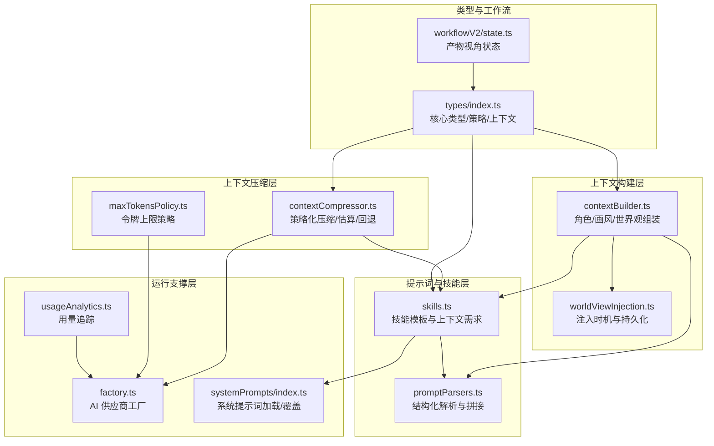
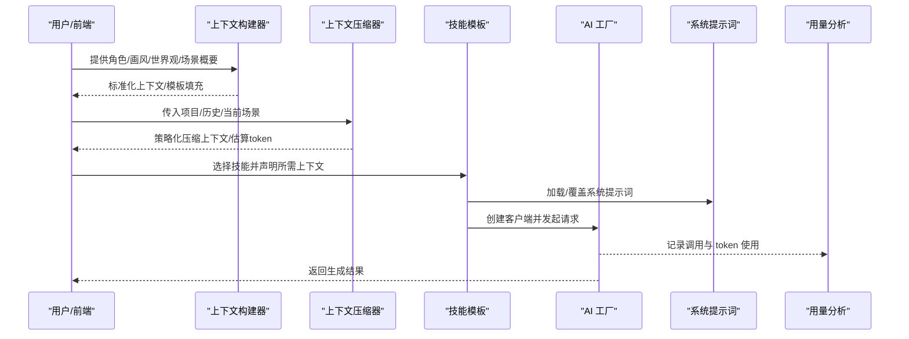
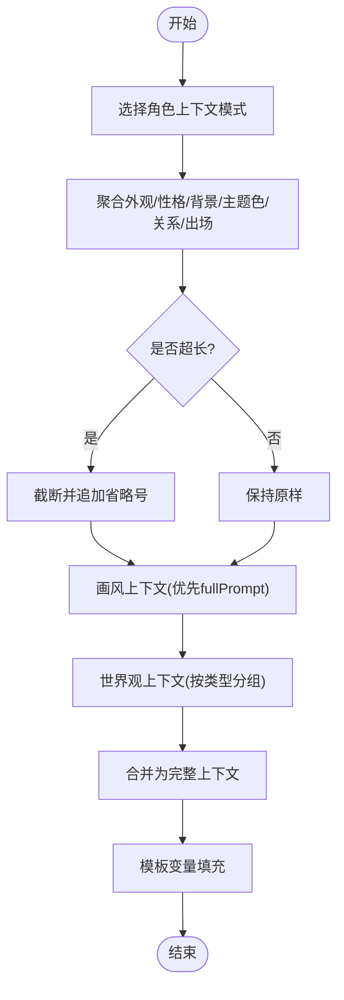
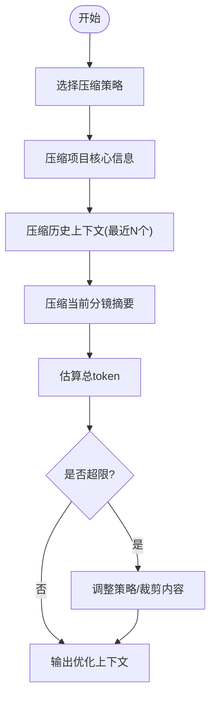
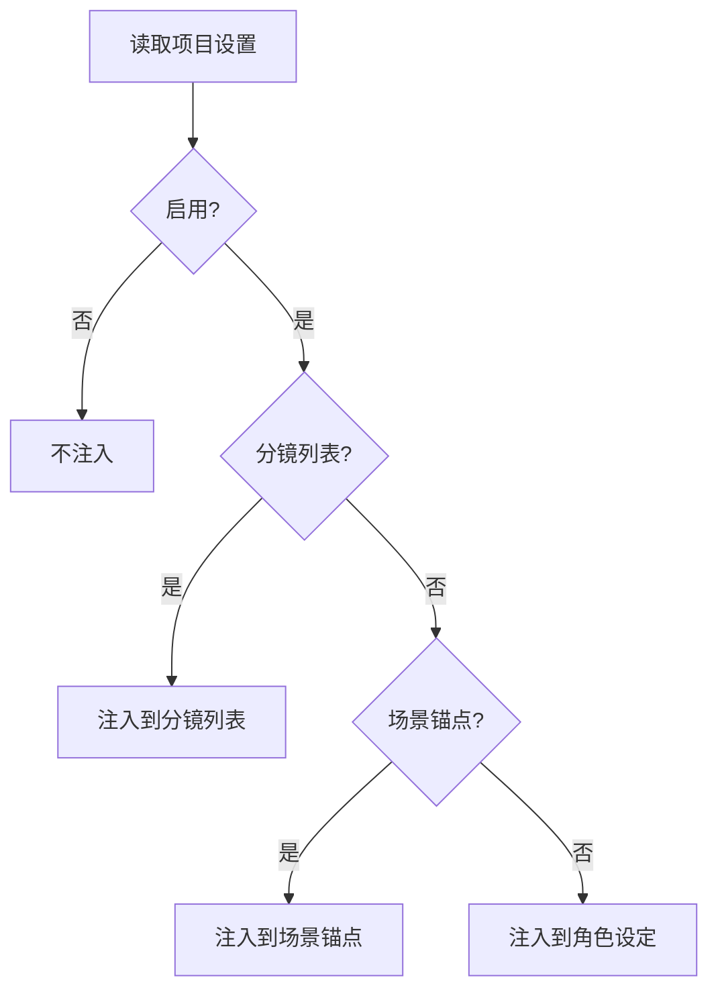
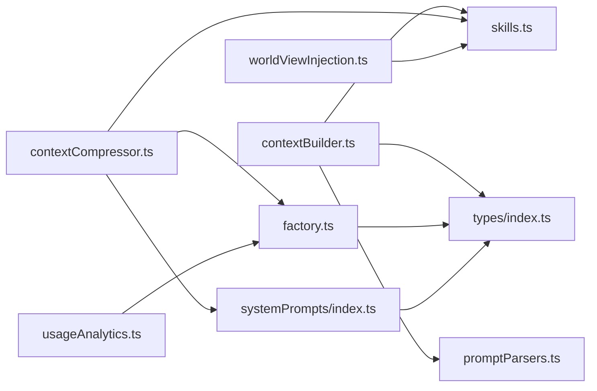

# 上下文工程

<cite>
**本文档引用的文件**
- [apps/web/src/lib/ai/contextBuilder.ts](file://apps/web/src/lib/ai/contextBuilder.ts)
- [apps/web/src/lib/ai/contextCompressor.ts](file://apps/web/src/lib/ai/contextCompressor.ts)
- [apps/web/src/lib/ai/worldViewInjection.ts](file://apps/web/src/lib/ai/worldViewInjection.ts)
- [apps/web/src/lib/ai/maxTokensPolicy.ts](file://apps/web/src/lib/ai/maxTokensPolicy.ts)
- [apps/web/src/lib/ai/promptParsers.ts](file://apps/web/src/lib/ai/promptParsers.ts)
- [apps/web/src/lib/ai/skills.ts](file://apps/web/src/lib/ai/skills.ts)
- [apps/web/src/lib/ai/factory.ts](file://apps/web/src/lib/ai/factory.ts)
- [apps/web/src/lib/systemPrompts/index.ts](file://apps/web/src/lib/systemPrompts/index.ts)
- [apps/web/src/types/index.ts](file://apps/web/src/types/index.ts)
- [apps/web/src/lib/workflowV2/state.ts](file://apps/web/src/lib/workflowV2/state.ts)
- [apps/web/src/lib/ai/usageAnalytics.ts](file://apps/web/src/lib/ai/usageAnalytics.ts)
- [apps/web/src/lib/ai/contextBuilder.test.ts](file://apps/web/src/lib/ai/contextBuilder.test.ts)
- [apps/web/src/lib/ai/contextCompressor.test.ts](file://apps/web/src/lib/ai/contextCompressor.test.ts)
- [apps/web/src/lib/ai/worldViewInjection.test.ts](file://apps/web/src/lib/ai/worldViewInjection.test.ts)
</cite>

## 目录

1. [简介](#简介)
2. [项目结构](#项目结构)
3. [核心组件](#核心组件)
4. [架构总览](#架构总览)
5. [详细组件分析](#详细组件分析)
6. [依赖关系分析](#依赖关系分析)
7. [性能考量](#性能考量)
8. [故障排查指南](#故障排查指南)
9. [结论](#结论)
10. [附录](#附录)

## 简介

本文件系统化梳理 AIXSSS 上下文工程系统，围绕“从全局设定到具体创作任务”的上下文注入机制展开，重点覆盖以下方面：

- 画风 fullPrompt、世界观要点、角色卡与当前集概要的标准化处理流程
- Token 预算控制与上下文压缩策略（含全局设定压缩摘要缓存与失效触发条件）
- 上下文构建的优先级规则、长度控制算法与质量保证措施
- 上下文注入在不同创作阶段的应用场景与参数传递机制
- 实现细节：contextBuilder 的组装逻辑、contextCompressor 的压缩算法、worldViewInjection 的注入策略
- 性能优化建议与最佳实践，确保在保持创作质量的同时控制 Token 使用成本

## 项目结构

上下文工程相关代码主要位于 Web 前端的 AI 工具库中，围绕“上下文构建 → 上下文压缩 → 世界注入 → 技能模板 → 提示词解析 → 令牌策略 → 工厂与系统提示 → 使用分析”形成闭环。

图表来源

- [apps/web/src/lib/ai/contextBuilder.ts](file://apps/web/src/lib/ai/contextBuilder.ts#L1-L435)
- [apps/web/src/lib/ai/contextCompressor.ts](file://apps/web/src/lib/ai/contextCompressor.ts#L1-L519)
- [apps/web/src/lib/ai/worldViewInjection.ts](file://apps/web/src/lib/ai/worldViewInjection.ts#L1-L192)
- [apps/web/src/lib/ai/skills.ts](file://apps/web/src/lib/ai/skills.ts#L1-L517)
- [apps/web/src/lib/ai/promptParsers.ts](file://apps/web/src/lib/ai/promptParsers.ts#L1-L637)
- [apps/web/src/lib/ai/maxTokensPolicy.ts](file://apps/web/src/lib/ai/maxTokensPolicy.ts#L1-L63)
- [apps/web/src/lib/ai/factory.ts](file://apps/web/src/lib/ai/factory.ts#L1-L98)
- [apps/web/src/lib/systemPrompts/index.ts](file://apps/web/src/lib/systemPrompts/index.ts#L1-L197)
- [apps/web/src/lib/workflowV2/state.ts](file://apps/web/src/lib/workflowV2/state.ts#L1-L139)
- [apps/web/src/lib/ai/usageAnalytics.ts](file://apps/web/src/lib/ai/usageAnalytics.ts#L1-L77)
- [apps/web/src/types/index.ts](file://apps/web/src/types/index.ts#L1-L1019)

章节来源

- [apps/web/src/lib/ai/contextBuilder.ts](file://apps/web/src/lib/ai/contextBuilder.ts#L1-L435)
- [apps/web/src/lib/ai/contextCompressor.ts](file://apps/web/src/lib/ai/contextCompressor.ts#L1-L519)
- [apps/web/src/lib/ai/worldViewInjection.ts](file://apps/web/src/lib/ai/worldViewInjection.ts#L1-L192)
- [apps/web/src/lib/ai/skills.ts](file://apps/web/src/lib/ai/skills.ts#L1-L517)
- [apps/web/src/lib/ai/promptParsers.ts](file://apps/web/src/lib/ai/promptParsers.ts#L1-L637)
- [apps/web/src/lib/ai/maxTokensPolicy.ts](file://apps/web/src/lib/ai/maxTokensPolicy.ts#L1-L63)
- [apps/web/src/lib/ai/factory.ts](file://apps/web/src/lib/ai/factory.ts#L1-L98)
- [apps/web/src/lib/systemPrompts/index.ts](file://apps/web/src/lib/systemPrompts/index.ts#L1-L197)
- [apps/web/src/lib/workflowV2/state.ts](file://apps/web/src/lib/workflowV2/state.ts#L1-L139)
- [apps/web/src/lib/ai/usageAnalytics.ts](file://apps/web/src/lib/ai/usageAnalytics.ts#L1-L77)
- [apps/web/src/types/index.ts](file://apps/web/src/types/index.ts#L1-L1019)

## 核心组件

- 上下文构建器（contextBuilder）
  - 角色上下文：按 visual/story/full 模式聚合外观、性格、背景、主题色、关系、出场次数等，并进行长度控制
  - 画风上下文：优先使用 fullPrompt，否则组合 baseStyle/technique/colorPalette/culturalFeature
  - 世界观上下文：按 era/geography/society/technology/magic/custom 分组格式化
  - 完整上下文：整合上述三类并添加分隔
  - 模板填充：将占位符映射为实际上下文，支持多场景变量
  - 针对技能的上下文：按技能所需上下文自动裁剪
- 上下文压缩器（contextCompressor）
  - 项目核心信息压缩：风格、主角核心、故事梗概，按策略限制 token
  - 分镜摘要压缩：保留概要、情绪、关键元素
  - 历史上下文压缩：按策略保留最近 N 个分镜摘要
  - Token 估算与限额检查：提供总 token 计算与使用率评估
  - AI 智能压缩回退：情绪/关键元素/摘要压缩均提供规则引擎回退
- 世界注入设置（worldViewInjection）
  - 注入时机：分镜列表生成、场景锚点生成、角色设定
  - 开关与持久化：localStorage 存储，合并默认值
  - 枚举与推断：支持 both/none/scenario 等枚举与自动推断
- 令牌策略（maxTokensPolicy）
  - 不同供应商/模型的 maxTokens 上限、步进与推荐值
  - UI 与后端 schema 对齐，提供钳制函数
- 技能模板（skills）
  - 每个技能声明 requiredContext 与 promptTemplate
  - 与上下文构建/压缩配合，按阶段注入所需上下文
- 提示词解析（promptParsers）
  - 支持 JSON 与旧版标签格式解析
  - 提供场景锚点/关键帧/运动提示词的结构化拼接
- 工厂与系统提示（factory/systemPrompts）
  - AI 供应商工厂统一创建客户端
  - 系统提示词加载/覆盖/缓存与失效
- 类型与工作流（types/workflowV2/state）
  - 核心类型：ArtStyleConfig、Character、WorldViewElement、Scene、Project 等
  - 上下文缓存结构：ProjectContextCache、WorkflowV2 状态
  - 工作流产物视角的状态规范化与补丁构建

章节来源

- [apps/web/src/lib/ai/contextBuilder.ts](file://apps/web/src/lib/ai/contextBuilder.ts#L105-L435)
- [apps/web/src/lib/ai/contextCompressor.ts](file://apps/web/src/lib/ai/contextCompressor.ts#L55-L519)
- [apps/web/src/lib/ai/worldViewInjection.ts](file://apps/web/src/lib/ai/worldViewInjection.ts#L14-L192)
- [apps/web/src/lib/ai/maxTokensPolicy.ts](file://apps/web/src/lib/ai/maxTokensPolicy.ts#L26-L63)
- [apps/web/src/lib/ai/skills.ts](file://apps/web/src/lib/ai/skills.ts#L7-L517)
- [apps/web/src/lib/ai/promptParsers.ts](file://apps/web/src/lib/ai/promptParsers.ts#L1-L637)
- [apps/web/src/lib/ai/factory.ts](file://apps/web/src/lib/ai/factory.ts#L13-L98)
- [apps/web/src/lib/systemPrompts/index.ts](file://apps/web/src/lib/systemPrompts/index.ts#L109-L197)
- [apps/web/src/types/index.ts](file://apps/web/src/types/index.ts#L13-L1019)
- [apps/web/src/lib/workflowV2/state.ts](file://apps/web/src/lib/workflowV2/state.ts#L27-L139)

## 架构总览

上下文工程贯穿创作全流程：从项目/场景数据出发，经由构建器与压缩器形成稳定上下文，再结合技能模板与系统提示词，最终驱动 AI 生成关键帧、运动提示词与台词等产物。工厂负责统一调用，使用分析记录真实用量。

图表来源

- [apps/web/src/lib/ai/contextBuilder.ts](file://apps/web/src/lib/ai/contextBuilder.ts#L276-L435)
- [apps/web/src/lib/ai/contextCompressor.ts](file://apps/web/src/lib/ai/contextCompressor.ts#L240-L298)
- [apps/web/src/lib/ai/skills.ts](file://apps/web/src/lib/ai/skills.ts#L7-L517)
- [apps/web/src/lib/ai/factory.ts](file://apps/web/src/lib/ai/factory.ts#L30-L98)
- [apps/web/src/lib/systemPrompts/index.ts](file://apps/web/src/lib/systemPrompts/index.ts#L109-L197)
- [apps/web/src/lib/ai/usageAnalytics.ts](file://apps/web/src/lib/ai/usageAnalytics.ts#L32-L77)

## 详细组件分析

### 上下文构建器（contextBuilder）

- 角色上下文
  - 模式：visual（外观）、story（性格/背景/关系）、full（全量）
  - 关系与出场记录：按最大关系数切片，出场按主/配/背景统计
  - 长度控制：超过 maxLength 截断并追加省略号
- 画风上下文
  - 优先使用 fullPrompt；否则组合四维描述
- 世界观上下文
  - 按类型分组，标题化输出
- 完整上下文与模板填充
  - 组装三类上下文并分隔
  - 模板变量覆盖：style/styleFullPrompt、characters/characters_visual/story/full、protagonist、worldview/world_view、场景/分镜/运动/故事相关变量
- 针对技能的上下文
  - scene-list/scene-description/keyframe-prompt/motion-prompt/dialogue 等按需裁剪

图表来源

- [apps/web/src/lib/ai/contextBuilder.ts](file://apps/web/src/lib/ai/contextBuilder.ts#L105-L197)
- [apps/web/src/lib/ai/contextBuilder.ts](file://apps/web/src/lib/ai/contextBuilder.ts#L203-L221)
- [apps/web/src/lib/ai/contextBuilder.ts](file://apps/web/src/lib/ai/contextBuilder.ts#L227-L270)
- [apps/web/src/lib/ai/contextBuilder.ts](file://apps/web/src/lib/ai/contextBuilder.ts#L276-L387)

章节来源

- [apps/web/src/lib/ai/contextBuilder.ts](file://apps/web/src/lib/ai/contextBuilder.ts#L105-L435)
- [apps/web/src/lib/ai/contextBuilder.test.ts](file://apps/web/src/lib/ai/contextBuilder.test.ts#L16-L294)

### 上下文压缩器（contextCompressor）

- 项目核心信息压缩
  - 保留风格；对主角与故事梗概按策略限制长度
- 分镜摘要压缩
  - 概要截断；提取情绪与关键元素（关键词匹配/规则引擎）
- 历史上下文压缩
  - 仅保留最近 N 个分镜摘要
- Token 估算与限额
  - 简化估算：中文≈2 tokens/字，英文≈1.3 tokens/词，其他≈0.5
  - 提供总 token 计算与使用率/剩余评估
- AI 智能压缩回退
  - 情绪/关键元素/摘要压缩均提供规则引擎回退，并通知降级

图表来源

- [apps/web/src/lib/ai/contextCompressor.ts](file://apps/web/src/lib/ai/contextCompressor.ts#L55-L94)
- [apps/web/src/lib/ai/contextCompressor.ts](file://apps/web/src/lib/ai/contextCompressor.ts#L99-L129)
- [apps/web/src/lib/ai/contextCompressor.ts](file://apps/web/src/lib/ai/contextCompressor.ts#L134-L163)
- [apps/web/src/lib/ai/contextCompressor.ts](file://apps/web/src/lib/ai/contextCompressor.ts#L168-L200)
- [apps/web/src/lib/ai/contextCompressor.ts](file://apps/web/src/lib/ai/contextCompressor.ts#L240-L298)
- [apps/web/src/lib/ai/contextCompressor.ts](file://apps/web/src/lib/ai/contextCompressor.ts#L375-L430)
- [apps/web/src/lib/ai/contextCompressor.ts](file://apps/web/src/lib/ai/contextCompressor.ts#L482-L518)

章节来源

- [apps/web/src/lib/ai/contextCompressor.ts](file://apps/web/src/lib/ai/contextCompressor.ts#L1-L519)
- [apps/web/src/lib/ai/contextCompressor.test.ts](file://apps/web/src/lib/ai/contextCompressor.test.ts#L22-L502)

### 世界注入设置（worldViewInjection）

- 注入时机枚举：分镜列表、场景锚点、两者皆是、不注入
- 默认设置：全部启用
- 持久化：localStorage，合并默认值，保证字段完整性
- 判定函数：根据设置判断是否在特定阶段注入

图表来源

- [apps/web/src/lib/ai/worldViewInjection.ts](file://apps/web/src/lib/ai/worldViewInjection.ts#L66-L126)
- [apps/web/src/lib/ai/worldViewInjection.ts](file://apps/web/src/lib/ai/worldViewInjection.ts#L133-L191)

章节来源

- [apps/web/src/lib/ai/worldViewInjection.ts](file://apps/web/src/lib/ai/worldViewInjection.ts#L1-L192)
- [apps/web/src/lib/ai/worldViewInjection.test.ts](file://apps/web/src/lib/ai/worldViewInjection.test.ts#L13-L173)

### 令牌策略（maxTokensPolicy）

- 针对不同供应商/模型提供 min/max/step/recommended/default/hint
- clampMaxTokens 钳制输入值，确保 UI 与后端 schema 一致

章节来源

- [apps/web/src/lib/ai/maxTokensPolicy.ts](file://apps/web/src/lib/ai/maxTokensPolicy.ts#L26-L63)

### 技能模板与提示词解析

- 技能模板
  - 每个技能声明 requiredContext 与 promptTemplate
  - 与上下文构建/压缩配合，按阶段注入所需上下文
- 提示词解析
  - 支持 JSON 与旧版标签格式解析
  - 提供场景锚点/关键帧/运动提示词的结构化拼接

章节来源

- [apps/web/src/lib/ai/skills.ts](file://apps/web/src/lib/ai/skills.ts#L7-L517)
- [apps/web/src/lib/ai/promptParsers.ts](file://apps/web/src/lib/ai/promptParsers.ts#L1-L637)

### 工厂与系统提示

- AI 工厂
  - 根据供应商类型创建适配器，支持后端模式与本地模式
  - streamChat 包装底层生成器，更新进度与错误处理
- 系统提示词
  - 加载/覆盖/缓存与失效，支持本地覆盖与 API 模式

章节来源

- [apps/web/src/lib/ai/factory.ts](file://apps/web/src/lib/ai/factory.ts#L13-L98)
- [apps/web/src/lib/systemPrompts/index.ts](file://apps/web/src/lib/systemPrompts/index.ts#L109-L197)

### 类型与工作流

- 核心类型
  - ArtStyleConfig、Character、WorldViewElement、Scene、Project、CompressionStrategy 等
- 上下文缓存
  - ProjectContextCache：风格关键词、主角核心、故事核心、叙事因果链、工作流 V2 状态等
- 工作流产物视角
  - 规范化与补丁构建，支持项目/剧集层面的产物状态管理

章节来源

- [apps/web/src/types/index.ts](file://apps/web/src/types/index.ts#L13-L1019)
- [apps/web/src/lib/workflowV2/state.ts](file://apps/web/src/lib/workflowV2/state.ts#L27-L139)

## 依赖关系分析

- 组件耦合
  - contextBuilder 依赖 types 中的类型定义，输出标准化上下文供 skills 与 promptParsers 使用
  - contextCompressor 依赖 skills 的 requiredContext 与系统提示词，提供策略化压缩
  - worldViewInjection 与 skills 配合，控制注入时机
  - factory 与 systemPrompts 为运行期提供统一调用与提示词支撑
- 外部依赖
  - 供应商适配器（DeepSeek/Gemini/Kimi/OpenAI-Compatible/Doubao Ark）
  - 本地存储（localStorage）用于设置与系统提示词覆盖
- 循环依赖
  - 未发现直接循环依赖；各模块职责清晰，通过类型与工厂解耦

图表来源

- [apps/web/src/lib/ai/contextBuilder.ts](file://apps/web/src/lib/ai/contextBuilder.ts#L12-L18)
- [apps/web/src/lib/ai/contextCompressor.ts](file://apps/web/src/lib/ai/contextCompressor.ts#L14-L16)
- [apps/web/src/lib/ai/worldViewInjection.ts](file://apps/web/src/lib/ai/worldViewInjection.ts#L14-L24)
- [apps/web/src/lib/ai/skills.ts](file://apps/web/src/lib/ai/skills.ts#L1-L2)
- [apps/web/src/lib/ai/promptParsers.ts](file://apps/web/src/lib/ai/promptParsers.ts#L1-L2)
- [apps/web/src/lib/ai/factory.ts](file://apps/web/src/lib/ai/factory.ts#L1-L10)
- [apps/web/src/lib/systemPrompts/index.ts](file://apps/web/src/lib/systemPrompts/index.ts#L1-L7)
- [apps/web/src/lib/ai/usageAnalytics.ts](file://apps/web/src/lib/ai/usageAnalytics.ts#L1-L2)

章节来源

- [apps/web/src/lib/ai/contextBuilder.ts](file://apps/web/src/lib/ai/contextBuilder.ts#L12-L18)
- [apps/web/src/lib/ai/contextCompressor.ts](file://apps/web/src/lib/ai/contextCompressor.ts#L14-L16)
- [apps/web/src/lib/ai/worldViewInjection.ts](file://apps/web/src/lib/ai/worldViewInjection.ts#L14-L24)
- [apps/web/src/lib/ai/skills.ts](file://apps/web/src/lib/ai/skills.ts#L1-L2)
- [apps/web/src/lib/ai/promptParsers.ts](file://apps/web/src/lib/ai/promptParsers.ts#L1-L2)
- [apps/web/src/lib/ai/factory.ts](file://apps/web/src/lib/ai/factory.ts#L1-L10)
- [apps/web/src/lib/systemPrompts/index.ts](file://apps/web/src/lib/systemPrompts/index.ts#L1-L7)
- [apps/web/src/lib/ai/usageAnalytics.ts](file://apps/web/src/lib/ai/usageAnalytics.ts#L1-L2)

## 性能考量

- Token 估算与限额
  - 使用简化估算公式，中文≈2 tokens/字，英文≈1.3 tokens/词，其他≈0.5
  - 提供 checkTokenLimit 评估使用率与剩余
- 压缩策略
  - aggressive/balanced/conservative 三种策略，分别针对不同复杂度与成本目标
  - AI 智能压缩失败时自动回退到规则引擎，保障稳定性
- 长度控制
  - 角色上下文按 maxLength 截断；分镜摘要按 maxSceneTokens 截断
- 令牌上限策略
  - 针对不同供应商/模型提供 maxTokens 上限与推荐值，避免超限
- 使用分析
  - 记录每次调用的 token 使用、耗时与状态，便于成本与性能分析

章节来源

- [apps/web/src/lib/ai/contextCompressor.ts](file://apps/web/src/lib/ai/contextCompressor.ts#L19-L24)
- [apps/web/src/lib/ai/contextCompressor.ts](file://apps/web/src/lib/ai/contextCompressor.ts#L187-L200)
- [apps/web/src/lib/ai/contextBuilder.ts](file://apps/web/src/lib/ai/contextBuilder.ts#L110-L115)
- [apps/web/src/lib/ai/contextCompressor.ts](file://apps/web/src/lib/ai/contextCompressor.ts#L99-L129)
- [apps/web/src/lib/ai/maxTokensPolicy.ts](file://apps/web/src/lib/ai/maxTokensPolicy.ts#L26-L63)
- [apps/web/src/lib/ai/usageAnalytics.ts](file://apps/web/src/lib/ai/usageAnalytics.ts#L32-L77)

## 故障排查指南

- 画风未生效
  - 检查 artStyle.fullPrompt 是否存在；若不存在，确认四维描述是否完整
- 令牌超限
  - 使用 checkTokenLimit 评估；降低策略或裁剪内容
  - 使用 maxTokensPolicy 钳制输出长度
- 注入未生效
  - 检查 worldViewInjection 设置与持久化；确认 shouldInjectAtSceneList/shouldInjectAtSceneDescription/shouldInjectAtCharacter
- AI 智能压缩失败
  - 查看回退日志；确认系统提示词加载与缓存
- 使用分析异常
  - 确认订阅回调是否正确注册与清理

章节来源

- [apps/web/src/lib/ai/contextBuilder.ts](file://apps/web/src/lib/ai/contextBuilder.ts#L203-L221)
- [apps/web/src/lib/ai/contextCompressor.ts](file://apps/web/src/lib/ai/contextCompressor.ts#L187-L200)
- [apps/web/src/lib/ai/maxTokensPolicy.ts](file://apps/web/src/lib/ai/maxTokensPolicy.ts#L59-L63)
- [apps/web/src/lib/ai/worldViewInjection.ts](file://apps/web/src/lib/ai/worldViewInjection.ts#L66-L126)
- [apps/web/src/lib/systemPrompts/index.ts](file://apps/web/src/lib/systemPrompts/index.ts#L109-L197)
- [apps/web/src/lib/ai/usageAnalytics.ts](file://apps/web/src/lib/ai/usageAnalytics.ts#L32-L77)

## 结论

AIXSSS 上下文工程系统通过“构建—压缩—注入—模板—解析—工厂—分析”的闭环设计，在创作全流程中实现了：

- 标准化上下文组装与模板填充
- 策略化压缩与令牌预算控制
- 可配置的世界观注入时机
- 与技能模板、系统提示词、供应商工厂的协同
- 成本与质量的平衡与可观测性

建议在实际使用中：

- 根据内容复杂度动态选择压缩策略
- 合理设置注入时机，避免过度注入导致上下文膨胀
- 使用 maxTokensPolicy 与 checkTokenLimit 控制成本
- 通过使用分析持续优化生成质量与成本

## 附录

- 术语
  - 上下文：项目风格、角色信息、世界观、场景概要等创作所需信息
  - 压缩策略：aggressive/balanced/conservative
  - requiredContext：技能声明的上下文需求集合
- 参考路径
  - 上下文构建：[apps/web/src/lib/ai/contextBuilder.ts](file://apps/web/src/lib/ai/contextBuilder.ts#L105-L435)
  - 上下文压缩：[apps/web/src/lib/ai/contextCompressor.ts](file://apps/web/src/lib/ai/contextCompressor.ts#L55-L519)
  - 世界注入：[apps/web/src/lib/ai/worldViewInjection.ts](file://apps/web/src/lib/ai/worldViewInjection.ts#L66-L191)
  - 令牌策略：[apps/web/src/lib/ai/maxTokensPolicy.ts](file://apps/web/src/lib/ai/maxTokensPolicy.ts#L26-L63)
  - 技能模板：[apps/web/src/lib/ai/skills.ts](file://apps/web/src/lib/ai/skills.ts#L7-L517)
  - 提示词解析：[apps/web/src/lib/ai/promptParsers.ts](file://apps/web/src/lib/ai/promptParsers.ts#L1-L637)
  - 工厂与系统提示：[apps/web/src/lib/ai/factory.ts](file://apps/web/src/lib/ai/factory.ts#L13-L98)、[apps/web/src/lib/systemPrompts/index.ts](file://apps/web/src/lib/systemPrompts/index.ts#L109-L197)
  - 类型与工作流：[apps/web/src/types/index.ts](file://apps/web/src/types/index.ts#L13-L1019)、[apps/web/src/lib/workflowV2/state.ts](file://apps/web/src/lib/workflowV2/state.ts#L27-L139)
  - 使用分析：[apps/web/src/lib/ai/usageAnalytics.ts](file://apps/web/src/lib/ai/usageAnalytics.ts#L32-L77)
