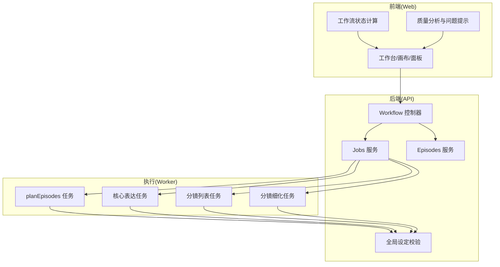
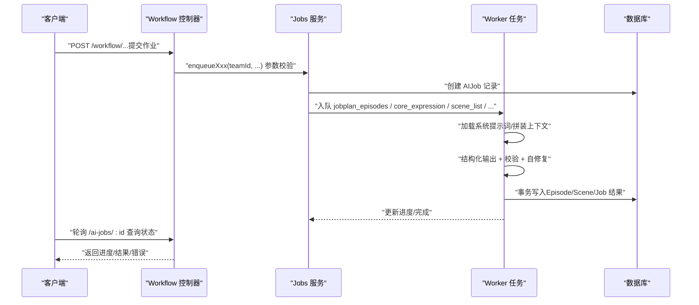
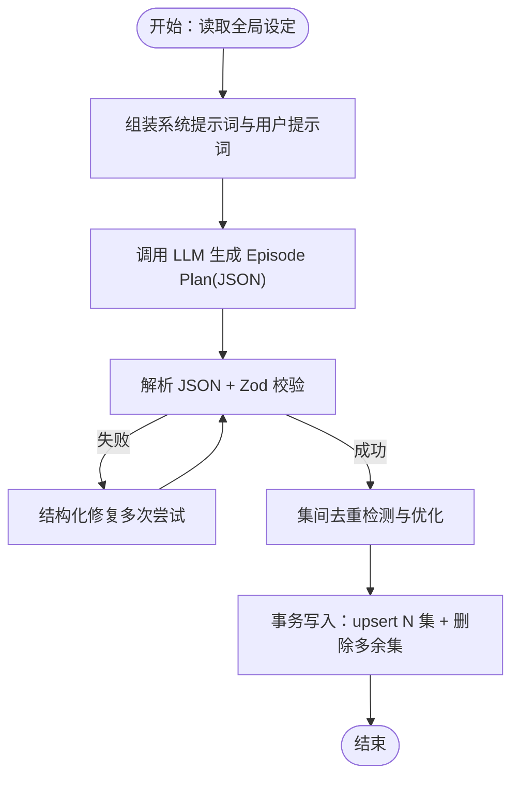
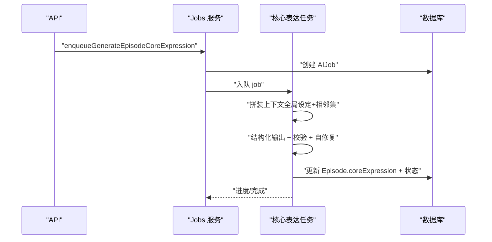
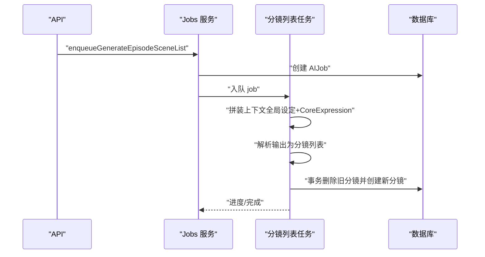
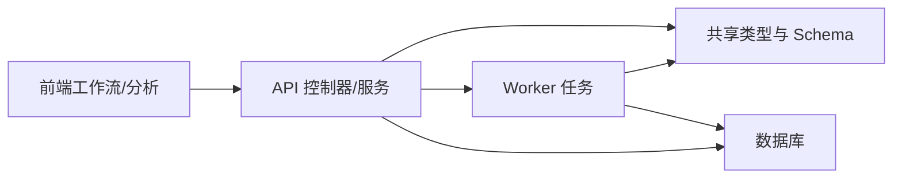

# 创作流程

<cite>
**本文引用的文件**
- [apps/api/src/jobs/workflow.controller.ts](file://apps/api/src/jobs/workflow.controller.ts)
- [apps/api/src/jobs/jobs.service.ts](file://apps/api/src/jobs/jobs.service.ts)
- [apps/api/src/jobs/planningValidation.ts](file://apps/api/src/jobs/planningValidation.ts)
- [apps/api/src/episodes/episodes.service.ts](file://apps/api/src/episodes/episodes.service.ts)
- [apps/worker/src/tasks/planEpisodes.ts](file://apps/worker/src/tasks/planEpisodes.ts)
- [apps/worker/src/tasks/generateEpisodeCoreExpression.ts](file://apps/worker/src/tasks/generateEpisodeCoreExpression.ts)
- [apps/worker/src/tasks/generateEpisodeSceneList.ts](file://apps/worker/src/tasks/generateEpisodeSceneList.ts)
- [apps/worker/src/tasks/storyboard81.ts](file://apps/worker/src/tasks/storyboard81.ts)
- [apps/worker/src/tasks/systemPrompts.ts](file://apps/worker/src/tasks/systemPrompts.ts)
- [packages/shared/src/schemas/episode.ts](file://packages/shared/src/schemas/episode.ts)
- [packages/shared/src/types.ts](file://packages/shared/src/types.ts)
- [apps/web/src/lib/workflowV2/state.ts](file://apps/web/src/lib/workflowV2/state.ts)
- [apps/web/src/lib/workflowV2/analysis.ts](file://apps/web/src/lib/workflowV2/analysis.ts)
- [docs/prd/episode-planning-workflow.md](file://docs/prd/episode-planning-workflow.md)
</cite>

## 目录

1. [简介](#简介)
2. [项目结构](#项目结构)
3. [核心组件](#核心组件)
4. [架构总览](#架构总览)
5. [详细组件分析](#详细组件分析)
6. [依赖关系分析](#依赖关系分析)
7. [性能考量](#性能考量)
8. [故障排查指南](#故障排查指南)
9. [结论](#结论)
10. [附录](#附录)

## 简介

本文件面向 AIXSSS 的“创作流程”工作流，系统化阐述从“全局设定”到“剧集规划（Episode Planning）”再到“单集创作（核心表达→分镜生成→分镜细化）”的完整设计与实现。文档重点包括：

- 剧集规划的 AI 分析过程与评估维度（世界观复杂度、角色关系网、故事体量）
- 单集创作三阶段的职责、输入输出与数据流转
- 工作流状态转换、错误处理与重试策略
- API 接口设计、请求/响应格式与参数校验
- 代码级实现细节与最佳实践示例路径

## 项目结构

围绕创作流程，系统由三层构成：

- API 层：负责鉴权、参数校验、作业入队与状态查询
- Worker 层：负责具体任务执行（计划/核心表达/分镜/细化等）
- Web 层：负责工作流可视化、状态标注与质量分析

图表来源

- [apps/api/src/jobs/workflow.controller.ts](file://apps/api/src/jobs/workflow.controller.ts#L44-L266)
- [apps/api/src/jobs/jobs.service.ts](file://apps/api/src/jobs/jobs.service.ts#L37-L800)
- [apps/api/src/episodes/episodes.service.ts](file://apps/api/src/episodes/episodes.service.ts#L27-L146)
- [apps/api/src/jobs/planningValidation.ts](file://apps/api/src/jobs/planningValidation.ts#L15-L32)
- [apps/worker/src/tasks/planEpisodes.ts](file://apps/worker/src/tasks/planEpisodes.ts#L387-L612)
- [apps/worker/src/tasks/generateEpisodeCoreExpression.ts](file://apps/worker/src/tasks/generateEpisodeCoreExpression.ts#L254-L426)
- [apps/worker/src/tasks/generateEpisodeSceneList.ts](file://apps/worker/src/tasks/generateEpisodeSceneList.ts#L184-L327)
- [apps/worker/src/tasks/storyboard81.ts](file://apps/worker/src/tasks/storyboard81.ts#L553-L640)
- [apps/web/src/lib/workflowV2/state.ts](file://apps/web/src/lib/workflowV2/state.ts#L27-L139)
- [apps/web/src/lib/workflowV2/analysis.ts](file://apps/web/src/lib/workflowV2/analysis.ts#L93-L444)

章节来源

- [apps/api/src/jobs/workflow.controller.ts](file://apps/api/src/jobs/workflow.controller.ts#L1-L266)
- [apps/api/src/jobs/jobs.service.ts](file://apps/api/src/jobs/jobs.service.ts#L1-L800)
- [apps/api/src/jobs/planningValidation.ts](file://apps/api/src/jobs/planningValidation.ts#L1-L32)
- [apps/api/src/episodes/episodes.service.ts](file://apps/api/src/episodes/episodes.service.ts#L1-L146)
- [apps/worker/src/tasks/planEpisodes.ts](file://apps/worker/src/tasks/planEpisodes.ts#L1-L612)
- [apps/worker/src/tasks/generateEpisodeCoreExpression.ts](file://apps/worker/src/tasks/generateEpisodeCoreExpression.ts#L1-L426)
- [apps/worker/src/tasks/generateEpisodeSceneList.ts](file://apps/worker/src/tasks/generateEpisodeSceneList.ts#L1-L327)
- [apps/worker/src/tasks/storyboard81.ts](file://apps/worker/src/tasks/storyboard81.ts#L1-L800)
- [apps/web/src/lib/workflowV2/state.ts](file://apps/web/src/lib/workflowV2/state.ts#L1-L139)
- [apps/web/src/lib/workflowV2/analysis.ts](file://apps/web/src/lib/workflowV2/analysis.ts#L1-L444)
- [docs/prd/episode-planning-workflow.md](file://docs/prd/episode-planning-workflow.md#L1-L627)

## 核心组件

- 全局设定校验：确保项目具备可规划的最小输入（故事梗概长度、画风字段）
- 剧集规划任务：综合世界观、角色、体量生成 N 集规划，并去重优化
- 单集创作任务：核心表达→分镜生成→分镜细化（复用现有细化链路）
- 作业编排与状态：统一的作业入队、进度上报、状态机与幂等写入
- 前端工作流状态与质量分析：项目/剧集/分镜维度的问题提示与工作台任务

章节来源

- [apps/api/src/jobs/planningValidation.ts](file://apps/api/src/jobs/planningValidation.ts#L15-L32)
- [apps/worker/src/tasks/planEpisodes.ts](file://apps/worker/src/tasks/planEpisodes.ts#L387-L612)
- [apps/worker/src/tasks/generateEpisodeCoreExpression.ts](file://apps/worker/src/tasks/generateEpisodeCoreExpression.ts#L254-L426)
- [apps/worker/src/tasks/generateEpisodeSceneList.ts](file://apps/worker/src/tasks/generateEpisodeSceneList.ts#L184-L327)
- [apps/worker/src/tasks/storyboard81.ts](file://apps/worker/src/tasks/storyboard81.ts#L553-L640)
- [apps/web/src/lib/workflowV2/state.ts](file://apps/web/src/lib/workflowV2/state.ts#L27-L139)
- [apps/web/src/lib/workflowV2/analysis.ts](file://apps/web/src/lib/workflowV2/analysis.ts#L93-L444)

## 架构总览

创作流程以“全局设定”为输入，经由“剧集规划”形成 N 集概要，再进入“单集创作”阶段。API 层负责作业入队与状态查询，Worker 层执行具体任务并写回数据库，Web 层提供工作流可视化与质量分析。

图表来源

- [apps/api/src/jobs/workflow.controller.ts](file://apps/api/src/jobs/workflow.controller.ts#L44-L266)
- [apps/api/src/jobs/jobs.service.ts](file://apps/api/src/jobs/jobs.service.ts#L101-L149)
- [apps/worker/src/tasks/planEpisodes.ts](file://apps/worker/src/tasks/planEpisodes.ts#L387-L612)
- [apps/worker/src/tasks/generateEpisodeCoreExpression.ts](file://apps/worker/src/tasks/generateEpisodeCoreExpression.ts#L254-L426)
- [apps/worker/src/tasks/generateEpisodeSceneList.ts](file://apps/worker/src/tasks/generateEpisodeSceneList.ts#L184-L327)
- [apps/worker/src/tasks/storyboard81.ts](file://apps/worker/src/tasks/storyboard81.ts#L553-L640)

## 详细组件分析

### 剧集规划（Episode Planning）AI 分析

- 输入：全局设定（故事梗概、画风、世界观、角色）+ 可选约束（目标集数）
- AI 推理：综合“世界观复杂度、角色关系网、故事体量”→ 决策推荐集数 N，并给出理由
- 输出：结构化 Episode Plan（包含 episodeCount、每集标题/概要/主要角色/beats/场景范围/钩子）
- 去重优化：基于集间相似度阈值检测重复，必要时触发二次修正
- 落库：事务写入 Episode 行，清理多余集，更新项目工作流状态

图表来源

- [apps/worker/src/tasks/planEpisodes.ts](file://apps/worker/src/tasks/planEpisodes.ts#L387-L612)
- [packages/shared/src/schemas/episode.ts](file://packages/shared/src/schemas/episode.ts#L38-L64)
- [apps/worker/src/tasks/systemPrompts.ts](file://apps/worker/src/tasks/systemPrompts.ts#L4-L27)

章节来源

- [apps/worker/src/tasks/planEpisodes.ts](file://apps/worker/src/tasks/planEpisodes.ts#L1-L612)
- [packages/shared/src/schemas/episode.ts](file://packages/shared/src/schemas/episode.ts#L1-L80)
- [apps/worker/src/tasks/systemPrompts.ts](file://apps/worker/src/tasks/systemPrompts.ts#L1-L27)
- [docs/prd/episode-planning-workflow.md](file://docs/prd/episode-planning-workflow.md#L167-L183)

### 单集创作：核心表达设定（Core Expression）

- 输入：全局设定 + 当前集 Outline + 可选相邻集核心表达
- 输出：结构化 CoreExpression（主题、情绪四段式、核心冲突、爽点/泪点/笑点/信息揭示、视觉母题、结尾落点、下一集钩子）
- 落库：写入 Episode.coreExpression，更新工作流状态为 CORE_EXPRESSION_READY

图表来源

- [apps/api/src/jobs/workflow.controller.ts](file://apps/api/src/jobs/workflow.controller.ts#L70-L80)
- [apps/api/src/jobs/jobs.service.ts](file://apps/api/src/jobs/jobs.service.ts#L193-L231)
- [apps/worker/src/tasks/generateEpisodeCoreExpression.ts](file://apps/worker/src/tasks/generateEpisodeCoreExpression.ts#L254-L426)
- [packages/shared/src/schemas/episode.ts](file://packages/shared/src/schemas/episode.ts#L68-L79)

章节来源

- [apps/api/src/jobs/workflow.controller.ts](file://apps/api/src/jobs/workflow.controller.ts#L70-L80)
- [apps/api/src/jobs/jobs.service.ts](file://apps/api/src/jobs/jobs.service.ts#L193-L231)
- [apps/worker/src/tasks/generateEpisodeCoreExpression.ts](file://apps/worker/src/tasks/generateEpisodeCoreExpression.ts#L1-L426)
- [packages/shared/src/schemas/episode.ts](file://packages/shared/src/schemas/episode.ts#L68-L79)

### 单集创作：分镜生成（Storyboard Generation）

- 输入：全局设定 + CoreExpression + 当前集 Outline + 可选上一集分镜列表
- 输出：8–12 条分镜摘要（覆盖起承转合与视觉冲击点）
- 落库：删除旧分镜，批量创建新分镜，更新工作流状态为 SCENE_LIST_EDITING

图表来源

- [apps/api/src/jobs/workflow.controller.ts](file://apps/api/src/jobs/workflow.controller.ts#L94-L105)
- [apps/api/src/jobs/jobs.service.ts](file://apps/api/src/jobs/jobs.service.ts#L305-L347)
- [apps/worker/src/tasks/generateEpisodeSceneList.ts](file://apps/worker/src/tasks/generateEpisodeSceneList.ts#L184-L327)

章节来源

- [apps/api/src/jobs/workflow.controller.ts](file://apps/api/src/jobs/workflow.controller.ts#L94-L105)
- [apps/api/src/jobs/jobs.service.ts](file://apps/api/src/jobs/jobs.service.ts#L305-L347)
- [apps/worker/src/tasks/generateEpisodeSceneList.ts](file://apps/worker/src/tasks/generateEpisodeSceneList.ts#L1-L327)

### 单集创作：分镜细化（Storyboard Refinement）

- 复用现有细化链路：Scene Anchor → Keyframe Prompt → Motion Prompt → Dialogue
- 上下文增强：细化提示词来源从“项目摘要/主角/画风”升级为“全局设定 + 当前集核心表达 + 当前/上一分镜摘要”
- 任务编排：支持单分镜细化与批量细化（refine-all / refine-all-scene）

章节来源

- [apps/api/src/jobs/workflow.controller.ts](file://apps/api/src/jobs/workflow.controller.ts#L117-L264)
- [apps/api/src/jobs/jobs.service.ts](file://apps/api/src/jobs/jobs.service.ts#L378-L800)
- [apps/worker/src/tasks/storyboard81.ts](file://apps/worker/src/tasks/storyboard81.ts#L553-L640)

### 工作流状态与质量分析

- 项目级状态：新增 EPISODE_PLANNING、EPISODE_PLAN_EDITING、EPISODE_CREATING 等
- 剧集级状态：IDLE、CORE_EXPRESSION_READY、SCENE_LIST_EDITING、SCENE_PROCESSING、COMPLETE
- 前端工作流状态：从 contextCache 中提取并归一化，支持锁定/草稿状态
- 质量分析：对项目/剧集/分镜维度进行问题提示（画风缺失、分镜为空、对白过多、镜头提示不足等）

章节来源

- [packages/shared/src/types.ts](file://packages/shared/src/types.ts#L6-L32)
- [apps/web/src/lib/workflowV2/state.ts](file://apps/web/src/lib/workflowV2/state.ts#L27-L139)
- [apps/web/src/lib/workflowV2/analysis.ts](file://apps/web/src/lib/workflowV2/analysis.ts#L93-L444)

## 依赖关系分析

- API 层依赖 Jobs 服务进行参数校验与作业入队，依赖 Episodes 服务进行剧集 CRUD
- Worker 层依赖系统提示词加载、上下文拼装、结构化输出解析与校验、事务写库
- 共享层提供统一的类型与 Schema，保证 web/api/worker 一致性
- PRD 文档定义了工作流边界、状态机与质量指标，指导实现与验收

图表来源

- [apps/api/src/jobs/workflow.controller.ts](file://apps/api/src/jobs/workflow.controller.ts#L1-L266)
- [apps/api/src/jobs/jobs.service.ts](file://apps/api/src/jobs/jobs.service.ts#L1-L800)
- [apps/worker/src/tasks/systemPrompts.ts](file://apps/worker/src/tasks/systemPrompts.ts#L1-L27)
- [packages/shared/src/types.ts](file://packages/shared/src/types.ts#L1-L77)

章节来源

- [apps/api/src/jobs/workflow.controller.ts](file://apps/api/src/jobs/workflow.controller.ts#L1-L266)
- [apps/api/src/jobs/jobs.service.ts](file://apps/api/src/jobs/jobs.service.ts#L1-L800)
- [apps/worker/src/tasks/systemPrompts.ts](file://apps/worker/src/tasks/systemPrompts.ts#L1-L27)
- [packages/shared/src/types.ts](file://packages/shared/src/types.ts#L1-L77)

## 性能考量

- Token 预算与压缩：对全局设定进行摘要与缓存，避免上下文过长导致 token 爆炸
- 输出协议：严格结构化 JSON + schema 校验 + 自修复，降低解析失败率
- 幂等写入：事务内删除/重建，避免重复与脏写
- 重试策略：指数退避 + 固定次数上限，失败时记录原始文本便于追溯

章节来源

- [docs/prd/episode-planning-workflow.md](file://docs/prd/episode-planning-workflow.md#L522-L528)
- [apps/worker/src/tasks/planEpisodes.ts](file://apps/worker/src/tasks/planEpisodes.ts#L483-L521)
- [apps/worker/src/tasks/generateEpisodeCoreExpression.ts](file://apps/worker/src/tasks/generateEpisodeCoreExpression.ts#L370-L399)
- [apps/worker/src/tasks/generateEpisodeSceneList.ts](file://apps/worker/src/tasks/generateEpisodeSceneList.ts#L296-L317)
- [apps/worker/src/tasks/storyboard81.ts](file://apps/worker/src/tasks/storyboard81.ts#L553-L640)

## 故障排查指南

- 全局设定不满足“可规划”门槛：返回缺失字段列表，前端阻止开始剧集规划
- 作业入队失败：检查参数范围（如 targetEpisodeCount）、项目/剧集存在性、AI Profile 可用性
- 任务解析失败：启用结构化修复流程，记录原始输出与 token 使用情况
- 删除剧集受阻：若剧集下存在正在处理的分镜作业，需先取消作业再删除
- 重试策略：指数退避（1s/2s/4s）+ 最大尝试次数，失败原因写入 AIJob.result

章节来源

- [apps/api/src/jobs/planningValidation.ts](file://apps/api/src/jobs/planningValidation.ts#L15-L32)
- [apps/api/src/jobs/jobs.service.ts](file://apps/api/src/jobs/jobs.service.ts#L101-L149)
- [apps/api/src/episodes/episodes.service.ts](file://apps/api/src/episodes/episodes.service.ts#L110-L143)
- [apps/worker/src/tasks/planEpisodes.ts](file://apps/worker/src/tasks/planEpisodes.ts#L483-L521)
- [apps/worker/src/tasks/generateEpisodeCoreExpression.ts](file://apps/worker/src/tasks/generateEpisodeCoreExpression.ts#L370-L399)
- [apps/worker/src/tasks/generateEpisodeSceneList.ts](file://apps/worker/src/tasks/generateEpisodeSceneList.ts#L296-L317)

## 结论

本工作流以“全局设定”为根，通过“剧集规划”形成 N 集概要，再以“单集创作”为主线串联“核心表达→分镜生成→分镜细化”。API/Worker/Web 三层协同，配合严格的结构化输出、校验与自修复机制，确保可落地、可观测、可回溯。建议在后续版本中进一步完善跨集一致性与版本化管理，持续提升多集创作的稳定性与可编辑性。

## 附录

### API 接口设计与参数校验

- 剧集规划
  - POST /workflow/projects/:projectId/episode-plan
  - 请求体：{ aiProfileId: string, targetEpisodeCount?: number }
  - 校验：全局设定可规划校验、集数范围 1..24
- 核心表达
  - POST /workflow/projects/:projectId/episodes/:episodeId/core-expression
  - 请求体：{ aiProfileId: string }
- 分镜列表
  - POST /workflow/projects/:projectId/episodes/:episodeId/scene-list
  - 请求体：{ aiProfileId: string, sceneCountHint?: number }（6..24）
- 分镜细化（复用现有）
  - POST /workflow/projects/:projectId/scenes/:sceneId/scene-anchor
  - POST /workflow/projects/:projectId/scenes/:sceneId/keyframe-prompt
  - POST /workflow/projects/:projectId/scenes/:sceneId/motion-prompt
  - POST /workflow/projects/:projectId/scenes/:sceneId/dialogue
  - POST /workflow/projects/:projectId/scenes/:sceneId/refine-all
  - POST /workflow/projects/:projectId/scenes/refine-all

章节来源

- [apps/api/src/jobs/workflow.controller.ts](file://apps/api/src/jobs/workflow.controller.ts#L49-L264)
- [apps/api/src/jobs/jobs.service.ts](file://apps/api/src/jobs/jobs.service.ts#L101-L800)
- [apps/api/src/jobs/planningValidation.ts](file://apps/api/src/jobs/planningValidation.ts#L15-L32)

### 数据模型与状态机

- 项目级状态：新增 EPISODE_PLANNING、EPISODE_PLAN_EDITING、EPISODE_CREATING、ALL_EPISODES_COMPLETE
- 剧集级状态：IDLE、CORE_EXPRESSION_READY、SCENE_LIST_EDITING、SCENE_PROCESSING、COMPLETE
- 共享类型：WORKFLOW_STATES、EPISODE_WORKFLOW_STATES、SCENE_STATUSES、SCENE_STEPS

章节来源

- [packages/shared/src/types.ts](file://packages/shared/src/types.ts#L6-L47)
- [docs/prd/episode-planning-workflow.md](file://docs/prd/episode-planning-workflow.md#L332-L354)

### 代码级实现示例路径

- 剧集规划任务：apps/worker/src/tasks/planEpisodes.ts
- 核心表达任务：apps/worker/src/tasks/generateEpisodeCoreExpression.ts
- 分镜列表任务：apps/worker/src/tasks/generateEpisodeSceneList.ts
- 分镜细化任务：apps/worker/src/tasks/storyboard81.ts
- 系统提示词加载：apps/worker/src/tasks/systemPrompts.ts
- 共享 Schema：packages/shared/src/schemas/episode.ts
- 前端工作流状态：apps/web/src/lib/workflowV2/state.ts
- 前端质量分析：apps/web/src/lib/workflowV2/analysis.ts

章节来源

- [apps/worker/src/tasks/planEpisodes.ts](file://apps/worker/src/tasks/planEpisodes.ts#L1-L612)
- [apps/worker/src/tasks/generateEpisodeCoreExpression.ts](file://apps/worker/src/tasks/generateEpisodeCoreExpression.ts#L1-L426)
- [apps/worker/src/tasks/generateEpisodeSceneList.ts](file://apps/worker/src/tasks/generateEpisodeSceneList.ts#L1-L327)
- [apps/worker/src/tasks/storyboard81.ts](file://apps/worker/src/tasks/storyboard81.ts#L1-L800)
- [apps/worker/src/tasks/systemPrompts.ts](file://apps/worker/src/tasks/systemPrompts.ts#L1-L27)
- [packages/shared/src/schemas/episode.ts](file://packages/shared/src/schemas/episode.ts#L1-L80)
- [apps/web/src/lib/workflowV2/state.ts](file://apps/web/src/lib/workflowV2/state.ts#L1-L139)
- [apps/web/src/lib/workflowV2/analysis.ts](file://apps/web/src/lib/workflowV2/analysis.ts#L1-L444)
