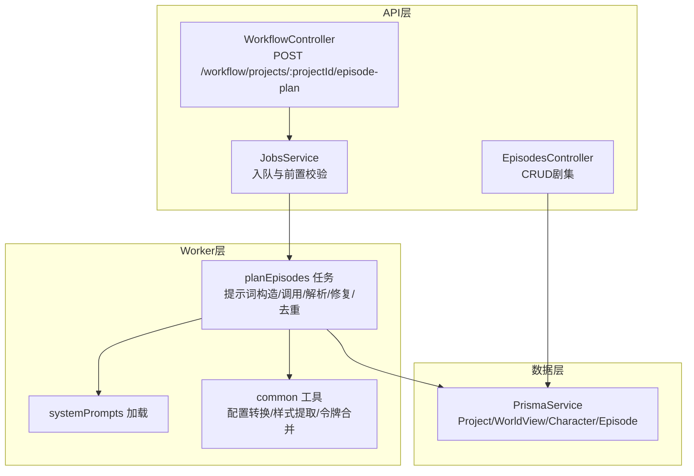
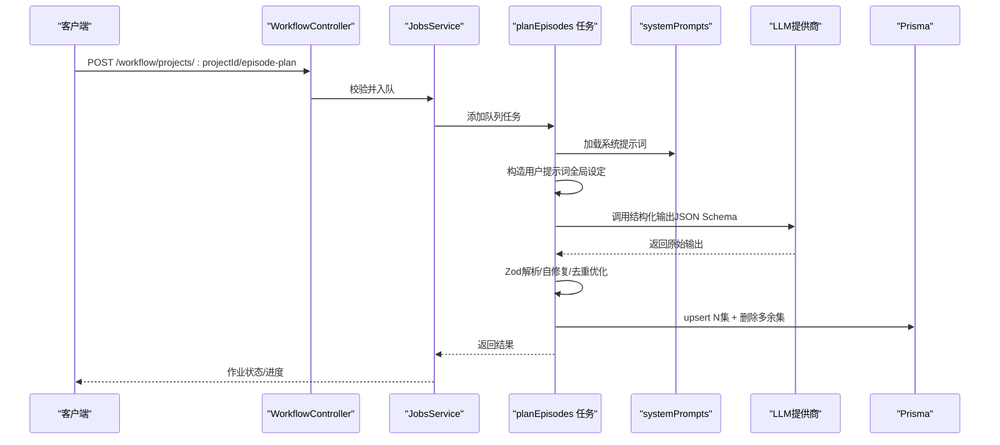
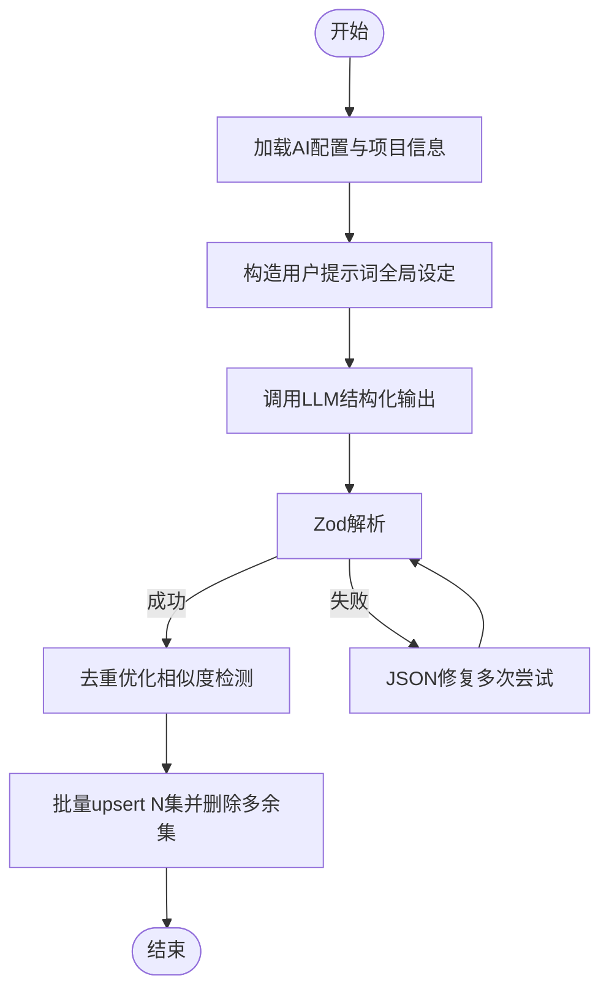
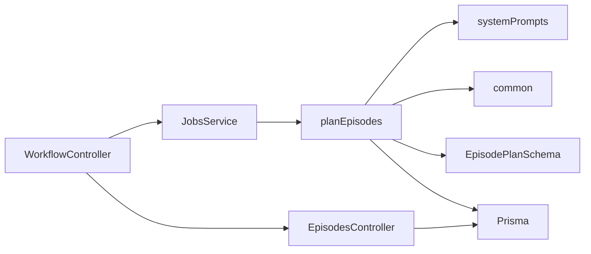

# 剧集规划

<cite>
**本文档引用的文件**
- [apps/worker/src/tasks/planEpisodes.ts](file://apps/worker/src/tasks/planEpisodes.ts)
- [apps/api/src/jobs/planningValidation.ts](file://apps/api/src/jobs/planningValidation.ts)
- [apps/api/src/jobs/planningValidation.test.ts](file://apps/api/src/jobs/planningValidation.test.ts)
- [apps/api/src/jobs/workflow.controller.ts](file://apps/api/src/jobs/workflow.controller.ts)
- [apps/api/src/jobs/jobs.service.ts](file://apps/api/src/jobs/jobs.service.ts)
- [apps/api/src/episodes/episodes.controller.ts](file://apps/api/src/episodes/episodes.controller.ts)
- [apps/api/src/episodes/episodes.service.ts](file://apps/api/src/episodes/episodes.service.ts)
- [packages/shared/src/schemas/episode.ts](file://packages/shared/src/schemas/episode.ts)
- [packages/shared/src/systemPrompts.ts](file://packages/shared/src/systemPrompts.ts)
- [apps/worker/src/tasks/systemPrompts.ts](file://apps/worker/src/tasks/systemPrompts.ts)
- [apps/worker/src/tasks/common.ts](file://apps/worker/src/tasks/common.ts)
- [apps/api/src/world-view/world-view.service.ts](file://apps/api/src/world-view/world-view.service.ts)
- [apps/api/src/characters/characters.service.ts](file://apps/api/src/characters/characters.service.ts)
</cite>

## 目录

1. [简介](#简介)
2. [项目结构](#项目结构)
3. [核心组件](#核心组件)
4. [架构总览](#架构总览)
5. [详细组件分析](#详细组件分析)
6. [依赖分析](#依赖分析)
7. [性能考虑](#性能考虑)
8. [故障排查指南](#故障排查指南)
9. [结论](#结论)
10. [附录](#附录)

## 简介

本文件面向AIXSSS的“剧集规划”能力，系统化阐述从全局设定到结构化输出的全流程技术方案。重点包括：

- 如何综合分析“世界观复杂度、角色关系网、故事体量”等要素，决定推荐集数N；
- 全局设定输入的标准化处理流程（世界观要素、角色设定、画风选择、故事梗概）；
- AI分析过程中的权重计算、决策逻辑与输出格式规范；
- 剧集规划任务的工作流程（从输入收集到结构化落库）；
- API接口设计、请求参数校验与响应格式定义；
- 实际代码示例路径（JSON输出协议、Zod模式校验、自修复机制）；
- 与现有项目系统的兼容性与数据迁移策略。

## 项目结构

围绕“剧集规划”的端到端路径涉及三层：

- API层：接收请求、参数校验、入队作业；
- Worker层：加载系统提示词、构造提示词、调用LLM、解析与修复、去重优化、落库；
- 数据层：Prisma模型与服务封装，提供项目、世界观、角色、剧集等CRUD。

图表来源

- [apps/api/src/jobs/workflow.controller.ts](file://apps/api/src/jobs/workflow.controller.ts#L49-L55)
- [apps/api/src/jobs/jobs.service.ts](file://apps/api/src/jobs/jobs.service.ts#L101-L149)
- [apps/worker/src/tasks/planEpisodes.ts](file://apps/worker/src/tasks/planEpisodes.ts#L387-L611)
- [apps/worker/src/tasks/systemPrompts.ts](file://apps/worker/src/tasks/systemPrompts.ts#L4-L26)
- [apps/worker/src/tasks/common.ts](file://apps/worker/src/tasks/common.ts#L81-L116)
- [apps/api/src/episodes/episodes.controller.ts](file://apps/api/src/episodes/episodes.controller.ts#L14-L52)

章节来源

- [apps/api/src/jobs/workflow.controller.ts](file://apps/api/src/jobs/workflow.controller.ts#L49-L55)
- [apps/api/src/jobs/jobs.service.ts](file://apps/api/src/jobs/jobs.service.ts#L101-L149)
- [apps/worker/src/tasks/planEpisodes.ts](file://apps/worker/src/tasks/planEpisodes.ts#L387-L611)
- [apps/worker/src/tasks/systemPrompts.ts](file://apps/worker/src/tasks/systemPrompts.ts#L4-L26)
- [apps/worker/src/tasks/common.ts](file://apps/worker/src/tasks/common.ts#L81-L116)
- [apps/api/src/episodes/episodes.controller.ts](file://apps/api/src/episodes/episodes.controller.ts#L14-L52)

## 核心组件

- 剧集规划任务入口与执行：planEpisodes
- 参数校验与前置检查：JobsService.enqueuePlanEpisodes + planningValidation
- 系统提示词加载：systemPrompts
- 输入标准化工具：common（样式提取、配置转换、令牌合并）
- 输出模式与校验：shared EpisodePlanSchema
- API控制器与服务：WorkflowController、EpisodesController/Service

章节来源

- [apps/worker/src/tasks/planEpisodes.ts](file://apps/worker/src/tasks/planEpisodes.ts#L387-L611)
- [apps/api/src/jobs/jobs.service.ts](file://apps/api/src/jobs/jobs.service.ts#L101-L149)
- [apps/api/src/jobs/planningValidation.ts](file://apps/api/src/jobs/planningValidation.ts#L15-L32)
- [apps/worker/src/tasks/systemPrompts.ts](file://apps/worker/src/tasks/systemPrompts.ts#L4-L26)
- [apps/worker/src/tasks/common.ts](file://apps/worker/src/tasks/common.ts#L23-L29)
- [packages/shared/src/schemas/episode.ts](file://packages/shared/src/schemas/episode.ts#L38-L64)
- [apps/api/src/jobs/workflow.controller.ts](file://apps/api/src/jobs/workflow.controller.ts#L49-L55)
- [apps/api/src/episodes/episodes.controller.ts](file://apps/api/src/episodes/episodes.controller.ts#L14-L52)

## 架构总览

从“全局设定”到“N集规划”的端到端流程如下：

图表来源

- [apps/api/src/jobs/workflow.controller.ts](file://apps/api/src/jobs/workflow.controller.ts#L49-L55)
- [apps/api/src/jobs/jobs.service.ts](file://apps/api/src/jobs/jobs.service.ts#L101-L149)
- [apps/worker/src/tasks/planEpisodes.ts](file://apps/worker/src/tasks/planEpisodes.ts#L425-L611)
- [apps/worker/src/tasks/systemPrompts.ts](file://apps/worker/src/tasks/systemPrompts.ts#L4-L26)

## 详细组件分析

### 1) 全局设定输入处理与标准化

- 画风选择优先级：优先使用项目配置中的完整提示词，否则回退到style字段。
- 世界设定：按序拼接世界视图元素，限制长度与截断策略。
- 角色库：取最近更新的若干角色，抽取外观、性格、背景等关键字段。
- 叙事因果链：当JSON较短时直接喂给模型；较长时采用摘要/节拍/叙事线等结构化摘要，避免截断。

章节来源

- [apps/worker/src/tasks/planEpisodes.ts](file://apps/worker/src/tasks/planEpisodes.ts#L177-L330)
- [apps/worker/src/tasks/common.ts](file://apps/worker/src/tasks/common.ts#L23-L29)
- [apps/api/src/world-view/world-view.service.ts](file://apps/api/src/world-view/world-view.service.ts#L35-L42)
- [apps/api/src/characters/characters.service.ts](file://apps/api/src/characters/characters.service.ts#L35-L42)

### 2) AI分析与决策逻辑

- 结构化输出：通过JSON Schema约束LLM输出，减少语法错误与字段漂移。
- 自修复机制：解析失败时，使用专用系统提示词引导模型重写为可解析JSON。
- 去重优化：基于集签名（标题/概要/场景范围/节拍）的双字符集Jaccard相似度阈值，识别并改写重复度高的集。
- 集数N决定：支持用户指定目标集数；否则按模型能力与提示词长度动态估算（任务内部默认12集作为基线，结合深度学习模型输出长度策略）。

章节来源

- [apps/worker/src/tasks/planEpisodes.ts](file://apps/worker/src/tasks/planEpisodes.ts#L22-L54)
- [apps/worker/src/tasks/planEpisodes.ts](file://apps/worker/src/tasks/planEpisodes.ts#L71-L74)
- [apps/worker/src/tasks/planEpisodes.ts](file://apps/worker/src/tasks/planEpisodes.ts#L113-L151)
- [apps/worker/src/tasks/planEpisodes.ts](file://apps/worker/src/tasks/planEpisodes.ts#L380-L385)

### 3) 输出格式规范与Zod校验

- EpisodePlanSchema：限定episodeCount与episodes长度一致、顺序连续、字段完备；对节拍、场景范围、钩子等字段进行长度与必填约束。
- CoreExpressionSchema：主题、情感弧（四段）、核心冲突、母题、结尾落点、下一集钩子等字段约束。
- API侧Create/Update输入：通过Zod模式进行参数校验，确保入参安全与一致性。

章节来源

- [packages/shared/src/schemas/episode.ts](file://packages/shared/src/schemas/episode.ts#L38-L64)
- [packages/shared/src/schemas/episode.ts](file://packages/shared/src/schemas/episode.ts#L68-L76)
- [apps/api/src/episodes/episodes.controller.ts](file://apps/api/src/episodes/episodes.controller.ts#L20-L42)

### 4) 剧集规划任务工作流

- 入口：WorkflowController接收请求，JobsService进行项目与AI配置校验，再入队。
- 执行：planEpisodes加载系统提示词，构造用户提示词，调用LLM，解析/修复/去重，最后批量upsert剧集并清理多余集。
- 进度：通过队列事件与服务层映射，向UI反馈进度。

图表来源

- [apps/worker/src/tasks/planEpisodes.ts](file://apps/worker/src/tasks/planEpisodes.ts#L425-L611)

章节来源

- [apps/api/src/jobs/workflow.controller.ts](file://apps/api/src/jobs/workflow.controller.ts#L49-L55)
- [apps/api/src/jobs/jobs.service.ts](file://apps/api/src/jobs/jobs.service.ts#L101-L149)
- [apps/worker/src/tasks/planEpisodes.ts](file://apps/worker/src/tasks/planEpisodes.ts#L425-L611)

### 5) API接口设计与参数校验

- 入口接口：POST /workflow/projects/:projectId/episode-plan
  - 请求体：aiProfileId（必填）、targetEpisodeCount（可选，1..24）
  - 响应：作业ID与状态
- 校验逻辑：
  - JobsService.enqueuePlanEpisodes：校验项目存在、AI配置存在、全局设定可规划（摘要长度、画风完整提示词）
  - planningValidation：摘要长度与画风字段校验
- 剧集CRUD：
  - GET/POST/PATCH/DELETE /projects/:projectId/episodes/:episodeId
  - 输入使用Create/Update Zod模式校验

章节来源

- [apps/api/src/jobs/workflow.controller.ts](file://apps/api/src/jobs/workflow.controller.ts#L49-L55)
- [apps/api/src/jobs/jobs.service.ts](file://apps/api/src/jobs/jobs.service.ts#L101-L149)
- [apps/api/src/jobs/planningValidation.ts](file://apps/api/src/jobs/planningValidation.ts#L15-L32)
- [apps/api/src/episodes/episodes.controller.ts](file://apps/api/src/episodes/episodes.controller.ts#L14-L52)

### 6) 与现有项目系统的兼容性与数据迁移

- 项目上下文：项目表包含summary、style、artStyleConfig、contextCache等字段，其中contextCache用于承载叙事因果链等结构化数据。
- 剧集落库：按order upsert，超出N的部分删除；同时更新项目workflowState为EPISODE_PLAN_EDITING。
- 版本管理：当contextCache中的因果链发生变更时，自动记录版本，保证历史可追溯。

章节来源

- [apps/api/src/projects/projects.service.ts](file://apps/api/src/projects/projects.service.ts#L140-L198)
- [apps/worker/src/tasks/planEpisodes.ts](file://apps/worker/src/tasks/planEpisodes.ts#L569-L598)

## 依赖分析

- 组件耦合
  - WorkflowController依赖JobsService进行入队与校验；
  - JobsService依赖Prisma与队列，调用planEpisodes；
  - planEpisodes依赖systemPrompts、common工具、shared模式、Prisma；
  - EpisodesController/Service提供剧集CRUD能力，与planEpisodes结果联动。
- 外部依赖
  - LLM提供商（OpenAI兼容/Gemini/Doubao Ark/DeepSeek/Kimi）通过toProviderChatConfig统一配置；
  - JSON Schema约束与Zod校验保障输出稳定性。

图表来源

- [apps/api/src/jobs/workflow.controller.ts](file://apps/api/src/jobs/workflow.controller.ts#L49-L55)
- [apps/api/src/jobs/jobs.service.ts](file://apps/api/src/jobs/jobs.service.ts#L101-L149)
- [apps/worker/src/tasks/planEpisodes.ts](file://apps/worker/src/tasks/planEpisodes.ts#L387-L611)
- [apps/worker/src/tasks/systemPrompts.ts](file://apps/worker/src/tasks/systemPrompts.ts#L4-L26)
- [apps/worker/src/tasks/common.ts](file://apps/worker/src/tasks/common.ts#L81-L116)
- [packages/shared/src/schemas/episode.ts](file://packages/shared/src/schemas/episode.ts#L38-L64)
- [apps/api/src/episodes/episodes.controller.ts](file://apps/api/src/episodes/episodes.controller.ts#L14-L52)

## 性能考虑

- 输出长度策略：针对DeepSeek与非DeepSeek分别设置最低maxTokens保底，避免被截断导致JSON不闭合。
- 令牌用量合并：将修复与去重阶段的tokenUsage合并上报，便于成本统计。
- 去重阈值：相似度阈值与改写顺序控制，降低连锁影响与二次修复概率。
- 上下文压缩：当叙事因果链过大时采用摘要策略，避免超长上下文导致截断与性能下降。

章节来源

- [apps/worker/src/tasks/planEpisodes.ts](file://apps/worker/src/tasks/planEpisodes.ts#L444-L456)
- [apps/worker/src/tasks/planEpisodes.ts](file://apps/worker/src/tasks/planEpisodes.ts#L487-L521)
- [apps/worker/src/tasks/planEpisodes.ts](file://apps/worker/src/tasks/planEpisodes.ts#L530-L562)
- [apps/worker/src/tasks/planEpisodes.ts](file://apps/worker/src/tasks/planEpisodes.ts#L198-L330)

## 故障排查指南

- 项目不可规划
  - 现象：入队时报错，缺失字段包含summary或artStyle
  - 处理：补齐项目摘要长度与画风完整提示词
- LLM空内容
  - 现象：AI返回空content
  - 处理：检查供应商可用性、密钥、模型参数
- JSON解析失败
  - 现象：Zod校验抛错
  - 处理：启用自修复机制（最多3次），必要时调整系统提示词
- 去重优化失败
  - 现象：去重输出仍不可解析
  - 处理：回退保留原规划继续落库，避免阻塞主流程
- 剧集删除受阻
  - 现象：存在未完成的AI作业
  - 处理：取消对应作业后再删除

章节来源

- [apps/api/src/jobs/planningValidation.ts](file://apps/api/src/jobs/planningValidation.ts#L15-L32)
- [apps/api/src/jobs/jobs.service.ts](file://apps/api/src/jobs/jobs.service.ts#L77-L86)
- [apps/worker/src/tasks/planEpisodes.ts](file://apps/worker/src/tasks/planEpisodes.ts#L471-L473)
- [apps/worker/src/tasks/planEpisodes.ts](file://apps/worker/src/tasks/planEpisodes.ts#L511-L521)
- [apps/worker/src/tasks/planEpisodes.ts](file://apps/worker/src/tasks/planEpisodes.ts#L554-L562)
- [apps/api/src/episodes/episodes.service.ts](file://apps/api/src/episodes/episodes.service.ts#L124-L142)

## 结论

AIXSSS的“剧集规划”通过系统化的输入标准化、结构化输出约束、自修复与去重优化机制，实现了从全局设定到N集规划的稳定落地。配合API层的参数校验与Worker层的任务编排，既保证了生成质量，又兼顾了工程可维护性与可扩展性。未来可在以下方面持续演进：

- 引入“集数N”的智能推荐算法（基于复杂度指标与历史数据统计）；
- 增强去重策略的语义理解（如基于预训练向量相似度）；
- 提供可视化编辑面板，支持人工微调规划结果。

## 附录

### A. API定义与请求/响应

- 入口
  - POST /workflow/projects/{projectId}/episode-plan
  - 请求体字段：
    - aiProfileId: string（必填）
    - targetEpisodeCount: number（可选，1..24）
  - 响应：作业对象（含进度）

- 剧集CRUD
  - GET /projects/{projectId}/episodes
  - POST /projects/{projectId}/episodes
  - GET /projects/{projectId}/episodes/{episodeId}
  - PATCH /projects/{projectId}/episodes/{episodeId}
  - DELETE /projects/{projectId}/episodes/{episodeId}

章节来源

- [apps/api/src/jobs/workflow.controller.ts](file://apps/api/src/jobs/workflow.controller.ts#L49-L55)
- [apps/api/src/episodes/episodes.controller.ts](file://apps/api/src/episodes/episodes.controller.ts#L14-L52)

### B. 代码示例路径（不含具体代码内容）

- 剧集规划任务主流程
  - [apps/worker/src/tasks/planEpisodes.ts](file://apps/worker/src/tasks/planEpisodes.ts#L387-L611)
- 参数校验与前置检查
  - [apps/api/src/jobs/planningValidation.ts](file://apps/api/src/jobs/planningValidation.ts#L15-L32)
  - [apps/api/src/jobs/jobs.service.ts](file://apps/api/src/jobs/jobs.service.ts#L77-L86)
- 系统提示词加载
  - [apps/worker/src/tasks/systemPrompts.ts](file://apps/worker/src/tasks/systemPrompts.ts#L4-L26)
- 输入标准化工具
  - [apps/worker/src/tasks/common.ts](file://apps/worker/src/tasks/common.ts#L23-L29)
  - [apps/worker/src/tasks/common.ts](file://apps/worker/src/tasks/common.ts#L81-L116)
- 输出模式与校验
  - [packages/shared/src/schemas/episode.ts](file://packages/shared/src/schemas/episode.ts#L38-L64)
  - [packages/shared/src/schemas/episode.ts](file://packages/shared/src/schemas/episode.ts#L68-L76)
- 系统提示词定义
  - [packages/shared/src/systemPrompts.ts](file://packages/shared/src/systemPrompts.ts#L431-L522)
