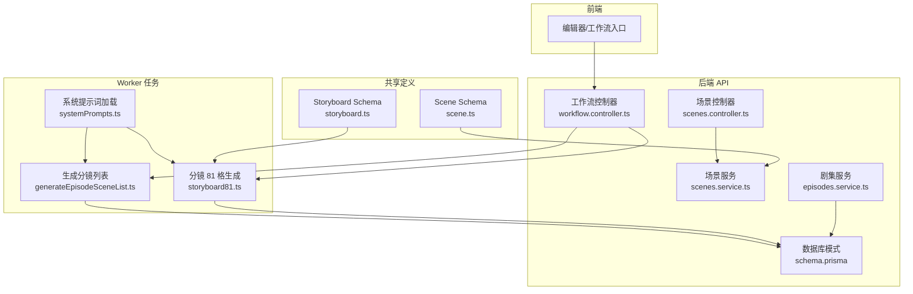
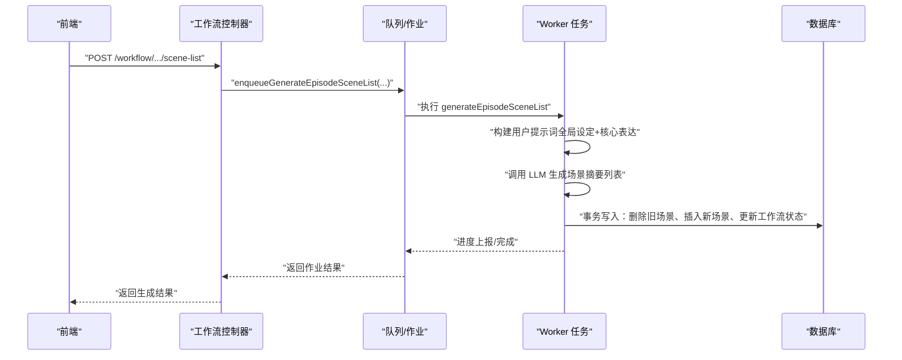
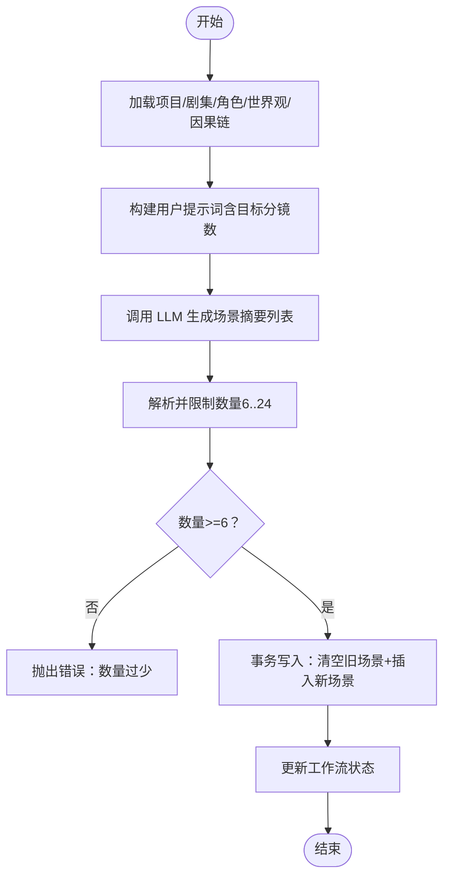
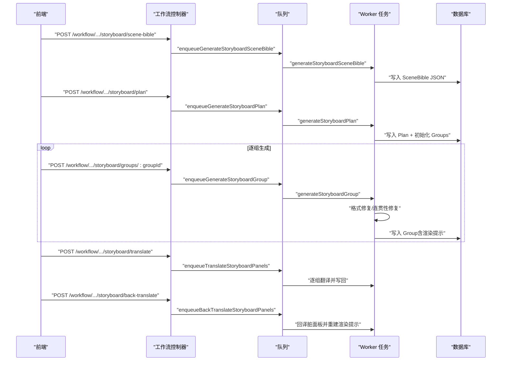
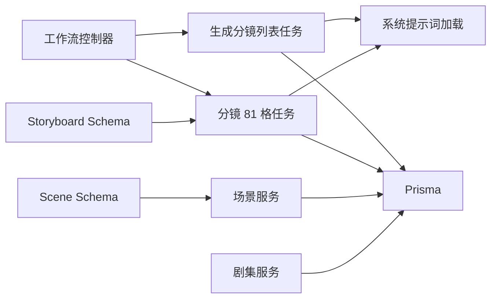

# 分镜生成

<cite>
**本文引用的文件**
- [apps/worker/src/tasks/generateEpisodeSceneList.ts](file://apps/worker/src/tasks/generateEpisodeSceneList.ts)
- [apps/worker/src/tasks/storyboard81.ts](file://apps/worker/src/tasks/storyboard81.ts)
- [apps/api/src/jobs/workflow.controller.ts](file://apps/api/src/jobs/workflow.controller.ts)
- [apps/api/src/scenes/scenes.controller.ts](file://apps/api/src/scenes/scenes.controller.ts)
- [apps/api/src/scenes/scenes.service.ts](file://apps/api/src/scenes/scenes.service.ts)
- [apps/api/src/episodes/episodes.service.ts](file://apps/api/src/episodes/episodes.service.ts)
- [apps/api/prisma/schema.prisma](file://apps/api/prisma/schema.prisma)
- [packages/shared/src/schemas/storyboard.ts](file://packages/shared/src/schemas/storyboard.ts)
- [packages/shared/src/schemas/scene.ts](file://packages/shared/src/schemas/scene.ts)
- [apps/worker/src/tasks/systemPrompts.ts](file://apps/worker/src/tasks/systemPrompts.ts)
</cite>

## 目录

1. [引言](#引言)
2. [项目结构](#项目结构)
3. [核心组件](#核心组件)
4. [架构总览](#架构总览)
5. [详细组件分析](#详细组件分析)
6. [依赖分析](#依赖分析)
7. [性能考量](#性能考量)
8. [故障排查指南](#故障排查指南)
9. [结论](#结论)
10. [附录](#附录)

## 引言

本技术文档聚焦于 AIXSSS 单集创作流程中的“分镜生成”阶段，系统阐述如何基于核心表达与全局设定，生成 8–12 条高质量场景摘要，并进一步支撑后续细化阶段。文档涵盖：

- 场景摘要生成算法与数量控制策略
- 质量保证机制（结构化输出、语义校验、修复重试）
- AI 生成逻辑（上下文注入、批量生成优化）
- 在单集创作流程中的关键作用与衔接
- 完整的 API 接口设计、事务性写入与幂等性保障
- 实际任务实现细节、提示词优化技巧与性能调优方案

## 项目结构

分镜生成涉及前端工作流入口、后端工作流控制器、Worker 任务执行器、数据库模式与共享 Schema 等模块协同。

图表来源

- [apps/api/src/jobs/workflow.controller.ts](file://apps/api/src/jobs/workflow.controller.ts#L44-L266)
- [apps/worker/src/tasks/generateEpisodeSceneList.ts](file://apps/worker/src/tasks/generateEpisodeSceneList.ts#L184-L327)
- [apps/worker/src/tasks/storyboard81.ts](file://apps/worker/src/tasks/storyboard81.ts#L816-L1464)
- [apps/api/prisma/schema.prisma](file://apps/api/prisma/schema.prisma#L16-L51)
- [packages/shared/src/schemas/storyboard.ts](file://packages/shared/src/schemas/storyboard.ts#L1-L180)
- [packages/shared/src/schemas/scene.ts](file://packages/shared/src/schemas/scene.ts#L1-L56)

章节来源

- [apps/api/src/jobs/workflow.controller.ts](file://apps/api/src/jobs/workflow.controller.ts#L44-L266)
- [apps/api/prisma/schema.prisma](file://apps/api/prisma/schema.prisma#L16-L51)

## 核心组件

- 工作流控制器：提供统一的分镜生成入口，封装参数校验与队列调度。
- 生成分镜列表任务：基于全局设定与核心表达，生成 6–24 条场景摘要，限定 8–12 条为推荐区间。
- 分镜 81 格生成任务：面向单场景的 3x3 分镜网格生成，含 SceneBible、计划与逐组生成、连贯性校验、中英互译与回译。
- 数据模型与服务：场景、剧集、作业与项目工作流状态管理，确保事务性写入与幂等性。
- 共享 Schema：强类型约束与校验，保障结构化输出与跨模块一致性。

章节来源

- [apps/worker/src/tasks/generateEpisodeSceneList.ts](file://apps/worker/src/tasks/generateEpisodeSceneList.ts#L184-L327)
- [apps/worker/src/tasks/storyboard81.ts](file://apps/worker/src/tasks/storyboard81.ts#L816-L1464)
- [apps/api/src/scenes/scenes.service.ts](file://apps/api/src/scenes/scenes.service.ts#L23-L364)
- [apps/api/src/episodes/episodes.service.ts](file://apps/api/src/episodes/episodes.service.ts#L28-L146)
- [packages/shared/src/schemas/storyboard.ts](file://packages/shared/src/schemas/storyboard.ts#L1-L180)
- [packages/shared/src/schemas/scene.ts](file://packages/shared/src/schemas/scene.ts#L1-L56)

## 架构总览

分镜生成在单集创作流程中承担“由宏观到微观”的桥梁作用：先以核心表达与全局设定生成场景摘要，再逐场景细化为 3x3 分镜网格，确保节拍、角色、道具与镜头语言的一致性。

图表来源

- [apps/api/src/jobs/workflow.controller.ts](file://apps/api/src/jobs/workflow.controller.ts#L94-L105)
- [apps/worker/src/tasks/generateEpisodeSceneList.ts](file://apps/worker/src/tasks/generateEpisodeSceneList.ts#L184-L327)
- [apps/api/prisma/schema.prisma](file://apps/api/prisma/schema.prisma#L16-L51)

## 详细组件分析

### 组件 A：生成分镜列表（6–24 条，推荐 8–12 条）

- 输入：项目全局设定（故事梗概、画风、世界观、角色）、当前集核心表达、上一集核心表达与已生成分镜（避免重复）。
- 数量控制：默认 12 条；支持 6–24 区间；若 AI 返回少于 6 条则报错，提示调整提示词。
- 提示词构建：将多源上下文压缩为结构化提示，确保风格与主题一致性。
- 写入策略：使用事务一次性删除旧场景并插入新场景，同时更新剧集与项目工作流状态，保证原子性与幂等性。

图表来源

- [apps/worker/src/tasks/generateEpisodeSceneList.ts](file://apps/worker/src/tasks/generateEpisodeSceneList.ts#L184-L327)
- [apps/api/prisma/schema.prisma](file://apps/api/prisma/schema.prisma#L16-L51)

章节来源

- [apps/worker/src/tasks/generateEpisodeSceneList.ts](file://apps/worker/src/tasks/generateEpisodeSceneList.ts#L184-L327)
- [apps/api/src/jobs/workflow.controller.ts](file://apps/api/src/jobs/workflow.controller.ts#L94-L105)

### 组件 B：分镜 81 格生成（单场景细化）

- 三步法：
  1. 生成 SceneBible：从场景摘要、动作脚本、环境锚点与角色名集合中抽取场景前提、角色、设定锁、关键道具与必须发生的节拍。
  2. 生成计划（Storyboard Plan）：产出 9 组，每组包含目标英文描述与起止连续状态，确保 3x3 射击范围与组序号一一对应。
  3. 逐组生成（Storyboard Group）：每组 9 个面板，强制 1–9 不重复、镜头语言规范（A/B 模式），并进行连贯性校验（角色/道具承接）。
- 质量保证：
  - 结构化输出：通过 JSON Schema 严格约束字段与类型。
  - 语义校验：基础校验（面板数量/索引/重复）、镜头模式校验、连贯性校验（角色/道具承接）。
  - 修复重试：格式修复与连贯性修复双通道，最多两次尝试。
- 中英互译与回译：支持面板中文翻译与脏标记回译，自动重建渲染提示，保证视觉一致性。
- 幂等与状态：每组状态包含 generating/ready/needs_fix，失败时记录 last_error，UI 可据此重试或修复。

图表来源

- [apps/api/src/jobs/workflow.controller.ts](file://apps/api/src/jobs/workflow.controller.ts#L139-L197)
- [apps/worker/src/tasks/storyboard81.ts](file://apps/worker/src/tasks/storyboard81.ts#L816-L1464)
- [packages/shared/src/schemas/storyboard.ts](file://packages/shared/src/schemas/storyboard.ts#L69-L180)

章节来源

- [apps/worker/src/tasks/storyboard81.ts](file://apps/worker/src/tasks/storyboard81.ts#L816-L1464)
- [packages/shared/src/schemas/storyboard.ts](file://packages/shared/src/schemas/storyboard.ts#L1-L180)

### 组件 C：API 接口设计与事务性写入

- 工作流接口：
  - 生成分镜列表：POST /workflow/projects/:projectId/episodes/:episodeId/scene-list（支持 sceneCountHint）
  - 生成 SceneBible：POST /workflow/projects/:projectId/scenes/:sceneId/storyboard/scene-bible
  - 生成计划：POST /workflow/projects/:projectId/scenes/:sceneId/storyboard/plan（支持 cameraMode）
  - 生成分镜组：POST /workflow/projects/:projectId/scenes/:sceneId/storyboard/groups/:groupId（支持 cameraMode）
  - 翻译/回译：POST /workflow/projects/:projectId/scenes/:sceneId/storyboard/translate | back-translate
- 场景 CRUD：
  - GET/POST/PATCH/DELETE /projects/:projectId/scenes（支持重排）
- 事务性写入与幂等性：
  - 生成分镜列表：使用事务删除旧场景并插入新场景，同时更新工作流状态，避免中间态不一致。
  - 分镜组生成：先写入 generating 状态，成功后置为 ready，失败记录 last_error，支持重试修复。
  - 场景删除：若存在运行中 AI 作业则拒绝删除，防止并发破坏。

章节来源

- [apps/api/src/jobs/workflow.controller.ts](file://apps/api/src/jobs/workflow.controller.ts#L94-L197)
- [apps/api/src/scenes/scenes.controller.ts](file://apps/api/src/scenes/scenes.controller.ts#L14-L64)
- [apps/api/src/scenes/scenes.service.ts](file://apps/api/src/scenes/scenes.service.ts#L23-L364)
- [apps/api/src/episodes/episodes.service.ts](file://apps/api/src/episodes/episodes.service.ts#L28-L146)

### 组件 D：数据模型与状态机

- 项目工作流状态：包含 EPISODE_CREATING、SCENE_LIST_GENERATING/EDITING/CONFIRMED、SCENE_PROCESSING 等，确保流程有序推进。
- 剧集工作流状态：CORE_EXPRESSION_READY、SCENE_LIST_EDITING、SCENE_PROCESSING、COMPLETE。
- 场景状态：pending、scene_generating、scene_confirmed、keyframe_generating、keyframe_confirmed、motion_generating、completed、needs_update。
- 数据库模式：Scene/Episode/AIJob/Project 等模型定义了字段、索引与外键关系，支撑分镜生成与后续细化的数据承载。

章节来源

- [apps/api/prisma/schema.prisma](file://apps/api/prisma/schema.prisma#L16-L51)
- [apps/api/prisma/schema.prisma](file://apps/api/prisma/schema.prisma#L176-L233)

## 依赖分析

- 组件耦合：
  - 工作流控制器依赖 JobsService 将请求入队，Worker 任务依赖 Provider 与系统提示词加载。
  - Worker 任务依赖共享 Schema 进行结构化输出与校验，依赖 Prisma 访问数据库。
  - 场景服务与剧集服务提供数据访问与业务约束（如删除前检查 AI 作业）。
- 外部依赖：
  - LLM Provider（通过 toProviderChatConfig 与 decryptApiKey 注入密钥）。
  - 系统提示词存储于 SystemPrompt 表，支持团队级定制与回退默认内容。

图表来源

- [apps/api/src/jobs/workflow.controller.ts](file://apps/api/src/jobs/workflow.controller.ts#L44-L266)
- [apps/worker/src/tasks/systemPrompts.ts](file://apps/worker/src/tasks/systemPrompts.ts#L4-L27)
- [apps/worker/src/tasks/generateEpisodeSceneList.ts](file://apps/worker/src/tasks/generateEpisodeSceneList.ts#L184-L327)
- [apps/worker/src/tasks/storyboard81.ts](file://apps/worker/src/tasks/storyboard81.ts#L816-L1464)
- [packages/shared/src/schemas/storyboard.ts](file://packages/shared/src/schemas/storyboard.ts#L1-L180)
- [packages/shared/src/schemas/scene.ts](file://packages/shared/src/schemas/scene.ts#L1-L56)

## 性能考量

- 批量生成优化：
  - 生成分镜列表：一次事务写入，减少多次往返；解析与写入阶段采用进度上报，前端可感知。
  - 分镜组生成：逐组并行化（UI 层可并行触发），每组内部格式修复与连贯性修复采用最小修改策略，降低重复计算。
- 上下文注入优化：
  - 使用 styleFullPrompt 合成完整画风提示词，避免模型遗漏关键风格元素。
  - 叙事因果链采用智能压缩策略：短 JSON 直接喂入，长 JSON 则摘要截断，兼顾完整性与长度限制。
- Token 用量统计：
  - 任务内聚合 tokenUsage，便于成本控制与性能分析。
- 网络与并发：
  - 通过队列与作业状态管理，避免重复触发与竞态；删除场景前检查 AI 作业，防止并发破坏。

## 故障排查指南

- 生成分镜列表报错“数量过少”：
  - 检查核心表达是否充分、画风是否明确、上一集重复项是否过多导致被过滤。
  - 调整 sceneCountHint 或优化提示词后重试。
- 分镜组生成失败：
  - 查看 last_error 字段，确认是格式问题还是连贯性问题；优先修复格式，再进行连贯性修复。
  - 确认上一组已生成且状态为 ready。
- 删除场景失败：
  - 若存在运行中 AI 作业，需取消作业后再删除；检查 aIJob 表中对应状态。
- 翻译/回译异常：
  - 确保所有分镜组已 ready；脏标记面板需存在且非空；回译后会自动重建渲染提示。

章节来源

- [apps/worker/src/tasks/generateEpisodeSceneList.ts](file://apps/worker/src/tasks/generateEpisodeSceneList.ts#L298-L301)
- [apps/worker/src/tasks/storyboard81.ts](file://apps/worker/src/tasks/storyboard81.ts#L1190-L1208)
- [apps/api/src/scenes/scenes.service.ts](file://apps/api/src/scenes/scenes.service.ts#L255-L280)
- [apps/api/prisma/schema.prisma](file://apps/api/prisma/schema.prisma#L311-L335)

## 结论

分镜生成在 AIXSSS 单集创作流程中起到“纲举目张”的关键作用：既保证场景摘要的数量与质量，又为后续细化阶段提供稳定的结构化锚点。通过严格的结构化输出、语义校验与修复重试机制，结合事务性写入与幂等性保障，系统能够在复杂创作过程中维持一致性与可追溯性。建议在实际使用中：

- 明确核心表达与画风，确保提示词质量；
- 控制分镜数量在 8–12 条之间，兼顾效率与细节；
- 重视连贯性校验与翻译回译，提升视觉一致性；
- 利用进度与状态监控，及时发现并修复问题。

## 附录

### A. 提示词优化技巧

- 全局设定注入：将故事梗概、画风、世界观、角色库与叙事因果链整合为结构化提示，避免遗漏关键信息。
- 避免重复：利用上一集核心表达与已生成分镜列表，指导 AI 在新集中避免重复主题与桥段。
- 目标明确：在提示词中明确目标分镜数（6–24），并给出风格与节拍要求。

### B. 性能调优方案

- 任务并行：分镜组生成支持并行触发，缩短整体耗时。
- 上下文压缩：对长因果链采用摘要策略，减少上下文长度。
- 修复策略：优先格式修复，再进行连贯性修复，减少无效重试。

### C. API 接口一览（节选）

- 生成分镜列表：POST /workflow/projects/{projectId}/episodes/{episodeId}/scene-list（sceneCountHint 可选）
- 生成 SceneBible：POST /workflow/projects/{projectId}/scenes/{sceneId}/storyboard/scene-bible
- 生成计划：POST /workflow/projects/{projectId}/scenes/{sceneId}/storyboard/plan（cameraMode 可选）
- 生成分镜组：POST /workflow/projects/{projectId}/scenes/{sceneId}/storyboard/groups/{groupId}（cameraMode 可选）
- 翻译/回译：POST /workflow/projects/{projectId}/scenes/{sceneId}/storyboard/translate | back-translate

章节来源

- [apps/api/src/jobs/workflow.controller.ts](file://apps/api/src/jobs/workflow.controller.ts#L94-L197)
