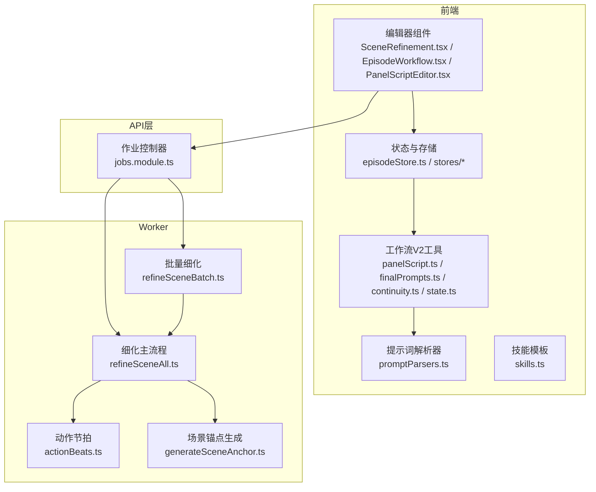
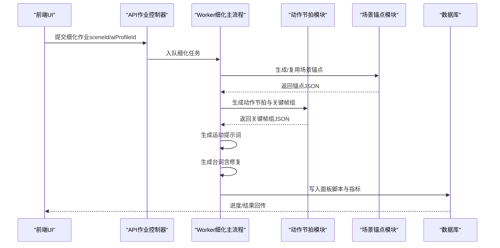
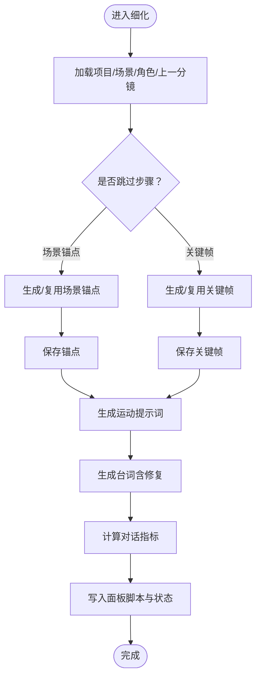
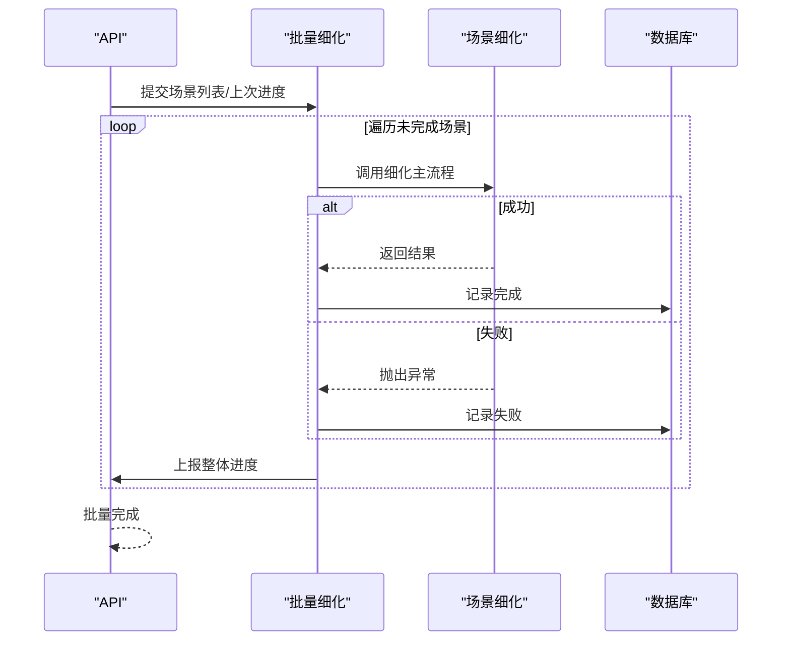
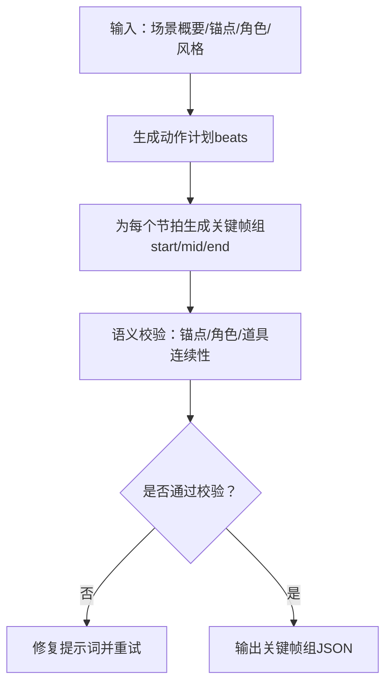
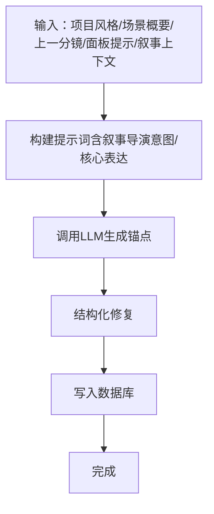
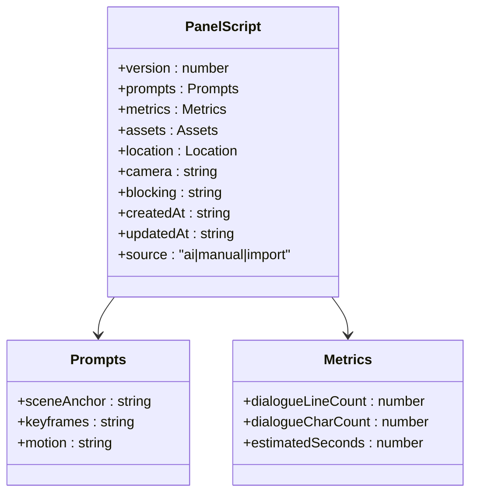
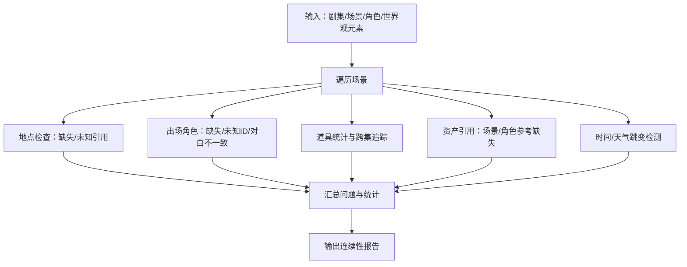
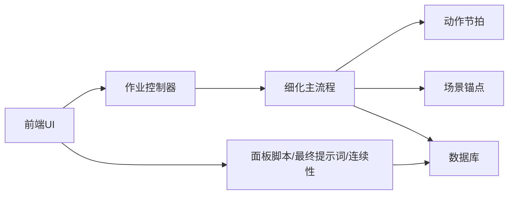

# 分镜细化

<cite>
**本文档引用的文件**
- [apps/worker/src/tasks/refineSceneAll.ts](file://apps/worker/src/tasks/refineSceneAll.ts)
- [apps/worker/src/tasks/refineSceneBatch.ts](file://apps/worker/src/tasks/refineSceneBatch.ts)
- [apps/worker/src/tasks/actionBeats.ts](file://apps/worker/src/tasks/actionBeats.ts)
- [apps/worker/src/tasks/generateSceneAnchor.ts](file://apps/worker/src/tasks/generateSceneAnchor.ts)
- [apps/web/src/lib/workflowV2/panelScript.ts](file://apps/web/src/lib/workflowV2/panelScript.ts)
- [apps/web/src/lib/workflowV2/finalPrompts.ts](file://apps/web/src/lib/workflowV2/finalPrompts.ts)
- [apps/web/src/lib/workflowV2/continuity.ts](file://apps/web/src/lib/workflowV2/continuity.ts)
- [apps/web/src/lib/workflowV2/state.ts](file://apps/web/src/lib/workflowV2/state.ts)
- [apps/web/src/lib/ai/promptParsers.ts](file://apps/web/src/lib/ai/promptParsers.ts)
- [apps/web/src/lib/ai/skills.ts](file://apps/web/src/lib/ai/skills.ts)
- [apps/web/src/components/editor/SceneRefinement.tsx](file://apps/web/src/components/editor/SceneRefinement.tsx)
- [apps/web/src/components/editor/EpisodeWorkflow.tsx](file://apps/web/src/components/editor/EpisodeWorkflow.tsx)
- [apps/web/src/components/editor/PanelScriptEditor.tsx](file://apps/web/src/components/editor/PanelScriptEditor.tsx)
- [apps/web/src/stores/episodeStore.ts](file://apps/web/src/stores/episodeStore.ts)
- [apps/api/src/jobs/jobs.module.ts](file://apps/api/src/jobs/jobs.module.ts)
- [docs/prd/episode-planning-workflow.md](file://docs/prd/episode-planning-workflow.md)
</cite>

## 目录

1. [简介](#简介)
2. [项目结构](#项目结构)
3. [核心组件](#核心组件)
4. [架构总览](#架构总览)
5. [详细组件分析](#详细组件分析)
6. [依赖分析](#依赖分析)
7. [性能考虑](#性能考虑)
8. [故障排查指南](#故障排查指南)
9. [结论](#结论)
10. [附录](#附录)

## 简介

本章节概述分镜细化在AIXSSS单集创作流程中的定位与价值。细化阶段以Scene Anchor、Keyframe、Motion、Dialogue生成能力为基础，围绕每个场景构建高质量、可执行的分镜创作内容，并通过面板脚本（Panel Script）统一承载与校验。细化流程强调：

- 复用既有生成能力：场景锚点、关键帧、运动提示词、台词四类生成器无缝衔接
- 并行化与批处理：支持按场景批量细化，具备断点续跑与失败重试
- 上下文构建：结合叙事因果链、剧集核心表达、角色与资产等上下文
- 质量控制：结构化输出修复、连续性校验、指标度量与一致性保障
- 最终价值：为后续图生图、视频生成与剪辑提供稳定、一致、可追溯的创作素材

## 项目结构

分镜细化涉及前后端协作：

- 前端负责用户交互、提示词工程、面板脚本与最终提示词拼装、连续性报告与工作流状态管理
- 后端Worker负责具体细化任务的执行、结构化输出修复、上下文注入与数据库持久化
- API层负责作业入队、进度回传与结果聚合

**图表来源**

- [apps/web/src/components/editor/SceneRefinement.tsx](file://apps/web/src/components/editor/SceneRefinement.tsx#L897-L930)
- [apps/web/src/components/editor/EpisodeWorkflow.tsx](file://apps/web/src/components/editor/EpisodeWorkflow.tsx#L1045-L1079)
- [apps/web/src/lib/workflowV2/panelScript.ts](file://apps/web/src/lib/workflowV2/panelScript.ts#L247-L281)
- [apps/web/src/lib/workflowV2/finalPrompts.ts](file://apps/web/src/lib/workflowV2/finalPrompts.ts#L193-L231)
- [apps/web/src/lib/workflowV2/continuity.ts](file://apps/web/src/lib/workflowV2/continuity.ts#L80-L120)
- [apps/web/src/lib/ai/skills.ts](file://apps/web/src/lib/ai/skills.ts#L251-L284)
- [apps/api/src/jobs/jobs.module.ts](file://apps/api/src/jobs/jobs.module.ts#L1-L13)
- [apps/worker/src/tasks/refineSceneAll.ts](file://apps/worker/src/tasks/refineSceneAll.ts#L262-L695)
- [apps/worker/src/tasks/refineSceneBatch.ts](file://apps/worker/src/tasks/refineSceneBatch.ts#L41-L182)
- [apps/worker/src/tasks/actionBeats.ts](file://apps/worker/src/tasks/actionBeats.ts#L545-L577)
- [apps/worker/src/tasks/generateSceneAnchor.ts](file://apps/worker/src/tasks/generateSceneAnchor.ts#L18-L79)

**章节来源**

- [apps/web/src/components/editor/EpisodeWorkflow.tsx](file://apps/web/src/components/editor/EpisodeWorkflow.tsx#L1045-L1079)
- [apps/api/src/jobs/jobs.module.ts](file://apps/api/src/jobs/jobs.module.ts#L1-L13)

## 核心组件

- 场景细化主流程（refineSceneAll）：按步骤依次生成/复用Scene Anchor、Keyframe、Motion、Dialogue，并写入数据库与面板脚本
- 批量细化（refineSceneBatch）：支持多场景串行细化、断点续跑、失败收集与整体进度上报
- 动作节拍（actionBeats）：将场景概要拆解为若干动作节拍，驱动关键帧组生成
- 场景锚点生成（generateSceneAnchor）：在叙事意图与剧集核心表达指导下生成场景锚点
- 面板脚本工具（panelScript）：标准化面板脚本结构，合并/规范化提示词与指标
- 最终提示词拼装（finalPrompts）：将锚点、关键帧、运动提示词拼装为图像/视频生成提示词
- 连续性校验（continuity）：跨集/跨场景一致性检查与统计
- 技能模板（skills）：为Dialogue生成提供系统提示词模板

**章节来源**

- [apps/worker/src/tasks/refineSceneAll.ts](file://apps/worker/src/tasks/refineSceneAll.ts#L262-L695)
- [apps/worker/src/tasks/refineSceneBatch.ts](file://apps/worker/src/tasks/refineSceneBatch.ts#L41-L182)
- [apps/worker/src/tasks/actionBeats.ts](file://apps/worker/src/tasks/actionBeats.ts#L545-L577)
- [apps/worker/src/tasks/generateSceneAnchor.ts](file://apps/worker/src/tasks/generateSceneAnchor.ts#L18-L79)
- [apps/web/src/lib/workflowV2/panelScript.ts](file://apps/web/src/lib/workflowV2/panelScript.ts#L247-L281)
- [apps/web/src/lib/workflowV2/finalPrompts.ts](file://apps/web/src/lib/workflowV2/finalPrompts.ts#L193-L231)
- [apps/web/src/lib/workflowV2/continuity.ts](file://apps/web/src/lib/workflowV2/continuity.ts#L80-L120)
- [apps/web/src/lib/ai/skills.ts](file://apps/web/src/lib/ai/skills.ts#L251-L284)

## 架构总览

细化流程从场景出发，复用既有生成能力，逐步完善创作内容，并通过面板脚本统一承载。前端负责提示词工程与可视化，后端负责结构化输出修复与上下文注入。

**图表来源**

- [apps/worker/src/tasks/refineSceneAll.ts](file://apps/worker/src/tasks/refineSceneAll.ts#L326-L695)
- [apps/worker/src/tasks/actionBeats.ts](file://apps/worker/src/tasks/actionBeats.ts#L545-L577)
- [apps/worker/src/tasks/generateSceneAnchor.ts](file://apps/worker/src/tasks/generateSceneAnchor.ts#L81-L228)
- [apps/web/src/components/editor/EpisodeWorkflow.tsx](file://apps/web/src/components/editor/EpisodeWorkflow.tsx#L1045-L1079)

## 详细组件分析

### 组件A：细化主流程（refineSceneAll）

细化主流程按步骤执行，支持跳过与手动覆盖、结构化输出修复、令牌用量统计与最终状态推进。

- 跳过与覆盖：支持跳过场景锚点/关键帧生成，并允许手动覆盖
- 结构化修复：对各步输出进行结构化修复，确保JSON可解析与合规
- 令牌统计：累计各步令牌用量，便于成本控制
- 状态推进：细化完成后尝试推进剧集/项目的完成状态

**图表来源**

- [apps/worker/src/tasks/refineSceneAll.ts](file://apps/worker/src/tasks/refineSceneAll.ts#L322-L695)

**章节来源**

- [apps/worker/src/tasks/refineSceneAll.ts](file://apps/worker/src/tasks/refineSceneAll.ts#L262-L695)

### 组件B：批量细化（refineSceneBatch）

批量细化负责多场景串行细化、断点续跑、失败收集与整体进度上报。

- 断点续跑：根据上次进度过滤已完成/失败场景
- 进度聚合：将场景级进度映射为整体百分比
- 失败收集：汇总失败场景以便重试或人工介入

**图表来源**

- [apps/worker/src/tasks/refineSceneBatch.ts](file://apps/worker/src/tasks/refineSceneBatch.ts#L41-L182)

**章节来源**

- [apps/worker/src/tasks/refineSceneBatch.ts](file://apps/worker/src/tasks/refineSceneBatch.ts#L41-L182)

### 组件C：动作节拍（actionBeats）

动作节拍将场景概要拆解为若干动作节拍，驱动关键帧组生成，并进行连续性校验与修复。

- JSON Schema响应格式：确保输出结构化与可解析
- 语义校验：连续性规则、锚点一致性、可见差异阈值
- 修复循环：校验失败时提供修复提示词并重试

**图表来源**

- [apps/worker/src/tasks/actionBeats.ts](file://apps/worker/src/tasks/actionBeats.ts#L545-L577)
- [apps/worker/src/tasks/actionBeats.ts](file://apps/worker/src/tasks/actionBeats.ts#L734-L800)

**章节来源**

- [apps/worker/src/tasks/actionBeats.ts](file://apps/worker/src/tasks/actionBeats.ts#L545-L577)
- [apps/worker/src/tasks/actionBeats.ts](file://apps/worker/src/tasks/actionBeats.ts#L734-L800)

### 组件D：场景锚点生成（generateSceneAnchor）

在叙事意图与剧集核心表达指导下生成场景锚点，增强环境一致性与风格融合。

- 叙事上下文：基于因果链与情感曲线位置提供导演意图
- 核心表达：结合剧集核心表达指导场景氛围与细节
- 结构化修复：确保输出符合预期格式

**图表来源**

- [apps/worker/src/tasks/generateSceneAnchor.ts](file://apps/worker/src/tasks/generateSceneAnchor.ts#L18-L79)
- [apps/worker/src/tasks/generateSceneAnchor.ts](file://apps/worker/src/tasks/generateSceneAnchor.ts#L81-L228)

**章节来源**

- [apps/worker/src/tasks/generateSceneAnchor.ts](file://apps/worker/src/tasks/generateSceneAnchor.ts#L18-L79)
- [apps/worker/src/tasks/generateSceneAnchor.ts](file://apps/worker/src/tasks/generateSceneAnchor.ts#L81-L228)

### 组件E：面板脚本与最终提示词（panelScript / finalPrompts）

面板脚本标准化承载提示词与指标；最终提示词拼装将锚点、关键帧、运动提示词组合为图像/视频生成提示词。

- 标准化：统一版本、字段与来源
- 合并：将场景锚点、关键帧、运动提示词合并至prompts
- 指标：统计对话行数、字符数与估计时长

**图表来源**

- [apps/web/src/lib/workflowV2/panelScript.ts](file://apps/web/src/lib/workflowV2/panelScript.ts#L247-L281)

**章节来源**

- [apps/web/src/lib/workflowV2/panelScript.ts](file://apps/web/src/lib/workflowV2/panelScript.ts#L247-L281)
- [apps/web/src/lib/workflowV2/finalPrompts.ts](file://apps/web/src/lib/workflowV2/finalPrompts.ts#L193-L231)

### 组件F：连续性校验（continuity）

跨集/跨场景一致性检查，识别地点、角色、道具、时间/天气等潜在问题。

- 问题级别：error/warn/info
- 统计维度：面板数、角色出场次数、道具出现次数、跨集变化

**图表来源**

- [apps/web/src/lib/workflowV2/continuity.ts](file://apps/web/src/lib/workflowV2/continuity.ts#L80-L120)
- [apps/web/src/lib/workflowV2/continuity.ts](file://apps/web/src/lib/workflowV2/continuity.ts#L134-L294)

**章节来源**

- [apps/web/src/lib/workflowV2/continuity.ts](file://apps/web/src/lib/workflowV2/continuity.ts#L80-L120)
- [apps/web/src/lib/workflowV2/continuity.ts](file://apps/web/src/lib/workflowV2/continuity.ts#L134-L294)

## 依赖分析

- 前端依赖后端Worker提供的细化能力；通过作业控制器提交任务并轮询进度
- Worker内部依赖结构化输出修复、系统提示词加载、面板提示词注入等工具
- 细化流程依赖动作节拍模块生成关键帧组，再回填至面板脚本
- 连续性校验依赖面板脚本与资产绑定信息

**图表来源**

- [apps/api/src/jobs/jobs.module.ts](file://apps/api/src/jobs/jobs.module.ts#L1-L13)
- [apps/worker/src/tasks/refineSceneAll.ts](file://apps/worker/src/tasks/refineSceneAll.ts#L262-L695)
- [apps/web/src/lib/workflowV2/panelScript.ts](file://apps/web/src/lib/workflowV2/panelScript.ts#L247-L281)

**章节来源**

- [apps/api/src/jobs/jobs.module.ts](file://apps/api/src/jobs/jobs.module.ts#L1-L13)
- [apps/worker/src/tasks/refineSceneAll.ts](file://apps/worker/src/tasks/refineSceneAll.ts#L262-L695)

## 性能考虑

- 并行策略
  - 批量细化采用串行逐场景推进，避免并发资源争用；可在上游进行场景分组与优先级排序
  - 关键帧生成优先使用动作节拍路径，失败回退直动生成9帧，减少重复计算
- 上下文构建
  - 使用面板提示词注入（panel hints）降低重复输入，提升生成一致性
  - 叙事上下文与核心表达注入，减少风格漂移与节奏偏差
- 输出修复
  - 结构化修复与JSON Schema双重保障，减少重试与人工干预
- 指标与监控
  - 令牌用量统计用于成本控制与预算预警
  - 进度聚合与失败收集便于可观测性与SLA达成

[本节为通用性能讨论，无需特定文件来源]

## 故障排查指南

- 生成失败
  - 检查AI Profile配置与密钥解密；确认系统提示词加载成功
  - 查看结构化修复日志与重试记录
- 输出格式异常
  - 校验JSON Schema与语义校验规则；必要时启用修复提示词
- 连续性问题
  - 使用连续性报告定位地点、角色、道具、时间/天气等问题
  - 在面板脚本中补充缺失信息或修正引用
- 进度停滞
  - 检查批量细化的断点续跑参数与已完成/失败集合
  - 确认数据库状态更新与作业进度上报

**章节来源**

- [apps/worker/src/tasks/refineSceneAll.ts](file://apps/worker/src/tasks/refineSceneAll.ts#L322-L386)
- [apps/worker/src/tasks/actionBeats.ts](file://apps/worker/src/tasks/actionBeats.ts#L734-L800)
- [apps/web/src/lib/workflowV2/continuity.ts](file://apps/web/src/lib/workflowV2/continuity.ts#L80-L120)
- [apps/web/src/stores/episodeStore.ts](file://apps/web/src/stores/episodeStore.ts#L309-L323)

## 结论

分镜细化通过复用Scene Anchor、Keyframe、Motion、Dialogue生成能力，结合面板脚本标准化与最终提示词拼装，实现了从概要到可执行创作内容的高效转化。并行化与断点续跑提升了规模化生产的稳定性，结构化修复与连续性校验保障了质量与一致性。最终，细化结果为后续图生图与视频生成提供了坚实基础。

[本节为总结性内容，无需特定文件来源]

## 附录

### API接口设计（面向后端实现）

- 作业控制器模块暴露作业入口，遵循现有JobsService返回结构
- 建议新增细化相关作业类型与参数，确保查询/上下文构建能拿到剧集信息

**章节来源**

- [apps/api/src/jobs/jobs.module.ts](file://apps/api/src/jobs/jobs.module.ts#L1-L13)
- [docs/prd/episode-planning-workflow.md](file://docs/prd/episode-planning-workflow.md#L367-L387)

### 任务编排逻辑与提示词工程

- 任务编排：前端提交细化作业 → API入队 → Worker细化主流程 → 数据库写入 → 前端轮询进度
- 提示词工程：利用系统提示词模板、面板提示词注入、叙事上下文与核心表达，提升生成质量与一致性

**章节来源**

- [apps/web/src/components/editor/EpisodeWorkflow.tsx](file://apps/web/src/components/editor/EpisodeWorkflow.tsx#L1045-L1079)
- [apps/web/src/lib/ai/skills.ts](file://apps/web/src/lib/ai/skills.ts#L251-L284)
- [apps/worker/src/tasks/generateSceneAnchor.ts](file://apps/worker/src/tasks/generateSceneAnchor.ts#L18-L79)

### 批量处理优化与错误恢复

- 批量处理：按剧集/场景顺序推进，支持断点续跑与失败重试
- 错误恢复：记录失败场景与错误详情，便于人工介入与重试

**章节来源**

- [apps/worker/src/tasks/refineSceneBatch.ts](file://apps/worker/src/tasks/refineSceneBatch.ts#L41-L182)

### 性能监控方案

- 令牌用量统计：累计细化各步令牌用量，用于成本控制
- 进度上报：整体进度与场景级进度双层上报，便于前端反馈与后端调度

**章节来源**

- [apps/worker/src/tasks/refineSceneAll.ts](file://apps/worker/src/tasks/refineSceneAll.ts#L362-L372)
- [apps/web/src/stores/episodeStore.ts](file://apps/web/src/stores/episodeStore.ts#L309-L323)
