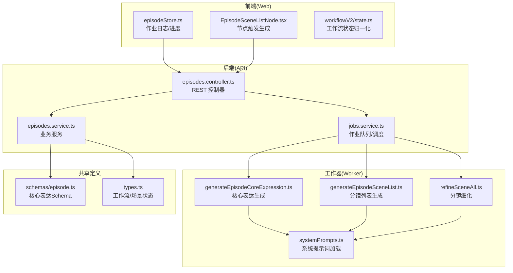
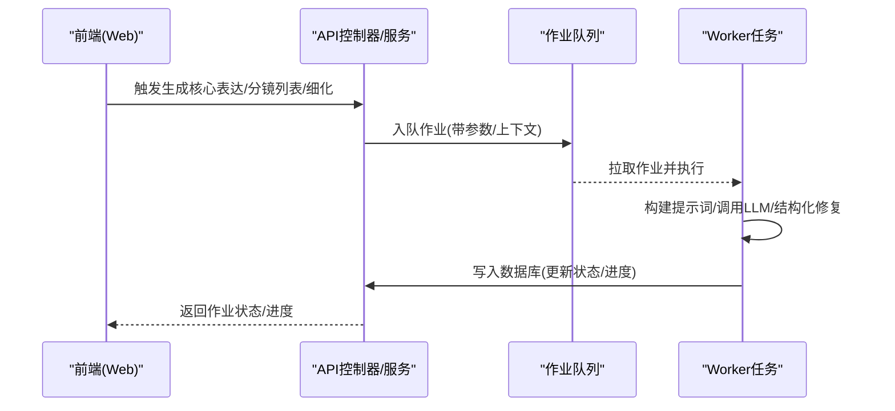
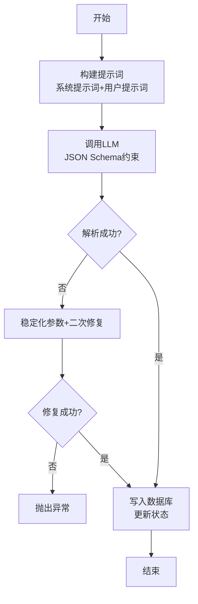
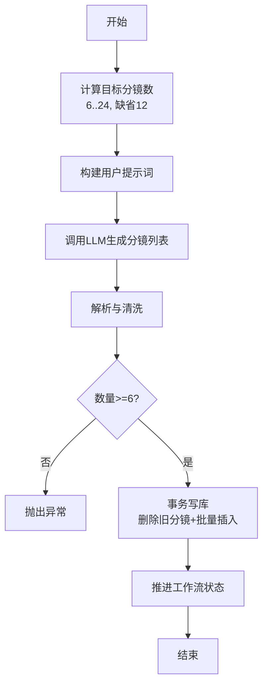
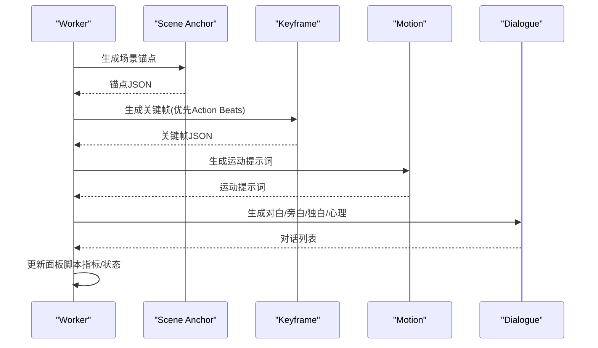
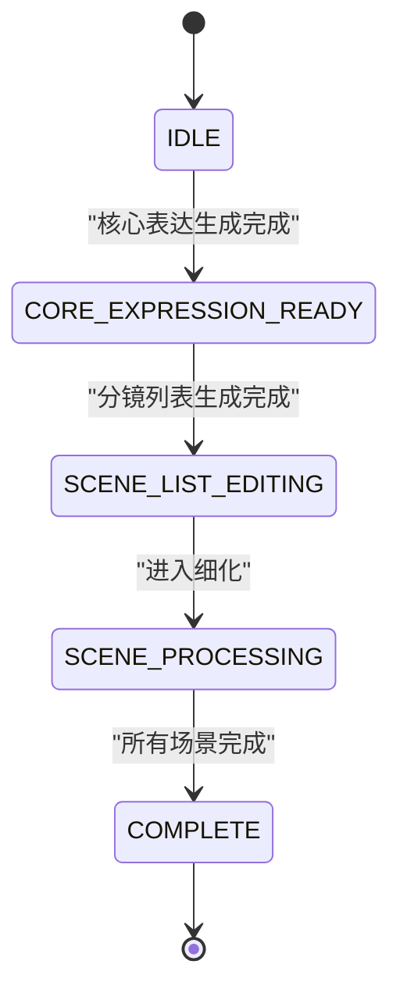
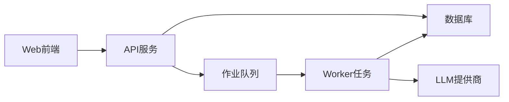

# 单集创作

<cite>
**本文档引用的文件**
- [apps/worker/src/tasks/generateEpisodeCoreExpression.ts](file://apps/worker/src/tasks/generateEpisodeCoreExpression.ts)
- [apps/worker/src/tasks/generateEpisodeSceneList.ts](file://apps/worker/src/tasks/generateEpisodeSceneList.ts)
- [apps/worker/src/tasks/refineSceneAll.ts](file://apps/worker/src/tasks/refineSceneAll.ts)
- [apps/worker/src/tasks/systemPrompts.ts](file://apps/worker/src/tasks/systemPrompts.ts)
- [apps/api/src/jobs/jobs.service.ts](file://apps/api/src/jobs/jobs.service.ts)
- [apps/api/src/episodes/episodes.service.ts](file://apps/api/src/episodes/episodes.service.ts)
- [apps/api/src/episodes/episodes.controller.ts](file://apps/api/src/episodes/episodes.controller.ts)
- [packages/shared/src/schemas/episode.ts](file://packages/shared/src/schemas/episode.ts)
- [packages/shared/src/types.ts](file://packages/shared/src/types.ts)
- [apps/web/src/stores/episodeStore.ts](file://apps/web/src/stores/episodeStore.ts)
- [apps/web/src/components/canvas/nodes/EpisodeSceneListNode.tsx](file://apps/web/src/components/canvas/nodes/EpisodeSceneListNode.tsx)
- [apps/web/src/lib/workflowV2/state.ts](file://apps/web/src/lib/workflowV2/state.ts)
</cite>

## 目录

1. [引言](#引言)
2. [项目结构](#项目结构)
3. [核心组件](#核心组件)
4. [架构总览](#架构总览)
5. [详细组件分析](#详细组件分析)
6. [依赖分析](#依赖分析)
7. [性能考虑](#性能考虑)
8. [故障排查指南](#故障排查指南)
9. [结论](#结论)
10. [附录](#附录)

## 引言

本文件面向AIXSSS单集创作工作流，系统化梳理从“核心表达设定”到“分镜生成”，再到“分镜细化”的完整流程。文档覆盖以下要点：

- 三个核心阶段的输入输出规范、AI处理逻辑与数据流转
- 核心表达设定阶段如何生成主题句、情绪主线、核心冲突、观众预期管理与视觉母题等结构化内容
- 分镜生成阶段的场景摘要生成算法与数量控制策略
- 分镜细化阶段对Scene Anchor、Keyframe、Motion与Dialogue生成能力的复用
- 完整的API接口设计、状态机转换逻辑与错误处理机制
- 实际代码示例路径，帮助读者快速定位实现细节与最佳实践

## 项目结构

围绕单集创作的关键代码分布在以下模块：

- 工作流执行器（Worker）：负责具体AI任务的提示词构建、调用与持久化
- 后端服务（API）：提供作业队列调度、作业状态查询与资源校验
- 前端存储与节点：负责作业日志、进度上报与可视化节点操作
- 共享类型与模式：统一定义工作流状态、场景状态、核心表达结构等

**图表来源**

- [apps/web/src/stores/episodeStore.ts](file://apps/web/src/stores/episodeStore.ts#L331-L361)
- [apps/web/src/components/canvas/nodes/EpisodeSceneListNode.tsx](file://apps/web/src/components/canvas/nodes/EpisodeSceneListNode.tsx#L41-L77)
- [apps/web/src/lib/workflowV2/state.ts](file://apps/web/src/lib/workflowV2/state.ts#L27-L74)
- [apps/api/src/episodes/episodes.controller.ts](file://apps/api/src/episodes/episodes.controller.ts#L1-L55)
- [apps/api/src/episodes/episodes.service.ts](file://apps/api/src/episodes/episodes.service.ts#L1-L146)
- [apps/api/src/jobs/jobs.service.ts](file://apps/api/src/jobs/jobs.service.ts#L193-L347)
- [apps/worker/src/tasks/generateEpisodeCoreExpression.ts](file://apps/worker/src/tasks/generateEpisodeCoreExpression.ts#L254-L426)
- [apps/worker/src/tasks/generateEpisodeSceneList.ts](file://apps/worker/src/tasks/generateEpisodeSceneList.ts#L184-L327)
- [apps/worker/src/tasks/refineSceneAll.ts](file://apps/worker/src/tasks/refineSceneAll.ts#L262-L695)
- [apps/worker/src/tasks/systemPrompts.ts](file://apps/worker/src/tasks/systemPrompts.ts#L1-L27)
- [packages/shared/src/schemas/episode.ts](file://packages/shared/src/schemas/episode.ts#L68-L76)
- [packages/shared/src/types.ts](file://packages/shared/src/types.ts#L6-L32)

**章节来源**

- [apps/web/src/stores/episodeStore.ts](file://apps/web/src/stores/episodeStore.ts#L331-L361)
- [apps/web/src/components/canvas/nodes/EpisodeSceneListNode.tsx](file://apps/web/src/components/canvas/nodes/EpisodeSceneListNode.tsx#L41-L77)
- [apps/web/src/lib/workflowV2/state.ts](file://apps/web/src/lib/workflowV2/state.ts#L27-L74)
- [apps/api/src/episodes/episodes.controller.ts](file://apps/api/src/episodes/episodes.controller.ts#L1-L55)
- [apps/api/src/episodes/episodes.service.ts](file://apps/api/src/episodes/episodes.service.ts#L1-L146)
- [apps/api/src/jobs/jobs.service.ts](file://apps/api/src/jobs/jobs.service.ts#L193-L347)
- [apps/worker/src/tasks/generateEpisodeCoreExpression.ts](file://apps/worker/src/tasks/generateEpisodeCoreExpression.ts#L254-L426)
- [apps/worker/src/tasks/generateEpisodeSceneList.ts](file://apps/worker/src/tasks/generateEpisodeSceneList.ts#L184-L327)
- [apps/worker/src/tasks/refineSceneAll.ts](file://apps/worker/src/tasks/refineSceneAll.ts#L262-L695)
- [apps/worker/src/tasks/systemPrompts.ts](file://apps/worker/src/tasks/systemPrompts.ts#L1-L27)
- [packages/shared/src/schemas/episode.ts](file://packages/shared/src/schemas/episode.ts#L68-L76)
- [packages/shared/src/types.ts](file://packages/shared/src/types.ts#L6-L32)

## 核心组件

- 核心表达生成（Worker）
  - 输入：项目全局设定、画风、世界观、角色、叙事因果链、相邻集衔接信息、本集信息
  - 输出：结构化核心表达（主题、情绪主线、核心冲突、收益点、视觉母题、结尾节拍、下一集钩子）
  - 关键实现：提示词构建、系统提示词加载、JSON Schema约束、稳定化参数、二次修复与写库
- 分镜列表生成（Worker）
  - 输入：项目全局设定、画风、世界观、角色、叙事因果链、本集核心表达、上一集核心表达与分镜列表
  - 输出：场景摘要列表（6–24条，缺省12条）
  - 关键实现：目标分镜数控制、解析与清洗、事务写库、工作流状态推进
- 分镜细化（Worker）
  - 步骤：Scene Anchor → Keyframe → Motion → Dialogue
  - 复用既有能力：Action Beats生成Keyframe Groups、Motion Prompt、Dialogue生成
  - 关键实现：结构化输出修复、面板脚本指标计算、场景/剧集/项目完成态推进
- API与作业调度（API）
  - 提供REST接口触发核心表达、分镜列表与细化作业，并进行资源存在性与参数校验
- 共享Schema与类型（Shared）
  - 统一定义核心表达Schema、工作流状态枚举、场景状态与步骤

**章节来源**

- [apps/worker/src/tasks/generateEpisodeCoreExpression.ts](file://apps/worker/src/tasks/generateEpisodeCoreExpression.ts#L254-L426)
- [apps/worker/src/tasks/generateEpisodeSceneList.ts](file://apps/worker/src/tasks/generateEpisodeSceneList.ts#L184-L327)
- [apps/worker/src/tasks/refineSceneAll.ts](file://apps/worker/src/tasks/refineSceneAll.ts#L262-L695)
- [apps/api/src/jobs/jobs.service.ts](file://apps/api/src/jobs/jobs.service.ts#L193-L347)
- [packages/shared/src/schemas/episode.ts](file://packages/shared/src/schemas/episode.ts#L68-L76)
- [packages/shared/src/types.ts](file://packages/shared/src/types.ts#L6-L32)

## 架构总览

单集创作工作流采用“前端触发 → API作业调度 → Worker执行 → 数据库持久化”的分层架构。前端通过作业日志与进度上报感知执行状态，后端对项目、剧集、场景与AI配置进行强校验，Worker侧以系统提示词与结构化输出保障质量。

**图表来源**

- [apps/web/src/stores/episodeStore.ts](file://apps/web/src/stores/episodeStore.ts#L331-L361)
- [apps/api/src/jobs/jobs.service.ts](file://apps/api/src/jobs/jobs.service.ts#L193-L347)
- [apps/worker/src/tasks/generateEpisodeCoreExpression.ts](file://apps/worker/src/tasks/generateEpisodeCoreExpression.ts#L254-L426)
- [apps/worker/src/tasks/generateEpisodeSceneList.ts](file://apps/worker/src/tasks/generateEpisodeSceneList.ts#L184-L327)
- [apps/worker/src/tasks/refineSceneAll.ts](file://apps/worker/src/tasks/refineSceneAll.ts#L262-L695)

## 详细组件分析

### 核心表达设定（Core Expression）

- 输入规范
  - 全局设定：故事梗概、画风、世界观、角色
  - 上下游集衔接：上一集/下一集的集数、标题、一句话概要、Outline、Core Expression
  - 本集信息：集数、标题、一句话概要、Outline
- 处理逻辑
  - 加载系统提示词与用户提示词
  - 使用JSON Schema约束响应格式，确保字段完整性
  - 若首次解析失败，启用稳定化参数与二次修复流程
  - 将结果写入剧集记录并推进工作流状态
- 输出规范
  - 结构化核心表达对象，包含主题、四幕情绪弧、核心冲突、收益点、视觉母题、结尾节拍、下一集钩子
- 错误处理
  - 项目/剧集不存在、AI配置缺失、解析失败（含二次修复失败）均抛出异常
- 最佳实践
  - 在生成前确保项目上下文缓存与角色/世界设定完备
  - 利用相邻集衔接避免“单集孤岛”，提升跨集一致性

**图表来源**

- [apps/worker/src/tasks/generateEpisodeCoreExpression.ts](file://apps/worker/src/tasks/generateEpisodeCoreExpression.ts#L314-L426)
- [apps/worker/src/tasks/systemPrompts.ts](file://apps/worker/src/tasks/systemPrompts.ts#L1-L27)

**章节来源**

- [apps/worker/src/tasks/generateEpisodeCoreExpression.ts](file://apps/worker/src/tasks/generateEpisodeCoreExpression.ts#L194-L349)
- [apps/worker/src/tasks/generateEpisodeCoreExpression.ts](file://apps/worker/src/tasks/generateEpisodeCoreExpression.ts#L354-L426)
- [packages/shared/src/schemas/episode.ts](file://packages/shared/src/schemas/episode.ts#L68-L76)

### 分镜生成（Storyboard Generation）

- 输入规范
  - 全局设定、画风、世界观、角色、叙事因果链
  - 本集核心表达（必填）
  - 上一集核心表达与最近若干分镜（用于避免重复）
- 处理逻辑
  - 计算目标分镜数：范围6–24，缺省12
  - 构建用户提示词并调用LLM生成分镜摘要列表
  - 解析与清洗：去除序号、去空、限制条数
  - 事务写库：清空旧分镜、批量插入新分镜、推进工作流状态
- 输出规范
  - 场景摘要数组（顺序编号、摘要文本）
- 错误处理
  - 缺失核心表达、返回分镜数过少、数据库事务失败等
- 最佳实践
  - 在生成前确保核心表达已生成
  - 合理设置目标分镜数以平衡创意与可控性

**图表来源**

- [apps/worker/src/tasks/generateEpisodeSceneList.ts](file://apps/worker/src/tasks/generateEpisodeSceneList.ts#L244-L282)
- [apps/worker/src/tasks/generateEpisodeSceneList.ts](file://apps/worker/src/tasks/generateEpisodeSceneList.ts#L288-L327)

**章节来源**

- [apps/worker/src/tasks/generateEpisodeSceneList.ts](file://apps/worker/src/tasks/generateEpisodeSceneList.ts#L184-L327)

### 分镜细化（Storyboard Refinement）

- 复用能力
  - Scene Anchor：基于当前分镜与面板提示生成场景锚点
  - Keyframe：优先使用Action Beats生成Keyframe Groups，回退时直接生成9帧关键帧提示词
  - Motion：基于场景锚点与关键帧生成运动提示词
  - Dialogue：基于场景概要、锚点、关键帧与运动提示词生成对白/旁白/独白/心理
- 处理逻辑
  - 读取项目与角色信息、面板脚本提示
  - 依序执行四步生成，每步均进行结构化输出修复
  - 计算对话指标（行数、字符数、预估时长），更新面板脚本
  - 推进场景/剧集/项目完成态
- 输出规范
  - 场景锚点、关键帧提示词、运动提示词、对话列表、token用量
- 错误处理
  - 场景不存在、跳过但未提供手动覆盖、Action Beats失败回退仍失败等
- 最佳实践
  - 合理利用面板脚本提示提升镜头节奏与角色一致性
  - 对于Action Beats不可用的场景，保留回退方案

**图表来源**

- [apps/worker/src/tasks/refineSceneAll.ts](file://apps/worker/src/tasks/refineSceneAll.ts#L326-L695)

**章节来源**

- [apps/worker/src/tasks/refineSceneAll.ts](file://apps/worker/src/tasks/refineSceneAll.ts#L262-L695)

### API接口设计与状态机

- 接口设计
  - 剧集资源：GET/POST/PATCH/DELETE /projects/:projectId/episodes
  - 作业调度：enqueueGenerateEpisodeCoreExpression、enqueueGenerateEpisodeSceneList、enqueueRefineSceneAll等
- 状态机
  - 项目工作流状态：EPISODE_CREATING、SCENE_PROCESSING、ALL_SCENES_COMPLETE等
  - 剧集工作流状态：CORE_EXPRESSION_READY、SCENE_LIST_EDITING、SCENE_PROCESSING、COMPLETE
  - 场景状态：pending、scene_generating、scene_confirmed、keyframe_generating、motion_generating、completed等
- 错误处理
  - 项目/剧集/场景不存在、AI配置缺失、参数越界、作业执行异常等均有明确错误码与消息

**图表来源**

- [packages/shared/src/types.ts](file://packages/shared/src/types.ts#L6-L32)

**章节来源**

- [apps/api/src/episodes/episodes.controller.ts](file://apps/api/src/episodes/episodes.controller.ts#L1-L55)
- [apps/api/src/episodes/episodes.service.ts](file://apps/api/src/episodes/episodes.service.ts#L1-L146)
- [apps/api/src/jobs/jobs.service.ts](file://apps/api/src/jobs/jobs.service.ts#L193-L347)
- [packages/shared/src/types.ts](file://packages/shared/src/types.ts#L6-L32)

## 依赖分析

- 组件耦合
  - Worker任务依赖系统提示词加载与共享Schema，确保输出一致性
  - API层对资源存在性与参数进行前置校验，降低Worker执行期失败概率
  - 前端通过作业日志与进度上报反馈执行状态
- 外部依赖
  - LLM提供商适配（通过toProviderChatConfig与解密后的API Key）
  - Redis队列（BullMQ）承载异步作业调度
- 循环依赖
  - 未发现直接循环依赖；各层职责清晰（Web/API/Worker）

**图表来源**

- [apps/api/src/jobs/jobs.service.ts](file://apps/api/src/jobs/jobs.service.ts#L193-L347)
- [apps/worker/src/tasks/systemPrompts.ts](file://apps/worker/src/tasks/systemPrompts.ts#L1-L27)

**章节来源**

- [apps/api/src/jobs/jobs.service.ts](file://apps/api/src/jobs/jobs.service.ts#L193-L347)
- [apps/worker/src/tasks/systemPrompts.ts](file://apps/worker/src/tasks/systemPrompts.ts#L1-L27)

## 性能考虑

- 提示词长度控制：对画风、世界设定、角色、因果链等进行截断与摘要，避免上下文溢出
- 稳定化参数：在JSON修复场景下降低温度与惩罚项，提高稳定性
- 批量写入：分镜列表生成采用事务批量插入，减少IO次数
- 回退策略：Action Beats不可用时回退到直接生成关键帧提示词，保障可用性
- 作业并发：通过队列与重试/backoff机制提升吞吐与容错

## 故障排查指南

- 常见错误
  - 项目/剧集/场景不存在：检查ID与归属团队
  - 缺少核心表达：先执行核心表达生成
  - 参数越界：目标分镜数需在6–24范围内
  - JSON解析失败：确认系统提示词可用、模型支持结构化输出
- 排查步骤
  - 查看作业日志与进度（前端episodeStore）
  - 核对AI配置（提供商、模型、API Key）
  - 检查系统提示词是否被团队自定义覆盖
  - 重试或调整提示词/参数后再次执行

**章节来源**

- [apps/web/src/stores/episodeStore.ts](file://apps/web/src/stores/episodeStore.ts#L331-L361)
- [apps/api/src/jobs/jobs.service.ts](file://apps/api/src/jobs/jobs.service.ts#L193-L347)
- [apps/worker/src/tasks/generateEpisodeCoreExpression.ts](file://apps/worker/src/tasks/generateEpisodeCoreExpression.ts#L370-L426)

## 结论

单集创作工作流通过“核心表达—分镜—细化”的三层递进，结合系统提示词与结构化输出修复，实现了高质量、可追溯的AI辅助创作体验。前端以作业日志与进度反馈提升可观测性，后端以严格的资源校验与状态机保障可靠性，Worker以稳定的提示词工程与回退策略确保鲁棒性。建议在实际落地中重视上下文完整性与提示词质量，充分利用面板脚本与Action Beats能力，持续优化分镜数量与节奏控制。

## 附录

- 代码示例路径（不展示具体代码内容）
  - 核心表达生成：[apps/worker/src/tasks/generateEpisodeCoreExpression.ts](file://apps/worker/src/tasks/generateEpisodeCoreExpression.ts#L254-L426)
  - 分镜列表生成：[apps/worker/src/tasks/generateEpisodeSceneList.ts](file://apps/worker/src/tasks/generateEpisodeSceneList.ts#L184-L327)
  - 分镜细化（四步生成）：[apps/worker/src/tasks/refineSceneAll.ts](file://apps/worker/src/tasks/refineSceneAll.ts#L326-L695)
  - 作业调度入口（API）：[apps/api/src/jobs/jobs.service.ts](file://apps/api/src/jobs/jobs.service.ts#L193-L347)
  - 剧集资源接口（API）：[apps/api/src/episodes/episodes.controller.ts](file://apps/api/src/episodes/episodes.controller.ts#L1-L55)
  - 核心表达Schema（Shared）：[packages/shared/src/schemas/episode.ts](file://packages/shared/src/schemas/episode.ts#L68-L76)
  - 工作流状态（Shared）：[packages/shared/src/types.ts](file://packages/shared/src/types.ts#L6-L32)
  - 前端作业日志与进度（Web）：[apps/web/src/stores/episodeStore.ts](file://apps/web/src/stores/episodeStore.ts#L331-L361)
  - 节点触发分镜生成（Web）：[apps/web/src/components/canvas/nodes/EpisodeSceneListNode.tsx](file://apps/web/src/components/canvas/nodes/EpisodeSceneListNode.tsx#L41-L77)
  - 工作流状态归一化（Web）：[apps/web/src/lib/workflowV2/state.ts](file://apps/web/src/lib/workflowV2/state.ts#L27-L74)
