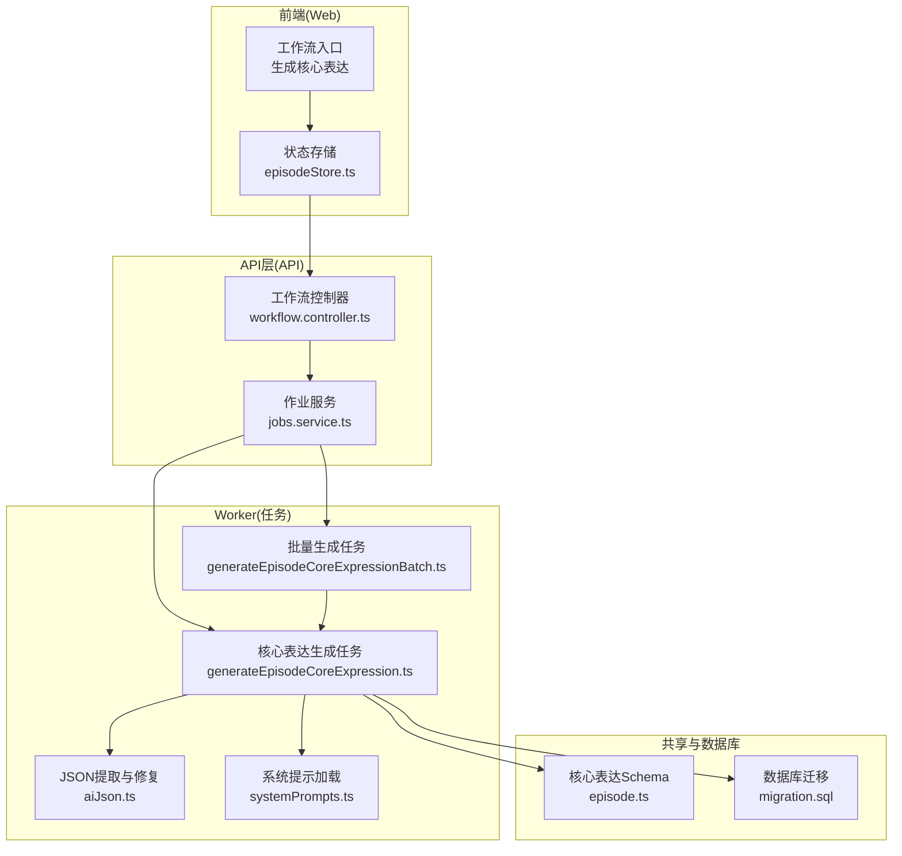
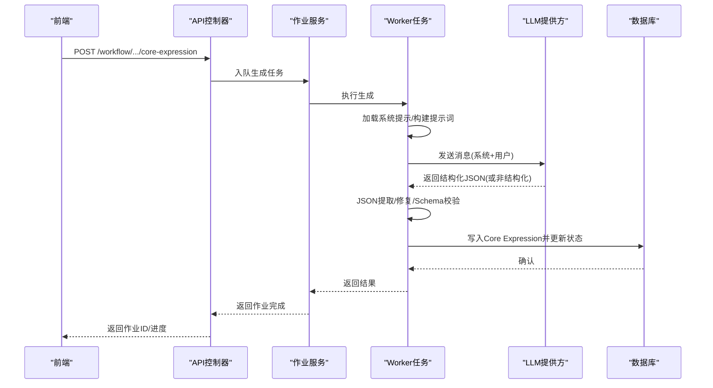
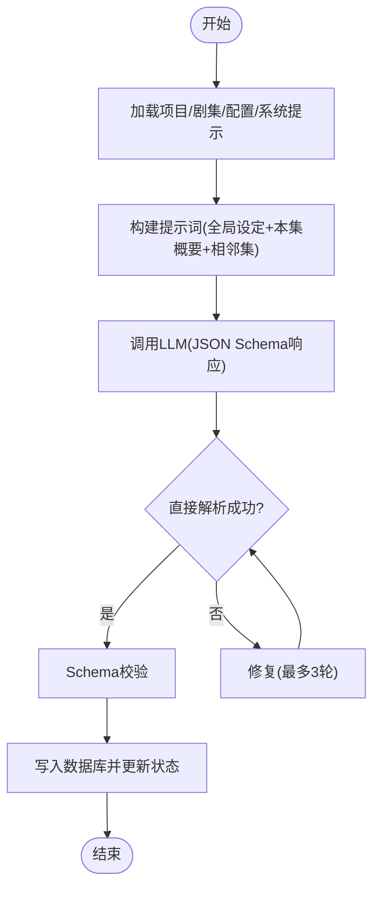
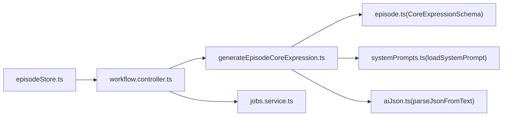

# 核心表达设定

<cite>
**本文档引用的文件**
- [generateEpisodeCoreExpression.ts](file://apps/worker/src/tasks/generateEpisodeCoreExpression.ts)
- [generateEpisodeCoreExpressionBatch.ts](file://apps/worker/src/tasks/generateEpisodeCoreExpressionBatch.ts)
- [aiJson.ts](file://apps/worker/src/tasks/aiJson.ts)
- [systemPrompts.ts](file://apps/worker/src/tasks/systemPrompts.ts)
- [episode.ts](file://packages/shared/src/schemas/episode.ts)
- [systemPrompts.ts](file://packages/shared/src/systemPrompts.ts)
- [workflow.controller.ts](file://apps/api/src/jobs/workflow.controller.ts)
- [jobs.service.ts](file://apps/api/src/jobs/jobs.service.ts)
- [migration.sql](file://apps/api/prisma/migrations/20251215203000_add_episode_planning/migration.sql)
- [episodeStore.ts](file://apps/web/src/stores/episodeStore.ts)
- [EpisodeNode.tsx](file://apps/web/src/components/canvas/nodes/EpisodeNode.tsx)
- [workflow.ts](file://apps/web/src/lib/api/workflow.ts)
- [generateEpisodeCoreExpression.test.ts](file://apps/worker/src/tasks/generateEpisodeCoreExpression.test.ts)
</cite>

## 目录

1. [简介](#简介)
2. [项目结构](#项目结构)
3. [核心组件](#核心组件)
4. [架构总览](#架构总览)
5. [详细组件分析](#详细组件分析)
6. [依赖分析](#依赖分析)
7. [性能考虑](#性能考虑)
8. [故障排查指南](#故障排查指南)
9. [结论](#结论)
10. [附录](#附录)

## 简介

本章节概述AIXSSS单集创作流程中“核心表达设定”阶段的目标与价值：从全局设定与剧集概要中抽取关键创作要素，形成主题句、情绪主线、核心冲突、观众预期管理与视觉母题等结构化内容，作为后续分镜生成的稳定创作基础。该阶段通过系统化的提示词工程、上下文注入策略、结构化输出与Schema校验，确保AI生成结果的稳定性与可消费性。

## 项目结构

围绕核心表达设定的关键模块分布于Worker侧的任务实现、共享Schema定义、API控制器与前端工作流入口，形成“提示词构建→LLM调用→JSON提取与修复→Schema校验→持久化”的闭环。

图表来源

- [workflow.controller.ts](file://apps/api/src/jobs/workflow.controller.ts#L70-L92)
- [jobs.service.ts](file://apps/api/src/jobs/jobs.service.ts#L193-L231)
- [generateEpisodeCoreExpression.ts](file://apps/worker/src/tasks/generateEpisodeCoreExpression.ts#L254-L425)
- [generateEpisodeCoreExpressionBatch.ts](file://apps/worker/src/tasks/generateEpisodeCoreExpressionBatch.ts#L46-L192)
- [aiJson.ts](file://apps/worker/src/tasks/aiJson.ts#L222-L315)
- [systemPrompts.ts](file://apps/worker/src/tasks/systemPrompts.ts#L4-L26)
- [episode.ts](file://packages/shared/src/schemas/episode.ts#L68-L76)
- [migration.sql](file://apps/api/prisma/migrations/20251215203000_add_episode_planning/migration.sql#L32-L39)

章节来源

- [workflow.controller.ts](file://apps/api/src/jobs/workflow.controller.ts#L70-L92)
- [jobs.service.ts](file://apps/api/src/jobs/jobs.service.ts#L193-L231)
- [generateEpisodeCoreExpression.ts](file://apps/worker/src/tasks/generateEpisodeCoreExpression.ts#L254-L425)
- [generateEpisodeCoreExpressionBatch.ts](file://apps/worker/src/tasks/generateEpisodeCoreExpressionBatch.ts#L46-L192)
- [aiJson.ts](file://apps/worker/src/tasks/aiJson.ts#L222-L315)
- [systemPrompts.ts](file://apps/worker/src/tasks/systemPrompts.ts#L4-L26)
- [episode.ts](file://packages/shared/src/schemas/episode.ts#L68-L76)
- [migration.sql](file://apps/api/prisma/migrations/20251215203000_add_episode_planning/migration.sql#L32-L39)

## 核心组件

- 核心表达生成任务：负责拼装提示词、调用LLM、解析与修复JSON、Schema校验、写入数据库并推进工作流状态。
- 批量生成任务：支持对项目内多集批量生成，具备断点续跑、跳过已存在结果的能力。
- JSON提取与修复：提供从LLM输出中提取首段完整JSON、修复常见语法问题与括号不匹配的工具。
- 系统提示加载：按团队与键值动态加载可定制的系统提示，确保生成指令一致性。
- 核心表达Schema：定义主题、情绪弧、核心冲突、回报、视觉母题、结尾落点与下一集钩子的结构化约束。
- API控制器与作业服务：暴露REST接口，入队生成任务，统一参数校验与错误处理。
- 前端工作流入口：提供UI触发、进度展示与日志记录。

章节来源

- [generateEpisodeCoreExpression.ts](file://apps/worker/src/tasks/generateEpisodeCoreExpression.ts#L254-L425)
- [generateEpisodeCoreExpressionBatch.ts](file://apps/worker/src/tasks/generateEpisodeCoreExpressionBatch.ts#L46-L192)
- [aiJson.ts](file://apps/worker/src/tasks/aiJson.ts#L222-L315)
- [systemPrompts.ts](file://apps/worker/src/tasks/systemPrompts.ts#L4-L26)
- [episode.ts](file://packages/shared/src/schemas/episode.ts#L68-L76)
- [workflow.controller.ts](file://apps/api/src/jobs/workflow.controller.ts#L70-L92)
- [jobs.service.ts](file://apps/api/src/jobs/jobs.service.ts#L193-L231)
- [episodeStore.ts](file://apps/web/src/stores/episodeStore.ts#L269-L361)

## 架构总览

核心表达设定在AIXSSS创作流程中的关键作用：

- 输入：全局设定（故事梗概、画风、世界观、角色）、剧集概要（本集Outline）、相邻集衔接信息（上一集/下一集的Outline与Core Expression）。
- 处理：系统提示注入、响应格式约束（JSON Schema）、稳定化推理参数、多轮修复与Schema校验。
- 输出：结构化Core Expression，写入数据库并推进至“核心表达就绪”。

图表来源

- [workflow.controller.ts](file://apps/api/src/jobs/workflow.controller.ts#L70-L92)
- [jobs.service.ts](file://apps/api/src/jobs/jobs.service.ts#L193-L231)
- [generateEpisodeCoreExpression.ts](file://apps/worker/src/tasks/generateEpisodeCoreExpression.ts#L314-L425)
- [aiJson.ts](file://apps/worker/src/tasks/aiJson.ts#L222-L315)
- [episode.ts](file://packages/shared/src/schemas/episode.ts#L68-L76)

## 详细组件分析

### 核心表达生成任务（单集）

职责与流程：

- 数据准备：查询项目、剧集、相邻集、AI配置、系统提示与上下文缓存。
- 上下文注入：将故事梗概、画风、世界观、角色、叙事因果链、季级约束、相邻集信息拼装为用户提示词。
- LLM调用：启用JSON Schema响应格式，稳定推理参数，降低输出不确定性。
- 输出解析：先尝试直接解析，失败则进入修复流程（最多3轮），最终通过Schema校验。
- 持久化：写入Core Expression与工作流状态，推进至“核心表达就绪”。

图表来源

- [generateEpisodeCoreExpression.ts](file://apps/worker/src/tasks/generateEpisodeCoreExpression.ts#L254-L425)
- [aiJson.ts](file://apps/worker/src/tasks/aiJson.ts#L222-L315)
- [episode.ts](file://packages/shared/src/schemas/episode.ts#L68-L76)

章节来源

- [generateEpisodeCoreExpression.ts](file://apps/worker/src/tasks/generateEpisodeCoreExpression.ts#L254-L425)
- [aiJson.ts](file://apps/worker/src/tasks/aiJson.ts#L222-L315)
- [episode.ts](file://packages/shared/src/schemas/episode.ts#L68-L76)

### 批量生成任务

特性：

- 断点续跑：支持previousProgress恢复已完成/跳过/失败集的状态。
- 默认跳过：对已有Core Expression的集默认跳过，避免覆盖。
- 进度聚合：将子任务进度映射为总体百分比与当前处理集信息。
- 错误收集：失败集记录在进度中，便于前端展示与重试。

章节来源

- [generateEpisodeCoreExpressionBatch.ts](file://apps/worker/src/tasks/generateEpisodeCoreExpressionBatch.ts#L46-L192)

### JSON提取与修复机制

能力：

- 提取首段完整JSON（支持对象/数组），忽略字符串内的括号，处理未闭合与不匹配。
- 常见修复：去除BOM、转义控制字符、移除尾随逗号、修复中文引号（仅在无标准引号时）。
- 错误诊断：提供上下文片段与位置指示，辅助定位问题。

章节来源

- [aiJson.ts](file://apps/worker/src/tasks/aiJson.ts#L1-L315)

### 系统提示加载

能力：

- 优先读取团队定制内容，若未定制则回退默认系统提示。
- 支持多键组合（核心表达与修复提示）。

章节来源

- [systemPrompts.ts](file://apps/worker/src/tasks/systemPrompts.ts#L4-L26)
- [systemPrompts.ts](file://packages/shared/src/systemPrompts.ts#L524-L569)

### 核心表达Schema与约束

字段与约束：

- theme：字符串，长度限制
- emotionalArc：长度为4的数组，每项长度限制
- coreConflict：字符串，长度限制
- payoff：字符串数组，默认为空
- visualMotifs：字符串数组，默认为空
- endingBeat：字符串，长度限制
- nextHook：可空字符串，长度限制

章节来源

- [episode.ts](file://packages/shared/src/schemas/episode.ts#L68-L76)

### API接口设计与工作流集成

- 单集生成：POST /workflow/projects/{projectId}/episodes/{episodeId}/core-expression
- 批量生成：POST /workflow/projects/{projectId}/episodes/core-expression/batch
- 参数校验：Zod Schema统一校验请求体，支持可选force覆盖与集列表筛选。
- 作业入队：API层调用作业服务入队，设置重试与清理策略。

章节来源

- [workflow.controller.ts](file://apps/api/src/jobs/workflow.controller.ts#L70-L92)
- [jobs.service.ts](file://apps/api/src/jobs/jobs.service.ts#L193-L231)
- [jobs.service.ts](file://apps/api/src/jobs/jobs.service.ts#L233-L262)

### 前端工作流入口

- 触发方式：在API模式下，节点面板可直接触发生成。
- 进度展示：实时显示百分比与阶段消息。
- 日志记录：记录请求模板、上下文键、配置与最终响应内容。

章节来源

- [episodeStore.ts](file://apps/web/src/stores/episodeStore.ts#L269-L361)
- [EpisodeNode.tsx](file://apps/web/src/components/canvas/nodes/EpisodeNode.tsx#L90-L179)
- [workflow.ts](file://apps/web/src/lib/api/workflow.ts#L46-L78)

## 依赖分析

- Worker任务依赖共享Schema进行输出校验，依赖系统提示加载模块获取可定制提示，依赖JSON修复模块提升鲁棒性。
- API层依赖Zod Schema进行请求体校验，依赖作业服务进行任务编排与重试。
- 前端依赖API封装与状态存储，提供用户交互与进度反馈。

图表来源

- [generateEpisodeCoreExpression.ts](file://apps/worker/src/tasks/generateEpisodeCoreExpression.ts#L7-L9)
- [episode.ts](file://packages/shared/src/schemas/episode.ts#L68-L76)
- [systemPrompts.ts](file://apps/worker/src/tasks/systemPrompts.ts#L4-L26)
- [aiJson.ts](file://apps/worker/src/tasks/aiJson.ts#L222-L315)
- [workflow.controller.ts](file://apps/api/src/jobs/workflow.controller.ts#L70-L92)
- [jobs.service.ts](file://apps/api/src/jobs/jobs.service.ts#L193-L231)
- [episodeStore.ts](file://apps/web/src/stores/episodeStore.ts#L269-L361)

章节来源

- [generateEpisodeCoreExpression.ts](file://apps/worker/src/tasks/generateEpisodeCoreExpression.ts#L7-L9)
- [episode.ts](file://packages/shared/src/schemas/episode.ts#L68-L76)
- [systemPrompts.ts](file://apps/worker/src/tasks/systemPrompts.ts#L4-L26)
- [aiJson.ts](file://apps/worker/src/tasks/aiJson.ts#L222-L315)
- [workflow.controller.ts](file://apps/api/src/jobs/workflow.controller.ts#L70-L92)
- [jobs.service.ts](file://apps/api/src/jobs/jobs.service.ts#L193-L231)
- [episodeStore.ts](file://apps/web/src/stores/episodeStore.ts#L269-L361)

## 性能考虑

- 上下文压缩：当叙事因果链体积较大时，优先采用JSON压缩形式；否则生成摘要以减少token消耗。
- 截断策略：对长文本与JSON进行可控截断，避免越界与截断截断。
- 稳定化参数：针对特定模型调整推理努力度与采样参数，降低输出波动。
- 批量并发：批量生成支持顺序处理与进度聚合，避免过度并发导致资源争用。
- 修复次数上限：JSON修复最多3轮，平衡成功率与延迟。

章节来源

- [generateEpisodeCoreExpression.ts](file://apps/worker/src/tasks/generateEpisodeCoreExpression.ts#L80-L160)
- [generateEpisodeCoreExpression.ts](file://apps/worker/src/tasks/generateEpisodeCoreExpression.ts#L39-L52)
- [generateEpisodeCoreExpressionBatch.ts](file://apps/worker/src/tasks/generateEpisodeCoreExpressionBatch.ts#L120-L182)

## 故障排查指南

常见问题与处理：

- 输出非结构化或被截断：检查maxTokens设置与提示词长度，必要时提高maxTokens或简化输入。
- JSON解析失败：查看错误上下文片段，修正未转义字符、尾随逗号或括号不匹配。
- 未找到项目/剧集：确认projectId/episodeId有效性与归属关系。
- API Key无效或额度不足：核对密钥状态与配额。
- 修复无效：确认系统提示键正确、模型支持JSON模式、必要时更换更稳定的模型。

章节来源

- [aiJson.ts](file://apps/worker/src/tasks/aiJson.ts#L244-L315)
- [generateEpisodeCoreExpression.ts](file://apps/worker/src/tasks/generateEpisodeCoreExpression.ts#L372-L399)
- [jobs.service.ts](file://apps/api/src/jobs/jobs.service.ts#L193-L231)
- [episodeStore.ts](file://apps/web/src/stores/episodeStore.ts#L251-L266)

## 结论

核心表达设定阶段通过严谨的提示词工程、上下文注入与结构化输出机制，将全局设定与剧集概要转化为稳定可消费的创作基础，为后续分镜生成提供一致、可追溯的结构化输入。配合系统提示定制、JSON修复与Schema校验，显著提升了生成质量与工程可靠性。

## 附录

### API接口定义

- 单集生成
  - 方法：POST
  - 路径：/workflow/projects/{projectId}/episodes/{episodeId}/core-expression
  - 请求体：aiProfileId（必填）
  - 成功响应：作业对象（包含作业ID、状态等）
- 批量生成
  - 方法：POST
  - 路径：/workflow/projects/{projectId}/episodes/core-expression/batch
  - 请求体：aiProfileId（必填）、episodeIds（可选）、force（可选）

章节来源

- [workflow.controller.ts](file://apps/api/src/jobs/workflow.controller.ts#L70-L92)
- [workflow.controller.ts](file://apps/api/src/jobs/workflow.controller.ts#L81-L92)
- [jobs.service.ts](file://apps/api/src/jobs/jobs.service.ts#L193-L231)
- [jobs.service.ts](file://apps/api/src/jobs/jobs.service.ts#L233-L262)

### 工作流状态与迁移

- 新增EpisodeWorkflowState枚举：IDLE、CORE_EXPRESSION_READY、SCENE_LIST_EDITING、SCENE_PROCESSING、COMPLETE
- 项目级状态扩展：新增EPISODE_CREATING、ALL_EPISODES_COMPLETE等

章节来源

- [migration.sql](file://apps/api/prisma/migrations/20251215203000_add_episode_planning/migration.sql#L32-L39)
- [episode.ts](file://packages/shared/src/schemas/episode.ts#L25-L32)

### 测试与调试技巧

- 单元测试：模拟LLM返回结构化JSON，验证解析与Schema校验路径。
- 调试建议：开启详细日志、记录原始输出与修复后内容、定位错误上下文片段。

章节来源

- [generateEpisodeCoreExpression.test.ts](file://apps/worker/src/tasks/generateEpisodeCoreExpression.test.ts#L34-L57)
