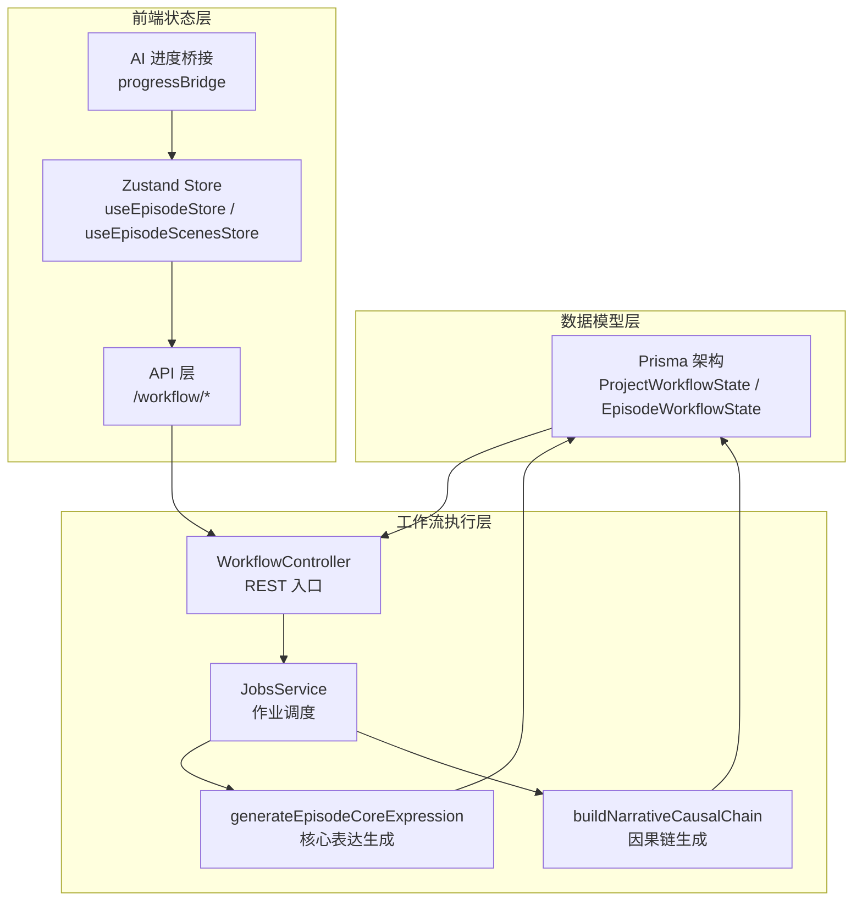
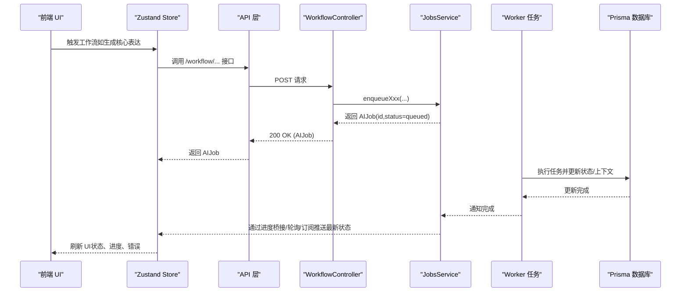
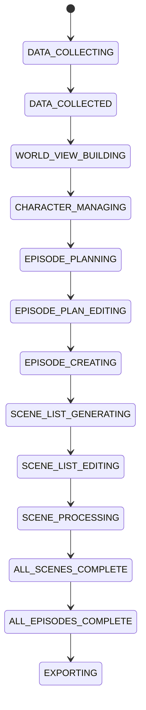
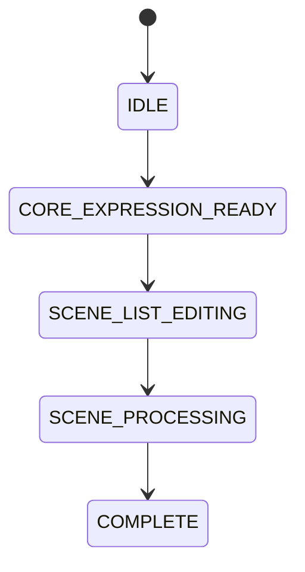
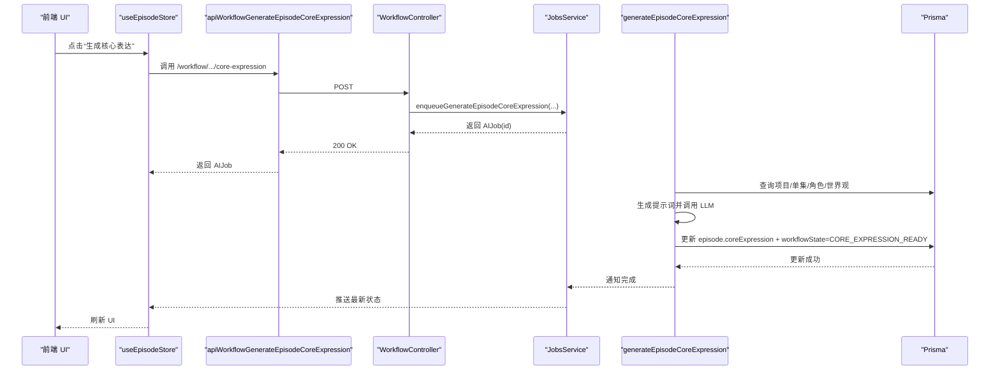
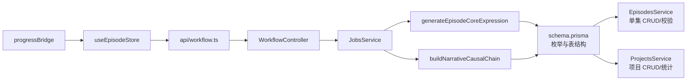

# 状态管理

<cite>
**本文引用的文件**
- [apps/api/prisma/schema.prisma](file://apps/api/prisma/schema.prisma)
- [apps/api/prisma/migrations/20251215203000_add_episode_planning/migration.sql](file://apps/api/prisma/migrations/20251215203000_add_episode_planning/migration.sql)
- [apps/api/src/episodes/episodes.service.ts](file://apps/api/src/episodes/episodes.service.ts)
- [apps/api/src/jobs/workflow.controller.ts](file://apps/api/src/jobs/workflow.controller.ts)
- [apps/api/src/projects/projects.service.ts](file://apps/api/src/projects/projects.service.ts)
- [apps/api/src/projects/narrative-causal-chain-versions.service.ts](file://apps/api/src/projects/narrative-causal-chain-versions.service.ts)
- [apps/web/src/lib/workflowV2/state.ts](file://apps/web/src/lib/workflowV2/state.ts)
- [apps/web/src/lib/workflowLabels.ts](file://apps/web/src/lib/workflowLabels.ts)
- [apps/web/src/lib/api/workflow.ts](file://apps/web/src/lib/api/workflow.ts)
- [apps/web/src/stores/episodeStore.ts](file://apps/web/src/stores/episodeStore.ts)
- [apps/web/src/stores/episodeScenesStore.ts](file://apps/web/src/stores/episodeScenesStore.ts)
- [apps/web/src/stores/aiProgressStore.ts](file://apps/web/src/stores/aiProgressStore.ts)
- [apps/web/src/lib/ai/progressBridge.ts](file://apps/web/src/lib/ai/progressBridge.ts)
- [apps/web/src/components/editor/EpisodeWorkflow.tsx](file://apps/web/src/components/editor/EpisodeWorkflow.tsx)
- [apps/web/src/components/canvas/nodes/EpisodeNode.tsx](file://apps/web/src/components/canvas/nodes/EpisodeNode.tsx)
- [apps/web/src/components/canvas/nodes/SceneBeatsNode.tsx](file://apps/web/src/components/canvas/nodes/SceneBeatsNode.tsx)
- [apps/web/src/lib/storage.ts](file://apps/web/src/lib/storage.ts)
- [apps/worker/src/tasks/generateEpisodeCoreExpression.ts](file://apps/worker/src/tasks/generateEpisodeCoreExpression.ts)
- [apps/worker/src/tasks/buildNarrativeCausalChain.ts](file://apps/worker/src/tasks/buildNarrativeCausalChain.ts)
- [docs/prd/episode-planning-workflow.md](file://docs/prd/episode-planning-workflow.md)
</cite>

## 目录

1. [简介](#简介)
2. [项目结构](#项目结构)
3. [核心组件](#核心组件)
4. [架构总览](#架构总览)
5. [详细组件分析](#详细组件分析)
6. [依赖关系分析](#依赖关系分析)
7. [性能考量](#性能考量)
8. [故障排查指南](#故障排查指南)
9. [结论](#结论)
10. [附录](#附录)

## 简介

本文件围绕 AIXSSS 创作流程的状态管理系统，系统性梳理项目级与单集级状态机的设计与实现，覆盖状态定义、转换规则、触发条件、前置检查、后置处理、前后端同步机制、通知与回滚、幂等性保障以及与工作流编排的集成与实时更新。文档同时提供状态流转图与序列图，帮助读者快速理解端到端生命周期。

## 项目结构

状态管理涉及三层协同：

- 数据模型层（Prisma 架构与枚举）：定义项目级与单集级状态枚举及持久化结构。
- 工作流执行层（Worker 任务）：根据状态推进实际业务步骤，并在完成后更新状态或上下文缓存。
- 前端状态层（Zustand Store + API）：负责 UI 层状态同步、进度通知、错误回退与本地持久化。

图表来源

- [apps/api/prisma/schema.prisma](file://apps/api/prisma/schema.prisma#L16-L40)
- [apps/api/src/jobs/workflow.controller.ts](file://apps/api/src/jobs/workflow.controller.ts#L44-L266)
- [apps/worker/src/tasks/generateEpisodeCoreExpression.ts](file://apps/worker/src/tasks/generateEpisodeCoreExpression.ts#L254-L426)
- [apps/worker/src/tasks/buildNarrativeCausalChain.ts](file://apps/worker/src/tasks/buildNarrativeCausalChain.ts#L782-L800)
- [apps/web/src/stores/episodeStore.ts](file://apps/web/src/stores/episodeStore.ts#L124-L504)
- [apps/web/src/lib/api/workflow.ts](file://apps/web/src/lib/api/workflow.ts#L1-L302)
- [apps/web/src/lib/ai/progressBridge.ts](file://apps/web/src/lib/ai/progressBridge.ts#L196-L281)

章节来源

- [apps/api/prisma/schema.prisma](file://apps/api/prisma/schema.prisma#L16-L40)
- [apps/api/src/jobs/workflow.controller.ts](file://apps/api/src/jobs/workflow.controller.ts#L44-L266)
- [apps/web/src/stores/episodeStore.ts](file://apps/web/src/stores/episodeStore.ts#L124-L504)

## 核心组件

- 项目级状态（ProjectWorkflowState）：覆盖从基础设定到导出的全流程，包含 EPISODE_PLANNING、EPISODE_PLAN_EDITING、EPISODE_CREATING、SCENE_LIST_GENERATING、SCENE_LIST_EDITING、SCENE_PROCESSING、ALL_SCENES_COMPLETE、ALL_EPISODES_COMPLETE 等。
- 单集级状态（EpisodeWorkflowState）：覆盖从核心表达就绪到完成的单集生命周期，包含 CORE_EXPRESSION_READY、SCENE_LIST_EDITING、SCENE_PROCESSING、COMPLETE。
- 前端状态存储：Zustand Store 统一管理项目与单集状态、加载/运行/错误状态、最后作业进度与错误信息。
- 工作流控制器：暴露 /workflow/\* REST 接口，入队 AI 生成任务，由 Worker 执行并更新状态或上下文缓存。
- Worker 任务：执行具体生成步骤（如核心表达、因果链），在成功后更新数据库状态或合并上下文缓存。
- 通知与回滚：通过 AI 进度桥接与 Store 事件，提供失败重试、降级通知与本地持久化备份。

章节来源

- [apps/api/prisma/schema.prisma](file://apps/api/prisma/schema.prisma#L16-L40)
- [apps/api/src/jobs/workflow.controller.ts](file://apps/api/src/jobs/workflow.controller.ts#L44-L266)
- [apps/web/src/stores/episodeStore.ts](file://apps/web/src/stores/episodeStore.ts#L69-L122)
- [apps/web/src/lib/workflowV2/state.ts](file://apps/web/src/lib/workflowV2/state.ts#L1-L139)

## 架构总览

项目级与单集级状态机通过 REST + 队列的方式解耦：前端通过 /workflow/\* 触发作业，后端将作业入队，Worker 在后台执行并更新状态或上下文缓存，前端通过 Store 与进度桥接感知变化并刷新 UI。

图表来源

- [apps/web/src/lib/api/workflow.ts](file://apps/web/src/lib/api/workflow.ts#L1-L302)
- [apps/api/src/jobs/workflow.controller.ts](file://apps/api/src/jobs/workflow.controller.ts#L44-L266)
- [apps/worker/src/tasks/generateEpisodeCoreExpression.ts](file://apps/worker/src/tasks/generateEpisodeCoreExpression.ts#L254-L426)
- [apps/web/src/lib/ai/progressBridge.ts](file://apps/web/src/lib/ai/progressBridge.ts#L196-L281)

## 详细组件分析

### 项目级状态机（ProjectWorkflowState）

- 状态枚举：IDLE、DATA_COLLECTING、DATA_COLLECTED、WORLD_VIEW_BUILDING、CHARACTER_MANAGING、EPISODE_PLANNING、EPISODE_PLAN_EDITING、EPISODE_CREATING、SCENE_LIST_GENERATING、SCENE_LIST_EDITING、SCENE_LIST_CONFIRMED、SCENE_PROCESSING、ALL_SCENES_COMPLETE、ALL_EPISODES_COMPLETE、EXPORTING。
- 新增单集相关状态：EPISODE_PLANNING、EPISODE_PLAN_EDITING、EPISODE_CREATING、ALL_EPISODES_COMPLETE。
- 状态变更触发点：
  - EPISODE_PLANNING：提交剧集规划作业后进入排队/运行。
  - EPISODE_CREATING：至少一个 Episode 进入创作（核心表达/分镜生成/细化进行中）。
  - ALL_EPISODES_COMPLETE：所有 Episode 完成。
- 前置检查：
  - 项目存在性与团队权限校验。
  - 作业入队前的参数校验（如目标剧集数量、场景数量提示等）。
- 后置处理：
  - 作业完成后刷新项目上下文（如因果链版本）或拉取最新项目数据。
- 与前端集成：
  - Store 中维护 lastJobId、lastJobProgress、isRunningWorkflow、error 等，用于 UI 展示与交互。

章节来源

- [apps/api/prisma/schema.prisma](file://apps/api/prisma/schema.prisma#L16-L32)
- [apps/api/src/jobs/workflow.controller.ts](file://apps/api/src/jobs/workflow.controller.ts#L49-L115)
- [apps/web/src/stores/episodeStore.ts](file://apps/web/src/stores/episodeStore.ts#L210-L267)

### 单集级状态机（EpisodeWorkflowState）

- 状态枚举：IDLE、CORE_EXPRESSION_READY、SCENE_LIST_EDITING、SCENE_PROCESSING、COMPLETE。
- 关键状态转换：
  - 核心表达生成成功后，将 workflowState 更新为 CORE_EXPRESSION_READY。
  - 分镜列表编辑完成后，进入 SCENE_PROCESSING。
  - 全部分镜完成，进入 COMPLETE。
- 前置检查：
  - 项目归属校验（同一 teamId + projectId）。
  - 订单唯一性约束（避免重复 order）。
- 后置处理：
  - 成功更新后，刷新单集列表或局部状态。
  - 删除单集前检查是否存在进行中的场景作业，避免并发冲突。

章节来源

- [apps/api/prisma/schema.prisma](file://apps/api/prisma/schema.prisma#L34-L40)
- [apps/api/src/episodes/episodes.service.ts](file://apps/api/src/episodes/episodes.service.ts#L57-L108)
- [apps/worker/src/tasks/generateEpisodeCoreExpression.ts](file://apps/worker/src/tasks/generateEpisodeCoreExpression.ts#L407-L413)

### 状态流转图（项目级）

图表来源

- [apps/api/prisma/schema.prisma](file://apps/api/prisma/schema.prisma#L16-L32)
- [docs/prd/episode-planning-workflow.md](file://docs/prd/episode-planning-workflow.md#L332-L354)

### 状态流转图（单集级）

图表来源

- [apps/api/prisma/schema.prisma](file://apps/api/prisma/schema.prisma#L34-L40)
- [apps/worker/src/tasks/generateEpisodeCoreExpression.ts](file://apps/worker/src/tasks/generateEpisodeCoreExpression.ts#L407-L413)

### 状态转换触发与校验（序列图：核心表达生成）

图表来源

- [apps/web/src/stores/episodeStore.ts](file://apps/web/src/stores/episodeStore.ts#L269-L323)
- [apps/web/src/lib/api/workflow.ts](file://apps/web/src/lib/api/workflow.ts#L46-L57)
- [apps/api/src/jobs/workflow.controller.ts](file://apps/api/src/jobs/workflow.controller.ts#L70-L79)
- [apps/worker/src/tasks/generateEpisodeCoreExpression.ts](file://apps/worker/src/tasks/generateEpisodeCoreExpression.ts#L254-L426)

### 前后端状态同步与持久化

- 前端（Zustand）：
  - 维护 episodes、loading、running、lastJobId、lastJobProgress、error 等状态。
  - 通过 apiWaitForAIJob 轮询进度，结合 progressBridge 与 AI 进度 Store 提供统一通知。
  - 支持本地持久化与备份（storage.ts），在离线或异常时保障数据安全。
- 后端（Prisma）：
  - 项目级状态作为枚举字段持久化，单集级状态同样持久化。
  - 上下文缓存（contextCache）用于存放工作流产物（如因果链、核心表达等），避免重复计算。
- 实时更新：
  - 前端通过 Store 事件与进度桥接接收状态变更。
  - 项目级因果链版本通过服务层写回 contextCache 并触发 UI 刷新。

章节来源

- [apps/web/src/stores/episodeStore.ts](file://apps/web/src/stores/episodeStore.ts#L69-L122)
- [apps/web/src/lib/ai/progressBridge.ts](file://apps/web/src/lib/ai/progressBridge.ts#L196-L281)
- [apps/web/src/lib/storage.ts](file://apps/web/src/lib/storage.ts#L252-L294)
- [apps/api/src/projects/narrative-causal-chain-versions.service.ts](file://apps/api/src/projects/narrative-causal-chain-versions.service.ts#L207-L238)

### 通知机制、错误回滚与幂等性

- 通知机制：
  - AI 进度桥接统一上报任务状态、进度与错误，Store 暴露事件（task:started/completed/failed/retry/cancel）。
  - 失败时携带 rawOutput 便于调试，支持最大重试次数。
- 错误回滚：
  - 删除单集前检查是否存在进行中的场景作业，避免并发冲突。
  - 因果链版本支持恢复到指定版本，写回 Project.contextCache 并更新 narrativeCausalChainUpdatedAt。
- 幂等性：
  - 作业入队时基于请求参数与上下文缓存进行幂等判断（如 force 参数控制强制重跑）。
  - 场景补丁队列采用合并策略，避免重复写入。

章节来源

- [apps/web/src/stores/aiProgressStore.ts](file://apps/web/src/stores/aiProgressStore.ts#L344-L450)
- [apps/api/src/episodes/episodes.service.ts](file://apps/api/src/episodes/episodes.service.ts#L110-L143)
- [apps/api/src/projects/narrative-causal-chain-versions.service.ts](file://apps/api/src/projects/narrative-causal-chain-versions.service.ts#L207-L238)
- [apps/web/src/lib/api/scenePatchQueue.ts](file://apps/web/src/lib/api/scenePatchQueue.ts#L32-L57)

### 工作流编排与集成

- REST 接口：/workflow/projects/:projectId/episode-plan、/workflow/projects/:projectId/episodes/:episodeId/core-expression、/workflow/projects/:projectId/narrative-causal-chain 等。
- 作业入队：WorkflowController 将请求参数解析后交由 JobsService 入队。
- Worker 执行：generateEpisodeCoreExpression、buildNarrativeCausalChain 等任务按阶段执行，更新状态或合并上下文缓存。
- 前端集成：useEpisodeStore 统一封装工作流动作，提供进度归一化与日志记录。

章节来源

- [apps/api/src/jobs/workflow.controller.ts](file://apps/api/src/jobs/workflow.controller.ts#L49-L115)
- [apps/web/src/lib/api/workflow.ts](file://apps/web/src/lib/api/workflow.ts#L1-L302)
- [apps/worker/src/tasks/generateEpisodeCoreExpression.ts](file://apps/worker/src/tasks/generateEpisodeCoreExpression.ts#L254-L426)
- [apps/worker/src/tasks/buildNarrativeCausalChain.ts](file://apps/worker/src/tasks/buildNarrativeCausalChain.ts#L782-L800)

## 依赖关系分析

- 项目级状态依赖 Prisma 架构中的 ProjectWorkflowState 枚举，新增状态通过迁移脚本安全升级。
- 单集级状态依赖 Prisma 架构中的 EpisodeWorkflowState 枚举，服务层提供创建/更新/删除与前置校验。
- 前端 Store 依赖 API 层与进度桥接，形成闭环的 UI 状态同步。
- Worker 任务依赖系统提示词与上下文缓存，成功后更新数据库状态或合并缓存。

图表来源

- [apps/api/prisma/schema.prisma](file://apps/api/prisma/schema.prisma#L16-L40)
- [apps/api/src/episodes/episodes.service.ts](file://apps/api/src/episodes/episodes.service.ts#L27-L146)
- [apps/api/src/jobs/workflow.controller.ts](file://apps/api/src/jobs/workflow.controller.ts#L44-L266)
- [apps/worker/src/tasks/generateEpisodeCoreExpression.ts](file://apps/worker/src/tasks/generateEpisodeCoreExpression.ts#L254-L426)
- [apps/worker/src/tasks/buildNarrativeCausalChain.ts](file://apps/worker/src/tasks/buildNarrativeCausalChain.ts#L782-L800)
- [apps/web/src/stores/episodeStore.ts](file://apps/web/src/stores/episodeStore.ts#L124-L504)
- [apps/web/src/lib/api/workflow.ts](file://apps/web/src/lib/api/workflow.ts#L1-L302)
- [apps/web/src/lib/ai/progressBridge.ts](file://apps/web/src/lib/ai/progressBridge.ts#L196-L281)

章节来源

- [apps/api/prisma/schema.prisma](file://apps/api/prisma/schema.prisma#L16-L40)
- [apps/api/src/episodes/episodes.service.ts](file://apps/api/src/episodes/episodes.service.ts#L27-L146)
- [apps/api/src/jobs/workflow.controller.ts](file://apps/api/src/jobs/workflow.controller.ts#L44-L266)

## 性能考量

- 前端 Store 使用轻量状态与事件驱动，避免不必要的重渲染。
- 场景补丁队列采用合并与定时批量刷新，降低网络请求频率。
- Worker 任务在 JSON 修复阶段采用稳定参数与最小推理努力，提升稳定性与可重复性。
- 项目级因果链版本写入采用 best-effort，避免阻断主流程。

## 故障排查指南

- 无法删除单集：检查是否存在进行中的场景作业，按提示取消后再试。
- 核心表达生成失败：查看 AI 进度桥接中的错误信息与 rawOutput，确认是否触发了 JSON 修复流程。
- 状态不同步：确认 Store 是否正确轮询 AIJob 并刷新 episodes 列表。
- 因果链版本恢复无效：确认恢复操作是否写回 Project.contextCache 并触发 UI 刷新。

章节来源

- [apps/api/src/episodes/episodes.service.ts](file://apps/api/src/episodes/episodes.service.ts#L110-L143)
- [apps/web/src/lib/ai/progressBridge.ts](file://apps/web/src/lib/ai/progressBridge.ts#L266-L281)
- [apps/api/src/projects/narrative-causal-chain-versions.service.ts](file://apps/api/src/projects/narrative-causal-chain-versions.service.ts#L207-L238)

## 结论

AIXSSS 的状态管理系统通过清晰的项目级与单集级状态机、严格的前后端同步与持久化策略、完善的作业编排与通知回滚机制，实现了创作流程的可控、可观测与可恢复。前端 Store 与 Worker 任务的解耦设计，既保证了用户体验的实时性，也为复杂工作流提供了稳健的执行保障。

## 附录

- 状态标签映射：用于 UI 展示与国际化。
- 单集节点与场景节点：在画布中直观呈现当前状态与进度。
- 本地持久化与备份：在异常情况下保障数据安全与可恢复性。

章节来源

- [apps/web/src/lib/workflowLabels.ts](file://apps/web/src/lib/workflowLabels.ts#L1-L21)
- [apps/web/src/components/canvas/nodes/EpisodeNode.tsx](file://apps/web/src/components/canvas/nodes/EpisodeNode.tsx#L41-L68)
- [apps/web/src/components/canvas/nodes/SceneBeatsNode.tsx](file://apps/web/src/components/canvas/nodes/SceneBeatsNode.tsx#L65-L100)
- [apps/web/src/lib/storage.ts](file://apps/web/src/lib/storage.ts#L287-L294)
