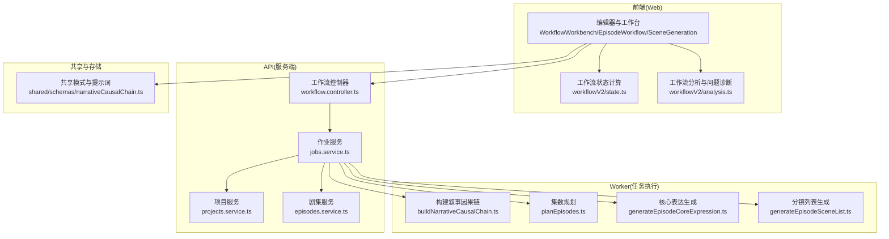
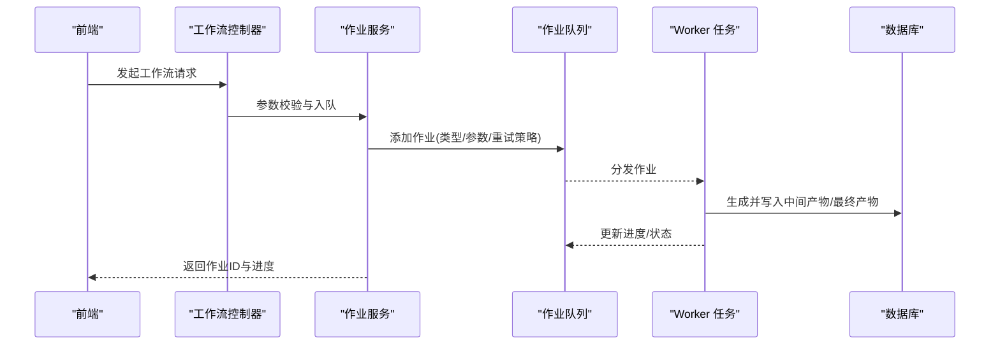
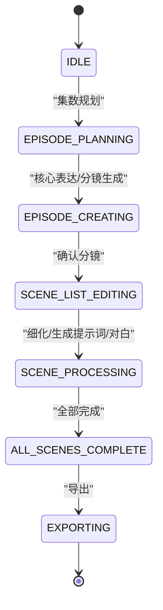
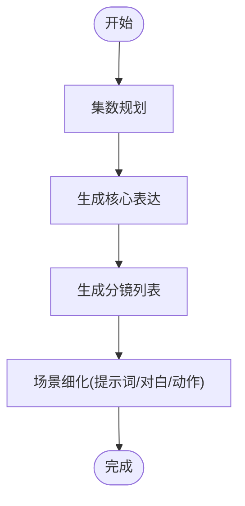
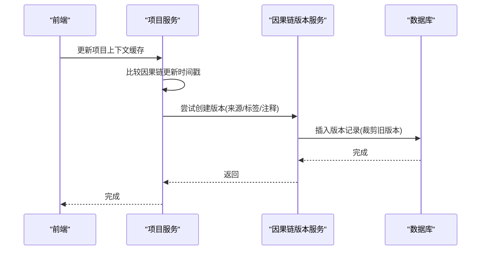
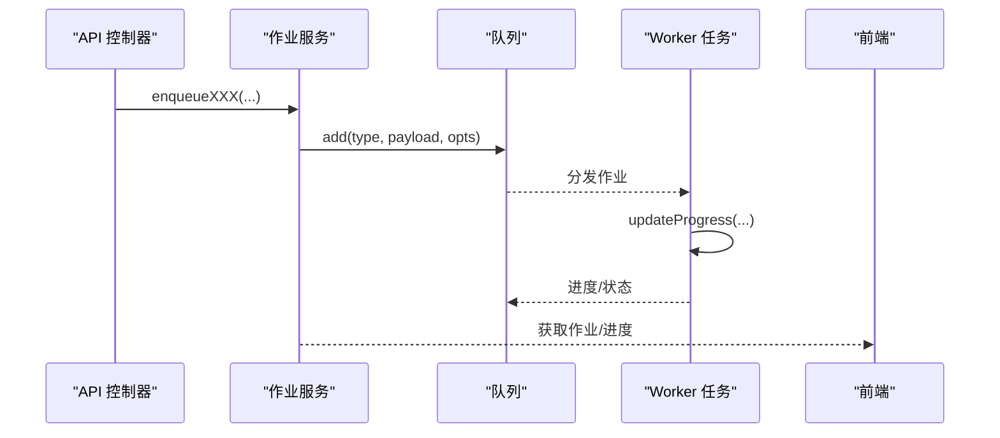
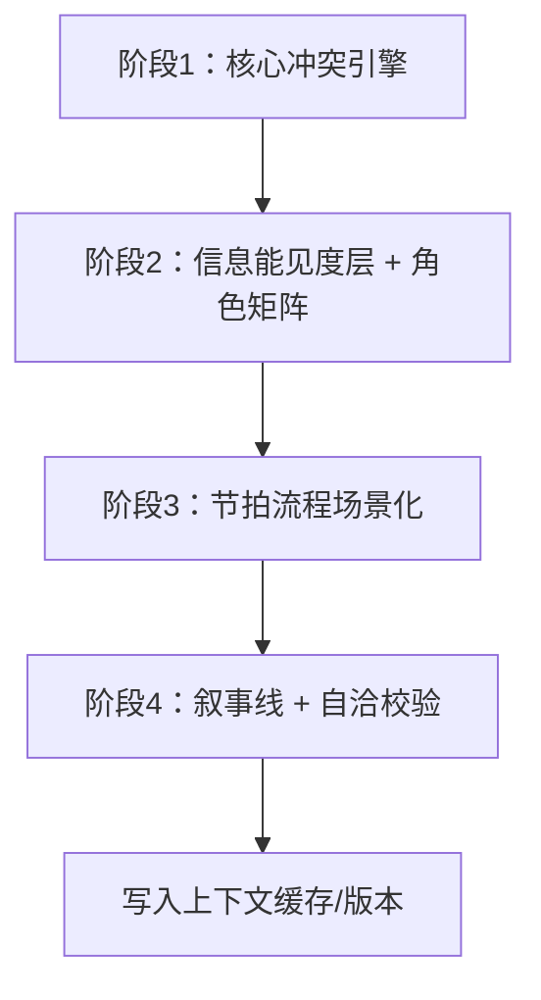
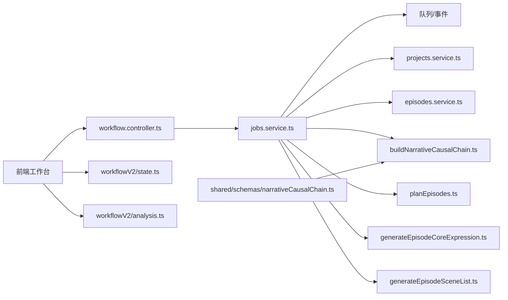

# 工作流设计

<cite>
**本文引用的文件**
- [apps/api/src/jobs/workflow.controller.ts](file://apps/api/src/jobs/workflow.controller.ts)
- [apps/api/src/jobs/jobs.service.ts](file://apps/api/src/jobs/jobs.service.ts)
- [apps/api/src/jobs/jobs.constants.ts](file://apps/api/src/jobs/jobs.constants.ts)
- [apps/api/src/projects/projects.service.ts](file://apps/api/src/projects/projects.service.ts)
- [apps/api/src/episodes/episodes.service.ts](file://apps/api/src/episodes/episodes.service.ts)
- [apps/worker/src/tasks/buildNarrativeCausalChain.ts](file://apps/worker/src/tasks/buildNarrativeCausalChain.ts)
- [apps/worker/src/tasks/planEpisodes.ts](file://apps/worker/src/tasks/planEpisodes.ts)
- [apps/worker/src/tasks/generateEpisodeCoreExpression.ts](file://apps/worker/src/tasks/generateEpisodeCoreExpression.ts)
- [apps/worker/src/tasks/generateEpisodeSceneList.ts](file://apps/worker/src/tasks/generateEpisodeSceneList.ts)
- [packages/shared/src/schemas/narrativeCausalChain.ts](file://packages/shared/src/schemas/narrativeCausalChain.ts)
- [apps/web/src/lib/workflowV2/state.ts](file://apps/web/src/lib/workflowV2/state.ts)
- [apps/web/src/lib/workflowV2/analysis.ts](file://apps/web/src/lib/workflowV2/analysis.ts)
- [apps/web/src/lib/workflowV2/index.ts](file://apps/web/src/lib/workflowV2/index.ts)
- [apps/web/src/components/editor/WorkflowWorkbench.tsx](file://apps/web/src/components/editor/WorkflowWorkbench.tsx)
- [apps/web/src/components/editor/EpisodeWorkflow.tsx](file://apps/web/src/components/editor/EpisodeWorkflow.tsx)
- [apps/web/src/components/editor/SceneGeneration.tsx](file://apps/web/src/components/editor/SceneGeneration.tsx)
- [apps/web/src/components/ProjectCard.tsx](file://apps/web/src/components/ProjectCard.tsx)
- [apps/web/src/stores/projectStore.test.ts](file://apps/web/src/stores/projectStore.test.ts)
- [apps/web/src/lib/storage.test.ts](file://apps/web/src/lib/storage.test.ts)
- [prd_backup.md](file://prd_backup.md)
</cite>

## 目录

1. [简介](#简介)
2. [项目结构](#项目结构)
3. [核心组件](#核心组件)
4. [架构总览](#架构总览)
5. [详细组件分析](#详细组件分析)
6. [依赖关系分析](#依赖关系分析)
7. [性能考量](#性能考量)
8. [故障排查指南](#故障排查指南)
9. [结论](#结论)
10. [附录](#附录)

## 简介

本技术文档围绕 AIXSSS 的工作流设计展开，系统性阐述基于状态机的创作流程、项目生命周期管理、状态转换逻辑、场景生成流程、版本控制机制与工作流编排策略。文档重点解释 AI 任务的编排逻辑、依赖关系与执行顺序，剖析文档状态机的实现细节、事件处理与状态持久化方案，并深入讲解“叙事因果链（Narrative Causal Chain）”的设计理念与实现路径。同时提供工作流的可视化表示、调试工具与监控指标说明，并给出实际工作流配置示例与自定义扩展指导。

## 项目结构

AIXSSS 采用前后端分离与 Worker 并行处理的架构：

- API 层负责请求接入、参数校验、作业入队与状态查询
- Worker 层负责具体 AI 任务的执行与数据库落库
- Web 前端负责工作台可视化、任务编排与状态展示
- 共享包提供数据模式与系统提示词

图表来源

- [apps/api/src/jobs/workflow.controller.ts](file://apps/api/src/jobs/workflow.controller.ts#L44-L266)
- [apps/api/src/jobs/jobs.service.ts](file://apps/api/src/jobs/jobs.service.ts#L37-L149)
- [apps/worker/src/tasks/buildNarrativeCausalChain.ts](file://apps/worker/src/tasks/buildNarrativeCausalChain.ts#L782-L800)
- [apps/worker/src/tasks/planEpisodes.ts](file://apps/worker/src/tasks/planEpisodes.ts#L387-L420)
- [apps/worker/src/tasks/generateEpisodeCoreExpression.ts](file://apps/worker/src/tasks/generateEpisodeCoreExpression.ts#L254-L280)
- [apps/worker/src/tasks/generateEpisodeSceneList.ts](file://apps/worker/src/tasks/generateEpisodeSceneList.ts#L184-L210)
- [apps/web/src/lib/workflowV2/state.ts](file://apps/web/src/lib/workflowV2/state.ts#L27-L74)
- [apps/web/src/lib/workflowV2/analysis.ts](file://apps/web/src/lib/workflowV2/analysis.ts#L93-L167)
- [packages/shared/src/schemas/narrativeCausalChain.ts](file://packages/shared/src/schemas/narrativeCausalChain.ts#L175-L258)

章节来源

- [apps/api/src/jobs/workflow.controller.ts](file://apps/api/src/jobs/workflow.controller.ts#L44-L266)
- [apps/api/src/jobs/jobs.service.ts](file://apps/api/src/jobs/jobs.service.ts#L37-L149)
- [apps/web/src/lib/workflowV2/state.ts](file://apps/web/src/lib/workflowV2/state.ts#L27-L74)
- [apps/web/src/lib/workflowV2/analysis.ts](file://apps/web/src/lib/workflowV2/analysis.ts#L93-L167)
- [packages/shared/src/schemas/narrativeCausalChain.ts](file://packages/shared/src/schemas/narrativeCausalChain.ts#L175-L258)

## 核心组件

- 工作流控制器：暴露 REST 接口，接收前端请求并调用作业服务入队
- 作业服务：校验资源、构造作业记录、入队并维护进度
- Worker 任务：按阶段执行 AI 生成，解析结构化输出，写入数据库
- 项目/剧集服务：提供资源校验、上下文缓存与状态更新
- 前端工作台：状态计算与分析、可视化任务面板、版本与导出
- 共享模式：统一的数据结构与校验，保障前后端一致性

章节来源

- [apps/api/src/jobs/workflow.controller.ts](file://apps/api/src/jobs/workflow.controller.ts#L44-L266)
- [apps/api/src/jobs/jobs.service.ts](file://apps/api/src/jobs/jobs.service.ts#L37-L149)
- [apps/api/src/projects/projects.service.ts](file://apps/api/src/projects/projects.service.ts#L34-L102)
- [apps/api/src/episodes/episodes.service.ts](file://apps/api/src/episodes/episodes.service.ts#L27-L80)
- [apps/web/src/lib/workflowV2/state.ts](file://apps/web/src/lib/workflowV2/state.ts#L27-L74)
- [apps/web/src/lib/workflowV2/analysis.ts](file://apps/web/src/lib/workflowV2/analysis.ts#L93-L167)

## 架构总览

整体采用“API 控制器 → 作业服务 → Worker 任务 → 数据库”的流水线式架构。API 层负责鉴权、参数校验与作业入队；Worker 层通过结构化提示词与 JSON Schema 约束保证输出稳定性；前端通过工作台与分析模块进行可视化与质量把控。

图表来源

- [apps/api/src/jobs/workflow.controller.ts](file://apps/api/src/jobs/workflow.controller.ts#L49-L115)
- [apps/api/src/jobs/jobs.service.ts](file://apps/api/src/jobs/jobs.service.ts#L101-L149)
- [apps/worker/src/tasks/planEpisodes.ts](file://apps/worker/src/tasks/planEpisodes.ts#L387-L420)
- [apps/worker/src/tasks/generateEpisodeCoreExpression.ts](file://apps/worker/src/tasks/generateEpisodeCoreExpression.ts#L254-L280)
- [apps/worker/src/tasks/generateEpisodeSceneList.ts](file://apps/worker/src/tasks/generateEpisodeSceneList.ts#L184-L210)

## 详细组件分析

### 工作流状态机与生命周期

- 项目状态：前端与服务端共同维护 workflowState，贯穿“数据收集 → 集数规划 → 分镜生成 → 场景细化 → 导出”
- 剧集状态：每集独立的 workflowState，从 IDLE 到 CORE_EXPRESSION_READY，再到 SCENE_LIST_EDITING、SCENE_PROCESSING、ALL_SCENES_COMPLETE
- 状态转换：由 API 服务在入队时写入 hint 状态，Worker 任务完成后更新最终状态

图表来源

- [apps/api/src/jobs/jobs.service.ts](file://apps/api/src/jobs/jobs.service.ts#L126-L134)
- [apps/api/src/jobs/jobs.service.ts](file://apps/api/src/jobs/jobs.service.ts#L209-L216)
- [apps/api/src/jobs/jobs.service.ts](file://apps/api/src/jobs/jobs.service.ts#L394-L403)
- [apps/web/src/components/ProjectCard.tsx](file://apps/web/src/components/ProjectCard.tsx#L133-L136)
- [apps/web/src/stores/projectStore.test.ts](file://apps/web/src/stores/projectStore.test.ts#L550-L573)
- [prd_backup.md](file://prd_backup.md#L1059-L1097)

章节来源

- [apps/api/src/jobs/jobs.service.ts](file://apps/api/src/jobs/jobs.service.ts#L126-L134)
- [apps/api/src/jobs/jobs.service.ts](file://apps/api/src/jobs/jobs.service.ts#L209-L216)
- [apps/api/src/jobs/jobs.service.ts](file://apps/api/src/jobs/jobs.service.ts#L394-L403)
- [apps/web/src/components/ProjectCard.tsx](file://apps/web/src/components/ProjectCard.tsx#L133-L136)
- [apps/web/src/stores/projectStore.test.ts](file://apps/web/src/stores/projectStore.test.ts#L550-L573)
- [prd_backup.md](file://prd_backup.md#L1059-L1097)

### 场景生成流程与编排

- 集数规划：根据项目设定与可选的叙事因果链生成集数计划，支持目标集数限制与去重优化
- 核心表达：以集 Outline 与项目上下文为依据，生成主题、情感弧、核心冲突等结构化表达
- 分镜列表：结合核心表达与因果链节拍，生成可分镜化的分镜清单
- 场景细化：逐格生成关键帧提示词、对白与动作描述，支持批量细化与翻译

图表来源

- [apps/worker/src/tasks/planEpisodes.ts](file://apps/worker/src/tasks/planEpisodes.ts#L387-L420)
- [apps/worker/src/tasks/generateEpisodeCoreExpression.ts](file://apps/worker/src/tasks/generateEpisodeCoreExpression.ts#L254-L280)
- [apps/worker/src/tasks/generateEpisodeSceneList.ts](file://apps/worker/src/tasks/generateEpisodeSceneList.ts#L184-L210)

章节来源

- [apps/worker/src/tasks/planEpisodes.ts](file://apps/worker/src/tasks/planEpisodes.ts#L387-L420)
- [apps/worker/src/tasks/generateEpisodeCoreExpression.ts](file://apps/worker/src/tasks/generateEpisodeCoreExpression.ts#L254-L280)
- [apps/worker/src/tasks/generateEpisodeSceneList.ts](file://apps/worker/src/tasks/generateEpisodeSceneList.ts#L184-L210)

### 版本控制与工作流编排

- 项目上下文缓存：项目/剧集的 contextCache 用于承载工作流产物与版本元信息
- 叙事因果链版本：当项目上下文中的因果链更新时，自动写入版本记录，支持手动/AI/恢复来源
- 工作流 V2 状态：前端通过 getProjectWorkflowV2/getEpisodeWorkflowV2 解析并规范化工作流产物状态

图表来源

- [apps/api/src/projects/projects.service.ts](file://apps/api/src/projects/projects.service.ts#L171-L196)
- [apps/api/src/jobs/jobs.service.ts](file://apps/api/src/jobs/jobs.service.ts#L161-L169)
- [apps/web/src/lib/workflowV2/state.ts](file://apps/web/src/lib/workflowV2/state.ts#L27-L74)

章节来源

- [apps/api/src/projects/projects.service.ts](file://apps/api/src/projects/projects.service.ts#L171-L196)
- [apps/web/src/lib/workflowV2/state.ts](file://apps/web/src/lib/workflowV2/state.ts#L27-L74)

### 文档状态机实现细节

- 作业入队：API 控制器解析请求体，作业服务校验资源并创建作业记录，随后入队
- 进度上报：Worker 任务通过 updateProgress 回传进度，作业服务透传至前端
- 状态持久化：作业服务在入队时写入 hint 状态，任务完成后更新最终状态

图表来源

- [apps/api/src/jobs/workflow.controller.ts](file://apps/api/src/jobs/workflow.controller.ts#L49-L115)
- [apps/api/src/jobs/jobs.service.ts](file://apps/api/src/jobs/jobs.service.ts#L101-L149)
- [apps/api/src/jobs/jobs.constants.ts](file://apps/api/src/jobs/jobs.constants.ts#L1-L5)

章节来源

- [apps/api/src/jobs/workflow.controller.ts](file://apps/api/src/jobs/workflow.controller.ts#L49-L115)
- [apps/api/src/jobs/jobs.service.ts](file://apps/api/src/jobs/jobs.service.ts#L101-L149)
- [apps/api/src/jobs/jobs.constants.ts](file://apps/api/src/jobs/jobs.constants.ts#L1-L5)

### 事件处理与状态持久化

- 事件源：API 请求、作业队列事件、Worker 任务回调
- 事件处理：作业服务监听队列事件，更新作业与项目/剧集状态
- 状态持久化：项目/剧集服务在事务中更新 workflowState 与上下文缓存

章节来源

- [apps/api/src/jobs/jobs.service.ts](file://apps/api/src/jobs/jobs.service.ts#L37-L43)
- [apps/api/src/projects/projects.service.ts](file://apps/api/src/projects/projects.service.ts#L141-L198)
- [apps/api/src/episodes/episodes.service.ts](file://apps/api/src/episodes/episodes.service.ts#L82-L107)

### 叙事因果链（NCC）设计理念与实现

- 设计理念：将复杂叙事拆分为四个阶段，逐步生成与校验，降低一次性生成的复杂度与错误率
- 实现方式：Worker 任务按阶段构建提示词与 JSON Schema，解析结构化输出，合并到项目上下文缓存
- 版本管理：每次上下文变更自动写入版本记录，支持来源追踪与回溯

图表来源

- [apps/worker/src/tasks/buildNarrativeCausalChain.ts](file://apps/worker/src/tasks/buildNarrativeCausalChain.ts#L411-L457)
- [apps/worker/src/tasks/buildNarrativeCausalChain.ts](file://apps/worker/src/tasks/buildNarrativeCausalChain.ts#L459-L521)
- [apps/worker/src/tasks/buildNarrativeCausalChain.ts](file://apps/worker/src/tasks/buildNarrativeCausalChain.ts#L665-L708)
- [packages/shared/src/schemas/narrativeCausalChain.ts](file://packages/shared/src/schemas/narrativeCausalChain.ts#L175-L258)

章节来源

- [apps/worker/src/tasks/buildNarrativeCausalChain.ts](file://apps/worker/src/tasks/buildNarrativeCausalChain.ts#L411-L457)
- [apps/worker/src/tasks/buildNarrativeCausalChain.ts](file://apps/worker/src/tasks/buildNarrativeCausalChain.ts#L459-L521)
- [apps/worker/src/tasks/buildNarrativeCausalChain.ts](file://apps/worker/src/tasks/buildNarrativeCausalChain.ts#L665-L708)
- [packages/shared/src/schemas/narrativeCausalChain.ts](file://packages/shared/src/schemas/narrativeCausalChain.ts#L175-L258)

### 前端可视化与工作台

- 工作台：展示项目/剧集/分镜的产物状态与版本，支持状态切换与导出
- 分析模块：基于项目/剧集/分镜数据生成工作流问题与任务清单，辅助质量把控
- 交互流程：前端通过 API 触发作业，监听进度并更新本地状态

章节来源

- [apps/web/src/components/editor/WorkflowWorkbench.tsx](file://apps/web/src/components/editor/WorkflowWorkbench.tsx#L403-L425)
- [apps/web/src/components/editor/EpisodeWorkflow.tsx](file://apps/web/src/components/editor/EpisodeWorkflow.tsx#L374-L416)
- [apps/web/src/components/editor/SceneGeneration.tsx](file://apps/web/src/components/editor/SceneGeneration.tsx#L151-L173)
- [apps/web/src/lib/workflowV2/analysis.ts](file://apps/web/src/lib/workflowV2/analysis.ts#L93-L167)

## 依赖关系分析

- 控制器依赖作业服务；作业服务依赖队列与 Prisma；Worker 任务依赖 Provider 与共享模式
- 前端依赖 API 提供的作业与分析能力；工作台依赖状态计算与版本管理

图表来源

- [apps/api/src/jobs/workflow.controller.ts](file://apps/api/src/jobs/workflow.controller.ts#L44-L266)
- [apps/api/src/jobs/jobs.service.ts](file://apps/api/src/jobs/jobs.service.ts#L37-L43)
- [apps/api/src/projects/projects.service.ts](file://apps/api/src/projects/projects.service.ts#L34-L40)
- [apps/worker/src/tasks/buildNarrativeCausalChain.ts](file://apps/worker/src/tasks/buildNarrativeCausalChain.ts#L782-L800)
- [apps/web/src/lib/workflowV2/state.ts](file://apps/web/src/lib/workflowV2/state.ts#L27-L74)
- [apps/web/src/lib/workflowV2/analysis.ts](file://apps/web/src/lib/workflowV2/analysis.ts#L93-L167)
- [packages/shared/src/schemas/narrativeCausalChain.ts](file://packages/shared/src/schemas/narrativeCausalChain.ts#L175-L258)

章节来源

- [apps/api/src/jobs/workflow.controller.ts](file://apps/api/src/jobs/workflow.controller.ts#L44-L266)
- [apps/api/src/jobs/jobs.service.ts](file://apps/api/src/jobs/jobs.service.ts#L37-L43)
- [apps/api/src/projects/projects.service.ts](file://apps/api/src/projects/projects.service.ts#L34-L40)
- [apps/worker/src/tasks/buildNarrativeCausalChain.ts](file://apps/worker/src/tasks/buildNarrativeCausalChain.ts#L782-L800)
- [apps/web/src/lib/workflowV2/state.ts](file://apps/web/src/lib/workflowV2/state.ts#L27-L74)
- [apps/web/src/lib/workflowV2/analysis.ts](file://apps/web/src/lib/workflowV2/analysis.ts#L93-L167)
- [packages/shared/src/schemas/narrativeCausalChain.ts](file://packages/shared/src/schemas/narrativeCausalChain.ts#L175-L258)

## 性能考量

- 队列重试与指数退避：减少瞬时峰值与偶发错误的影响
- 输出上限保护：针对长 JSON 输出设置最小最大令牌限制，避免截断导致的解析失败
- 结构化输出：通过 JSON Schema 与修复提示，降低解析成本与失败率
- 去重优化：在集数规划阶段进行相似度检测与改写，避免重复内容带来的无效生成

章节来源

- [apps/api/src/jobs/jobs.service.ts](file://apps/api/src/jobs/jobs.service.ts#L136-L146)
- [apps/worker/src/tasks/planEpisodes.ts](file://apps/worker/src/tasks/planEpisodes.ts#L368-L385)
- [apps/worker/src/tasks/planEpisodes.ts](file://apps/worker/src/tasks/planEpisodes.ts#L527-L562)

## 故障排查指南

- 作业状态异常：检查作业服务是否正确入队与回传进度；确认队列事件监听是否正常
- 资源校验失败：核对项目/剧集/场景是否存在且属于当前团队；确认 AI Profile 是否有效
- 输出解析失败：查看 JSON 修复提示词与系统提示词是否正确加载；确认模型响应格式
- 版本写入失败：检查数据库迁移与版本表插入逻辑；兼容未迁移场景下的降级处理

章节来源

- [apps/api/src/jobs/jobs.service.ts](file://apps/api/src/jobs/jobs.service.ts#L88-L99)
- [apps/api/src/episodes/episodes.service.ts](file://apps/api/src/episodes/episodes.service.ts#L125-L139)
- [apps/worker/src/tasks/buildNarrativeCausalChain.ts](file://apps/worker/src/tasks/buildNarrativeCausalChain.ts#L300-L369)

## 结论

AIXSSS 的工作流设计以“状态机 + 结构化输出 + 版本控制”为核心，通过 API 控制器、作业服务与 Worker 任务形成稳定的流水线，配合前端工作台与分析模块实现可视化与质量保障。叙事因果链的分阶段生成与版本管理进一步提升了多集创作的一致性与可追溯性。整体架构具备良好的扩展性与可观测性，便于后续迭代与定制。

## 附录

### 实际工作流配置示例

- 集数规划：指定目标集数，系统按 JSON Schema 生成集数计划并进行去重优化
- 核心表达：以集 Outline 与项目上下文为依据，生成主题、情感弧、核心冲突等结构化表达
- 分镜列表：结合核心表达与因果链节拍，生成可分镜化的分镜清单
- 场景细化：逐格生成关键帧提示词、对白与动作描述，支持批量细化与翻译

章节来源

- [apps/worker/src/tasks/planEpisodes.ts](file://apps/worker/src/tasks/planEpisodes.ts#L387-L420)
- [apps/worker/src/tasks/generateEpisodeCoreExpression.ts](file://apps/worker/src/tasks/generateEpisodeCoreExpression.ts#L254-L280)
- [apps/worker/src/tasks/generateEpisodeSceneList.ts](file://apps/worker/src/tasks/generateEpisodeSceneList.ts#L184-L210)

### 自定义扩展指导

- 新增作业类型：在控制器新增路由与入参校验，在作业服务中实现入队逻辑与状态 hint
- 自定义提示词：通过系统提示词键值扩展，确保 Worker 任务加载对应提示词
- 自定义状态：在前端状态计算模块增加新产物状态的规范化逻辑，确保 UI 与后端一致

章节来源

- [apps/api/src/jobs/workflow.controller.ts](file://apps/api/src/jobs/workflow.controller.ts#L49-L115)
- [apps/api/src/jobs/jobs.service.ts](file://apps/api/src/jobs/jobs.service.ts#L101-L149)
- [apps/web/src/lib/workflowV2/state.ts](file://apps/web/src/lib/workflowV2/state.ts#L27-L74)
