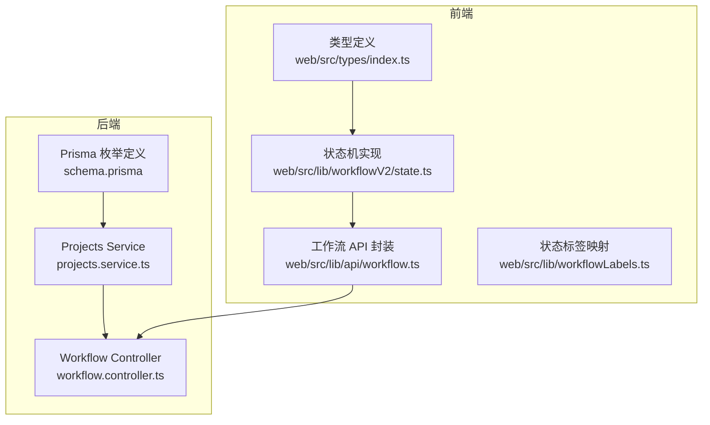
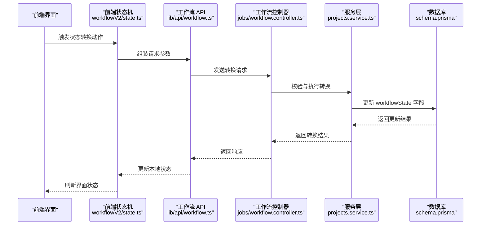
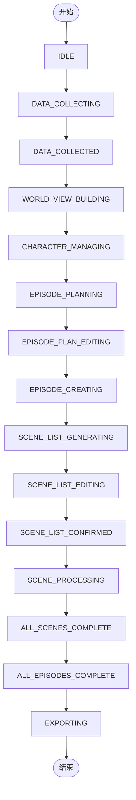
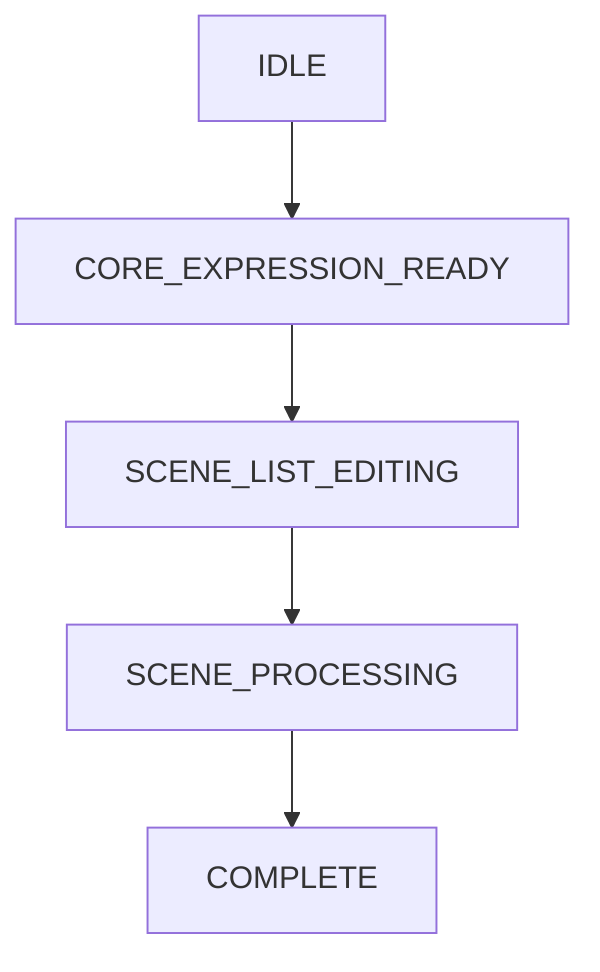
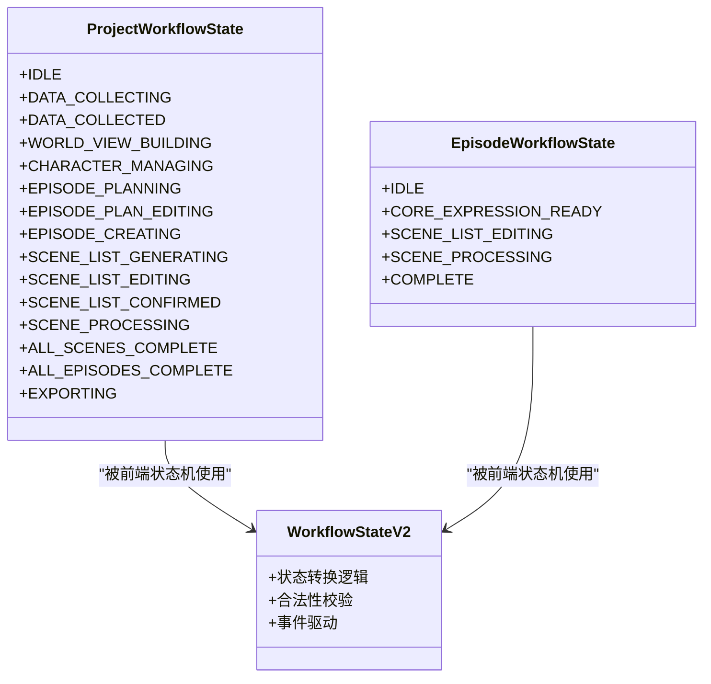
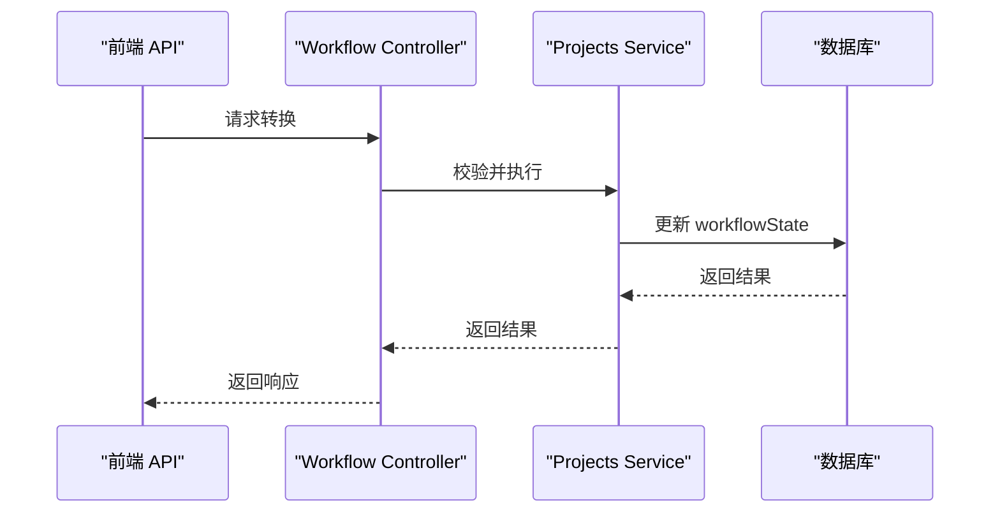
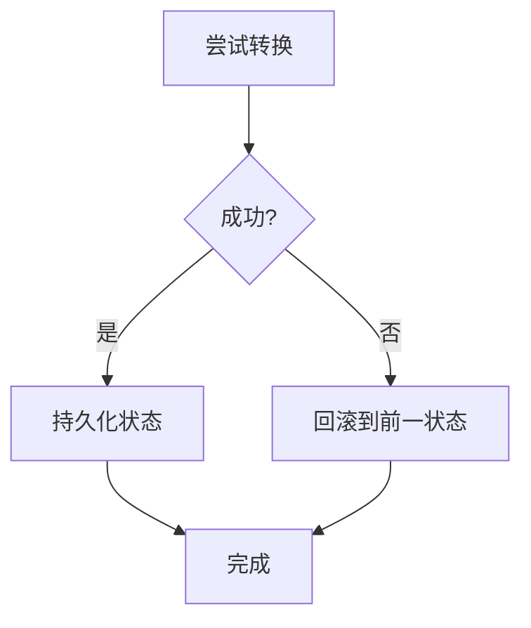
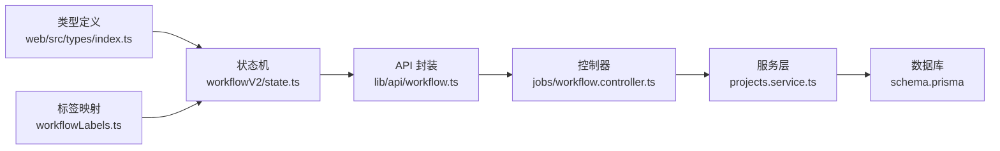

# 状态机设计

<cite>
**本文档引用的文件**
- [apps/api/prisma/migrations/20251215203000_add_episode_planning/migration.sql](file://apps/api/prisma/migrations/20251215203000_add_episode_planning/migration.sql)
- [apps/api/prisma/schema.prisma](file://apps/api/prisma/schema.prisma)
- [apps/api/src/projects/projects.service.ts](file://apps/api/src/projects/projects.service.ts)
- [apps/web/src/types/index.ts](file://apps/web/src/types/index.ts)
- [docs/prd/episode-planning-workflow.md](file://docs/prd/episode-planning-workflow.md)
- [apps/web/src/lib/workflowV2/state.ts](file://apps/web/src/lib/workflowV2/state.ts)
- [apps/web/src/lib/api/workflow.ts](file://apps/web/src/lib/api/workflow.ts)
- [apps/web/src/lib/workflowLabels.ts](file://apps/web/src/lib/workflowLabels.ts)
- [apps/api/src/jobs/workflow.controller.ts](file://apps/api/src/jobs/workflow.controller.ts)
- [apps/api/src/projects/narrative-causal-chain-versions.service.ts](file://apps/api/src/projects/narrative-causal-chain-versions.service.ts)
- [apps/web/src/components/editor/NarrativeCausalChainVersionDialog.tsx](file://apps/web/src/components/editor/NarrativeCausalChainVersionDialog.tsx)
- [apps/web/src/lib/storageManager.ts](file://apps/web/src/lib/storageManager.ts)
</cite>

## 目录

1. [引言](#引言)
2. [项目结构](#项目结构)
3. [核心组件](#核心组件)
4. [架构总览](#架构总览)
5. [详细组件分析](#详细组件分析)
6. [依赖分析](#依赖分析)
7. [性能考虑](#性能考虑)
8. [故障排查指南](#故障排查指南)
9. [结论](#结论)
10. [附录](#附录)

## 引言

本文件系统化梳理 AIXSSS 的状态机设计，重点覆盖两类基于枚举的状态机：

- 项目级状态机：ProjectWorkflowState
- 单集级状态机：EpisodeWorkflowState

内容涵盖状态定义、状态转换规则与触发条件、持久化机制、与业务流程的映射关系、扩展性设计、错误处理与回滚策略、调试与监控方法，并提供状态图、转换表与查询接口说明。

## 项目结构

状态机相关代码分布在后端数据库 Schema、服务层、前端类型与状态库、以及工作流控制器中，形成“数据库枚举 + 服务层校验 + 前端状态机 + 控制器编排”的完整闭环。

**图表来源**

- [apps/api/prisma/schema.prisma](file://apps/api/prisma/schema.prisma#L15-L39)
- [apps/api/src/projects/projects.service.ts](file://apps/api/src/projects/projects.service.ts#L1-L200)
- [apps/api/src/jobs/workflow.controller.ts](file://apps/api/src/jobs/workflow.controller.ts#L1-L200)
- [apps/web/src/types/index.ts](file://apps/web/src/types/index.ts#L360-L420)
- [apps/web/src/lib/workflowV2/state.ts](file://apps/web/src/lib/workflowV2/state.ts#L1-L200)
- [apps/web/src/lib/api/workflow.ts](file://apps/web/src/lib/api/workflow.ts#L1-L200)
- [apps/web/src/lib/workflowLabels.ts](file://apps/web/src/lib/workflowLabels.ts#L1-L200)

**章节来源**

- [apps/api/prisma/schema.prisma](file://apps/api/prisma/schema.prisma#L1-L120)
- [apps/web/src/types/index.ts](file://apps/web/src/types/index.ts#L360-L420)

## 核心组件

- 项目级状态机（ProjectWorkflowState）
  - 定义于数据库枚举，覆盖从数据收集、世界观构建、角色管理、分镜规划、场景生成与细化、到导出的全流程。
  - 默认初始状态为 DATA_COLLECTING，确保项目创建后自动进入数据收集阶段。
- 单集级状态机（EpisodeWorkflowState）
  - 定义于数据库枚举，覆盖单集从待处理到完成的子流程，包含核心表达就绪、场景列表编辑、场景处理、最终完成等关键节点。
- 前端状态机与标签
  - 前端通过 workflowV2/state.ts 实现状态机逻辑，结合 workflowLabels.ts 提供状态标签与 UI 显示映射。
- 工作流控制器
  - workflow.controller.ts 负责接收前端请求，调用服务层执行状态转换与业务操作。

**章节来源**

- [apps/api/prisma/migrations/20251215203000_add_episode_planning/migration.sql](file://apps/api/prisma/migrations/20251215203000_add_episode_planning/migration.sql#L1-L40)
- [apps/api/prisma/schema.prisma](file://apps/api/prisma/schema.prisma#L15-L39)
- [apps/web/src/lib/workflowV2/state.ts](file://apps/web/src/lib/workflowV2/state.ts#L1-L200)
- [apps/web/src/lib/workflowLabels.ts](file://apps/web/src/lib/workflowLabels.ts#L1-L200)
- [apps/api/src/jobs/workflow.controller.ts](file://apps/api/src/jobs/workflow.controller.ts#L1-L200)

## 架构总览

状态机的运行时架构由“数据库枚举 + 服务层校验 + 前端状态机 + 控制器编排”构成，前后端通过 API 对接，保证状态转换的原子性与一致性。

**图表来源**

- [apps/web/src/lib/workflowV2/state.ts](file://apps/web/src/lib/workflowV2/state.ts#L1-L200)
- [apps/web/src/lib/api/workflow.ts](file://apps/web/src/lib/api/workflow.ts#L1-L200)
- [apps/api/src/jobs/workflow.controller.ts](file://apps/api/src/jobs/workflow.controller.ts#L1-L200)
- [apps/api/src/projects/projects.service.ts](file://apps/api/src/projects/projects.service.ts#L1-L200)
- [apps/api/prisma/schema.prisma](file://apps/api/prisma/schema.prisma#L120-L190)

## 详细组件分析

### 项目级状态机（ProjectWorkflowState）

- 状态定义与默认值
  - 枚举包含 IDLE、DATA_COLLECTING、DATA_COLLECTED、WORLD_VIEW_BUILDING、CHARACTER_MANAGING、EPISODE_PLANNING、EPISODE_PLAN_EDITING、EPISODE_CREATING、SCENE_LIST_GENERATING、SCENE_LIST_EDITING、SCENE_LIST_CONFIRMED、SCENE_PROCESSING、ALL_SCENES_COMPLETE、ALL_EPISODES_COMPLETE、EXPORTING 等。
  - 默认初始状态为 DATA_COLLECTING，确保项目创建后立即进入数据收集阶段。
- 业务映射
  - 从基础数据收集开始，逐步推进到世界构建、角色管理、分镜规划、场景生成与细化，直至全部完成与导出。
- 状态转换规则
  - 转换通常由用户操作或 AI 任务完成事件触发；转换前需满足前置条件（如基础数据确认、AI 生成完成等）。
  - 转换应保持幂等性与原子性，失败时回滚至前一状态或保持不变。
- 持久化机制
  - 通过 Prisma 的 Project.workflowState 字段持久化，迁移脚本安全地扩展枚举类型，避免破坏现有数据。

**图表来源**

- [apps/api/prisma/migrations/20251215203000_add_episode_planning/migration.sql](file://apps/api/prisma/migrations/20251215203000_add_episode_planning/migration.sql#L1-L40)
- [apps/api/prisma/schema.prisma](file://apps/api/prisma/schema.prisma#L15-L39)

**章节来源**

- [apps/api/prisma/migrations/20251215203000_add_episode_planning/migration.sql](file://apps/api/prisma/migrations/20251215203000_add_episode_planning/migration.sql#L1-L40)
- [apps/api/prisma/schema.prisma](file://apps/api/prisma/schema.prisma#L15-L39)

### 单集级状态机（EpisodeWorkflowState）

- 状态定义
  - 包含 IDLE、CORE_EXPRESSION_READY、SCENE_LIST_EDITING、SCENE_PROCESSING、COMPLETE 等状态，聚焦单集的场景化处理。
- 业务映射
  - 从核心表达就绪开始，进入场景列表编辑与处理，最终完成。
- 状态转换规则
  - 转换由用户编辑确认或 AI 场景处理完成事件触发；需保证场景处理的顺序与一致性。
- 持久化机制
  - 通过 Prisma 的 Episode.workflowState 字段持久化，迁移脚本定义了该枚举类型。

**图表来源**

- [apps/api/prisma/migrations/20251215203000_add_episode_planning/migration.sql](file://apps/api/prisma/migrations/20251215203000_add_episode_planning/migration.sql#L32-L40)
- [apps/api/prisma/schema.prisma](file://apps/api/prisma/schema.prisma#L33-L39)

**章节来源**

- [apps/api/prisma/migrations/20251215203000_add_episode_planning/migration.sql](file://apps/api/prisma/migrations/20251215203000_add_episode_planning/migration.sql#L32-L40)
- [apps/api/prisma/schema.prisma](file://apps/api/prisma/schema.prisma#L33-L39)

### 前端状态机与标签映射

- 前端状态机
  - 在 workflowV2/state.ts 中实现状态机逻辑，负责状态转换的合法性校验、UI 状态更新与事件驱动。
- 标签映射
  - workflowLabels.ts 提供状态到人类可读标签的映射，便于 UI 展示与日志输出。
- 类型定义
  - web/src/types/index.ts 中定义了前端使用的状态类型，确保与后端枚举一致。

**图表来源**

- [apps/api/prisma/schema.prisma](file://apps/api/prisma/schema.prisma#L15-L39)
- [apps/web/src/lib/workflowV2/state.ts](file://apps/web/src/lib/workflowV2/state.ts#L1-L200)
- [apps/web/src/lib/workflowLabels.ts](file://apps/web/src/lib/workflowLabels.ts#L1-L200)
- [apps/web/src/types/index.ts](file://apps/web/src/types/index.ts#L360-L420)

**章节来源**

- [apps/web/src/lib/workflowV2/state.ts](file://apps/web/src/lib/workflowV2/state.ts#L1-L200)
- [apps/web/src/lib/workflowLabels.ts](file://apps/web/src/lib/workflowLabels.ts#L1-L200)
- [apps/web/src/types/index.ts](file://apps/web/src/types/index.ts#L360-L420)

### 工作流控制器与服务层

- 控制器
  - workflow.controller.ts 接收前端请求，封装转换参数并调用服务层。
- 服务层
  - projects.service.ts 对状态转换进行业务校验与执行，确保转换满足前置条件。
- 数据库
  - schema.prisma 定义了 Project 与 Episode 的 workflowState 字段及默认值。

**图表来源**

- [apps/api/src/jobs/workflow.controller.ts](file://apps/api/src/jobs/workflow.controller.ts#L1-L200)
- [apps/api/src/projects/projects.service.ts](file://apps/api/src/projects/projects.service.ts#L1-L200)
- [apps/api/prisma/schema.prisma](file://apps/api/prisma/schema.prisma#L120-L190)

**章节来源**

- [apps/api/src/jobs/workflow.controller.ts](file://apps/api/src/jobs/workflow.controller.ts#L1-L200)
- [apps/api/src/projects/projects.service.ts](file://apps/api/src/projects/projects.service.ts#L1-L200)
- [apps/api/prisma/schema.prisma](file://apps/api/prisma/schema.prisma#L120-L190)

### 业务流程映射与约束

- 项目级流程
  - 从数据收集到导出，每一步都有明确的前置条件与产出物（如 AI 生成的场景列表、确认后的场景列表等）。
- 单集级流程
  - 从核心表达就绪到完成，强调场景化处理的顺序与质量控制。
- 约束条件
  - 转换必须满足前置状态、数据完整性与任务完成度等条件；失败时应回滚或保持原状。

**章节来源**

- [docs/prd/episode-planning-workflow.md](file://docs/prd/episode-planning-workflow.md#L1054-L1137)

### 扩展性设计

- 枚举扩展
  - 迁移脚本通过重建类型的方式安全扩展枚举，避免破坏现有数据与 UI。
- 前端类型对齐
  - 前端类型定义与后端枚举保持一致，确保类型安全与 UI 正确显示。
- 状态机模块化
  - 前端状态机独立于 UI，便于复用与测试；控制器与服务层职责清晰，利于演进。

**章节来源**

- [apps/api/prisma/migrations/20251215203000_add_episode_planning/migration.sql](file://apps/api/prisma/migrations/20251215203000_add_episode_planning/migration.sql#L1-L40)
- [apps/web/src/types/index.ts](file://apps/web/src/types/index.ts#L360-L420)

### 错误处理、回滚与异常恢复

- 回滚策略
  - 当转换失败时，保持原状态不变；必要时将状态回退至上一个有效状态。
- 异常恢复
  - 通过版本化与快照机制（如叙事因果链版本恢复）实现异常后的数据恢复。
- 版本恢复
  - narrative-causal-chain-versions.service.ts 支持从历史版本恢复到当前项目上下文缓存，保障业务连续性。

**图表来源**

- [apps/api/src/projects/narrative-causal-chain-versions.service.ts](file://apps/api/src/projects/narrative-causal-chain-versions.service.ts#L207-L253)

**章节来源**

- [apps/api/src/projects/narrative-causal-chain-versions.service.ts](file://apps/api/src/projects/narrative-causal-chain-versions.service.ts#L207-L253)

### 状态查询接口

- 查询方式
  - 通过 API 获取项目或单集的当前 workflowState，结合前端状态机进行 UI 展示与交互。
- 接口封装
  - lib/api/workflow.ts 封装了工作流相关请求，统一处理参数与响应。

**章节来源**

- [apps/web/src/lib/api/workflow.ts](file://apps/web/src/lib/api/workflow.ts#L1-L200)

## 依赖分析

- 组件耦合
  - 前端状态机依赖类型定义与标签映射；控制器依赖服务层；服务层依赖数据库。
- 外部依赖
  - Prisma 提供类型安全的数据库访问；React 状态管理与 UI 组件负责展示与交互。
- 循环依赖
  - 通过清晰的模块边界避免循环依赖；类型定义集中管理，减少重复与不一致。

**图表来源**

- [apps/web/src/types/index.ts](file://apps/web/src/types/index.ts#L360-L420)
- [apps/web/src/lib/workflowV2/state.ts](file://apps/web/src/lib/workflowV2/state.ts#L1-L200)
- [apps/web/src/lib/workflowLabels.ts](file://apps/web/src/lib/workflowLabels.ts#L1-L200)
- [apps/web/src/lib/api/workflow.ts](file://apps/web/src/lib/api/workflow.ts#L1-L200)
- [apps/api/src/jobs/workflow.controller.ts](file://apps/api/src/jobs/workflow.controller.ts#L1-L200)
- [apps/api/src/projects/projects.service.ts](file://apps/api/src/projects/projects.service.ts#L1-L200)
- [apps/api/prisma/schema.prisma](file://apps/api/prisma/schema.prisma#L120-L190)

**章节来源**

- [apps/web/src/types/index.ts](file://apps/web/src/types/index.ts#L360-L420)
- [apps/web/src/lib/workflowV2/state.ts](file://apps/web/src/lib/workflowV2/state.ts#L1-L200)
- [apps/web/src/lib/workflowLabels.ts](file://apps/web/src/lib/workflowLabels.ts#L1-L200)
- [apps/web/src/lib/api/workflow.ts](file://apps/web/src/lib/api/workflow.ts#L1-L200)
- [apps/api/src/jobs/workflow.controller.ts](file://apps/api/src/jobs/workflow.controller.ts#L1-L200)
- [apps/api/src/projects/projects.service.ts](file://apps/api/src/projects/projects.service.ts#L1-L200)
- [apps/api/prisma/schema.prisma](file://apps/api/prisma/schema.prisma#L120-L190)

## 性能考虑

- 状态转换的原子性
  - 通过数据库事务与服务层校验，确保转换过程的原子性与一致性，避免中间态对外暴露。
- 前端渲染优化
  - 使用标签映射与类型定义减少不必要的重渲染；状态机逻辑模块化，便于按需加载。
- 存储与缓存
  - 通过 storageManager.ts 提供的分片、压缩与配额监控，保障前端本地存储的稳定性与可用性。

**章节来源**

- [apps/web/src/lib/storageManager.ts](file://apps/web/src/lib/storageManager.ts#L1-L54)

## 故障排查指南

- 常见问题
  - 状态无法转换：检查前置条件是否满足、任务是否完成、权限是否正确。
  - 前端状态不同步：检查 API 响应与状态机更新逻辑。
  - 数据库状态异常：检查迁移脚本与枚举扩展是否正确应用。
- 恢复手段
  - 使用版本恢复功能将项目上下文恢复到历史版本，确保业务连续性。
  - 结合存储监控与日志定位问题根因。

**章节来源**

- [apps/api/src/projects/narrative-causal-chain-versions.service.ts](file://apps/api/src/projects/narrative-causal-chain-versions.service.ts#L207-L253)
- [apps/web/src/components/editor/NarrativeCausalChainVersionDialog.tsx](file://apps/web/src/components/editor/NarrativeCausalChainVersionDialog.tsx#L428-L466)

## 结论

本状态机设计通过数据库枚举、服务层校验与前端状态机协同，实现了项目级与单集级工作流的清晰建模与可靠执行。其扩展性设计与完善的错误处理、回滚与恢复机制，为未来业务演进提供了坚实基础。

## 附录

- 状态转换表（示例）
  - 项目级：IDLE → DATA_COLLECTING → DATA_COLLECTED → WORLD_VIEW_BUILDING → CHARACTER_MANAGING → EPISODE_PLANNING → EPISODE_PLAN_EDITING → EPISODE_CREATING → SCENE_LIST_GENERATING → SCENE_LIST_EDITING → SCENE_LIST_CONFIRMED → SCENE_PROCESSING → ALL_SCENES_COMPLETE → ALL_EPISODES_COMPLETE → EXPORTING
  - 单集级：IDLE → CORE_EXPRESSION_READY → SCENE_LIST_EDITING → SCENE_PROCESSING → COMPLETE
- 调试与监控
  - 使用前端状态机日志与标签映射辅助定位问题；结合存储监控与版本恢复能力提升系统韧性。
