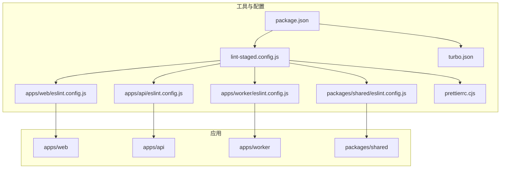
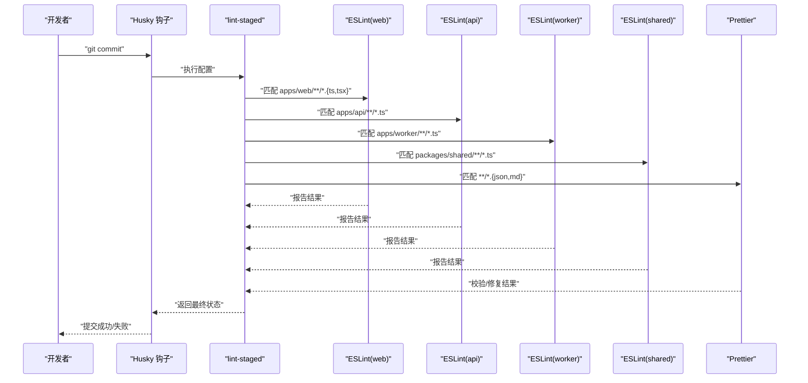
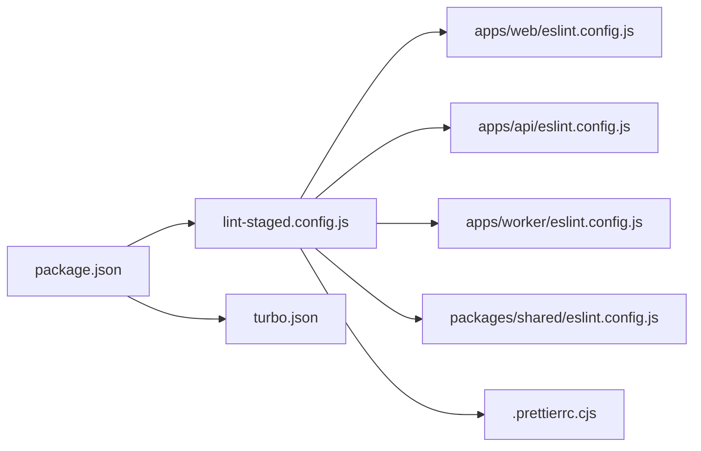

# 代码规范

<cite>
**本文引用的文件**
- [.prettierrc.cjs](file://.prettierrc.cjs)
- [.prettierignore](file://.prettierignore)
- [lint-staged.config.js](file://lint-staged.config.js)
- [package.json](file://package.json)
- [turbo.json](file://turbo.json)
- [apps/web/eslint.config.js](file://apps/web/eslint.config.js)
- [apps/api/eslint.config.js](file://apps/api/eslint.config.js)
- [apps/worker/eslint.config.js](file://apps/worker/eslint.config.js)
- [packages/shared/eslint.config.js](file://packages/shared/eslint.config.js)
- [apps/web/tsconfig.json](file://apps/web/tsconfig.json)
- [apps/api/tsconfig.json](file://apps/api/tsconfig.json)
- [packages/shared/tsconfig.json](file://packages/shared/tsconfig.json)
- [apps/web/src/main.tsx](file://apps/web/src/main.tsx)
- [apps/api/src/main.ts](file://apps/api/src/main.ts)
- [apps/worker/src/worker.ts](file://apps/worker/src/worker.ts)
- [apps/web/src/lib/utils.ts](file://apps/web/src/lib/utils.ts)
- [packages/shared/src/index.ts](file://packages/shared/src/index.ts)
</cite>

## 目录

1. [简介](#简介)
2. [项目结构](#项目结构)
3. [核心组件](#核心组件)
4. [架构总览](#架构总览)
5. [详细组件分析](#详细组件分析)
6. [依赖关系分析](#依赖关系分析)
7. [性能与质量特性](#性能与质量特性)
8. [故障排查指南](#故障排查指南)
9. [结论](#结论)
10. [附录](#附录)

## 简介

本文件为 AIXSSS 项目的代码规范文档，聚焦以下方面：

- ESLint 规则与 TypeScript 编码标准：命名约定、注释规范、代码组织原则
- Prettier 格式化配置：缩进、引号、分号、行宽、尾随逗号等
- Git 钩子与 lint-staged 自动检查流程
- 各模块（web、api、worker、shared）的风格差异与特殊规则
- IDE 配置建议与插件推荐
- 代码审查关注重点与常见违规类型

## 项目结构

本项目采用多包工作区（pnpm workspaces + Turbo）组织，包含四个主要应用与一个共享包：

- apps/web：React/Vite 前端应用
- apps/api：NestJS 后端 API
- apps/worker：BullMQ 任务工作器
- packages/shared：共享类型与模式定义
- 工具与配置：ESLint、Prettier、lint-staged、Turbo

图表来源

- [package.json](file://package.json#L7-L22)
- [turbo.json](file://turbo.json#L4-L27)
- [lint-staged.config.js](file://lint-staged.config.js#L6-L34)
- [apps/web/eslint.config.js](file://apps/web/eslint.config.js#L7-L33)
- [apps/api/eslint.config.js](file://apps/api/eslint.config.js#L5-L18)
- [apps/worker/eslint.config.js](file://apps/worker/eslint.config.js#L5-L18)
- [packages/shared/eslint.config.js](file://packages/shared/eslint.config.js#L5-L19)

章节来源

- [package.json](file://package.json#L7-L22)
- [turbo.json](file://turbo.json#L4-L27)

## 核心组件

- ESLint 配置：统一基于 typescript-eslint，按应用区分语言环境与规则强度
- Prettier 配置：统一格式化策略，配合 lint-staged 在提交前检查
- Git 钩子：husky + lint-staged，按路径匹配执行 ESLint 或 Prettier
- 类型系统：严格模式、装饰器支持、NodeNext 模块解析

章节来源

- [apps/web/eslint.config.js](file://apps/web/eslint.config.js#L7-L33)
- [apps/api/eslint.config.js](file://apps/api/eslint.config.js#L5-L18)
- [apps/worker/eslint.config.js](file://apps/worker/eslint.config.js#L5-L18)
- [packages/shared/eslint.config.js](file://packages/shared/eslint.config.js#L5-L19)
- [.prettierrc.cjs](file://.prettierrc.cjs#L2-L9)
- [lint-staged.config.js](file://lint-staged.config.js#L6-L34)
- [package.json](file://package.json#L16-L16)

## 架构总览

下图展示了从开发者提交到自动检查与格式化的整体流程。

图表来源

- [lint-staged.config.js](file://lint-staged.config.js#L6-L34)
- [package.json](file://package.json#L16-L16)

## 详细组件分析

### ESLint 配置与规则

- 统一扩展：推荐规则集 + typescript-eslint 推荐规则
- 语言环境：
  - web：browser + React Hooks 插件 + react-refresh
  - api/worker/shared：node
- 关键规则策略：
  - 未使用变量：warn，允许以单下划线开头的参数/变量名
  - 显式 any：warn
  - 空 catch 块：允许空 catch（需配合注释说明）
  - React Refresh：仅导出组件警告级别，允许常量导出
- 规则来源与路径
  - web：[apps/web/eslint.config.js](file://apps/web/eslint.config.js#L20-L31)
  - api：[apps/api/eslint.config.js](file://apps/api/eslint.config.js#L14-L16)
  - worker：[apps/worker/eslint.config.js](file://apps/worker/eslint.config.js#L14-L16)
  - shared：[packages/shared/eslint.config.js](file://packages/shared/eslint.config.js#L14-L16)

章节来源

- [apps/web/eslint.config.js](file://apps/web/eslint.config.js#L7-L33)
- [apps/api/eslint.config.js](file://apps/api/eslint.config.js#L5-L18)
- [apps/worker/eslint.config.js](file://apps/worker/eslint.config.js#L5-L18)
- [packages/shared/eslint.config.js](file://packages/shared/eslint.config.js#L5-L19)

### TypeScript 编码标准与组织原则

- 严格模式与装饰器
  - api 与 shared 使用 ES2022 目标、NodeNext 模块解析、启用装饰器元数据
  - web 使用复合 tsconfig 引用 app/node 配置
- 路径别名
  - web 使用 baseUrl + paths，如 @/\*
- 代码组织
  - 按功能域划分目录（如 apps/\*/src/{模块}）
  - 服务层、控制器层、类型与模式分离
  - 共享包导出类型、模式与系统提示

章节来源

- [apps/web/tsconfig.json](file://apps/web/tsconfig.json#L1-L10)
- [apps/api/tsconfig.json](file://apps/api/tsconfig.json#L2-L16)
- [packages/shared/tsconfig.json](file://packages/shared/tsconfig.json#L2-L13)
- [apps/web/src/main.tsx](file://apps/web/src/main.tsx#L1-L37)
- [apps/api/src/main.ts](file://apps/api/src/main.ts#L1-L34)
- [apps/worker/src/worker.ts](file://apps/worker/src/worker.ts#L1-L755)
- [packages/shared/src/index.ts](file://packages/shared/src/index.ts#L1-L6)

### Prettier 格式化配置

- 分号：开启
- 单引号：开启
- 尾随逗号：对所有适用位置
- 行宽：100
- 缩进：2 空格
- 箭头函数括号：始终添加
- 忽略：根目录 .prettierignore

章节来源

- [.prettierrc.cjs](file://.prettierrc.cjs#L2-L9)
- [.prettierignore](file://.prettierignore)

### Git 钩子与 lint-staged 流程

- husky：在 prepare 阶段安装钩子
- lint-staged：按路径匹配执行 ESLint 或 Prettier
  - web：apps/web/\*_/_.{ts,tsx}
  - api：apps/api/\*_/_.ts
  - worker：apps/worker/\*_/_.ts
  - shared：packages/shared/\*_/_.ts
  - 其他：\*_/_.{json,md}（排除 .trae 目录）
- Turbo：统一 lint/typecheck/test/format 任务编排

章节来源

- [package.json](file://package.json#L16-L16)
- [lint-staged.config.js](file://lint-staged.config.js#L6-L34)
- [turbo.json](file://turbo.json#L16-L27)

### 各模块风格差异与特殊规则

- web
  - React Hooks 推荐规则启用
  - react-refresh 仅导出组件警告级别
  - 允许空 catch（需注释说明）
- api/worker/shared
  - 更严格的未使用变量规则（仅允许单下划线前缀）
- shared
  - 作为纯类型/纯函数包，允许部分签名兼容性下的未使用参数

章节来源

- [apps/web/eslint.config.js](file://apps/web/eslint.config.js#L20-L31)
- [apps/api/eslint.config.js](file://apps/api/eslint.config.js#L14-L16)
- [apps/worker/eslint.config.js](file://apps/worker/eslint.config.js#L14-L16)
- [packages/shared/eslint.config.js](file://packages/shared/eslint.config.js#L14-L16)

### 实际代码示例（正确与错误的编码方式）

以下示例以“片段路径”形式给出，便于对照规范定位实现细节。请勿直接复制粘贴具体代码内容。

- 正确：未使用参数以单下划线开头
  - 片段路径：[apps/web/eslint.config.js](file://apps/web/eslint.config.js#L23-L26)
  - 片段路径：[apps/api/eslint.config.js](file://apps/api/eslint.config.js#L15-L15)
  - 片段路径：[apps/worker/eslint.config.js](file://apps/worker/eslint.config.js#L15-L15)
  - 片段路径：[packages/shared/eslint.config.js](file://packages/shared/eslint.config.js#L15-L16)
- 正确：允许空 catch（需注释说明）
  - 片段路径：[apps/web/eslint.config.js](file://apps/web/eslint.config.js#L28-L29)
- 正确：React Refresh 仅导出组件警告级别
  - 片段路径：[apps/web/eslint.config.js](file://apps/web/eslint.config.js#L30-L30)
- 正确：类型严格与装饰器支持
  - 片段路径：[apps/api/tsconfig.json](file://apps/api/tsconfig.json#L10-L15)
  - 片段路径：[packages/shared/tsconfig.json](file://packages/shared/tsconfig.json#L10-L13)
- 正确：路径别名与引用
  - 片段路径：[apps/web/tsconfig.json](file://apps/web/tsconfig.json#L4-L9)
  - 片段路径：[apps/web/src/main.tsx](file://apps/web/src/main.tsx#L1-L37)
- 正确：共享包导出聚合
  - 片段路径：[packages/shared/src/index.ts](file://packages/shared/src/index.ts#L1-L6)

## 依赖关系分析

- ESLint 配置按模块独立管理，确保不同运行时（浏览器/Node）与框架（React/Nest/BullMQ）的规则适配
- lint-staged 通过路径匹配精确调用对应 ESLint 配置，避免跨模块误伤
- Prettier 仅对非 TS 文件进行格式化检查，保证 TS 由 ESLint 处理一致性
- Turbo 统一调度 lint/typecheck/test/format，形成一致的 CI/CD 体验

图表来源

- [lint-staged.config.js](file://lint-staged.config.js#L6-L34)
- [apps/web/eslint.config.js](file://apps/web/eslint.config.js#L7-L33)
- [apps/api/eslint.config.js](file://apps/api/eslint.config.js#L5-L18)
- [apps/worker/eslint.config.js](file://apps/worker/eslint.config.js#L5-L18)
- [packages/shared/eslint.config.js](file://packages/shared/eslint.config.js#L5-L19)
- [.prettierrc.cjs](file://.prettierrc.cjs#L2-L9)
- [package.json](file://package.json#L7-L22)
- [turbo.json](file://turbo.json#L4-L27)

## 性能与质量特性

- ESLint 警告优先策略：未使用变量与 any 使用 warn，降低大规模重构噪音
- Prettier 与 ESLint 并行：TS 由 ESLint 统一处理，JSON/MD 由 Prettier 执行，减少重复检查
- lint-staged 局部检查：仅对暂存文件执行，缩短反馈周期
- Turbo 任务编排：统一 lint/typecheck/test/format，提升可维护性

章节来源

- [apps/web/eslint.config.js](file://apps/web/eslint.config.js#L22-L31)
- [lint-staged.config.js](file://lint-staged.config.js#L6-L34)
- [turbo.json](file://turbo.json#L16-L27)

## 故障排查指南

- 提交被拒绝
  - 检查 lint-staged 是否正确匹配路径与命令
    - 参考：[lint-staged.config.js](file://lint-staged.config.js#L6-L34)
  - 确认 husky 已安装
    - 参考：[package.json](file://package.json#L16-L16)
- ESLint 报错
  - 按模块检查对应 eslint.config.js
    - web：[apps/web/eslint.config.js](file://apps/web/eslint.config.js#L7-L33)
    - api：[apps/api/eslint.config.js](file://apps/api/eslint.config.js#L5-L18)
    - worker：[apps/worker/eslint.config.js](file://apps/worker/eslint.config.js#L5-L18)
    - shared：[packages/shared/eslint.config.js](file://packages/shared/eslint.config.js#L5-L19)
  - 若涉及 React Refresh 或 Hooks，参考相应规则
- Prettier 报错
  - 检查 .prettierrc.cjs 与 .prettierignore
    - 参考：[.prettierrc.cjs](file://.prettierrc.cjs#L2-L9)
    - 参考：[.prettierignore](file://.prettierignore)
- 类型检查失败
  - 检查 tsconfig 的 strict、装饰器与 NodeNext 设置
    - 参考：[apps/api/tsconfig.json](file://apps/api/tsconfig.json#L2-L16)
    - 参考：[packages/shared/tsconfig.json](file://packages/shared/tsconfig.json#L2-L13)
- 常见违规类型
  - 未使用的参数/变量（未以单下划线开头）
  - 显式 any 使用
  - 空 catch 块未注释说明
  - React Refresh 导出不符合规则
  - Prettier 格式不一致（分号、引号、行宽、尾随逗号）

章节来源

- [lint-staged.config.js](file://lint-staged.config.js#L6-L34)
- [package.json](file://package.json#L16-L16)
- [apps/web/eslint.config.js](file://apps/web/eslint.config.js#L20-L31)
- [apps/api/eslint.config.js](file://apps/api/eslint.config.js#L14-L16)
- [apps/worker/eslint.config.js](file://apps/worker/eslint.config.js#L14-L16)
- [packages/shared/eslint.config.js](file://packages/shared/eslint.config.js#L14-L16)
- [.prettierrc.cjs](file://.prettierrc.cjs#L2-L9)

## 结论

本规范通过统一的 ESLint 与 Prettier 配置、精准的 lint-staged 路径匹配以及 Turbo 的任务编排，实现了跨模块的一致性与可维护性。各模块在规则强度与特殊规则上有所差异，以适配不同的运行时与框架特性。建议在日常开发中遵循本文档的命名、注释与组织原则，并在代码审查中重点关注上述常见违规类型。

## 附录

### IDE 配置建议与插件推荐

- VS Code
  - 插件：ESLint、Prettier、Tailwind CSS IntelliSense、TypeScript Importer
  - 设置：保存时自动格式化、ESLint 自动修复
- WebStorm/IntelliJ
  - 插件：ESLint、Prettier、TypeScript
  - 设置：保存时格式化、启用 ESLint 自动修复

### 代码审查关注点清单

- 命名与注释
  - 变量/函数命名清晰且具描述性
  - 复杂逻辑添加必要注释
- 规则合规
  - 未使用变量是否以单下划线开头
  - any 使用是否合理
  - 空 catch 是否有注释说明
  - React Refresh 导出是否符合规则
- 格式一致性
  - 分号、引号、行宽、尾随逗号是否符合 Prettier 配置
- 类型安全
  - tsconfig 严格模式是否生效
  - 装饰器与元数据设置是否正确
