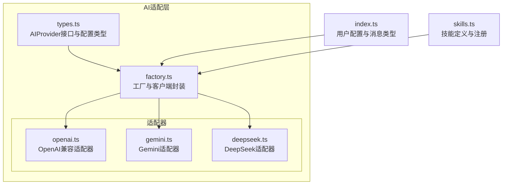
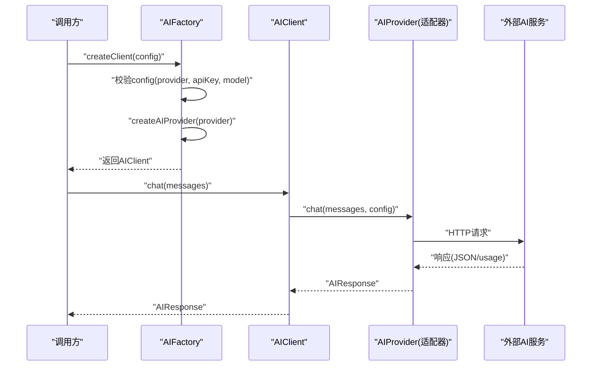
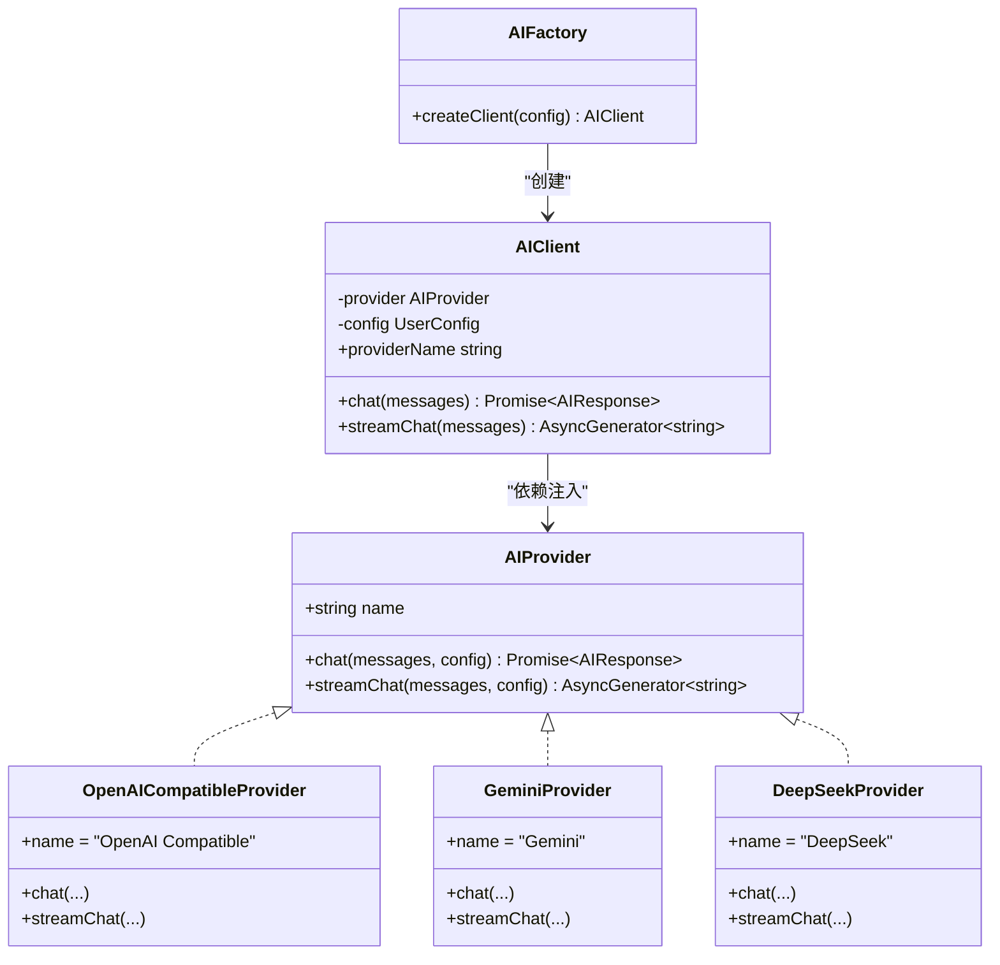
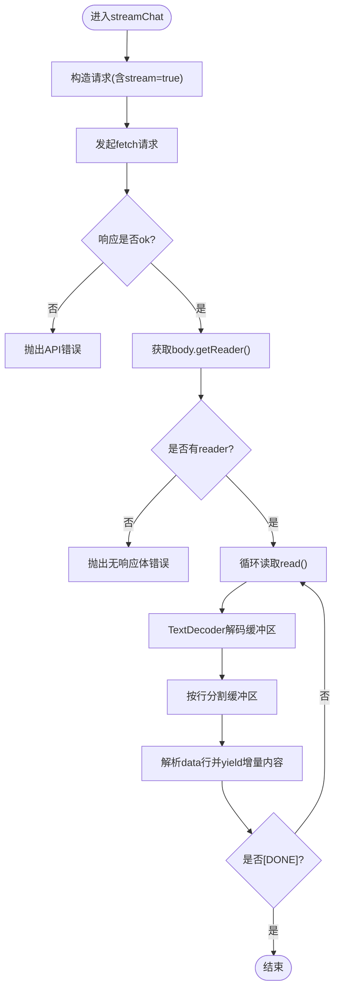
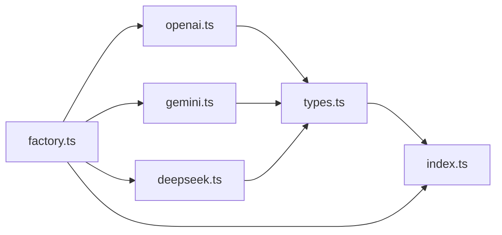

# AI服务集成规范

<cite>
**本文引用的文件**
- [factory.ts](file://manga-creator/src/lib/ai/factory.ts)
- [types.ts](file://manga-creator/src/lib/ai/types.ts)
- [openai.ts](file://manga-creator/src/lib/ai/providers/openai.ts)
- [gemini.ts](file://manga-creator/src/lib/ai/providers/gemini.ts)
- [deepseek.ts](file://manga-creator/src/lib/ai/providers/deepseek.ts)
- [factory.test.ts](file://manga-creator/src/lib/ai/factory.test.ts)
- [providers.test.ts](file://manga-creator/src/lib/ai/providers/providers.test.ts)
- [index.ts](file://manga-creator/src/types/index.ts)
- [skills.ts](file://manga-creator/src/lib/ai/skills.ts)
- [README.md](file://manga-creator/README.md)
</cite>

## 目录
1. [引言](#引言)
2. [项目结构](#项目结构)
3. [核心组件](#核心组件)
4. [架构总览](#架构总览)
5. [详细组件分析](#详细组件分析)
6. [依赖关系分析](#依赖关系分析)
7. [性能考量](#性能考量)
8. [故障排查指南](#故障排查指南)
9. [结论](#结论)
10. [附录：新增AI提供商标准化流程](#附录新增ai提供商标准化流程)

## 引言
本规范围绕AI服务集成的统一标准展开，以factory.ts中的AIProviderFactory为核心，系统阐述工厂模式的实现机制、AIProvider接口契约、依赖注入解耦方式，以及错误处理策略、响应超时控制、请求节流等关键问题。通过对openai.ts与gemini.ts的适配器实现进行对比，总结不同提供商的差异点，并给出新增AI提供商的标准化流程，帮助团队在保持一致性的前提下快速扩展新的AI供应商。

## 项目结构
AI服务集成位于manga-creator/src/lib/ai目录，采用“类型定义 + 工厂 + 适配器”的分层架构：
- 类型定义：统一AI接口契约与数据结构
- 工厂：按配置动态创建具体适配器实例
- 适配器：针对不同供应商的HTTP调用与流式解析
- 技能：基于上下文的Agent技能定义与注册

图表来源
- [factory.ts](file://manga-creator/src/lib/ai/factory.ts#L1-L54)
- [types.ts](file://manga-creator/src/lib/ai/types.ts#L1-L15)
- [openai.ts](file://manga-creator/src/lib/ai/providers/openai.ts#L1-L88)
- [gemini.ts](file://manga-creator/src/lib/ai/providers/gemini.ts#L1-L138)
- [deepseek.ts](file://manga-creator/src/lib/ai/providers/deepseek.ts#L1-L110)
- [index.ts](file://manga-creator/src/types/index.ts#L82-L107)
- [skills.ts](file://manga-creator/src/lib/ai/skills.ts#L1-L132)

章节来源
- [README.md](file://manga-creator/README.md#L90-L128)

## 核心组件
- AIProvider接口契约：定义统一的聊天与流式聊天能力，保证不同供应商的调用一致性
- 工厂createAIProvider：根据ProviderType返回对应适配器实例
- AIFactory.createClient：对上层提供统一的客户端封装，隐藏具体适配器细节
- 适配器实现：分别处理HTTP请求、响应解析、SSE流式解析与错误处理

章节来源
- [types.ts](file://manga-creator/src/lib/ai/types.ts#L1-L15)
- [factory.ts](file://manga-creator/src/lib/ai/factory.ts#L1-L54)

## 架构总览
AI服务集成采用“工厂 + 接口 + 适配器”的解耦架构，上层仅依赖AIProvider接口，通过配置决定运行时的具体实现。工厂负责装配与校验，适配器负责与外部API交互。

图表来源
- [factory.ts](file://manga-creator/src/lib/ai/factory.ts#L22-L54)
- [openai.ts](file://manga-creator/src/lib/ai/providers/openai.ts#L7-L35)
- [gemini.ts](file://manga-creator/src/lib/ai/providers/gemini.ts#L58-L88)
- [deepseek.ts](file://manga-creator/src/lib/ai/providers/deepseek.ts#L29-L57)

## 详细组件分析

### 工厂模式与依赖注入
- createAIProvider：根据ProviderType映射到具体适配器类，支持别名（如kimi映射到openai-compatible）
- AIFactory.createClient：集中校验配置完整性，创建AIClient并注入Provider
- AIClient：对上层暴露统一的chat/streamChat方法，内部委派给Provider

图表来源
- [types.ts](file://manga-creator/src/lib/ai/types.ts#L10-L15)
- [openai.ts](file://manga-creator/src/lib/ai/providers/openai.ts#L1-L88)
- [gemini.ts](file://manga-creator/src/lib/ai/providers/gemini.ts#L1-L138)
- [deepseek.ts](file://manga-creator/src/lib/ai/providers/deepseek.ts#L1-L110)
- [factory.ts](file://manga-creator/src/lib/ai/factory.ts#L1-L54)

章节来源
- [factory.ts](file://manga-creator/src/lib/ai/factory.ts#L1-L54)

### AIProvider接口契约与数据结构
- AIProviderConfig：包含provider、apiKey、baseURL、model
- ChatMessage：role为user/assistant/system，content为字符串
- AIResponse：content为文本，tokenUsage可选，包含prompt、completion、total
- ProviderType：支持deepseek、kimi、gemini、openai-compatible

章节来源
- [types.ts](file://manga-creator/src/lib/ai/types.ts#L1-L15)
- [index.ts](file://manga-creator/src/types/index.ts#L82-L107)

### OpenAI兼容适配器（openai.ts）
- 请求路径：默认baseURL为OpenAI官方域名，支持自定义baseURL
- 请求头：Content-Type与Authorization（Bearer）
- chat：发送JSON请求，解析choices[0].message.content与usage
- streamChat：SSE流解析，逐行解析data: JSON，yield delta.content，遇到[DONE]结束

章节来源
- [openai.ts](file://manga-creator/src/lib/ai/providers/openai.ts#L1-L88)

### Gemini适配器（gemini.ts）
- 请求路径：buildURL/buildStreamURL分别生成generateContent与streamGenerateContent的URL
- 请求头：使用x-goog-api-key作为鉴权
- 消息格式转换：将messages转换为contents结构；system消息转换为user消息并前置
- chat：解析candidates[0].content.parts[0].text，提取usageMetadata
- streamChat：SSE流解析，逐行解析data: JSON，yield candidates[0].content.parts[0].text

章节来源
- [gemini.ts](file://manga-creator/src/lib/ai/providers/gemini.ts#L1-L138)

### DeepSeek适配器（deepseek.ts）
- 请求路径：默认baseURL为api.deepseek.com，支持自定义baseURL
- 请求头：Content-Type与Authorization（Bearer）
- chat：发送JSON请求，解析choices[0].message.content与usage
- streamChat：SSE流解析，逐行解析data: JSON，yield delta.content，遇到[DONE]结束

章节来源
- [deepseek.ts](file://manga-creator/src/lib/ai/providers/deepseek.ts#L1-L110)

### 错误处理策略
- 统一错误包装：各适配器在响应非ok时抛出带状态码与详情的错误
- 错误详情提取：优先尝试解析JSON error.message，否则读取text，最后回退为空
- 流式解析容错：对无效JSON行进行捕获并记录日志，避免中断

章节来源
- [deepseek.ts](file://manga-creator/src/lib/ai/providers/deepseek.ts#L12-L27)
- [gemini.ts](file://manga-creator/src/lib/ai/providers/gemini.ts#L41-L56)
- [openai.ts](file://manga-creator/src/lib/ai/providers/openai.ts#L22-L24)

### 响应超时控制与请求节流
- 超时控制：当前实现未内置fetch超时逻辑，建议在适配器中通过AbortSignal或自定义超时封装实现
- 请求节流：当前实现未内置限流逻辑，建议在工厂或上层调用处增加队列与令牌桶策略

章节来源
- [openai.ts](file://manga-creator/src/lib/ai/providers/openai.ts#L10-L20)
- [gemini.ts](file://manga-creator/src/lib/ai/providers/gemini.ts#L62-L69)
- [deepseek.ts](file://manga-creator/src/lib/ai/providers/deepseek.ts#L32-L41)

### 重试机制
- 当前实现未内置自动重试逻辑，建议在AIClient或上层调用处基于错误码（如429/5xx）实现指数退避重试

章节来源
- [factory.test.ts](file://manga-creator/src/lib/ai/factory.test.ts#L407-L444)

### 流式处理流程（以OpenAI兼容为例）

图表来源
- [openai.ts](file://manga-creator/src/lib/ai/providers/openai.ts#L37-L86)

## 依赖关系分析
- 工厂依赖：factory.ts导入各适配器类并在createAIProvider中进行实例化
- 类型依赖：适配器依赖types.ts中的AIProvider与AIProviderConfig，以及index.ts中的UserConfig、ChatMessage、AIResponse
- 客户端依赖：AIClient依赖AIProvider接口，向上提供chat/streamChat

图表来源
- [factory.ts](file://manga-creator/src/lib/ai/factory.ts#L1-L20)
- [openai.ts](file://manga-creator/src/lib/ai/providers/openai.ts#L1-L5)
- [gemini.ts](file://manga-creator/src/lib/ai/providers/gemini.ts#L1-L4)
- [deepseek.ts](file://manga-creator/src/lib/ai/providers/deepseek.ts#L1-L4)
- [types.ts](file://manga-creator/src/lib/ai/types.ts#L1-L15)
- [index.ts](file://manga-creator/src/types/index.ts#L82-L107)

章节来源
- [factory.ts](file://manga-creator/src/lib/ai/factory.ts#L1-L20)
- [types.ts](file://manga-creator/src/lib/ai/types.ts#L1-L15)
- [index.ts](file://manga-creator/src/types/index.ts#L82-L107)

## 性能考量
- 流式解析：SSE流式解析避免一次性加载大响应，降低内存占用
- 消息格式转换：Gemini需要将messages转换为contents结构，注意系统消息的前置处理
- Token统计：不同供应商返回的usage字段结构不同，需在适配器内做兼容处理
- 超时与重试：建议在适配器层引入超时控制与指数退避重试，提升稳定性

[本节为通用指导，无需列出章节来源]

## 故障排查指南
- 配置校验失败：当provider、apiKey或model缺失时，AIFactory.createClient会抛出错误
- API错误：各适配器在响应非ok时抛出带状态码与详情的错误，便于定位
- 网络错误：fetch被拒绝或超时会透传异常
- 流式解析异常：无效JSON行会被捕获并记录日志，但不会中断流
- 建议：在上层调用处增加统一的错误拦截与重试策略

章节来源
- [factory.test.ts](file://manga-creator/src/lib/ai/factory.test.ts#L50-L88)
- [providers.test.ts](file://manga-creator/src/lib/ai/providers/providers.test.ts#L102-L151)
- [openai.ts](file://manga-creator/src/lib/ai/providers/openai.ts#L22-L24)
- [gemini.ts](file://manga-creator/src/lib/ai/providers/gemini.ts#L41-L56)
- [deepseek.ts](file://manga-creator/src/lib/ai/providers/deepseek.ts#L12-L27)

## 结论
该AI服务集成通过工厂模式与接口契约实现了高度解耦与可扩展性。适配器层针对不同供应商的差异点进行了抽象与封装，统一了上层调用体验。建议后续补充超时控制、重试机制与请求节流策略，以进一步提升系统的鲁棒性与可用性。

[本节为总结性内容，无需列出章节来源]

## 附录：新增AI提供商标准化流程
- 实现接口：新建适配器类，实现AIProvider接口（name、chat、streamChat）
- 消息与响应：处理供应商特有的消息格式与usage字段结构
- 错误处理：在响应非ok时抛出带状态码与详情的错误
- 注册工厂：在createAIProvider中添加新类型的分支映射
- 测试验证：编写单元测试覆盖chat/streamChat、错误处理、流式解析、边界情况
- 集成验证：在AIFactory.createClient中使用新提供商配置进行端到端验证

章节来源
- [types.ts](file://manga-creator/src/lib/ai/types.ts#L10-L15)
- [factory.ts](file://manga-creator/src/lib/ai/factory.ts#L8-L20)
- [factory.test.ts](file://manga-creator/src/lib/ai/factory.test.ts#L12-L39)
- [providers.test.ts](file://manga-creator/src/lib/ai/providers/providers.test.ts#L1-L676)