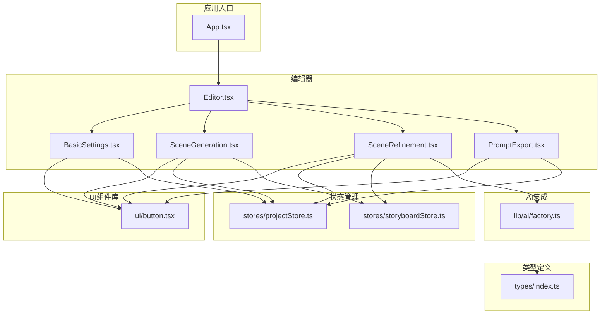
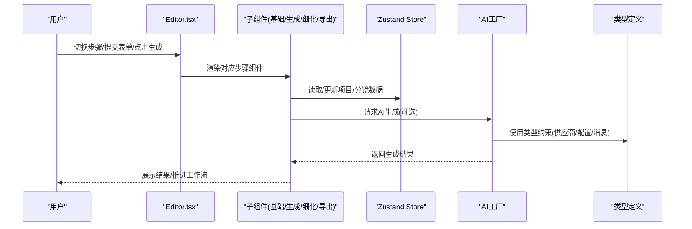
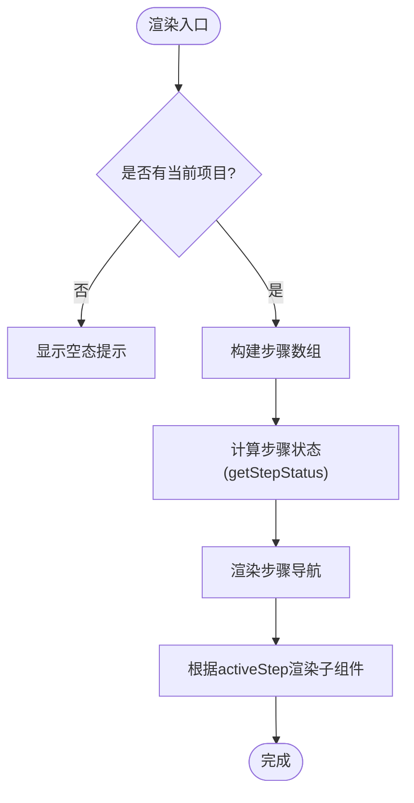
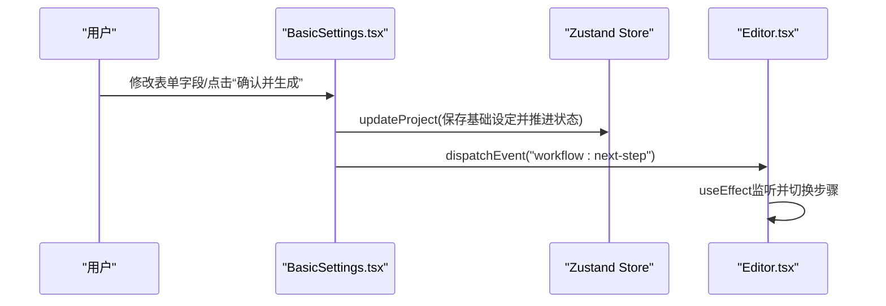
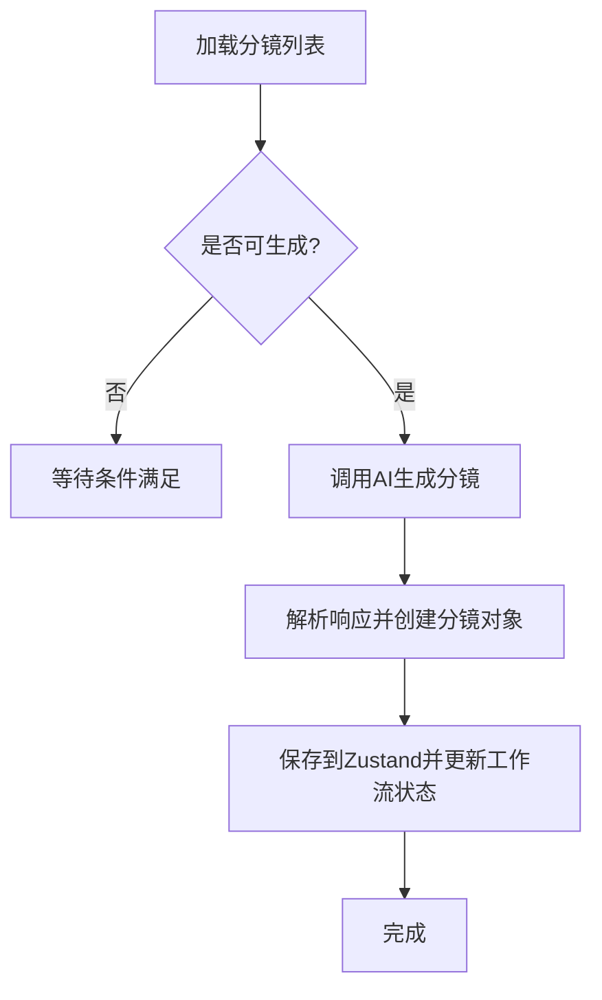
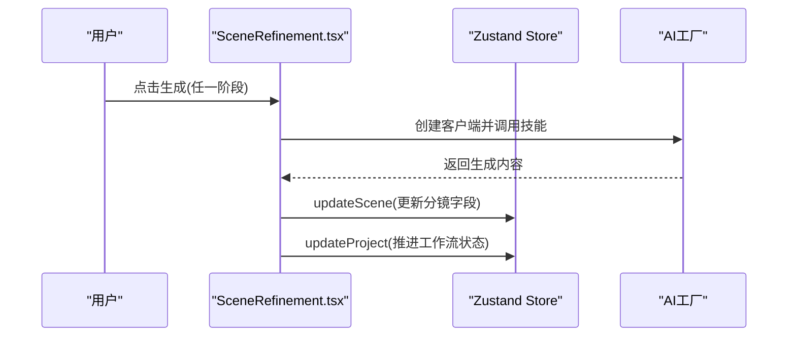
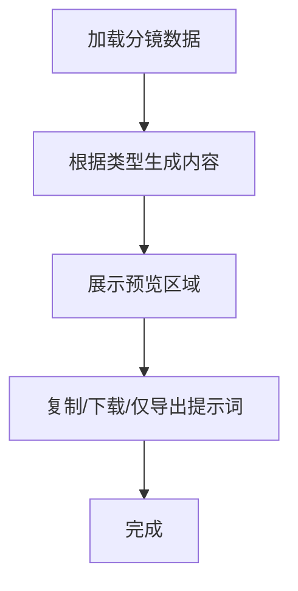
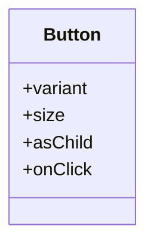
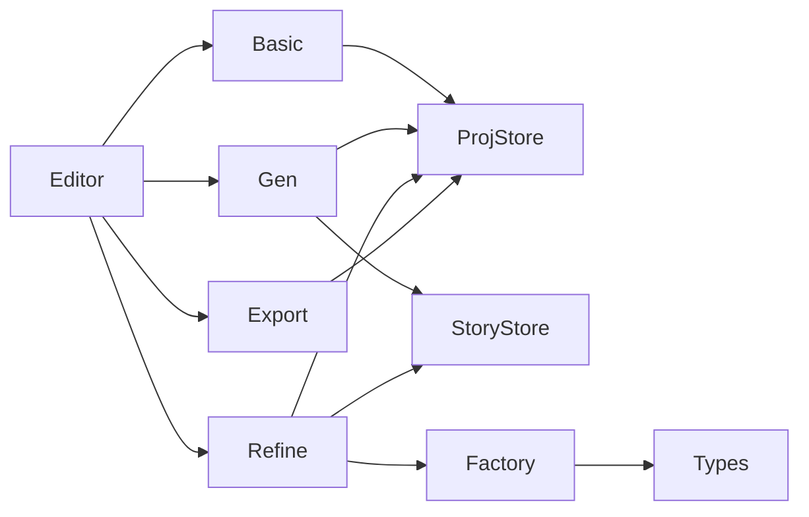

# React组件开发规范

<cite>
**本文引用的文件**
- [App.tsx](file://manga-creator/src/App.tsx)
- [Editor.tsx](file://manga-creator/src/components/Editor.tsx)
- [BasicSettings.tsx](file://manga-creator/src/components/editor/BasicSettings.tsx)
- [SceneGeneration.tsx](file://manga-creator/src/components/editor/SceneGeneration.tsx)
- [SceneRefinement.tsx](file://manga-creator/src/components/editor/SceneRefinement.tsx)
- [PromptExport.tsx](file://manga-creator/src/components/editor/PromptExport.tsx)
- [button.tsx](file://manga-creator/src/components/ui/button.tsx)
- [projectStore.ts](file://manga-creator/src/stores/projectStore.ts)
- [storyboardStore.ts](file://manga-creator/src/stores/storyboardStore.ts)
- [factory.ts](file://manga-creator/src/lib/ai/factory.ts)
- [index.ts](file://manga-creator/src/types/index.ts)
- [package.json](file://manga-creator/package.json)
</cite>

## 目录
1. [引言](#引言)
2. [项目结构](#项目结构)
3. [核心组件](#核心组件)
4. [架构总览](#架构总览)
5. [详细组件分析](#详细组件分析)
6. [依赖关系分析](#依赖关系分析)
7. [性能考量](#性能考量)
8. [故障排查指南](#故障排查指南)
9. [结论](#结论)
10. [附录](#附录)

## 引言
本规范围绕本仓库中的分镜编辑器组件体系，总结React函数式组件的标准化开发模式，重点覆盖：
- props解构的使用规范（禁止解构时默认值与类型定义冲突）
- useCallback与useMemo的使用场景（避免在每次渲染中重新创建回调函数）
- 通过memo优化性能（以Editor.tsx为例）
- 组件拆分原则（单一职责）
- JSX结构规范（嵌套层级不超过3层）
- 事件处理函数命名约定（on+动词+Handler）
- 错误边界使用建议
- React DevTools调试技巧
- 如何避免闭包陷阱

## 项目结构
该工程采用“按功能域划分”的组织方式，编辑器由多个子组件构成，配合Zustand状态管理与类型系统，形成清晰的分层与职责边界。

图表来源
- [App.tsx](file://manga-creator/src/App.tsx#L1-L81)
- [Editor.tsx](file://manga-creator/src/components/Editor.tsx#L1-L172)
- [BasicSettings.tsx](file://manga-creator/src/components/editor/BasicSettings.tsx#L1-L224)
- [SceneGeneration.tsx](file://manga-creator/src/components/editor/SceneGeneration.tsx#L1-L383)
- [SceneRefinement.tsx](file://manga-creator/src/components/editor/SceneRefinement.tsx#L1-L638)
- [PromptExport.tsx](file://manga-creator/src/components/editor/PromptExport.tsx#L1-L335)
- [button.tsx](file://manga-creator/src/components/ui/button.tsx#L1-L58)
- [projectStore.ts](file://manga-creator/src/stores/projectStore.ts#L1-L95)
- [storyboardStore.ts](file://manga-creator/src/stores/storyboardStore.ts#L1-L107)
- [factory.ts](file://manga-creator/src/lib/ai/factory.ts#L1-L54)
- [index.ts](file://manga-creator/src/types/index.ts#L1-L190)

章节来源
- [App.tsx](file://manga-creator/src/App.tsx#L1-L81)
- [package.json](file://manga-creator/package.json#L1-L62)

## 核心组件
- Editor.tsx：编辑器主容器，负责工作流状态驱动的步骤切换、步骤导航与子组件渲染。
- BasicSettings.tsx：基础设定表单，收集项目核心信息并推进工作流。
- SceneGeneration.tsx：分镜生成与编辑，支持AI生成、手动增删改、确认进入下一步。
- SceneRefinement.tsx：分镜细化三阶段生成（场景描述、动作描述、镜头提示词）。
- PromptExport.tsx：导出与统计，提供Markdown/JSON/纯提示词等多种导出格式。
- ui/button.tsx：通用按钮组件，提供变体与尺寸的组合式样式。
- stores/*：Zustand状态管理，封装项目与分镜数据的读写与重排。
- lib/ai/factory.ts：AI客户端工厂，屏蔽不同供应商差异。
- types/index.ts：项目与分镜的核心类型定义。

章节来源
- [Editor.tsx](file://manga-creator/src/components/Editor.tsx#L1-L172)
- [BasicSettings.tsx](file://manga-creator/src/components/editor/BasicSettings.tsx#L1-L224)
- [SceneGeneration.tsx](file://manga-creator/src/components/editor/SceneGeneration.tsx#L1-L383)
- [SceneRefinement.tsx](file://manga-creator/src/components/editor/SceneRefinement.tsx#L1-L638)
- [PromptExport.tsx](file://manga-creator/src/components/editor/PromptExport.tsx#L1-L335)
- [button.tsx](file://manga-creator/src/components/ui/button.tsx#L1-L58)
- [projectStore.ts](file://manga-creator/src/stores/projectStore.ts#L1-L95)
- [storyboardStore.ts](file://manga-creator/src/stores/storyboardStore.ts#L1-L107)
- [factory.ts](file://manga-creator/src/lib/ai/factory.ts#L1-L54)
- [index.ts](file://manga-creator/src/types/index.ts#L1-L190)

## 架构总览
编辑器采用“工作流状态驱动”的步骤化界面，Editor根据当前项目的工作流状态决定渲染哪个子步骤；子组件通过Zustand读取/写入数据，必要时调用AI工厂进行生成；UI组件通过组合式变体与尺寸提升复用性。

图表来源
- [Editor.tsx](file://manga-creator/src/components/Editor.tsx#L1-L172)
- [BasicSettings.tsx](file://manga-creator/src/components/editor/BasicSettings.tsx#L1-L224)
- [SceneGeneration.tsx](file://manga-creator/src/components/editor/SceneGeneration.tsx#L1-L383)
- [SceneRefinement.tsx](file://manga-creator/src/components/editor/SceneRefinement.tsx#L1-L638)
- [PromptExport.tsx](file://manga-creator/src/components/editor/PromptExport.tsx#L1-L335)
- [projectStore.ts](file://manga-creator/src/stores/projectStore.ts#L1-L95)
- [storyboardStore.ts](file://manga-creator/src/stores/storyboardStore.ts#L1-L107)
- [factory.ts](file://manga-creator/src/lib/ai/factory.ts#L1-L54)
- [index.ts](file://manga-creator/src/types/index.ts#L1-L190)

## 详细组件分析

### Editor.tsx：步骤导航与工作流驱动
- 设计要点
  - 使用工作流状态驱动步骤切换，避免硬编码分支。
  - 通过自定义事件在子组件间解耦推进。
  - 步骤状态计算逻辑集中在一个函数内，便于维护。
- 性能优化
  - 当前未使用memo包装子组件，但渲染路径清晰，子组件内部可按需使用memo。
  - 若子组件存在复杂计算或深层嵌套，建议对子组件使用memo包裹。
- 事件处理命名
  - handleStepClick/onStepClick：遵循“on+动词+Handler”的约定。
- JSX结构
  - 左侧导航与右侧内容区两列布局，嵌套层级控制在合理范围内。

图表来源
- [Editor.tsx](file://manga-creator/src/components/Editor.tsx#L1-L172)

章节来源
- [Editor.tsx](file://manga-creator/src/components/Editor.tsx#L1-L172)

### BasicSettings.tsx：基础设定与工作流推进
- 设计要点
  - 表单数据与项目数据双向绑定，保存时更新工作流状态并触发下一步事件。
  - 输入校验与可用性提示，保障后续步骤的前置条件满足。
- 事件处理命名
  - handleSave/onSave、handleProceed/onProceed：遵循“on+动词+Handler”。

图表来源
- [BasicSettings.tsx](file://manga-creator/src/components/editor/BasicSettings.tsx#L1-L224)
- [Editor.tsx](file://manga-creator/src/components/Editor.tsx#L1-L172)
- [projectStore.ts](file://manga-creator/src/stores/projectStore.ts#L1-L95)

章节来源
- [BasicSettings.tsx](file://manga-creator/src/components/editor/BasicSettings.tsx#L1-L224)
- [projectStore.ts](file://manga-creator/src/stores/projectStore.ts#L1-L95)

### SceneGeneration.tsx：分镜生成与编辑
- 设计要点
  - 支持AI生成与手动编辑，提供确认进入下一步的能力。
  - 生成过程包含进度反馈与错误提示。
- 事件处理命名
  - handleGenerate/onGenerate、handleAddScene/onAddScene、handleConfirm/onConfirm等。

图表来源
- [SceneGeneration.tsx](file://manga-creator/src/components/editor/SceneGeneration.tsx#L1-L383)
- [storyboardStore.ts](file://manga-creator/src/stores/storyboardStore.ts#L1-L107)
- [projectStore.ts](file://manga-creator/src/stores/projectStore.ts#L1-L95)

章节来源
- [SceneGeneration.tsx](file://manga-creator/src/components/editor/SceneGeneration.tsx#L1-L383)
- [storyboardStore.ts](file://manga-creator/src/stores/storyboardStore.ts#L1-L107)
- [projectStore.ts](file://manga-creator/src/stores/projectStore.ts#L1-L95)

### SceneRefinement.tsx：分镜细化三阶段生成
- 设计要点
  - 三阶段生成（场景描述、动作描述、镜头提示词），支持重新生成与批量生成。
  - 通过工作流状态与项目数据联动，逐步推进到导出阶段。
- 事件处理命名
  - generateSceneDescription/onGenerateSceneDescription、generateActionDescription/onGenerateActionDescription、generateShotPrompt/onGenerateShotPrompt、generateAll/onGenerateAll等。
- 性能优化
  - 子组件内部存在多处函数声明与状态更新，建议对高频渲染的子元素使用memo包裹，减少不必要的重渲染。

图表来源
- [SceneRefinement.tsx](file://manga-creator/src/components/editor/SceneRefinement.tsx#L1-L638)
- [storyboardStore.ts](file://manga-creator/src/stores/storyboardStore.ts#L1-L107)
- [projectStore.ts](file://manga-creator/src/stores/projectStore.ts#L1-L95)
- [factory.ts](file://manga-creator/src/lib/ai/factory.ts#L1-L54)

章节来源
- [SceneRefinement.tsx](file://manga-creator/src/components/editor/SceneRefinement.tsx#L1-L638)
- [storyboardStore.ts](file://manga-creator/src/stores/storyboardStore.ts#L1-L107)
- [projectStore.ts](file://manga-creator/src/stores/projectStore.ts#L1-L95)
- [factory.ts](file://manga-creator/src/lib/ai/factory.ts#L1-L54)

### PromptExport.tsx：导出与统计
- 设计要点
  - 生成Markdown/JSON/纯提示词三种格式，支持复制与下载。
  - 统计完成率与分镜状态，提供快速预览。
- 事件处理命名
  - handleCopy/onCopy、handleDownload/onDownload等。

图表来源
- [PromptExport.tsx](file://manga-creator/src/components/editor/PromptExport.tsx#L1-L335)
- [storyboardStore.ts](file://manga-creator/src/stores/storyboardStore.ts#L1-L107)
- [projectStore.ts](file://manga-creator/src/stores/projectStore.ts#L1-L95)

章节来源
- [PromptExport.tsx](file://manga-creator/src/components/editor/PromptExport.tsx#L1-L335)
- [storyboardStore.ts](file://manga-creator/src/stores/storyboardStore.ts#L1-L107)
- [projectStore.ts](file://manga-creator/src/stores/projectStore.ts#L1-L95)

### UI组件：Button
- 设计要点
  - 通过组合式变体与尺寸，提供一致的交互语义与视觉风格。
  - 支持asChild以实现语义化渲染。

图表来源
- [button.tsx](file://manga-creator/src/components/ui/button.tsx#L1-L58)

章节来源
- [button.tsx](file://manga-creator/src/components/ui/button.tsx#L1-L58)

## 依赖关系分析
- 组件依赖
  - Editor依赖BasicSettings、SceneGeneration、SceneRefinement、PromptExport。
  - 各子组件依赖Zustand存储与UI组件。
- 外部依赖
  - React、Radix UI、Lucide React、Zustand等。
- 类型依赖
  - types/index.ts提供工作流状态、分镜状态、AI配置等类型，确保跨模块一致性。

图表来源
- [Editor.tsx](file://manga-creator/src/components/Editor.tsx#L1-L172)
- [BasicSettings.tsx](file://manga-creator/src/components/editor/BasicSettings.tsx#L1-L224)
- [SceneGeneration.tsx](file://manga-creator/src/components/editor/SceneGeneration.tsx#L1-L383)
- [SceneRefinement.tsx](file://manga-creator/src/components/editor/SceneRefinement.tsx#L1-L638)
- [PromptExport.tsx](file://manga-creator/src/components/editor/PromptExport.tsx#L1-L335)
- [projectStore.ts](file://manga-creator/src/stores/projectStore.ts#L1-L95)
- [storyboardStore.ts](file://manga-creator/src/stores/storyboardStore.ts#L1-L107)
- [factory.ts](file://manga-creator/src/lib/ai/factory.ts#L1-L54)
- [index.ts](file://manga-creator/src/types/index.ts#L1-L190)

章节来源
- [package.json](file://manga-creator/package.json#L1-L62)

## 性能考量
- 使用memo优化渲染
  - 对频繁渲染且计算成本较高的子组件（如列表项、复杂按钮组）使用memo包裹，避免每次父组件重渲染导致的子组件重渲染。
  - 在Editor.tsx中，若子组件内部存在复杂计算或深层嵌套，建议对子组件使用memo包裹。
- useCallback与useMemo的使用场景
  - 将作为props传递给子组件的回调函数使用useCallback包裹，确保子组件能够正确比较引用。
  - 对昂贵的计算结果使用useMemo缓存，避免重复计算。
- 事件处理函数命名约定
  - 统一使用“on+动词+Handler”，如onSave、onGenerate、onProceed等，便于在DevTools中识别与追踪。
- JSX结构规范
  - 控制嵌套层级不超过3层，避免过深的嵌套导致可读性下降与渲染开销增加。
- 避免闭包陷阱
  - 在事件处理器中使用useCallback包裹，并将依赖项放入依赖数组，确保闭包捕获的是最新状态。
  - 对于需要访问最新状态的异步回调，优先使用useRef保存最新值，或在回调内部重新读取最新状态。

[本节为通用指导，无需特定文件来源]

## 故障排查指南
- 工作流无法推进
  - 检查工作流状态更新逻辑与事件派发是否正确。
  - 确认子组件在满足前置条件后才允许推进下一步。
- 生成失败或提示为空
  - 检查AI配置是否完整，工厂创建客户端是否抛错。
  - 检查子组件的错误提示与日志输出，定位解析或网络问题。
- 数据未持久化
  - 确认Zustand存储的更新方法是否被调用，以及本地存储的读写逻辑是否正常。
- UI交互异常
  - 使用React DevTools检查组件树与渲染次数，定位不必要的重渲染。
  - 使用Profiler分析组件渲染热点，结合useCallback/useMemo优化。

章节来源
- [SceneGeneration.tsx](file://manga-creator/src/components/editor/SceneGeneration.tsx#L1-L383)
- [SceneRefinement.tsx](file://manga-creator/src/components/editor/SceneRefinement.tsx#L1-L638)
- [PromptExport.tsx](file://manga-creator/src/components/editor/PromptExport.tsx#L1-L335)
- [projectStore.ts](file://manga-creator/src/stores/projectStore.ts#L1-L95)
- [storyboardStore.ts](file://manga-creator/src/stores/storyboardStore.ts#L1-L107)
- [factory.ts](file://manga-creator/src/lib/ai/factory.ts#L1-L54)

## 结论
本规范以Editor.tsx为核心，结合各子组件的实现细节，总结了React函数式组件的开发范式与最佳实践。通过工作流状态驱动、单一职责拆分、严格的事件命名与类型约束，以及合理的性能优化策略，能够有效提升组件的可维护性与运行效率。建议在后续迭代中持续引入memo、useCallback与useMemo，严格遵守props解构规范，避免闭包陷阱，并利用React DevTools进行性能分析与调试。

[本节为总结性内容，无需特定文件来源]

## 附录

### Props解构使用规范
- 禁止在解构时同时提供默认值与类型定义冲突的值，避免运行时类型不一致导致的逻辑错误。
- 推荐使用类型守卫与受控渲染，确保组件在缺失数据时不渲染无意义内容。

章节来源
- [Editor.tsx](file://manga-creator/src/components/Editor.tsx#L1-L172)
- [BasicSettings.tsx](file://manga-creator/src/components/editor/BasicSettings.tsx#L1-L224)
- [SceneGeneration.tsx](file://manga-creator/src/components/editor/SceneGeneration.tsx#L1-L383)
- [SceneRefinement.tsx](file://manga-creator/src/components/editor/SceneRefinement.tsx#L1-L638)
- [PromptExport.tsx](file://manga-creator/src/components/editor/PromptExport.tsx#L1-L335)

### 事件处理函数命名约定
- 统一使用“on+动词+Handler”，如onSave、onProceed、onGenerate、onConfirm、onCopy、onDownload等，便于在DevTools中快速定位与调试。

章节来源
- [BasicSettings.tsx](file://manga-creator/src/components/editor/BasicSettings.tsx#L1-L224)
- [SceneGeneration.tsx](file://manga-creator/src/components/editor/SceneGeneration.tsx#L1-L383)
- [SceneRefinement.tsx](file://manga-creator/src/components/editor/SceneRefinement.tsx#L1-L638)
- [PromptExport.tsx](file://manga-creator/src/components/editor/PromptExport.tsx#L1-L335)

### 错误边界使用建议
- 在应用顶层设置错误边界组件，捕获子组件渲染错误并降级显示，避免整页崩溃。
- 对异步生成与网络请求，提供明确的错误提示与重试机制。

章节来源
- [SceneGeneration.tsx](file://manga-creator/src/components/editor/SceneGeneration.tsx#L1-L383)
- [SceneRefinement.tsx](file://manga-creator/src/components/editor/SceneRefinement.tsx#L1-L638)
- [PromptExport.tsx](file://manga-creator/src/components/editor/PromptExport.tsx#L1-L335)

### React DevTools调试技巧
- 使用组件面板查看组件树与渲染次数，识别不必要的重渲染。
- 使用Profiler分析渲染热点，结合useCallback/useMemo进行针对性优化。
- 使用Hooks面板查看状态与副作用，定位闭包陷阱与状态更新异常。

章节来源
- [App.tsx](file://manga-creator/src/App.tsx#L1-L81)