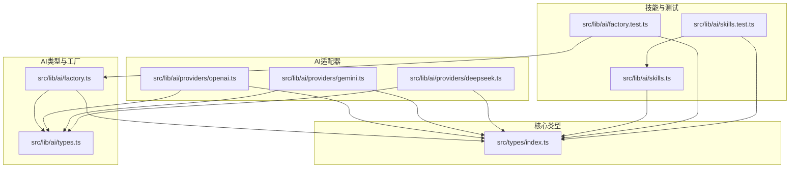
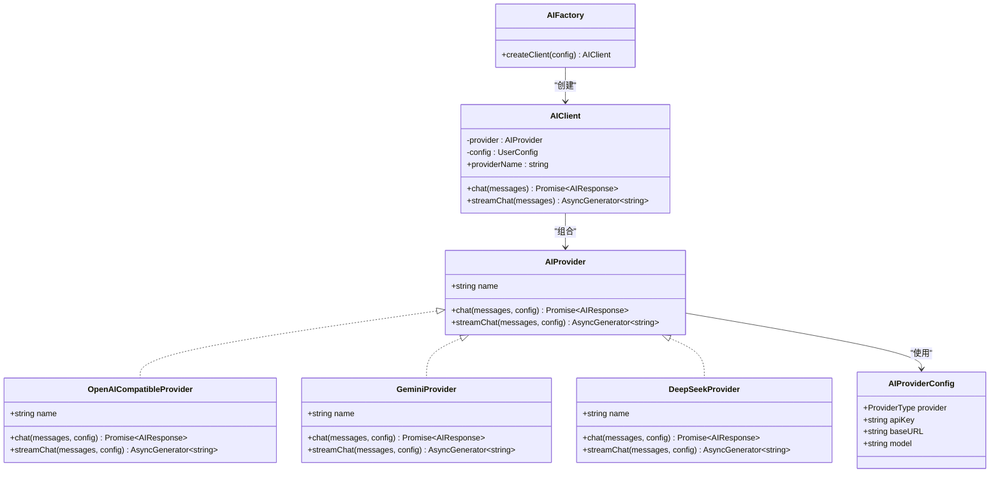
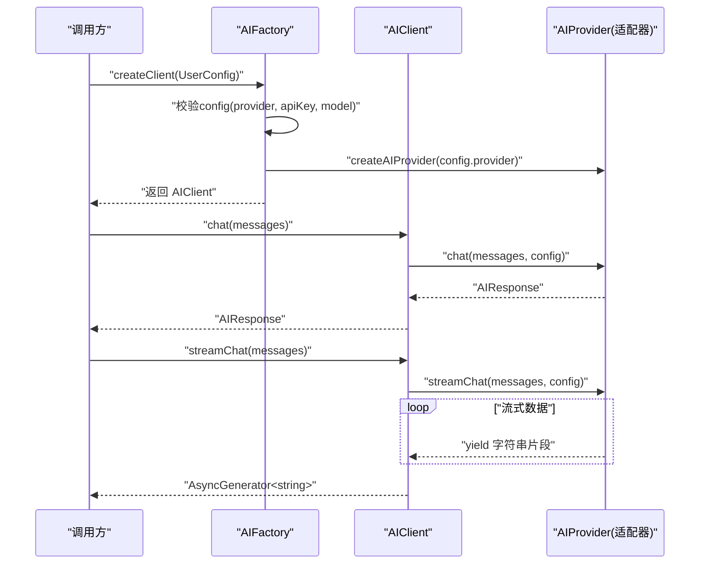
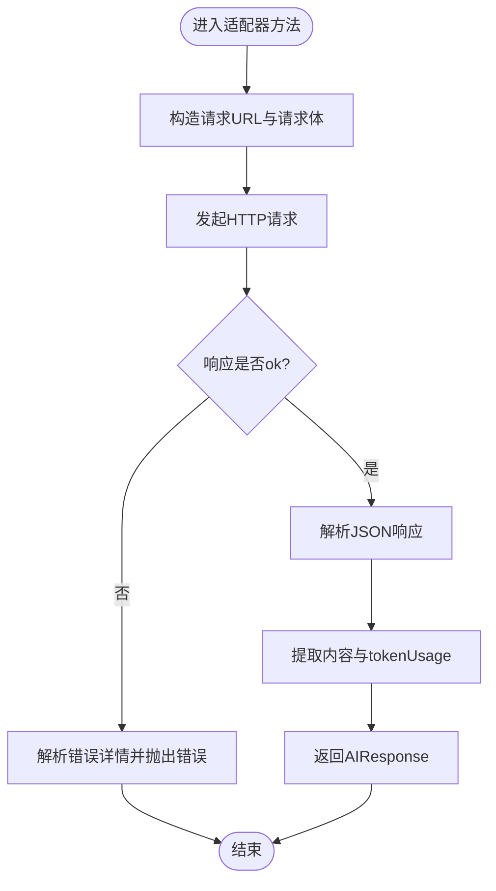
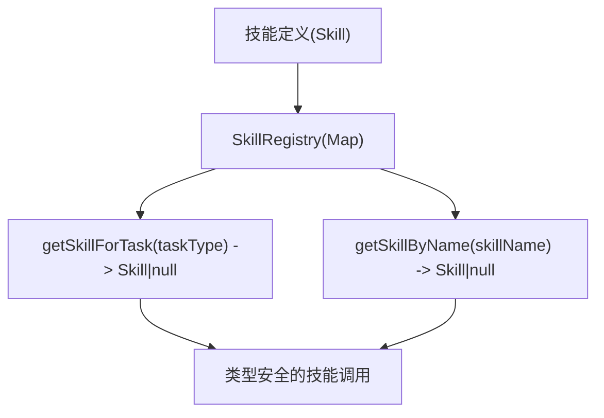
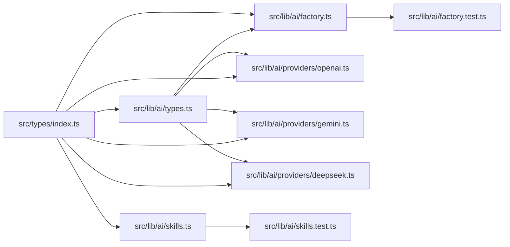

# TypeScript类型规范

<cite>
**本文引用的文件**
- [factory.ts](file://manga-creator/src/lib/ai/factory.ts)
- [types.ts](file://manga-creator/src/lib/ai/types.ts)
- [index.ts](file://manga-creator/src/types/index.ts)
- [openai.ts](file://manga-creator/src/lib/ai/providers/openai.ts)
- [gemini.ts](file://manga-creator/src/lib/ai/providers/gemini.ts)
- [deepseek.ts](file://manga-creator/src/lib/ai/providers/deepseek.ts)
- [skills.ts](file://manga-creator/src/lib/ai/skills.ts)
- [factory.test.ts](file://manga-creator/src/lib/ai/factory.test.ts)
- [skills.test.ts](file://manga-creator/src/lib/ai/skills.test.ts)
- [tsconfig.app.json](file://manga-creator/tsconfig.app.json)
- [tsconfig.node.json](file://manga-creator/tsconfig.node.json)
- [tsconfig.json](file://manga-creator/tsconfig.json)
- [package.json](file://manga-creator/package.json)
- [README.md](file://manga-creator/README.md)
</cite>

## 目录
1. [引言](#引言)
2. [项目结构](#项目结构)
3. [核心组件](#核心组件)
4. [架构总览](#架构总览)
5. [详细组件分析](#详细组件分析)
6. [依赖关系分析](#依赖关系分析)
7. [性能考量](#性能考量)
8. [故障排查指南](#故障排查指南)
9. [结论](#结论)
10. [附录](#附录)

## 引言
本规范旨在为本项目建立统一、可维护且强类型的TypeScript使用标准，重点覆盖：
- interface与type的选择原则：实体模型使用PascalCase命名的interface；配置对象与字面量形状使用type定义。
- 联合类型在AI提供商枚举中的应用：如'openai-compatible'|'gemini'|'deepseek'|'kimi'。
- 泛型在工厂模式中的高级用法：通过AIProvider<T>表达“适配器族”的类型约束。
- 类型安全设计：以factory.ts中的AIProvider接口与types.ts中的AIConfig类型为例，展示如何通过类型约束保证工厂与适配器的一致性。
- 类型导出规范、避免any的策略、类型守卫实现方式，以及如何通过类型推断提升开发效率。
- 常见错误类型（如类型不匹配、可选链误用）的排查指南。

## 项目结构
本项目采用“按功能域划分”的组织方式，AI相关类型与实现集中在src/lib/ai目录中，核心类型定义位于src/types/index.ts，便于跨模块复用。

图表来源
- [factory.ts](file://manga-creator/src/lib/ai/factory.ts#L1-L54)
- [types.ts](file://manga-creator/src/lib/ai/types.ts#L1-L15)
- [openai.ts](file://manga-creator/src/lib/ai/providers/openai.ts#L1-L88)
- [gemini.ts](file://manga-creator/src/lib/ai/providers/gemini.ts#L1-L138)
- [deepseek.ts](file://manga-creator/src/lib/ai/providers/deepseek.ts#L1-L110)
- [skills.ts](file://manga-creator/src/lib/ai/skills.ts#L1-L132)
- [factory.test.ts](file://manga-creator/src/lib/ai/factory.test.ts#L1-L595)
- [skills.test.ts](file://manga-creator/src/lib/ai/skills.test.ts#L1-L364)
- [index.ts](file://manga-creator/src/types/index.ts#L1-L190)

章节来源
- [README.md](file://manga-creator/README.md#L94-L128)

## 核心组件
- AIProvider接口：统一聊天与流式聊天协议，约束所有适配器必须实现的方法签名与返回类型。
- AIProviderConfig：统一适配器所需配置项，包含provider、apiKey、baseURL、model等。
- ProviderType联合类型：限定AI供应商枚举值，确保工厂与调用方对供应商取值的共识。
- UserConfig：用户配置对象，作为工厂入参，承载ProviderType与认证信息。
- ChatMessage与AIResponse：消息与响应的标准化结构，贯穿适配器与上层逻辑。
- AIFactory与createAIProvider：工厂负责根据ProviderType创建具体适配器实例，并进行配置校验。
- OpenAICompatibleProvider、GeminiProvider、DeepSeekProvider：三个适配器分别对接不同供应商，遵循AIProvider接口契约。

章节来源
- [types.ts](file://manga-creator/src/lib/ai/types.ts#L1-L15)
- [index.ts](file://manga-creator/src/types/index.ts#L82-L107)
- [factory.ts](file://manga-creator/src/lib/ai/factory.ts#L1-L54)
- [openai.ts](file://manga-creator/src/lib/ai/providers/openai.ts#L1-L88)
- [gemini.ts](file://manga-creator/src/lib/ai/providers/gemini.ts#L1-L138)
- [deepseek.ts](file://manga-creator/src/lib/ai/providers/deepseek.ts#L1-L110)

## 架构总览
下面的类图展示了AI适配器与工厂之间的类型关系与依赖方向。

图表来源
- [types.ts](file://manga-creator/src/lib/ai/types.ts#L1-L15)
- [factory.ts](file://manga-creator/src/lib/ai/factory.ts#L1-L54)
- [openai.ts](file://manga-creator/src/lib/ai/providers/openai.ts#L1-L88)
- [gemini.ts](file://manga-creator/src/lib/ai/providers/gemini.ts#L1-L138)
- [deepseek.ts](file://manga-creator/src/lib/ai/providers/deepseek.ts#L1-L110)

## 详细组件分析

### 工厂与客户端协作流程
该序列图展示了从配置到客户端调用再到适配器执行的完整流程，强调类型约束如何保证各环节的类型安全。

图表来源
- [factory.ts](file://manga-creator/src/lib/ai/factory.ts#L1-L54)
- [openai.ts](file://manga-creator/src/lib/ai/providers/openai.ts#L1-L88)
- [gemini.ts](file://manga-creator/src/lib/ai/providers/gemini.ts#L1-L138)
- [deepseek.ts](file://manga-creator/src/lib/ai/providers/deepseek.ts#L1-L110)

章节来源
- [factory.test.ts](file://manga-creator/src/lib/ai/factory.test.ts#L1-L259)

### AI适配器的类型守卫与错误处理
适配器内部对响应体进行类型守卫与错误处理，确保在API异常或响应结构不符合预期时仍能给出明确的错误信息。

图表来源
- [openai.ts](file://manga-creator/src/lib/ai/providers/openai.ts#L1-L88)
- [gemini.ts](file://manga-creator/src/lib/ai/providers/gemini.ts#L1-L138)
- [deepseek.ts](file://manga-creator/src/lib/ai/providers/deepseek.ts#L1-L110)

章节来源
- [openai.ts](file://manga-creator/src/lib/ai/providers/openai.ts#L1-L88)
- [gemini.ts](file://manga-creator/src/lib/ai/providers/gemini.ts#L1-L138)
- [deepseek.ts](file://manga-creator/src/lib/ai/providers/deepseek.ts#L1-L110)

### 技能系统的类型约束与注册表
技能系统通过Skill接口与注册表实现类型安全的技能查找与映射，确保调用方始终获得符合约定的对象。

图表来源
- [skills.ts](file://manga-creator/src/lib/ai/skills.ts#L1-L132)
- [index.ts](file://manga-creator/src/types/index.ts#L164-L190)

章节来源
- [skills.ts](file://manga-creator/src/lib/ai/skills.ts#L1-L132)
- [skills.test.ts](file://manga-creator/src/lib/ai/skills.test.ts#L1-L364)

## 依赖关系分析
- 工厂与适配器：factory.ts依赖types.ts中的AIProvider与AIProviderConfig，并通过ProviderType联合类型约束创建逻辑。
- 适配器与核心类型：三个适配器均实现AIProvider接口，并使用UserConfig、ChatMessage、AIResponse等核心类型。
- 技能系统：skills.ts依赖核心类型中的Skill、ContextType、TaskType等，形成稳定的领域模型。
- 测试：factory.test.ts与skills.test.ts分别验证工厂与技能系统的类型安全与行为正确性。

图表来源
- [index.ts](file://manga-creator/src/types/index.ts#L1-L190)
- [types.ts](file://manga-creator/src/lib/ai/types.ts#L1-L15)
- [factory.ts](file://manga-creator/src/lib/ai/factory.ts#L1-L54)
- [openai.ts](file://manga-creator/src/lib/ai/providers/openai.ts#L1-L88)
- [gemini.ts](file://manga-creator/src/lib/ai/providers/gemini.ts#L1-L138)
- [deepseek.ts](file://manga-creator/src/lib/ai/providers/deepseek.ts#L1-L110)
- [skills.ts](file://manga-creator/src/lib/ai/skills.ts#L1-L132)
- [factory.test.ts](file://manga-creator/src/lib/ai/factory.test.ts#L1-L595)
- [skills.test.ts](file://manga-creator/src/lib/ai/skills.test.ts#L1-L364)

章节来源
- [factory.test.ts](file://manga-creator/src/lib/ai/factory.test.ts#L1-L259)
- [skills.test.ts](file://manga-creator/src/lib/ai/skills.test.ts#L1-L364)

## 性能考量
- 类型推断与编译期检查：严格模式与noUnusedLocals/Parameters等选项有助于在早期发现潜在问题，减少运行时开销。
- 流式响应处理：适配器通过AsyncGenerator逐步产出内容，避免一次性拼接大字符串带来的内存峰值。
- 配置校验前置：在AIFactory.createClient中尽早校验配置完整性，避免无效请求造成的网络与CPU浪费。

章节来源
- [tsconfig.app.json](file://manga-creator/tsconfig.app.json#L1-L34)
- [tsconfig.node.json](file://manga-creator/tsconfig.node.json#L1-L24)
- [factory.ts](file://manga-creator/src/lib/ai/factory.ts#L45-L53)

## 故障排查指南
- 类型不匹配
  - 症状：工厂或适配器方法签名不一致导致编译报错。
  - 排查：确认AIProvider接口与各适配器实现一致；核对AIProviderConfig字段与UserConfig字段是否匹配。
  - 参考路径
    - [types.ts](file://manga-creator/src/lib/ai/types.ts#L1-L15)
    - [index.ts](file://manga-creator/src/types/index.ts#L82-L107)
    - [openai.ts](file://manga-creator/src/lib/ai/providers/openai.ts#L1-L88)
    - [gemini.ts](file://manga-creator/src/lib/ai/providers/gemini.ts#L1-L138)
    - [deepseek.ts](file://manga-creator/src/lib/ai/providers/deepseek.ts#L1-L110)

- 可选链误用
  - 症状：对可能为undefined的属性进行链式访问导致运行时错误。
  - 排查：在适配器中对响应体进行类型守卫与默认值处理；在工厂中对config进行非空校验后再使用。
  - 参考路径
    - [factory.ts](file://manga-creator/src/lib/ai/factory.ts#L45-L53)
    - [openai.ts](file://manga-creator/src/lib/ai/providers/openai.ts#L1-L88)
    - [gemini.ts](file://manga-creator/src/lib/ai/providers/gemini.ts#L1-L138)
    - [deepseek.ts](file://manga-creator/src/lib/ai/providers/deepseek.ts#L1-L110)

- 流式响应无body
  - 症状：读取response.body失败抛出错误。
  - 排查：在适配器中对response.body进行存在性检查与错误分支处理。
  - 参考路径
    - [factory.test.ts](file://manga-creator/src/lib/ai/factory.test.ts#L193-L258)

- API错误与网络异常
  - 症状：4xx/5xx或网络异常导致流程中断。
  - 排查：在适配器中解析错误详情并抛出明确错误；在工厂测试中模拟错误场景验证异常路径。
  - 参考路径
    - [factory.test.ts](file://manga-creator/src/lib/ai/factory.test.ts#L159-L206)
    - [openai.ts](file://manga-creator/src/lib/ai/providers/openai.ts#L1-L88)
    - [gemini.ts](file://manga-creator/src/lib/ai/providers/gemini.ts#L1-L138)
    - [deepseek.ts](file://manga-creator/src/lib/ai/providers/deepseek.ts#L1-L110)

## 结论
本项目通过严格的类型设计与工厂模式，实现了对多AI供应商的统一抽象与类型安全。建议在后续迭代中继续坚持：
- 实体模型使用interface，配置对象使用type。
- 使用联合类型约束枚举值，避免魔法字符串。
- 在工厂与适配器之间引入泛型以表达“适配器族”的类型约束。
- 保持类型守卫与错误处理的一致性，确保API异常与边界条件被显式捕获。
- 利用测试驱动类型设计，持续验证类型契约的正确性。

## 附录

### 类型规范要点清单
- interface与type的选择
  - 实体模型（如Project、Scene、Skill、Context）使用PascalCase命名的interface，便于扩展与继承。
  - 配置对象（如UserConfig、AIProviderConfig）使用type定义，强调字面量形状与不可变性。
  - 参考路径
    - [index.ts](file://manga-creator/src/types/index.ts#L43-L76)
    - [index.ts](file://manga-creator/src/types/index.ts#L82-L107)
    - [types.ts](file://manga-creator/src/lib/ai/types.ts#L1-L15)

- 联合类型在AI提供商枚举中的应用
  - 使用ProviderType联合类型限定供应商取值，确保工厂与调用方对供应商取值的共识。
  - 参考路径
    - [index.ts](file://manga-creator/src/types/index.ts#L82-L84)
    - [factory.ts](file://manga-creator/src/lib/ai/factory.ts#L8-L20)

- 泛型在工厂模式中的高级用法
  - 建议通过AIProvider<T>表达“适配器族”的类型约束，使工厂能够返回更精确的类型，提升类型推断能力。
  - 参考路径
    - [types.ts](file://manga-creator/src/lib/ai/types.ts#L10-L14)

- 类型导出规范
  - 将核心类型集中导出至src/types/index.ts，供工厂、适配器与上层模块统一引用，避免循环依赖。
  - 参考路径
    - [index.ts](file://manga-creator/src/types/index.ts#L1-L190)
    - [factory.ts](file://manga-creator/src/lib/ai/factory.ts#L1-L5)

- 避免any的策略
  - 使用具体的联合类型、接口与工具类型替代any，必要时使用类型守卫确保分支收敛。
  - 参考路径
    - [tsconfig.app.json](file://manga-creator/tsconfig.app.json#L1-L34)
    - [tsconfig.node.json](file://manga-creator/tsconfig.node.json#L1-L24)

- 类型守卫实现方式
  - 对API响应体进行结构化解析与字段存在性检查，结合try/catch与错误分支，确保异常路径清晰。
  - 参考路径
    - [openai.ts](file://manga-creator/src/lib/ai/providers/openai.ts#L1-L88)
    - [gemini.ts](file://manga-creator/src/lib/ai/providers/gemini.ts#L1-L138)
    - [deepseek.ts](file://manga-creator/src/lib/ai/providers/deepseek.ts#L1-L110)

- 通过类型推断提升开发效率
  - 在工厂与适配器中充分利用TypeScript的类型推断，减少显式声明，同时通过严格模式与测试保障类型正确性。
  - 参考路径
    - [factory.test.ts](file://manga-creator/src/lib/ai/factory.test.ts#L1-L259)
    - [skills.test.ts](file://manga-creator/src/lib/ai/skills.test.ts#L1-L364)