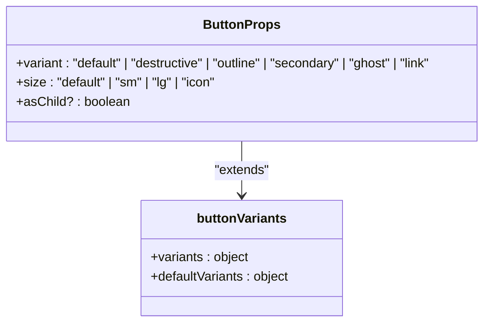
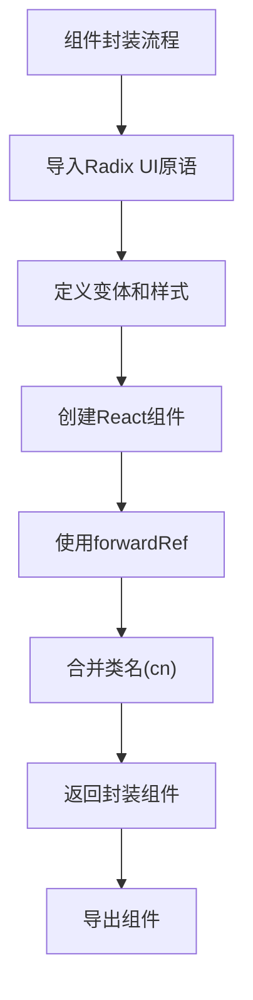
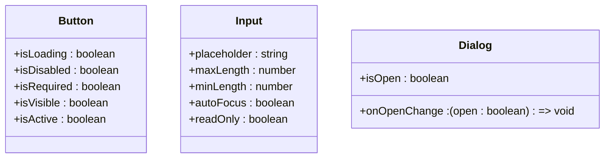
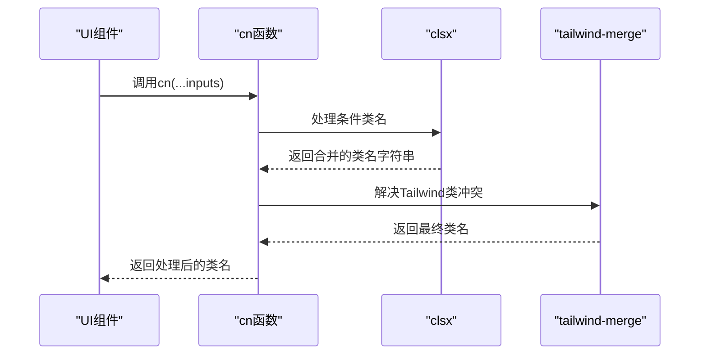
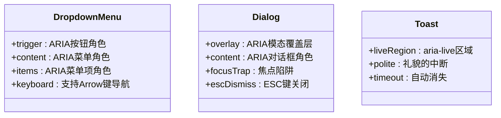
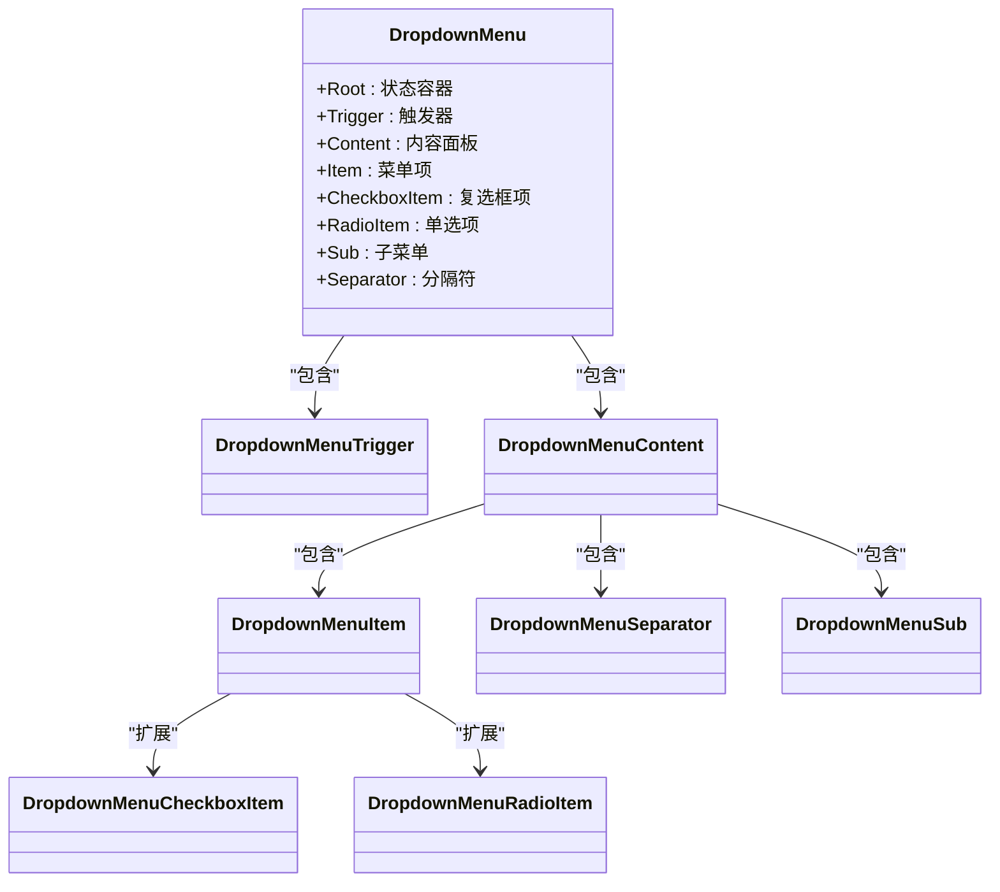
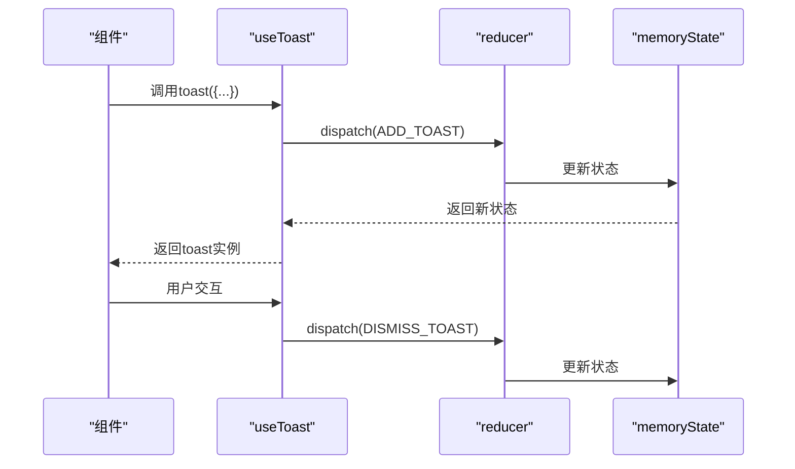

# UI组件封装规范

<cite>
**本文档引用的文件**  
- [button.tsx](file://manga-creator/src/components/ui/button.tsx)
- [dropdown-menu.tsx](file://manga-creator/src/components/ui/dropdown-menu.tsx)
- [card.tsx](file://manga-creator/src/components/ui/card.tsx)
- [input.tsx](file://manga-creator/src/components/ui/input.tsx)
- [select.tsx](file://manga-creator/src/components/ui/select.tsx)
- [textarea.tsx](file://manga-creator/src/components/ui/textarea.tsx)
- [label.tsx](file://manga-creator/src/components/ui/label.tsx)
- [progress.tsx](file://manga-creator/src/components/ui/progress.tsx)
- [dialog.tsx](file://manga-creator/src/components/ui/dialog.tsx)
- [alert-dialog.tsx](file://manga-creator/src/components/ui/alert-dialog.tsx)
- [accordion.tsx](file://manga-creator/src/components/ui/accordion.tsx)
- [toast.tsx](file://manga-creator/src/components/ui/toast.tsx)
- [toaster.tsx](file://manga-creator/src/components/ui/toaster.tsx)
- [utils.ts](file://manga-creator/src/lib/utils.ts)
- [use-toast.ts](file://manga-creator/src/hooks/use-toast.ts)
</cite>

## 目录
1. [引言](#引言)
2. [组件构建基础](#组件构建基础)
3. [Props命名规范](#props命名规范)
4. [CSS类合并策略](#css类合并策略)
5. [无障碍访问实现](#无障碍访问实现)
6. [复杂交互组件状态管理](#复杂交互组件状态管理)
7. [主题与响应式设计](#主题与响应式设计)
8. [文档与类型定义](#文档与类型定义)
9. [UI一致性检查清单](#ui一致性检查清单)

## 引言
本文档旨在规范基于Radix UI和Shadcn/ui模式的UI原子组件封装标准。通过分析现有组件实现，建立统一的开发规范，确保组件库的一致性、可复用性和可维护性。文档涵盖从基础按钮到复杂下拉菜单的完整封装指南。

## 组件构建基础

### 变体与尺寸设计
组件通过`class-variance-authority`（cva）定义变体（variant）和尺寸（size）的枚举设计，实现样式与逻辑的分离。以按钮组件为例，定义了六种变体和四种尺寸，通过函数式API提供类型安全的样式组合。

**图源**
- [button.tsx](file://manga-creator/src/components/ui/button.tsx#L7-L35)

**本节来源**
- [button.tsx](file://manga-creator/src/components/ui/button.tsx#L7-L58)

### 原子组件封装模式
所有UI组件遵循一致的封装模式：基于Radix UI原生组件进行封装，通过`forwardRef`传递引用，使用`cn`工具函数合并类名，确保无障碍访问特性得以保留。

**本节来源**
- [button.tsx](file://manga-creator/src/components/ui/button.tsx#L43-L57)
- [dropdown-menu.tsx](file://manga-creator/src/components/ui/dropdown-menu.tsx#L18-L38)

## Props命名规范

### 语义化命名原则
组件Props采用语义化命名，优先使用描述性名称而非缩写。例如使用`isLoading`而非`loading`，使用`isDisabled`而非`disabled`，提高代码可读性。

**本节来源**
- [button.tsx](file://manga-creator/src/components/ui/button.tsx#L40)
- [input.tsx](file://manga-creator/src/components/ui/input.tsx#L5)
- [dialog.tsx](file://manga-creator/src/components/ui/dialog.tsx#L34)

### 布尔Props命名
布尔类型的Props统一使用`is`或`has`前缀，明确表示其布尔性质。避免使用可能产生歧义的命名，如`show`、`enable`等。

**本节来源**
- [button.tsx](file://manga-creator/src/components/ui/button.tsx#L40)
- [toast.tsx](file://manga-creator/src/components/ui/toast.tsx#L44)

## CSS类合并策略

### clsx与tailwind-merge集成
通过`clsx`库处理条件类名，结合`tailwind-merge`解决Tailwind CSS类名冲突，实现智能合并。`cn`工具函数封装了这一逻辑，成为所有组件的标配。

**图源**
- [utils.ts](file://manga-creator/src/lib/utils.ts#L4-L6)

**本节来源**
- [utils.ts](file://manga-creator/src/lib/utils.ts#L1-L7)
- [button.tsx](file://manga-creator/src/components/ui/button.tsx#L48)

### 类名合并行为
`cn`函数支持多种输入类型，包括字符串、对象、数组及其嵌套组合。对于冲突的Tailwind类名，后者覆盖前者；对于非冲突类名，则进行合并。

**本节来源**
- [utils.test.ts](file://manga-creator/src/lib/utils.test.ts#L88-L134)

## 无障碍访问实现

### ARIA属性集成
所有交互组件严格遵循WAI-ARIA规范，通过Radix UI原语自动处理焦点管理、键盘导航和屏幕阅读器支持。避免手动实现无障碍逻辑。

**本节来源**
- [dropdown-menu.tsx](file://manga-creator/src/components/ui/dropdown-menu.tsx#L56-L73)
- [dialog.tsx](file://manga-creator/src/components/ui/dialog.tsx#L31-L53)
- [toast.tsx](file://manga-creator/src/components/ui/toast.tsx#L9-L15)

### 语义化HTML结构
组件使用语义化的HTML元素，如`<button>`、`<label>`、`<section>`等，并通过`<VisuallyHidden>`等辅助组件处理视觉隐藏内容。

**本节来源**
- [label.tsx](file://manga-creator/src/components/ui/label.tsx#L11-L22)
- [toast.tsx](file://manga-creator/src/components/ui/toast.tsx#L47-L48)

## 复杂交互组件状态管理

### 下拉菜单组件分析
`dropdown-menu.tsx`展示了复杂交互组件的封装模式，通过Radix UI的原语系统处理打开/关闭状态、子菜单、分组、复选框等功能，避免手动管理DOM和事件。

**图源**
- [dropdown-menu.tsx](file://manga-creator/src/components/ui/dropdown-menu.tsx#L6-L198)

**本节来源**
- [dropdown-menu.tsx](file://manga-creator/src/components/ui/dropdown-menu.tsx#L1-L199)

### Toast通知系统
Toast系统通过自定义Hook`use-toast`实现全局状态管理，使用不可变更新模式，确保状态一致性。通知队列支持限制数量和自动移除。

**图源**
- [use-toast.ts](file://manga-creator/src/hooks/use-toast.ts#L77-L130)

**本节来源**
- [use-toast.ts](file://manga-creator/src/hooks/use-toast.ts#L1-L195)
- [toaster.tsx](file://manga-creator/src/components/ui/toaster.tsx#L1-L34)

## 主题与响应式设计

### 主题定制方案
通过CSS变量实现主题定制，组件样式基于设计令牌（design tokens）定义，支持深色模式和自定义主题扩展。

**本节来源**
- [button.tsx](file://manga-creator/src/components/ui/button.tsx#L8)
- [card.tsx](file://manga-creator/src/components/ui/card.tsx#L12)

### 响应式断点处理
利用Tailwind CSS的响应式前缀（如`sm:`、`md:`）处理不同屏幕尺寸的样式变化，确保组件在各种设备上的可用性。

**本节来源**
- [input.tsx](file://manga-creator/src/components/ui/input.tsx#L11)
- [toast.tsx](file://manga-creator/src/components/ui/toast.tsx#L16)

## 文档与类型定义

### TSDoc注释规范
所有公共组件和接口使用TSDoc注释，提供详细的参数说明、返回值描述和使用示例，支持IDE智能提示和文档生成。

**本节来源**
- 所有组件文件的接口定义

### 类型安全设计
通过TypeScript的泛型和条件类型确保类型安全，`VariantProps<typeof componentVariants>`模式允许从样式定义中提取类型，避免重复声明。

**本节来源**
- [button.tsx](file://manga-creator/src/components/ui/button.tsx#L37-L39)
- [label.tsx](file://manga-creator/src/components/ui/label.tsx#L11-L14)

## UI一致性检查清单

### 组件封装检查项
- [x] 基于Radix UI原语封装
- [x] 使用`forwardRef`处理引用
- [x] 通过`cn`函数合并类名
- [x] 遵循语义化Props命名
- [x] 支持`asChild`渲染模式
- [x] 提供完整的TSDoc注释
- [x] 设置`displayName`便于调试
- [x] 导出必要的变体函数

### 无障碍访问检查项
- [x] 符合WAI-ARIA规范
- [x] 支持键盘导航
- [x] 提供足够的对比度
- [x] 有可见的焦点指示
- [x] 屏幕阅读器友好

### 响应式设计检查项
- [x] 在移动设备上可用
- [x] 支持触摸操作
- [x] 断点适配合理
- [x] 字体大小可读