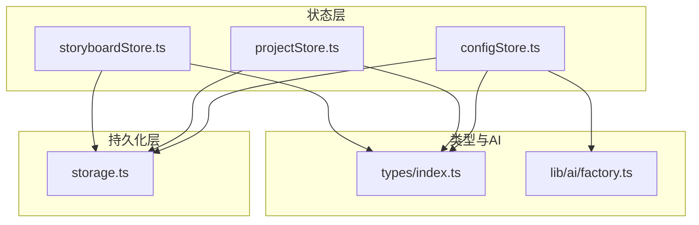
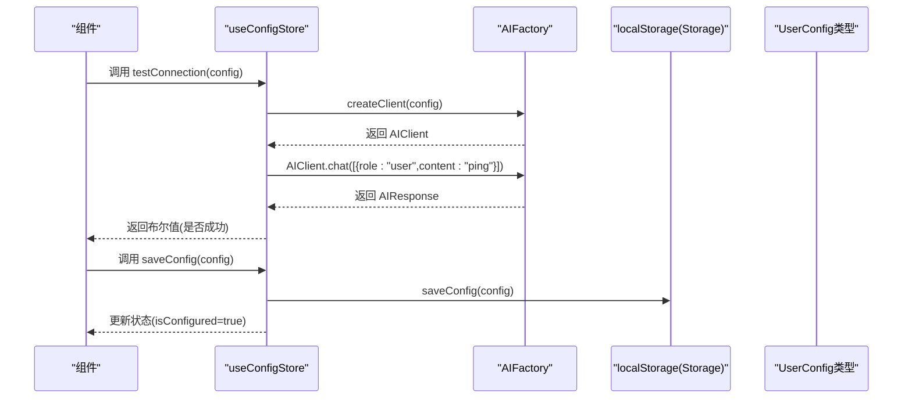
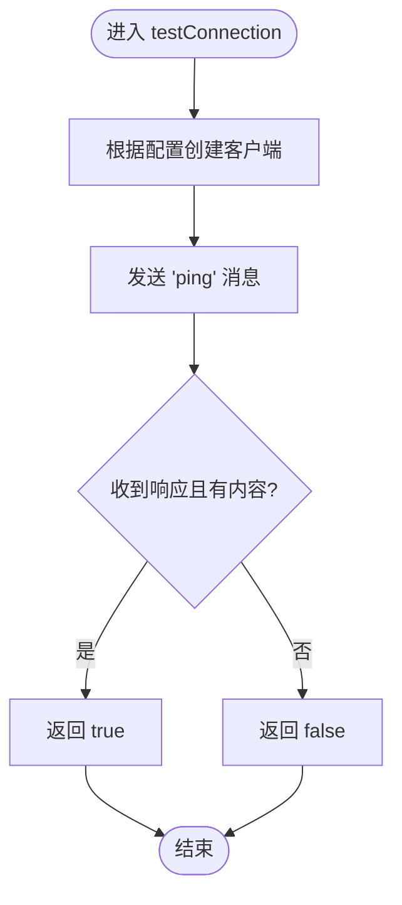
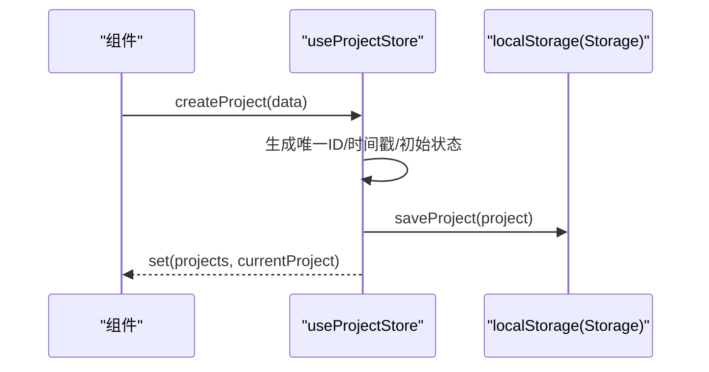
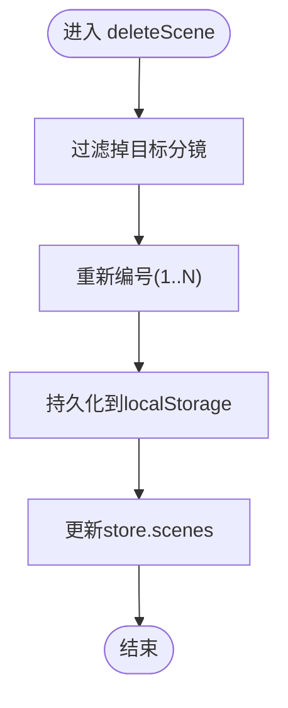
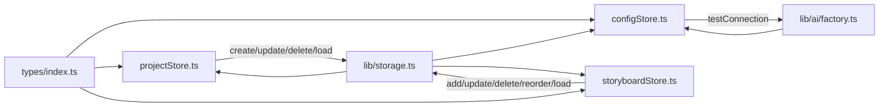

# Zustand状态管理规范

<cite>
**本文引用的文件**
- [configStore.ts](file://manga-creator/src/stores/configStore.ts)
- [projectStore.ts](file://manga-creator/src/stores/projectStore.ts)
- [storyboardStore.ts](file://manga-creator/src/stores/storyboardStore.ts)
- [store.test.ts](file://manga-creator/src/stores/store.test.ts)
- [storage.ts](file://manga-creator/src/lib/storage.ts)
- [types/index.ts](file://manga-creator/src/types/index.ts)
- [factory.ts](file://manga-creator/src/lib/ai/factory.ts)
- [README.md](file://manga-creator/README.md)
</cite>

## 目录
1. [引言](#引言)
2. [项目结构](#项目结构)
3. [核心组件](#核心组件)
4. [架构总览](#架构总览)
5. [详细组件分析](#详细组件分析)
6. [依赖关系分析](#依赖关系分析)
7. [性能考量](#性能考量)
8. [故障排查指南](#故障排查指南)
9. [结论](#结论)
10. [附录](#附录)

## 引言
本规范围绕Zustand在项目中的应用，总结并提炼最佳实践，涵盖：
- 原子化store设计：将用户配置与项目元数据拆分为独立store，降低耦合与重渲染范围
- 异步action处理：统一使用async/await封装API调用，保证错误可控与可观测性
- state选择器优化：通过useSelector与浅比较避免不必要的重渲染
- 复杂状态更新策略：以storyboardStore为例，展示分镜数据的增删改查、重排与持久化
- store持久化与中间件：结合localStorage与加密存储，规范数据读写与迁移
- 调试与快照：提供状态快照与日志记录建议
- 循环依赖规避：通过模块边界与依赖注入避免相互引用

## 项目结构
Zustand状态集中在stores目录，配合lib/storage进行本地持久化，类型定义位于types目录，AI适配通过factory.ts实现多供应商抽象。

图表来源
- [configStore.ts](file://manga-creator/src/stores/configStore.ts#L1-L58)
- [projectStore.ts](file://manga-creator/src/stores/projectStore.ts#L1-L95)
- [storyboardStore.ts](file://manga-creator/src/stores/storyboardStore.ts#L1-L107)
- [storage.ts](file://manga-creator/src/lib/storage.ts#L1-L246)
- [types/index.ts](file://manga-creator/src/types/index.ts#L1-L190)
- [factory.ts](file://manga-creator/src/lib/ai/factory.ts#L1-L54)

章节来源
- [README.md](file://manga-creator/README.md#L94-L128)

## 核心组件
- configStore.ts：用户配置的加载、保存、清空与连接测试
- projectStore.ts：项目列表、当前项目、加载/创建/更新/删除等操作
- storyboardStore.ts：分镜列表、当前分镜、增删改查、重排与生成状态

章节来源
- [configStore.ts](file://manga-creator/src/stores/configStore.ts#L1-L58)
- [projectStore.ts](file://manga-creator/src/stores/projectStore.ts#L1-L95)
- [storyboardStore.ts](file://manga-creator/src/stores/storyboardStore.ts#L1-L107)

## 架构总览
Zustand store作为单一事实源，通过get/set与外部持久化层交互；AI连接测试通过工厂模式解耦不同供应商。

图表来源
- [configStore.ts](file://manga-creator/src/stores/configStore.ts#L45-L56)
- [factory.ts](file://manga-creator/src/lib/ai/factory.ts#L44-L53)
- [storage.ts](file://manga-creator/src/lib/storage.ts#L164-L173)
- [types/index.ts](file://manga-creator/src/types/index.ts#L82-L97)

## 详细组件分析

### configStore.ts：原子化配置store
- 设计要点
  - 将用户配置独立为单独store，避免与项目状态耦合
  - 提供loadConfig/saveConfig/clearConfig/testConnection四类action
  - 使用async/await封装AI连接测试，异常捕获并返回布尔值
- 关键行为
  - loadConfig：从localStorage读取并设置isConfigured
  - saveConfig：加密存储UserConfig并更新状态
  - clearConfig：移除配置并重置状态
  - testConnection：通过AIFactory创建客户端并发送“ping”消息，返回可用性判断
- 最佳实践
  - 在action内部统一try/catch，避免异常冒泡至组件
  - 对外仅暴露必要字段与布尔态，减少订阅范围

图表来源
- [configStore.ts](file://manga-creator/src/stores/configStore.ts#L45-L56)
- [factory.ts](file://manga-creator/src/lib/ai/factory.ts#L44-L53)

章节来源
- [configStore.ts](file://manga-creator/src/stores/configStore.ts#L1-L58)
- [store.test.ts](file://manga-creator/src/stores/store.test.ts#L835-L867)

### projectStore.ts：项目元数据管理
- 设计要点
  - 原子化：项目列表与当前项目分离，避免无关更新触发重渲染
  - 加载/创建/更新/删除：均同步持久化与状态更新
  - 使用get()读取当前状态，set()批量更新，保证幂等
- 关键行为
  - loadProjects：设置isLoading，读取localStorage并更新projects
  - createProject：生成唯一ID、设置初始时间戳与工作流状态，持久化并更新当前项目
  - updateProject：合并更新字段，更新updatedAt并持久化
  - deleteProject：删除项目并清理对应分镜数据
  - setCurrentProject：设置当前项目
- 最佳实践
  - 对外暴露只读getter与受控setter，避免直接修改共享对象
  - 更新时尽量使用函数式set，减少浅比较失败

图表来源
- [projectStore.ts](file://manga-creator/src/stores/projectStore.ts#L42-L61)
- [storage.ts](file://manga-creator/src/lib/storage.ts#L68-L84)

章节来源
- [projectStore.ts](file://manga-creator/src/stores/projectStore.ts#L1-L95)
- [store.test.ts](file://manga-creator/src/stores/store.test.ts#L86-L254)

### storyboardStore.ts：复杂状态更新策略
- 设计要点
  - 分镜列表与当前分镜ID分离，便于局部更新
  - 提供setScenes/addScene/updateScene/deleteScene/reorderScenes等原子操作
  - 重排与删除后统一重新编号，保证order连续性
- 关键行为
  - setScenes：接收任意顺序的分镜数组，内部重新编号并持久化
  - addScene：生成唯一ID与顺序，持久化并加入列表
  - updateScene：查找匹配分镜，合并更新并持久化
  - deleteScene：过滤掉目标分镜并重新编号，持久化
  - reorderScenes：移动元素后重新编号，持久化
  - setCurrentScene/setGenerating：设置当前分镜与生成状态
- 最佳实践
  - 对于列表型状态，优先使用映射/过滤/拼接等不可变方式，减少副作用
  - 重排与删除后统一编号，避免业务层重复处理
  - 将持久化放在状态更新之后，保证一致性

图表来源
- [storyboardStore.ts](file://manga-creator/src/stores/storyboardStore.ts#L71-L82)
- [storage.ts](file://manga-creator/src/lib/storage.ts#L115-L145)

章节来源
- [storyboardStore.ts](file://manga-creator/src/stores/storyboardStore.ts#L1-L107)
- [store.test.ts](file://manga-creator/src/stores/store.test.ts#L415-L770)

### 异步action处理模式
- 统一使用async/await封装API调用，保证错误可控
- 在action内部进行try/catch，对外返回明确结果（布尔/对象）
- 对于AI连接测试，先构造客户端再发起请求，避免无效调用
- 对于耗时操作（如批量重排），可在UI层显示loading状态

章节来源
- [configStore.ts](file://manga-creator/src/stores/configStore.ts#L45-L56)
- [factory.ts](file://manga-creator/src/lib/ai/factory.ts#L44-L53)

### state选择器优化
- 使用浅比较的state选择器，避免因对象引用变化导致的重渲染
- 将订阅粒度控制在最小必要范围，例如：
  - 仅订阅当前项目ID而非整个对象
  - 仅订阅分镜数量而非完整列表
- 对于复杂计算，使用memoized selector或useMemo缓存结果

[本节为通用指导，无需特定文件来源]

### store持久化与中间件使用规范
- 持久化策略
  - 项目与分镜：使用localStorage键空间隔离，分别持久化
  - 配置：采用AES加密存储，避免明文泄露
  - 版本迁移：初始化时检测版本并执行迁移逻辑
- 中间件使用建议
  - 如需跨页面保留状态，可考虑引入persist中间件
  - 对于敏感配置，优先在内存中持有，仅在需要时持久化
- 数据导出/导入
  - 支持导出完整数据集，包含项目与分镜
  - 导入时校验结构并逐项写入

章节来源
- [storage.ts](file://manga-creator/src/lib/storage.ts#L1-L246)
- [store.test.ts](file://manga-creator/src/stores/store.test.ts#L183-L218)

### 状态快照调试方法
- 在关键action前后打印状态快照，定位异常
- 使用浏览器开发者工具的Redux DevTools或类似插件观察action与状态变化
- 对于异步action，记录请求参数与响应时间，便于性能分析

[本节为通用指导，无需特定文件来源]

### 避免循环依赖
- 模块边界清晰：store仅依赖types与storage，不反向依赖组件
- 通过工厂模式解耦AI供应商，避免store直接依赖具体实现
- 对外暴露纯函数与类型，不暴露内部实现细节

章节来源
- [factory.ts](file://manga-creator/src/lib/ai/factory.ts#L1-L54)
- [types/index.ts](file://manga-creator/src/types/index.ts#L1-L190)

## 依赖关系分析

图表来源
- [configStore.ts](file://manga-creator/src/stores/configStore.ts#L1-L58)
- [projectStore.ts](file://manga-creator/src/stores/projectStore.ts#L1-L95)
- [storyboardStore.ts](file://manga-creator/src/stores/storyboardStore.ts#L1-L107)
- [storage.ts](file://manga-creator/src/lib/storage.ts#L1-L246)
- [types/index.ts](file://manga-creator/src/types/index.ts#L1-L190)
- [factory.ts](file://manga-creator/src/lib/ai/factory.ts#L1-L54)

## 性能考量
- 列表更新：优先使用不可变更新，减少对象引用变化
- 选择器：使用浅比较选择器，避免不必要的重渲染
- 异步：批量操作时合并多次set调用，减少渲染次数
- 持久化：对频繁写入的场景，考虑节流/去抖策略

[本节为通用指导，无需特定文件来源]

## 故障排查指南
- 配置无法加载
  - 检查localStorage中配置键是否存在与格式是否正确
  - 若解密失败，确认加密密钥一致
- 项目/分镜无法保存
  - 查看持久化函数是否抛出异常
  - 确认项目ID/分镜ID唯一性
- 连接测试失败
  - 检查网络与供应商可用性
  - 校验API Key与模型名称是否完整

章节来源
- [storage.ts](file://manga-creator/src/lib/storage.ts#L151-L177)
- [store.test.ts](file://manga-creator/src/stores/store.test.ts#L835-L867)

## 结论
通过原子化store设计、统一的异步action模式、合理的state选择器与持久化策略，Zustand在本项目中实现了清晰、可维护、可扩展的状态管理。遵循本文规范，可在保证性能的同时提升开发效率与可维护性。

## 附录
- 推荐阅读
  - [Zustand官方文档](https://docs.pmnd.rs/zustand/getting-started/introduction)
  - [React状态管理最佳实践](https://react.dev/learn/state-a-components-memory)