# 代码规范

<cite>
**本文档引用的文件**  
- [factory.ts](file://manga-creator/src/lib/ai/factory.ts)
- [configStore.ts](file://manga-creator/src/stores/configStore.ts)
- [use-toast.ts](file://manga-creator/src/hooks/use-toast.ts)
- [types.ts](file://manga-creator/src/lib/ai/types.ts)
- [skills.ts](file://manga-creator/src/lib/ai/skills.ts)
- [index.ts](file://manga-creator/src/types/index.ts)
- [deepseek.ts](file://manga-creator/src/lib/ai/providers/deepseek.ts)
- [openai.ts](file://manga-creator/src/lib/ai/providers/openai.ts)
- [gemini.ts](file://manga-creator/src/lib/ai/providers/gemini.ts)
- [button.tsx](file://manga-creator/src/components/ui/button.tsx)
- [projectStore.ts](file://manga-creator/src/stores/projectStore.ts)
- [storyboardStore.ts](file://manga-creator/src/stores/storyboardStore.ts)
- [storage.ts](file://manga-creator/src/lib/storage.ts)
- [package.json](file://manga-creator/package.json)
- [tsconfig.json](file://manga-creator/tsconfig.json)
</cite>

## 目录
1. [简介](#简介)
2. [项目结构](#项目结构)
3. [TypeScript类型使用规范](#typescript类型使用规范)
4. [React函数式组件编写约定](#react函数式组件编写约定)
5. [Zustand Store设计模式](#zustand-store设计模式)
6. [AI服务集成规范](#ai服务集成规范)
7. [Shadcn/ui组件封装规范](#shadcnui组件封装规范)
8. [自定义Hook开发标准](#自定义hook开发标准)
9. [状态分层与持久化设计](#状态分层与持久化设计)
10. [错误处理与日志规范](#错误处理与日志规范)
11. [测试规范](#测试规范)
12. [总结](#总结)

## 简介
本规范文档旨在为AI漫画创作工具项目建立统一的代码编写标准，确保团队协作的一致性和代码的可维护性。文档涵盖TypeScript类型系统使用、React组件开发、Zustand状态管理、AI服务集成、UI组件封装和自定义Hook开发等多个维度，通过具体代码示例和设计模式说明，为开发者提供清晰的指导原则。

## 项目结构
项目采用功能模块化组织结构，主要分为组件、状态管理、AI服务和工具库四大模块。这种结构有利于职责分离和代码复用。

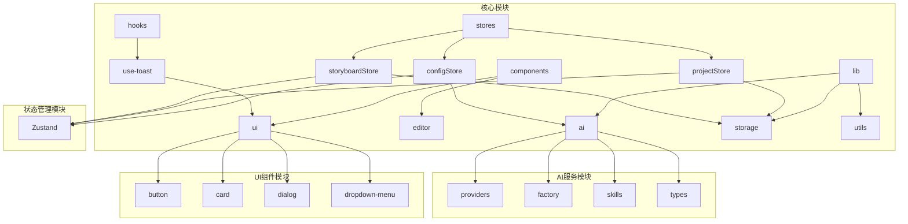

**图示来源**
- [factory.ts](file://manga-creator/src/lib/ai/factory.ts)
- [configStore.ts](file://manga-creator/src/stores/configStore.ts)
- [use-toast.ts](file://manga-creator/src/hooks/use-toast.ts)
- [projectStore.ts](file://manga-creator/src/stores/projectStore.ts)

## TypeScript类型使用规范
项目采用TypeScript进行类型安全的开发，通过接口定义和联合类型确保数据结构的清晰性和一致性。

### 接口命名规范
接口命名采用PascalCase格式，以`I`前缀开头（可选），并使用具体语义名称。核心数据模型如`Project`、`Scene`等在`types/index.ts`中统一定义。

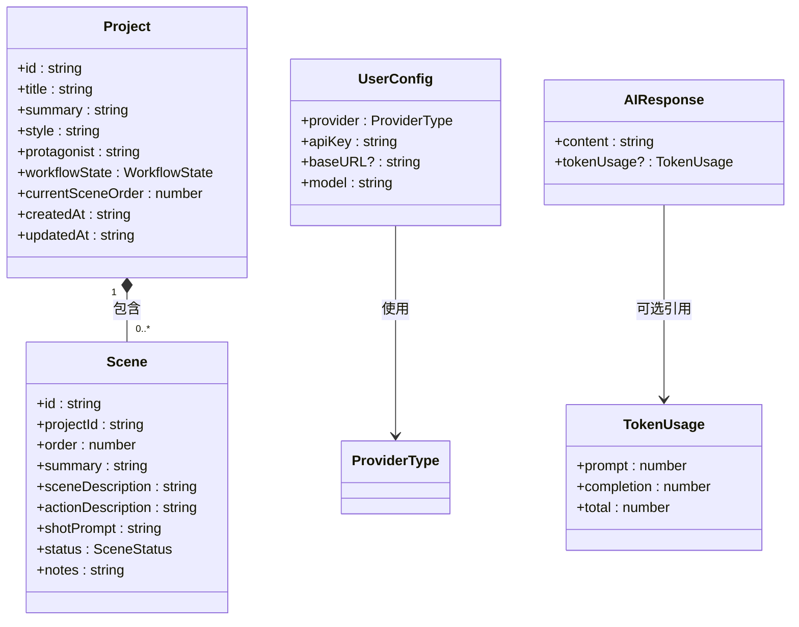

**图示来源**
- [index.ts](file://manga-creator/src/types/index.ts)
- [types.ts](file://manga-creator/src/lib/ai/types.ts)

### 联合类型处理
项目中广泛使用联合类型来表示有限的状态集合，如工作流状态、分镜状态和AI提供商类型。这些类型在`types/index.ts`中定义，确保类型安全和代码可读性。

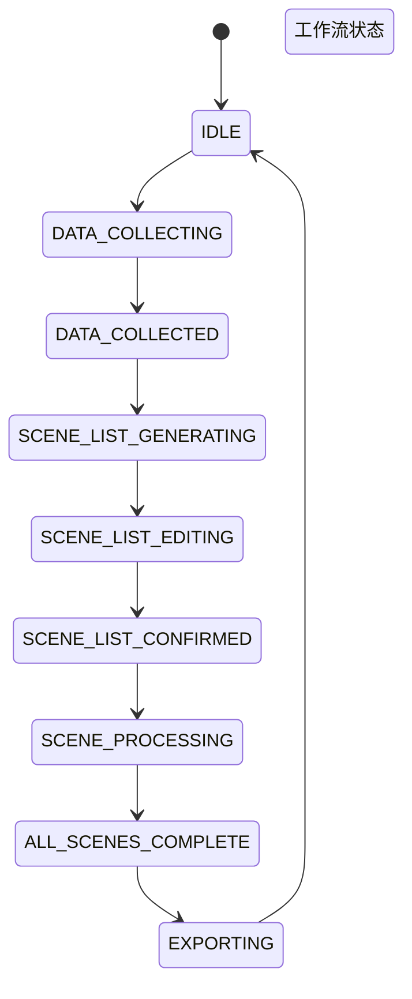

**图示来源**
- [index.ts](file://manga-creator/src/types/index.ts#L6-L15)

## React函数式组件编写约定
项目采用React函数式组件开发模式，遵循最佳实践和性能优化原则。

### Props解构规范
组件Props应使用解构赋值，并通过接口明确定义类型。对于可选属性，应提供合理的默认值或使用可选链操作符。

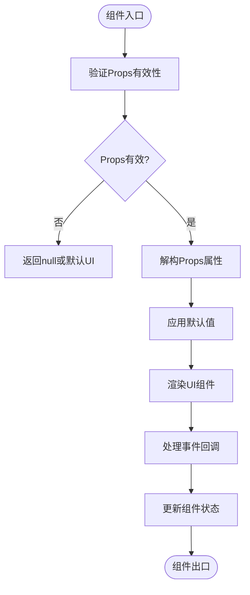

**图示来源**
- [button.tsx](file://manga-creator/src/components/ui/button.tsx)
- [ProjectCard.tsx](file://manga-creator/src/components/ProjectCard.tsx)

### useCallback与useMemo使用时机
`useCallback`用于记忆化事件处理函数，防止不必要的重新渲染；`useMemo`用于计算昂贵的值，避免重复计算。

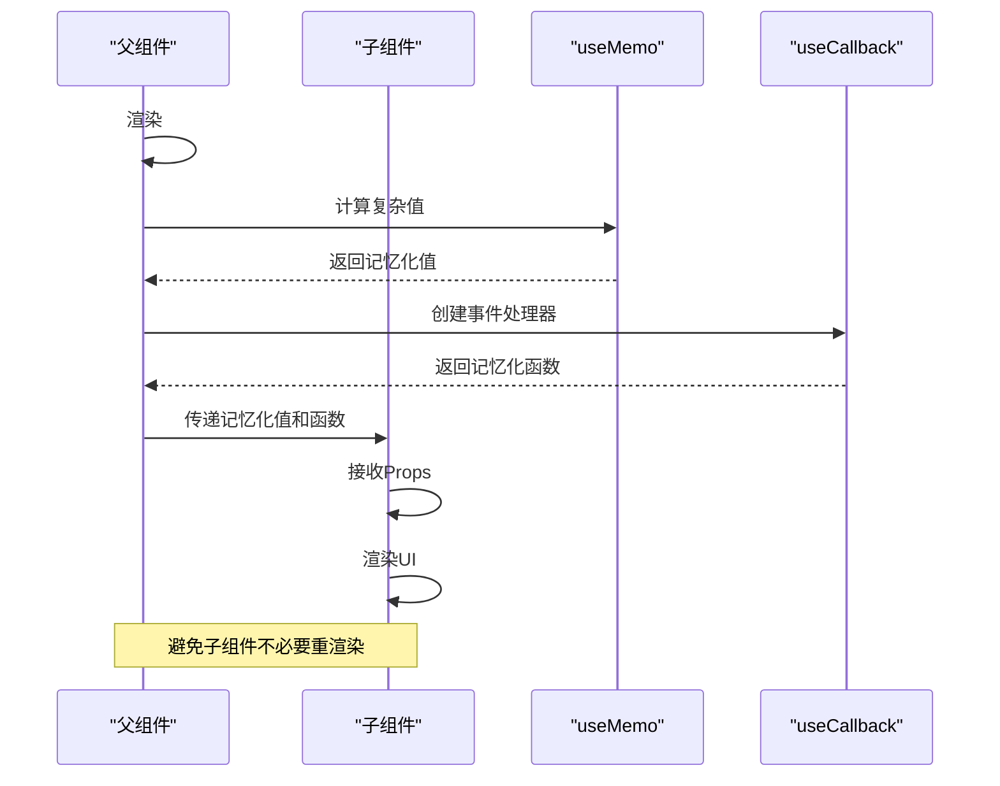

**图示来源**
- [Editor.tsx](file://manga-creator/src/components/Editor.tsx)
- [SceneRefinement.tsx](file://manga-creator/src/components/editor/SceneRefinement.tsx)

## Zustand Store设计模式
项目采用Zustand进行状态管理，遵循原子化store划分和单一职责原则。

### 原子化Store划分
状态被划分为多个独立的store，每个store负责特定领域的状态管理，如配置、项目和分镜状态。

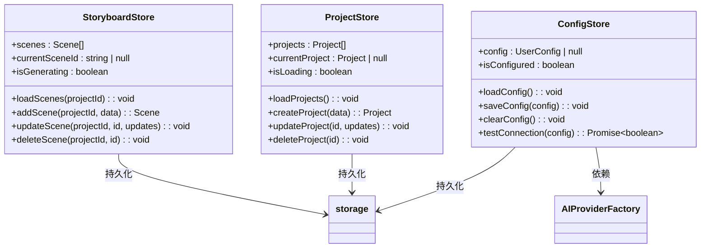

**图示来源**
- [configStore.ts](file://manga-creator/src/stores/configStore.ts)
- [projectStore.ts](file://manga-creator/src/stores/projectStore.ts)
- [storyboardStore.ts](file://manga-creator/src/stores/storyboardStore.ts)

### 异步Action处理
异步操作在store中通过async/await模式处理，确保状态更新的原子性和错误处理的完整性。

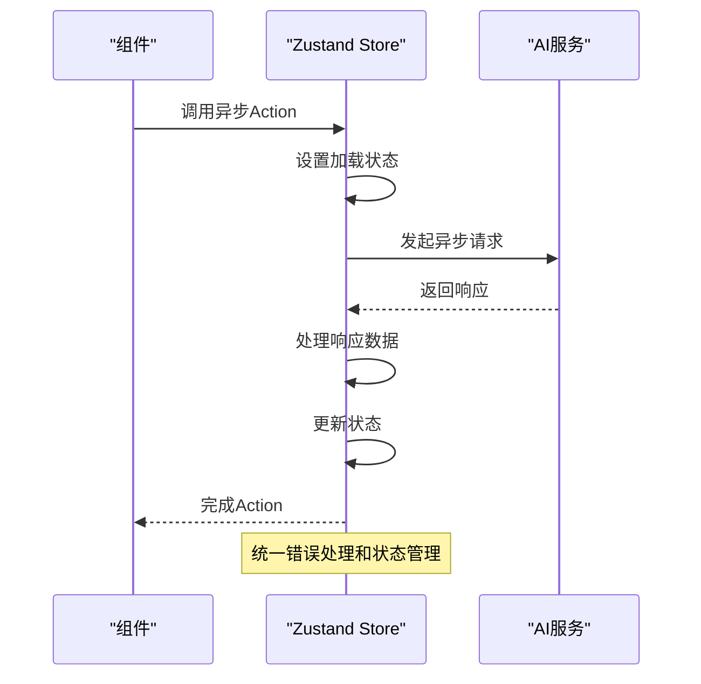

**图示来源**
- [configStore.ts](file://manga-creator/src/stores/configStore.ts#L45-L56)
- [projectStore.ts](file://manga-creator/src/stores/projectStore.ts#L24-L32)

## AI服务集成规范
项目采用工厂模式实现多AI提供商的适配，确保服务的可扩展性和可维护性。

### 工厂模式实现
`AIFactory`类通过工厂方法创建适配不同AI提供商的客户端，实现服务的解耦和动态切换。

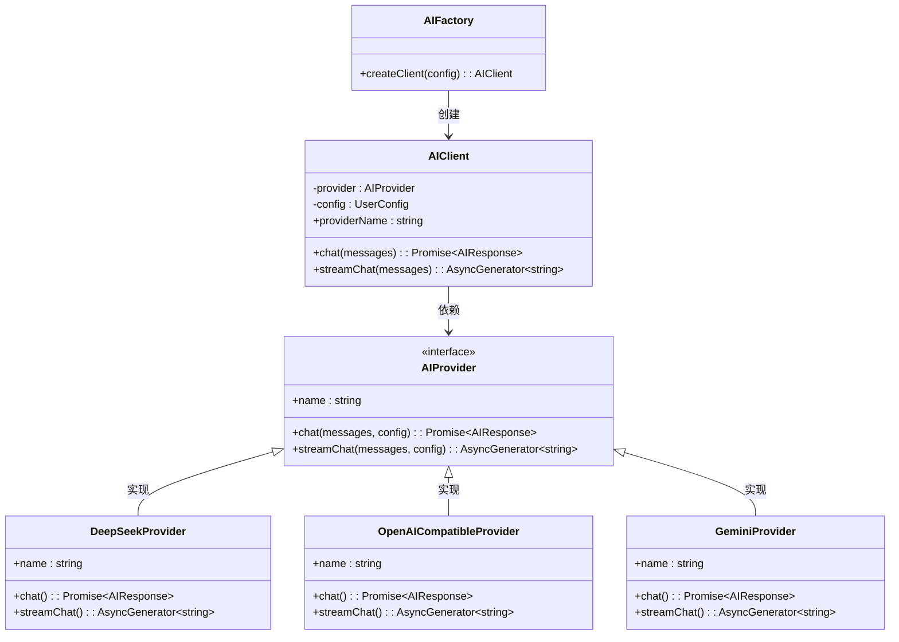

**图示来源**
- [factory.ts](file://manga-creator/src/lib/ai/factory.ts)
- [types.ts](file://manga-creator/src/lib/ai/types.ts)
- [deepseek.ts](file://manga-creator/src/lib/ai/providers/deepseek.ts)
- [openai.ts](file://manga-creator/src/lib/ai/providers/openai.ts)
- [gemini.ts](file://manga-creator/src/lib/ai/providers/gemini.ts)

### 多提供商适配
通过统一的`AIProvider`接口，不同提供商的实现可以无缝替换，新提供商的添加只需实现接口并注册到工厂中。

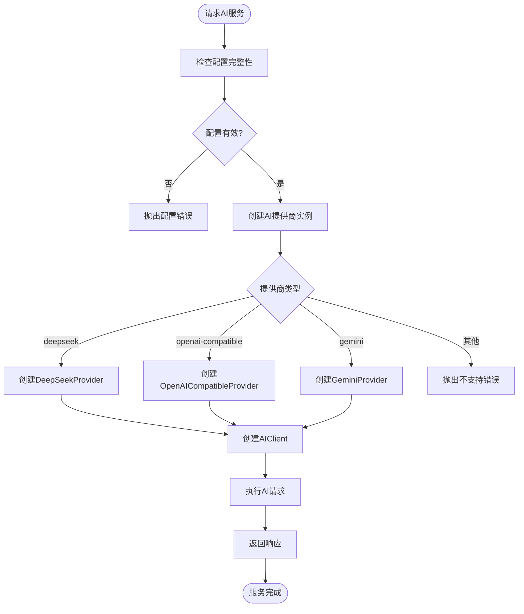

**图示来源**
- [factory.ts](file://manga-creator/src/lib/ai/factory.ts#L8-L19)

## Shadcn/ui组件封装规范
项目基于Shadcn/ui进行UI组件封装，遵循可访问性和可定制性原则。

### 组件变体定义
使用`class-variance-authority`定义组件变体，确保样式的一致性和可维护性。

```mermaid
classDiagram
class Button {
+className : string
+variant : 'default' | 'destructive' | 'outline' | 'secondary' | 'ghost' | 'link'
+size : 'default' | 'sm' | 'lg' | 'icon'
+asChild : boolean
}
class buttonVariants {
+default : "bg-primary text-primary-foreground..."
+destructive : "bg-destructive text-destructive-foreground..."
+outline : "border border-input bg-background..."
+secondary : "bg-secondary text-secondary-foreground..."
+ghost : "hover : bg-accent hover : text-accent-foreground"
+link : "text-primary underline-offset-4 hover : underline"
+defaultVariants : {variant : 'default', size : 'default'}
}
Button --> buttonVariants : 使用
buttonVariants --> cn : 合并类名
```

**图示来源**
- [button.tsx](file://manga-creator/src/components/ui/button.tsx)

### 可访问性支持
组件封装时考虑可访问性，使用`@radix-ui/react-*`组件确保键盘导航和屏幕阅读器支持。

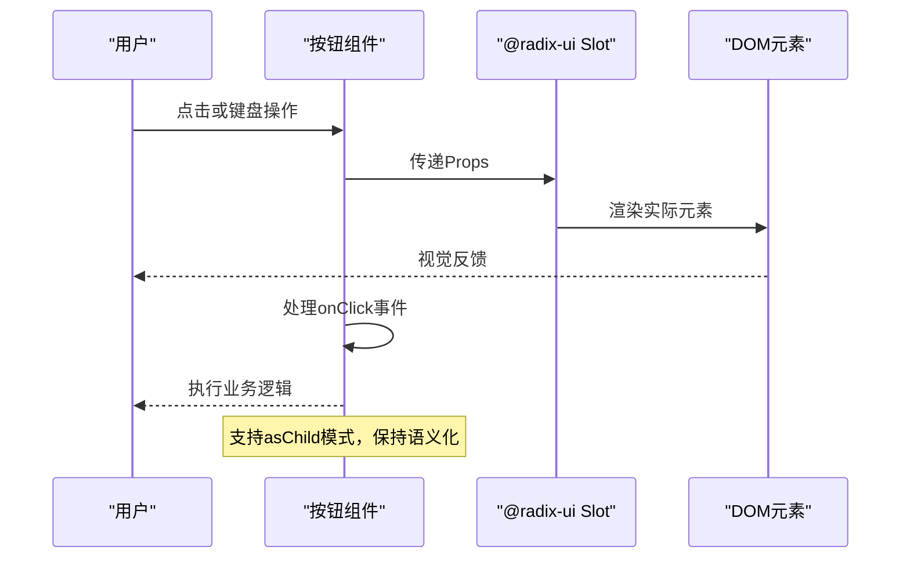

**图示来源**
- [button.tsx](file://manga-creator/src/components/ui/button.tsx#L43-L53)

## 自定义Hook开发标准
项目中的自定义Hook遵循单一职责和可复用性原则，提供清晰的API接口。

### use-toast标准
`use-toast` Hook提供统一的通知系统，支持添加、更新和关闭通知。

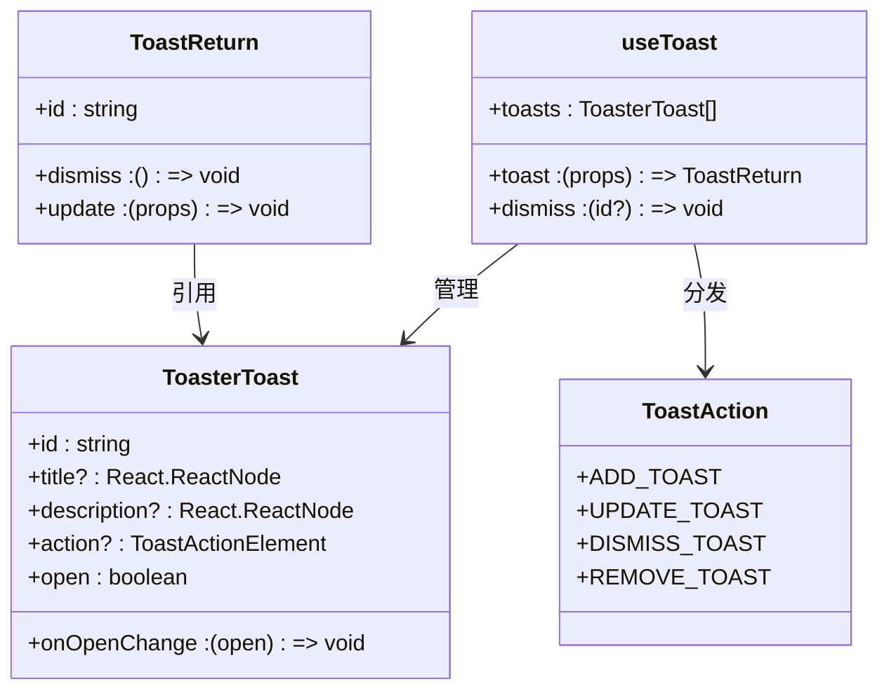

**图示来源**
- [use-toast.ts](file://manga-creator/src/hooks/use-toast.ts)

### Hook设计原则
自定义Hook应保持纯净，不包含业务逻辑，只负责状态管理和副作用处理。

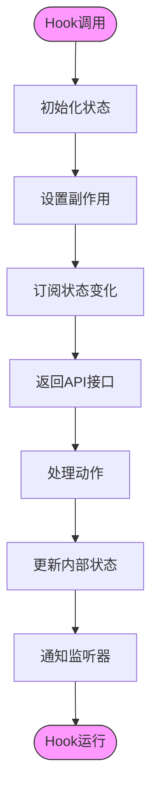

**图示来源**
- [use-toast.ts](file://manga-creator/src/hooks/use-toast.ts)

## 状态分层与持久化设计
项目采用分层状态管理策略，结合本地存储实现数据持久化。

### 状态分层架构
状态分为UI状态、业务状态和持久化状态三层，每层有明确的职责边界。

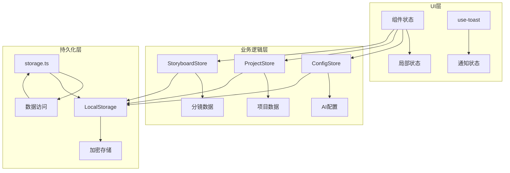

**图示来源**
- [configStore.ts](file://manga-creator/src/stores/configStore.ts)
- [storage.ts](file://manga-creator/src/lib/storage.ts)

### 持久化实现
使用加密的LocalStorage进行数据持久化，确保用户数据的安全性。

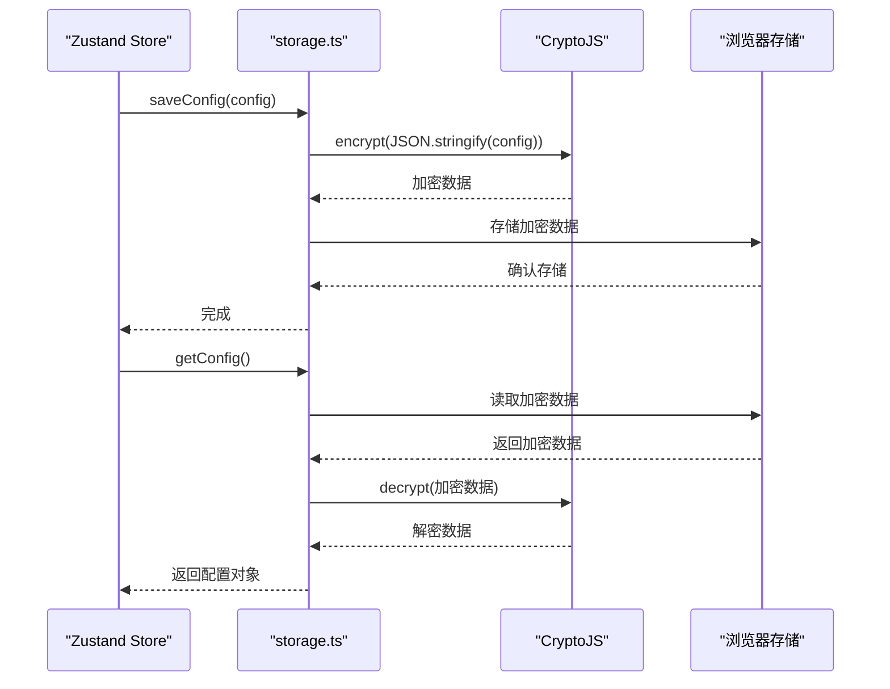

**图示来源**
- [storage.ts](file://manga-creator/src/lib/storage.ts)
- [configStore.ts](file://manga-creator/src/stores/configStore.ts)

## 错误处理与日志规范
项目采用统一的错误处理机制，确保用户体验和问题可追溯性。

### 错误处理策略
在关键操作点进行错误捕获和处理，提供用户友好的反馈。

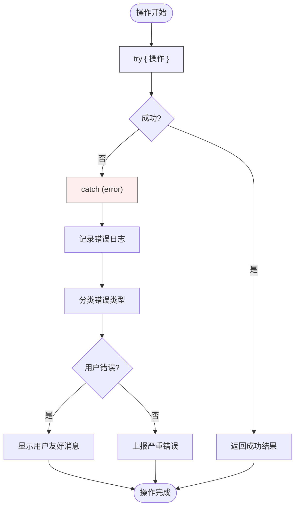

**图示来源**
- [configStore.ts](file://manga-creator/src/stores/configStore.ts#L46-L55)
- [storage.ts](file://manga-creator/src/lib/storage.ts)

### 日志记录规范
在关键路径上添加console.error日志，便于开发调试和问题定位。

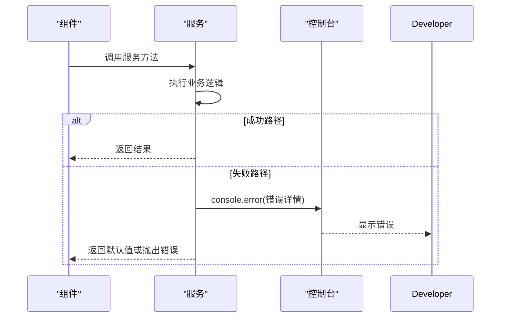

**图示来源**
- [deepseek.ts](file://manga-creator/src/lib/ai/providers/deepseek.ts#L12-L27)
- [gemini.ts](file://manga-creator/src/lib/ai/providers/gemini.ts#L41-L56)

## 测试规范
项目采用Vitest进行单元测试，确保代码质量和功能正确性。

### 测试覆盖范围
关键业务逻辑、状态管理和AI服务集成都应有相应的测试覆盖。


**图示来源**
- [store.test.ts](file://manga-creator/src/stores/store.test.ts)
- [factory.test.ts](file://manga-creator/src/lib/ai/factory.test.ts)
- [storage.test.ts](file://manga-creator/src/lib/storage.test.ts)

### 测试策略
采用测试驱动开发（TDD）原则，先写测试再实现功能。

```mermaid
flowchart LR
A[编写测试用例] --> B[运行测试(失败)]
B --> C[实现功能代码]
C --> D[运行测试]
D --> E{"通过?"}
E --> |否| C
E --> |是| F[重构代码]
F --> G[运行测试]
G --> H{"通过?"}
H --> |否| C
H --> |是| I[提交代码]
```

**图示来源**
- [package.json](file://manga-creator/package.json#L10-L11)

## 总结
本代码规范文档为AI漫画创作工具项目建立了全面的开发标准。通过TypeScript类型系统确保代码的类型安全，React函数式组件约定提升组件的可维护性，Zustand原子化store设计实现高效的状态管理，工厂模式的AI服务集成保证系统的可扩展性，Shadcn/ui组件封装规范统一UI风格，自定义Hook标准提高代码复用率。这些规范共同构成了项目的代码质量基石，为团队协作和项目长期发展提供了有力保障。