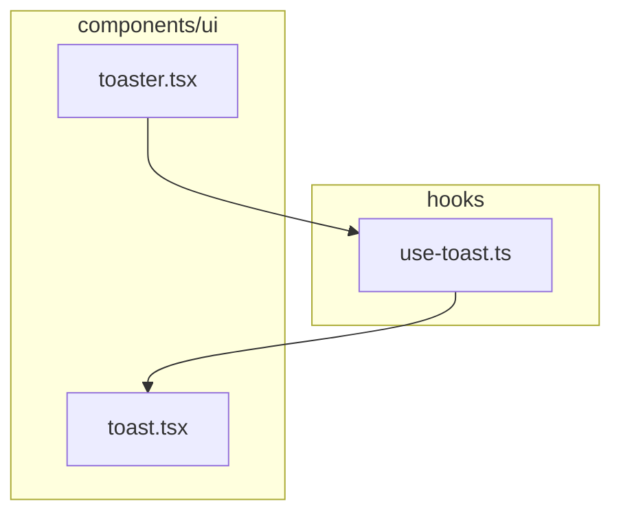
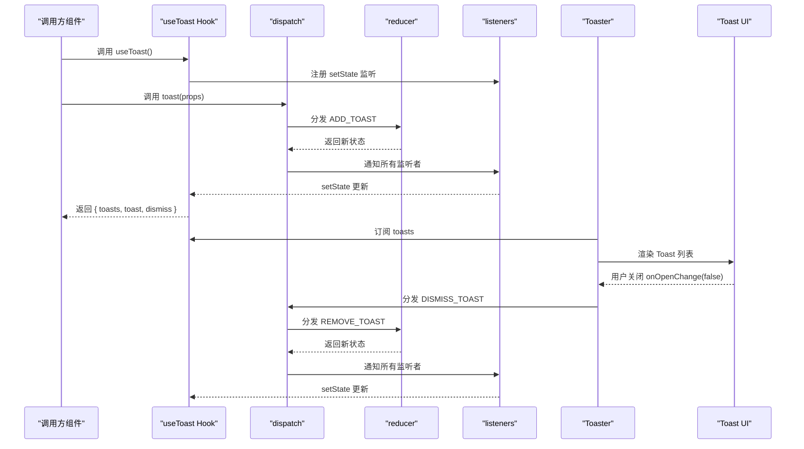
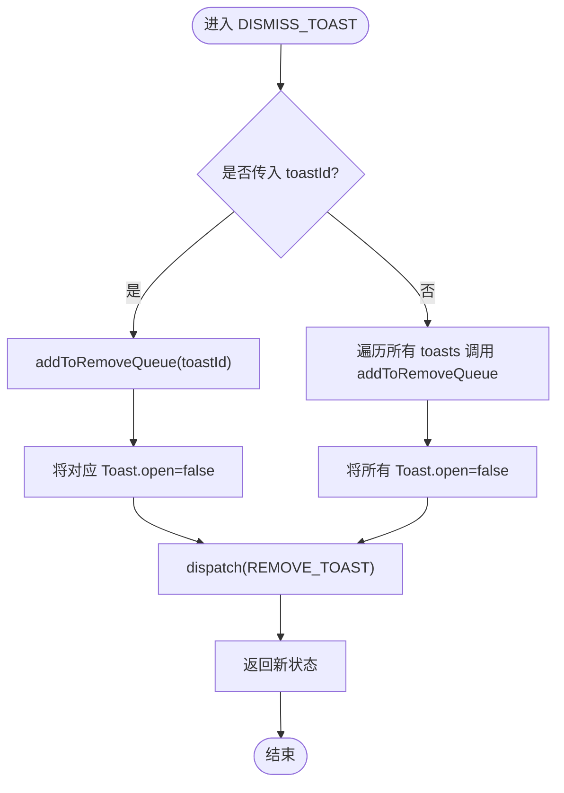
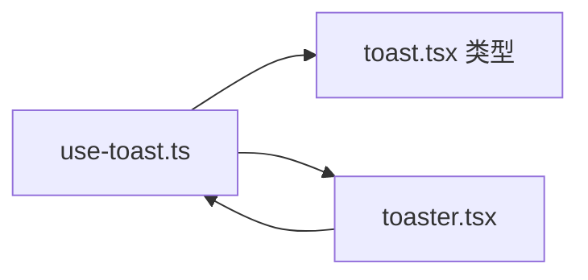

# 自定义Hook开发规范

<cite>
**本文引用的文件**
- [use-toast.ts](file://manga-creator/src/hooks/use-toast.ts)
- [use-toast.test.ts](file://manga-creator/src/hooks/use-toast.test.ts)
- [toaster.tsx](file://manga-creator/src/components/ui/toaster.tsx)
- [toast.tsx](file://manga-creator/src/components/ui/toast.tsx)
- [README.md](file://manga-creator/README.md)
</cite>

## 目录
1. [引言](#引言)
2. [项目结构](#项目结构)
3. [核心组件](#核心组件)
4. [架构总览](#架构总览)
5. [详细组件分析](#详细组件分析)
6. [依赖关系分析](#依赖关系分析)
7. [性能考量](#性能考量)
8. [故障排查指南](#故障排查指南)
9. [结论](#结论)
10. [附录：自定义Hook开发模板与测试模板](#附录自定义hook开发模板与测试模板)

## 引言
本规范围绕“use-toast.ts”的实现，总结一套可复用的自定义Hook开发标准，重点覆盖：
- 状态管理能力的设计：内部状态初始化、事件监听注册、资源清理（cleanup）
- 命名约定与调用规则：use+名词/动词、依赖数组、避免条件调用
- 返回值设计：通过useToast返回开放API（包含open/close方法），提升易用性
- 性能优化：函数缓存、减少重渲染
- 错误边界与SSR兼容性
- 单元测试模板与最佳实践

该规范既可用于现有useToast的维护与扩展，也可作为团队内其他自定义Hook的开发参考。

## 项目结构
本项目采用按功能域划分的目录组织方式，自定义Hook位于 hooks 目录，UI组件位于 components/ui 目录，业务组件通过 hooks/use-toast.ts 与 UI 组件协作。

图表来源
- [use-toast.ts](file://manga-creator/src/hooks/use-toast.ts#L1-L194)
- [toaster.tsx](file://manga-creator/src/components/ui/toaster.tsx#L1-L34)
- [toast.tsx](file://manga-creator/src/components/ui/toast.tsx#L1-L127)

章节来源
- [README.md](file://manga-creator/README.md#L94-L128)

## 核心组件
- useToast：暴露状态与操作API，负责订阅全局状态变化并在组件卸载时清理监听。
- toast：便捷创建通知的方法，返回包含id、dismiss、update的对象。
- reducer：纯函数状态机，定义ADD_TOAST、UPDATE_TOAST、DISMISS_TOAST、REMOVE_TOAST四类动作。
- Toaster：消费useToast状态并渲染Toast集合。
- Toast系列组件：基于Radix UI的Toast Provider/Root/Viewport等组合。

章节来源
- [use-toast.ts](file://manga-creator/src/hooks/use-toast.ts#L77-L194)
- [toaster.tsx](file://manga-creator/src/components/ui/toaster.tsx#L1-L34)
- [toast.tsx](file://manga-creator/src/components/ui/toast.tsx#L1-L127)

## 架构总览
useToast采用“内存状态 + 发布订阅”的模式：reducer维护全局状态，dispatch将变更广播给所有订阅者；useToast通过useEffect注册/注销监听，使组件获得实时状态；Toaster订阅useToast状态并渲染UI。

图表来源
- [use-toast.ts](file://manga-creator/src/hooks/use-toast.ts#L136-L194)
- [toaster.tsx](file://manga-creator/src/components/ui/toaster.tsx#L1-L34)

## 详细组件分析

### useToast 内部状态与生命周期
- 内部状态初始化
  - memoryState：全局内存状态，初始为空数组。
  - listeners：订阅者数组，用于广播状态变更。
- 事件监听注册
  - 在useEffect中将setState加入listeners；依赖项为[state]，确保每次状态变更都会触发组件更新。
- 资源清理（cleanup）
  - useEffect返回函数中从listeners中移除当前订阅者，防止重复注册与内存泄漏。
- 返回值设计
  - 返回当前toasts数组与toast创建函数、dismiss函数，便于在组件中直接使用。

章节来源
- [use-toast.ts](file://manga-creator/src/hooks/use-toast.ts#L132-L194)

### toast 方法与动作分发
- 生成唯一id并创建update/dismiss闭包，避免在组件中重复创建函数导致重渲染。
- 分发ADD_TOAST时设置open=true，并绑定onOpenChange回调，当用户关闭时自动分发DISMISS_TOAST。
- 返回对象包含id、dismiss、update，便于后续更新或关闭。

章节来源
- [use-toast.ts](file://manga-creator/src/hooks/use-toast.ts#L143-L172)

### reducer 状态机与副作用
- 动作类型：ADD_TOAST、UPDATE_TOAST、DISMISS_TOAST、REMOVE_TOAST。
- ADD_TOAST：将新Toast插入队首并截断至限制数量。
- UPDATE_TOAST：按id合并部分字段，保持其他属性不变。
- DISMISS_TOAST：将对应Toast的open置false；若未指定id则批量关闭；同时为每个需要移除的Toast加入延时队列。
- REMOVE_TOAST：移除指定id或清空所有Toast。

章节来源
- [use-toast.ts](file://manga-creator/src/hooks/use-toast.ts#L77-L131)

### Toaster 与 UI 组件
- Toaster通过useToast订阅toasts并逐个渲染Toast。
- Toast系列组件基于Radix UI，提供Provider、Root、Viewport、Title、Description、Close等能力。

章节来源
- [toaster.tsx](file://manga-creator/src/components/ui/toaster.tsx#L1-L34)
- [toast.tsx](file://manga-creator/src/components/ui/toast.tsx#L1-L127)

### 关键流程图：DISMISS_TOAST 与 REMOVE_TOAST

图表来源
- [use-toast.ts](file://manga-creator/src/hooks/use-toast.ts#L93-L129)

## 依赖关系分析
- useToast.ts 依赖 toast.tsx 中的类型定义（ToastProps、ToastActionElement）。
- Toaster.tsx 依赖 useToast.ts 的返回值 toasts 与 toast/dismiss。
- 依赖链路清晰，耦合点集中在状态分发与UI渲染两处。

图表来源
- [use-toast.ts](file://manga-creator/src/hooks/use-toast.ts#L6-L10)
- [toaster.tsx](file://manga-creator/src/components/ui/toaster.tsx#L1-L34)
- [toast.tsx](file://manga-creator/src/components/ui/toast.tsx#L1-L127)

章节来源
- [use-toast.ts](file://manga-creator/src/hooks/use-toast.ts#L6-L10)
- [toaster.tsx](file://manga-creator/src/components/ui/toaster.tsx#L1-L34)

## 性能考量
- 函数缓存
  - 将update/dismiss绑定在toast创建时生成，避免在组件渲染中重复创建闭包，降低重渲染概率。
- 依赖数组
  - useToast中的useEffect依赖[state]，确保监听注册与清理逻辑正确执行；注意不要遗漏依赖或过度依赖。
- 状态裁剪
  - reducer在ADD_TOAST时对toasts进行截断，控制最大数量，避免无限增长。
- 延时移除
  - 使用Map记录每个Toast的定时器，在延时结束后再移除，避免频繁重渲染。
- SSR兼容性
  - 文件顶部声明"use client"，确保在客户端运行；若需服务端渲染，应避免在服务端直接调用useToast或toast，或在服务端环境做保护判断。

章节来源
- [use-toast.ts](file://manga-creator/src/hooks/use-toast.ts#L143-L172)
- [use-toast.ts](file://manga-creator/src/hooks/use-toast.ts#L174-L194)

## 故障排查指南
- 问题：toast无法关闭
  - 检查Toast的onOpenChange回调是否被触发；确认DISMISS_TOAST是否被分发。
- 问题：多个toast同时存在
  - 检查TOAST_LIMIT是否被正确应用；确认ADD_TOAST是否正确截断。
- 问题：组件卸载后仍收到状态更新
  - 检查useEffect返回的cleanup是否执行；确保listeners中已移除对应订阅者。
- 问题：SSR报错
  - 确认文件头部有"use client"；在服务端环境避免直接调用useToast或toast。

章节来源
- [use-toast.ts](file://manga-creator/src/hooks/use-toast.ts#L174-L194)
- [use-toast.ts](file://manga-creator/src/hooks/use-toast.ts#L77-L131)

## 结论
use-toast.ts展示了自定义Hook在状态管理、事件分发与UI渲染之间的清晰职责划分。通过内存状态+发布订阅模型、严格的依赖数组与cleanup、以及明确的返回值设计，实现了高可用、低耦合、易扩展的通知系统。遵循本文规范，可在保证性能与可维护性的前提下，快速开发同类自定义Hook。

## 附录：自定义Hook开发模板与测试模板

### 自定义Hook开发模板（基于useToast的实践）
- 命名约定
  - 使用use+名词/动词，例如useToast、useCounter、useApi。
- 内部状态初始化
  - 定义memoryState与listeners，确保首次渲染即有稳定初始值。
- 事件监听注册
  - 在useEffect中注册监听；依赖数组包含影响订阅的变量。
- 资源清理（cleanup）
  - 返回函数中移除监听，避免重复注册与内存泄漏。
- 返回值设计
  - 返回状态与操作函数（如open/close、update、dismiss），保持API简洁一致。
- 性能优化
  - 对外暴露的函数尽量在创建时绑定，避免在渲染中重复创建。
- 错误边界与SSR
  - 在客户端文件中使用"use client"；在服务端环境做保护判断或避免直接调用。

### 单元测试模板（基于use-toast.test.ts）
- 测试目标
  - 验证reducer在ADD_TOAST、UPDATE_TOAST、DISMISS_TOAST、REMOVE_TOAST下的行为。
  - 验证状态不可变性与边界情况。
- 推荐测试点
  - 新增toast：检查id、顺序、截断。
  - 更新toast：检查部分字段合并与未更新字段保留。
  - 关闭toast：单个关闭与批量关闭。
  - 移除toast：指定id移除与清空。
  - 边界情况：空数组、带所有属性的toast、destructive变体。
  - 不可变性：原始状态不应被修改。

章节来源
- [use-toast.test.ts](file://manga-creator/src/hooks/use-toast.test.ts#L1-L281)