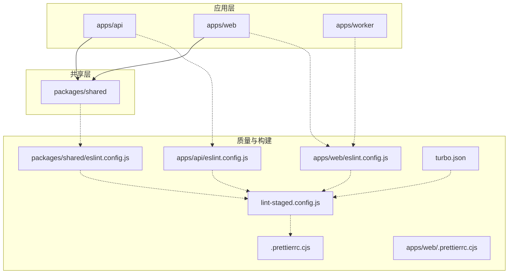
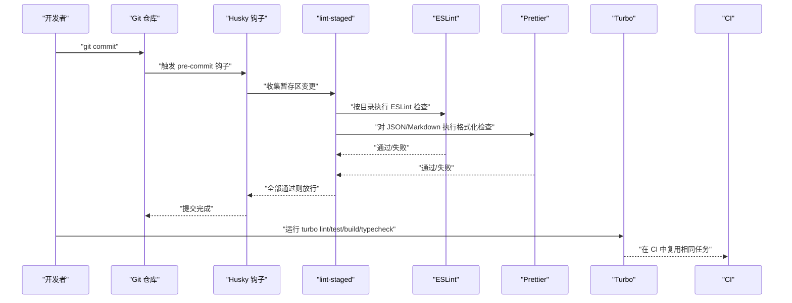
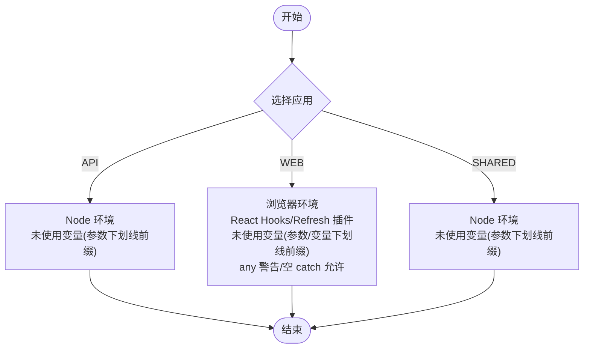
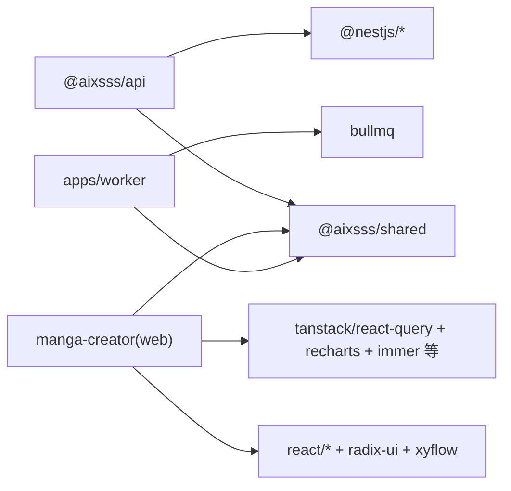

# 开发指南

<cite>
**本文引用的文件**
- [apps/api/eslint.config.js](file://apps/api/eslint.config.js)
- [apps/web/eslint.config.js](file://apps/web/eslint.config.js)
- [packages/shared/eslint.config.js](file://packages/shared/eslint.config.js)
- [.prettierrc.cjs](file://.prettierrc.cjs)
- [apps/web/.prettierrc.cjs](file://apps/web/.prettierrc.cjs)
- [lint-staged.config.js](file://lint-staged.config.js)
- [turbo.json](file://turbo.json)
- [package.json](file://package.json)
- [apps/api/tsconfig.json](file://apps/api/tsconfig.json)
- [apps/web/tsconfig.json](file://apps/web/tsconfig.json)
- [packages/shared/tsconfig.json](file://packages/shared/tsconfig.json)
- [apps/api/package.json](file://apps/api/package.json)
- [apps/web/package.json](file://apps/web/package.json)
- [apps/api/vitest.config.ts](file://apps/api/vitest.config.ts)
- [apps/web/vitest.config.ts](file://apps/web/vitest.config.ts)
- [packages/shared/vitest.config.ts](file://packages/shared/vitest.config.ts)
</cite>

## 目录

1. 引言
2. 项目结构
3. 核心组件
4. 架构总览
5. 详细组件分析
6. 依赖关系分析
7. 性能考虑
8. 故障排查指南
9. 结论
10. 附录

## 引言

本开发指南面向 AIXSSS 多包工作区（monorepo）的前端、后端与共享包团队，系统性阐述代码规范、ESLint 配置与代码格式化标准；TypeScript 编码规范、命名约定与注释标准；Git 工作流与分支策略；代码审查流程、质量检查与持续集成要求；开发工具配置、IDE 设置与调试技巧；新功能开发流程、重构指导与性能优化原则；以及贡献指南、问题报告与功能请求流程，并提供常见问题的解决方案与最佳实践建议。

## 项目结构

AIXSSS 采用 pnpm workspace + Turbo 管道的多应用架构，包含以下主要模块：

- 应用层
  - apps/api：基于 NestJS 的后端服务
  - apps/web：基于 Vite + React 的前端应用
  - apps/worker：基于 BullMQ 的异步任务处理 Worker
  - packages/shared：跨应用共享的 TypeScript 类型与工具
- 质量与构建
  - ESLint 配置分层管理，分别覆盖各应用与共享包
  - Prettier 统一格式化风格
  - Husky + lint-staged 在提交前执行静态检查与格式化
  - Turbo 管理跨包构建、测试、类型检查与格式化流水线

图表来源

- [apps/api/eslint.config.js](file://apps/api/eslint.config.js#L1-L21)
- [apps/web/eslint.config.js](file://apps/web/eslint.config.js#L1-L34)
- [packages/shared/eslint.config.js](file://packages/shared/eslint.config.js#L1-L22)
- [.prettierrc.cjs](file://.prettierrc.cjs#L1-L11)
- [apps/web/.prettierrc.cjs](file://apps/web/.prettierrc.cjs#L1-L10)
- [lint-staged.config.js](file://lint-staged.config.js#L1-L35)
- [turbo.json](file://turbo.json#L1-L30)

章节来源

- [package.json](file://package.json#L1-L24)
- [turbo.json](file://turbo.json#L1-L30)

## 核心组件

本节聚焦于开发过程中的核心质量与工具链组件，包括 ESLint 配置、Prettier 规则、lint-staged 提交前钩子、Turbo 任务编排，以及各应用的 TypeScript 配置与测试配置。

- ESLint 配置
  - apps/api：启用推荐规则集，针对 Node 环境，对未使用变量进行警告（支持下划线前缀忽略）
  - apps/web：启用推荐规则集与 React Hooks、React Refresh 插件，针对浏览器环境，放宽部分规则为警告，允许空 catch 块
  - packages/shared：针对 Node 环境，允许部分场景下的未使用参数（下划线前缀）
- Prettier 规则：统一分号、单引号、尾随逗号、行长、制表符宽度与箭头函数括号策略
- lint-staged：按目录匹配执行 ESLint 与 Prettier 检查，过滤特定路径
- Turbo：定义 dev/build/typecheck/lint/test/format/format:check 等任务的依赖与缓存策略
- TypeScript 配置：严格模式、装饰器元数据、NodeNext 模块解析、声明输出等
- Vitest 配置：测试环境、覆盖率阈值、别名与超时设置

章节来源

- [apps/api/eslint.config.js](file://apps/api/eslint.config.js#L1-L21)
- [apps/web/eslint.config.js](file://apps/web/eslint.config.js#L1-L34)
- [packages/shared/eslint.config.js](file://packages/shared/eslint.config.js#L1-L22)
- [.prettierrc.cjs](file://.prettierrc.cjs#L1-L11)
- [apps/web/.prettierrc.cjs](file://apps/web/.prettierrc.cjs#L1-L10)
- [lint-staged.config.js](file://lint-staged.config.js#L1-L35)
- [turbo.json](file://turbo.json#L1-L30)
- [apps/api/tsconfig.json](file://apps/api/tsconfig.json#L1-L21)
- [apps/web/tsconfig.json](file://apps/web/tsconfig.json#L1-L11)
- [packages/shared/tsconfig.json](file://packages/shared/tsconfig.json#L1-L19)
- [apps/api/vitest.config.ts](file://apps/api/vitest.config.ts#L1-L12)
- [apps/web/vitest.config.ts](file://apps/web/vitest.config.ts#L1-L47)
- [packages/shared/vitest.config.ts](file://packages/shared/vitest.config.ts#L1-L12)

## 架构总览

下图展示从本地开发到提交校验再到 CI 的整体流程，强调质量门禁与任务编排：

图表来源

- [lint-staged.config.js](file://lint-staged.config.js#L1-L35)
- [turbo.json](file://turbo.json#L1-L30)
- [package.json](file://package.json#L1-L24)

## 详细组件分析

### ESLint 配置分析

- apps/api
  - 语言环境：Node
  - 关键规则：未使用变量（忽略下划线前缀）
  - 文件范围：所有 ts/tsx
- apps/web
  - 语言环境：浏览器
  - 插件：React Hooks、React Refresh
  - 关键规则：未使用变量（参数与变量均支持下划线前缀）、any 使用警告、空 catch 块允许、刷新规则警告
  - 文件范围：所有 ts/tsx
- packages/shared
  - 语言环境：Node
  - 关键规则：未使用变量（参数下划线前缀）

图表来源

- [apps/api/eslint.config.js](file://apps/api/eslint.config.js#L1-L21)
- [apps/web/eslint.config.js](file://apps/web/eslint.config.js#L1-L34)
- [packages/shared/eslint.config.js](file://packages/shared/eslint.config.js#L1-L22)

章节来源

- [apps/api/eslint.config.js](file://apps/api/eslint.config.js#L1-L21)
- [apps/web/eslint.config.js](file://apps/web/eslint.config.js#L1-L34)
- [packages/shared/eslint.config.js](file://packages/shared/eslint.config.js#L1-L22)

### Prettier 格式化标准

- 统一风格：分号、单引号、尾随逗号、行长、制表符宽度、箭头函数括号
- 作用范围：根目录与 web 应用各自配置，确保跨包一致性
- 与 lint-staged 协同：对 JSON/Markdown 进行格式化检查

章节来源

- [.prettierrc.cjs](file://.prettierrc.cjs#L1-L11)
- [apps/web/.prettierrc.cjs](file://apps/web/.prettierrc.cjs#L1-L10)
- [lint-staged.config.js](file://lint-staged.config.js#L27-L33)

### lint-staged 提交前检查

- 按目录匹配执行 ESLint 与 Prettier
- 过滤 traefik 相关路径
- 通过 npx 调用对应配置文件，保证规则一致性

章节来源

- [lint-staged.config.js](file://lint-staged.config.js#L1-L35)

### Turbo 任务编排

- 任务定义：dev/build/typecheck/lint/test/format/format:check
- 依赖关系：build 依赖上游包；test 依赖 build 与上游 test；lint 依赖上游 lint
- 缓存与持久化：dev 任务持久化，避免重复启动成本
- 与根脚本联动：统一入口脚本调用 turbo 任务

章节来源

- [turbo.json](file://turbo.json#L1-L30)
- [package.json](file://package.json#L1-L24)

### TypeScript 配置与测试配置

- apps/api：严格模式、装饰器元数据、NodeNext 解析、声明输出
- apps/web：复合 tsconfig，路径别名 @ 指向 src
- packages/shared：严格模式、声明与映射输出
- Vitest 配置：web 应用设置 jsdom 环境、覆盖率阈值、超时与别名；api 与 shared 使用 Node 环境

章节来源

- [apps/api/tsconfig.json](file://apps/api/tsconfig.json#L1-L21)
- [apps/web/tsconfig.json](file://apps/web/tsconfig.json#L1-L11)
- [packages/shared/tsconfig.json](file://packages/shared/tsconfig.json#L1-L19)
- [apps/api/vitest.config.ts](file://apps/api/vitest.config.ts#L1-L12)
- [apps/web/vitest.config.ts](file://apps/web/vitest.config.ts#L1-L47)
- [packages/shared/vitest.config.ts](file://packages/shared/vitest.config.ts#L1-L12)

## 依赖关系分析

- 包依赖
  - apps/api 依赖 @aixsss/shared 与 NestJS 生态
  - apps/web 依赖 @aixsss/shared 与大量 UI/状态/可视化库
  - apps/worker 依赖共享 Provider 与任务实现
- 质量工具依赖
  - ESLint + TypeScript ESLint + 插件
  - Prettier
  - Husky + lint-staged
  - Turbo

图表来源

- [apps/api/package.json](file://apps/api/package.json#L1-L52)
- [apps/web/package.json](file://apps/web/package.json#L1-L95)

章节来源

- [apps/api/package.json](file://apps/api/package.json#L1-L52)
- [apps/web/package.json](file://apps/web/package.json#L1-L95)

## 性能考虑

- 构建与缓存
  - Turbo 任务依赖链减少不必要的重跑
  - dev 任务持久化，降低冷启动成本
- 测试与覆盖率
  - Vitest 并发测试时提高超时阈值，避免误报
  - 覆盖率阈值作为“防回退”门槛，逐步提升
- 代码体积与分析
  - Vite 支持可视化分析，便于定位大体积依赖

章节来源

- [turbo.json](file://turbo.json#L1-L30)
- [apps/web/vitest.config.ts](file://apps/web/vitest.config.ts#L18-L21)
- [apps/web/package.json](file://apps/web/package.json#L15-L15)

## 故障排查指南

- 提交被拒绝
  - 检查 lint-staged 是否正确匹配目录与规则
  - 查看 ESLint 输出与 Prettier 格式化差异
- 本地与 CI 行为不一致
  - 确认使用相同版本的 Node 与 pnpm
  - 使用 turbo 调试任务依赖链
- 测试不稳定
  - 提高 Vitest 超时阈值或拆分易抖动用例
  - 检查覆盖率阈值是否过于严格
- TypeScript 报错
  - 对照各应用 tsconfig 的 strict 选项与模块解析
  - 确保共享包声明输出与消费方路径别名一致

章节来源

- [lint-staged.config.js](file://lint-staged.config.js#L1-L35)
- [turbo.json](file://turbo.json#L1-L30)
- [apps/web/vitest.config.ts](file://apps/web/vitest.config.ts#L18-L21)
- [apps/api/tsconfig.json](file://apps/api/tsconfig.json#L10-L16)
- [apps/web/tsconfig.json](file://apps/web/tsconfig.json#L4-L9)
- [packages/shared/tsconfig.json](file://packages/shared/tsconfig.json#L8-L14)

## 结论

本指南提供了 AIXSSS 项目的完整开发与质量保障体系：从 ESLint/Prettier 规则到 lint-staged 提交前检查，从 Turbo 任务编排到 Vitest 测试与覆盖率策略，再到 TypeScript 配置与 IDE 设置建议。遵循本文档可显著提升代码一致性、可维护性与交付效率。

## 附录

### 代码规范与注释标准

- 命名约定
  - 变量与函数：小驼峰
  - 类与接口：大驼峰
  - 常量：大写下划线
  - 文件：帕斯卡命名（如控制器、服务类文件）
- 注释标准
  - 公共 API/方法需提供简要说明与参数/返回值说明
  - 复杂逻辑需补充背景与边界条件说明
  - TODO/NOTE 使用清晰标签与上下文链接

### Git 工作流程与分支策略

- 分支模型
  - main：稳定发布基线
  - develop：日常开发分支
  - feature/<name>：功能开发
  - hotfix/<name>：紧急修复
- 提交规范
  - 类型：feat/fix/docs/style/refactor/perf/test/build/ci/chore
  - 格式：type(scope): subject
  - 说明：简明扼要，必要时引用 Issue

### 代码审查流程

- 提交前自检：格式化、ESLint、类型检查、基础测试
- PR 要求：最小可读单元、变更说明、风险提示、测试覆盖
- 审查要点：可读性、复杂度、性能影响、安全性、可维护性

### 质量检查与持续集成

- 本地：turbo lint/test/build/typecheck/format
- CI：复用本地相同任务，确保缓存命中与依赖顺序正确

### 开发工具配置与调试技巧

- IDE 推荐
  - VS Code：启用 ESLint、Prettier、TypeScript 自动补全
  - 路径别名：确保 tsconfig 与 IDE 同步
- 调试
  - API：使用 NestJS 开发模式与断点
  - Web：Vite DevServer + React DevTools
  - Worker：BullMQ Dashboard 或日志追踪

### 新功能开发流程

- 需求评审 → 设计文档 → 分支开发 → 本地自检 → 提交 PR → 代码审查 → 合并

### 重构指导

- 小步快跑，先加测试再改
- 保持对外 API 稳定，逐步替换内部实现
- 控制圈复杂度，拆分职责单一模块

### 性能优化原则

- 减少不必要的渲染与订阅
- 合理使用缓存与懒加载
- 控制第三方库体积，按需引入
- 利用 Turbo 缓存与增量构建

### 贡献指南、问题报告与功能请求

- 贡献流程：Fork → 分支 → 提交 → PR → 审查 → 合并
- 问题报告：提供环境信息、复现步骤、期望与实际结果
- 功能请求：描述背景、收益、可行性与替代方案
