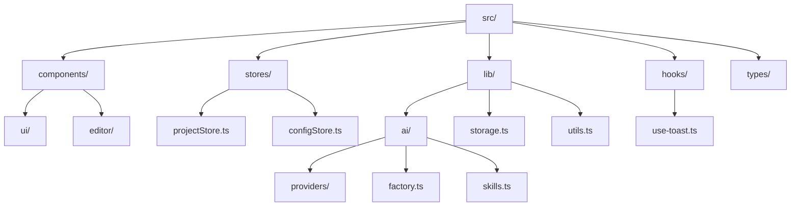
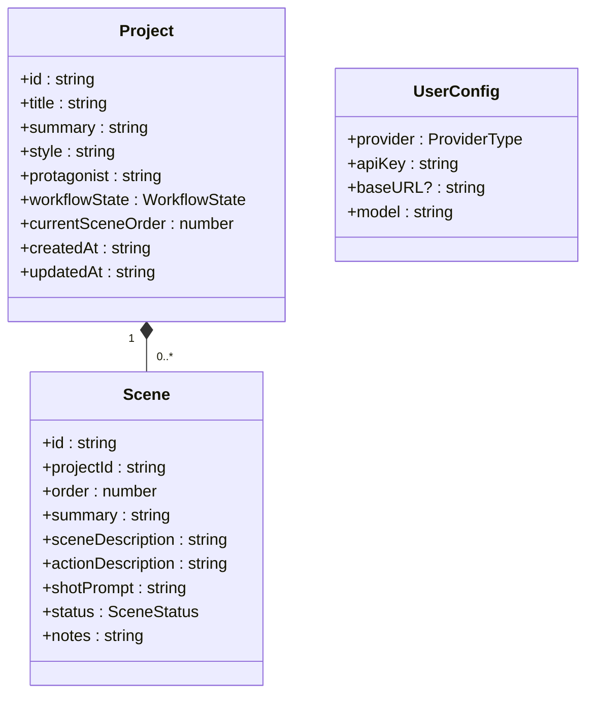
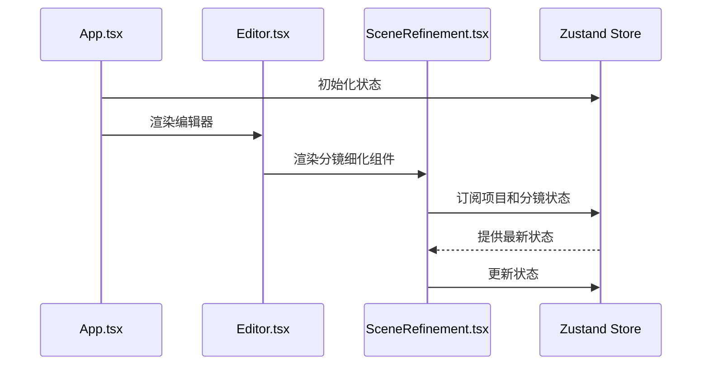
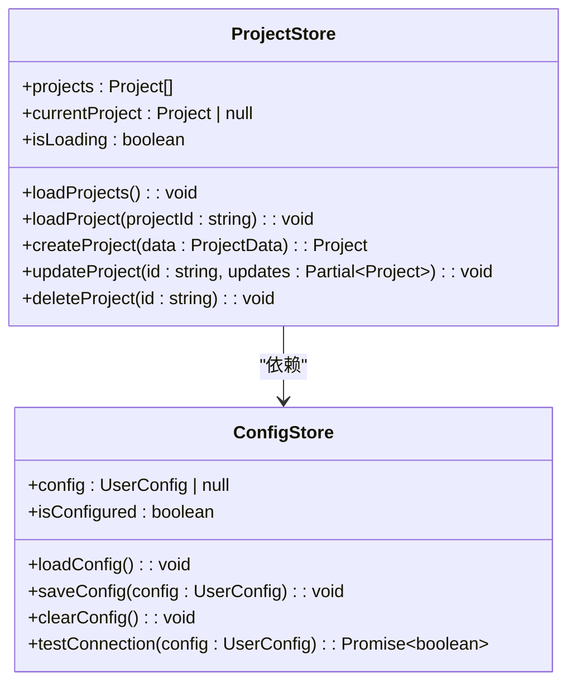
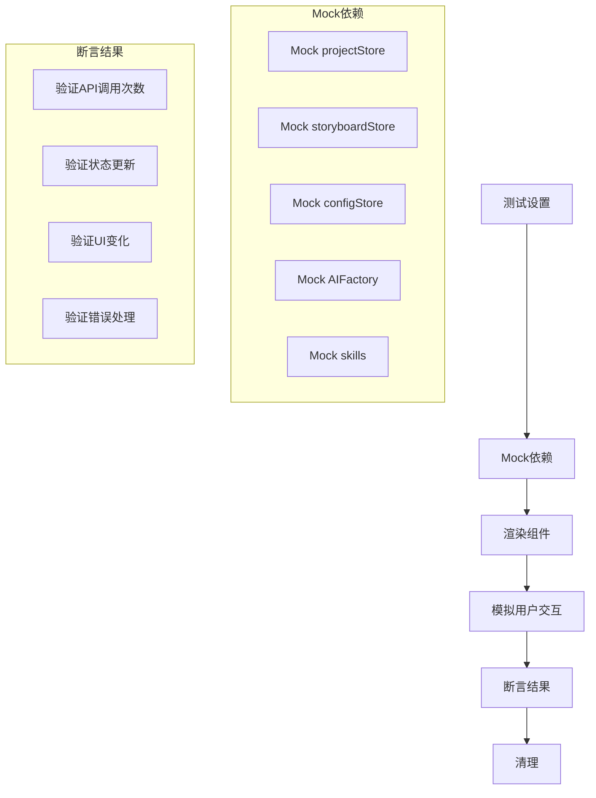
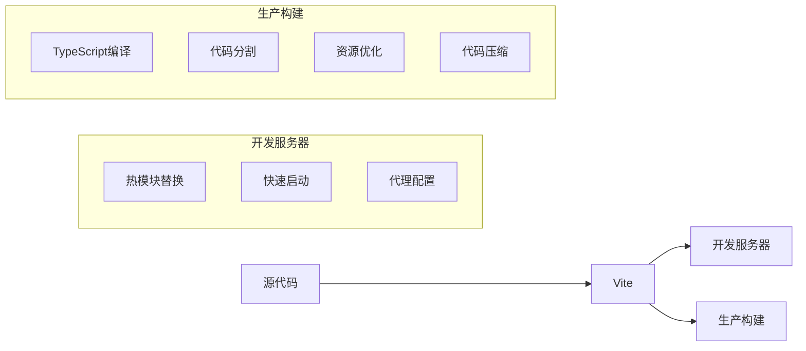

# 开发指南

<cite>
**本文档引用的文件**
- [manga-creator/package.json](file://manga-creator/package.json)
- [manga-creator/vite.config.ts](file://manga-creator/vite.config.ts)
- [manga-creator/tailwind.config.js](file://manga-creator/tailwind.config.js)
- [manga-creator/eslint.config.js](file://manga-creator/eslint.config.js)
- [manga-creator/src/main.tsx](file://manga-creator/src/main.tsx)
- [manga-creator/src/App.tsx](file://manga-creator/src/App.tsx)
- [manga-creator/src/stores/projectStore.ts](file://manga-creator/src/stores/projectStore.ts)
- [manga-creator/src/stores/configStore.ts](file://manga-creator/src/stores/configStore.ts)
- [manga-creator/src/hooks/use-toast.ts](file://manga-creator/src/hooks/use-toast.ts)
- [manga-creator/src/lib/ai/factory.ts](file://manga-creator/src/lib/ai/factory.ts)
- [manga-creator/src/lib/ai/skills.ts](file://manga-creator/src/lib/ai/skills.ts)
- [manga-creator/src/components/editor/SceneRefinement.tsx](file://manga-creator/src/components/editor/SceneRefinement.tsx)
- [manga-creator/src/types/index.ts](file://manga-creator/src/types/index.ts)
- [manga-creator/src/lib/storage.ts](file://manga-creator/src/lib/storage.ts)
- [manga-creator/src/components/editor/SceneRefinement.test.tsx](file://manga-creator/src/components/editor/SceneRefinement.test.tsx)
- [manga-creator/src/hooks/use-toast.test.ts](file://manga-creator/src/hooks/use-toast.test.ts)
</cite>

## 目录
1. [项目结构](#项目结构)
2. [代码规范](#代码规范)
3. [测试策略](#测试策略)
4. [构建与工具](#构建与工具)
5. [自定义Hook开发](#自定义hook开发)

## 项目结构

本项目采用模块化目录结构，各目录职责明确，便于维护和扩展。

**Diagram sources**
- [manga-creator/package.json](file://manga-creator/package.json)
- [manga-creator/src/main.tsx](file://manga-creator/src/main.tsx)

**项目结构说明**

- **src/**: 项目源代码根目录
  - **components/**: 存放所有UI组件，包括通用UI组件和业务组件
  - **stores/**: Zustand状态管理存储，管理项目、配置等全局状态
  - **lib/**: 核心库和工具函数，包含AI服务集成、本地存储等
  - **hooks/**: 自定义React Hook，提供可复用的逻辑
  - **types/**: TypeScript类型定义，确保类型安全
  - **tests/**: 测试文件，包含测试配置和工具

**Section sources**
- [manga-creator/package.json](file://manga-creator/package.json)
- [manga-creator/src/main.tsx](file://manga-creator/src/main.tsx)

## 代码规范

### TypeScript类型使用

项目采用TypeScript进行类型安全开发，所有类型定义位于`src/types/index.ts`。关键类型包括：

- `Project`: 项目实体，包含项目基本信息和工作流状态
- `Scene`: 分镜实体，描述分镜的详细信息
- `UserConfig`: 用户AI配置，包含API密钥和模型信息
- `WorkflowState`: 工作流状态枚举，定义项目生命周期

类型使用遵循以下规范：
1. 所有组件props必须有明确的类型定义
2. API响应和数据结构必须使用接口定义
3. 枚举类型用于状态和选项，避免魔法字符串

**Diagram sources**
- [manga-creator/src/types/index.ts](file://manga-creator/src/types/index.ts)

### React组件编写约定

React组件遵循以下约定：

1. **函数组件**: 所有组件使用函数组件和Hooks
2. **命名规范**: 组件文件名和组件名保持一致，使用PascalCase
3. **Props解构**: 在函数参数中解构props，提高可读性
4. **状态管理**: 使用Zustand进行全局状态管理，避免prop drilling

**Diagram sources**
- [manga-creator/src/App.tsx](file://manga-creator/src/App.tsx)
- [manga-creator/src/components/editor/SceneRefinement.tsx](file://manga-creator/src/components/editor/SceneRefinement.tsx)

### Zustand Store设计模式

Zustand存储采用创建模式，每个store负责特定领域的状态管理：

- `projectStore`: 管理项目列表和当前项目
- `configStore`: 管理AI配置和连接状态
- `storyboardStore`: 管理分镜数据和编辑状态

Store设计遵循以下原则：
1. **单一职责**: 每个store只管理特定领域的状态
2. **操作方法**: 提供清晰的API方法来更新状态
3. **副作用处理**: 在store中处理异步操作和副作用

**Diagram sources**
- [manga-creator/src/stores/projectStore.ts](file://manga-creator/src/stores/projectStore.ts)
- [manga-creator/src/stores/configStore.ts](file://manga-creator/src/stores/configStore.ts)

### AI服务集成规范

AI服务集成采用工厂模式，通过`AIFactory`创建AI客户端，支持多种AI提供商：

**Diagram sources**
- [manga-creator/src/lib/ai/factory.ts](file://manga-creator/src/lib/ai/factory.ts)
- [manga-creator/src/lib/ai/skills.ts](file://manga-creator/src/lib/ai/skills.ts)

AI服务集成的关键规范：
1. **工厂模式**: `AIFactory`根据配置创建相应的AI客户端
2. **适配器模式**: 每个AI提供商实现统一的`AIProvider`接口
3. **技能系统**: 通过`SkillRegistry`管理不同的AI任务技能
4. **错误处理**: 统一的错误处理机制，确保服务调用的可靠性

**Section sources**
- [manga-creator/src/lib/ai/factory.ts](file://manga-creator/src/lib/ai/factory.ts)
- [manga-creator/src/lib/ai/skills.ts](file://manga-creator/src/lib/ai/skills.ts)

## 测试策略

### 单元测试

单元测试使用Vitest框架，测试文件与源文件同目录存放，文件名以`.test.ts`或`.test.tsx`结尾。

**SceneRefinement组件测试**

`SceneRefinement.test.tsx`展示了完整的单元测试实践：

**Diagram sources**
- [manga-creator/src/components/editor/SceneRefinement.test.tsx](file://manga-creator/src/components/editor/SceneRefinement.test.tsx)

单元测试关键实践：
1. **依赖隔离**: 使用`vi.mock()`隔离外部依赖
2. **状态模拟**: 模拟store状态和更新函数
3. **异步处理**: 使用`waitFor`和`act`处理异步操作
4. **边界情况**: 测试重复点击、错误处理等边界情况

### 集成测试

集成测试确保多个组件协同工作正常。测试重点包括：

1. **状态流**: 验证状态在组件间的正确传递
2. **副作用**: 验证异步操作和副作用的正确执行
3. **用户流程**: 验证完整的用户交互流程

**Section sources**
- [manga-creator/src/components/editor/SceneRefinement.test.tsx](file://manga-creator/src/components/editor/SceneRefinement.test.tsx)
- [manga-creator/src/hooks/use-toast.test.ts](file://manga-creator/src/hooks/use-toast.test.ts)

## 构建与工具

### 构建工具（Vite）

项目使用Vite作为构建工具，配置文件为`vite.config.ts`。

**Diagram sources**
- [manga-creator/vite.config.ts](file://manga-creator/vite.config.ts)

Vite配置关键特性：
1. **别名配置**: `@`指向`src/`目录，简化导入路径
2. **测试配置**: 配置Vitest的测试环境和覆盖率报告
3. **开发服务器**: 配置host和端口，支持外部访问

### 样式框架（Tailwind CSS）

项目使用Tailwind CSS进行样式开发，配置文件为`tailwind.config.js`。

样式开发遵循以下规范：
1. **原子化CSS**: 使用Tailwind的原子类进行样式编写
2. **主题定制**: 在配置中定义颜色、半径等设计系统
3. **响应式设计**: 使用Tailwind的响应式前缀实现响应式布局

### 代码质量工具（ESLint）

ESLint配置确保代码质量和一致性，主要规则包括：
1. **TypeScript推荐规则**: 遵循TypeScript的最佳实践
2. **React Hooks规则**: 确保Hooks的正确使用
3. **代码风格**: 统一的代码格式和风格

**Section sources**
- [manga-creator/vite.config.ts](file://manga-creator/vite.config.ts)
- [manga-creator/tailwind.config.js](file://manga-creator/tailwind.config.js)
- [manga-creator/eslint.config.js](file://manga-creator/eslint.config.js)

## 自定义Hook开发

### use-toast开发指导

`use-toast.ts`展示了自定义Hook的高级开发模式，采用Redux风格的状态管理。

**Diagram sources**
- [manga-creator/src/hooks/use-toast.ts](file://manga-creator/src/hooks/use-toast.ts)

自定义Hook开发最佳实践：
1. **状态封装**: 将复杂的状态逻辑封装在Hook中
2. **内存安全**: 正确处理组件卸载时的清理工作
3. **性能优化**: 使用`useCallback`和`useMemo`避免不必要的重新渲染
4. **类型安全**: 提供完整的TypeScript类型定义

**Section sources**
- [manga-creator/src/hooks/use-toast.ts](file://manga-creator/src/hooks/use-toast.ts)