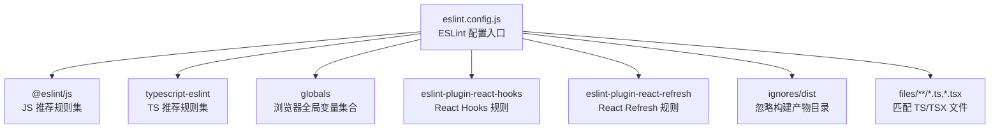
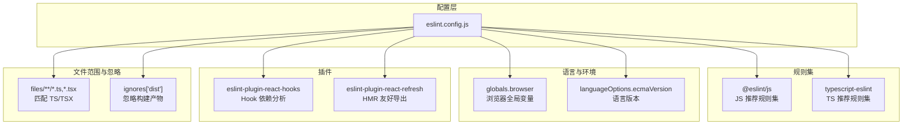
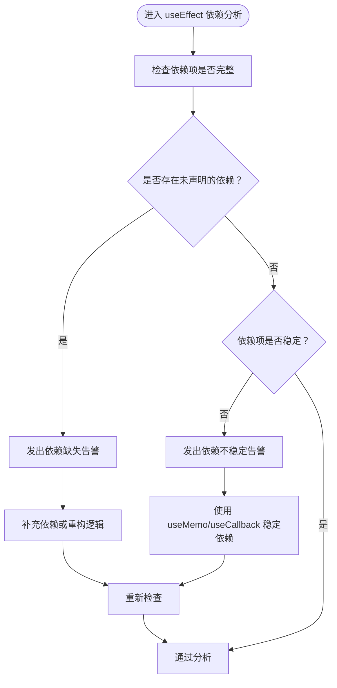
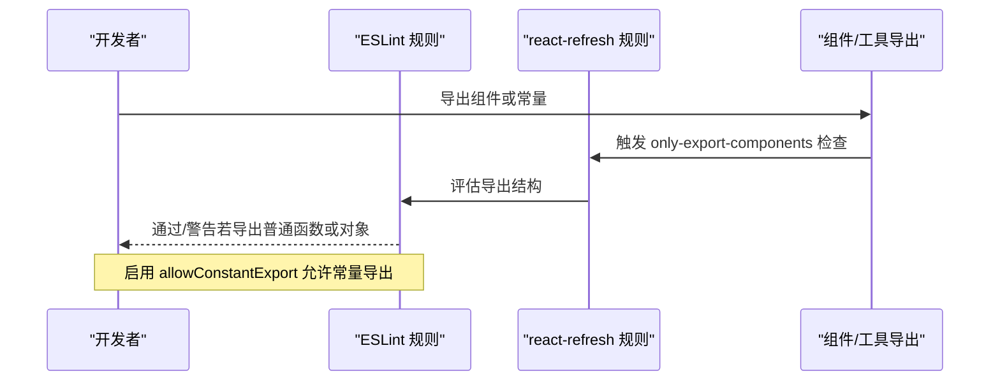
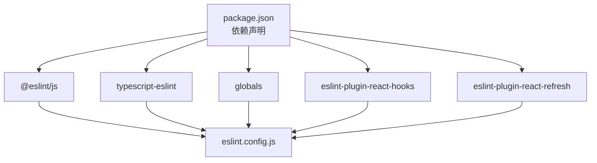

# ESLint 配置详解

<cite>
**本文引用的文件**
- [eslint.config.js](file://manga-creator/eslint.config.js)
- [package.json](file://manga-creator/package.json)
- [App.tsx](file://manga-creator/src/App.tsx)
- [Editor.tsx](file://manga-creator/src/components/Editor.tsx)
- [use-toast.ts](file://manga-creator/src/hooks/use-toast.ts)
- [ProjectCard.test.tsx](file://manga-creator/src/components/ProjectCard.test.tsx)
- [index.ts](file://manga-creator/src/types/index.ts)
</cite>

## 目录
1. [简介](#简介)
2. [项目结构](#项目结构)
3. [核心组件](#核心组件)
4. [架构总览](#架构总览)
5. [详细组件分析](#详细组件分析)
6. [依赖分析](#依赖分析)
7. [性能考虑](#性能考虑)
8. [故障排查指南](#故障排查指南)
9. [结论](#结论)
10. [附录](#附录)

## 简介
本文件面向 ESLint 在该仓库中的模块化配置进行系统性解析，重点覆盖：
- 如何通过 @eslint/js 与 typescript-eslint 集成 JavaScript 与 TypeScript 的推荐规则集
- globals.browser 对浏览器全局变量（如 window、document）的支持机制
- react-hooks 插件对 useEffect 依赖项的静态分析规则
- react-refresh 插件中 only-export-components 规则对 HMR 友好代码结构的约束
- ignores 字段排除 dist 目录的必要性
- 常见问题（规则冲突、Hook 依赖项警告）的处理策略
- 团队规范扩展自定义规则的建议

## 项目结构
该仓库采用 Vite + React + TypeScript 技术栈，ESLint 配置位于前端子包 manga-creator 中，采用 ESM 形式的配置文件，结合 TypeScript ESLint 生态实现对 TS/TSX 文件的统一校验。

图表来源
- [eslint.config.js](file://manga-creator/eslint.config.js#L1-L29)

章节来源
- [eslint.config.js](file://manga-creator/eslint.config.js#L1-L29)
- [package.json](file://manga-creator/package.json#L1-L77)

## 核心组件
- 规则扩展与语言选项
  - 通过 @eslint/js 与 typescript-eslint 的推荐规则集作为基础，确保 JS/TS 通用最佳实践得到覆盖。
  - 使用 globals.browser 提供浏览器全局变量支持，避免在浏览器环境下出现未识别变量的告警。
- 插件集成
  - react-hooks：启用推荐的 Hook 依赖项静态分析规则，帮助发现潜在的依赖缺失或错误。
  - react-refresh：启用 only-export-components 规则，要求仅导出组件或常量，以保证热更新（HMR）的稳定性与可预测性。
- 文件范围与忽略
  - files 字段限定规则作用于 TS/TSX 文件，避免对非目标文件产生误报。
  - ignores 字段排除 dist 目录，避免对构建产物进行不必要的检查。

章节来源
- [eslint.config.js](file://manga-creator/eslint.config.js#L1-L29)

## 架构总览
下图展示 ESLint 配置在项目中的作用范围与影响面，包括规则扩展、语言选项、插件与忽略策略之间的关系。

图表来源
- [eslint.config.js](file://manga-creator/eslint.config.js#L1-L29)

## 详细组件分析

### 模块化配置结构与规则扩展
- @eslint/js 与 typescript-eslint 的推荐规则集
  - 通过扩展 @eslint/js 的推荐规则集与 typescript-eslint 的推荐规则集，为 JS/TS 提供一致的基线规则，减少重复配置与规则冲突。
  - 该组合能覆盖语法、风格、安全与最佳实践等多方面要求，适合现代前端工程化场景。
- 语言选项与全局变量
  - languageOptions.ecmaVersion 指定语言版本，确保规则对新语法的支持与兼容。
  - languageOptions.globals 启用 globals.browser，使 window、document 等浏览器全局变量在规则层面被视为已声明，避免“未定义变量”的误报。
- 插件与规则
  - react-hooks：启用其推荐规则，用于静态分析 useEffect 等 Hook 的依赖项完整性与合理性。
  - react-refresh：启用 only-export-components 规则，并配置 allowConstantExport，以允许常量导出，同时仍鼓励将组件作为导出主体，提升 HMR 的稳定性与可维护性。
- 文件范围与忽略
  - files 字段限定规则仅应用于 TS/TSX 文件，避免对其他类型文件产生干扰。
  - ignores 字段排除 dist 目录，避免对构建产物进行不必要的检查，提高 lint 性能与准确性。

章节来源
- [eslint.config.js](file://manga-creator/eslint.config.js#L1-L29)

### 浏览器全局变量支持机制（globals.browser）
- 作用机制
  - 通过 languageOptions.globals=globals.browser，ESLint 将浏览器环境的全局变量（如 window、document、navigator 等）视为已声明，从而在规则校验中不再将其标记为未定义。
- 实际影响
  - 在浏览器侧代码中直接使用这些全局变量时，不会触发“未定义变量”类的规则告警，提升开发体验与规则准确性。
- 注意事项
  - 若项目同时存在 Node.js 环境代码，需谨慎区分环境，避免在 Node 环境中误用浏览器全局变量导致运行时错误。

章节来源
- [eslint.config.js](file://manga-creator/eslint.config.js#L1-L29)

### react-hooks 插件对 useEffect 依赖项的静态分析
- 规则来源
  - 通过扩展 react-hooks.configs.recommended.rules，启用对 useEffect、useMemo、useCallback 等 Hook 的依赖项静态分析，帮助发现依赖缺失或不稳定的写法。
- 典型场景与建议
  - 依赖项缺失：当组件内部使用了外部变量（如 props、state 或函数），但未将其加入依赖数组时，规则会发出警告，提示补充依赖。
  - 依赖项不稳定：若依赖项为每次渲染都变化的对象或函数，可能导致 Hook 重复执行或无限循环，应优先使用稳定引用或 useMemo/useCallback 包裹。
  - 复杂逻辑拆分：将复杂依赖项提取到 useMemo 或独立函数中，降低依赖数组的复杂度。
- 与项目代码的关联
  - 在 App.tsx 中，useEffect 依赖数组包含多个函数与状态访问，符合推荐实践；在 Editor.tsx 中，useEffect 监听项目状态并绑定/解绑事件，也体现了对依赖项的合理管理。

图表来源
- [eslint.config.js](file://manga-creator/eslint.config.js#L1-L29)
- [App.tsx](file://manga-creator/src/App.tsx#L1-L81)
- [Editor.tsx](file://manga-creator/src/components/Editor.tsx#L1-L172)

章节来源
- [eslint.config.js](file://manga-creator/eslint.config.js#L1-L29)
- [App.tsx](file://manga-creator/src/App.tsx#L1-L81)
- [Editor.tsx](file://manga-creator/src/components/Editor.tsx#L1-L172)

### react-refresh 插件的 only-export-components 规则
- 规则目的
  - 仅允许导出组件或常量，避免导出普通函数或对象，以减少 HMR（热模块替换）过程中的副作用与不可预测行为。
- 配置要点
  - 启用 react-refresh/only-export-components 规则，并开启 allowConstantExport，允许导出常量，同时仍鼓励将组件作为导出主体。
- 与项目代码的关联
  - 在 hooks/use-toast.ts 中，导出了 useToast、toast 等 Hook 与工具函数，属于合理的导出结构；在组件文件中，通常导出组件本身，满足 only-export-components 的约束。
- 建议
  - 将组件导出放在文件顶层，避免在导出中混入副作用逻辑；将工具函数与常量导出为独立模块，便于维护与 HMR 行为可控。

图表来源
- [eslint.config.js](file://manga-creator/eslint.config.js#L1-L29)
- [use-toast.ts](file://manga-creator/src/hooks/use-toast.ts#L1-L195)

章节来源
- [eslint.config.js](file://manga-creator/eslint.config.js#L1-L29)
- [use-toast.ts](file://manga-creator/src/hooks/use-toast.ts#L1-L195)

### ignores 字段排除 dist 目录的必要性
- 忽略构建产物
  - dist 是构建输出目录，通常由打包工具生成，不应参与 ESLint 校验，避免对已编译代码进行规则扫描。
- 性能与准确性
  - 排除 dist 可显著减少扫描文件数量，提升 lint 性能；同时避免对构建产物产生误判，保持规则的准确性。
- 最佳实践
  - 将构建产物目录（如 dist、build、out）纳入 ignores，确保 lint 仅作用于源码。

章节来源
- [eslint.config.js](file://manga-creator/eslint.config.js#L1-L29)

### 规则冲突与 Hook 依赖项警告的处理策略
- 规则冲突
  - 当 @eslint/js 与 typescript-eslint 的规则存在差异时，优先遵循 typescript-eslint 的 TS 专用规则；若仍冲突，可在项目中通过局部禁用或调整规则严重级别进行平衡。
- Hook 依赖项警告
  - 缺失依赖：补充依赖数组，确保所有外部引用都被显式声明。
  - 不稳定依赖：使用 useMemo/useCallback 包裹动态值，或将其抽取到稳定引用中。
  - 多个 useEffect 的拆分：将不同职责的副作用拆分为多个 useEffect，降低依赖复杂度。
- 与测试与类型定义的协同
  - 在测试文件中使用 vitest 与 @testing-library 时，注意遵循测试文件的命名与组织方式，避免与生产代码混淆。
  - 类型定义文件（如 types/index.ts）应清晰表达业务模型，减少运行时不确定性，从而降低规则告警。

章节来源
- [eslint.config.js](file://manga-creator/eslint.config.js#L1-L29)
- [ProjectCard.test.tsx](file://manga-creator/src/components/ProjectCard.test.tsx#L1-L219)
- [index.ts](file://manga-creator/src/types/index.ts#L1-L190)

### 团队规范扩展自定义规则的建议
- 基于现有配置扩展
  - 在现有规则集基础上新增团队特定规则，优先使用 ESLint 的配置合并能力，避免覆盖已有推荐规则。
- 命名与组织
  - 将自定义规则集中放置在独立文件中，便于团队评审与版本控制。
- 与 CI/CD 集成
  - 在 CI 中统一执行 lint 命令，确保规则一致性；对关键分支设置强制校验。
- 文档与培训
  - 将规则变更纳入团队知识库，定期进行规则解读与最佳实践分享。

章节来源
- [eslint.config.js](file://manga-creator/eslint.config.js#L1-L29)
- [package.json](file://manga-creator/package.json#L1-L77)

## 依赖分析
- 外部依赖与集成点
  - @eslint/js：提供 JS 推荐规则集，作为基础规则来源之一。
  - typescript-eslint：提供 TS 推荐规则集，与 @eslint/js 协同工作。
  - globals：提供浏览器全局变量集合，配合 languageOptions.globals 使用。
  - eslint-plugin-react-hooks：提供 React Hooks 的依赖分析规则。
  - eslint-plugin-react-refresh：提供 HMR 友好导出规则。
- 配置耦合与内聚
  - eslint.config.js 将规则扩展、语言选项、插件与忽略策略整合在同一配置文件中，保持高内聚与低耦合，便于维护与演进。

图表来源
- [package.json](file://manga-creator/package.json#L1-L77)
- [eslint.config.js](file://manga-creator/eslint.config.js#L1-L29)

章节来源
- [package.json](file://manga-creator/package.json#L1-L77)
- [eslint.config.js](file://manga-creator/eslint.config.js#L1-L29)

## 性能考虑
- 仅对 TS/TSX 文件应用规则，减少扫描范围，提升 lint 速度。
- 排除 dist 等构建产物目录，避免对已编译代码进行规则扫描。
- 合理使用插件规则，避免过度严格的规则导致频繁告警与调试成本上升。

## 故障排查指南
- 未定义变量告警
  - 症状：在浏览器侧代码中使用 window/document 等全局变量时报错。
  - 处理：确认已启用 globals.browser；若为 Node 环境，请使用条件判断或切换规则环境。
- Hook 依赖项告警
  - 症状：useEffect 依赖数组缺失或不稳定。
  - 处理：补充缺失依赖；使用 useMemo/useCallback 稳定依赖；拆分多个 useEffect。
- HMR 导出告警
  - 症状：导出普通函数或对象导致 HMR 不稳定。
  - 处理：遵循 only-export-components 约束；将组件作为主要导出；允许常量导出但避免副作用。
- 构建产物误检
  - 症状：dist 目录被扫描导致 lint 时间过长或误报。
  - 处理：确认 ignores 中包含 dist；在 CI 中统一执行 lint 命令。

章节来源
- [eslint.config.js](file://manga-creator/eslint.config.js#L1-L29)
- [App.tsx](file://manga-creator/src/App.tsx#L1-L81)
- [Editor.tsx](file://manga-creator/src/components/Editor.tsx#L1-L172)
- [use-toast.ts](file://manga-creator/src/hooks/use-toast.ts#L1-L195)

## 结论
该 ESLint 配置通过 @eslint/js 与 typescript-eslint 的推荐规则集、globals.browser 的浏览器全局变量支持、react-hooks 与 react-refresh 插件的静态分析与 HMR 友好约束，以及对 dist 目录的忽略，形成了覆盖全面、性能友好且易于维护的模块化配置。结合项目中的实际代码实践（如 App.tsx、Editor.tsx、use-toast.ts），可有效减少规则冲突与 Hook 依赖项问题，提升开发效率与代码质量。建议团队在此基础上持续完善自定义规则与 CI 集成，确保规则的一致性与可维护性。

## 附录
- 相关文件路径与用途
  - eslint.config.js：ESLint 配置入口，定义规则扩展、语言选项、插件与忽略策略。
  - package.json：声明 ESLint 及相关插件依赖，确保配置可用。
  - App.tsx、Editor.tsx：包含 useEffect 的典型场景，体现依赖项管理的最佳实践。
  - use-toast.ts：导出 Hook 与工具函数，满足 only-export-components 的约束。
  - ProjectCard.test.tsx：测试文件示例，体现测试代码的组织方式。
  - types/index.ts：类型定义文件，明确业务模型，减少运行时不确定性。

章节来源
- [eslint.config.js](file://manga-creator/eslint.config.js#L1-L29)
- [package.json](file://manga-creator/package.json#L1-L77)
- [App.tsx](file://manga-creator/src/App.tsx#L1-L81)
- [Editor.tsx](file://manga-creator/src/components/Editor.tsx#L1-L172)
- [use-toast.ts](file://manga-creator/src/hooks/use-toast.ts#L1-L195)
- [ProjectCard.test.tsx](file://manga-creator/src/components/ProjectCard.test.tsx#L1-L219)
- [index.ts](file://manga-creator/src/types/index.ts#L1-L190)