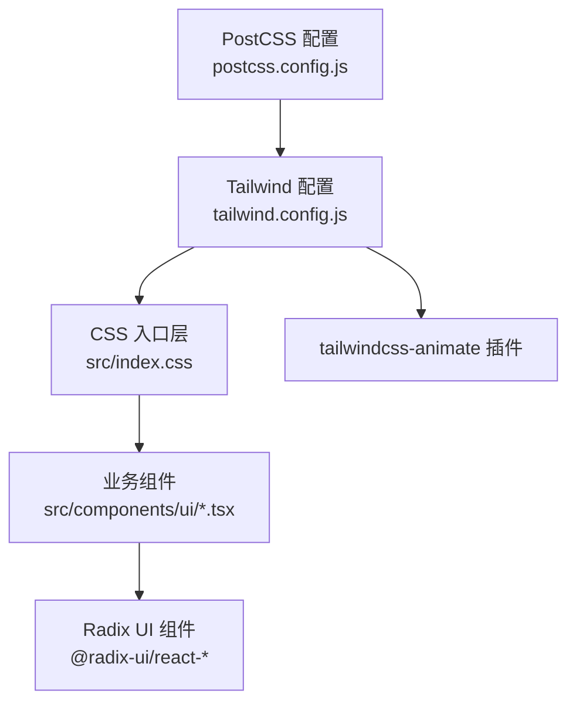
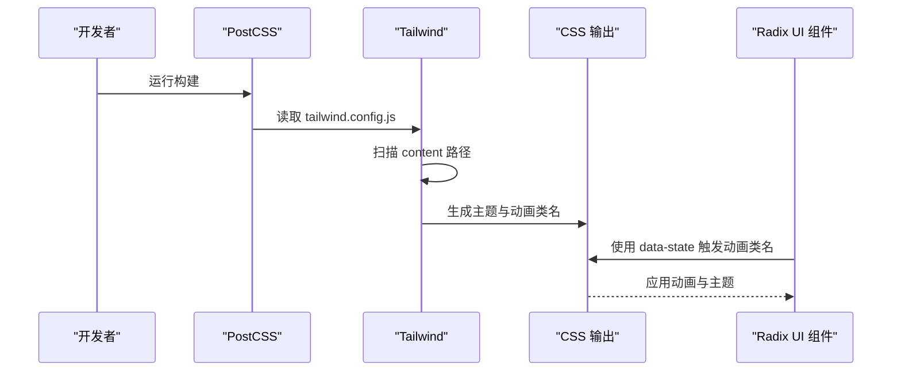
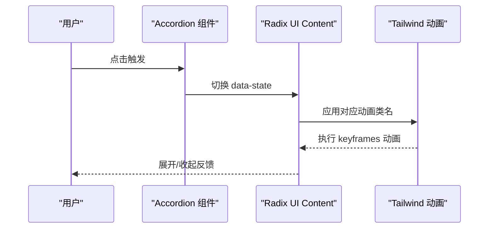
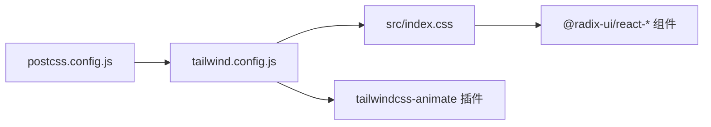

# Tailwind CSS 配置详解

<cite>
**本文引用的文件**
- [tailwind.config.js](file://manga-creator/tailwind.config.js)
- [postcss.config.js](file://manga-creator/postcss.config.js)
- [index.css](file://manga-creator/src/index.css)
- [accordion.tsx](file://manga-creator/src/components/ui/accordion.tsx)
- [package.json](file://manga-creator/package.json)
- [utils.ts](file://manga-creator/src/lib/utils.ts)
- [App.tsx](file://manga-creator/src/App.tsx)
</cite>

## 目录
1. [简介](#简介)
2. [项目结构](#项目结构)
3. [核心组件](#核心组件)
4. [架构总览](#架构总览)
5. [详细组件分析](#详细组件分析)
6. [依赖关系分析](#依赖关系分析)
7. [性能考量](#性能考量)
8. [故障排查指南](#故障排查指南)
9. [结论](#结论)
10. [附录](#附录)

## 简介
本文件围绕项目中的 Tailwind CSS 配置进行系统化解析，重点覆盖以下方面：
- darkMode: 'class' 暗色主题切换机制与应用实践
- content 字段的源文件路径扫描策略对样式生成的影响
- theme.extend 中基于 CSS 变量的颜色系统（如 --primary、--background）与动态圆角半径（--radius）的设计理念
- keyframes 与 animation 中手风琴动画的实现逻辑，以及与 Radix UI 组件的协同工作方式
- tailwindcss-animate 插件的集成效果
- 常见问题（样式未生效、暗色模式不响应）的定位与解决思路
- 如何扩展自定义主题变量以支持未来 UI 定制

## 项目结构
本项目的样式管线由 PostCSS 驱动，Tailwind CSS 作为核心工具链，配合 Radix UI 组件与 tailwindcss-animate 插件共同完成主题与动画体验。

图表来源
- [postcss.config.js](file://manga-creator/postcss.config.js#L1-L7)
- [tailwind.config.js](file://manga-creator/tailwind.config.js#L1-L94)
- [index.css](file://manga-creator/src/index.css#L1-L40)
- [accordion.tsx](file://manga-creator/src/components/ui/accordion.tsx#L1-L57)
- [package.json](file://manga-creator/package.json#L1-L62)

章节来源
- [postcss.config.js](file://manga-creator/postcss.config.js#L1-L7)
- [tailwind.config.js](file://manga-creator/tailwind.config.js#L1-L94)
- [index.css](file://manga-creator/src/index.css#L1-L40)
- [package.json](file://manga-creator/package.json#L1-L62)

## 核心组件
- Tailwind 配置：定义暗色模式、内容扫描范围、主题扩展（颜色、圆角、动画）、插件集成
- CSS 入口层：通过 @layer base 定义 :root CSS 变量，为主题系统提供数据源
- Radix UI 手风琴组件：使用 data-state 属性驱动动画类名，与 Tailwind 动画联动
- tailwindcss-animate 插件：提供便捷的动画类名与过渡语义
- 工具函数 cn：用于安全合并 Tailwind 类名，避免冲突

章节来源
- [tailwind.config.js](file://manga-creator/tailwind.config.js#L1-L94)
- [index.css](file://manga-creator/src/index.css#L1-L40)
- [accordion.tsx](file://manga-creator/src/components/ui/accordion.tsx#L1-L57)
- [utils.ts](file://manga-creator/src/lib/utils.ts#L1-L7)

## 架构总览
Tailwind 在构建时扫描 content 路径，提取类名并生成对应 CSS；CSS 变量在 :root 中定义，Tailwind 主题扩展将其映射为 HSL 变量；Radix UI 组件通过 data-state 控制动画类名，tailwindcss-animate 提供动画语义；最终由 PostCSS 处理输出。

图表来源
- [postcss.config.js](file://manga-creator/postcss.config.js#L1-L7)
- [tailwind.config.js](file://manga-creator/tailwind.config.js#L1-L94)
- [index.css](file://manga-creator/src/index.css#L1-L40)
- [accordion.tsx](file://manga-creator/src/components/ui/accordion.tsx#L1-L57)

## 详细组件分析

### 暗色主题切换机制（darkMode: 'class'）
- 配置层面：通过 darkMode: ["class"] 启用基于类名的暗色模式，Tailwind 将为暗色模式生成带前缀的类名（如 dark:）。
- 应用层面：组件或根节点可添加暗色模式类名，从而触发相应主题变量与样式。
- 实践要点：
  - 在根元素或文档上添加暗色模式类名，即可激活暗色主题。
  - 使用 cn 工具函数合并类名时，确保暗色模式类名不会被后续类名覆盖。
  - 若需要在运行时切换，可在应用入口或状态管理中动态更新根元素类名。

章节来源
- [tailwind.config.js](file://manga-creator/tailwind.config.js#L1-L94)
- [utils.ts](file://manga-creator/src/lib/utils.ts#L1-L7)
- [App.tsx](file://manga-creator/src/App.tsx#L1-L81)

### content 字段的源文件路径扫描策略
- 扫描范围：content 包含 HTML 与 TSX 源码路径，Tailwind 在构建时会解析这些文件中的类名，仅生成实际使用的 CSS。
- 影响：
  - 未使用的类名不会被打包，减少体积。
  - 若新增类名但未包含在 content 中，样式不会生成，需检查路径是否匹配。
  - 对于动态拼接的类名，建议保持静态可识别性，或在 content 中补充对应路径。

章节来源
- [tailwind.config.js](file://manga-creator/tailwind.config.js#L1-L94)

### 主题扩展：CSS 变量驱动的颜色系统与动态圆角
- 颜色系统：
  - 在 :root 中定义一组 HSL 变量（如 --primary、--background、--radius 等）。
  - Tailwind theme.extend.colors 将这些变量映射为 HSL 值，使任意 Tailwind 颜色类均可随变量变化而改变。
- 动态圆角：
  - 通过 theme.extend.borderRadius 将圆角映射到变量，并提供 lg/md/sm 的计算差异，便于在不同组件层级保持视觉一致性。
- 设计理念：
  - 以 CSS 变量为中心的主题系统，便于集中管理与快速切换。
  - 将变量与 Tailwind 类解耦，既保留类名的语义化，又具备高度可定制性。

章节来源
- [index.css](file://manga-creator/src/index.css#L1-L40)
- [tailwind.config.js](file://manga-creator/tailwind.config.js#L1-L94)

### 手风琴动画与 Radix UI 协同
- Tailwind 动画：
  - 在 theme.extend.keyframes 与 animation 中定义了 accordion-down 与 accordion-up 两个关键帧，并设置统一的持续时间与缓动。
- Radix UI 组件：
  - AccordionContent 通过 data-state 属性自动切换 open/closed 状态，并绑定对应的动画类名（如 data-[state=open]:animate-accordion-down）。
- 协同方式：
  - Radix UI 决定何时触发动画，Tailwind 提供动画实现，二者通过 data-state 与类名绑定无缝衔接。
- 注意事项：
  - 配置中存在重复键名与重复动画声明，建议去重，避免潜在冲突。

图表来源
- [accordion.tsx](file://manga-creator/src/components/ui/accordion.tsx#L1-L57)
- [tailwind.config.js](file://manga-creator/tailwind.config.js#L1-L94)

章节来源
- [accordion.tsx](file://manga-creator/src/components/ui/accordion.tsx#L1-L57)
- [tailwind.config.js](file://manga-creator/tailwind.config.js#L1-L94)

### tailwindcss-animate 插件集成
- 插件作用：
  - 提供常用动画类名（如 animate-in、animate-out），简化进入/退出动画的书写。
  - 与 Radix UI 的 data-state 属性天然契合，常用于对话框、下拉菜单等组件的显隐动画。
- 项目集成：
  - 在 tailwind.config.js 中启用插件，无需额外配置即可使用其提供的类名。
- 使用示例：
  - 在对话框 Overlay 上使用 data-state 控制显隐动画类名，实现淡入淡出效果。

章节来源
- [tailwind.config.js](file://manga-creator/tailwind.config.js#L1-L94)
- [accordion.tsx](file://manga-creator/src/components/ui/accordion.tsx#L1-L57)
- [package.json](file://manga-creator/package.json#L1-L62)

### 类名合并与冲突处理（cn 工具）
- cn 工具通过 clsx 与 tailwind-merge 合并类名，优先保留后传入的类名，避免 Tailwind 冲突类名被覆盖。
- 在暗色模式场景中，确保暗色前缀类名（如 dark:*）能正确保留。

章节来源
- [utils.ts](file://manga-creator/src/lib/utils.ts#L1-L7)

## 依赖关系分析
- Tailwind 依赖 PostCSS 与 autoprefixer 进行构建处理。
- Radix UI 组件提供交互与状态（data-state），与 Tailwind 动画类名协作。
- tailwindcss-animate 插件提供动画语义类名，降低动画实现成本。

图表来源
- [postcss.config.js](file://manga-creator/postcss.config.js#L1-L7)
- [tailwind.config.js](file://manga-creator/tailwind.config.js#L1-L94)
- [index.css](file://manga-creator/src/index.css#L1-L40)
- [package.json](file://manga-creator/package.json#L1-L62)

章节来源
- [package.json](file://manga-creator/package.json#L1-L62)
- [postcss.config.js](file://manga-creator/postcss.config.js#L1-L7)
- [tailwind.config.js](file://manga-creator/tailwind.config.js#L1-L94)

## 性能考量
- content 路径精准：仅扫描实际使用到的源文件，避免生成冗余 CSS。
- CSS 变量集中管理：减少重复定义，提升主题切换效率。
- 动画类名语义化：借助 tailwindcss-animate 插件，减少自定义动画样板代码。
- 构建优化：确保 PostCSS 与 Tailwind 版本兼容，避免不必要的重编译。

## 故障排查指南
- 样式未生效
  - 检查 content 路径是否包含新增文件，确保构建时能扫描到新类名。
  - 确认类名拼写与大小写一致，Tailwind 对类名大小写敏感。
  - 若使用暗色模式，确认根元素或容器已添加暗色类名。
- 暗色模式不响应
  - 确认 darkMode: ["class"] 已启用，且在根元素上添加了暗色类名。
  - 使用 cn 工具合并类名时，避免后传入的类名覆盖了暗色前缀类名。
- 动画不执行
  - 检查 Radix UI 组件的 data-state 是否正确切换。
  - 确认 Tailwind 动画类名与组件绑定一致（如 data-[state=open]:animate-accordion-down）。
  - 关注配置中重复键名与重复动画声明，建议去重以避免冲突。
- 圆角不一致
  - 确认 CSS 变量 --radius 已在 :root 正确设置。
  - 检查 theme.extend.borderRadius 的映射是否符合预期。

章节来源
- [tailwind.config.js](file://manga-creator/tailwind.config.js#L1-L94)
- [index.css](file://manga-creator/src/index.css#L1-L40)
- [accordion.tsx](file://manga-creator/src/components/ui/accordion.tsx#L1-L57)
- [utils.ts](file://manga-creator/src/lib/utils.ts#L1-L7)

## 结论
本项目采用“CSS 变量 + Tailwind 主题扩展 + Radix UI + tailwindcss-animate”的组合方案，实现了高可定制的主题系统与流畅的交互动画。通过 content 精准扫描与类名合并工具，兼顾了构建性能与开发体验。建议在后续迭代中：
- 保持 content 路径的准确性与完整性
- 清理重复的动画键名与声明
- 以 CSS 变量为中心扩展更多主题变量，满足未来 UI 定制需求

## 附录
- 自定义主题变量扩展建议
  - 在 :root 中新增变量（如 --surface、--brand 等），并在 Tailwind theme.extend.colors 中映射，以获得完整的类名体系。
  - 对于组件级变量（如 --accordion-content-height），可继续沿用 Radix UI 的约定，保持与组件生态的一致性。
- 暗色模式最佳实践
  - 在应用入口或全局状态中维护暗色模式开关，并在根元素上动态切换暗色类名。
  - 使用 cn 工具确保暗色类名优先级高于其他类名。