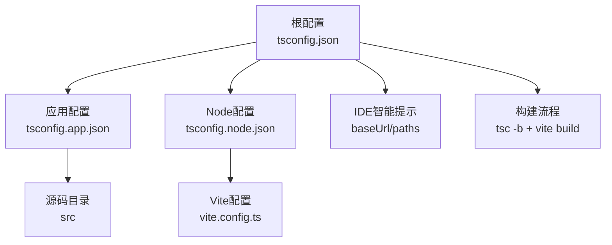
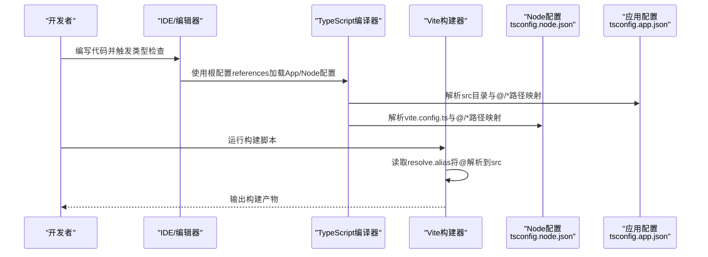
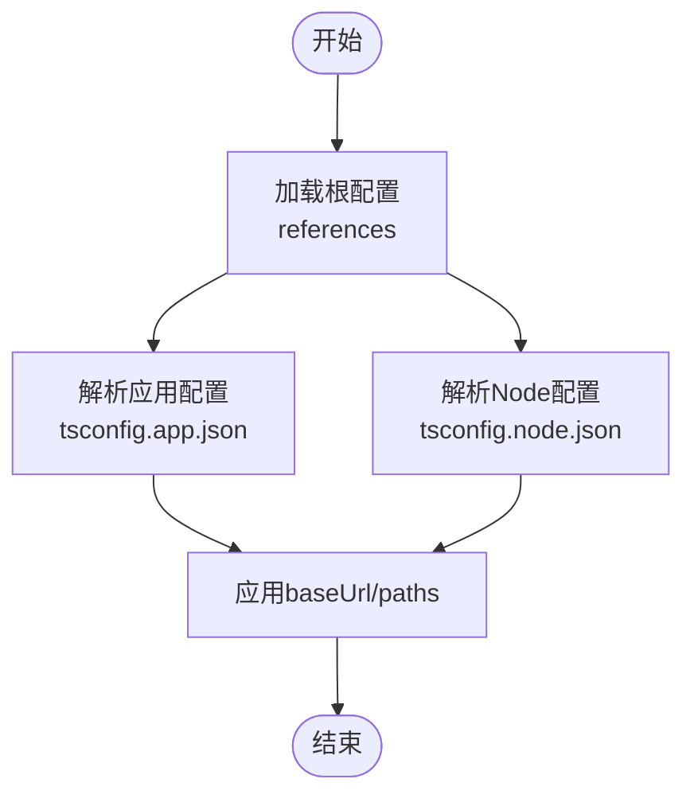
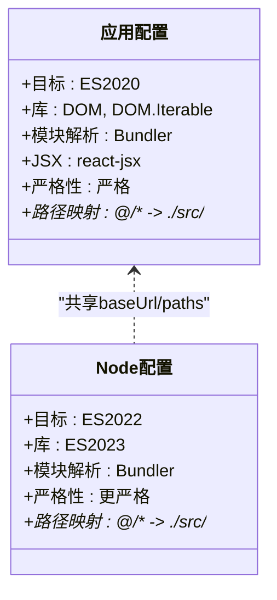
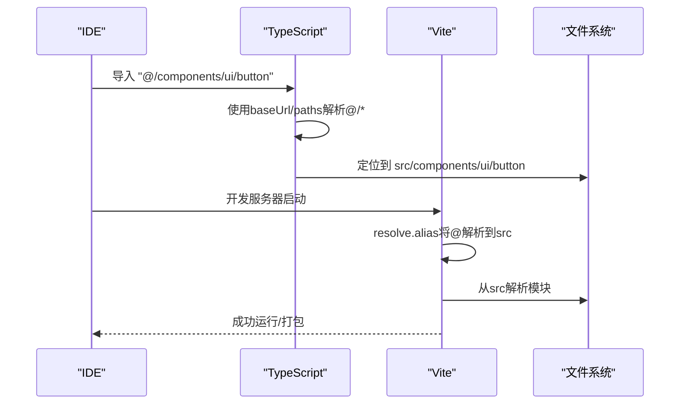
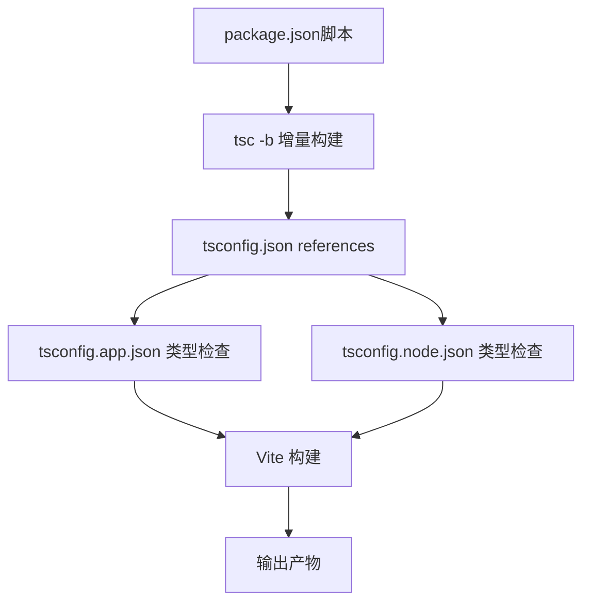
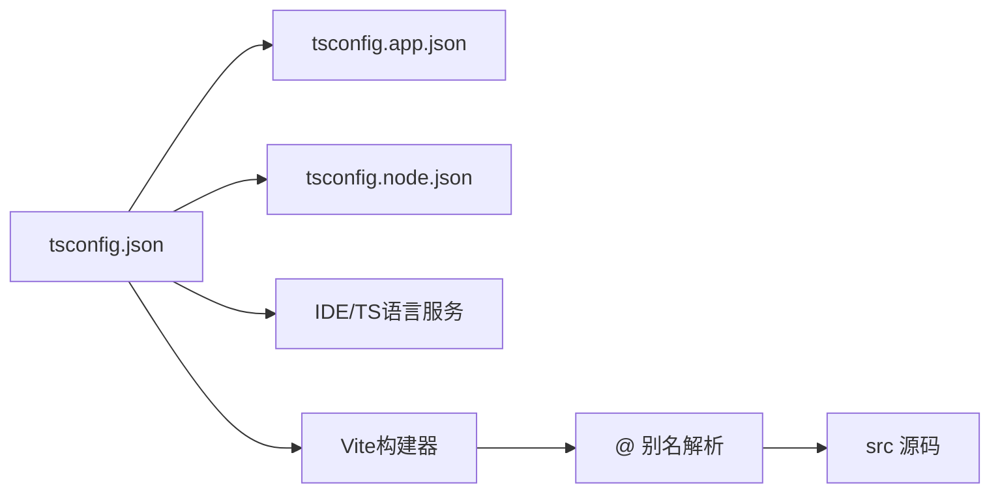

# TypeScript 配置详解

<cite>
**本文引用的文件**
- [tsconfig.json](file://manga-creator/tsconfig.json)
- [tsconfig.app.json](file://manga-creator/tsconfig.app.json)
- [tsconfig.node.json](file://manga-creator/tsconfig.node.json)
- [vite.config.ts](file://manga-creator/vite.config.ts)
- [package.json](file://manga-creator/package.json)
- [components.json](file://manga-creator/components.json)
- [src/vite-env.d.ts](file://manga-creator/src/vite-env.d.ts)
- [src/types/index.ts](file://manga-creator/src/types/index.ts)
</cite>

## 目录
1. [引言](#引言)
2. [项目结构](#项目结构)
3. [核心组件](#核心组件)
4. [架构总览](#架构总览)
5. [详细组件分析](#详细组件分析)
6. [依赖关系分析](#依赖关系分析)
7. [性能考量](#性能考量)
8. [故障排查指南](#故障排查指南)
9. [结论](#结论)
10. [附录](#附录)

## 引言
本文件系统性解析该仓库的 TypeScript 配置体系，重点围绕根级 tsconfig.json 的项目引用机制（references）、baseUrl 与 paths 中 @/* 别名与 Vite 的协同工作原理，以及应用配置（tsconfig.app.json）与 Node 环境配置（tsconfig.node.json）在编译目标、库引用与严格性方面的差异。同时提供常见问题的修复建议，并推荐启用严格模式以提升类型安全。

## 项目结构
该工程采用多配置分层设计：
- 根配置：通过 references 引用两个子配置，统一管理 baseUrl 与 paths。
- 应用配置：面向浏览器端 React/Vite 场景，包含 JSX、DOM 类型与测试类型。
- Node 配置：面向 Vite 配置文件的类型检查，聚焦 Node 环境与严格规则。
- 构建入口：通过脚本组合 tsc -b 与 vite build 实现增量构建与打包。

图表来源
- [tsconfig.json](file://manga-creator/tsconfig.json#L1-L13)
- [tsconfig.app.json](file://manga-creator/tsconfig.app.json#L1-L34)
- [tsconfig.node.json](file://manga-creator/tsconfig.node.json#L1-L24)
- [vite.config.ts](file://manga-creator/vite.config.ts#L1-L30)

章节来源
- [tsconfig.json](file://manga-creator/tsconfig.json#L1-L13)
- [tsconfig.app.json](file://manga-creator/tsconfig.app.json#L1-L34)
- [tsconfig.node.json](file://manga-creator/tsconfig.node.json#L1-L24)
- [vite.config.ts](file://manga-creator/vite.config.ts#L1-L30)
- [package.json](file://manga-creator/package.json#L1-L62)

## 核心组件
- 根级 tsconfig.json：使用 references 将应用与 Node 配置纳入同一构建上下文；同时设置 baseUrl 与 paths，为 IDE 与构建器提供一致的模块解析基础。
- tsconfig.app.json：面向浏览器端应用，设置 ES2020 目标、DOM/DOM.Iterable 库、Bundler 模式、React JSX、严格规则与 @/* 路径映射。
- tsconfig.node.json：面向 Vite 配置文件，设置 ES2022 目标、ESNext 模块、严格规则与更严格的未使用变量/参数检查。
- vite.config.ts：通过 resolve.alias 将 @ 映射到 src，与 tsconfig.json 的 baseUrl/paths 协同，确保开发期与构建期解析一致。
- package.json：定义 dev/build 流程，先执行 tsc -b 增量构建，再由 Vite 执行打包。

章节来源
- [tsconfig.json](file://manga-creator/tsconfig.json#L1-L13)
- [tsconfig.app.json](file://manga-creator/tsconfig.app.json#L1-L34)
- [tsconfig.node.json](file://manga-creator/tsconfig.node.json#L1-L24)
- [vite.config.ts](file://manga-creator/vite.config.ts#L1-L30)
- [package.json](file://manga-creator/package.json#L1-L62)

## 架构总览
TypeScript 与 Vite 在本项目中的协作路径如下：
- 根配置通过 references 统一管理两个子配置，使 IDE 与构建器共享 baseUrl/paths。
- tsconfig.app.json 与 tsconfig.node.json 各自 include 对应源域（src 与 vite.config.ts），分别进行类型检查。
- Vite 侧通过 resolve.alias 将 @ 解析到 src，与 tsconfig.json 的 @/* 路径映射保持一致，避免开发期与构建期解析不一致导致的错误。

图表来源
- [tsconfig.json](file://manga-creator/tsconfig.json#L1-L13)
- [tsconfig.app.json](file://manga-creator/tsconfig.app.json#L1-L34)
- [tsconfig.node.json](file://manga-creator/tsconfig.node.json#L1-L24)
- [vite.config.ts](file://manga-creator/vite.config.ts#L1-L30)

## 详细组件分析

### 根级 tsconfig.json 的项目引用机制
- references：通过数组形式引用 tsconfig.app.json 与 tsconfig.node.json，使 tsc -b 能够按依赖顺序增量构建两个子配置。
- compilerOptions.baseUrl 与 paths：统一设置 baseUrl 与 @/* 到 src 的映射，保证 IDE 与构建器在解析非相对路径时行为一致。

图表来源
- [tsconfig.json](file://manga-creator/tsconfig.json#L1-L13)

章节来源
- [tsconfig.json](file://manga-creator/tsconfig.json#L1-L13)

### 应用配置（tsconfig.app.json）与 Node 配置（tsconfig.node.json）对比
- 编译目标与库引用
  - 应用配置：target 为 ES2020，lib 包含 DOM 与 DOM.Iterable，适合浏览器端 React 应用。
  - Node 配置：target 为 ES2022，lib 更偏向现代 Node 环境，include 仅包含 vite.config.ts。
- 模块解析与 Bundler 模式
  - 两者均使用 moduleResolution: Bundler、allowImportingTsExtensions、isolatedModules、moduleDetection: force，确保与 Vite 的模块解析策略一致。
- 严格性与规则
  - 两配置均启用 strict，但 Node 配置对未使用局部变量与未使用参数的检查更为严格（true），而应用配置允许宽松（false）。
  - 两者均开启 noFallthroughCasesInSwitch、noUncheckedSideEffectImports 等规则，提升代码健壮性。
- JSX 与类型声明
  - 应用配置显式设置 jsx: react-jsx，并引入 vite/client 与 vitest/globals 类型，便于在应用侧获得 Vite 与 Vitest 的类型支持。
  - Node 配置不包含 jsx 设置，专注于 Vite 配置文件的类型检查。

图表来源
- [tsconfig.app.json](file://manga-creator/tsconfig.app.json#L1-L34)
- [tsconfig.node.json](file://manga-creator/tsconfig.node.json#L1-L24)

章节来源
- [tsconfig.app.json](file://manga-creator/tsconfig.app.json#L1-L34)
- [tsconfig.node.json](file://manga-creator/tsconfig.node.json#L1-L24)

### baseUrl 与 paths 中 @/* 别名与 Vite 的协同工作原理
- 根配置与应用配置均设置 baseUrl 与 paths，将 @/* 映射到 ./src/*，确保 IDE 能正确解析非相对路径导入。
- Vite 通过 resolve.alias 将 @ 解析到 src，与 tsconfig.json 的 @/* 路径映射保持一致，从而在开发期与构建期实现一致的模块解析。
- 组件库工具（如 shadcn/ui）的 components.json 中也使用了 @/* 别名前缀，进一步强化了别名在整个工程中的统一性。

图表来源
- [tsconfig.json](file://manga-creator/tsconfig.json#L1-L13)
- [tsconfig.app.json](file://manga-creator/tsconfig.app.json#L1-L34)
- [vite.config.ts](file://manga-creator/vite.config.ts#L1-L30)
- [components.json](file://manga-creator/components.json#L1-L21)

章节来源
- [tsconfig.json](file://manga-creator/tsconfig.json#L1-L13)
- [tsconfig.app.json](file://manga-creator/tsconfig.app.json#L1-L34)
- [vite.config.ts](file://manga-creator/vite.config.ts#L1-L30)
- [components.json](file://manga-creator/components.json#L1-L21)

### 构建流程与类型声明
- 构建脚本：先执行 tsc -b 增量构建（基于 references），再由 Vite 执行打包，确保类型检查与打包流程衔接。
- 类型声明：src/vite-env.d.ts 引入 vite/client 类型，配合 tsconfig.app.json 的 types 字段，使应用侧具备 Vite 与测试环境的类型支持。
- 全局类型：src/types/index.ts 提供项目核心类型定义，供应用各处使用，减少重复声明与类型漂移。

图表来源
- [package.json](file://manga-creator/package.json#L1-L62)
- [tsconfig.json](file://manga-creator/tsconfig.json#L1-L13)
- [tsconfig.app.json](file://manga-creator/tsconfig.app.json#L1-L34)
- [tsconfig.node.json](file://manga-creator/tsconfig.node.json#L1-L24)
- [src/vite-env.d.ts](file://manga-creator/src/vite-env.d.ts#L1-L2)

章节来源
- [package.json](file://manga-creator/package.json#L1-L62)
- [src/vite-env.d.ts](file://manga-creator/src/vite-env.d.ts#L1-L2)
- [src/types/index.ts](file://manga-creator/src/types/index.ts#L1-L190)

## 依赖关系分析
- 配置耦合
  - 根配置通过 references 与两个子配置形成强耦合，修改 baseUrl/paths 会影响两处解析。
  - Vite 的 resolve.alias 与 tsconfig.json 的 @/* 必须保持一致，否则会出现开发期可解析、构建期不可解析或相反的情况。
- 外部依赖
  - TypeScript 版本与 Vite 版本在 engines/peerDependencies 中有明确要求，需满足 Node 版本与类型包版本兼容性。
- 可能的循环依赖
  - 当前配置未见直接循环依赖；但若在 src 内部引入 vite.config.ts 或反向依赖，可能引发循环。

图表来源
- [tsconfig.json](file://manga-creator/tsconfig.json#L1-L13)
- [tsconfig.app.json](file://manga-creator/tsconfig.app.json#L1-L34)
- [tsconfig.node.json](file://manga-creator/tsconfig.node.json#L1-L24)
- [vite.config.ts](file://manga-creator/vite.config.ts#L1-L30)

章节来源
- [tsconfig.json](file://manga-creator/tsconfig.json#L1-L13)
- [tsconfig.app.json](file://manga-creator/tsconfig.app.json#L1-L34)
- [tsconfig.node.json](file://manga-creator/tsconfig.node.json#L1-L24)
- [vite.config.ts](file://manga-creator/vite.config.ts#L1-L30)

## 性能考量
- 增量构建：通过 tsc -b 与 references 实现增量构建，缩短开发周期。
- 模块解析：Bundler 模式与 allowImportingTsExtensions、isolatedModules、moduleDetection: force 有助于与 Vite 协同，减少不必要的全量扫描。
- 类型检查范围：应用配置 include src，Node 配置 include vite.config.ts，避免无关文件参与类型检查，降低开销。

章节来源
- [tsconfig.app.json](file://manga-creator/tsconfig.app.json#L1-L34)
- [tsconfig.node.json](file://manga-creator/tsconfig.node.json#L1-L24)
- [package.json](file://manga-creator/package.json#L1-L62)

## 故障排查指南
- 类型声明缺失
  - 症状：在应用侧使用 Vite 特定 API 或测试 API 时报类型错误。
  - 排查：确认 tsconfig.app.json 的 types 是否包含 vite/client 与 vitest/globals；确认 src/vite-env.d.ts 是否存在类型引用。
  - 参考路径
    - [tsconfig.app.json](file://manga-creator/tsconfig.app.json#L1-L34)
    - [src/vite-env.d.ts](file://manga-creator/src/vite-env.d.ts#L1-L2)
- 别名路径报错（@/*）
  - 症状：导入 "@/*" 报错或无法解析。
  - 排查：确保根配置与应用配置均设置了 baseUrl 与 paths；确保 Vite 的 resolve.alias 与 tsconfig.json 的 @/* 保持一致。
  - 参考路径
    - [tsconfig.json](file://manga-creator/tsconfig.json#L1-L13)
    - [tsconfig.app.json](file://manga-creator/tsconfig.app.json#L1-L34)
    - [vite.config.ts](file://manga-creator/vite.config.ts#L1-L30)
- 构建失败或类型检查异常
  - 症状：tsc -b 或 vite build 报错。
  - 排查：检查 references 是否指向正确的子配置；确认 include 范围是否覆盖到实际源码；核对 Node 版本与 TypeScript/Vite 版本兼容性。
  - 参考路径
    - [tsconfig.json](file://manga-creator/tsconfig.json#L1-L13)
    - [tsconfig.app.json](file://manga-creator/tsconfig.app.json#L1-L34)
    - [tsconfig.node.json](file://manga-creator/tsconfig.node.json#L1-L24)
    - [package.json](file://manga-creator/package.json#L1-L62)
- 严格模式相关问题
  - 症状：未使用变量/参数、switch 缺少 fallthrough 等规则导致报错。
  - 排查：根据业务需求调整严格规则；Node 配置默认更严格，应用配置允许宽松，必要时在应用配置中关闭相应规则。
  - 参考路径
    - [tsconfig.app.json](file://manga-creator/tsconfig.app.json#L1-L34)
    - [tsconfig.node.json](file://manga-creator/tsconfig.node.json#L1-L24)

## 结论
本项目的 TypeScript 配置通过根级 references 将应用与 Node 环境的类型检查整合，结合 baseUrl/paths 与 Vite 的 resolve.alias，实现了开发期与构建期一致的模块解析。应用配置与 Node 配置在编译目标、库引用与严格性上各有侧重，共同保障了类型安全与构建效率。建议持续启用严格模式并保持别名与解析策略的一致性，以降低类型错误与构建风险。

## 附录
- 最佳实践建议
  - 保持 baseUrl/paths 与 resolve.alias 一致，避免路径歧义。
  - 在应用配置中保留必要的类型声明（如 vite/client、vitest/globals），在 Node 配置中专注 Vite 配置文件的类型检查。
  - 通过 tsc -b 与 Vite 分阶段构建，提升开发体验与构建稳定性。
- 相关文件参考
  - [tsconfig.json](file://manga-creator/tsconfig.json#L1-L13)
  - [tsconfig.app.json](file://manga-creator/tsconfig.app.json#L1-L34)
  - [tsconfig.node.json](file://manga-creator/tsconfig.node.json#L1-L24)
  - [vite.config.ts](file://manga-creator/vite.config.ts#L1-L30)
  - [package.json](file://manga-creator/package.json#L1-L62)
  - [components.json](file://manga-creator/components.json#L1-L21)
  - [src/vite-env.d.ts](file://manga-creator/src/vite-env.d.ts#L1-L2)
  - [src/types/index.ts](file://manga-creator/src/types/index.ts#L1-L190)