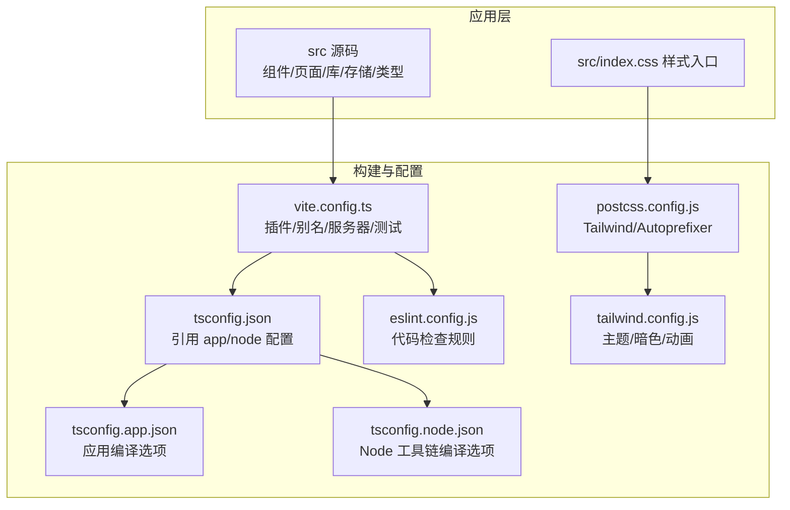
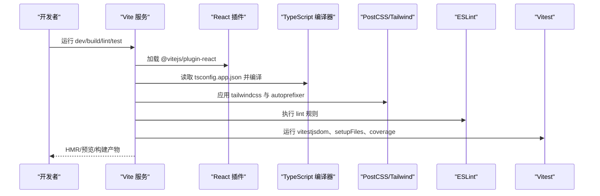
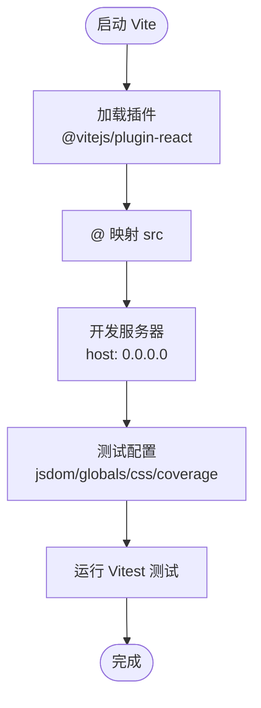
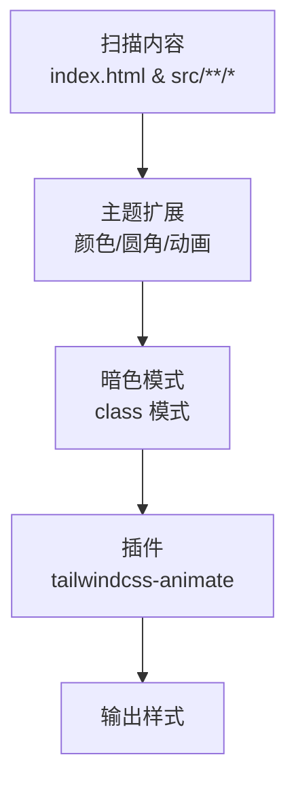
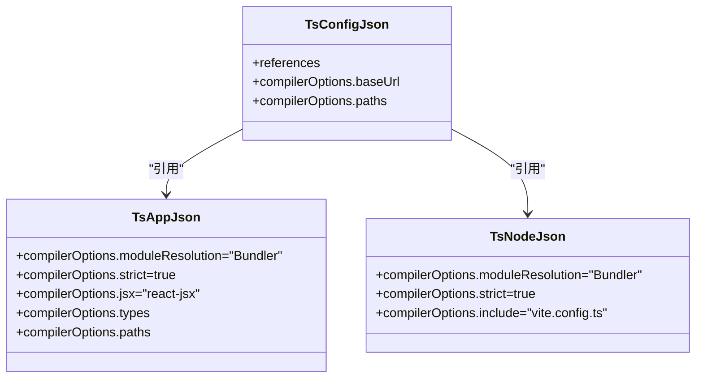
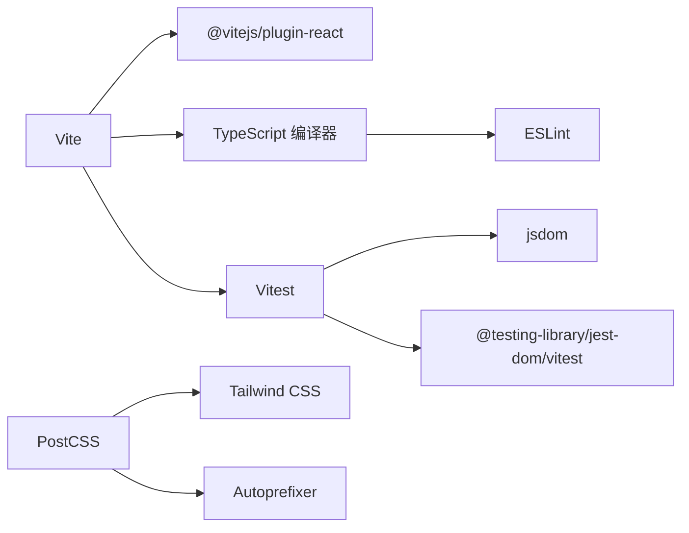

# 构建与配置

<cite>
**本文引用的文件**
- [vite.config.ts](file://manga-creator/vite.config.ts)
- [tailwind.config.js](file://manga-creator/tailwind.config.js)
- [postcss.config.js](file://manga-creator/postcss.config.js)
- [tsconfig.json](file://manga-creator/tsconfig.json)
- [tsconfig.app.json](file://manga-creator/tsconfig.app.json)
- [tsconfig.node.json](file://manga-creator/tsconfig.node.json)
- [eslint.config.js](file://manga-creator/eslint.config.js)
- [package.json](file://manga-creator/package.json)
- [setup.ts](file://manga-creator/src/tests/setup.ts)
</cite>

## 目录
1. [简介](#简介)
2. [项目结构](#项目结构)
3. [核心组件](#核心组件)
4. [架构总览](#架构总览)
5. [详细组件分析](#详细组件分析)
6. [依赖关系分析](#依赖关系分析)
7. [性能考量](#性能考量)
8. [故障排查指南](#故障排查指南)
9. [结论](#结论)
10. [附录](#附录)

## 简介
本文件聚焦于项目构建工具链的配置细节，围绕以下方面进行系统化解析：
- Vite 配置：插件体系（react 插件）、路径别名（@ 映射到 src）、开发服务器设置、Vitest 测试集成
- Tailwind CSS 配置：主题定制（HSL 变量）、暗色模式支持（class 模式）、动画插件（tailwindcss-animate）
- TypeScript 编译配置：严格模式与路径映射（baseUrl/paths），以及多 tsconfig 分层管理
- ESLint 规则：推荐规则集、React Hooks 与 React Refresh 插件
- 常见构建问题排查：HMR 失效、CSS 未生效等
- 性能优化建议：代码分割与 Tree Shaking 的配置要点

## 项目结构
该仓库采用“单包多入口”的前端工程组织方式，核心目录包含源码、样式、类型声明、测试与构建配置。关键配置文件分布如下：
- 构建与打包：vite.config.ts、tsconfig.json、tsconfig.app.json、tsconfig.node.json、package.json
- 样式管线：tailwind.config.js、postcss.config.js、index.css（位于 src 目录）
- 质量保障：eslint.config.js、src/tests/setup.ts
- 运行脚本：package.json 中的 dev/build/lint/test/preview 等命令

图表来源
- [vite.config.ts](file://manga-creator/vite.config.ts#L1-L30)
- [tsconfig.json](file://manga-creator/tsconfig.json#L1-L14)
- [tsconfig.app.json](file://manga-creator/tsconfig.app.json#L1-L35)
- [tsconfig.node.json](file://manga-creator/tsconfig.node.json#L1-L25)
- [eslint.config.js](file://manga-creator/eslint.config.js#L1-L29)
- [postcss.config.js](file://manga-creator/postcss.config.js#L1-L7)
- [tailwind.config.js](file://manga-creator/tailwind.config.js#L1-L94)

章节来源
- [package.json](file://manga-creator/package.json#L1-L62)

## 核心组件
本节从“构建工具链”的角度，逐项梳理关键配置点及其作用。

- Vite 配置
  - 插件：使用 @vitejs/plugin-react 提供 React JSX 转换与 HMR 支持
  - 路径别名：通过 resolve.alias 将 @ 映射到 src，便于统一导入路径
  - 开发服务器：host 设置为 0.0.0.0，允许外部访问；allowedHosts 允许任意主机
  - Vitest 集成：启用全局变量、jsdom 环境、测试入口文件、CSS 支持、覆盖率（v8 + lcov 文本）、排除 e2e 目录

- Tailwind CSS 配置
  - 内容扫描：覆盖根 HTML 与 src 下所有 JS/TS/JSX/TSX 文件
  - 主题扩展：基于 HSL 变量定义边框、输入、环形、背景、前景、主/次/破坏/柔和/强调/气泡/卡片等颜色；圆角基于 CSS 变量；提供 Accordion 动画 keyframes 与 animation 别名
  - 暗色模式：class 模式，配合类名切换实现明暗主题
  - 动画插件：tailwindcss-animate 提供常用动画类

- PostCSS 配置
  - 启用 tailwindcss 与 autoprefixer，确保样式按需生成与浏览器兼容前缀

- TypeScript 配置
  - tsconfig.json 作为聚合入口，引用 app 与 node 两套配置
  - tsconfig.app.json：应用侧编译选项，开启 strict、路径映射 @/* -> src/*
  - tsconfig.node.json：Node 工具链编译选项，用于 Vite 配置文件等工具脚本

- ESLint 配置
  - 使用 tseslint.config 组合基础规则与 TypeScript 推荐规则
  - 引入 react-hooks 与 react-refresh 插件，对仅导出组件进行刷新警告

章节来源
- [vite.config.ts](file://manga-creator/vite.config.ts#L1-L30)
- [tailwind.config.js](file://manga-creator/tailwind.config.js#L1-L94)
- [postcss.config.js](file://manga-creator/postcss.config.js#L1-L7)
- [tsconfig.json](file://manga-creator/tsconfig.json#L1-L14)
- [tsconfig.app.json](file://manga-creator/tsconfig.app.json#L1-L35)
- [tsconfig.node.json](file://manga-creator/tsconfig.node.json#L1-L25)
- [eslint.config.js](file://manga-creator/eslint.config.js#L1-L29)
- [package.json](file://manga-creator/package.json#L1-L62)

## 架构总览
下图展示了从源码到产物的关键流程：Vite 读取配置、加载 React 插件与路径别名，调用 TypeScript 编译器与打包器；PostCSS/Tailwind 在构建阶段处理样式；ESLint 在开发与 CI 中进行静态检查；Vitest 在测试阶段提供 DOM 环境与覆盖率。

图表来源
- [vite.config.ts](file://manga-creator/vite.config.ts#L1-L30)
- [tsconfig.app.json](file://manga-creator/tsconfig.app.json#L1-L35)
- [postcss.config.js](file://manga-creator/postcss.config.js#L1-L7)
- [tailwind.config.js](file://manga-creator/tailwind.config.js#L1-L94)
- [eslint.config.js](file://manga-creator/eslint.config.js#L1-L29)
- [setup.ts](file://manga-creator/src/tests/setup.ts#L1-L2)

## 详细组件分析

### Vite 配置分析
- 插件体系
  - @vitejs/plugin-react：提供 JSX 转换与 HMR，适合 React 应用开发
- 路径别名
  - resolve.alias 将 @ 映射到 src，提升导入可读性与维护性
- 开发服务器
  - host: '0.0.0.0' 使宿主机外网可访问本地服务，便于联调或远程调试
  - allowedHosts: true 放宽主机校验，避免跨主机访问受限
- 测试集成（Vitest）
  - globals: true 启用测试全局变量
  - environment: 'jsdom' 提供 DOM API
  - setupFiles: 指向 src/tests/setup.ts，注入 @testing-library/jest-dom/vitest
  - css: true 允许在测试中使用样式
  - coverage: v8 报告器 + lcov 文本报告
  - exclude: 排除 e2e 目录，避免误测

图表来源
- [vite.config.ts](file://manga-creator/vite.config.ts#L1-L30)
- [setup.ts](file://manga-creator/src/tests/setup.ts#L1-L2)

章节来源
- [vite.config.ts](file://manga-creator/vite.config.ts#L1-L30)
- [package.json](file://manga-creator/package.json#L1-L62)

### Tailwind CSS 配置分析
- 内容扫描
  - 覆盖根 HTML 与 src 下所有受支持的文件类型，确保按需生成样式
- 主题定制
  - 颜色体系：基于 HSL 变量的 border/input/ring/background/foreground/primary/secondary/destructive/muted/accent/popover/card
  - 圆角：基于 CSS 变量 --radius 的 lg/md/sm
- 动画与暗色模式
  - 提供 accordion-down/up 的 keyframes 与 animation 别名
  - darkMode: ["class"]，通过类名切换实现暗色模式
- 插件
  - tailwindcss-animate：提供常用动画类，简化动画编写

图表来源
- [tailwind.config.js](file://manga-creator/tailwind.config.js#L1-L94)

章节来源
- [tailwind.config.js](file://manga-creator/tailwind.config.js#L1-L94)
- [postcss.config.js](file://manga-creator/postcss.config.js#L1-L7)

### TypeScript 配置分析
- 聚合入口
  - tsconfig.json 通过 references 引用 tsconfig.app.json 与 tsconfig.node.json
- 应用编译（tsconfig.app.json）
  - moduleResolution: Bundler，结合 Vite 使用
  - strict: true，启用严格模式（包括 noUnusedLocals/Parameters、noFallthroughCasesInSwitch、noUncheckedSideEffectImports 等）
  - 路径映射：@/* -> src/*
  - jsx: react-jsx，与 React 插件协同
- Node 工具链（tsconfig.node.json）
  - 用于 Vite 配置文件等工具脚本的编译，启用 strict 与模块检测

图表来源
- [tsconfig.json](file://manga-creator/tsconfig.json#L1-L14)
- [tsconfig.app.json](file://manga-creator/tsconfig.app.json#L1-L35)
- [tsconfig.node.json](file://manga-creator/tsconfig.node.json#L1-L25)

章节来源
- [tsconfig.json](file://manga-creator/tsconfig.json#L1-L14)
- [tsconfig.app.json](file://manga-creator/tsconfig.app.json#L1-L35)
- [tsconfig.node.json](file://manga-creator/tsconfig.node.json#L1-L25)

### ESLint 配置分析
- 规则组合
  - 基于 @eslint/js 与 typescript-eslint 的推荐规则集
  - 引入 react-hooks 与 react-refresh 插件
- 关键规则
  - react-hooks/recommended：约束 Hooks 使用规范
  - react-refresh/only-export-components：仅导出组件时触发刷新警告，允许常量导出

章节来源
- [eslint.config.js](file://manga-creator/eslint.config.js#L1-L29)
- [package.json](file://manga-creator/package.json#L1-L62)

## 依赖关系分析
- 构建工具链依赖
  - Vite 依赖 @vitejs/plugin-react、typescript、vite 构建器
  - Tailwind 依赖 tailwindcss、tailwindcss-animate、autoprefixer
  - 测试依赖 vitest、jsdom、@testing-library/jest-dom/vitest
  - 质量依赖 eslint、typescript-eslint、react-hooks、react-refresh
- 脚本与命令
  - dev/build/lint/test/test:watch/preview/check/preview 由 package.json scripts 定义

图表来源
- [package.json](file://manga-creator/package.json#L1-L62)
- [vite.config.ts](file://manga-creator/vite.config.ts#L1-L30)
- [postcss.config.js](file://manga-creator/postcss.config.js#L1-L7)
- [tailwind.config.js](file://manga-creator/tailwind.config.js#L1-L94)
- [eslint.config.js](file://manga-creator/eslint.config.js#L1-L29)
- [setup.ts](file://manga-creator/src/tests/setup.ts#L1-L2)

章节来源
- [package.json](file://manga-creator/package.json#L1-L62)

## 性能考量
- 代码分割
  - Vite 默认按路由/动态导入进行分块；可在路由层或组件层使用动态 import 实现更细粒度拆分
  - 对第三方库进行明确的外部化（external）与动态导入，减少首屏体积
- Tree Shaking
  - 使用 ES Module 导入导出，避免副作用模块；确保打包器识别无用代码
  - 在 tsconfig.app.json 中启用严格模式，有助于消除未使用代码
- 样式优化
  - Tailwind 按需扫描 content，避免生成未使用样式；合理使用暗色模式类名，减少重复样式
  - PostCSS 自动添加兼容前缀，减少手动冗余
- 缓存与预构建
  - Vite 预构建依赖以加速冷启动；保持依赖版本稳定，减少不必要的预构建
- 构建产物分析
  - 使用 Vite 的可视化报告或第三方分析工具，定位大体积模块与重复依赖

## 故障排查指南
- HMR 失效
  - 检查开发服务器 host 是否正确（当前配置为 0.0.0.0），确保网络可达
  - 确认 @vitejs/plugin-react 已启用且版本兼容
  - 清理缓存后重试（删除 node_modules/.vite 并重启 dev）
- CSS 未生效
  - 确认 PostCSS 已启用 tailwindcss 与 autoprefixer
  - 检查 Tailwind 内容扫描范围是否包含目标文件（index.html 与 src/**/*）
  - 确保暗色模式类名切换逻辑正确（darkMode: class）
- 测试失败或样式不生效
  - 确认 setupFiles 指向 src/tests/setup.ts，已注入 @testing-library/jest-dom/vitest
  - 检查环境配置（environment: jsdom）与 CSS 支持（css: true）
  - 覆盖率报告器（provider: v8）与报告格式（reporter: ['text','lcov']）是否正确
- TypeScript 类型错误
  - 检查 tsconfig.app.json 的 strict 选项与路径映射（@/* -> src/*）
  - 确保 types 包含 vite/client 与 vitest/globals
- ESLint 报错
  - 确认已安装 react-hooks 与 react-refresh 插件
  - 检查 only-export-components 规则配置是否符合预期

章节来源
- [vite.config.ts](file://manga-creator/vite.config.ts#L1-L30)
- [tailwind.config.js](file://manga-creator/tailwind.config.js#L1-L94)
- [postcss.config.js](file://manga-creator/postcss.config.js#L1-L7)
- [tsconfig.app.json](file://manga-creator/tsconfig.app.json#L1-L35)
- [eslint.config.js](file://manga-creator/eslint.config.js#L1-L29)
- [setup.ts](file://manga-creator/src/tests/setup.ts#L1-L2)

## 结论
本项目构建工具链以 Vite 为核心，结合 React 插件、Tailwind CSS、PostCSS、TypeScript 与 Vitest，形成了现代化的前端开发与测试流水线。通过严格的 TypeScript 选项、完善的路径别名、按需样式生成与暗色模式支持，项目在开发体验与运行性能之间取得了良好平衡。建议在后续迭代中持续关注依赖更新、构建产物分析与测试覆盖率，以维持高质量交付。

## 附录
- 常用命令
  - 开发：npm run dev
  - 构建：npm run build
  - 代码检查：npm run lint
  - 单元测试：npm run test
  - 测试监听：npm run test:watch
  - 预览：npm run preview
  - 全量检查：npm run check

章节来源
- [package.json](file://manga-creator/package.json#L1-L62)